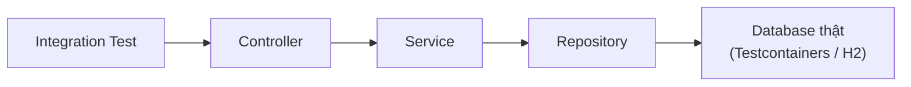

# 5. Integration Testing (Kiểm thử tích hợp)

Integration testing kiểm tra xem nhiều thành phần khi ghép lại có hoạt động đúng với nhau hay không, dùng phụ thuộc thật (như database) thay vì mock. Nó bắt được những lỗi mà unit test bỏ sót, ví dụ câu SQL sai hay cấu hình kết nối không khớp. Bài này giới thiệu test pyramid, `@SpringBootTest` và Testcontainers; chi tiết nằm bên dưới.

[](pathname:///img/java/integration-testing.webp)

---

:::note[Ghi nhớ nhanh]

- ⭐ **Integration test ghép nhiều thành phần với phụ thuộc THẬT** — dùng database thật thay vì mock, bắt được lỗi unit test bỏ sót (SQL sai, mapping sai).
- **`@SpringBootTest`** — khởi động toàn bộ application context; chậm nên đừng lạm dụng.
- ⭐ **Testcontainers** — chạy database thật (PostgreSQL...) trong Docker container tạm thời, cho kết quả đáng tin cậy (cần Docker).
- **Test Pyramid** — nhiều unit test, vừa phải integration test, ít E2E test.
- **Mỗi test tự tạo và dọn dữ liệu** — để độc lập, không phụ thuộc dữ liệu sẵn có.

:::

---

## Mục lục

- [Vì sao cần Integration Testing?](#vì-sao-cần-integration-testing)
- [Integration Test là gì?](#integration-test-là-gì)
- [Khác biệt với Unit Test](#khác-biệt-với-unit-test)
- [Kim tự tháp kiểm thử (Test Pyramid)](#kim-tự-tháp-kiểm-thử-test-pyramid)
- [@SpringBootTest trong Spring Boot](#springboottest-trong-spring-boot)
- [Vấn đề: test với database](#vấn-đề-test-với-database)
- [Testcontainers: database thật trong Docker](#testcontainers-database-thật-trong-docker)
- [Ví dụ test repository với database](#ví-dụ-test-repository-với-database)
- [Lỗi thường gặp](#lỗi-thường-gặp)
- [Tóm tắt](#tóm-tắt)
- [Câu hỏi phỏng vấn](#câu-hỏi-phỏng-vấn)

---

## Vì sao cần Integration Testing?

**Vấn đề:** Unit test mock toàn bộ các phụ thuộc (database, service khác, API ngoài), nên mỗi thành phần chạy đúng riêng lẻ mà vẫn có thể lỗi khi ghép thật. Các lỗi điển hình unit test **không bắt được**:

```java
// Unit test: mock repository → luôn pass vì không chạm DB thật
when(userRepository.save(any())).thenReturn(mockUser);

// Nhưng ở production, câu SQL sai kiểu dữ liệu → lỗi ngay khi ghi thật
// Ví dụ: cột `age` trong DB là INTEGER, nhưng entity ánh xạ sang String
@Column(name = "age")
private String age;  // sai kiểu → unit test không phát hiện, DB thật báo lỗi
```

Các tình huống thường gặp:
- Câu SQL sai cú pháp hoặc sai tên cột
- Ánh xạ entity (mapping) không khớp với schema database
- Cấu hình transaction (rollback/commit) sai
- Hai service hiểu sai định dạng dữ liệu truyền qua nhau

**Giải pháp:** Integration Testing chạy nhiều thành phần cùng nhau với **phụ thuộc thật** (database thật, Spring context thật), thường dùng Testcontainers hoặc H2 in-memory để bắt đúng các lỗi ghép nối này:

```java
// Integration test: dùng PostgreSQL thật trong Docker (Testcontainers)
@Testcontainers
@SpringBootTest
class UserRepositoryIntegrationTest {

    @Container
    static PostgreSQLContainer<?> postgres = new PostgreSQLContainer<>("postgres:16");

    @Autowired
    private UserRepository userRepository;  // repository + DB thật

    @Test
    void luuVaDocLai_phatHienLoi_anhXaSai() {
        User saved = userRepository.save(new User("An", "an@example.com"));
        // Nếu mapping sai kiểu → test fail ngay ở đây, trước khi lên production
        assertNotNull(userRepository.findById(saved.getId()).orElse(null));
    }
}
```

:::tip[Dùng thực tế]
- Kiểm tra repository đọc/ghi database đúng schema và kiểu dữ liệu
- Xác nhận transaction rollback/commit hoạt động đúng khi có lỗi
- Kiểm thử luồng từ Controller → Service → Repository trong Spring Boot
- Phát hiện lỗi cấu hình kết nối (datasource, connection pool) trước khi deploy
:::

## Integration Test là gì?

**Integration Test (kiểm thử tích hợp)** là loại test kiểm tra xem **nhiều thành phần khi ghép lại có hoạt động đúng với nhau hay không**.

Ở bài unit test, ta test **từng phần riêng lẻ** và **mock** mọi phụ thuộc. Nhưng đôi khi mỗi phần chạy đúng riêng lẻ mà ghép lại vẫn sai — ví dụ câu SQL viết sai, cấu hình kết nối database không khớp, hai service hiểu sai định dạng dữ liệu của nhau. Integration test bắt được những lỗi đó.

> Ví dụ đời thường: Mỗi linh kiện xe máy (động cơ, bánh xe, phanh) được kiểm tra riêng đã đạt chuẩn (unit test). Nhưng ta vẫn phải **lắp ráp hoàn chỉnh rồi chạy thử trên đường** để chắc chắn cả chiếc xe hoạt động (integration test).

## Khác biệt với Unit Test

| Tiêu chí | Unit Test | Integration Test |
|----------|-----------|------------------|
| Phạm vi | Một method/class | Nhiều thành phần ghép lại |
| Phụ thuộc | Mock hết (DB, API...) | Dùng thật (DB, service...) |
| Tốc độ | Rất nhanh (mili-giây) | Chậm hơn (giây) |
| Số lượng | Nhiều | Ít hơn |
| Bắt lỗi gì | Logic từng hàm | Lỗi khi ghép nối, cấu hình, SQL |

Cả hai loại đều cần thiết và **bổ sung cho nhau**, không thay thế nhau.

## Kim tự tháp kiểm thử (Test Pyramid)

**Test Pyramid (kim tự tháp kiểm thử)** là một nguyên tắc về tỉ lệ các loại test:

```
        /\
       /  \      E2E Test (ít nhất) - chậm, đắt
      /----\
     /      \    Integration Test (vừa phải)
    /--------\
   /          \  Unit Test (nhiều nhất) - nhanh, rẻ
  /____________\
```

- **Nhiều** unit test ở dưới đáy (nhanh, rẻ).
- **Vừa phải** integration test ở giữa.
- **Ít** end-to-end test (E2E) trên đỉnh (chậm, đắt, dễ vỡ).

Ý tưởng: ưu tiên test nhanh ở tầng thấp, chỉ dùng test chậm cho những luồng quan trọng.

## @SpringBootTest trong Spring Boot

Nếu bạn dùng **Spring Boot** (framework phổ biến để xây dựng ứng dụng Java), annotation **`@SpringBootTest`** sẽ khởi động **toàn bộ ngữ cảnh ứng dụng (application context)** khi test — tức là nạp tất cả các bean (đối tượng do Spring quản lý), cấu hình, kết nối... giống như chạy thật.

```java
import org.springframework.boot.test.context.SpringBootTest;
import org.springframework.beans.factory.annotation.Autowired;
import org.junit.jupiter.api.Test;
import static org.junit.jupiter.api.Assertions.assertNotNull;

@SpringBootTest  // khởi động toàn bộ ứng dụng để test tích hợp
class OrderServiceIntegrationTest {

    @Autowired  // Spring tự tiêm đối tượng thật vào (không phải mock)
    private OrderService orderService;

    @Test
    void serviceDuocNapDung() {
        // Kiểm tra Spring đã tạo và tiêm OrderService thật thành công
        assertNotNull(orderService);
    }
}
```

Khác với unit test (tạo đối tượng bằng `new` và mock thủ công), `@SpringBootTest` dùng **đối tượng thật do Spring tạo**, kết nối thật với nhau.

Sơ đồ dưới đây minh hoạ integration test kiểm tra cả luồng qua nhiều tầng **thật** (không mock):



## Vấn đề: test với database

Integration test thường cần một **database thật** để kiểm tra câu truy vấn. Nhưng dùng database production (thật của hệ thống) thì rất nguy hiểm: test có thể làm hỏng dữ liệu thật.

Các cách xử lý phổ biến:

1. **Database trong bộ nhớ (in-memory)** như **H2**: nhanh, tự xóa sau khi test. Nhược điểm: H2 không giống hệt database thật (ví dụ PostgreSQL), nên đôi khi test pass với H2 nhưng fail với production.
2. **Testcontainers**: chạy database thật (PostgreSQL, MySQL...) trong **Docker container** tạm thời. Đây là cách hiện đại và đáng tin cậy nhất.

## Testcontainers: database thật trong Docker

**Testcontainers** là một thư viện giúp **khởi động database (hoặc dịch vụ khác) thật bên trong Docker container** chỉ phục vụ cho test, rồi tự động dọn dẹp sau khi test xong.

Lợi ích: bạn test với **đúng loại database** dùng ở production (ví dụ PostgreSQL thật), nên kết quả đáng tin cậy. Điều kiện: máy chạy test phải cài **Docker**.

Cài đặt (Maven):

```xml
<dependency>
    <groupId>org.testcontainers</groupId>
    <artifactId>postgresql</artifactId>
    <version>1.19.7</version>
    <scope>test</scope>
</dependency>
<dependency>
    <groupId>org.testcontainers</groupId>
    <artifactId>junit-jupiter</artifactId>
    <version>1.19.7</version>
    <scope>test</scope>
</dependency>
```

Ví dụ khởi tạo một PostgreSQL container cho test:

```java
import org.testcontainers.containers.PostgreSQLContainer;
import org.testcontainers.junit.jupiter.Container;
import org.testcontainers.junit.jupiter.Testcontainers;

@Testcontainers  // bật tích hợp Testcontainers với JUnit 5
@SpringBootTest
class UserRepositoryIntegrationTest {

    // Khởi động một PostgreSQL thật trong Docker, dùng riêng cho test
    @Container
    static PostgreSQLContainer<?> postgres =
        new PostgreSQLContainer<>("postgres:16")
            .withDatabaseName("testdb")
            .withUsername("test")
            .withPassword("test");

    // Testcontainers tự cung cấp URL/cổng động, Spring sẽ kết nối tới đây
    // (thường cấu hình qua @DynamicPropertySource)
}
```

> Vì sao không cài PostgreSQL cố định trên máy CI? Vì Testcontainers tự tạo container **sạch** mỗi lần chạy, không lo dữ liệu cũ làm bẩn test, và mọi lập trình viên đều có môi trường giống nhau.

## Ví dụ test repository với database

Giả sử có một `UserRepository` lưu/đọc người dùng từ database. Integration test sẽ ghi vào database thật (trong container) rồi đọc lại để kiểm tra.

```java
import org.junit.jupiter.api.Test;
import org.springframework.beans.factory.annotation.Autowired;
import org.springframework.boot.test.context.SpringBootTest;
import static org.junit.jupiter.api.Assertions.assertEquals;
import static org.junit.jupiter.api.Assertions.assertNotNull;

@Testcontainers
@SpringBootTest
class UserRepositoryIntegrationTest {

    @Container
    static PostgreSQLContainer<?> postgres =
        new PostgreSQLContainer<>("postgres:16");

    @Autowired
    private UserRepository userRepository;  // repository thật, kết nối DB thật

    @Test
    void luuVaTimNguoiDung() {
        // Arrange: tạo người dùng mới
        User user = new User("An", "an@example.com");

        // Act: lưu vào database thật rồi tìm lại theo id
        User saved = userRepository.save(user);
        User found = userRepository.findById(saved.getId()).orElse(null);

        // Assert: dữ liệu đọc lại phải khớp
        assertNotNull(found);                       // tìm thấy
        assertEquals("An", found.getName());        // đúng tên
        assertEquals("an@example.com", found.getEmail()); // đúng email
    }
}
```

Test này bắt được những lỗi mà unit test không thấy: ánh xạ entity (mapping) sai cột, kiểu dữ liệu không khớp, ràng buộc khóa... vì nó dùng database thật.

## Lỗi thường gặp

1. **Lạm dụng `@SpringBootTest`**: Nó khởi động cả ứng dụng nên rất **chậm**. Đừng dùng cho mọi test — chỉ dùng khi thật sự cần kiểm thử tích hợp.
2. **Test phụ thuộc dữ liệu sẵn có**: Nếu test giả định database đã có sẵn vài bản ghi, nó sẽ fail trên môi trường sạch. Mỗi test nên tự tạo dữ liệu mình cần.
3. **Không dọn dữ liệu giữa các test**: Test trước để lại dữ liệu làm hỏng test sau. Dùng transaction rollback hoặc xóa dữ liệu sau mỗi test.
4. **Quên cài Docker khi dùng Testcontainers**: Testcontainers cần Docker đang chạy, nếu không sẽ lỗi ngay khi khởi động container.
5. **Trộn lẫn unit và integration test không phân loại**: Khiến bộ test chạy chậm. Nên tách riêng (ví dụ đặt tên `*IT.java`) để chạy chọn lọc.

## Tóm tắt

- **Integration Test** kiểm tra nhiều thành phần phối hợp với nhau, dùng phụ thuộc **thật** thay vì mock.
- Khác unit test ở chỗ: phạm vi rộng hơn, chậm hơn, ít hơn, nhưng bắt được lỗi ghép nối và cấu hình.
- **Test Pyramid**: nhiều unit test, vừa phải integration test, ít E2E test.
- **`@SpringBootTest`** khởi động toàn bộ ứng dụng Spring Boot cho integration test.
- **Testcontainers** chạy database thật trong Docker container tạm thời, cho kết quả đáng tin cậy (cần Docker).
- Bài tiếp theo: **REST Assured** — test các REST API.

---

## Câu hỏi phỏng vấn

Những câu thường gặp về chủ đề này. Tự trả lời trước, rồi bấm **Xem đáp án** để đối chiếu.

**1. Integration test khác unit test ở những điểm cốt lõi nào? Nêu một loại lỗi cụ thể mà unit test không thể bắt được nhưng integration test bắt được.**

<details className="qa">
<summary>Xem đáp án</summary>

| Tiêu chí | Unit test | Integration test |
|---|---|---|
| Phạm vi | Một method/class, cô lập | Nhiều thành phần ghép lại |
| Phụ thuộc | Mock hoàn toàn | Dùng thật (database, service khác) |
| Tốc độ | Rất nhanh (mili-giây) | Chậm hơn (giây) |

- **Ví dụ lỗi unit test bỏ sót**: entity Java ánh xạ (mapping) sai kiểu dữ liệu so với schema thật của database (ví dụ cột `age` trong DB là `INTEGER` nhưng field Java khai báo `String`). Vì unit test dùng mock (`when(repository.save(any())).thenReturn(mockUser)`), câu lệnh SQL thật **không bao giờ được thực thi**, nên lỗi mapping/kiểu dữ liệu hoàn toàn không bị phát hiện — chỉ khi integration test chạy với database thật, lỗi mới lộ ra.
- Cả hai loại test **bổ sung cho nhau**, không thay thế nhau: unit test nhanh để kiểm tra logic thuần túy, integration test chậm hơn nhưng bắt được lỗi khi các thành phần thực sự ghép nối với nhau.

</details>

**2. Test Pyramid (kim tự tháp kiểm thử) khuyến nghị tỉ lệ như thế nào giữa unit test, integration test và E2E test? Vì sao lại theo tỉ lệ đó thay vì viết thật nhiều E2E test để "chắc ăn"?**

<details className="qa">
<summary>Xem đáp án</summary>

Test Pyramid khuyến nghị: **nhiều** unit test ở đáy, **vừa phải** integration test ở giữa, **ít** E2E test trên đỉnh.

Lý do không nên viết quá nhiều E2E test:

- **Chi phí thời gian**: E2E test (chạy qua toàn bộ hệ thống, thường qua UI hoặc HTTP thật) chậm hơn unit test hàng trăm đến hàng nghìn lần — một bộ E2E test lớn có thể mất hàng giờ để chạy hết, làm chậm vòng phản hồi (feedback loop) của lập trình viên.
- **Dễ vỡ (fragile)**: E2E test phụ thuộc vào nhiều thành phần cùng lúc (UI, network, nhiều service), nên dễ fail vì lý do không liên quan tới bug thực sự (ví dụ timeout mạng, phần tử UI đổi vị trí), gây "flaky test" khó tin cậy.
- **Khó xác định nguyên nhân lỗi**: khi một E2E test fail, phải điều tra qua rất nhiều tầng mới tìm ra nguyên nhân gốc, trong khi unit test fail thường chỉ ra chính xác dòng code có vấn đề.
- Chiến lược tối ưu: dùng unit test để bắt phần lớn lỗi logic nhanh và rẻ, dùng integration/E2E test có chọn lọc cho những luồng nghiệp vụ quan trọng nhất.

</details>

**3. `@SpringBootTest` làm gì khi chạy một test? Vì sao tài liệu khuyến cáo không nên dùng annotation này cho mọi test?**

<details className="qa">
<summary>Xem đáp án</summary>

`@SpringBootTest` khởi động **toàn bộ application context** của Spring Boot khi chạy test — nạp tất cả bean, cấu hình, kết nối datasource... giống hệt như khi chạy ứng dụng thật, thay vì tự tạo đối tượng bằng `new` và mock thủ công như unit test.

- Vì phải khởi động **toàn bộ** context (có thể gồm hàng trăm bean, kết nối database, message queue...), `@SpringBootTest` **chậm hơn đáng kể** so với unit test thông thường — mỗi lần chạy có thể mất vài giây tới hàng chục giây, tùy độ phức tạp của ứng dụng.
- Nếu dùng cho **mọi** test (kể cả những test chỉ cần kiểm tra logic đơn giản của một class), tổng thời gian chạy toàn bộ test suite sẽ tăng vọt, làm chậm cả vòng lặp phát triển (build, CI/CD).
- Khuyến nghị: chỉ dùng `@SpringBootTest` khi **thực sự cần kiểm thử tích hợp** (ví dụ kiểm tra luồng Controller → Service → Repository hoạt động đúng khi ghép lại), còn lại nên dùng unit test thuần với mock, hoặc các annotation "slice test" nhẹ hơn.

</details>

**4. So sánh H2 in-memory database với Testcontainers khi viết integration test. Vì sao Testcontainers được xem là lựa chọn "đáng tin cậy hơn"?**

<details className="qa">
<summary>Xem đáp án</summary>

| Tiêu chí | H2 (in-memory) | Testcontainers |
|---|---|---|
| Tốc độ khởi động | Rất nhanh | Chậm hơn (phải khởi động container Docker) |
| Độ giống production | Không hoàn toàn giống (khác cú pháp SQL, khác hành vi với PostgreSQL/MySQL thật) | Giống hệt vì dùng **đúng loại database thật** (ví dụ PostgreSQL thật) |
| Yêu cầu môi trường | Không cần gì thêm | Cần **Docker** đang chạy trên máy |

- Vấn đề của H2: nó cố gắng **giả lập** hành vi của các database khác (chế độ tương thích PostgreSQL, MySQL...), nhưng không bao giờ giống 100% — một số cú pháp SQL đặc thù, hành vi ràng buộc, hay kiểu dữ liệu riêng của database thật có thể hoạt động khác với H2, dẫn tới tình huống **test pass với H2 nhưng fail (hoặc tệ hơn, lỗi âm thầm) khi chạy với database production thật**.
- Testcontainers giải quyết triệt để vấn đề này bằng cách chạy **chính loại database dùng ở production** (ví dụ PostgreSQL 16) trong Docker container tạm thời — đảm bảo kết quả test phản ánh đúng hành vi thực tế, đổi lại phải chấp nhận tốc độ chậm hơn và yêu cầu môi trường có Docker.

</details>

**5. Test sau có nguy cơ gì khi chạy trên một database "sạch" (mới khởi tạo, chưa có dữ liệu)?**

```java
@Test
void timNguoiDungThuBa() {
    List<User> users = userRepository.findAll();
    User nguoiThuBa = users.get(2);  // giả định đã có sẵn ít nhất 3 người dùng
    assertEquals("An", nguoiThuBa.getName());
}
```

<details className="qa">
<summary>Xem đáp án</summary>

**Nguy cơ**: test này **giả định database đã có sẵn dữ liệu từ trước** (ít nhất 3 bản ghi `User`, với người thứ ba tên "An") — vi phạm nguyên tắc mỗi test phải **tự tạo dữ liệu nó cần**.

- Trên một database "sạch" (ví dụ container Testcontainers mới khởi tạo, hoặc môi trường CI chạy từ đầu), bảng `users` sẽ **rỗng**, khiến `users.get(2)` ném ra `IndexOutOfBoundsException` ngay lập tức, chứ không fail ở assertion như mong đợi.
- Ngay cả khi database có dữ liệu sẵn, thứ tự trả về của `findAll()` **không được đảm bảo** (trừ khi có `ORDER BY` rõ ràng), nên việc giả định "người thứ ba" luôn là "An" là không đáng tin cậy.
- Cách sửa đúng: trong chính test đó (hoặc `@BeforeEach`), **tự tạo** dữ liệu người dùng cần thiết trước khi thực hiện assertion, đảm bảo test độc lập và chạy đúng trên bất kỳ môi trường nào.

</details>

**6. Vì sao mỗi integration test cần "dọn dẹp" dữ liệu sau khi chạy (hoặc đảm bảo không để lại dữ liệu ảnh hưởng test khác)? Nêu hai cách phổ biến để đảm bảo điều này.**

<details className="qa">
<summary>Xem đáp án</summary>

Nếu một test ghi dữ liệu vào database thật mà không dọn dẹp, **dữ liệu đó tồn tại xuyên suốt các test tiếp theo** — có thể khiến test sau bị ảnh hưởng (ví dụ test đếm số bản ghi trong bảng sẽ ra kết quả sai vì đã có dữ liệu "rác" từ test trước), vi phạm nguyên tắc **Independent** và **Repeatable**.

Hai cách phổ biến:

- **Transaction rollback tự động**: dùng `@Transactional` trên class/method test (kết hợp Spring TestContext Framework) — mỗi test method chạy trong một transaction riêng, và Spring **tự động rollback** transaction đó ngay sau khi test kết thúc, bất kể test pass hay fail, đưa database về trạng thái trước khi test chạy mà không cần dọn dẹp thủ công.
- **Xóa dữ liệu thủ công**: dùng `@AfterEach` để chủ động xóa các bản ghi đã tạo, hoặc dùng container Docker **mới hoàn toàn** cho mỗi lần chạy test suite (cách Testcontainers thường áp dụng ở cấp độ class/suite).

</details>

**7. `@DynamicPropertySource` dùng để làm gì khi kết hợp Testcontainers với Spring Boot? Vì sao không thể khai báo cứng URL database trong file `application.properties` khi dùng Testcontainers?**

<details className="qa">
<summary>Xem đáp án</summary>

Khi Testcontainers khởi động một container database (ví dụ PostgreSQL), nó **tự chọn một cổng (port) ngẫu nhiên** trên máy host để tránh xung đột với các service khác đang chạy — nghĩa là URL kết nối, cổng, và đôi khi cả host, đều **không cố định trước**, chỉ biết được **sau khi** container đã khởi động thành công.

```java
@DynamicPropertySource
static void configureProperties(DynamicPropertyRegistry registry) {
    registry.add("spring.datasource.url", postgres::getJdbcUrl);
    registry.add("spring.datasource.username", postgres::getUsername);
    registry.add("spring.datasource.password", postgres::getPassword);
}
```

- `@DynamicPropertySource` cho phép đăng ký các property Spring (như `spring.datasource.url`) **động, tại thời điểm chạy test**, lấy giá trị thực tế từ container đã khởi động (qua `postgres.getJdbcUrl()`), thay vì phải biết trước một giá trị cố định.
- Nếu khai báo cứng URL trong `application.properties` (ví dụ `jdbc:postgresql://localhost:5432/testdb`), giá trị đó sẽ **không khớp** với cổng thực tế mà container đang lắng nghe, khiến Spring không thể kết nối tới đúng database vừa được Testcontainers tạo ra.

</details>

**8. Vì sao nhiều dự án tách riêng unit test và integration test bằng quy ước đặt tên (ví dụ `*Test.java` cho unit test, `*IT.java` cho integration test)? Điều này liên quan gì tới các plugin Maven như Surefire và Failsafe?**

<details className="qa">
<summary>Xem đáp án</summary>

- Tách riêng để có thể **chạy chọn lọc** từng loại test theo nhu cầu: chạy unit test nhanh trong mỗi lần build thông thường, chỉ chạy integration test (chậm hơn, cần Docker/database) ở giai đoạn phù hợp của pipeline CI/CD (ví dụ trước khi merge, hoặc trong một job riêng).
- Trong hệ sinh thái Maven, quy ước phổ biến:
  - Plugin **Surefire** (chạy ở phase `test`) mặc định chỉ nhận diện các class có tên khớp mẫu như `*Test.java`, `Test*.java` — dùng cho **unit test**.
  - Plugin **Failsafe** (chạy ở phase `integration-test`, sau `package`) mặc định nhận diện các class có tên khớp mẫu như `*IT.java`, `*ITCase.java` — dùng cho **integration test**, và chạy `mvn verify` mới kích hoạt các test này.
- Nhờ quy ước tên rõ ràng, lệnh `mvn test` (chạy Surefire) sẽ **không** vô tình chạy các integration test chậm, giữ vòng lặp phát triển hàng ngày nhanh, trong khi `mvn verify` (chạy cả Surefire lẫn Failsafe) đảm bảo kiểm tra đầy đủ trước khi release.

</details>

**9. Ngoài `@SpringBootTest`, Spring Boot còn cung cấp các annotation "slice test" nhẹ hơn như `@DataJpaTest` hay `@WebMvcTest`. Chúng khác `@SpringBootTest` như thế nào, và khi nào nên ưu tiên dùng chúng?**

<details className="qa">
<summary>Xem đáp án</summary>

- **`@SpringBootTest`**: nạp **toàn bộ** application context (mọi bean, mọi tầng — Controller, Service, Repository, cấu hình bảo mật...).
- **`@DataJpaTest`**: chỉ nạp các bean liên quan tới **tầng dữ liệu (JPA)** — repository, entity manager, datasource — bỏ qua Controller/Service, giúp test tập trung đúng vào tầng persistence và khởi động nhanh hơn nhiều so với nạp cả ứng dụng. Mặc định còn tự cấu hình một database in-memory (trừ khi được cấu hình lại để dùng Testcontainers) và bọc mỗi test trong transaction tự rollback.
- **`@WebMvcTest`**: chỉ nạp tầng **web (Controller)**, mock các bean tầng Service bên dưới (thường kết hợp với `@MockBean`), phù hợp để test riêng logic xử lý HTTP request/response mà không cần khởi động toàn bộ ứng dụng.
- Nên ưu tiên dùng các "slice test" này khi chỉ cần kiểm thử tích hợp cho **một tầng cụ thể** (ví dụ chỉ muốn kiểm tra query JPA có đúng không), giúp test chạy nhanh hơn đáng kể so với `@SpringBootTest`, chỉ dùng `@SpringBootTest` đầy đủ khi thực sự cần kiểm tra sự phối hợp giữa **nhiều tầng cùng lúc**.

</details>

**10. Một service gọi tới một API bên ngoài (ví dụ cổng thanh toán) thông qua HTTP. Khi viết integration test cho luồng này, có nên gọi thẳng tới API thật của bên thứ ba không? Nêu cách tiếp cận phù hợp hơn.**

<details className="qa">
<summary>Xem đáp án</summary>

**Không nên** gọi thẳng API thật của bên thứ ba trong integration test, vì:

- **Không kiểm soát được**: API bên ngoài có thể chậm, gián đoạn, hoặc thay đổi hành vi bất cứ lúc nào — khiến test không ổn định (flaky), vi phạm nguyên tắc Repeatable.
- **Tốn kém/nguy hiểm**: gọi API thanh toán thật có thể **trừ tiền thật**, hoặc bị tính phí theo lượt gọi.
- **Phụ thuộc mạng**: test chạy trong CI/CD (thường trong mạng nội bộ hạn chế) có thể không truy cập được internet ra ngoài.

Cách tiếp cận phù hợp hơn:

- Dùng một **mock server HTTP** (ví dụ WireMock) chạy cục bộ, giả lập response của API bên thứ ba với các tình huống mong muốn (thành công, lỗi, timeout).
- Hoặc dùng Testcontainers để chạy một **bản giả lập/sandbox** của service đó nếu nhà cung cấp có hỗ trợ container test riêng.
- Chỉ gọi API thật của bên thứ ba trong một môi trường **staging riêng biệt, có kiểm soát**, không phải trong bộ integration test chạy tự động thường xuyên.

</details>

**11. Giải thích vì sao integration test dùng `@Transactional` để tự động rollback sau mỗi test lại KHÔNG phù hợp để kiểm tra hành vi commit/rollback thực tế của transaction trong code nghiệp vụ.**

<details className="qa">
<summary>Xem đáp án</summary>

- Khi dùng `@Transactional` ở **cấp độ test** (Spring TestContext Framework), toàn bộ test method chạy trong **một transaction bao trùm bên ngoài**, và Spring tự động rollback transaction đó sau khi test kết thúc — bất kể code nghiệp vụ bên trong có gọi commit hay không, vì bản thân transaction ở cấp method thường chỉ tham gia (participate) vào transaction bao trùm của test, không tự commit độc lập.
- Nếu mục tiêu của test là **xác nhận rằng transaction commit/rollback đúng theo logic nghiệp vụ** (ví dụ: "khi có lỗi giữa chừng, toàn bộ thay đổi phải rollback, không được lưu một phần"), việc bọc thêm một transaction rollback tự động ở cấp test có thể **che giấu** vấn đề thực sự — vì dữ liệu luôn bị rollback ở cuối bởi test framework, không phản ánh đúng việc code nghiệp vụ có tự commit/rollback đúng cách hay không trong một transaction độc lập thực sự.
- Giải pháp: với loại test cần kiểm tra hành vi transaction thực sự, nên **tắt** rollback tự động của test (ví dụ dùng `@Commit` hoặc không dùng `@Transactional` ở cấp test), và tự kiểm tra/dọn dẹp dữ liệu bằng cách khác (ví dụ mở một kết nối/transaction riêng biệt để verify dữ liệu đã thực sự được commit vào database).

</details>
