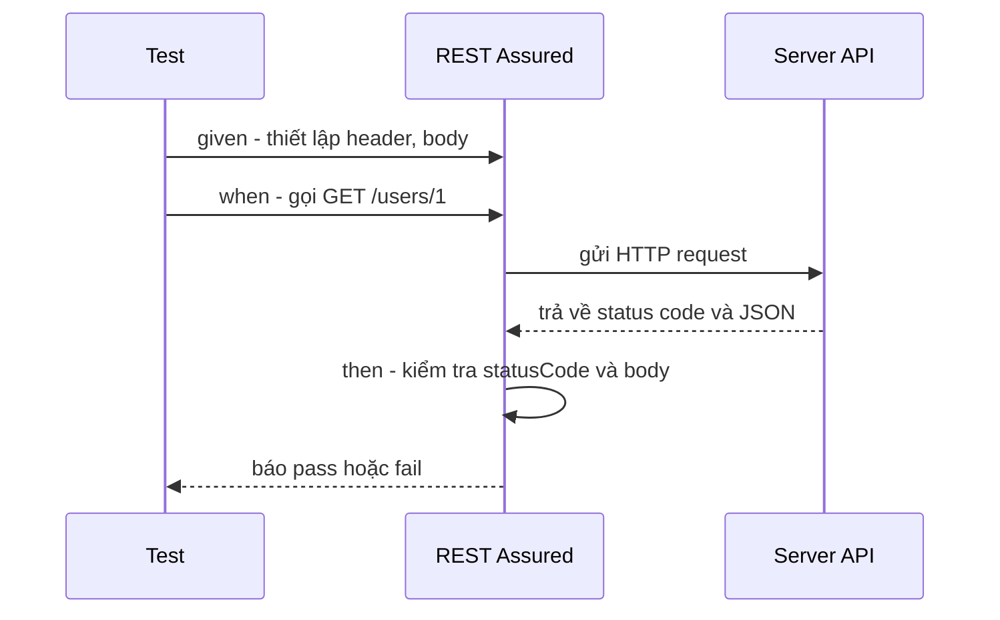

# 6. REST Assured

REST Assured là thư viện Java giúp test các REST API với cú pháp dễ đọc gần như tiếng Anh tự nhiên (given - when - then). Thay vì tự viết code gửi HTTP, đọc JSON rồi so sánh, bạn viết test ngắn gọn để kiểm tra status code và nội dung phản hồi. Bài này hướng dẫn cách dùng REST Assured qua nhiều ví dụ; chi tiết nằm bên dưới.

[](pathname:///img/java/rest-assured.webp)

---

:::note[Ghi nhớ nhanh]

- ⭐ **REST Assured test REST API với cú pháp `given()` → `when()` → `then()`** — đọc gần như tiếng Anh tự nhiên.
- **`statusCode(...)`** — kiểm tra mã trạng thái HTTP (200, 201, 404, 400...).
- **JsonPath + matcher Hamcrest** — dùng `equalTo`, `hasItem`, `hasSize`... để kiểm tra nội dung JSON trong body.
- **Gửi POST** — bằng `.body(...)` kèm header `Content-Type: application/json`.
- ⭐ **Nên test cả trường hợp thành công lẫn lỗi** — và nhớ server phải đang chạy vì REST Assured gọi API thật.

:::

---

## Mục lục

- [Vì sao REST Assured ra đời?](#vì-sao-rest-assured-ra-đời)
- [REST Assured là gì?](#rest-assured-là-gì)
- [Ôn lại nhanh: REST API là gì?](#ôn-lại-nhanh-rest-api-là-gì)
- [Cài đặt REST Assured](#cài-đặt-rest-assured)
- [Cú pháp given - when - then](#cú-pháp-given---when---then)
- [Kiểm tra status code](#kiểm-tra-status-code)
- [Kiểm tra nội dung JSON trong body](#kiểm-tra-nội-dung-json-trong-body)
- [Gửi dữ liệu trong request (POST)](#gửi-dữ-liệu-trong-request-post)
- [Ví dụ đầy đủ](#ví-dụ-đầy-đủ)
- [Lỗi thường gặp](#lỗi-thường-gặp)
- [Tóm tắt](#tóm-tắt)
- [Câu hỏi phỏng vấn](#câu-hỏi-phỏng-vấn)

---

## Vì sao REST Assured ra đời?

**Vấn đề:** Trước đây, để test một REST API trong Java, lập trình viên phải dùng `HttpURLConnection` hoặc `HttpClient` thuần — tự build request, set header, gửi, đọc `InputStream`, rồi parse JSON bằng tay trước khi assert từng trường. Kết quả là đoạn code dài dòng, khó đọc, và dễ bỏ sót:

```java
// Cách cũ — dài dòng, khó bảo trì
URL url = new URL("http://localhost:8080/users/1");
HttpURLConnection conn = (HttpURLConnection) url.openConnection();
conn.setRequestMethod("GET");

int status = conn.getResponseCode();
assert status == 200;

BufferedReader reader = new BufferedReader(new InputStreamReader(conn.getInputStream()));
StringBuilder sb = new StringBuilder();
String line;
while ((line = reader.readLine()) != null) sb.append(line);
reader.close();

// Parse JSON thủ công rồi mới assert được
String body = sb.toString();
assert body.contains("\"name\":\"An\"");
```

**Giải pháp:** REST Assured cung cấp DSL kiểu `given / when / then` — đọc gần như tiếng Anh, tích hợp sẵn JsonPath để truy cập từng trường JSON, validate status/header/body chỉ trong vài dòng:

```java
// Với REST Assured — ngắn gọn, dễ đọc
given()
    .baseUri("http://localhost:8080")
.when()
    .get("/users/1")
.then()
    .statusCode(200)
    .body("name", equalTo("An"));
```

:::tip[Dùng thực tế]
- Viết integration test cho Spring Boot controller mà không cần mock toàn bộ HTTP layer.
- Kiểm tra response schema của một microservice sau mỗi lần deploy.
- Tự động hoá smoke test để xác nhận API endpoint trả đúng dữ liệu sau release.
- Test các trường hợp lỗi (404, 400, 401) để đảm bảo server xử lý ngoại lệ đúng.
:::

## REST Assured là gì?

**REST Assured** là một thư viện Java giúp **test (kiểm thử) các REST API** một cách dễ đọc, gần như viết bằng tiếng Anh tự nhiên.

Thay vì viết code thủ công để gửi yêu cầu HTTP, đọc phản hồi, phân tích JSON rồi so sánh, REST Assured cho phép bạn viết gọn theo kiểu:

> "**Cho** (given) các điều kiện này, **khi** (when) gọi API kia, **thì** (then) kết quả phải như thế này."

Đây là công cụ rất phổ biến để kiểm thử **API tích hợp** (gọi API thật và kiểm tra phản hồi).

## Ôn lại nhanh: REST API là gì?

**REST API** là cách các ứng dụng giao tiếp với nhau qua giao thức HTTP. Một lời gọi API gồm:

- **Method (phương thức)**: `GET` (lấy dữ liệu), `POST` (tạo mới), `PUT` (cập nhật), `DELETE` (xóa).
- **URL (đường dẫn)**: ví dụ `/users/1`.
- **Body (nội dung)**: dữ liệu gửi đi, thường ở dạng **JSON**.
- **Response (phản hồi)**: gồm **status code (mã trạng thái)** như `200` (thành công), `404` (không tìm thấy), `201` (đã tạo), và **body** chứa dữ liệu trả về.

> Ví dụ đời thường: API như nhân viên phục vụ ở nhà hàng. Bạn (client) gọi món (request), nhân viên mang đồ ăn ra (response). Mã `200` nghĩa là "đã phục vụ xong", `404` nghĩa là "món này không có trong menu".

## Cài đặt REST Assured

Với **Maven**:

```xml
<dependency>
    <groupId>io.rest-assured</groupId>
    <artifactId>rest-assured</artifactId>
    <version>5.4.0</version>
    <scope>test</scope>
</dependency>
```

Với **Gradle**:

```groovy
testImplementation 'io.rest-assured:rest-assured:5.4.0'
```

## Cú pháp given - when - then

REST Assured dùng ba từ khóa nối tiếp nhau, đọc như một câu tiếng Anh:

- **`given()`** — *Cho*: thiết lập điều kiện trước khi gọi (header, tham số, body...).
- **`when()`** — *Khi*: thực hiện lời gọi (`get`, `post`...).
- **`then()`** — *Thì*: kiểm tra kết quả (status code, body...).

```java
import static io.restassured.RestAssured.given;
import static org.hamcrest.Matchers.equalTo;
import org.junit.jupiter.api.Test;

class UserApiTest {

    @Test
    void layThongTinNguoiDung() {
        given()                                  // Cho: (không cần thiết lập gì thêm)
            .baseUri("http://localhost:8080")    // địa chỉ gốc của server
        .when()
            .get("/users/1")                     // Khi: gọi GET /users/1
        .then()
            .statusCode(200)                     // Thì: mã trạng thái phải là 200
            .body("name", equalTo("An"));        // và trường name phải là "An"
    }
}
```

Sơ đồ tuần tự dưới đây minh hoạ luồng một test REST Assured gọi API thật rồi kiểm tra phản hồi:



## Kiểm tra status code

Phương thức **`statusCode(...)`** kiểm tra mã trạng thái HTTP của phản hồi:

```java
@Test
void kiemTraCacMaTrangThai() {
    // Người dùng tồn tại -> 200 OK
    given().baseUri("http://localhost:8080")
        .when().get("/users/1")
        .then().statusCode(200);

    // Người dùng không tồn tại -> 404 Not Found
    given().baseUri("http://localhost:8080")
        .when().get("/users/9999")
        .then().statusCode(404);
}
```

Các mã thường gặp: `200` (OK), `201` (Created - đã tạo), `204` (No Content - thành công nhưng không trả body), `400` (Bad Request - dữ liệu sai), `401` (chưa xác thực), `404` (không tìm thấy), `500` (lỗi server).

## Kiểm tra nội dung JSON trong body

Giả sử API trả về JSON:

```json
{
  "id": 1,
  "name": "An",
  "email": "an@example.com",
  "roles": ["admin", "user"]
}
```

REST Assured dùng cú pháp **JsonPath** để truy cập từng trường, kết hợp với các **matcher** của thư viện Hamcrest như `equalTo`, `hasItem`, `hasSize`:

```java
import static org.hamcrest.Matchers.*;

@Test
void kiemTraNoiDungJson() {
    given().baseUri("http://localhost:8080")
        .when().get("/users/1")
        .then()
            .statusCode(200)
            .body("id", equalTo(1))                  // trường id = 1
            .body("name", equalTo("An"))             // trường name = "An"
            .body("email", containsString("@"))      // email chứa ký tự @
            .body("roles", hasSize(2))               // mảng roles có 2 phần tử
            .body("roles", hasItem("admin"));        // roles chứa "admin"
}
```

> JsonPath dùng dấu chấm để đi sâu vào JSON lồng nhau, ví dụ `"address.city"` lấy `city` bên trong `address`.

## Gửi dữ liệu trong request (POST)

Khi tạo mới dữ liệu, ta gửi JSON trong body bằng `.body(...)` và đặt header `Content-Type`:

```java
import static io.restassured.RestAssured.given;
import static org.hamcrest.Matchers.equalTo;
import static org.hamcrest.Matchers.notNullValue;

@Test
void taoNguoiDungMoi() {
    String jsonGui = """
        {
          "name": "Bình",
          "email": "binh@example.com"
        }
        """;

    given()
        .baseUri("http://localhost:8080")
        .header("Content-Type", "application/json")  // báo server đây là JSON
        .body(jsonGui)                                // nội dung gửi đi
    .when()
        .post("/users")                               // gọi POST /users
    .then()
        .statusCode(201)                              // 201 = đã tạo thành công
        .body("id", notNullValue())                   // server trả về id mới (khác null)
        .body("name", equalTo("Bình"));               // tên đúng như đã gửi
}
```

## Ví dụ đầy đủ

Một bộ test hoàn chỉnh cho API người dùng, dùng `@BeforeAll` để cấu hình địa chỉ gốc một lần:

```java
import io.restassured.RestAssured;
import org.junit.jupiter.api.BeforeAll;
import org.junit.jupiter.api.Test;
import static io.restassured.RestAssured.given;
import static org.hamcrest.Matchers.*;

class UserApiTest {

    @BeforeAll  // chạy một lần: đặt địa chỉ gốc cho mọi test
    static void setUp() {
        RestAssured.baseURI = "http://localhost:8080";
    }

    @Test
    void layNguoiDungTonTai() {
        given()
        .when().get("/users/1")
        .then()
            .statusCode(200)
            .body("name", equalTo("An"));
    }

    @Test
    void layNguoiDungKhongTonTaiTraVe404() {
        given()
        .when().get("/users/9999")
        .then().statusCode(404);
    }

    @Test
    void taoNguoiDungMoiThanhCong() {
        given()
            .header("Content-Type", "application/json")
            .body("{ \"name\": \"Bình\", \"email\": \"binh@example.com\" }")
        .when().post("/users")
        .then()
            .statusCode(201)
            .body("id", notNullValue());
    }

    @Test
    void taoNguoiDungThieuTenTraVe400() {
        given()
            .header("Content-Type", "application/json")
            .body("{ \"email\": \"loi@example.com\" }")  // thiếu name -> dữ liệu sai
        .when().post("/users")
        .then().statusCode(400);  // server từ chối với 400 Bad Request
    }
}
```

> Lưu ý: các test này cần server đang chạy ở `localhost:8080`. Trong dự án Spring Boot, ta thường kết hợp với `@SpringBootTest(webEnvironment = RANDOM_PORT)` để tự khởi động server khi test.

## Lỗi thường gặp

1. **Quên server chưa chạy**: REST Assured gọi API thật, nếu server không chạy sẽ lỗi kết nối. Hãy đảm bảo server (hoặc môi trường test) đã sẵn sàng.
2. **Quên header `Content-Type`**: Gửi JSON mà không khai báo `application/json` khiến server không hiểu body, thường trả về `415` hoặc `400`.
3. **Sai JsonPath**: Viết sai tên trường (ví dụ `userName` thay vì `name`) làm test fail dù API đúng. Kiểm tra kỹ cấu trúc JSON thực tế.
4. **Hard-code URL cố định**: Viết cứng cổng `8080` gây lỗi khi chạy với cổng ngẫu nhiên. Nên lấy cổng động khi tích hợp Spring Boot.
5. **Không kiểm tra cả trường hợp lỗi**: Chỉ test "đường đi đúng" mà quên test 404/400 khiến bỏ sót lỗi xử lý ngoại lệ của API.

## Tóm tắt

- **REST Assured** là thư viện Java để test REST API với cú pháp dễ đọc như tiếng Anh.
- Cú pháp cốt lõi: **`given()`** (cho) → **`when()`** (khi gọi) → **`then()`** (thì kiểm tra).
- **`statusCode(...)`** kiểm tra mã trạng thái HTTP (200, 201, 404, 400...).
- Dùng **JsonPath** + matcher (`equalTo`, `hasItem`, `hasSize`...) để kiểm tra nội dung JSON trong body.
- Gửi dữ liệu POST bằng `.body(...)` kèm header `Content-Type: application/json`.
- Nên test cả trường hợp thành công lẫn trường hợp lỗi.
- Bài tiếp theo: **JMeter** — công cụ test hiệu năng và tải.

---

## Câu hỏi phỏng vấn

Những câu thường gặp về chủ đề này. Tự trả lời trước, rồi bấm **Xem đáp án** để đối chiếu.

**1. REST Assured giải quyết vấn đề gì so với việc test API bằng `HttpURLConnection`/`HttpClient` thuần?**

<details className="qa">
<summary>Xem đáp án</summary>

- Với `HttpURLConnection`/`HttpClient` thuần, lập trình viên phải tự làm mọi bước thủ công: mở kết nối, set method/header, gửi request, đọc `InputStream`, tự parse JSON bằng tay rồi mới so sánh từng trường — code dài dòng, dễ bỏ sót lỗi, khó đọc.
- REST Assured cung cấp một **DSL (domain-specific language)** theo cú pháp `given() → when() → then()`, tích hợp sẵn khả năng phân tích JSON (qua JsonPath) và các matcher Hamcrest, cho phép viết test ngắn gọn, gần như đọc bằng tiếng Anh tự nhiên, chỉ trong vài dòng thay vì hàng chục dòng code thủ công.

</details>

**2. Giải thích ý nghĩa từng phần trong cấu trúc `given() → when() → then()` của REST Assured.**

<details className="qa">
<summary>Xem đáp án</summary>

```java
given()
    .baseUri("http://localhost:8080")
.when()
    .get("/users/1")
.then()
    .statusCode(200)
    .body("name", equalTo("An"));
```

- **`given()`** ("cho"): thiết lập các **điều kiện tiên quyết** trước khi gọi API — địa chỉ gốc (`baseUri`), header, tham số, body cần gửi.
- **`when()`** ("khi"): thực hiện **hành động gọi API** thật sự — chọn HTTP method (`get`, `post`, `put`, `delete`) và đường dẫn endpoint.
- **`then()`** ("thì"): **kiểm tra kết quả** trả về từ server — status code, header phản hồi, và nội dung body.

Cấu trúc này tương tự tinh thần của mô hình AAA (Arrange - Act - Assert) trong unit test, nhưng được đặt tên theo phong cách BDD (Behavior-Driven Development) để đọc tự nhiên hơn.

</details>

**3. JsonPath trong REST Assured dùng để làm gì? Với response JSON sau, viết đoạn kiểm tra để xác nhận `city` bên trong `address` là `"Ha Noi"`.**

```json
{
  "name": "An",
  "address": {
    "city": "Ha Noi",
    "street": "Tran Phu"
  }
}
```

<details className="qa">
<summary>Xem đáp án</summary>

**JsonPath** là cú pháp cho phép **truy cập trực tiếp vào một trường cụ thể** bên trong cấu trúc JSON (kể cả JSON lồng nhau nhiều cấp) mà không cần tự parse thủ công, sử dụng dấu chấm `.` để "đi sâu" vào các object con.

```java
given().baseUri("http://localhost:8080")
    .when().get("/users/1")
    .then()
        .statusCode(200)
        .body("address.city", equalTo("Ha Noi"));
```

- `"address.city"` nghĩa là: đi vào trường `address` (một object), rồi lấy tiếp trường `city` bên trong nó. Cú pháp này áp dụng được cho bất kỳ độ sâu lồng nhau nào, ví dụ `"address.detail.ward"`.

</details>

**4. Vì sao khi gửi request `POST` với body JSON, cần đặt header `Content-Type: application/json`? Điều gì xảy ra nếu quên header này?**

<details className="qa">
<summary>Xem đáp án</summary>

- Header `Content-Type` báo cho server biết **định dạng dữ liệu** của phần body đang gửi tới, để server biết cách **phân tích (parse)** đúng nội dung đó. Với `application/json`, server hiểu rằng body là một chuỗi JSON hợp lệ và cần deserialize theo định dạng JSON.
- Nếu **quên** khai báo header này (hoặc khai báo sai, ví dụ `text/plain`), nhiều framework server-side (như Spring Boot với `@RequestBody`) sẽ **không nhận diện đúng** cách parse body — dẫn tới lỗi phổ biến là response trả về mã **`415 Unsupported Media Type`** (server hiểu được request nhưng từ chối vì định dạng media không được hỗ trợ) hoặc **`400 Bad Request`** (server cố parse nhưng thất bại vì không biết định dạng).
- Đây là lỗi rất phổ biến khi mới bắt đầu viết integration test cho API POST/PUT, dễ nhầm lẫn với lỗi logic thực sự của API.

</details>

**5. Test sau kiểm tra tình huống nào? Vì sao việc test cả trường hợp lỗi (không chỉ trường hợp thành công) lại quan trọng khi kiểm thử REST API?**

```java
@Test
void taoNguoiDungThieuTenTraVe400() {
    given()
        .header("Content-Type", "application/json")
        .body("{ \"email\": \"loi@example.com\" }")
    .when().post("/users")
    .then().statusCode(400);
}
```

<details className="qa">
<summary>Xem đáp án</summary>

Test này kiểm tra tình huống **"đường đi lỗi" (error path)**: gửi request tạo người dùng mới nhưng **thiếu trường bắt buộc** (`name`), xác nhận rằng server phản hồi đúng mã **`400 Bad Request`** thay vì chấp nhận dữ liệu không hợp lệ hoặc trả về lỗi server (`500`).

- Tầm quan trọng của việc test cả trường hợp lỗi:
  - Xác nhận API có **validate input đúng cách** trước khi xử lý — một API không kiểm tra dữ liệu đầu vào có thể dẫn tới lưu dữ liệu rác vào database hoặc gây lỗi ở tầng sâu hơn.
  - Đảm bảo **mã trạng thái HTTP trả về đúng ý nghĩa ngữ nghĩa** (semantic) — client (frontend, service khác) dựa vào status code để xử lý phản hồi phù hợp; nếu API luôn trả `200` bất kể lỗi, client không thể phân biệt được thành công/thất bại.
  - Nếu chỉ test "đường đi đúng" mà bỏ qua lỗi, một thay đổi code vô tình làm mất validation sẽ **không bị phát hiện** cho tới khi gây sự cố ở production.

</details>

**6. Vì sao viết cứng (hard-code) `baseUri("http://localhost:8080")` trong test có thể gây lỗi khi tích hợp với Spring Boot dùng `@SpringBootTest(webEnvironment = RANDOM_PORT)`?**

<details className="qa">
<summary>Xem đáp án</summary>

- `webEnvironment = RANDOM_PORT` khiến Spring Boot khởi động server test trên một **cổng ngẫu nhiên**, được cấp phát bởi hệ điều hành tại thời điểm chạy — không phải cổng cố định `8080` như khi chạy ứng dụng thông thường.
- Nếu test viết cứng `baseUri("http://localhost:8080")`, nó sẽ cố kết nối tới cổng `8080`, trong khi server thực tế đang lắng nghe ở một cổng khác (ví dụ `54321`) — dẫn tới lỗi kết nối (connection refused).
- Cách xử lý đúng: lấy cổng thực tế đã được cấp phát thông qua field `@LocalServerPort` (tiêm bởi Spring), rồi dùng giá trị đó để cấu hình `RestAssured.baseURI` hoặc `RestAssured.port` trước khi chạy test, ví dụ:

```java
@LocalServerPort
private int port;

@BeforeEach
void setUp() {
    RestAssured.baseURI = "http://localhost";
    RestAssured.port = port;
}
```

</details>

**7. Trong test sau, nếu API thực tế trả về trường `userName` thay vì `name`, điều gì xảy ra? Đây có phải bug của API không?**

```java
.then()
    .statusCode(200)
    .body("name", equalTo("An"));
```

<details className="qa">
<summary>Xem đáp án</summary>

- Test sẽ **fail**, nhưng **không nhất thiết** vì API có bug — rất có thể API hoàn toàn đúng (trả đúng dữ liệu, đúng ý định thiết kế), chỉ là **test viết sai tên trường JsonPath** (`"name"` thay vì `"userName"`).
- Đây là lỗi thường gặp: JsonPath không báo lỗi biên dịch khi viết sai tên trường (vì nó chỉ là một chuỗi `String`), mà chỉ phát hiện được lúc **chạy test** — nếu trường không tồn tại trong response, matcher `equalTo(...)` sẽ so sánh với giá trị `null`, khiến test fail với thông báo khó hiểu nếu không kiểm tra kỹ cấu trúc JSON thực tế của response trước khi viết assertion.
- Cách phòng tránh: luôn kiểm tra kỹ cấu trúc JSON thực tế (ví dụ gọi thử API bằng Postman/curl) trước khi viết JsonPath trong test, để tránh nhầm lẫn giữa "bug API" và "test viết sai".

</details>

**8. REST Assured phù hợp cho loại test nào trong Test Pyramid — unit test, integration test, hay E2E test? Giải thích vì sao.**

<details className="qa">
<summary>Xem đáp án</summary>

REST Assured chủ yếu phù hợp cho **integration test** (và có thể dùng cho một phần E2E test ở tầng API).

- Nó **gọi API thật qua HTTP**, nghĩa là cần một server đang thực sự chạy (dù là server thật hay server test được khởi động qua `@SpringBootTest(webEnvironment = RANDOM_PORT)`) — không phải cô lập hoàn toàn một class/method như unit test.
- Nó kiểm tra sự phối hợp giữa nhiều tầng thực sự của ứng dụng: tầng HTTP/Controller nhận request, tầng Service xử lý logic, có thể cả tầng Repository/Database phía sau — đúng bản chất của integration test là kiểm tra "nhiều thành phần ghép lại có hoạt động đúng không".
- Nó **không phù hợp** làm unit test vì tốc độ chậm hơn nhiều (phải khởi động server, gửi HTTP request thật) so với gọi trực tiếp một phương thức Java trong bộ nhớ.

</details>

**9. So sánh cách viết test dùng `@BeforeAll` để cấu hình `RestAssured.baseURI` một lần với việc gọi `.baseUri(...)` lặp lại trong từng test. Cách nào tốt hơn và vì sao?**

<details className="qa">
<summary>Xem đáp án</summary>

```java
@BeforeAll
static void setUp() {
    RestAssured.baseURI = "http://localhost:8080";
}

@Test
void layNguoiDungTonTai() {
    given()
    .when().get("/users/1")   // không cần lặp lại baseUri
    .then().statusCode(200);
}
```

- Đặt `RestAssured.baseURI` một lần trong `@BeforeAll` giúp **tránh lặp lại** cấu hình giống hệt nhau ở mọi test method — tuân theo nguyên tắc DRY (Don't Repeat Yourself), giảm khả năng gõ sai địa chỉ ở một vài test mà quên sửa những chỗ khác khi cần đổi (ví dụ đổi cổng, đổi domain).
- Cách này còn giúp dễ bảo trì hơn: chỉ cần sửa một chỗ duy nhất khi môi trường test thay đổi (ví dụ chuyển từ `localhost` sang một server staging), thay vì phải tìm và sửa `.baseUri(...)` ở từng test riêng lẻ.
- Nhược điểm nhỏ: cấu hình toàn cục (static) có thể gây nhầm lẫn nếu các test class khác nhau cần base URI khác nhau chạy song song trong cùng JVM — cần cẩn thận khi test chạy parallel.

</details>

**10. Trong CI/CD, một pipeline chạy test REST Assured nhưng báo lỗi "Connection refused" cho mọi test. Liệt kê các nguyên nhân khả dĩ và cách kiểm tra.**

<details className="qa">
<summary>Xem đáp án</summary>

"Connection refused" nghĩa là REST Assured **không thể kết nối** tới địa chỉ/cổng đã cấu hình — vì REST Assured gọi HTTP request thật, nó luôn cần một server đang thực sự lắng nghe ở đầu kia. Các nguyên nhân khả dĩ:

- **Server chưa khởi động xong** khi test bắt đầu chạy (race condition giữa việc khởi động ứng dụng và chạy test) — cần đảm bảo pipeline chờ đúng healthcheck của server trước khi chạy test, hoặc dùng `@SpringBootTest` để Spring tự khởi động server trong cùng tiến trình test.
- **Sai cổng/địa chỉ**: đặc biệt khi dùng `RANDOM_PORT`, nếu quên lấy cổng thực tế qua `@LocalServerPort` mà vẫn hard-code cổng cũ.
- **Firewall/network policy trong môi trường CI** chặn kết nối tới `localhost` hoặc cổng cụ thể (ít gặp nhưng có thể xảy ra với một số runner CI có cấu hình mạng đặc biệt).
- **Server crash ngay khi khởi động** (ví dụ lỗi cấu hình datasource) khiến server thực chất không hề chạy được, dù log tưởng như đã "start" — cần xem kỹ log khởi động của ứng dụng trong pipeline CI trước khi kết luận là lỗi test.

</details>
