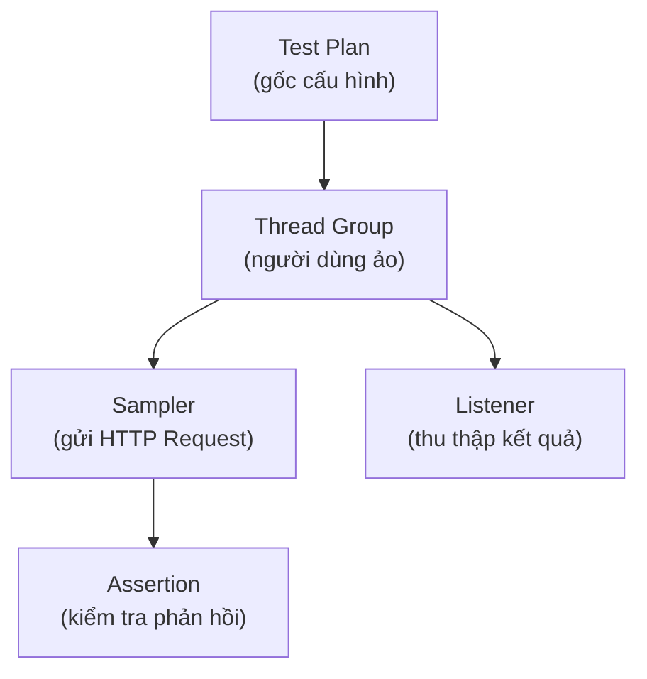

# 7. JMeter

Apache JMeter là công cụ mã nguồn mở dùng để test hiệu năng và test tải cho web/API, có giao diện đồ họa dễ dùng. Khác với việc kiểm tra code đúng/sai, JMeter trả lời câu hỏi hệ thống chịu được bao nhiêu người dùng cùng lúc mà vẫn chạy mượt. Bài này giới thiệu các khái niệm hiệu năng và các thành phần chính của JMeter; chi tiết nằm bên dưới.

---

:::note[Ghi nhớ nhanh]

- ⭐ **JMeter test hiệu năng và tải cho web/API** — trả lời "hệ thống chịu tải đến đâu", khác với "code có đúng không".
- **Ba chỉ số quan trọng** — response time (thời gian phản hồi), throughput (thông lượng), error rate (tỉ lệ lỗi).
- **Thành phần chính** — Thread Group (người dùng ảo) → Sampler (gửi request) → Listener (xem kết quả).
- **Các loại test** — load, stress, spike, endurance (soak) test.
- ⭐ **Test tải thật chạy non-GUI** — dùng `jmeter -n -t ...` cho chính xác; thêm Assertion để không tính nhầm trang lỗi là "thành công".

:::

---

## Mục lục

- [JMeter là gì?](#jmeter-là-gì)
- [Performance Testing là gì?](#performance-testing-là-gì)
- [Các loại test hiệu năng](#các-loại-test-hiệu-năng)
- [Các thành phần chính trong JMeter](#các-thành-phần-chính-trong-jmeter)
- [Thread Group: mô phỏng người dùng](#thread-group-mô-phỏng-người-dùng)
- [Sampler: gửi yêu cầu](#sampler-gửi-yêu-cầu)
- [Listener: xem kết quả](#listener-xem-kết-quả)
- [Các bước tạo một test cơ bản](#các-bước-tạo-một-test-cơ-bản)
- [Khi nào dùng JMeter?](#khi-nào-dùng-jmeter)
- [Lỗi thường gặp](#lỗi-thường-gặp)
- [Vì sao JMeter ra đời?](#vì-sao-jmeter-ra-đời)
- [Tóm tắt](#tóm-tắt)

---

## Vì sao JMeter ra đời?

**Vấn đề:** Khi phát triển ứng dụng, bạn chỉ có thể tự tay gửi vài request để kiểm tra API trả đúng kết quả. Nhưng cách đó không trả lời được câu hỏi thực tế: hệ thống có chịu nổi 1000 người dùng cùng đăng nhập lúc 8 giờ sáng không? Nếu kiểm tra thủ công từng request, bạn không thể mô phỏng hàng trăm người dùng đồng thời, cũng không đo được thời gian phản hồi thực tế dưới tải cao.

```bash
# Cách cũ: test thủ công từng request một — không phản ánh thực tế
curl -X GET http://localhost:8080/api/users/1
# → Trả về 200 OK trong 50ms
# → Nhưng khi 500 người gọi cùng lúc thì sao? Không biết!
```

**Giải pháp:** JMeter mô phỏng hàng nghìn người dùng ảo (Thread Group) gửi request đồng thời, đo chính xác thời gian phản hồi, throughput, và tỷ lệ lỗi. Kết quả được tổng hợp thành báo cáo chi tiết. Công cụ chạy được cả GUI lẫn dòng lệnh, dễ tích hợp vào pipeline CI/CD.

```bash
# JMeter chạy 500 người dùng ảo cùng lúc, đo hiệu năng thực tế
jmeter -n -t test.jmx -l result.jtl -e -o report
# → Báo cáo HTML: avg response time, throughput, error rate
# → Biết chính xác hệ thống "gãy" ở ngưỡng nào
```

:::tip[Dùng thực tế]
- Kiểm tra trang bán vé concert trước ngày mở bán (flash sale với hàng chục nghìn người cùng lúc).
- Đo hiệu năng API sau khi tối ưu database query để xác nhận thực sự nhanh hơn.
- Phát hiện rò rỉ bộ nhớ bằng cách giữ tải vừa phải liên tục trong vài giờ (endurance test).
- Tích hợp vào CI/CD để tự động cảnh báo khi hiệu năng tụt sau mỗi lần deploy.
:::

## JMeter là gì?

**Apache JMeter** là một công cụ **mã nguồn mở** (miễn phí) dùng để **test hiệu năng (performance testing)** và **test tải (load testing)** cho ứng dụng — phổ biến nhất là web và REST API.

Khác với JUnit hay REST Assured (kiểm tra **kết quả có đúng không**), JMeter kiểm tra **hệ thống chịu tải đến đâu**: bao nhiêu người dùng cùng lúc thì hệ thống vẫn chạy mượt, phản hồi nhanh, không bị sập.

JMeter có **giao diện đồ họa (GUI)** dễ dùng, nên người mới không cần viết code vẫn có thể tạo kịch bản test tải.

## Performance Testing là gì?

**Performance Testing (kiểm thử hiệu năng)** là việc đo lường xem hệ thống hoạt động **nhanh, ổn định, và chịu tải tốt** đến mức nào. Các chỉ số quan trọng:

- **Response time (thời gian phản hồi)**: server mất bao lâu để trả lời một yêu cầu.
- **Throughput (thông lượng)**: số yêu cầu xử lý được mỗi giây.
- **Error rate (tỉ lệ lỗi)**: bao nhiêu phần trăm yêu cầu bị lỗi khi tải cao.

> Ví dụ đời thường: Một quán cà phê phục vụ tốt khi có 10 khách. Nhưng nếu 500 khách ùa vào cùng lúc (ví dụ ngày khai trương khuyến mãi), liệu quán có phục vụ kịp, hay khách phải chờ rất lâu, thậm chí bỏ về? Performance test trả lời câu hỏi đó cho hệ thống phần mềm.

## Các loại test hiệu năng

| Loại | Mục đích |
|------|----------|
| **Load Test (test tải)** | Kiểm tra hệ thống dưới lượng tải dự kiến (ví dụ 1000 người dùng) |
| **Stress Test (test áp lực)** | Tăng tải đến khi hệ thống "gãy" để biết giới hạn |
| **Spike Test (test đột biến)** | Tăng tải đột ngột (như đợt flash sale) rồi giảm |
| **Endurance/Soak Test (test bền)** | Giữ tải vừa phải trong thời gian dài (vài giờ) để phát hiện rò rỉ bộ nhớ |

## Các thành phần chính trong JMeter

Một kịch bản test JMeter (gọi là **Test Plan** — kế hoạch test) được xây từ các thành phần lồng nhau theo cây:

- **Test Plan**: gốc của mọi thứ, chứa toàn bộ cấu hình.
- **Thread Group (nhóm luồng)**: mô phỏng nhóm người dùng ảo.
- **Sampler (bộ lấy mẫu)**: hành động gửi yêu cầu (ví dụ HTTP Request).
- **Listener (bộ lắng nghe)**: thu thập và hiển thị kết quả.
- **Config Element / Timer / Assertion**: cấu hình bổ trợ, độ trễ, và kiểm tra phản hồi.

Sơ đồ cây các thành phần chính của một Test Plan trong JMeter:



## Thread Group: mô phỏng người dùng

**Thread Group (nhóm luồng)** là thành phần quan trọng nhất — nó định nghĩa **bao nhiêu người dùng ảo** và **cách họ gửi yêu cầu**. Mỗi "thread" (luồng) đại diện cho một người dùng ảo.

Ba thông số chính:

- **Number of Threads (số luồng)**: số người dùng ảo. Ví dụ `100` = mô phỏng 100 người.
- **Ramp-up Period (thời gian khởi tăng)**: trong bao nhiêu giây thì tất cả luồng được khởi động. Ví dụ `100` luồng với ramp-up `10` giây nghĩa là mỗi giây thêm 10 người (tăng dần, không ùa vào cùng lúc).
- **Loop Count (số vòng lặp)**: mỗi người dùng lặp lại yêu cầu bao nhiêu lần.

> Hình dung: 100 luồng + ramp-up 10 giây + loop 5 = 100 người dùng vào dần trong 10 giây, mỗi người gửi yêu cầu 5 lần. Tổng cộng 500 lượt gọi.

## Sampler: gửi yêu cầu

**Sampler (bộ lấy mẫu)** là hành động cụ thể mà mỗi người dùng ảo thực hiện. Loại phổ biến nhất là **HTTP Request Sampler** để gọi web/API.

Cấu hình một HTTP Request gồm:

- **Server Name / IP**: ví dụ `localhost` hoặc `api.example.com`.
- **Port (cổng)**: ví dụ `8080`.
- **Method**: `GET`, `POST`...
- **Path (đường dẫn)**: ví dụ `/users/1`.
- **Body Data**: dữ liệu JSON gửi đi (nếu là POST).

Có thể gắn thêm **Assertion (khẳng định)** vào sampler, ví dụ **Response Assertion** để kiểm tra phản hồi có chứa text mong đợi hoặc đúng mã `200` hay không — giống ý tưởng assert trong unit test.

## Listener: xem kết quả

**Listener (bộ lắng nghe)** thu thập kết quả và hiển thị cho bạn xem. Một số listener thường dùng:

- **View Results Tree (cây kết quả)**: xem chi tiết từng yêu cầu/phản hồi (hữu ích khi gỡ lỗi, nhưng tốn tài nguyên).
- **Summary Report (báo cáo tổng hợp)**: bảng tổng kết số liệu — số mẫu, thời gian trung bình, tỉ lệ lỗi, throughput.
- **Aggregate Report (báo cáo gộp)**: thêm các phân vị (percentile) như 90%, 95%, 99% — cho biết "đa số người dùng" phản hồi trong bao lâu.

> Mẹo: khi chạy test tải thật (nhiều luồng), nên **tắt View Results Tree** vì nó ngốn bộ nhớ và làm sai lệch kết quả. Chỉ bật khi đang gỡ lỗi với ít luồng.

## Các bước tạo một test cơ bản

Quy trình tạo một load test đơn giản trong giao diện JMeter:

1. **Tạo Test Plan**: mở JMeter, đã có sẵn một Test Plan trống.
2. **Thêm Thread Group**: chuột phải Test Plan → Add → Threads → Thread Group. Đặt số luồng, ramp-up, loop count.
3. **Thêm HTTP Request Sampler**: chuột phải Thread Group → Add → Sampler → HTTP Request. Điền server, port, method, path.
4. **(Tùy chọn) Thêm Assertion**: chuột phải Sampler → Add → Assertions → Response Assertion để kiểm tra phản hồi.
5. **Thêm Listener**: chuột phải Thread Group → Add → Listener → Summary Report.
6. **Chạy test**: bấm nút Run (hình tam giác xanh) và xem kết quả ở Listener.

Để chạy test tải lớn thực sự, người ta thường chạy ở **chế độ dòng lệnh (non-GUI)** cho nhẹ:

```bash
# Chạy test plan tên test.jmx, lưu kết quả vào result.jtl, xuất báo cáo HTML ra thư mục report
jmeter -n -t test.jmx -l result.jtl -e -o report
```

- `-n`: chạy không giao diện (non-GUI), tiết kiệm tài nguyên.
- `-t`: file test plan đầu vào.
- `-l`: file ghi kết quả.
- `-e -o`: tạo báo cáo HTML đẹp.

## Khi nào dùng JMeter?

- **Trước khi ra mắt** tính năng quan trọng (ví dụ trang bán vé concert) để biết hệ thống chịu được bao nhiêu người.
- **Sau khi tối ưu** code/database để đo xem có thực sự nhanh hơn không.
- **Định kỳ** để phát hiện sớm khi hiệu năng tụt do thay đổi mới.

JMeter **không thay thế** unit test hay integration test. Nó trả lời câu hỏi khác: "Hệ thống chạy **nhanh và chịu tải** đến đâu?", chứ không phải "Code có **đúng** không?".

## Lỗi thường gặp

1. **Chạy test tải lớn ở chế độ GUI**: GUI ngốn tài nguyên, làm kết quả sai lệch. Hãy dùng chế độ `-n` (non-GUI) cho test thật.
2. **Bật View Results Tree khi tải cao**: Listener này lưu mọi phản hồi, gây tràn bộ nhớ. Chỉ dùng để gỡ lỗi với ít luồng.
3. **Ramp-up = 0**: Khởi động tất cả luồng cùng lúc tạo cú sốc không thực tế. Đặt ramp-up hợp lý để mô phỏng tải tăng dần.
4. **Test trên cùng máy với server**: Máy chạy JMeter và máy chạy server tranh giành tài nguyên, kết quả không chính xác. Nên tách riêng.
5. **Không đặt Assertion**: Server có thể trả về trang lỗi mà JMeter vẫn tính là "thành công" vì chỉ nhận được phản hồi. Thêm Response Assertion để kiểm tra nội dung/mã đúng.

## Tóm tắt

- **JMeter** là công cụ mã nguồn mở để **test hiệu năng và test tải** cho web/API, có giao diện đồ họa dễ dùng.
- **Performance test** đo **thời gian phản hồi, thông lượng, tỉ lệ lỗi** — khác với việc kiểm tra code đúng/sai.
- Các loại: **load, stress, spike, endurance test**.
- Thành phần chính: **Thread Group** (người dùng ảo) → **Sampler** (gửi yêu cầu) → **Listener** (xem kết quả).
- Test tải thật nên chạy ở **chế độ non-GUI** (`jmeter -n -t ...`) để chính xác.
- Dùng JMeter trước khi ra mắt tính năng quan trọng hoặc sau khi tối ưu hệ thống.
- Bài tiếp theo: **Behavior Testing & Cucumber-JVM** — viết test theo ngôn ngữ tự nhiên.
