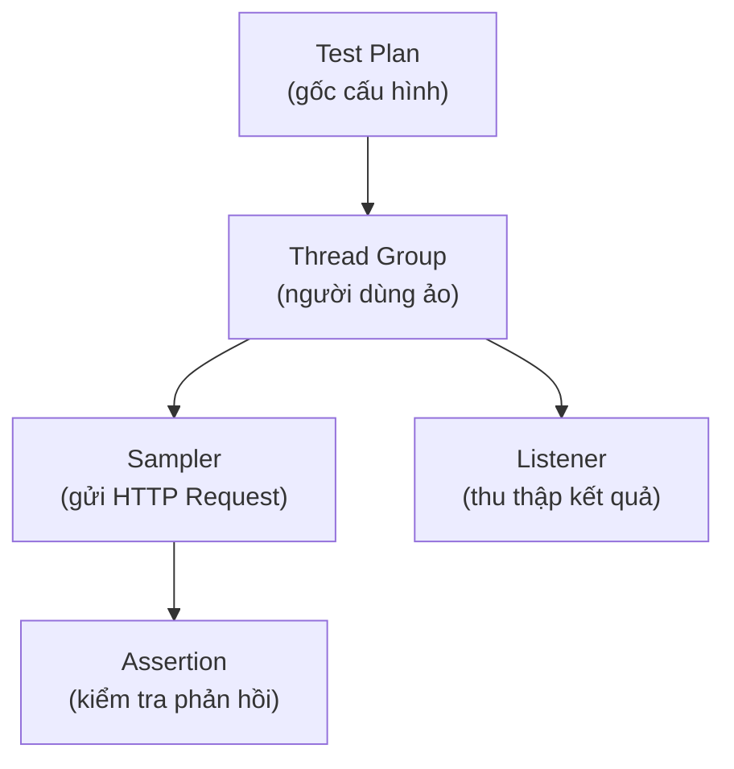

# 7. JMeter

Apache JMeter là công cụ mã nguồn mở dùng để test hiệu năng và test tải cho web/API, có giao diện đồ họa dễ dùng. Khác với việc kiểm tra code đúng/sai, JMeter trả lời câu hỏi hệ thống chịu được bao nhiêu người dùng cùng lúc mà vẫn chạy mượt. Bài này giới thiệu các khái niệm hiệu năng và các thành phần chính của JMeter; chi tiết nằm bên dưới.

[](pathname:///img/java/jmeter.webp)

---

:::note[Ghi nhớ nhanh]

- ⭐ **JMeter test hiệu năng và tải cho web/API** — trả lời "hệ thống chịu tải đến đâu", khác với "code có đúng không".
- **Ba chỉ số quan trọng** — response time (thời gian phản hồi), throughput (thông lượng), error rate (tỉ lệ lỗi).
- **Thành phần chính** — Thread Group (người dùng ảo) → Sampler (gửi request) → Listener (xem kết quả).
- **Các loại test** — load, stress, spike, endurance (soak) test.
- ⭐ **Test tải thật chạy non-GUI** — dùng `jmeter -n -t ...` cho chính xác; thêm Assertion để không tính nhầm trang lỗi là "thành công".

:::

---

## Mục lục

- [JMeter là gì?](#jmeter-là-gì)
- [Performance Testing là gì?](#performance-testing-là-gì)
- [Các loại test hiệu năng](#các-loại-test-hiệu-năng)
- [Các thành phần chính trong JMeter](#các-thành-phần-chính-trong-jmeter)
- [Thread Group: mô phỏng người dùng](#thread-group-mô-phỏng-người-dùng)
- [Sampler: gửi yêu cầu](#sampler-gửi-yêu-cầu)
- [Listener: xem kết quả](#listener-xem-kết-quả)
- [Các bước tạo một test cơ bản](#các-bước-tạo-một-test-cơ-bản)
- [Khi nào dùng JMeter?](#khi-nào-dùng-jmeter)
- [Lỗi thường gặp](#lỗi-thường-gặp)
- [Vì sao JMeter ra đời?](#vì-sao-jmeter-ra-đời)
- [Tóm tắt](#tóm-tắt)
- [Câu hỏi phỏng vấn](#câu-hỏi-phỏng-vấn)

---

## Vì sao JMeter ra đời?

**Vấn đề:** Khi phát triển ứng dụng, bạn chỉ có thể tự tay gửi vài request để kiểm tra API trả đúng kết quả. Nhưng cách đó không trả lời được câu hỏi thực tế: hệ thống có chịu nổi 1000 người dùng cùng đăng nhập lúc 8 giờ sáng không? Nếu kiểm tra thủ công từng request, bạn không thể mô phỏng hàng trăm người dùng đồng thời, cũng không đo được thời gian phản hồi thực tế dưới tải cao.

```bash
# Cách cũ: test thủ công từng request một — không phản ánh thực tế
curl -X GET http://localhost:8080/api/users/1
# → Trả về 200 OK trong 50ms
# → Nhưng khi 500 người gọi cùng lúc thì sao? Không biết!
```

**Giải pháp:** JMeter mô phỏng hàng nghìn người dùng ảo (Thread Group) gửi request đồng thời, đo chính xác thời gian phản hồi, throughput, và tỷ lệ lỗi. Kết quả được tổng hợp thành báo cáo chi tiết. Công cụ chạy được cả GUI lẫn dòng lệnh, dễ tích hợp vào pipeline CI/CD.

```bash
# JMeter chạy 500 người dùng ảo cùng lúc, đo hiệu năng thực tế
jmeter -n -t test.jmx -l result.jtl -e -o report
# → Báo cáo HTML: avg response time, throughput, error rate
# → Biết chính xác hệ thống "gãy" ở ngưỡng nào
```

:::tip[Dùng thực tế]
- Kiểm tra trang bán vé concert trước ngày mở bán (flash sale với hàng chục nghìn người cùng lúc).
- Đo hiệu năng API sau khi tối ưu database query để xác nhận thực sự nhanh hơn.
- Phát hiện rò rỉ bộ nhớ bằng cách giữ tải vừa phải liên tục trong vài giờ (endurance test).
- Tích hợp vào CI/CD để tự động cảnh báo khi hiệu năng tụt sau mỗi lần deploy.
:::

## JMeter là gì?

**Apache JMeter** là một công cụ **mã nguồn mở** (miễn phí) dùng để **test hiệu năng (performance testing)** và **test tải (load testing)** cho ứng dụng — phổ biến nhất là web và REST API.

Khác với JUnit hay REST Assured (kiểm tra **kết quả có đúng không**), JMeter kiểm tra **hệ thống chịu tải đến đâu**: bao nhiêu người dùng cùng lúc thì hệ thống vẫn chạy mượt, phản hồi nhanh, không bị sập.

JMeter có **giao diện đồ họa (GUI)** dễ dùng, nên người mới không cần viết code vẫn có thể tạo kịch bản test tải.

## Performance Testing là gì?

**Performance Testing (kiểm thử hiệu năng)** là việc đo lường xem hệ thống hoạt động **nhanh, ổn định, và chịu tải tốt** đến mức nào. Các chỉ số quan trọng:

- **Response time (thời gian phản hồi)**: server mất bao lâu để trả lời một yêu cầu.
- **Throughput (thông lượng)**: số yêu cầu xử lý được mỗi giây.
- **Error rate (tỉ lệ lỗi)**: bao nhiêu phần trăm yêu cầu bị lỗi khi tải cao.

> Ví dụ đời thường: Một quán cà phê phục vụ tốt khi có 10 khách. Nhưng nếu 500 khách ùa vào cùng lúc (ví dụ ngày khai trương khuyến mãi), liệu quán có phục vụ kịp, hay khách phải chờ rất lâu, thậm chí bỏ về? Performance test trả lời câu hỏi đó cho hệ thống phần mềm.

## Các loại test hiệu năng

| Loại | Mục đích |
|------|----------|
| **Load Test (test tải)** | Kiểm tra hệ thống dưới lượng tải dự kiến (ví dụ 1000 người dùng) |
| **Stress Test (test áp lực)** | Tăng tải đến khi hệ thống "gãy" để biết giới hạn |
| **Spike Test (test đột biến)** | Tăng tải đột ngột (như đợt flash sale) rồi giảm |
| **Endurance/Soak Test (test bền)** | Giữ tải vừa phải trong thời gian dài (vài giờ) để phát hiện rò rỉ bộ nhớ |

## Các thành phần chính trong JMeter

Một kịch bản test JMeter (gọi là **Test Plan** — kế hoạch test) được xây từ các thành phần lồng nhau theo cây:

- **Test Plan**: gốc của mọi thứ, chứa toàn bộ cấu hình.
- **Thread Group (nhóm luồng)**: mô phỏng nhóm người dùng ảo.
- **Sampler (bộ lấy mẫu)**: hành động gửi yêu cầu (ví dụ HTTP Request).
- **Listener (bộ lắng nghe)**: thu thập và hiển thị kết quả.
- **Config Element / Timer / Assertion**: cấu hình bổ trợ, độ trễ, và kiểm tra phản hồi.

Sơ đồ cây các thành phần chính của một Test Plan trong JMeter:


```mermaid
flowchart TD
    TP["Test Plan<br/>(gốc cấu hình)"] --> TG["Thread Group<br/>(người dùng ảo)"]
    TG --> SP["Sampler<br/>(gửi HTTP Request)"]
    SP --> AS["Assertion<br/>(kiểm tra phản hồi)"]
    TG --> LS["Listener<br/>(thu thập kết quả)"]
```

## Thread Group: mô phỏng người dùng

**Thread Group (nhóm luồng)** là thành phần quan trọng nhất — nó định nghĩa **bao nhiêu người dùng ảo** và **cách họ gửi yêu cầu**. Mỗi "thread" (luồng) đại diện cho một người dùng ảo.

Ba thông số chính:

- **Number of Threads (số luồng)**: số người dùng ảo. Ví dụ `100` = mô phỏng 100 người.
- **Ramp-up Period (thời gian khởi tăng)**: trong bao nhiêu giây thì tất cả luồng được khởi động. Ví dụ `100` luồng với ramp-up `10` giây nghĩa là mỗi giây thêm 10 người (tăng dần, không ùa vào cùng lúc).
- **Loop Count (số vòng lặp)**: mỗi người dùng lặp lại yêu cầu bao nhiêu lần.

> Hình dung: 100 luồng + ramp-up 10 giây + loop 5 = 100 người dùng vào dần trong 10 giây, mỗi người gửi yêu cầu 5 lần. Tổng cộng 500 lượt gọi.

## Sampler: gửi yêu cầu

**Sampler (bộ lấy mẫu)** là hành động cụ thể mà mỗi người dùng ảo thực hiện. Loại phổ biến nhất là **HTTP Request Sampler** để gọi web/API.

Cấu hình một HTTP Request gồm:

- **Server Name / IP**: ví dụ `localhost` hoặc `api.example.com`.
- **Port (cổng)**: ví dụ `8080`.
- **Method**: `GET`, `POST`...
- **Path (đường dẫn)**: ví dụ `/users/1`.
- **Body Data**: dữ liệu JSON gửi đi (nếu là POST).

Có thể gắn thêm **Assertion (khẳng định)** vào sampler, ví dụ **Response Assertion** để kiểm tra phản hồi có chứa text mong đợi hoặc đúng mã `200` hay không — giống ý tưởng assert trong unit test.

## Listener: xem kết quả

**Listener (bộ lắng nghe)** thu thập kết quả và hiển thị cho bạn xem. Một số listener thường dùng:

- **View Results Tree (cây kết quả)**: xem chi tiết từng yêu cầu/phản hồi (hữu ích khi gỡ lỗi, nhưng tốn tài nguyên).
- **Summary Report (báo cáo tổng hợp)**: bảng tổng kết số liệu — số mẫu, thời gian trung bình, tỉ lệ lỗi, throughput.
- **Aggregate Report (báo cáo gộp)**: thêm các phân vị (percentile) như 90%, 95%, 99% — cho biết "đa số người dùng" phản hồi trong bao lâu.

> Mẹo: khi chạy test tải thật (nhiều luồng), nên **tắt View Results Tree** vì nó ngốn bộ nhớ và làm sai lệch kết quả. Chỉ bật khi đang gỡ lỗi với ít luồng.

## Các bước tạo một test cơ bản

Quy trình tạo một load test đơn giản trong giao diện JMeter:

1. **Tạo Test Plan**: mở JMeter, đã có sẵn một Test Plan trống.
2. **Thêm Thread Group**: chuột phải Test Plan → Add → Threads → Thread Group. Đặt số luồng, ramp-up, loop count.
3. **Thêm HTTP Request Sampler**: chuột phải Thread Group → Add → Sampler → HTTP Request. Điền server, port, method, path.
4. **(Tùy chọn) Thêm Assertion**: chuột phải Sampler → Add → Assertions → Response Assertion để kiểm tra phản hồi.
5. **Thêm Listener**: chuột phải Thread Group → Add → Listener → Summary Report.
6. **Chạy test**: bấm nút Run (hình tam giác xanh) và xem kết quả ở Listener.

Để chạy test tải lớn thực sự, người ta thường chạy ở **chế độ dòng lệnh (non-GUI)** cho nhẹ:

```bash
# Chạy test plan tên test.jmx, lưu kết quả vào result.jtl, xuất báo cáo HTML ra thư mục report
jmeter -n -t test.jmx -l result.jtl -e -o report
```

- `-n`: chạy không giao diện (non-GUI), tiết kiệm tài nguyên.
- `-t`: file test plan đầu vào.
- `-l`: file ghi kết quả.
- `-e -o`: tạo báo cáo HTML đẹp.

## Khi nào dùng JMeter?

- **Trước khi ra mắt** tính năng quan trọng (ví dụ trang bán vé concert) để biết hệ thống chịu được bao nhiêu người.
- **Sau khi tối ưu** code/database để đo xem có thực sự nhanh hơn không.
- **Định kỳ** để phát hiện sớm khi hiệu năng tụt do thay đổi mới.

JMeter **không thay thế** unit test hay integration test. Nó trả lời câu hỏi khác: "Hệ thống chạy **nhanh và chịu tải** đến đâu?", chứ không phải "Code có **đúng** không?".

## Lỗi thường gặp

1. **Chạy test tải lớn ở chế độ GUI**: GUI ngốn tài nguyên, làm kết quả sai lệch. Hãy dùng chế độ `-n` (non-GUI) cho test thật.
2. **Bật View Results Tree khi tải cao**: Listener này lưu mọi phản hồi, gây tràn bộ nhớ. Chỉ dùng để gỡ lỗi với ít luồng.
3. **Ramp-up = 0**: Khởi động tất cả luồng cùng lúc tạo cú sốc không thực tế. Đặt ramp-up hợp lý để mô phỏng tải tăng dần.
4. **Test trên cùng máy với server**: Máy chạy JMeter và máy chạy server tranh giành tài nguyên, kết quả không chính xác. Nên tách riêng.
5. **Không đặt Assertion**: Server có thể trả về trang lỗi mà JMeter vẫn tính là "thành công" vì chỉ nhận được phản hồi. Thêm Response Assertion để kiểm tra nội dung/mã đúng.

## Tóm tắt

- **JMeter** là công cụ mã nguồn mở để **test hiệu năng và test tải** cho web/API, có giao diện đồ họa dễ dùng.
- **Performance test** đo **thời gian phản hồi, thông lượng, tỉ lệ lỗi** — khác với việc kiểm tra code đúng/sai.
- Các loại: **load, stress, spike, endurance test**.
- Thành phần chính: **Thread Group** (người dùng ảo) → **Sampler** (gửi yêu cầu) → **Listener** (xem kết quả).
- Test tải thật nên chạy ở **chế độ non-GUI** (`jmeter -n -t ...`) để chính xác.
- Dùng JMeter trước khi ra mắt tính năng quan trọng hoặc sau khi tối ưu hệ thống.
- Bài tiếp theo: **Behavior Testing & Cucumber-JVM** — viết test theo ngôn ngữ tự nhiên.

---

## Câu hỏi phỏng vấn

Những câu thường gặp về chủ đề này. Tự trả lời trước, rồi bấm **Xem đáp án** để đối chiếu.

**1. JMeter khác gì so với JUnit/REST Assured về mục đích kiểm thử? Vì sao không thể dùng JMeter để thay thế hoàn toàn unit test hay integration test?**

<details className="qa">
<summary>Xem đáp án</summary>

- **JUnit/REST Assured** trả lời câu hỏi: **"code/API có chạy đúng logic không?"** — kiểm tra tính đúng đắn (correctness) của một hành vi cụ thể với một lượng request nhỏ, thường chỉ 1 request tại một thời điểm.
- **JMeter** trả lời câu hỏi hoàn toàn khác: **"hệ thống chịu tải đến đâu, phản hồi nhanh tới mức nào khi có nhiều người dùng cùng lúc?"** — tập trung vào hiệu năng (performance), không phải tính đúng đắn của logic nghiệp vụ.
- Hai loại test này **bổ sung** chứ không thay thế nhau: một API có thể trả đúng kết quả (unit/integration test pass) nhưng vẫn sập hoặc phản hồi chậm không chấp nhận được khi có 10.000 người dùng cùng lúc truy cập — chỉ performance test như JMeter mới phát hiện được vấn đề này.

</details>

**2. Nêu và giải thích ba chỉ số quan trọng nhất khi đo hiệu năng hệ thống bằng JMeter.**

<details className="qa">
<summary>Xem đáp án</summary>

- **Response time (thời gian phản hồi)**: khoảng thời gian từ lúc gửi request tới lúc nhận được phản hồi đầy đủ. Đây là chỉ số người dùng cảm nhận trực tiếp — thời gian phản hồi càng thấp, trải nghiệm càng tốt.
- **Throughput (thông lượng)**: số lượng request hệ thống xử lý được trong một đơn vị thời gian (thường tính request/giây). Chỉ số này cho biết khả năng "gánh" tải của hệ thống.
- **Error rate (tỉ lệ lỗi)**: phần trăm request bị lỗi (timeout, mã lỗi 5xx, kết nối bị từ chối...) trong tổng số request gửi đi. Tỉ lệ lỗi tăng cao khi tải vượt quá khả năng xử lý là dấu hiệu hệ thống đang "gãy".
- Ba chỉ số này thường được xem xét **cùng nhau**: một hệ thống có throughput cao nhưng error rate cũng cao không phải là hệ thống tốt — nó chỉ đang "cố" xử lý nhiều request mà không đảm bảo chất lượng phản hồi.

</details>

**3. So sánh Load Test, Stress Test, Spike Test và Endurance (Soak) Test. Mỗi loại phù hợp trả lời câu hỏi nào?**

<details className="qa">
<summary>Xem đáp án</summary>

| Loại | Cách thực hiện | Câu hỏi trả lời |
|---|---|---|
| **Load Test** | Tạo tải đúng bằng mức **dự kiến thực tế** (ví dụ 1000 người dùng đồng thời) | "Hệ thống có chạy ổn định ở mức tải bình thường không?" |
| **Stress Test** | Tăng tải **dần dần vượt quá** mức dự kiến cho tới khi hệ thống "gãy" | "Giới hạn chịu tải tối đa của hệ thống là bao nhiêu? Nó gãy như thế nào (từ từ hay sập đột ngột)?" |
| **Spike Test** | Tăng tải **đột ngột** trong thời gian ngắn rồi giảm về bình thường | "Hệ thống có xử lý được cú sốc tải bất ngờ không (ví dụ flash sale), và có phục hồi được sau đó không?" |
| **Endurance/Soak Test** | Giữ tải **vừa phải nhưng kéo dài** (vài giờ đến vài ngày) | "Hệ thống có vấn đề rò rỉ bộ nhớ (memory leak) hay suy giảm hiệu năng dần theo thời gian không?" |

</details>

**4. Trong Thread Group, giải thích ý nghĩa của "Number of Threads", "Ramp-up Period", và "Loop Count". Với cấu hình 200 threads, ramp-up 20 giây, loop count 3, tổng số lượt gọi request là bao nhiêu và tốc độ tăng người dùng ảo như thế nào?**

<details className="qa">
<summary>Xem đáp án</summary>

- **Number of Threads**: số **người dùng ảo** được mô phỏng — mỗi "thread" tương ứng với một người dùng độc lập gửi request.
- **Ramp-up Period**: khoảng thời gian (giây) để **khởi động dần** toàn bộ số luồng, tránh tạo cú sốc tải tức thời không thực tế.
- **Loop Count**: số lần **mỗi** người dùng ảo lặp lại toàn bộ kịch bản request của mình.

Với cấu hình **200 threads, ramp-up 20 giây, loop count 3**:

- Tốc độ tăng người dùng ảo: mỗi giây có thêm `200 / 20 = 10` người dùng ảo bắt đầu hoạt động, cho tới khi đủ 200 người sau 20 giây.
- Tổng số lượt gọi request: `200 × 3 = 600` lượt (giả sử mỗi vòng lặp gửi đúng 1 request; nếu kịch bản có nhiều sampler trong một vòng lặp thì nhân thêm số sampler đó).

</details>

**5. Vì sao khi chạy test tải thật (nhiều luồng, mô phỏng đông người dùng), tài liệu khuyến cáo nên chạy JMeter ở chế độ non-GUI (`jmeter -n -t ...`) thay vì chế độ giao diện đồ họa thông thường?**

<details className="qa">
<summary>Xem đáp án</summary>

- Chế độ **GUI** của JMeter phải liên tục **vẽ và cập nhật giao diện** để hiển thị tiến trình test theo thời gian thực — việc này tiêu tốn đáng kể CPU và bộ nhớ của chính máy đang chạy JMeter.
- Khi mô phỏng số lượng lớn người dùng ảo (hàng trăm, hàng nghìn thread), tài nguyên máy chạy JMeter bị **chia sẻ** giữa việc gửi request thật và việc vẽ giao diện — dẫn tới **kết quả đo bị sai lệch** (response time bị "phồng" lên do máy JMeter chính nó cũng đang quá tải bởi việc render GUI, không phản ánh đúng hiệu năng thực sự của hệ thống đích).
- Chế độ **non-GUI** (`jmeter -n -t test.jmx -l result.jtl -e -o report`) loại bỏ hoàn toàn overhead của giao diện, dành toàn bộ tài nguyên máy cho việc gửi request và đo lường, cho kết quả chính xác hơn nhiều — đây là cách chạy **bắt buộc** cho mọi bài test tải thật sự, GUI chỉ nên dùng để **thiết kế và gỡ lỗi** kịch bản test với số luồng nhỏ.

</details>

**6. Test sau có vấn đề gì khiến kết quả có thể bị hiểu sai là "100% request thành công" dù thực tế server đang trả về lỗi?**

```text
Cấu hình: Thread Group (100 threads) → HTTP Request Sampler (GET /api/orders)
          → Summary Report Listener
(Không có Assertion nào được thêm vào Sampler)
```

<details className="qa">
<summary>Xem đáp án</summary>

**Vấn đề**: kịch bản test **thiếu Assertion** (ví dụ Response Assertion) để kiểm tra **nội dung/mã trạng thái** thực sự của phản hồi.

- Mặc định, JMeter chỉ tính một request là "lỗi" khi xảy ra lỗi ở tầng **giao thức** (ví dụ không kết nối được, timeout, hoặc server trả về mã lỗi HTTP như `500`) — nhưng nếu server trả về **HTTP 200** kèm theo một **trang lỗi** (ví dụ trang thông báo lỗi HTML, hoặc JSON rỗng do một lỗi logic nội bộ) thay vì dữ liệu mong đợi, JMeter mặc định vẫn tính đó là request **"thành công"** vì về mặt giao thức HTTP nó nhận được phản hồi hợp lệ với mã 200.
- Kết quả: báo cáo Summary Report có thể hiển thị tỉ lệ lỗi là `0%`, tạo cảm giác an toàn giả, trong khi thực tế server đang trả về nội dung sai hoàn toàn.
- Cách khắc phục: thêm **Response Assertion** vào Sampler để kiểm tra nội dung phản hồi có chứa đúng dữ liệu mong đợi (hoặc không chứa từ khóa lỗi như "error", "exception"), giúp JMeter phân biệt chính xác giữa "phản hồi có nhận được" và "phản hồi đúng nội dung mong đợi".

</details>

**7. Vì sao không nên chạy JMeter và server đang được test trên cùng một máy vật lý khi thực hiện load test nghiêm túc?**

<details className="qa">
<summary>Xem đáp án</summary>

- Khi cả JMeter (đóng vai trò tạo tải) và server (đối tượng bị test) cùng chạy trên **một máy**, cả hai sẽ **tranh giành cùng một nguồn tài nguyên** (CPU, RAM, băng thông mạng nội bộ) — dẫn tới hai vấn đề:
  - **JMeter không đủ tài nguyên** để tạo đủ tải như cấu hình mong muốn (ví dụ không thể thực sự mô phỏng 1000 luồng đồng thời nếu CPU máy đã bị server chiếm dụng phần lớn).
  - **Server bị "đánh cắp" tài nguyên** bởi chính JMeter đang chạy cùng máy, khiến response time đo được **cao hơn thực tế** — không phản ánh đúng hiệu năng server sẽ có khi chạy độc lập trên hạ tầng production thật.
- Khuyến nghị: chạy JMeter (hoặc dùng JMeter ở chế độ **distributed testing** — nhiều máy JMeter "worker" phối hợp) trên một máy **tách biệt hoàn toàn** với máy chạy server đích, đảm bảo kết quả đo phản ánh đúng khả năng chịu tải thực sự của hệ thống.

</details>

**8. Aggregate Report trong JMeter cung cấp thông tin gì mà Summary Report không có? Vì sao chỉ nhìn "response time trung bình (average)" có thể đánh lừa khi đánh giá trải nghiệm người dùng?**

<details className="qa">
<summary>Xem đáp án</summary>

- **Aggregate Report** bổ sung thêm các **phân vị (percentile)** như 90%, 95%, 99% — ví dụ "percentile 95% là 800ms" nghĩa là 95% số request có thời gian phản hồi **dưới hoặc bằng** 800ms.
- Chỉ nhìn **response time trung bình (average)** có thể đánh lừa vì trung bình dễ bị "kéo lệch" bởi một số ít request rất nhanh, che giấu việc có một tỉ lệ đáng kể request bị **chậm bất thường** (outlier). Ví dụ: average là 200ms nghe có vẻ tốt, nhưng nếu percentile 99% lại là 5000ms, nghĩa là **1% người dùng** (có thể là hàng nghìn người trong hệ thống lớn) đang trải nghiệm độ trễ rất tệ mà con số trung bình hoàn toàn không phản ánh được.
- Vì vậy, khi đánh giá trải nghiệm thực tế của **đa số** người dùng, các đội performance engineering thường ưu tiên nhìn vào **percentile cao (95%, 99%)** thay vì chỉ dựa vào con số trung bình.

</details>

**9. Trong một pipeline CI/CD, làm thế nào để JMeter được dùng để "tự động cảnh báo khi hiệu năng tụt sau mỗi lần deploy"? Mô tả ý tưởng ở mức khái niệm.**

<details className="qa">
<summary>Xem đáp án</summary>

Ý tưởng ở mức khái niệm:

1. **Chạy JMeter tự động** ở chế độ non-GUI (`jmeter -n -t test.jmx -l result.jtl`) ngay sau mỗi lần deploy lên môi trường staging/test, như một bước trong pipeline CI/CD.
2. **Thu thập kết quả** (response time, throughput, error rate) từ file `.jtl` sinh ra, thường qua một công cụ phân tích hoặc script tùy chỉnh để trích xuất các chỉ số quan trọng.
3. **So sánh với ngưỡng (threshold) đã định trước** — ví dụ "percentile 95% không được vượt quá 1 giây", hoặc so sánh với kết quả của lần chạy trước đó (baseline) để phát hiện **hiệu năng suy giảm tương đối** (ví dụ chậm hơn 20% so với trước).
4. Nếu vượt ngưỡng hoặc suy giảm đáng kể, pipeline **đánh dấu build fail** hoặc gửi cảnh báo cho đội phát triển, giúp phát hiện vấn đề hiệu năng **ngay khi vừa được đưa vào**, thay vì phát hiện muộn khi đã ảnh hưởng người dùng thật ở production.

</details>

**10. Vì sao đặt Ramp-up Period bằng 0 (khởi động tất cả luồng cùng lúc) thường không mô phỏng đúng tình huống thực tế, ngoại trừ khi đang cố tình thực hiện Spike Test?**

<details className="qa">
<summary>Xem đáp án</summary>

- Trong thực tế, người dùng **hiếm khi** truy cập một hệ thống theo kiểu "tất cả cùng bấm nút trong cùng một mili-giây" — lưu lượng người dùng thường **tăng dần** theo thời gian (ví dụ trong vài phút đầu giờ làm việc, lượng truy cập tăng từ từ chứ không nhảy vọt tức thì).
- Nếu đặt Ramp-up = 0, JMeter sẽ cố gắng khởi động **toàn bộ** số luồng cấu hình **ngay lập tức** — tạo ra một "cú sốc tải" (traffic spike) cực đoan mà bản thân máy chạy JMeter cũng phải chịu áp lực tạo ra hàng loạt kết nối cùng lúc, có thể khiến kết quả đo bị nhiễu bởi giới hạn của chính máy JMeter, chứ không phản ánh đúng hành vi tải tăng dần tự nhiên.
- Ramp-up = 0 chỉ **hợp lý và có chủ đích** khi bạn đang thực hiện **Spike Test** — vì mục tiêu của loại test này chính là mô phỏng một cú sốc tải đột ngột (ví dụ hàng chục nghìn người cùng vào trang bán vé đúng giờ mở bán) để kiểm tra khả năng chống chịu và phục hồi của hệ thống trước tình huống cực đoan đó.

</details>
