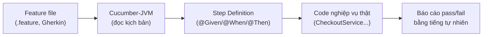

# 8. Behavior Testing & Cucumber-JVM

BDD (phát triển hướng hành vi) mô tả hành vi mong muốn của hệ thống bằng ngôn ngữ gần với tiếng tự nhiên, để cả người không biết lập trình cũng đọc hiểu được. Cucumber-JVM là công cụ BDD phổ biến cho Java, giúp nối các kịch bản viết bằng Gherkin với code thật. Bài này giới thiệu BDD, ngôn ngữ Gherkin và cách viết step definition; chi tiết nằm bên dưới.

[](pathname:///img/java/behavior-cucumber.webp)

---

:::note[Ghi nhớ nhanh]

- ⭐ **BDD mô tả hành vi bằng ngôn ngữ tự nhiên** — để cả người không biết lập trình cũng đọc hiểu; là ngôn ngữ chung giữa dev, tester và người nghiệp vụ.
- **Cucumber-JVM là công cụ BDD cho Java** — dùng Gherkin với từ khóa `Feature`/`Scenario`/`Given`/`When`/`Then`.
- **Feature file (`.feature`)** — chứa kịch bản viết bằng tiếng tự nhiên, KHÔNG có code Java.
- ⭐ **Step Definition (`@Given`/`@When`/`@Then`)** — code Java nối từng câu Gherkin với hành động thật; cần cấu hình đúng `glue`.
- **BDD hợp luồng nghiệp vụ quan trọng** — không thay thế unit test cho từng hàm nhỏ.

:::

---

## Mục lục

- [BDD (Behavior-Driven Development) là gì?](#bdd-behavior-driven-development-là-gì)
- [Vì sao cần BDD?](#vì-sao-cần-bdd)
- [Cucumber-JVM là gì?](#cucumber-jvm-là-gì)
- [Ngôn ngữ Gherkin: Given - When - Then](#ngôn-ngữ-gherkin-given---when---then)
- [Feature file (file kịch bản)](#feature-file-file-kịch-bản)
- [Step Definition (định nghĩa bước)](#step-definition-định-nghĩa-bước)
- [Chạy test với Cucumber](#chạy-test-với-cucumber)
- [Lợi ích giao tiếp với người không kỹ thuật](#lợi-ích-giao-tiếp-với-người-không-kỹ-thuật)
- [Lỗi thường gặp](#lỗi-thường-gặp)
- [Tóm tắt](#tóm-tắt)
- [Câu hỏi phỏng vấn](#câu-hỏi-phỏng-vấn)

---

## BDD (Behavior-Driven Development) là gì?

**BDD (Behavior-Driven Development — phát triển hướng hành vi)** là một cách làm phần mềm trong đó ta **mô tả hành vi mong muốn của hệ thống bằng ngôn ngữ gần với tiếng tự nhiên**, trước khi viết code.

Thay vì nói "test hàm `calculateDiscount`", BDD mô tả: "Khi khách hàng VIP mua hàng trên 1 triệu, thì được giảm 10%". Cách diễn đạt này **ai cũng hiểu** — kể cả người không biết lập trình.

BDD là sự mở rộng của **TDD (test trước, code sau)**, nhưng tập trung vào **hành vi nghiệp vụ** thay vì chi tiết kỹ thuật.

## Vì sao cần BDD?

Trong một dự án thường có nhiều vai trò: lập trình viên, tester, và **người làm nghiệp vụ** (business analyst, product owner — người hiểu yêu cầu khách hàng nhưng không code).

Vấn đề: lập trình viên đọc code, người nghiệp vụ đọc tài liệu — hai bên dễ **hiểu sai ý nhau**. Kết quả là code làm ra không đúng mong muốn.

BDD giải quyết bằng cách tạo ra **một "ngôn ngữ chung"** (gọi là **ubiquitous language** — ngôn ngữ phổ quát): các kịch bản viết bằng tiếng tự nhiên mà cả ba bên đều đọc và đồng ý được. Kịch bản đó vừa là **tài liệu**, vừa là **test tự động**.

> Ví dụ đời thường: Khi xây nhà, kiến trúc sư và chủ nhà cùng xem một bản vẽ dễ hiểu để thống nhất. BDD chính là "bản vẽ chung" cho phần mềm.

## Cucumber-JVM là gì?

**Cucumber** là công cụ BDD phổ biến nhất. **Cucumber-JVM** là phiên bản chạy trên nền Java (JVM).

Cucumber cho phép bạn viết kịch bản bằng **ngôn ngữ Gherkin** (tiếng tự nhiên), rồi nối từng câu trong kịch bản với code Java thật. Khi chạy, Cucumber đọc kịch bản và tự động gọi code tương ứng để kiểm tra.

Cài đặt (Maven):

```xml
<dependency>
    <groupId>io.cucumber</groupId>
    <artifactId>cucumber-java</artifactId>
    <version>7.15.0</version>
    <scope>test</scope>
</dependency>
<dependency>
    <groupId>io.cucumber</groupId>
    <artifactId>cucumber-junit-platform-engine</artifactId>
    <version>7.15.0</version>
    <scope>test</scope>
</dependency>
```

## Ngôn ngữ Gherkin: Given - When - Then

**Gherkin** là ngôn ngữ đặc biệt dùng các từ khóa tiếng Anh đơn giản để mô tả kịch bản:

- **`Feature`** (tính năng): mô tả tính năng đang test.
- **`Scenario`** (kịch bản): một tình huống cụ thể.
- **`Given`** (cho trước): trạng thái ban đầu / điều kiện.
- **`When`** (khi): hành động xảy ra.
- **`Then`** (thì): kết quả mong đợi.
- **`And` / `But`**: nối thêm bước cùng loại.

Cấu trúc Given-When-Then này y hệt tinh thần **Arrange-Act-Assert** của unit test, nhưng viết bằng tiếng tự nhiên.

## Feature file (file kịch bản)

Kịch bản Gherkin được lưu trong **feature file** (đuôi `.feature`), thường đặt trong `src/test/resources`.

```gherkin
# File: src/test/resources/features/giohang.feature
# Tính năng: Giỏ hàng và giảm giá

Feature: Giảm giá cho khách hàng VIP

  Scenario: Khách VIP mua trên 1 triệu được giảm 10%
    Given khách hàng là thành viên VIP
    And giỏ hàng có tổng tiền là 2000000 đồng
    When khách hàng tiến hành thanh toán
    Then tổng tiền sau giảm giá phải là 1800000 đồng

  Scenario: Khách thường không được giảm giá
    Given khách hàng là thành viên thường
    And giỏ hàng có tổng tiền là 2000000 đồng
    When khách hàng tiến hành thanh toán
    Then tổng tiền sau giảm giá phải là 2000000 đồng
```

Lưu ý: file này **không chứa code Java**. Người làm nghiệp vụ hoàn toàn có thể đọc và kiểm tra xem mô tả có đúng yêu cầu không.

## Step Definition (định nghĩa bước)

**Step Definition (định nghĩa bước)** là code Java nối **mỗi câu Gherkin** với hành động thực tế. Cucumber dùng annotation `@Given`, `@When`, `@Then` (kèm mẫu câu) để khớp.

```java
import io.cucumber.java.en.Given;
import io.cucumber.java.en.When;
import io.cucumber.java.en.Then;
import static org.junit.jupiter.api.Assertions.assertEquals;

public class GioHangSteps {

    private Customer khachHang;     // khách hàng trong kịch bản
    private Cart gioHang = new Cart();
    private long tongTienSauGiam;

    // Khớp với: "Given khách hàng là thành viên VIP"
    @Given("khách hàng là thành viên VIP")
    public void khachHangVip() {
        khachHang = new Customer(true);  // true = VIP
    }

    // Khớp với: "Given khách hàng là thành viên thường"
    @Given("khách hàng là thành viên thường")
    public void khachHangThuong() {
        khachHang = new Customer(false); // false = thường
    }

    // {long} là tham số: tự lấy con số trong câu Gherkin
    @Given("giỏ hàng có tổng tiền là {long} đồng")
    public void gioHangCoTongTien(long soTien) {
        gioHang.setTotal(soTien);
    }

    // Khớp với: "When khách hàng tiến hành thanh toán"
    @When("khách hàng tiến hành thanh toán")
    public void thanhToan() {
        // Gọi logic nghiệp vụ thật để tính tiền sau giảm
        tongTienSauGiam = new CheckoutService().checkout(khachHang, gioHang);
    }

    // Khớp với: "Then tổng tiền sau giảm giá phải là {long} đồng"
    @Then("tổng tiền sau giảm giá phải là {long} đồng")
    public void kiemTraTongTien(long mongDoi) {
        assertEquals(mongDoi, tongTienSauGiam);  // assert như unit test
    }
}
```

Mỗi câu trong feature file được Cucumber khớp với một phương thức `@Given/@When/@Then` tương ứng. Đây là "cầu nối" giữa tiếng tự nhiên và code thật.

Sơ đồ dưới đây minh hoạ cách Cucumber nối kịch bản Gherkin với code nghiệp vụ thật:



## Chạy test với Cucumber

Để JUnit 5 nhận và chạy các feature file, ta tạo một lớp khởi chạy (runner) với cấu hình trỏ tới thư mục feature:

```java
import org.junit.platform.suite.api.ConfigurationParameter;
import org.junit.platform.suite.api.IncludeEngines;
import org.junit.platform.suite.api.SelectClasspathResource;
import org.junit.platform.suite.api.Suite;
import static io.cucumber.junit.platform.engine.Constants.GLUE_PROPERTY_NAME;

@Suite
@IncludeEngines("cucumber")                          // dùng engine Cucumber
@SelectClasspathResource("features")                 // thư mục chứa file .feature
@ConfigurationParameter(
    key = GLUE_PROPERTY_NAME,
    value = "com.example.steps")                      // gói chứa các Step Definition
public class RunCucumberTest {
    // Lớp trống: chỉ dùng để cấu hình và khởi chạy
}
```

Chạy bằng `mvn test` (Maven) hoặc trong IDE. Cucumber đọc từng kịch bản, chạy các bước tương ứng, và báo kịch bản nào pass/fail bằng tiếng tự nhiên — rất dễ đọc kết quả.

## Lợi ích giao tiếp với người không kỹ thuật

Đây là điểm mạnh lớn nhất của BDD/Cucumber:

1. **Người nghiệp vụ đọc được test**: Feature file viết bằng tiếng tự nhiên, không cần biết Java vẫn hiểu.
2. **Thống nhất yêu cầu trước khi code**: Ba bên (nghiệp vụ, dev, tester) cùng viết và duyệt kịch bản, tránh hiểu lầm.
3. **Tài liệu luôn cập nhật**: Vì feature file vừa là tài liệu vừa là test, nếu code sai thì test fail — tài liệu không bao giờ "lỗi thời" so với code.
4. **Tái sử dụng bước**: Các bước như "khách hàng là thành viên VIP" dùng lại được trong nhiều kịch bản.

> Đánh đổi: BDD tốn công viết step definition và bảo trì. Nó **phù hợp nhất cho các luồng nghiệp vụ quan trọng** cần phối hợp với người không kỹ thuật, chứ không thay thế unit test cho từng hàm nhỏ.

## Lỗi thường gặp

1. **Câu Gherkin không khớp Step Definition**: Sai một chữ giữa feature file và annotation khiến Cucumber báo "bước chưa được định nghĩa" (undefined step). Hai bên phải khớp chính xác.
2. **Viết Gherkin quá kỹ thuật**: Câu như "Given gọi API POST /users với body JSON" làm mất ý nghĩa BDD. Hãy viết theo ngôn ngữ nghiệp vụ, dễ hiểu.
3. **Lạm dụng BDD cho mọi thứ**: Dùng Cucumber để test từng hàm nhỏ là phí công. Để việc đó cho unit test; BDD dành cho luồng nghiệp vụ.
4. **Quên cấu hình `glue`**: Không trỏ đúng gói chứa Step Definition, Cucumber không tìm thấy code để chạy.
5. **Kịch bản phụ thuộc lẫn nhau**: Mỗi `Scenario` nên độc lập, tự thiết lập dữ liệu của mình ở bước `Given`.

## Tóm tắt

- **BDD** mô tả hành vi hệ thống bằng **ngôn ngữ tự nhiên** trước khi viết code, để mọi người (kể cả người không kỹ thuật) cùng hiểu.
- **Cucumber-JVM** là công cụ BDD phổ biến cho Java.
- **Gherkin** dùng từ khóa **Feature / Scenario / Given / When / Then** để viết kịch bản, lưu trong **feature file** (`.feature`).
- **Step Definition** là code Java (`@Given/@When/@Then`) nối từng câu Gherkin với hành động thật.
- Lợi ích lớn nhất: **giao tiếp chung** giữa dev, tester và người nghiệp vụ; tài liệu luôn đồng bộ với code.
- BDD phù hợp cho **luồng nghiệp vụ quan trọng**, không thay thế unit test.
- Đây là bài cuối của chủ đề **Testing** — bạn đã đi từ unit test, framework (JUnit/TestNG), mocking (Mockito), integration test, API test (REST Assured), performance test (JMeter), đến BDD.

---

## Câu hỏi phỏng vấn

Những câu thường gặp về chủ đề này. Tự trả lời trước, rồi bấm **Xem đáp án** để đối chiếu.

**1. BDD (Behavior-Driven Development) là gì? Nó khác gì so với TDD ở trọng tâm mô tả?**

<details className="qa">
<summary>Xem đáp án</summary>

**BDD** là cách phát triển phần mềm trong đó hành vi mong muốn của hệ thống được **mô tả bằng ngôn ngữ gần với tiếng tự nhiên** trước khi viết code, sao cho cả người không biết lập trình cũng đọc hiểu được.

- **TDD** tập trung vào **chi tiết kỹ thuật**: viết test cho một hàm/class cụ thể trước khi implement (ví dụ "test hàm `calculateDiscount` trả về đúng giá trị").
- **BDD** tập trung vào **hành vi nghiệp vụ**, diễn đạt theo góc nhìn người dùng/khách hàng (ví dụ "khi khách hàng VIP mua trên 1 triệu, được giảm 10%") — có thể xem là một dạng mở rộng của TDD, nhưng dịch chuyển trọng tâm từ "kiểm tra đúng kỹ thuật" sang "kiểm tra đúng ý định nghiệp vụ".

</details>

**2. Vì sao BDD được xem là giải pháp cho vấn đề giao tiếp giữa lập trình viên và người làm nghiệp vụ (business analyst, product owner)? Khái niệm "ubiquitous language" nghĩa là gì?**

<details className="qa">
<summary>Xem đáp án</summary>

- Trong một dự án, lập trình viên thường đọc/viết code, còn người nghiệp vụ đọc tài liệu yêu cầu — hai bên dùng **ngôn ngữ và góc nhìn khác nhau**, dễ dẫn tới hiểu sai ý nhau, khiến sản phẩm cuối cùng không đúng mong muốn thực sự.
- **Ubiquitous language** ("ngôn ngữ phổ quát" — thuật ngữ vay mượn từ Domain-Driven Design) là một bộ từ vựng/cách diễn đạt **chung**, được cả lập trình viên, tester, và người nghiệp vụ cùng hiểu và đồng thuận sử dụng.
- BDD hiện thực hóa ý tưởng này bằng cách viết kịch bản test theo ngôn ngữ Gherkin — một hình thức viết vừa đủ tự nhiên để người nghiệp vụ đọc hiểu, vừa đủ cấu trúc để công cụ (Cucumber) tự động chạy như một test thật, giúp ba bên **cùng xem, cùng duyệt và cùng đồng ý** trên một tài liệu duy nhất trước khi code được viết.

</details>

**3. Liệt kê các từ khóa chính của ngôn ngữ Gherkin và giải thích ý nghĩa từng từ. Cấu trúc Given-When-Then tương ứng với mô hình nào trong unit test?**

<details className="qa">
<summary>Xem đáp án</summary>

| Từ khóa | Ý nghĩa |
|---|---|
| `Feature` | Mô tả tính năng đang được kiểm thử |
| `Scenario` | Một tình huống/kịch bản cụ thể trong tính năng đó |
| `Given` | Trạng thái ban đầu / điều kiện tiên quyết |
| `When` | Hành động xảy ra |
| `Then` | Kết quả mong đợi sau hành động |
| `And` / `But` | Nối thêm bước cùng loại với bước trước đó, giúp câu văn tự nhiên hơn |

- Cấu trúc **Given-When-Then** tương ứng trực tiếp với mô hình **Arrange-Act-Assert (AAA)** của unit test: `Given` ≈ Arrange (chuẩn bị), `When` ≈ Act (hành động), `Then` ≈ Assert (kiểm tra kết quả) — chỉ khác là được diễn đạt bằng tiếng tự nhiên thay vì code.

</details>

**4. Feature file (`.feature`) có chứa code Java không? Vì sao thiết kế này lại quan trọng đối với mục tiêu của BDD?**

<details className="qa">
<summary>Xem đáp án</summary>

**Không.** Feature file chỉ chứa các câu Gherkin thuần túy bằng ngôn ngữ tự nhiên (`Feature`, `Scenario`, `Given`, `When`, `Then`...), hoàn toàn **không có bất kỳ dòng code Java nào**.

```gherkin
Scenario: Khách VIP mua trên 1 triệu được giảm 10%
    Given khách hàng là thành viên VIP
    And giỏ hàng có tổng tiền là 2000000 đồng
    When khách hàng tiến hành thanh toán
    Then tổng tiền sau giảm giá phải là 1800000 đồng
```

- Điều này quan trọng vì mục tiêu cốt lõi của BDD là để **người không biết lập trình** (business analyst, product owner, tester không code) cũng có thể **đọc, hiểu và xác nhận** kịch bản có đúng với mong muốn nghiệp vụ hay không — nếu feature file lẫn code Java vào, mục tiêu "ngôn ngữ chung dễ hiểu cho mọi người" sẽ bị phá vỡ.
- Toàn bộ phần "kỹ thuật" (gọi code thật, assertion) được tách riêng sang **Step Definition** — nơi lập trình viên viết code Java để nối mỗi câu Gherkin với hành động thực tế.

</details>

**5. Cho feature file và step definition sau, giải thích cơ chế Cucumber dùng để "khớp" (match) một câu Gherkin với đúng phương thức Java tương ứng.**

```gherkin
Given giỏ hàng có tổng tiền là 2000000 đồng
```

```java
@Given("giỏ hàng có tổng tiền là {long} đồng")
public void gioHangCoTongTien(long soTien) {
    gioHang.setTotal(soTien);
}
```

<details className="qa">
<summary>Xem đáp án</summary>

- Cucumber so khớp câu Gherkin với **chuỗi mẫu (pattern)** được khai báo trong annotation `@Given(...)`, trong đó `{long}` là một **kiểu tham số (parameter type)** được Cucumber tự nhận diện: bất kỳ số nguyên nào xuất hiện đúng vị trí đó trong câu Gherkin sẽ được **tự động trích xuất** và truyền vào phương thức Java tương ứng dưới dạng tham số kiểu `long`.
- Với câu `"giỏ hàng có tổng tiền là 2000000 đồng"`, phần `{long}` khớp với `2000000`, nên Cucumber gọi `gioHangCoTongTien(2000000L)` — giá trị `2000000` được truyền vào tham số `soTien`.
- Cucumber còn hỗ trợ các kiểu tham số dựng sẵn khác như `{string}`, `{int}`, `{word}`, giúp việc trích xuất dữ liệu từ câu Gherkin sang tham số Java diễn ra tự động mà không cần tự viết logic parse chuỗi thủ công.

</details>

**6. Nếu một câu trong feature file không khớp chính xác với bất kỳ pattern nào đã khai báo trong Step Definition (ví dụ lệch một chữ), điều gì xảy ra khi chạy Cucumber?**

<details className="qa">
<summary>Xem đáp án</summary>

Cucumber sẽ báo bước đó là **"undefined step"** (bước chưa được định nghĩa) — nó **không tìm thấy** phương thức Java nào có pattern khớp chính xác với câu Gherkin đang xét.

- Kịch bản (`Scenario`) chứa bước đó thường được đánh dấu **không thực thi được** (thường hiển thị màu vàng/pending trong báo cáo, chứ không phải fail đỏ hay pass xanh), vì Cucumber không biết phải gọi hành động nào để thực hiện bước này.
- Đây là lý do lệch dù chỉ **một chữ, một dấu cách, hay sai kiểu tham số** giữa câu Gherkin và pattern trong `@Given`/`@When`/`@Then` cũng khiến việc khớp thất bại — Cucumber yêu cầu độ khớp khá chính xác giữa văn bản kịch bản và pattern khai báo trong code.
- Một số công cụ/IDE tích hợp Cucumber còn có thể **tự sinh gợi ý** khung code Step Definition còn thiếu, giúp lập trình viên nhanh chóng bổ sung.

</details>

**7. Đoạn Gherkin sau vi phạm nguyên tắc viết BDD tốt như thế nào? Viết lại theo đúng tinh thần BDD.**

```gherkin
Scenario: Tạo user
  Given gọi API POST /users với body { "name": "An", "email": "an@example.com" }
  When server xử lý request
  Then response trả về status code 201 và JSON có field "id" khác null
```

<details className="qa">
<summary>Xem đáp án</summary>

**Vấn đề**: kịch bản viết **quá thiên về kỹ thuật** (nhắc tới `POST`, đường dẫn API cụ thể, cấu trúc JSON, status code HTTP) — một người làm nghiệp vụ không rành kỹ thuật sẽ **khó hiểu** ý nghĩa thực sự của kịch bản này là gì về mặt nghiệp vụ, làm mất đi mục đích cốt lõi của BDD là tạo "ngôn ngữ chung dễ hiểu cho mọi người".

Viết lại theo đúng tinh thần BDD — mô tả bằng góc nhìn nghiệp vụ, ẩn chi tiết kỹ thuật:

```gherkin
Scenario: Đăng ký tài khoản người dùng mới thành công
  Given chưa có tài khoản nào với email "an@example.com"
  When khách hàng đăng ký tài khoản với tên "An" và email "an@example.com"
  Then hệ thống tạo tài khoản mới thành công
```

- Chi tiết kỹ thuật (gọi API nào, kiểm tra status code nào) được **ẩn bên trong Step Definition** — người đọc feature file chỉ cần quan tâm **"chuyện gì xảy ra về mặt nghiệp vụ"**, không cần biết đằng sau đó là một API POST hay logic nào khác.

</details>

**8. Vì sao BDD/Cucumber "không thay thế unit test cho từng hàm nhỏ"? Trong một dự án thực tế, nên áp dụng BDD cho loại kịch bản nào?**

<details className="qa">
<summary>Xem đáp án</summary>

- BDD/Cucumber có **chi phí viết và bảo trì cao hơn** unit test thông thường: mỗi kịch bản cần cả feature file lẫn step definition tương ứng, và việc giữ chúng khớp chính xác với nhau đòi hỏi công sức bảo trì liên tục.
- Dùng Cucumber để test từng hàm nhỏ, chi tiết kỹ thuật thuần túy (ví dụ "hàm `add(2,3)` trả về `5`") là **lãng phí** — những trường hợp này không cần "ngôn ngữ chung với người nghiệp vụ" vì bản thân chúng không mang ý nghĩa nghiệp vụ trực tiếp mà người dùng cuối quan tâm.
- BDD phù hợp nhất cho các **luồng nghiệp vụ quan trọng, cần sự đồng thuận** giữa dev, tester và người nghiệp vụ — ví dụ luồng đăng ký tài khoản, luồng thanh toán, chính sách giảm giá, quy trình duyệt đơn hàng — nơi việc mô tả đúng **ý định nghiệp vụ** có giá trị cao hơn nhiều so với chi phí bảo trì thêm một tầng feature file.
- Chiến lược hợp lý: dùng **unit test** cho phần lớn logic chi tiết (nhanh, rẻ, nhiều), dùng **BDD/Cucumber** có chọn lọc cho những kịch bản nghiệp vụ cốt lõi cần giao tiếp rõ ràng với các bên không kỹ thuật.

</details>

**9. `glue` trong cấu hình Cucumber-JVM (`@ConfigurationParameter(key = GLUE_PROPERTY_NAME, value = "com.example.steps")`) có tác dụng gì? Điều gì xảy ra nếu cấu hình sai package này?**

<details className="qa">
<summary>Xem đáp án</summary>

- **`glue`** báo cho Cucumber biết **package nào chứa các Step Definition** (các class có phương thức đánh dấu `@Given`/`@When`/`@Then`) — Cucumber cần biết vị trí này để **quét (scan)** và tìm đúng các phương thức cần gọi khi đọc feature file.
- Nếu cấu hình **sai** package (ví dụ trỏ tới `com.example.step` thay vì `com.example.steps`, thiếu chữ "s"), Cucumber sẽ **không tìm thấy bất kỳ Step Definition nào** trong package đó — mọi câu Gherkin trong feature file sẽ bị báo là **"undefined step"**, dù thực chất code Step Definition vẫn tồn tại đúng chỗ, chỉ là Cucumber không được chỉ đường tới đó.
- Đây là lỗi cấu hình phổ biến khi mới thiết lập Cucumber, dễ khiến lập trình viên tưởng nhầm là mình viết sai step definition trong khi thực chất chỉ là đường dẫn `glue` bị sai.

</details>

**10. Tình huống: một `Scenario` trong feature file dùng lại kết quả từ `Scenario` chạy ngay trước đó (ví dụ Scenario 2 giả định giỏ hàng vẫn còn dữ liệu từ Scenario 1). Đây có phải cách viết tốt không? Vì sao?**

<details className="qa">
<summary>Xem đáp án</summary>

**Không phải cách viết tốt.** Mỗi `Scenario` trong Cucumber nên được thiết kế **độc lập hoàn toàn** với các `Scenario` khác — tự thiết lập đầy đủ dữ liệu/điều kiện nó cần ngay trong các bước `Given` của chính nó, không giả định hay phụ thuộc vào trạng thái để lại từ scenario chạy trước.

- Vi phạm tính độc lập gây ra các vấn đề tương tự như trong unit test: nếu `Scenario 1` bị sửa đổi, xóa, hoặc chạy fail giữa chừng, `Scenario 2` phụ thuộc vào nó sẽ **cho kết quả sai lệch hoặc lỗi khó hiểu**, dù bản thân logic của `Scenario 2` hoàn toàn đúng.
- Cucumber cũng **không đảm bảo thứ tự chạy scenario cố định** trong mọi trường hợp (tùy cấu hình, có thể chạy song song hoặc random để tăng tốc), nên việc phụ thuộc thứ tự là một giả định không an toàn.
- Cách viết đúng: mỗi `Scenario` tự khai báo đầy đủ bước `Given` cần thiết (ví dụ tự tạo lại khách hàng, tự thiết lập lại giỏ hàng), dù có thể trông "lặp lại" so với scenario khác — sự lặp lại này là cái giá chấp nhận được để đổi lấy tính độc lập và độ tin cậy của bộ test.

</details>
