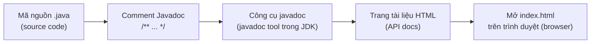

# 1. Javadoc

Javadoc là công cụ đi kèm bộ JDK, đọc các comment đặc biệt trong mã nguồn rồi tự động sinh ra tài liệu HTML mô tả các lớp, phương thức và tham số. Nó giúp người khác (và cả bạn sau này) hiểu code nhanh hơn mà không cần đọc từng dòng lệnh. Bài này hướng dẫn cú pháp comment Javadoc, các tag thường dùng và cách sinh tài liệu; chi tiết nằm bên dưới.

---

:::note[Ghi nhớ nhanh]

- ⭐ **Javadoc là công cụ JDK sinh tài liệu HTML từ comment `/** ... */`** — chỉ đọc comment mở bằng `/**` (hai dấu sao), đặt ngay sát trên phần tử mô tả.
- **Khối gồm phần mô tả + các block tag `@`** — câu đầu tiên (kết thúc bằng dấu chấm) được coi là tóm tắt.
- **Block tag hay dùng** — `@param`, `@return`, `@throws`, `@author`, `@since`, `@deprecated`, `@see`, `@version`.
- **Inline tag `{@link}` và `{@code}`** — tạo liên kết tới phần tử khác và hiển thị văn bản kiểu mã nguồn.
- ⭐ **Sinh tài liệu bằng lệnh `javadoc -d <thư-mục> *.java`** — thêm `-author`, `-version`, `-private` khi cần.

:::

---

## Mục lục

- [Javadoc là gì?](#javadoc-là-gì)
- [Tại sao cần Javadoc?](#tại-sao-cần-javadoc)
- [Cú pháp comment Javadoc](#cú-pháp-comment-javadoc)
- [Cấu trúc một khối Javadoc](#cấu-trúc-một-khối-javadoc)
- [Các tag thường dùng](#các-tag-thường-dùng)
- [Các inline tag](#các-inline-tag)
- [Lệnh javadoc sinh tài liệu HTML](#lệnh-javadoc-sinh-tài-liệu-html)
- [Quy ước viết tài liệu tốt](#quy-ước-viết-tài-liệu-tốt)
- [Ví dụ tài liệu hóa một lớp đầy đủ](#ví-dụ-tài-liệu-hóa-một-lớp-đầy-đủ)
- [Lỗi thường gặp](#lỗi-thường-gặp)
- [Tóm tắt](#tóm-tắt)

---

## Javadoc là gì?

**Javadoc** là một công cụ (tool) đi kèm sẵn với bộ JDK (Java Development Kit — bộ công cụ
phát triển Java). Nó đọc các đoạn **comment** (chú thích) đặc biệt trong mã nguồn `.java`
của bạn, rồi tự động sinh ra **tài liệu dạng HTML** (trang web mô tả các lớp, phương thức,
tham số...).

Hãy hình dung như thế này: bạn viết một quyển sách công thức nấu ăn (mã nguồn). Bên cạnh mỗi
công thức, bạn ghi chú thêm vài dòng giải thích "món này dùng để làm gì, cần nguyên liệu gì,
ra kết quả gì". Javadoc giống như một người biên tập: nó gom hết các ghi chú đó lại và in
thành một quyển cẩm nang đẹp đẽ, có mục lục, có liên kết, để người khác đọc mà không cần
mở mã nguồn ra xem.

Chính trang tài liệu API của Java mà bạn hay tra cứu (ví dụ tài liệu của lớp `String`,
`ArrayList`) cũng được sinh ra bằng Javadoc.

## Tại sao cần Javadoc?

- **Người khác hiểu code của bạn nhanh hơn**: thay vì đọc từng dòng lệnh, họ chỉ cần đọc
  mô tả "phương thức này làm gì, nhận gì, trả về gì".
- **Chính bạn của 6 tháng sau cũng cần**: code viết xong rồi quên là chuyện rất bình thường.
- **IDE gợi ý ngay khi gõ**: các trình soạn thảo như IntelliJ IDEA hay Eclipse sẽ hiển thị
  nội dung Javadoc khi bạn rê chuột vào tên phương thức.
- **Tạo tài liệu chuyên nghiệp** cho thư viện (library) bạn chia sẻ cho người khác dùng.

## Cú pháp comment Javadoc

Java có 3 loại comment, nhưng chỉ loại thứ ba mới là Javadoc:

```java
// Comment một dòng (single-line) — chỉ ghi chú nhanh, KHÔNG phải Javadoc

/* Comment nhiều dòng (multi-line) — ghi chú thường, KHÔNG phải Javadoc */

/**
 * Đây là comment Javadoc — bắt đầu bằng dấu /** (hai dấu sao).
 * Mỗi dòng bên trong thường bắt đầu bằng dấu * cho đẹp.
 * Javadoc CHỈ đọc loại comment này.
 */
```

Điểm mấu chốt: comment Javadoc luôn mở bằng `/**` (gạch chéo + **hai** dấu sao) và đóng
bằng `*/`. Comment thường chỉ có **một** dấu sao `/*` sẽ bị Javadoc bỏ qua.

**Vị trí đặt**: comment Javadoc phải đặt **ngay phía trên** thứ mà nó mô tả — ngay trên
khai báo lớp (class), phương thức (method), hoặc thuộc tính (field). Nếu đặt sai chỗ
(ví dụ có dòng trống hay câu lệnh xen vào giữa), Javadoc sẽ không gắn được.

```java
/**
 * Mô tả này gắn đúng cho phương thức bên dưới.
 */
public void chao() { }   // đúng: comment nằm sát ngay trên
```

## Cấu trúc một khối Javadoc

Một khối Javadoc gồm 2 phần:

1. **Phần mô tả (description)**: viết bằng câu văn bình thường, có thể nhiều dòng. Đây là
   nơi giải thích "thứ này làm gì".
2. **Phần các tag (block tags)**: bắt đầu bằng dấu `@`, đứng sau phần mô tả, mỗi tag một
   dòng. Tag dùng để khai báo thông tin có cấu trúc như tham số, giá trị trả về...

```java
/**
 * Tính tổng hai số nguyên.   <-- phần mô tả
 *
 * @param a số hạng thứ nhất   <-- bắt đầu phần tag
 * @param b số hạng thứ hai
 * @return tổng của a và b
 */
public int cong(int a, int b) {
    return a + b;
}
```

Quy ước: câu đầu tiên của phần mô tả (kết thúc bằng dấu chấm) được coi là **tóm tắt
(summary)** và sẽ hiển thị trong bảng danh sách phương thức. Vì vậy hãy viết câu đầu thật
rõ và ngắn gọn.

## Các tag thường dùng

| Tag | Ý nghĩa | Đặt ở đâu |
| --- | --- | --- |
| `@param` | Mô tả một tham số (parameter — dữ liệu truyền vào) | Phương thức, constructor |
| `@return` | Mô tả giá trị trả về (return value) | Phương thức có trả về |
| `@throws` (hoặc `@exception`) | Mô tả ngoại lệ (exception — lỗi) mà phương thức có thể ném ra | Phương thức |
| `@author` | Ghi tên tác giả | Lớp, interface |
| `@since` | Cho biết tính năng có từ phiên bản nào | Lớp, phương thức |
| `@deprecated` | Đánh dấu "đã lỗi thời, đừng dùng nữa" | Lớp, phương thức |
| `@see` | Liên kết tham khảo tới phần tử khác | Bất kỳ |
| `@version` | Số phiên bản của lớp | Lớp |

Ví dụ minh họa từng tag:

```java
/**
 * Chia hai số nguyên.
 *
 * @param a số bị chia
 * @param b số chia (phải khác 0)
 * @return thương của phép chia a / b
 * @throws ArithmeticException nếu b bằng 0
 * @author Thuan
 * @since 1.0
 * @see #cong(int, int)
 */
public int chia(int a, int b) {
    // Nếu b = 0 thì ném ngoại lệ, đúng như mô tả ở @throws
    if (b == 0) {
        throw new ArithmeticException("Không thể chia cho 0");
    }
    return a / b;
}
```

Lưu ý về `@deprecated`: dùng để báo cho người dùng "phương thức này còn chạy được nhưng
không nên dùng nữa, sẽ có cái khác thay thế". Thường đi kèm với annotation `@Deprecated`
(viết hoa, đặt trên dòng khai báo):

```java
/**
 * @deprecated Hãy dùng {@link #chao(String)} thay cho phương thức này.
 */
@Deprecated
public void chaoCu() {
    System.out.println("Xin chào");
}
```

## Các inline tag

**Inline tag** là tag được viết *bên trong* câu văn, đặt trong dấu ngoặc nhọn `{ }`. Hai
loại hay dùng nhất:

- `{@link ...}` — tạo một **đường liên kết** tới lớp hoặc phương thức khác. Khi đọc tài
  liệu HTML, người dùng bấm vào sẽ nhảy tới đó.
- `{@code ...}` — hiển thị đoạn văn bản theo **kiểu mã nguồn** (font chữ đều, giữ nguyên
  ký tự như `<`, `>`). Rất tiện để viết tên biến, đoạn lệnh ngắn trong mô tả.

```java
/**
 * Trả về phần tử đầu tiên của danh sách.
 *
 * <p>Nếu danh sách rỗng, phương thức trả về {@code null}.
 * Để thêm phần tử, hãy dùng {@link #add(Object)}.
 */
public Object dauTien() {
    return null; // ví dụ minh họa
}
```

Trong ví dụ trên: `{@code null}` hiển thị chữ `null` theo kiểu code, còn `{@link #add(Object)}`
tạo liên kết tới phương thức `add`. Dấu `#` nghĩa là "phương thức trong cùng lớp này".

## Lệnh javadoc sinh tài liệu HTML

Sau khi viết comment xong, bạn dùng lệnh `javadoc` ở cửa sổ dòng lệnh (terminal) để sinh
ra trang HTML.

```bash
# Sinh tài liệu cho 1 file, lưu kết quả vào thư mục docs/
javadoc -d docs MayTinh.java

# Sinh tài liệu cho tất cả file .java trong thư mục hiện tại
javadoc -d docs *.java

# Sinh tài liệu cho cả một package (gói), kèm cả thành phần private
javadoc -d docs -private -author com.example.calc
```

Giải thích các tùy chọn (option) hay dùng:

- `-d <thư-mục>`: chỉ định nơi lưu file HTML kết quả (`d` là viết tắt của *directory*).
- `-author`: đưa thông tin `@author` vào tài liệu (mặc định bị ẩn).
- `-version`: đưa thông tin `@version` vào tài liệu (mặc định bị ẩn).
- `-private`: tài liệu hóa cả thành phần `private` (mặc định chỉ lấy `public` và `protected`).

Sau khi chạy xong, mở file `index.html` trong thư mục `docs` bằng trình duyệt là thấy trang
tài liệu giống hệt tài liệu API chính thức của Java.

Sơ đồ dưới đây tóm tắt luồng sinh tài liệu: từ mã nguồn có comment Javadoc, qua công cụ `javadoc`, cho ra trang HTML.



## Quy ước viết tài liệu tốt

- **Câu đầu tiên là tóm tắt**: viết ngắn, đủ nghĩa, kết thúc bằng dấu chấm. Ví dụ
  "Tính diện tích hình tròn." chứ không phải "Phương thức này thì..." dài dòng.
- **Mô tả "cái gì", không mô tả "làm thế nào"**: người đọc tài liệu quan tâm phương thức
  *làm được gì*, không cần biết bên trong code chạy ra sao.
- **Mỗi tham số một `@param`**: và đặt theo đúng thứ tự khai báo.
- **Luôn có `@return`** nếu phương thức trả về giá trị (trừ khi kiểu trả về là `void`).
- **Khai báo `@throws`** cho mọi ngoại lệ quan trọng mà người gọi cần biết.
- **Dùng `{@code}`** cho tên biến, giá trị (`true`, `false`, `null`), tránh để IDE hiểu nhầm.
- **Văn phong nhất quán**: ví dụ mô tả phương thức bắt đầu bằng động từ ngôi thứ ba số ít
  trong tiếng Anh ("Returns...", "Calculates..."), còn tiếng Việt thì dùng động từ mệnh
  lệnh/khẳng định ngắn gọn.

## Ví dụ tài liệu hóa một lớp đầy đủ

Dưới đây là một lớp `BankAccount` (tài khoản ngân hàng) được tài liệu hóa hoàn chỉnh, áp
dụng tất cả các tag đã học:

```java
/**
 * Đại diện cho một tài khoản ngân hàng đơn giản.
 *
 * <p>Lớp này cho phép gửi tiền, rút tiền và xem số dư hiện tại.
 * Số dư không bao giờ được phép âm.
 *
 * @author Thuan
 * @version 1.0
 * @since 1.0
 */
public class BankAccount {

    /** Số dư hiện tại của tài khoản, tính bằng đồng. */
    private long balance;

    /**
     * Tạo một tài khoản mới với số dư ban đầu.
     *
     * @param soDuBanDau số tiền có sẵn lúc mở tài khoản (không được âm)
     * @throws IllegalArgumentException nếu {@code soDuBanDau} nhỏ hơn 0
     */
    public BankAccount(long soDuBanDau) {
        if (soDuBanDau < 0) {
            throw new IllegalArgumentException("Số dư ban đầu không được âm");
        }
        this.balance = soDuBanDau;
    }

    /**
     * Gửi thêm tiền vào tài khoản.
     *
     * @param soTien số tiền muốn gửi (phải lớn hơn 0)
     * @throws IllegalArgumentException nếu {@code soTien} không dương
     */
    public void guiTien(long soTien) {
        if (soTien <= 0) {
            throw new IllegalArgumentException("Số tiền gửi phải lớn hơn 0");
        }
        balance += soTien; // cộng tiền vào số dư
    }

    /**
     * Rút tiền khỏi tài khoản.
     *
     * @param soTien số tiền muốn rút (phải lớn hơn 0 và không vượt quá số dư)
     * @return số dư còn lại sau khi rút
     * @throws IllegalArgumentException nếu số tiền rút không hợp lệ hoặc vượt quá số dư
     * @see #getSoDu()
     */
    public long rutTien(long soTien) {
        if (soTien <= 0 || soTien > balance) {
            throw new IllegalArgumentException("Số tiền rút không hợp lệ");
        }
        balance -= soTien; // trừ tiền khỏi số dư
        return balance;
    }

    /**
     * Trả về số dư hiện tại của tài khoản.
     *
     * @return số dư tính bằng đồng
     */
    public long getSoDu() {
        return balance;
    }

    /**
     * Cách xem số dư cũ, dùng kiểu int.
     *
     * @return số dư dưới dạng int
     * @deprecated Hãy dùng {@link #getSoDu()} vì nó trả về {@code long}.
     */
    @Deprecated
    public int xemSoDuCu() {
        return (int) balance;
    }
}
```

Khi chạy `javadoc -d docs -author -version BankAccount.java`, bạn sẽ có một trang web mô tả
đầy đủ lớp này: tên tác giả, phiên bản, danh sách phương thức với tham số, giá trị trả về,
ngoại lệ, và các liên kết bấm được giữa các phương thức.

## Lỗi thường gặp

- **Dùng `/*` thay vì `/**`**: comment chỉ có một dấu sao sẽ bị Javadoc bỏ qua hoàn toàn,
  không xuất hiện trong tài liệu.
- **Đặt comment sai vị trí**: nếu giữa comment và phần khai báo có dòng trống hay câu lệnh
  khác, Javadoc không gắn được. Comment phải nằm **sát ngay trên**.
- **Thiếu `@param` hoặc sai tên tham số**: tên trong `@param` phải trùng đúng tên tham số
  trong code, nếu không Javadoc sẽ báo cảnh báo (warning).
- **Quên `@return` cho phương thức có trả về**: làm tài liệu thiếu thông tin quan trọng.
- **Viết câu tóm tắt quá dài hoặc không có dấu chấm**: khiến phần tóm tắt trong bảng bị
  hiển thị lộn xộn.
- **Nhầm inline tag với block tag**: `{@link}` và `{@code}` phải có ngoặc nhọn và nằm trong
  câu; còn `@param`, `@return` đứng đầu dòng riêng, không có ngoặc nhọn.
- **Dùng ký tự `<`, `>` trực tiếp trong mô tả**: Javadoc hiểu đó là thẻ HTML. Hãy bọc trong
  `{@code}` hoặc viết `&lt;`, `&gt;`.

## Tóm tắt

- **Javadoc** là công cụ của JDK, đọc comment đặc biệt `/** ... */` và sinh ra tài liệu HTML.
- Comment Javadoc gồm **phần mô tả** (câu đầu là tóm tắt) và **các tag** bắt đầu bằng `@`.
- Tag block hay dùng: `@param`, `@return`, `@throws`, `@author`, `@since`, `@deprecated`,
  `@see`, `@version`.
- Inline tag hay dùng: `{@link}` (liên kết) và `{@code}` (hiển thị kiểu mã nguồn).
- Dùng lệnh `javadoc -d <thư-mục> *.java` để sinh tài liệu; thêm `-author`, `-version`,
  `-private` khi cần.
- Viết tài liệu tốt: câu tóm tắt ngắn rõ, mô tả "cái gì", đầy đủ `@param`/`@return`/`@throws`.
- Tài liệu hóa code không chỉ giúp người khác, mà còn giúp chính bạn trong tương lai.
