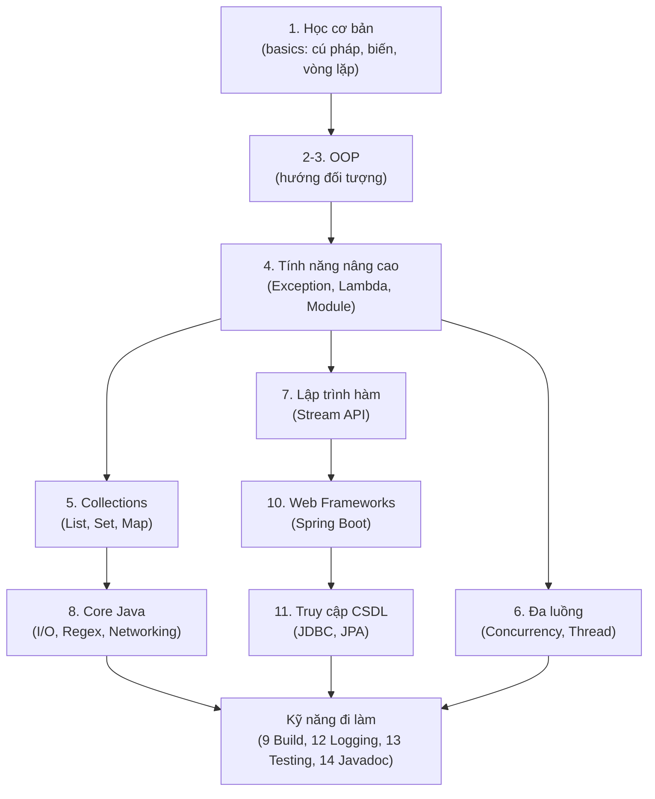

# Lộ trình học Java từ con số 0

Chào mừng bạn đến với lộ trình học **Java** đầy đủ, được soạn cho người **chưa biết gì** về lập trình Java. Mỗi khái niệm đều được giải thích dễ hiểu, và mỗi **thuật ngữ chuyên ngành** (technical term — từ ngữ kỹ thuật riêng của ngành) sẽ được giải thích ngay bên dưới khi xuất hiện lần đầu.

---

## Java là gì?

**Java** là một **ngôn ngữ lập trình** (programming language — bộ quy tắc để viết ra chương trình máy tính) ra đời năm 1995, nổi tiếng với khẩu hiệu *"Write Once, Run Anywhere"* (Viết một lần, chạy mọi nơi).

Điều đó có nghĩa là: bạn viết code Java một lần, rồi chạy được trên Windows, macOS, Linux... mà không cần sửa lại. Bí mật nằm ở **JVM** (Java Virtual Machine — Máy ảo Java, một phần mềm trung gian dịch code Java cho từng hệ điều hành hiểu).

Java được dùng rộng rãi để xây dựng:

- **Ứng dụng web phía máy chủ** (backend — phần xử lý logic và dữ liệu, người dùng không nhìn thấy)
- **Ứng dụng Android** (cùng với Kotlin)
- **Hệ thống doanh nghiệp lớn** (ngân hàng, thương mại điện tử...)
- **Hệ thống dữ liệu lớn** (Big Data — xử lý lượng dữ liệu khổng lồ)

---

## Lộ trình gồm những gì?

Lộ trình được chia thành **14 chủ đề lớn**, đi từ cơ bản đến nâng cao:

| # | Chủ đề | Nội dung chính |
|---|--------|----------------|
| 1 | **Học cơ bản** | Cú pháp, kiểu dữ liệu, biến, vòng lặp, mảng... |
| 2 | **Cơ bản về OOP** | Lớp, đối tượng, thuộc tính, phương thức |
| 3 | **OOP nâng cao** | Kế thừa, đóng gói, interface, enum, record |
| 4 | **Tính năng nâng cao** | Ngoại lệ, Lambda, Annotation, Module |
| 5 | **Collections** | List, Set, Map, Queue, Stack... |
| 6 | **Đa luồng (Concurrency)** | Thread, Virtual Thread, Memory Model |
| 7 | **Lập trình hàm** | Stream API, Functional Interface |
| 8 | **Core Java** | Regex, I/O, File, Networking, Mã hóa |
| 9 | **Công cụ build** | Maven, Gradle, Bazel |
| 10 | **Web Frameworks** | Spring Boot, Quarkus, Javalin |
| 11 | **Truy cập CSDL** | JDBC, Hibernate, Spring Data JPA |
| 12 | **Logging** | SLF4J, Logback, Log4j2 |
| 13 | **Testing** | JUnit, Mockito, Integration Test |
| 14 | **Tài liệu (Javadoc)** | Viết tài liệu cho code |

> **OOP** (Object-Oriented Programming — Lập trình hướng đối tượng) là cách viết code bằng cách mô phỏng các "đối tượng" trong thế giới thực (như Người, Xe, Tài khoản...). Đây là phần cốt lõi của Java.

---

## Học theo thứ tự nào?

Nếu bạn mới bắt đầu, hãy học **lần lượt từ chủ đề 1 đến 4**. Đây là nền tảng bắt buộc. Sau đó:

- Muốn làm **backend web** → học tiếp 5, 7, 10, 11, 13
- Muốn hiểu sâu **hiệu năng** → học 6 (Concurrency)
- Khi đi làm thực tế → 9 (build tools), 12 (logging), 14 (tài liệu)

Sơ đồ dưới đây phác họa tổng quan lộ trình học, đi từ nền tảng bắt buộc tới các nhánh chuyên sâu theo mục tiêu.

Chúc bạn học tốt! Hãy bắt đầu từ chủ đề **[1. Học cơ bản](./01-learn-the-basics/1_cu-phap-co-ban.md)**.
