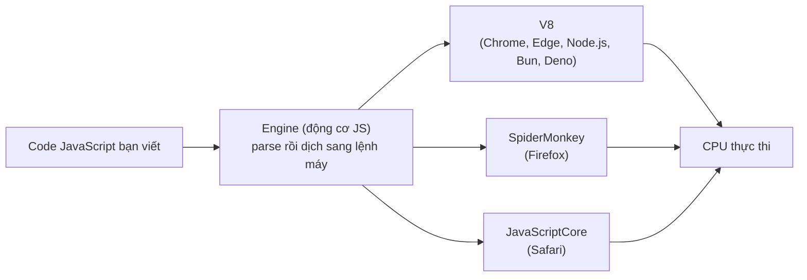
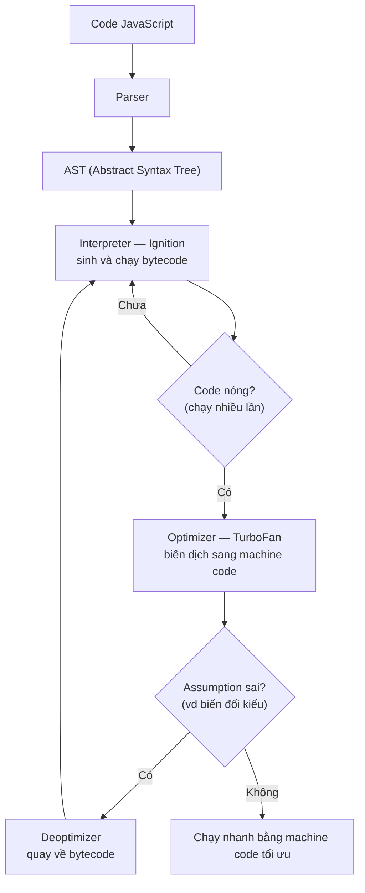

# JavaScript là gì?

JavaScript là ngôn ngữ lập trình phổ biến nhất cho web, giúp trang web trở nên "sống động" và tương tác được với người dùng (như bấm nút, hiện thông báo, kiểm tra biểu mẫu). Bài này giới thiệu khái niệm tổng quan; phần định nghĩa chi tiết nằm ngay bên dưới.

---

:::note[Ghi nhớ nhanh]

- ⭐ **JavaScript là ngôn ngữ thông dịch** — máy đọc và chạy từng dòng ngay, chạy được ở trình duyệt, server (`Node.js`), mobile, desktop.
- **Ba trụ cột của web** — `HTML` (cấu trúc), `CSS` (giao diện), `JavaScript` (hành vi, tương tác).
- **JS cần một engine để chạy** — `V8` (Chrome, Node.js), `SpiderMonkey` (Firefox), `JavaScriptCore` (Safari).
- **4 đặc điểm cốt lõi** — dynamic typing, single-threaded (dùng event loop), first-class functions, prototype-based.
- ⭐ **JavaScript ≠ Java** — hai ngôn ngữ không liên quan, chỉ trùng tên do marketing năm 1995.

:::

---

## Mục lục

- [Định nghĩa](#định-nghĩa)
- [Ba trụ cột của web](#ba-trụ-cột-của-web)
- [JavaScript chạy ở đâu?](#javascript-chạy-ở-đâu)
- [Đặc điểm cốt lõi](#đặc-điểm-cốt-lõi)

---

## Định nghĩa

**JavaScript (JS)** là ngôn ngữ lập trình **thông dịch**, ban đầu sinh
ra để tạo tương tác cho trang web. Ngày nay nó chạy được cả ở **trình
duyệt**, **server (Node.js)**, **mobile**, **desktop** và **embedded**.

> **Thông dịch** (interpret) là cách chạy code mà máy **đọc và thực thi từng dòng ngay lập tức**, không cần biên dịch toàn bộ ra file riêng trước. Trái với **biên dịch** (compile) — phải dịch toàn bộ chương trình sang ngôn ngữ máy rồi mới chạy.

```js
console.log("Hello, JavaScript!");
```

---

## Ba trụ cột của web

| Công nghệ | Vai trò |
|-----------|---------|
| **HTML** | Cấu trúc nội dung (text, image, form...) |
| **CSS** | Giao diện, bố cục, animation |
| **JavaScript** | Hành vi, tương tác, logic |

---

## JavaScript chạy ở đâu?

JavaScript cần một **engine** để chạy. Mỗi môi trường có engine riêng:

> **Engine** (động cơ JavaScript) là một **chương trình** có nhiệm vụ **đọc code JavaScript và biến nó thành lệnh mà máy tính thực thi được**. Bạn viết JS, nhưng CPU không hiểu JS — engine đứng giữa làm "phiên dịch": nó phân tích cú pháp (parse) code, chuyển thành dạng máy hiểu, rồi chạy. Engine thường được viết bằng C++ và nhúng sẵn trong trình duyệt hoặc môi trường như Node.js, nên bạn không cần cài riêng. Ví dụ: gõ `console.log("Hi")` trong Chrome, chính engine **V8** sẽ xử lý và in ra kết quả.

| Môi trường | Engine |
|-----------|--------|
| Chrome, Edge, Node.js, Bun | **V8** |
| Firefox | **SpiderMonkey** |
| Safari | **JavaScriptCore** |
| Deno | **V8** |

Code bạn viết luôn đi qua một engine trước khi CPU thực thi:



```js
// Trong browser
document.title = "Mới";

// Trong Node.js
const fs = require("fs");
fs.writeFileSync("file.txt", "Hi");
```

---

## Đặc điểm cốt lõi

- **Dynamic typing**: kiểu được xác định lúc chạy, không cần khai báo.
- **Single-threaded**: chỉ một luồng xử lý chính, dùng **event loop**
  cho bất đồng bộ.
- **First-class functions**: hàm là giá trị — gán biến, truyền tham số,
  trả về từ hàm khác.
- **Prototype-based**: kế thừa qua prototype chain (không phải class
  truyền thống — class chỉ là syntactic sugar).

:::info[Phân tích]

JavaScript là ngôn ngữ **thông dịch** nhưng các engine hiện đại dùng
**JIT (Just-In-Time) compilation**:

1. **Parser** chuyển code thành AST (Abstract Syntax Tree).
2. **Interpreter** (Ignition trong V8) chạy bytecode ngay lập tức.
3. **Optimizer** (TurboFan trong V8) phát hiện code "nóng" (chạy nhiều
   lần) và biên dịch sang **machine code** tối ưu.
4. **Deoptimizer** quay về bytecode khi assumption sai (vd biến đổi kiểu).



Vì vậy nói JS "chậm" là lỗi thời — code JS chạy lâu trong hot path có
thể đạt 80-90% tốc độ C++. Hiểu cơ chế JIT là nền tảng để viết code
performant (tránh thay đổi shape object, tránh polymorphic call site...).

:::

:::tip[Mẹo]

**JavaScript ≠ Java**. Tên "JavaScript" được Netscape đặt năm 1995 để
"ăn theo" độ hot của Java thời đó. Hai ngôn ngữ **không liên quan** —
Java compile sang JVM bytecode, có static typing; JS thì ngược lại.

:::
