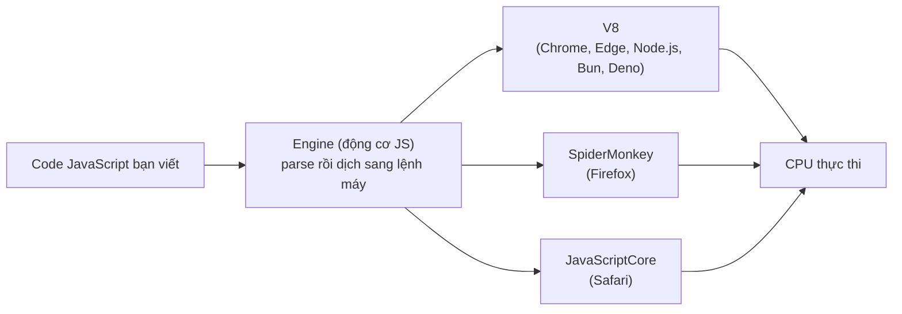
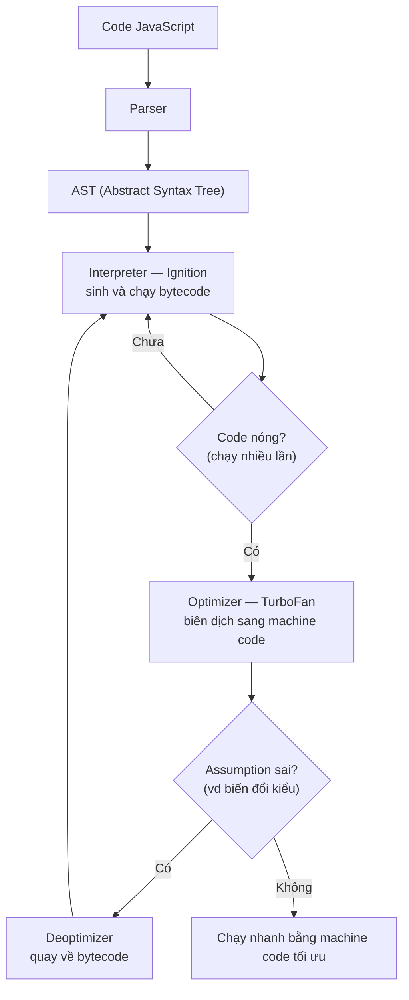

# JavaScript là gì?

JavaScript là ngôn ngữ lập trình phổ biến nhất cho web, giúp trang web trở nên "sống động" và tương tác được với người dùng (như bấm nút, hiện thông báo, kiểm tra biểu mẫu). Bài này giới thiệu khái niệm tổng quan; phần định nghĩa chi tiết nằm ngay bên dưới.

[](pathname:///img/javascript/javascript-la-gi.webp)

---

:::note[Ghi nhớ nhanh]

- ⭐ **JavaScript là ngôn ngữ thông dịch** — máy đọc và chạy từng dòng ngay, chạy được ở trình duyệt, server (`Node.js`), mobile, desktop.
- **Ba trụ cột của web** — `HTML` (cấu trúc), `CSS` (giao diện), `JavaScript` (hành vi, tương tác).
- **JS cần một engine để chạy** — `V8` (Chrome, Node.js), `SpiderMonkey` (Firefox), `JavaScriptCore` (Safari).
- **4 đặc điểm cốt lõi** — dynamic typing, single-threaded (dùng event loop), first-class functions, prototype-based.
- ⭐ **JavaScript ≠ Java** — hai ngôn ngữ không liên quan, chỉ trùng tên do marketing năm 1995.

:::

---

## Mục lục

- [Định nghĩa](#định-nghĩa)
- [Ba trụ cột của web](#ba-trụ-cột-của-web)
- [JavaScript chạy ở đâu?](#javascript-chạy-ở-đâu)
- [Đặc điểm cốt lõi](#đặc-điểm-cốt-lõi)
- [Câu hỏi phỏng vấn](#câu-hỏi-phỏng-vấn)

---

## Định nghĩa

**JavaScript (JS)** là ngôn ngữ lập trình **thông dịch**, ban đầu sinh
ra để tạo tương tác cho trang web. Ngày nay nó chạy được cả ở **trình
duyệt**, **server (Node.js)**, **mobile**, **desktop** và **embedded**.

> **Thông dịch** (interpret) là cách chạy code mà máy **đọc và thực thi từng dòng ngay lập tức**, không cần biên dịch toàn bộ ra file riêng trước. Trái với **biên dịch** (compile) — phải dịch toàn bộ chương trình sang ngôn ngữ máy rồi mới chạy.

```js
console.log("Hello, JavaScript!");
```

---

## Ba trụ cột của web

| Công nghệ | Vai trò |
|-----------|---------|
| **HTML** | Cấu trúc nội dung (text, image, form...) |
| **CSS** | Giao diện, bố cục, animation |
| **JavaScript** | Hành vi, tương tác, logic |

---

## JavaScript chạy ở đâu?

JavaScript cần một **engine** để chạy. Mỗi môi trường có engine riêng:

> **Engine** (động cơ JavaScript) là một **chương trình** có nhiệm vụ **đọc code JavaScript và biến nó thành lệnh mà máy tính thực thi được**. Bạn viết JS, nhưng CPU không hiểu JS — engine đứng giữa làm "phiên dịch": nó phân tích cú pháp (parse) code, chuyển thành dạng máy hiểu, rồi chạy. Engine thường được viết bằng C++ và nhúng sẵn trong trình duyệt hoặc môi trường như Node.js, nên bạn không cần cài riêng. Ví dụ: gõ `console.log("Hi")` trong Chrome, chính engine **V8** sẽ xử lý và in ra kết quả.

| Môi trường | Engine |
|-----------|--------|
| Chrome, Edge, Node.js, Bun | **V8** |
| Firefox | **SpiderMonkey** |
| Safari | **JavaScriptCore** |
| Deno | **V8** |

Code bạn viết luôn đi qua một engine trước khi CPU thực thi:



```js
// Trong browser
document.title = "Mới";

// Trong Node.js
const fs = require("fs");
fs.writeFileSync("file.txt", "Hi");
```

---

## Đặc điểm cốt lõi

- **Dynamic typing**: kiểu được xác định lúc chạy, không cần khai báo.
- **Single-threaded**: chỉ một luồng xử lý chính, dùng **event loop**
  cho bất đồng bộ.
- **First-class functions**: hàm là giá trị — gán biến, truyền tham số,
  trả về từ hàm khác.
- **Prototype-based**: kế thừa qua prototype chain (không phải class
  truyền thống — class chỉ là syntactic sugar).

:::info[Phân tích]

JavaScript là ngôn ngữ **thông dịch** nhưng các engine hiện đại dùng
**JIT (Just-In-Time) compilation**:

1. **Parser** chuyển code thành AST (Abstract Syntax Tree).
2. **Interpreter** (Ignition trong V8) chạy bytecode ngay lập tức.
3. **Optimizer** (TurboFan trong V8) phát hiện code "nóng" (chạy nhiều
   lần) và biên dịch sang **machine code** tối ưu.
4. **Deoptimizer** quay về bytecode khi assumption sai (vd biến đổi kiểu).



Vì vậy nói JS "chậm" là lỗi thời — code JS chạy lâu trong hot path có
thể đạt 80-90% tốc độ C++. Hiểu cơ chế JIT là nền tảng để viết code
performant (tránh thay đổi shape object, tránh polymorphic call site...).

:::

:::tip[Mẹo]

**JavaScript ≠ Java**. Tên "JavaScript" được Netscape đặt năm 1995 để
"ăn theo" độ hot của Java thời đó. Hai ngôn ngữ **không liên quan** —
Java compile sang JVM bytecode, có static typing; JS thì ngược lại.

:::

---

## Câu hỏi phỏng vấn

Những câu thường gặp về chủ đề này. Tự trả lời trước, rồi bấm **Xem đáp án** để đối chiếu.

**1. JavaScript là gì? Nó khác gì so với Java — vì sao hai ngôn ngữ lại trùng tên?**

<details>
<summary>Xem đáp án</summary>

**JavaScript** là ngôn ngữ lập trình thông dịch, kiểu động (dynamic typing), đa mô hình (hỗ trợ lập trình hàm, hướng đối tượng theo prototype, hướng sự kiện), ban đầu được tạo ra để chạy trong trình duyệt nhằm làm trang web có tính tương tác. Ngày nay JS chạy được cả ngoài trình duyệt (Node.js, Deno, Bun) — từ server, CLI tool đến ứng dụng desktop/mobile.

**Khác biệt với Java:**

| Tiêu chí | Java | JavaScript |
|---|---|---|
| Kiểu dữ liệu | Static typing, kiểm tra lúc compile | Dynamic typing, kiểm tra lúc runtime |
| Thực thi | Biên dịch ra bytecode, chạy trên JVM | Thông dịch + JIT compile trong engine |
| OOP | Class-based thuần | Prototype-based (class ES6 chỉ là syntax sugar) |
| Threading | Multi-threaded | Single-threaded (kèm event loop) |
| Môi trường gốc | Ứng dụng doanh nghiệp, Android | Trình duyệt web |

**Vì sao trùng tên?** Thuần túy là **chiêu marketing**. Năm 1995, Brendan Eich tạo ra ngôn ngữ này tại Netscape trong ~10 ngày, ban đầu tên là *Mocha*, rồi *LiveScript*. Thời điểm đó Java của Sun Microsystems đang là hiện tượng, Netscape và Sun có thỏa thuận hợp tác, nên LiveScript được đổi tên thành **JavaScript** để "ăn theo" độ hot của Java. Về kỹ thuật, hai ngôn ngữ gần như không liên quan — câu nói kinh điển: *"Java và JavaScript giống nhau như Car và Carpet"*.

</details>

**2. Ba trụ cột `HTML`, `CSS`, `JavaScript` đảm nhiệm vai trò gì trong một trang web? Nếu tắt JS thì trang còn hoạt động được không?**

<details>
<summary>Xem đáp án</summary>

Ẩn dụ phổ biến — một trang web như một ngôi nhà (hoặc cơ thể người):

- **HTML** — *cấu trúc / bộ xương*: định nghĩa nội dung và ngữ nghĩa (đây là tiêu đề, đây là đoạn văn, đây là nút bấm, form, ảnh...).
- **CSS** — *trình bày / da và quần áo*: quyết định mọi thứ trông như thế nào — màu sắc, font, layout, animation, responsive.
- **JavaScript** — *hành vi / cơ bắp và não*: xử lý tương tác — click, nhập liệu, gọi API lấy dữ liệu, cập nhật nội dung không cần reload trang.

**Tắt JS thì trang còn chạy không?** Tùy trang:

- **Trang tĩnh / server-rendered truyền thống** (blog, báo, trang tài liệu): vẫn hoạt động gần như bình thường — đọc nội dung, click link, submit form HTML thuần đều được. HTML và CSS không phụ thuộc JS.
- **SPA (Single Page Application)** viết bằng React/Vue/Angular render hoàn toàn ở client: tắt JS là **trang trắng tinh**, vì toàn bộ DOM do JS tạo ra. Đây là lý do các framework hiện đại (Next.js, Nuxt, Remix...) quay lại SSR/SSG — vừa tốt cho SEO, vừa có nội dung hiển thị ngay cả khi JS chưa load xong hoặc bị lỗi.
- Nguyên tắc thiết kế liên quan: **progressive enhancement** — trang phải dùng được ở mức cơ bản với HTML/CSS, JS chỉ *nâng cấp* trải nghiệm chứ không phải điều kiện sống còn.

</details>

**3. Phân biệt ngôn ngữ **thông dịch** (interpret) và **biên dịch** (compile). JavaScript thuộc loại nào?**

<details>
<summary>Xem đáp án</summary>

**Biên dịch (compiled):** toàn bộ source code được dịch **một lần, trước khi chạy** thành mã máy (hoặc bytecode) bởi compiler. Lỗi cú pháp/kiểu được bắt ngay lúc compile. Chạy nhanh vì CPU thực thi trực tiếp mã đã dịch. Ví dụ: C, C++, Rust, Go.

**Thông dịch (interpreted):** code được đọc và thực thi **từng dòng lúc runtime** bởi interpreter, không có bước dịch trước. Linh hoạt, chạy ngay không cần build, nhưng chậm hơn vì phải "vừa đọc vừa chạy". Ví dụ: Python (cổ điển), Ruby, PHP (đời đầu), Bash.

**JavaScript thuộc loại nào?** Câu trả lời hiện đại: **cả hai — JIT (Just-In-Time) compiled**.

- Về *phân loại lịch sử*, JS là ngôn ngữ thông dịch: không có bước compile riêng, đưa file .js cho trình duyệt là chạy.
- Nhưng engine hiện đại (V8, SpiderMonkey, JavaScriptCore) **không thông dịch thuần túy**: chúng parse code, chạy qua interpreter để khởi động nhanh, đồng thời theo dõi đoạn code nào chạy nhiều ("hot code") rồi **biên dịch đoạn đó thành mã máy tối ưu ngay trong lúc chương trình đang chạy**.

Nói ngắn gọn: JS là ngôn ngữ thông dịch về mặt trải nghiệm lập trình, nhưng được JIT-compile về mặt thực thi.

</details>

**4. `Engine` JavaScript là gì? Kể tên engine của Chrome, Firefox, Safari và Node.js.**

<details>
<summary>Xem đáp án</summary>

**JavaScript engine** là chương trình nhận vào source code JS và thực thi nó — đảm nhiệm parse, biên dịch, tối ưu, quản lý bộ nhớ (heap, garbage collection) và call stack. Engine chỉ hiểu JS thuần theo chuẩn ECMAScript, không biết gì về DOM hay HTTP.

| Môi trường | Engine | Ghi chú |
|---|---|---|
| Chrome (và Edge, Opera, Brave) | **V8** | Viết bằng C++, do Google phát triển |
| Firefox | **SpiderMonkey** | Engine JS đầu tiên trong lịch sử, do chính Brendan Eich viết |
| Safari | **JavaScriptCore** (còn gọi Nitro) | Do Apple phát triển, thuộc WebKit |
| Node.js | **V8** | Node = V8 + libuv + các API hệ thống; Deno cũng dùng V8, còn Bun dùng JavaScriptCore |

</details>

**5. Mô tả đường đi của một đoạn code JS từ lúc bạn viết cho tới khi CPU thực thi.**

<details>
<summary>Xem đáp án</summary>

Lấy V8 làm ví dụ, pipeline như sau:

```
Source code (.js)
   │
   ▼
1. Parser ──► tách token (lexical analysis), phân tích cú pháp
   │
   ▼
2. AST (Abstract Syntax Tree) — cây cú pháp trừu tượng
   │
   ▼
3. Interpreter (Ignition) ──► sinh bytecode và thực thi ngay
   │            │
   │            └── vừa chạy vừa thu thập profiling data
   │                (hàm nào gọi nhiều? tham số kiểu gì?)
   ▼
4. Hot code ──► Optimizing compiler (TurboFan)
   │            biên dịch bytecode → mã máy tối ưu
   ▼
5. Machine code ──► CPU thực thi trực tiếp
   
   (nếu giả định tối ưu sai ──► Deoptimization: quay về bytecode)
```

Diễn giải từng bước:

1. **Parsing**: engine đọc chuỗi ký tự, tách thành token (`const`, `x`, `=`, `5`...), rồi dựng **AST** — cấu trúc cây biểu diễn ngữ pháp của chương trình. Sai cú pháp thì dừng tại đây (SyntaxError).
2. **Sinh bytecode**: interpreter (Ignition trong V8) duyệt AST và sinh **bytecode** — dạng mã trung gian gọn nhẹ, rồi thực thi ngay. Nhờ vậy code khởi chạy nhanh, không phải chờ biên dịch toàn bộ.
3. **Profiling**: trong lúc chạy, engine ghi nhận thống kê — hàm nào được gọi lặp lại nhiều lần, biến nào luôn mang kiểu gì.
4. **Tối ưu hóa (JIT)**: đoạn code "nóng" được TurboFan biên dịch thành **mã máy** tối ưu dựa trên các giả định từ profiling (ví dụ: "tham số `x` luôn là số nguyên").
5. **CPU thực thi** mã máy đó. Nếu giả định bị phá vỡ, engine **deoptimize** — vứt mã máy, quay về chạy bytecode.

</details>

**6. `JIT compilation` là gì? Mô tả vai trò của `Parser`, `AST`, `Interpreter` (Ignition) và `Optimizer` (TurboFan) trong V8.**

<details>
<summary>Xem đáp án</summary>

**JIT (Just-In-Time) compilation** là kỹ thuật biên dịch code thành mã máy **ngay trong lúc chương trình đang chạy**, thay vì biên dịch trước (AOT — Ahead-Of-Time) hoặc thông dịch thuần. Nó kết hợp ưu điểm của cả hai: khởi động nhanh như interpreter, tốc độ thực thi tiệm cận compiled code cho những đoạn chạy nhiều.

Vai trò từng thành phần trong V8:

- **Parser**: đọc source code, kiểm tra cú pháp, sinh ra AST. V8 còn dùng *lazy parsing* — chỉ parse đầy đủ hàm khi hàm đó thực sự được gọi, để tăng tốc khởi động.
- **AST (Abstract Syntax Tree)**: cấu trúc dữ liệu dạng cây biểu diễn chương trình. Ví dụ `const x = 1 + 2` thành cây có node `VariableDeclaration` chứa node `BinaryExpression(+)` với hai node con `1` và `2`. AST là đầu vào cho bước sinh bytecode.
- **Ignition (Interpreter)**: chuyển AST thành **bytecode** và thực thi. Bytecode chiếm ít bộ nhớ hơn mã máy rất nhiều — quan trọng với thiết bị di động. Ignition đồng thời thu thập **type feedback** (thông tin kiểu thực tế lúc runtime) làm nguyên liệu cho bước tối ưu.
- **TurboFan (Optimizing compiler)**: nhận bytecode + type feedback của các hàm "nóng", áp dụng các kỹ thuật tối ưu (inlining, loại bỏ dead code, speculative optimization — tối ưu dựa trên giả định về kiểu) để sinh **mã máy** hiệu năng cao.

Hai thành phần này tạo thành vòng lặp: Ignition chạy mọi thứ trước, TurboFan tối ưu phần nóng, và nếu giả định sai thì code rơi ngược về Ignition (deopt). *(Các bản V8 gần đây còn chèn thêm tầng trung gian như Sparkplug, Maglev giữa Ignition và TurboFan để cân bằng tốc độ biên dịch và chất lượng mã, nhưng mô hình Ignition–TurboFan vẫn là khung chính để hiểu.)*

</details>

**7. `Deoptimization` xảy ra khi nào? Cho ví dụ code khiến engine phải deopt.**

<details>
<summary>Xem đáp án</summary>

**Deoptimization (deopt)** xảy ra khi mã máy đã tối ưu được TurboFan sinh ra dựa trên một **giả định**, và giả định đó **bị phá vỡ** lúc runtime. Engine buộc phải vứt bỏ mã tối ưu và quay về thực thi bytecode qua interpreter — gây tụt hiệu năng đột ngột.

**Ví dụ 1 — thay đổi kiểu tham số:**

```js
function add(a, b) {
  return a + b;
}

// Gọi hàng nghìn lần với số → engine tối ưu add()
// với giả định "a và b luôn là small integer"
for (let i = 0; i < 100000; i++) {
  add(i, i + 1);
}

add("hello", "world"); // 💥 giả định vỡ → DEOPT
// phép + giữa string khác hoàn toàn phép + giữa số
```

**Ví dụ 2 — thay đổi "hình dạng" object (hidden class):**

```js
function getX(point) {
  return point.x;
}

const p1 = { x: 1, y: 2 };
for (let i = 0; i < 100000; i++) getX(p1); // tối ưu theo shape {x, y}

const p2 = { y: 2, x: 1 };      // thứ tự property khác → shape khác
const p3 = { x: 1, y: 2, z: 3 }; // thêm property → shape khác
getX(p2); // inline cache miss
getX(p3); // nhiều shape quá → hàm thành "megamorphic", có thể deopt
```

**Ví dụ 3 — mảng "có lỗ" hoặc trộn kiểu phần tử:**

```js
const arr = [1, 2, 3, 4];   // engine lưu dạng packed small integers — rất nhanh
arr[10] = 5;                 // tạo "lỗ" (holes) → chuyển sang dạng chậm hơn
arr.push(3.14);              // trộn int với double → đổi kiểu lưu trữ
arr.push("x");               // trộn thêm string → rơi về dạng generic chậm nhất
```

</details>

**8. Vì sao nói "JavaScript chậm" là quan điểm lỗi thời? Những yếu tố nào trong cách viết code ảnh hưởng tới việc engine tối ưu được hay không?**

<details>
<summary>Xem đáp án</summary>

**Vì sao lỗi thời:** định kiến "JS chậm" hình thành từ thời 2000s, khi JS chạy bằng interpreter thuần túy. Bước ngoặt là năm 2008 khi Google ra mắt **V8** cùng Chrome, mở màn "cuộc chạy đua vũ trang" giữa các engine. Với JIT compilation, hidden classes, inline caching..., JS ngày nay ở các benchmark tính toán thuần có thể đạt hiệu năng trong tầm vài lần so với C — đủ nhanh để chạy server quy mô lớn (Node.js tại Netflix, PayPal), game engine, thậm chí là compiler (TypeScript compiler viết bằng chính TS/JS suốt nhiều năm). Điều làm web app "cảm giác chậm" ngày nay thường là DOM, network, bundle size — chứ hiếm khi là tốc độ thực thi JS thuần.

**Nhưng** hiệu năng đó có điều kiện: engine chỉ tối ưu tốt khi code **dễ đoán**. Những yếu tố ảnh hưởng:

1. **Tính ổn định của kiểu (monomorphism)**: hàm luôn nhận cùng kiểu tham số thì được tối ưu sâu; hàm nhận lung tung kiểu (polymorphic/megamorphic) thì không.
2. **Hình dạng object nhất quán**: khởi tạo object với đầy đủ property, cùng thứ tự (tốt nhất là qua constructor/class). Tránh thêm/xóa property động (`delete obj.x`) sau khi tạo.
3. **Mảng đồng nhất, không lỗ**: giữ mảng chứa một kiểu phần tử, index liên tục, dùng `push` thay vì gán vượt độ dài.
4. **Tránh các "optimization killer" cổ điển**: `eval`, `with`, `arguments` dùng sai cách, `try/catch` bọc hot loop (với engine đời cũ), thay đổi prototype của object đang sống.
5. **Hàm nhỏ, làm một việc**: dễ được inline hơn hàm dài trăm dòng.

Tóm lại: JS không chậm — **JS viết kiểu "khó đoán" mới chậm**, vì nó tước đi khả năng speculative optimization của engine.

</details>

**9. `Dynamic typing` nghĩa là gì? Ưu và nhược điểm so với `static typing`? Điều này liên quan gì đến việc TypeScript ra đời?**

<details>
<summary>Xem đáp án</summary>

**Dynamic typing**: kiểu dữ liệu gắn với **giá trị lúc runtime**, không gắn với biến lúc khai báo. Một biến có thể lần lượt chứa số, chuỗi, object mà không báo lỗi:

```js
let x = 42;       // number
x = "hello";      // string — hoàn toàn hợp lệ
x = { a: 1 };     // object — vẫn ok
```

**Static typing** (Java, C#, Rust...): kiểu được khai báo (hoặc suy luận) và **kiểm tra lúc compile** — gán sai kiểu là không build được.

| | Dynamic typing | Static typing |
|---|---|---|
| **Ưu** | Viết nhanh, ít boilerplate, prototype linh hoạt, dễ học ban đầu | Bắt lỗi sớm (trước khi chạy), IDE autocomplete/refactor chính xác, code tự tài liệu hóa, an toàn khi codebase lớn |
| **Nhược** | Lỗi kiểu chỉ lộ lúc runtime (`undefined is not a function` trên production), refactor rủi ro, khó nắm hợp đồng dữ liệu giữa các module, engine khó tối ưu | Viết dài hơn, cứng nhắc hơn, cần bước compile |

**Liên hệ với TypeScript:** khi JS vượt khỏi vai trò "script vài chục dòng" để thành ngôn ngữ xây ứng dụng hàng trăm nghìn dòng với hàng chục dev, nhược điểm của dynamic typing trở nên đắt đỏ — lỗi kiểu lọt ra production, refactor như đi trên băng mỏng. **TypeScript (Microsoft, 2012)** ra đời để giải đúng bài toán này: thêm **lớp static typing tùy chọn** lên trên JS. TS kiểm tra kiểu lúc compile rồi biên dịch (đúng hơn là *transpile*, gần đây chủ yếu là *strip types*) về JS thuần — runtime vẫn là JS dynamic typing, nhưng developer được hưởng an toàn kiểu và tooling của static typing trong lúc viết code. Đó là lý do TS thống trị các codebase lớn hiện nay.

</details>

**10. JavaScript là `single-threaded` — vậy làm sao nó xử lý được nhiều tác vụ bất đồng bộ cùng lúc (gọi API, `setTimeout`...)?**

<details>
<summary>Xem đáp án</summary>

JS chỉ có **một call stack** — tại một thời điểm chỉ thực thi một đoạn code. Bí quyết nằm ở chỗ: **những việc chờ đợi (I/O) không do thread JS làm**, mà được giao cho **runtime** (trình duyệt hoặc Node.js), phối hợp qua **event loop**.

Các thành phần:

- **Call stack**: nơi code JS thực thi tuần tự.
- **Web APIs / libuv**: trình duyệt (hoặc Node) nhận các tác vụ như `setTimeout`, `fetch`, đọc file... và xử lý **ở bên ngoài thread JS** (bằng cơ chế riêng của hệ điều hành, thread pool...).
- **Callback queue (macrotask)** và **microtask queue** (Promise callbacks): khi tác vụ bên ngoài xong, callback được xếp vào hàng đợi.
- **Event loop**: vòng lặp liên tục kiểm tra — *"call stack rỗng chưa? rỗng rồi thì lấy task tiếp theo trong queue đẩy vào stack"*. Microtask queue luôn được xử lý cạn trước khi lấy macrotask tiếp theo.

```js
console.log("1");

setTimeout(() => console.log("2"), 0);   // giao cho Web API, callback vào macrotask queue

Promise.resolve().then(() => console.log("3")); // vào microtask queue

console.log("4");

// Output: 1 → 4 → 3 → 2
// Code đồng bộ chạy hết trước, rồi microtask (3), rồi macrotask (2)
```

Vậy nên chính xác hơn là: JS **thực thi** single-threaded, nhưng **mô hình xử lý là non-blocking, event-driven** — thread duy nhất không bao giờ đứng chờ I/O, nó chỉ đăng ký "khi nào xong thì gọi tôi" rồi làm việc khác. Đó là lý do một server Node.js đơn luồng vẫn phục vụ được hàng nghìn kết nối đồng thời. (Khi thực sự cần tính toán nặng song song, đã có `Web Workers` / `worker_threads` — mỗi worker là một thread với event loop riêng.)

</details>

**11. `First-class functions` nghĩa là gì? Cho ví dụ hàm được gán vào biến, truyền làm tham số và trả về từ hàm khác.**

<details>
<summary>Xem đáp án</summary>

**First-class functions** (hàm là "công dân hạng nhất") nghĩa là trong JS, **hàm được đối xử như mọi giá trị khác** — number, string, object. Cụ thể, hàm có thể:

**1. Gán vào biến:**

```js
const greet = function (name) {
  return `Xin chào, ${name}!`;
};
const sayHi = greet;      // gán hàm sang biến khác như gán một giá trị
console.log(sayHi("Thuan")); // "Xin chào, Thuan!"
```

**2. Truyền làm tham số (callback):**

```js
function processUser(name, callback) {
  const formatted = name.trim().toLowerCase();
  return callback(formatted);
}

processUser("  THUAN  ", (n) => `user_${n}`); // "user_thuan"

// Đây chính là nền tảng của array methods:
[1, 2, 3].map((x) => x * 2); // [2, 4, 6] — map nhận một hàm làm tham số
```

**3. Trả về từ hàm khác (higher-order function, closure):**

```js
function multiplyBy(factor) {
  return function (x) {
    return x * factor;   // closure: hàm con "nhớ" factor
  };
}

const double = multiplyBy(2);
const triple = multiplyBy(3);
console.log(double(5)); // 10
console.log(triple(5)); // 15
```

Đặc tính này là nền móng cho gần như mọi pattern quan trọng của JS: callback, Promise (`.then(fn)`), event handler (`addEventListener("click", fn)`), middleware trong Express, hooks trong React, currying, function composition...

</details>

**12. JavaScript kế thừa theo `prototype` chứ không phải class truyền thống. `class` trong ES6 thực chất là gì?**

<details>
<summary>Xem đáp án</summary>

**Prototype-based inheritance:** trong JS, mỗi object có một liên kết ẩn (`[[Prototype]]`, truy cập qua `Object.getPrototypeOf` hoặc `__proto__`) trỏ tới một object khác. Khi truy cập property không có trên object, engine lần theo **prototype chain** để tìm:

```js
const animal = {
  eat() { console.log("ăn..."); }
};

const dog = Object.create(animal); // dog có prototype là animal
dog.bark = function () { console.log("gâu!"); };

dog.bark(); // "gâu!"  — có sẵn trên dog
dog.eat();  // "ăn..." — không có trên dog → tìm lên prototype chain → thấy ở animal
```

Không có "bản thiết kế" (class) tách rời "thực thể" (instance) như Java — chỉ có **object liên kết với object**.

**`class` trong ES6 thực chất là syntax sugar** — cú pháp đẹp hơn phủ lên đúng cơ chế constructor function + prototype đã tồn tại từ trước:

```js
// Viết bằng class (ES6)
class Dog {
  constructor(name) { this.name = name; }
  bark() { console.log(`${this.name}: gâu!`); }
}

// Gần tương đương với cách viết cũ:
function DogOld(name) { this.name = name; }
DogOld.prototype.bark = function () { console.log(`${this.name}: gâu!`); };

// Bằng chứng:
typeof Dog;                                    // "function" — class vẫn là function!
Dog.prototype.bark;                            // method nằm trên prototype
const d = new Dog("Milu");
Object.getPrototypeOf(d) === Dog.prototype;    // true
```

Nói "chỉ là" sugar cũng không hoàn toàn công bằng — `class` có thêm vài khác biệt thật: bắt buộc gọi bằng `new`, thân class luôn ở strict mode, method không enumerable, hỗ trợ `super`, private fields (`#field`)... Nhưng **mô hình kế thừa bên dưới vẫn 100% là prototype chain**. Hiểu prototype là hiểu được `class` thực sự làm gì — và giải thích được những hành vi "kỳ lạ" như method có thể bị patch lúc runtime (`Dog.prototype.bark = ...` ảnh hưởng mọi instance đang sống).

</details>

**13. Phân biệt `JavaScript engine` và `JavaScript runtime`. Những thứ như `setTimeout`, `document`, `fetch` do engine hay do runtime cung cấp?**

<details>
<summary>Xem đáp án</summary>

**Engine** = trình thực thi ngôn ngữ JS thuần theo chuẩn **ECMAScript**: parser, JIT compiler, call stack, heap, garbage collector. Engine biết `Object`, `Array`, `Promise`, `Math`, closure, prototype... nhưng **không biết gì** về trang web hay hệ thống file.

**Runtime** = engine **+ môi trường bao quanh nó**: các API bổ sung, event loop, task queues — tức toàn bộ "hệ sinh thái" để JS làm được việc hữu ích trong một ngữ cảnh cụ thể.

```
┌─────────────── Runtime (trình duyệt) ───────────────┐
│  ┌───── Engine (V8) ─────┐   Web APIs:              │
│  │  Call stack           │   - DOM (document)       │
│  │  Heap + GC            │   - setTimeout/Interval  │
│  │  Parser + JIT         │   - fetch / XHR          │
│  │  (ECMAScript thuần)   │   - localStorage, ...    │
│  └───────────────────────┘                          │
│  Event loop + Callback/Microtask queues             │
└─────────────────────────────────────────────────────┘
```

Cùng một engine, khác runtime → khả năng khác nhau: **V8 trong Chrome** có `document`, `window`, `localStorage`; **V8 trong Node.js** không có DOM nhưng có `fs`, `http`, `process`, `require`.

**Trả lời câu hỏi cụ thể:** cả ba đều do **runtime** cung cấp, không phải engine:

| API | Nguồn gốc |
|---|---|
| `setTimeout` | Runtime — Web API của trình duyệt / timer của Node (libuv). Không hề có trong chuẩn ECMAScript |
| `document` | Runtime — DOM API, chỉ trình duyệt có. Node.js không có `document` |
| `fetch` | Runtime — Web API (chuẩn WHATWG, không phải ECMAScript). Node chỉ tích hợp sẵn từ v18 |

Mẹo phân biệt nhanh: mở spec ECMAScript ra — thứ gì có trong đó (`Promise`, `JSON`, `Math`...) là của engine; thứ gì không có (`setTimeout`, `console`*, `document`, `fetch`, `fs`...) là runtime cung cấp. (*`console` phổ biến tới mức tưởng là của JS, nhưng cũng là API của runtime.)

</details>
