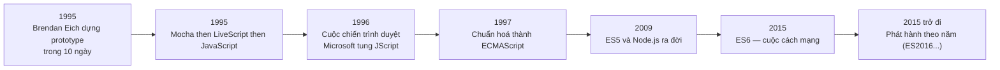
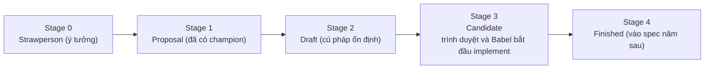

# Lịch sử & các phiên bản JavaScript

Bài này kể lại hành trình của JavaScript: từ lúc ra đời chỉ trong 10 ngày năm 1995, qua "cuộc chiến trình duyệt" (browser war), đến khi được chuẩn hoá thành **ECMAScript** (bản tiêu chuẩn chính thức của ngôn ngữ), bùng nổ nhờ **Node.js** và liên tục thêm phiên bản mới qua từng năm. Hiểu lịch sử và cách đánh số phiên bản giúp người mới biết vì sao JavaScript có nhiều cách viết khác nhau, vì sao một số cú pháp chỉ chạy được trên bản mới, và tại sao nó lại quan trọng đến vậy ngày nay.

[](pathname:///img/javascript/lich-su.webp)

---

:::note[Ghi nhớ nhanh]

- ⭐ **Brendan Eich tạo JavaScript năm 1995 trong 10 ngày** tại Netscape, tên đổi qua Mocha → LiveScript → JavaScript.
- **ECMAScript là chuẩn, JavaScript là bản triển khai** — "ES6" và "ES2015" chỉ cùng một phiên bản.
- ⭐ **ES6 (2015) là bước ngoặt lớn nhất** — thêm `let`/`const`, arrow function, `class`, `Promise`, module.
- **Từ ES2015, phiên bản phát hành theo năm** (ES2016, ES2017...) thay vì đánh số lớn.
- **Node.js (2009, Ryan Dahl)** đưa JS chạy ngoài trình duyệt, biến JS thành ngôn ngữ fullstack.

:::

---

## Mục lục

- [Khởi nguồn](#khởi-nguồn)
- [Cuộc chiến trình duyệt](#cuộc-chiến-trình-duyệt)
- [ECMAScript ra đời](#ecmascript-ra-đời)
- [ECMAScript vs JavaScript](#ecmascript-vs-javascript)
- [Các phiên bản đáng nhớ](#các-phiên-bản-đáng-nhớ)
- [ES6 — bước ngoặt](#es6--bước-ngoặt)
- [Tính năng phổ biến từ ES2017+](#tính-năng-phổ-biến-từ-es2017)
- [Bước ngoặt Node.js](#bước-ngoặt-nodejs)
- [JavaScript ngày nay](#javascript-ngày-nay)
- [Câu hỏi phỏng vấn](#câu-hỏi-phỏng-vấn)

---

## Khởi nguồn

Năm **1995**, **Brendan Eich** tại Netscape được giao nhiệm vụ tạo
ngôn ngữ kịch bản cho trình duyệt **Netscape Navigator**. Ông hoàn thành
prototype đầu tiên trong **10 ngày**.

> **Prototype** (bản mẫu) là một **phiên bản thử nghiệm sơ khai** của sản phẩm, làm nhanh để chạy thử và chứng minh ý tưởng khả thi — chưa hoàn chỉnh, còn thiếu tính năng. Ở đây nghĩa là Brendan Eich dựng được bản JavaScript chạy được đầu tiên chỉ trong 10 ngày, rồi mới hoàn thiện dần sau đó. (Lưu ý: từ này khác với khái niệm *prototype* trong cơ chế kế thừa của JavaScript.)

Tên ngôn ngữ qua các giai đoạn:

- **Mocha** (tên nội bộ ban đầu).
- **LiveScript** (tháng 5/1995).
- **JavaScript** (tháng 12/1995, marketing ăn theo Java).

Toàn bộ hành trình của JavaScript có thể tóm tắt theo dòng thời gian:



---

## Cuộc chiến trình duyệt

"Cuộc chiến trình duyệt" (browser war) là giai đoạn cuối thập niên 1990,
khi **Netscape** và **Microsoft** đua nhau giành thị phần trình duyệt
bằng cách tự thêm tính năng riêng — thay vì cùng theo một chuẩn.

Diễn biến chính:

- **1995**: Netscape Navigator thống trị, đi kèm **JavaScript**.
- **1996**: Microsoft tung **Internet Explorer (IE)** kèm **JScript** — một
  bản "clone" JavaScript (vì JS là của Netscape, Microsoft không được
  dùng đúng tên).
- Hai hãng liên tục thêm tính năng độc quyền chỉ chạy trên trình duyệt
  của mình, không thèm tương thích với nhau.

Hệ quả với dev web:

- Cùng một đoạn code chạy **khác nhau** (hoặc lỗi) trên IE và Netscape.
- Phải viết code **rẽ nhánh** kiểu "nếu là IE thì làm thế này, nếu là
  Netscape thì làm thế kia" → tốn công, dễ lỗi.
- Xuất hiện huy hiệu **"Best viewed in Internet Explorer"** trên nhiều
  website — dấu hiệu của sự phân mảnh.

→ Cần một **chuẩn chung** để các trình duyệt cùng tuân thủ, dẫn tới sự
ra đời của **ECMAScript** (mục bên dưới).

:::info[Phân tích]

Microsoft cuối cùng **thắng cuộc chiến thứ nhất**: IE đạt ~95% thị phần
đầu những năm 2000 sau khi được nhúng sẵn vào Windows. Nhưng việc IE
"đứng yên không cải tiến" suốt nhiều năm sau đó lại mở đường cho
**Firefox** (2004) và **Chrome** (2008) — châm ngòi cho **cuộc chiến
trình duyệt lần hai**. Bài học còn nguyên giá trị: **đứng ngoài chuẩn
chung** giúp thắng ngắn hạn nhưng gây hại lâu dài cho cả hệ sinh thái.

:::

---

## ECMAScript ra đời

Năm **1997**, Netscape gửi JS lên **ECMA International** để chuẩn hoá.
Chuẩn được đặt tên là **ECMAScript (ES)** — vì "JavaScript" là trademark
của Sun/Oracle.

> **ECMA International** là một **tổ chức tiêu chuẩn quốc tế** (lập năm 1961, trụ sở tại Geneva, Thụy Sĩ), chuyên xây dựng các chuẩn cho công nghệ thông tin và truyền thông. "Chuẩn hoá" nghĩa là tổ chức này đặt ra **bộ quy tắc chung** để mọi trình duyệt cùng tuân theo, nhờ vậy cùng một đoạn code JavaScript chạy giống nhau ở Chrome, Firefox, Safari... Ngoài JavaScript (ECMAScript), ECMA còn chuẩn hoá nhiều công nghệ khác như JSON, C#, Dart.

:::info[Phân tích]

Từ **ES2015 trở đi**, ECMAScript phát hành **theo năm** thay vì đánh số
phiên bản lớn. Lý do: cộng đồng quá lớn, không thể chờ "big release"
mỗi 6 năm như ES6 — phải có release đều đặn để theo kịp nhu cầu.

Mỗi feature phải qua **5 stage** của TC39 (committee chuẩn):

- **Stage 0**: Strawperson (ý tưởng).
- **Stage 1**: Proposal (đã có champion).
- **Stage 2**: Draft (cú pháp ổn định).
- **Stage 3**: Candidate (chuẩn bị merge).
- **Stage 4**: Finished (vào spec năm sau).



Stage 3 là điểm các trình duyệt và Babel/SWC bắt đầu implement. Khi
đọc proposal trên https://github.com/tc39/proposals biết stage là biết
được khi nào dùng được trong production.

:::

---

## ECMAScript vs JavaScript

Đây là hai khái niệm hay bị nhầm:

- **ECMAScript (ES)** là **chuẩn**, mô tả ngôn ngữ trên giấy.
- **JavaScript** là **implementation** (bản triển khai) chuẩn đó, do
  trình duyệt và Node.js thực hiện.

Nói "ES6" hay "ES2015" đều chỉ cùng một phiên bản tiêu chuẩn.

---

## Các phiên bản đáng nhớ

| Phiên bản | Năm | Tính năng nổi bật |
|-----------|-----|-------------------|
| ES1 | 1997 | Phiên bản đầu tiên |
| ES3 | 1999 | RegExp, try/catch — chuẩn ổn định lâu dài |
| ES5 | 2009 | `strict mode`, `JSON`, array method (map, filter, reduce) |
| **ES6 / ES2015** | 2015 | `let`/`const`, arrow function, class, Promise, module — **cuộc cách mạng** |
| ES2016 | 2016 | `**` toán tử, `Array.prototype.includes` |
| ES2017 | 2017 | `async`/`await`, `Object.entries`, `Object.values` |
| ES2018 | 2018 | Rest/spread cho object, `for await...of` |
| ES2019 | 2019 | `Array.flat`, `Object.fromEntries`, optional catch |
| ES2020 | 2020 | `?.` optional chaining, `??` nullish coalescing, `BigInt`, dynamic `import()` |
| ES2021 | 2021 | `String.replaceAll`, logical assignment `??=` `\|\|=` `&&=` |
| ES2022 | 2022 | Top-level `await`, `#field` private, `at()` |
| ES2023 | 2023 | `Array.findLast`, `toSorted` (immutable methods) |
| ES2024 | 2024 | `Object.groupBy`, `Promise.withResolvers` |

---

## ES6 — bước ngoặt

ES6 (2015) là phiên bản **thay đổi cách viết JS** mạnh nhất. So sánh:

**Trước ES6 (ES5):**

```js
var add = function (a, b) {
  return a + b;
};

var users = [{ name: "An" }, { name: "Bình" }];
var names = users.map(function (u) {
  return u.name;
});

function Person(name) {
  this.name = name;
}
Person.prototype.greet = function () {
  return "Hi " + this.name;
};
```

**Từ ES6:**

```js
const add = (a, b) => a + b;

const users = [{ name: "An" }, { name: "Bình" }];
const names = users.map(u => u.name);

class Person {
  constructor(name) {
    this.name = name;
  }
  greet() {
    return `Hi ${this.name}`;
  }
}
```

Các feature lớn của ES6:

- `let`, `const` — thay thế `var`.
- Arrow function — cú pháp ngắn + `this` lexical.
- Template literals — `` `hello ${name}` ``.
- Destructuring — `const { x, y } = obj`.
- Default + rest + spread parameters.
- Class — sugar cho prototype.
- Promise — thay callback hell.
- ES Modules — `import`/`export`.
- `Map`, `Set`, `Symbol`, `Iterator`.

---

## Tính năng phổ biến từ ES2017+

**Async/await (ES2017)** — biến Promise thành code đồng bộ:

```js
async function loadUser(id) {
  const res = await fetch(`/api/users/${id}`);
  return res.json();
}
```

**Optional chaining `?.` (ES2020)** — truy cập an toàn:

```js
const city = user?.address?.city;
```

**Nullish coalescing `??` (ES2020)** — fallback chỉ khi `null`/`undefined`:

```js
const port = config.port ?? 3000; // không nhầm với 0
```

**Logical assignment (ES2021):**

```js
a ||= b; // a = a || b
a ??= b; // a = a ?? b
a &&= b; // a = a && b
```

**Top-level await (ES2022)** — `await` ngoài hàm async, chỉ trong ES Module:

```js
// module.js
const data = await fetch("/api").then(r => r.json());
export { data };
```

:::info[Phân tích]

**Tương thích trình duyệt** là điều luôn cần kiểm tra trước khi dùng
feature mới. Các công cụ chính:

- **caniuse.com** — tra cứu feature theo trình duyệt.
- **compat-table.github.io** — table chi tiết của TC39.
- **MDN Browser Compatibility** — phần "Browser compatibility" cuối mỗi
  trang.

Trong production, dùng **Babel** hoặc **SWC** để **transpile** code ES
mới về ES5 nếu cần hỗ trợ trình duyệt cũ:

```bash
npm install --save-dev @babel/core @babel/preset-env
```

Hoặc dùng **target option** trong `tsconfig.json` / Vite config để bundler
tự xử lý:

```json
{ "target": "ES2020" }
```

Năm 2026, **ES2020 là baseline an toàn** cho mọi trình duyệt hiện đại
(Chrome, Firefox, Safari, Edge — đã loại IE từ 2022).

:::

---

## Bước ngoặt Node.js

Năm **2009**, **Ryan Dahl** tạo **Node.js** — JS chạy **ngoài trình
duyệt**, dùng engine V8. Đây là bước ngoặt biến JS từ ngôn ngữ "đồ
chơi cho web" thành ngôn ngữ **fullstack**.

```bash
# Chạy JS không cần trình duyệt
node script.js
```

Hệ quả:

- **npm** (2010) trở thành package manager lớn nhất thế giới.
- Developer có thể viết cả frontend + backend bằng cùng một ngôn ngữ.
- Hệ sinh thái build tool (Webpack, Babel, esbuild...) nở rộ.

---

## JavaScript ngày nay

JavaScript là ngôn ngữ **phổ biến nhất** trên StackOverflow Survey hơn
10 năm liền. Phạm vi hiện tại:

- **Web frontend**: React, Vue, Svelte, Solid.
- **Web backend**: Node.js, Bun, Deno, NestJS.
- **Mobile**: React Native, Ionic.
- **Desktop**: Electron (VS Code, Discord, Slack, Figma...).
- **Edge computing**: Cloudflare Workers, Vercel Edge.
- **AI/ML**: TensorFlow.js, transformers.js.

:::tip[Mẹo]

Khi đọc tài liệu cũ, nếu thấy "ES5 code", "Pre-ES6 syntax" — hiểu rằng
đó là code **trước 2015**: dùng `var`, không có arrow function,
template string... Code hiện đại nên ở **ES2020+** trở lên, vì các
trình duyệt phổ biến đều đã hỗ trợ native.

Ngoài ra, đa số "best practice" thời ES5 đã lỗi thời:

- `IIFE` để tạo scope → không cần với `let`/`const` + module.
- `Object.assign` → spread `{ ...obj }` ngắn hơn.
- Callback pattern → Promise + async/await.

Đọc **MDN** và **You Don't Know JS Yet (2nd edition)** thay vì các blog
cũ là cách nhanh nhất để học JS chuẩn.

:::

---

## Câu hỏi phỏng vấn

Những câu thường gặp về chủ đề này. Tự trả lời trước, rồi bấm **Xem đáp án** để đối chiếu.

**1. Ai tạo ra JavaScript, năm nào, và trong bao lâu? Ngôn ngữ này đã đổi tên qua những giai đoạn nào?**

<details className="qa">
<summary>Xem đáp án</summary>

**Brendan Eich** tạo ra JavaScript năm **1995** khi làm việc tại **Netscape**. Ông được giao viết một ngôn ngữ kịch bản cho trình duyệt **Netscape Navigator**, và hoàn thành **prototype đầu tiên chỉ trong 10 ngày**. Lưu ý: 10 ngày là thời gian dựng bản chạy được đầu tiên, ngôn ngữ vẫn được hoàn thiện dần sau đó.

Ngôn ngữ đổi tên qua ba giai đoạn:

- **Mocha** — tên nội bộ ban đầu.
- **LiveScript** — tháng 5/1995.
- **JavaScript** — tháng 12/1995, đổi vì lý do **marketing** để ăn theo độ hot của Java thời điểm đó (Netscape và Sun có thỏa thuận hợp tác).

Chi tiết "10 ngày" thường được hỏi để dẫn sang ý: nhiều điểm kỳ quặc của JS (ép kiểu lỏng lẻo, `typeof null === "object"`...) là di sản của việc thiết kế quá gấp và sau đó không thể sửa vì phải giữ tương thích ngược.

</details>

**2. Phân biệt `ECMAScript` và `JavaScript`. Vì sao chuẩn lại không được đặt tên thẳng là "JavaScript"?**

<details className="qa">
<summary>Xem đáp án</summary>

| | ECMAScript | JavaScript |
|---|---|---|
| Bản chất | **Chuẩn** (specification) — mô tả ngôn ngữ trên giấy | **Implementation** — bản triển khai chuẩn đó |
| Ai làm | ECMA International, ủy ban TC39 | Trình duyệt (V8, SpiderMonkey, JavaScriptCore), Node.js |
| Nội dung | Cú pháp, kiểu dữ liệu, `Object`, `Promise`, `Math`... | ECMAScript + các API của môi trường (`document`, `fetch`, `fs`...) |

Nói ngắn gọn: ECMAScript là *bản thiết kế*, JavaScript là *sản phẩm chạy được* dựng theo bản thiết kế đó.

**Vì sao chuẩn không tên là "JavaScript"?** Vì **"JavaScript" là trademark** thuộc về Sun Microsystems (sau này là Oracle), Netscape chỉ được cấp phép sử dụng. Khi năm 1997 Netscape gửi ngôn ngữ lên **ECMA International** để chuẩn hoá, tổ chức này không thể dùng một cái tên đang bị đăng ký bản quyền cho chuẩn mở, nên đặt tên là **ECMAScript**.

</details>

**3. "ES6" và "ES2015" khác nhau ở điểm nào? Vì sao tồn tại hai cách gọi?**

<details className="qa">
<summary>Xem đáp án</summary>

**Không khác gì cả — đó là cùng một phiên bản tiêu chuẩn.** ES6 = ES2015.

Lý do có hai tên: trước năm 2015, ECMAScript được đánh số phiên bản lớn theo thứ tự — ES1 (1997), ES3 (1999), ES5 (2009). Phiên bản thứ 6 được cộng đồng gọi là **ES6** suốt nhiều năm trong lúc nó còn đang soạn thảo (quá trình kéo dài ~6 năm sau ES5).

Đến khi phát hành, TC39 quyết định chuyển sang **đặt tên theo năm phát hành** để nhấn mạnh nhịp release hằng năm mới, nên bản chính thức mang tên **ECMAScript 2015**. Cái tên "ES6" đã quá phổ biến nên vẫn tồn tại song song đến nay.

Từ đó về sau chỉ còn một cách gọi theo năm: ES2016, ES2017, ES2020... (dù thỉnh thoảng vẫn có người gọi ES2016 là "ES7", cách gọi này không được khuyến khích vì dễ gây nhầm).

</details>

**4. "Cuộc chiến trình duyệt" (browser war) là gì? Nó gây ra vấn đề gì cho developer thời đó và dẫn tới hệ quả nào?**

<details className="qa">
<summary>Xem đáp án</summary>

**Browser war** là giai đoạn cuối thập niên 1990 khi **Netscape** và **Microsoft** đua giành thị phần trình duyệt bằng cách **tự thêm tính năng riêng** thay vì cùng theo một chuẩn.

Diễn biến: 1995 Netscape Navigator thống trị kèm **JavaScript**; 1996 Microsoft tung **Internet Explorer** kèm **JScript**. Hai hãng liên tục thêm API độc quyền, không quan tâm tương thích.

**Vấn đề với developer:**

- Cùng một đoạn code chạy **khác nhau** hoặc lỗi trên IE và Netscape.
- Phải viết code **rẽ nhánh** theo trình duyệt ("nếu là IE thì..., nếu là Netscape thì...") — tốn công, dễ lỗi.
- Xuất hiện huy hiệu **"Best viewed in Internet Explorer"** — dấu hiệu web bị phân mảnh.

**Hệ quả:** nhu cầu có một **chuẩn chung** trở nên cấp thiết → năm 1997 JS được gửi lên ECMA và chuẩn hoá thành **ECMAScript**. Microsoft thắng cuộc chiến thứ nhất (~95% thị phần đầu 2000s) nhưng IE đứng yên không cải tiến, mở đường cho Firefox (2004) và Chrome (2008) — cuộc chiến trình duyệt lần hai.

</details>

**5. `JScript` là gì và vì sao Microsoft phải đặt tên khác cho bản triển khai của mình?**

<details className="qa">
<summary>Xem đáp án</summary>

**JScript** là bản triển khai ngôn ngữ kịch bản của **Microsoft**, ra mắt năm **1996** cùng **Internet Explorer 3**. Về cơ bản nó là một bản "clone" của JavaScript — cú pháp và ngữ nghĩa tương tự, đủ để chạy phần lớn script viết cho Netscape, nhưng kèm theo các tính năng độc quyền của riêng Microsoft (ví dụ hệ ActiveX, conditional compilation).

**Vì sao phải đặt tên khác?** Vì cái tên **"JavaScript" là trademark** do Sun Microsystems nắm giữ và Netscape được cấp phép sử dụng — Microsoft không có quyền dùng đúng tên đó cho sản phẩm của mình. Giải pháp là reverse-engineer ngôn ngữ rồi gọi nó là **JScript**.

Chính sự tồn tại song song của hai bản triển khai không tương thích hoàn toàn (JavaScript và JScript) là nguyên nhân trực tiếp dẫn tới nhu cầu chuẩn hoá — và ra đời **ECMAScript** năm 1997, cái tên trung lập mà cả hai bên đều tuân theo được.

</details>

**6. Vì sao từ ES2015 trở đi ECMAScript chuyển sang phát hành **theo năm** thay vì đánh số phiên bản lớn?**

<details className="qa">
<summary>Xem đáp án</summary>

Vì mô hình "big release" quá chậm so với nhu cầu của cộng đồng. Khoảng cách từ **ES5 (2009)** đến **ES6 (2015)** là **6 năm** — trong suốt thời gian đó, mọi tính năng mới đều phải nằm chờ để gom vào một bản phát hành khổng lồ. Hệ quả:

- Một feature đã hoàn thiện sớm vẫn phải chờ nhiều năm mới vào chuẩn.
- Bản phát hành quá lớn → khó review, khó implement, dễ trì hoãn (ES4 thậm chí bị hủy bỏ hoàn toàn vì tham vọng quá lớn).
- Hệ sinh thái JS bùng nổ sau Node.js, nhu cầu tính năng mới tăng nhanh.

Giải pháp của TC39 là **release theo năm**: mỗi năm chốt một bản, tính năng nào đã đạt **Stage 4** trước thời điểm cut-off thì vào bản năm đó, chưa xong thì sang năm sau. Nhờ vậy mỗi bản nhỏ gọn, ổn định, dễ đoán — ES2016 thậm chí chỉ có 2 tính năng (`**` và `Array.prototype.includes`), và điều đó hoàn toàn bình thường.

</details>

**7. `TC39` là tổ chức nào? Mô tả 5 stage của quy trình đề xuất tính năng. Ở stage nào thì một feature bắt đầu được trình duyệt implement?**

<details className="qa">
<summary>Xem đáp án</summary>

**TC39** (Technical Committee 39) là **ủy ban kỹ thuật thuộc ECMA International** chịu trách nhiệm phát triển chuẩn ECMAScript. Thành viên gồm đại diện các hãng trình duyệt (Google, Mozilla, Apple, Microsoft), các công ty lớn và chuyên gia trong cộng đồng.

Một tính năng mới đi qua **5 stage**:

- **Stage 0 — Strawperson**: mới chỉ là ý tưởng.
- **Stage 1 — Proposal**: đã có champion (người trong TC39 đứng ra bảo trợ), mô tả vấn đề và hướng giải quyết.
- **Stage 2 — Draft**: cú pháp và ngữ nghĩa đã ổn định, viết thành đặc tả chính thức.
- **Stage 3 — Candidate**: đặc tả hoàn chỉnh, chuẩn bị merge, chờ phản hồi từ thực tế triển khai.
- **Stage 4 — Finished**: đã có implementation và test, vào spec của bản năm sau.

**Trình duyệt bắt đầu implement từ Stage 3** — đây cũng là lúc Babel/SWC bổ sung hỗ trợ. Vì vậy khi đọc proposal trên `https://github.com/tc39/proposals`, biết stage là biết được tính năng đó đã dùng được trong production hay chưa.

</details>

**8. Kể ra ít nhất 5 tính năng lớn mà ES6 mang lại. Vì sao ES6 được coi là bước ngoặt lớn nhất của ngôn ngữ?**

<details className="qa">
<summary>Xem đáp án</summary>

Các tính năng lớn của **ES6 (2015)**:

- `let`, `const` — khai báo có block scope, thay thế `var`.
- **Arrow function** — cú pháp ngắn và `this` lexical.
- **Template literals** — `` `hello ${name}` ``.
- **Destructuring** — `const { x, y } = obj`.
- **Default / rest / spread parameters**.
- **`class`** — syntax sugar cho constructor function + prototype.
- **`Promise`** — thay thế callback hell.
- **ES Modules** — `import` / `export`.
- **`Map`, `Set`, `Symbol`, `Iterator`**.

**Vì sao là bước ngoặt?** Vì ES6 không chỉ thêm API mà **thay đổi hẳn cách viết JavaScript**. Trước ES6, JS thiếu những thứ cơ bản mà ngôn ngữ nghiêm túc nào cũng có: hệ thống module chuẩn, cơ chế khai báo biến có scope hợp lý, cú pháp lớp, và cách xử lý bất đồng bộ tử tế. ES6 bổ sung đủ cả bốn cùng lúc, biến JS từ "ngôn ngữ script" thành ngôn ngữ đủ sức xây ứng dụng lớn. Đó là lý do ranh giới "pre-ES6 / ES6+" vẫn được nhắc đến đến tận ngày nay.

</details>

**9. Viết lại đoạn code ES5 dùng `var`, `function` và `prototype` sang phong cách ES6 (`const`, arrow function, `class`, template literal).**

<details className="qa">
<summary>Xem đáp án</summary>

**Bản ES5:**

```js
var add = function (a, b) {
  return a + b;
};

var users = [{ name: "An" }, { name: "Bình" }];
var names = users.map(function (u) {
  return u.name;
});

function Person(name) {
  this.name = name;
}
Person.prototype.greet = function () {
  return "Hi " + this.name;
};
```

**Viết lại theo ES6:**

```js
const add = (a, b) => a + b;

const users = [{ name: "An" }, { name: "Bình" }];
const names = users.map(u => u.name);

class Person {
  constructor(name) {
    this.name = name;
  }
  greet() {
    return `Hi ${this.name}`;
  }
}
```

Bốn thay đổi tương ứng: `var` → `const` (block scope, không bị hoisting kiểu `var`), function expression → **arrow function**, `+` nối chuỗi → **template literal**, và constructor function + `prototype` → **`class`**. Lưu ý `class` chỉ là syntax sugar — cơ chế kế thừa bên dưới vẫn là prototype chain.

</details>

**10. Những tính năng nào xuất hiện ở ES2017, ES2020, ES2021, ES2022? Nêu ít nhất một ví dụ mỗi phiên bản.**

<details className="qa">
<summary>Xem đáp án</summary>

| Phiên bản | Tính năng nổi bật |
|---|---|
| **ES2017** | `async`/`await`, `Object.entries`, `Object.values` |
| **ES2020** | `?.` optional chaining, `??` nullish coalescing, `BigInt`, dynamic `import()` |
| **ES2021** | `String.replaceAll`, logical assignment `??=` `\|\|=` `&&=` |
| **ES2022** | Top-level `await`, private field `#field`, `at()` |

```js
// ES2017 — async/await
async function loadUser(id) {
  const res = await fetch(`/api/users/${id}`);
  return res.json();
}

// ES2020 — optional chaining + nullish coalescing
const city = user?.address?.city;
const port = config.port ?? 3000;

// ES2021 — logical assignment
a ??= b; // a = a ?? b

// ES2022 — top-level await (chỉ trong ES Module)
const data = await fetch("/api").then(r => r.json());
```

Trong đó `async`/`await` (ES2017) và optional chaining (ES2020) là hai tính năng được dùng nhiều nhất trong code hiện đại.

</details>

**11. Phân biệt `??` (nullish coalescing) và `||`. Với `config.port` bằng `0` thì hai toán tử cho kết quả khác nhau ra sao?**

<details className="qa">
<summary>Xem đáp án</summary>

Khác biệt nằm ở **điều kiện kích hoạt giá trị fallback**:

- `||` lấy vế phải khi vế trái là **falsy** — tức `false`, `0`, `""`, `null`, `undefined`, `NaN`.
- `??` chỉ lấy vế phải khi vế trái là **`null` hoặc `undefined`** (gọi chung là *nullish*).

```js
const config = { port: 0, name: "" };

config.port || 3000; // 3000  ← 0 là falsy nên bị thay, SAI Ý ĐỊNH
config.port ?? 3000; // 0     ← 0 không phải nullish nên giữ nguyên

config.name || "default"; // "default"
config.name ?? "default"; // ""
```

Với `config.port === 0`, `||` trả về `3000` — một bug kinh điển khi người dùng cố tình đặt cổng `0`, hoặc khi cấu hình có các giá trị hợp lệ là `0`, `""`, `false`. `??` trả về đúng `0`.

Quy tắc thực dụng: dùng `??` cho **giá trị mặc định của cấu hình/tham số**, chỉ dùng `||` khi bạn thực sự muốn thay cả các giá trị falsy khác. Lưu ý `??` không được trộn trực tiếp với `||`/`&&` mà không có ngoặc — sẽ báo `SyntaxError`.

</details>

**12. `Top-level await` là gì? Nó chỉ dùng được trong môi trường nào và vì sao có giới hạn đó?**

<details className="qa">
<summary>Xem đáp án</summary>

**Top-level await** (ES2022) cho phép dùng `await` **ở cấp cao nhất của file**, không cần bọc trong một hàm `async`:

```js
// module.js
const data = await fetch("/api").then(r => r.json());
export { data };
```

Trước đó phải dùng thủ thuật IIFE async: `(async () => { ... })()`.

**Giới hạn:** chỉ dùng được trong **ES Module** (file `.mjs`, file có `"type": "module"` trong `package.json`, hoặc `<script type="module">`). Trong CommonJS (`require`) và script thường thì không.

**Vì sao?** Vì ES Module có cơ chế nạp **bất đồng bộ và có đồ thị phụ thuộc rõ ràng**: runtime biết module nào phụ thuộc module nào, nên khi một module `await`, nó có thể tạm hoãn việc hoàn tất module đó và các module import nó, rồi tiếp tục khi promise resolve. CommonJS thì `require()` là **đồng bộ** — nó phải trả về `module.exports` ngay lập tức, không có chỗ để chờ. Cho phép top-level await ở đó sẽ phá vỡ ngữ nghĩa của `require`.

</details>

**13. Node.js ra đời năm nào, do ai, dùng engine gì? Vì sao Node.js được coi là bước ngoặt biến JS thành ngôn ngữ fullstack?**

<details className="qa">
<summary>Xem đáp án</summary>

**Node.js** ra đời năm **2009**, do **Ryan Dahl** tạo ra, dùng engine **V8** của Google (chính engine trong Chrome), kết hợp với thư viện **libuv** để xử lý I/O bất đồng bộ và các API hệ thống (`fs`, `http`, `process`).

**Vì sao là bước ngoặt?** Trước Node, JavaScript bị "nhốt" trong trình duyệt — muốn viết backend phải dùng PHP, Java, Ruby, Python. Node đưa JS ra **ngoài trình duyệt**, chạy như một chương trình bình thường:

```bash
node script.js
```

Hệ quả kéo theo:

- **npm** (2010) trở thành package manager lớn nhất thế giới, tạo ra hệ sinh thái thư viện khổng lồ.
- Developer viết được **cả frontend lẫn backend bằng một ngôn ngữ** — chia sẻ code, kiểu dữ liệu, kinh nghiệm; đây chính là nghĩa của "fullstack JavaScript".
- Toàn bộ hệ **build tool** hiện đại (Webpack, Babel, Vite, esbuild...) đều chạy trên Node — nghĩa là cả frontend cũng phụ thuộc vào Node để phát triển.

Ngày nay JS còn vươn sang mobile (React Native), desktop (Electron) và edge computing, nhưng Node là mắt xích đầu tiên mở ra tất cả.

</details>

**14. Trước khi dùng một cú pháp mới trong production, bạn kiểm tra tương thích trình duyệt bằng cách nào? `Babel`/`SWC` giải quyết vấn đề gì?**

<details className="qa">
<summary>Xem đáp án</summary>

**Cách kiểm tra tương thích:**

- **caniuse.com** — tra cứu nhanh một feature được hỗ trợ từ phiên bản nào của từng trình duyệt, kèm số liệu thị phần.
- **compat-table.github.io** — bảng chi tiết theo từng bản ECMAScript.
- **MDN** — mục "Browser compatibility" cuối mỗi trang tài liệu.
- Với tính năng còn là proposal: tra **stage** trên repo `tc39/proposals` (từ Stage 3 mới nên cân nhắc).

**Babel / SWC giải quyết gì?** Chúng **transpile** code viết bằng cú pháp ES mới về cú pháp cũ hơn (thường là ES5) để chạy được trên trình duyệt cũ — nhờ vậy developer viết code hiện đại mà không phải hy sinh người dùng. SWC làm cùng việc đó nhưng viết bằng Rust nên nhanh hơn nhiều.

```bash
npm install --save-dev @babel/core @babel/preset-env
```

Trong thực tế thường không cấu hình tay: chỉ cần đặt `target` trong `tsconfig.json` hoặc config của Vite/bundler, công cụ sẽ tự lo. Năm 2026, **ES2020 là baseline an toàn** cho mọi trình duyệt hiện đại (IE đã bị khai tử từ 2022).

</details>

**15. `Transpile` khác `compile` và `polyfill` ở chỗ nào? Cho ví dụ thứ mà Babel transpile được nhưng cần polyfill riêng.**

<details className="qa">
<summary>Xem đáp án</summary>

| Khái niệm | Bản chất |
|---|---|
| **Compile** | Dịch từ ngôn ngữ **cấp cao xuống cấp thấp hơn** — ví dụ C → mã máy, Java → JVM bytecode |
| **Transpile** | Dịch giữa hai ngôn ngữ/phiên bản **cùng cấp độ trừu tượng** — ES2022 → ES5, TypeScript → JavaScript. Đầu ra vẫn là code người đọc được |
| **Polyfill** | **Đoạn code bổ sung lúc runtime** để cung cấp một API còn thiếu trong môi trường cũ |

Điểm mấu chốt: Babel/SWC chỉ xử lý được **cú pháp**, không tạo ra được **API mới**.

- **Transpile được** (cú pháp): arrow function → `function`, `class` → constructor function + prototype, template literal → nối chuỗi, optional chaining `?.` → chuỗi kiểm tra `&&`, destructuring, `let`/`const` → `var`.
- **Cần polyfill** (API mới): `Promise`, `Array.prototype.includes`, `Object.entries`, `String.replaceAll`, `Array.prototype.flat`, `Map`, `Set`, `fetch`.

```js
// Babel tự lo được — chỉ là cú pháp
const nums = [1, 2, 3].map(n => n * 2);

// Babel KHÔNG tạo ra được — cần polyfill (core-js)
[1, 2, 3].includes(2);
"a-b".replaceAll("-", "+");
```

Trong thực tế, `@babel/preset-env` kết hợp với **core-js** sẽ tự chèn polyfill cần thiết theo danh sách trình duyệt mục tiêu (`useBuiltIns: "usage"`).

</details>
