# Cách chạy JavaScript

Để code JavaScript thực sự hoạt động, nó cần một môi trường để chạy (runtime). Bài này giới thiệu các nơi phổ biến nhất: ngay trong **trình duyệt** (browser) khi làm web, trong **Node.js** để chạy ngoài trình duyệt, và cả công cụ **REPL** (gõ lệnh thử trực tiếp từng dòng). Biết cách chạy là bước đầu tiên giúp bạn thử nghiệm mọi đoạn code mình viết.

[](pathname:///img/javascript/cach-chay.webp)

---

:::note[Ghi nhớ nhanh]

- ⭐ **Chạy JS trong trình duyệt** — 3 cách: Console (F12), inline `<script>`, hoặc file JS riêng (khuyên dùng).
- ⭐ **`defer` vs `async`** — dùng `defer` cho hầu hết trường hợp; `async` cho script độc lập như analytics/ads.
- **Chạy JS ngoài trình duyệt bằng Node.js** — lệnh `node app.js`, có thể thêm `--watch` để tự chạy lại.
- **Các runtime hiện đại** — `Bun` (nhanh), `Deno` (hỗ trợ TS native), Cloudflare Workers / Vercel Edge.
- **Phân biệt Web API và Node API** — `document`, `fetch` chỉ ở trình duyệt; `fs`, `process` chỉ ở Node.js.
- **REPL** (`node`, `bun repl`, console trình duyệt) — gõ lệnh thử nhanh từng dòng, xem kết quả tức thì.

:::

---

## Mục lục

- [Trong trình duyệt](#trong-trình-duyệt)
- [Trong Node.js](#trong-nodejs)
- [Trong các runtime hiện đại](#trong-các-runtime-hiện-đại)
- [REPL](#repl)
- [Câu hỏi phỏng vấn](#câu-hỏi-phỏng-vấn)

---

## Trong trình duyệt

**Cách 1 — Console trình duyệt**: mở DevTools (F12) → tab Console, gõ
trực tiếp:

```js
console.log("Hello");
2 + 3; // 5
```

**Cách 2 — Inline trong HTML**:

```html
<!DOCTYPE html>
<html>
<body>
  <h1>Demo</h1>
  <script>
    document.querySelector("h1").style.color = "red";
  </script>
</body>
</html>
```

**Cách 3 — File JS riêng (khuyên dùng)**:

```html
<script src="app.js"></script>

<!-- ES Module — hỗ trợ import/export -->
<script type="module" src="app.js"></script>

<!-- Defer — chạy sau khi HTML parse xong -->
<script src="app.js" defer></script>
```

:::info[Phân tích]

**Khác biệt `defer` vs `async` vs default**:

| Thuộc tính | Tải | Thực thi | Thứ tự |
|-----------|-----|----------|--------|
| (mặc định) | Chặn HTML parse | Ngay khi tải xong | Theo thứ tự script |
| `async` | Song song | Ngay khi tải xong | **Không** đảm bảo |
| `defer` | Song song | Sau khi HTML parse xong | Theo thứ tự script |
| `type="module"` | Song song | Sau khi HTML parse xong | Theo thứ tự |

→ Quy tắc: dùng **`defer`** cho hầu hết trường hợp; **`async`** cho
analytics/ads độc lập; **`type="module"`** cho code dùng `import`/`export`.

Sơ đồ dưới đây so sánh thời điểm tải và chạy script của ba chế độ:

```mermaid
flowchart TD
    subgraph DEFAULT["Mặc định (không thuộc tính)"]
      D1["Parse HTML"] --> D2["Gặp script thì DỪNG parse"]
      D2 --> D3["Tải script"] --> D4["Chạy script"] --> D5["Parse tiếp HTML"]
    end
    subgraph ASYNC["async"]
      A1["Tải script song song với parse"] --> A2["Tải xong thì DỪNG parse, chạy ngay"]
      A2 --> A3["Parse tiếp<br/>(thứ tự KHÔNG đảm bảo)"]
    end
    subgraph DEFER["defer"]
      F1["Tải script song song với parse"] --> F2["Parse xong toàn bộ HTML"]
      F2 --> F3["Chạy script theo đúng thứ tự"]
    end
```



**Ví dụ trực quan** — giả sử trang có 1 đoạn HTML và 1 script muốn đọc nó:

```html
<!-- ❌ Mặc định: script chạy NGAY tại đây, lúc này <h1> bên dưới
     CHƯA tồn tại → báo lỗi "Cannot read properties of null" -->
<script>
  document.querySelector("h1").textContent = "Đã đổi!"; // LỖI
</script>

<h1>Tiêu đề gốc</h1>
```

```html
<!-- ✅ defer: trình duyệt parse hết HTML trước, rồi mới chạy script
     → lúc chạy thì <h1> đã có sẵn → hoạt động đúng -->
<head>
  <script src="app.js" defer></script>
</head>
<body>
  <h1>Tiêu đề gốc</h1>
</body>
<!-- app.js: document.querySelector("h1").textContent = "Đã đổi!"; OK -->
```

**Ví dụ về thứ tự** — có 3 file phụ thuộc nhau (`jquery` → `plugin` → `app`):

```html
<!-- defer: GIỮ đúng thứ tự khai báo → jquery chạy trước, rồi plugin, rồi app -->
<script src="jquery.js" defer></script>
<script src="plugin.js" defer></script>
<script src="app.js" defer></script>

<!-- async: file nào tải xong TRƯỚC thì chạy TRƯỚC → có thể app.js chạy
     trước jquery.js → vỡ phụ thuộc. KHÔNG dùng async cho code có thứ tự! -->
<script src="jquery.js" async></script>
<script src="plugin.js" async></script>
<script src="app.js" async></script>
```

```html
<!-- async hợp lý: script độc lập, không phụ thuộc ai, chạy lúc nào cũng được -->
<script src="https://analytics.example.com/track.js" async></script>
```

:::

---

## Trong Node.js

Cài Node.js từ https://nodejs.org (LTS version).

Chạy file:

```bash
node app.js
```

Chạy với watch mode (Node 18+):

```bash
node --watch app.js
```

Chạy ESM trực tiếp (cần `"type": "module"` trong `package.json` hoặc
đuôi `.mjs`):

```js
// app.mjs
import fs from "node:fs";
console.log(fs.readdirSync("."));
```

---

## Trong các runtime hiện đại

| Runtime | Đặc điểm |
|---------|----------|
| **Bun** | Built bằng Zig, nhanh hơn Node 3-4x, tích hợp test/bundler/package manager |
| **Deno** | Cùng tác giả Node (Ryan Dahl), bảo mật mặc định, hỗ trợ TS native |
| **Cloudflare Workers** | Chạy trên edge, V8 isolates, không có `fs`/Node API |
| **Vercel Edge** | Tương tự Workers, build cho web app |

Chạy Bun:

```bash
bun app.js
bun app.ts   # hỗ trợ TS native
```

Chạy Deno:

```bash
deno run app.ts
deno run --allow-net server.ts
```

:::warning[Cần lưu ý]

**Web API vs Node.js API** — đừng nhầm:

- `window`, `document`, `localStorage`, `fetch`, `alert` → **chỉ trong
  trình duyệt**.
- `fs`, `path`, `process`, `Buffer`, `require` → **chỉ trong Node.js**.

Bun và Deno hỗ trợ **cả hai** ở một mức độ. Cloudflare Workers chỉ có
**Web API**.

Khi viết thư viện chạy đa môi trường, dùng các API chung của **WinterCG**
(`fetch`, `Request`, `Response`, `URL`, `crypto`...) thay vì API chuyên
biệt của Node.

:::

---

## REPL

REPL = Read-Eval-Print-Loop — môi trường tương tác.

**Node REPL**:

```bash
node
> const x = 10
> x + 5
15
> .exit
```

**Bun REPL**:

```bash
bun repl
```

**Browser console** cũng là REPL — gõ JS, xem kết quả tức thì.

:::tip[Mẹo]

REPL rất tiện để **thử nhanh** một đoạn code, một API mới, hoặc debug
biểu thức phức tạp. Đừng quên các shortcut:

- **Tab** — autocomplete (gợi ý property của object).
- **Mũi tên ↑/↓** — duyệt lịch sử lệnh.
- **`.help`** trong Node REPL — danh sách lệnh.
- **`.editor`** — vào chế độ multi-line.

Trong browser DevTools, REPL còn mạnh hơn — gõ tên biến, hover xem object,
click vào DOM element được trả về để xem trên Inspector.

:::

---

## Câu hỏi phỏng vấn

Những câu thường gặp về chủ đề này. Tự trả lời trước, rồi bấm **Xem đáp án** để đối chiếu.

**1. Có những cách nào để chạy một đoạn JavaScript? Với một dự án thật, bạn chọn cách nào và vì sao?**

<details className="qa">
<summary>Xem đáp án</summary>

Các cách phổ biến:

- **Console trình duyệt** (F12 → tab Console) — gõ trực tiếp, thấy kết quả ngay.
- **Inline `<script>`** trong file HTML.
- **File JS riêng** nhúng qua `<script src="app.js">`.
- **Node.js** — `node app.js`, chạy ngoài trình duyệt.
- **Runtime hiện đại** — `bun app.js`, `deno run app.ts`, hoặc deploy lên edge (Cloudflare Workers, Vercel Edge).
- **REPL** — `node`, `bun repl`, console trình duyệt.

**Với dự án thật: dùng file JS riêng** (thường là `<script src="app.js" defer>` hoặc `type="module"`), vì:

- **Tách biệt** HTML và JS — dễ đọc, dễ bảo trì.
- **Cache được** — trình duyệt tải một lần, dùng lại cho nhiều trang.
- **Tái sử dụng** cùng một file cho nhiều trang.
- Dùng được **module**, bundler, minify, source map, linter.

Console và inline script chỉ hợp cho thử nghiệm nhanh hoặc vài dòng khởi tạo đặc biệt.

</details>

**2. Đặt thẻ `script` không có thuộc tính gì ở giữa `body` thì trình duyệt xử lý ra sao? Vì sao ngày xưa người ta khuyên đặt script ở cuối `body`?**

<details className="qa">
<summary>Xem đáp án</summary>

Script mặc định (không `async`/`defer`) là **blocking**: khi parser gặp thẻ đó, nó **dừng việc parse HTML**, tải script về (nếu là file ngoài), **chạy xong** rồi mới parse tiếp phần HTML còn lại.

Hệ quả:

- Phần HTML **phía dưới** script chưa tồn tại trong DOM tại thời điểm script chạy → truy cập vào nó sẽ nhận `null`.
- Trang bị **trắng / chậm hiển thị** trong lúc chờ tải và chạy script, nhất là với mạng chậm.

**Vì sao khuyên đặt cuối `body`?** Vì hồi đó chưa có `defer` được hỗ trợ rộng rãi. Đặt script ngay trước `</body>` đảm bảo hai điều: toàn bộ HTML đã parse xong nên DOM có sẵn, và nội dung trang hiển thị trước, không bị script chặn.

Ngày nay khuyến nghị hiện đại là đặt script trong `<head>` kèm **`defer`** — vừa được tải song song sớm hơn (nhanh hơn), vừa chỉ chạy sau khi HTML parse xong.

</details>

**3. So sánh `script` mặc định, `async` và `defer` về: thời điểm tải, thời điểm thực thi và thứ tự thực thi.**

<details className="qa">
<summary>Xem đáp án</summary>

| Thuộc tính | Tải | Thực thi | Thứ tự |
|---|---|---|---|
| (mặc định) | Chặn HTML parse | Ngay khi tải xong | Theo thứ tự khai báo |
| `async` | Song song với parse | Ngay khi tải xong (dừng parse để chạy) | **Không** đảm bảo — file nào xong trước chạy trước |
| `defer` | Song song với parse | Sau khi HTML parse xong | Theo thứ tự khai báo |
| `type="module"` | Song song với parse | Sau khi HTML parse xong (defer mặc định) | Theo thứ tự |

Tóm lại: cả `async` và `defer` đều **không chặn việc tải**, khác biệt nằm ở **thời điểm chạy** và **có giữ thứ tự hay không**.

Quy tắc chọn:

- **`defer`** — mặc định cho hầu hết trường hợp, nhất là script thao tác DOM hoặc có phụ thuộc lẫn nhau.
- **`async`** — script hoàn toàn độc lập, không cần DOM, không ai phụ thuộc vào nó (analytics, ads).
- **`type="module"`** — code dùng `import`/`export`; đã tự có hành vi như `defer`.

</details>

**4. Ba file `jquery.js`, `plugin.js`, `app.js` phụ thuộc lẫn nhau theo thứ tự. Dùng `async` cho cả ba thì chuyện gì có thể xảy ra? Nên dùng gì?**

<details className="qa">
<summary>Xem đáp án</summary>

Với `async`, **file nào tải xong trước thì chạy trước** — thứ tự hoàn toàn phụ thuộc vào kích thước file, tốc độ mạng và cache. `app.js` thường nhỏ nhất nên rất dễ tải xong đầu tiên và chạy trước `jquery.js`, dẫn tới lỗi kiểu `$ is not defined` hoặc `jQuery.fn.myPlugin is not a function`.

Tệ hơn: lỗi này **không ổn định** — máy dev có cache nên chạy đúng, còn người dùng thật mạng chậm lại lỗi. Rất khó debug.

```html
<!-- ❌ SAI — vỡ phụ thuộc -->
<script src="jquery.js" async></script>
<script src="plugin.js" async></script>
<script src="app.js" async></script>

<!-- ✅ ĐÚNG — defer giữ đúng thứ tự khai báo -->
<script src="jquery.js" defer></script>
<script src="plugin.js" defer></script>
<script src="app.js" defer></script>
```

**Nên dùng `defer`**: vẫn tải song song (nhanh như `async`) nhưng thực thi **theo đúng thứ tự khai báo** và chỉ sau khi HTML parse xong. Nguyên tắc: có quan hệ phụ thuộc → không bao giờ dùng `async`.

</details>

**5. Trường hợp nào thì `async` là lựa chọn đúng? Cho ví dụ thực tế.**

<details className="qa">
<summary>Xem đáp án</summary>

`async` đúng khi script thỏa **cả ba** điều kiện:

- **Độc lập hoàn toàn** — không cần thư viện nào chạy trước.
- **Không ai phụ thuộc vào nó** — không script nào cần nó chạy xong.
- **Không phụ thuộc trạng thái DOM** — chạy lúc nào cũng được, càng sớm càng tốt.

Ví dụ thực tế:

```html
<!-- Analytics: tự khởi tạo, không ai phụ thuộc -->
<script src="https://analytics.example.com/track.js" async></script>

<!-- Quảng cáo, chat widget, error tracking -->
<script src="https://cdn.example.com/ads.js" async></script>
```

Lý do dùng `async` ở đây thay vì `defer`: các script này nên chạy **càng sớm càng tốt** (analytics muốn ghi nhận lượt xem ngay, error tracker muốn bắt lỗi từ sớm), không cần chờ HTML parse xong. Đổi lại nó có thể chặn parse một nhịp ngắn khi tải xong.

Với mọi script khác — code ứng dụng, thư viện UI, script thao tác DOM — `defer` vẫn là lựa chọn an toàn.

</details>

**6. Đoạn script inline chạy `document.querySelector("h1")` nhưng thẻ `h1` nằm phía dưới nó — kết quả là gì và vì sao? Có mấy cách sửa?**

<details className="qa">
<summary>Xem đáp án</summary>

**Kết quả: lỗi** `TypeError: Cannot read properties of null (reading 'textContent')`.

**Vì sao:** script mặc định chạy **ngay tại vị trí nó xuất hiện**, lúc đó parser chưa đọc tới thẻ `h1` nên phần tử này **chưa có trong DOM**. `querySelector` không tìm thấy → trả về `null`, và truy cập property trên `null` gây lỗi.

```html
<script>
  document.querySelector("h1").textContent = "Đã đổi!"; // ❌ LỖI
</script>
<h1>Tiêu đề gốc</h1>
```

**Các cách sửa:**

- **Dùng `defer`** với file ngoài — script chạy sau khi HTML parse xong (cách khuyến nghị).
- **Dùng `type="module"`** — cũng defer mặc định.
- **Chuyển script xuống cuối `body`**, sau thẻ `h1`.
- **Bọc trong `DOMContentLoaded`**:

```js
document.addEventListener("DOMContentLoaded", () => {
  document.querySelector("h1").textContent = "Đã đổi!"; // ✅
});
```

Lưu ý: `defer` **không áp dụng cho script inline** — chỉ có tác dụng với `<script src="...">`.

</details>

**7. `script type="module"` khác gì so với script thường? Nó có được `defer` mặc định không? Trong module thì `this` ở top-level là gì?**

<details className="qa">
<summary>Xem đáp án</summary>

Khác biệt chính của `type="module"`:

- Hỗ trợ **`import` / `export`** — có hệ thống module thật.
- **Defer mặc định**: có, module luôn tải song song và chạy sau khi HTML parse xong, theo đúng thứ tự (muốn hành vi async thì thêm `async` thủ công).
- **Luôn ở strict mode**, không cần `"use strict"`.
- **Scope riêng**: biến khai báo trong module không rò ra global — khác hẳn script thường (khai báo `var` ở top-level tạo property trên `window`).
- **Chỉ thực thi một lần** dù được import nhiều nơi.
- Tải qua HTTP phải tuân **CORS**, và không chạy được bằng `file://` — cần dev server.
- Hỗ trợ **top-level `await`**.

**`this` ở top-level trong module là `undefined`** (do module luôn strict và có scope riêng). Trong script thường, `this` ở top-level là `window`.

```js
// <script>            → this === window
// <script type=module> → this === undefined
```

</details>

**8. `defer` chạy trước hay sau sự kiện `DOMContentLoaded`? Còn `load` thì khác gì `DOMContentLoaded`?**

<details className="qa">
<summary>Xem đáp án</summary>

**Script `defer` chạy TRƯỚC `DOMContentLoaded`.** Trình tự chuẩn của trình duyệt:

1. Parse xong toàn bộ HTML.
2. Thực thi các script `defer` theo đúng thứ tự khai báo.
3. Bắn sự kiện **`DOMContentLoaded`**.

Nghĩa là trong script `defer`, DOM đã sẵn sàng, và nếu bạn đăng ký listener `DOMContentLoaded` bên trong đó thì listener vẫn chạy được (vì sự kiện chưa bắn).

**`DOMContentLoaded` vs `load`:**

| | `DOMContentLoaded` | `load` |
|---|---|---|
| Bắn khi | HTML đã parse xong, DOM sẵn sàng | Toàn bộ tài nguyên đã tải xong |
| Chờ ảnh, CSS, iframe, font? | Không | Có |
| Thời điểm | Sớm | Muộn hơn, có thể chậm đáng kể |
| Dùng khi | Thao tác DOM, gắn event handler (đa số trường hợp) | Cần kích thước ảnh thật, đo layout cuối cùng |

Thực tế nên dùng `defer` hoặc `DOMContentLoaded`; chỉ dùng `load` khi thật sự cần chờ tài nguyên.

</details>

**9. Chạy một file JS bằng Node.js như thế nào? `node --watch` giúp gì trong quá trình phát triển?**

<details className="qa">
<summary>Xem đáp án</summary>

Cài Node.js (bản **LTS**) từ `https://nodejs.org`, sau đó chạy file bằng lệnh:

```bash
node app.js
```

Node sẽ nạp file, thực thi bằng engine V8 và in kết quả ra terminal. Nếu muốn dùng `import`/`export` thì cần đặt `"type": "module"` trong `package.json` hoặc đổi đuôi file thành `.mjs`.

**`node --watch` (Node 18+):**

```bash
node --watch app.js
```

Nó theo dõi file (và các file được require/import) — mỗi khi bạn lưu thay đổi, Node **tự khởi động lại tiến trình**. Lợi ích: khỏi phải bấm `Ctrl+C` rồi gõ lại `node app.js` sau mỗi lần sửa, vòng lặp sửa–thử nhanh hơn nhiều.

Trước khi có tính năng này, cộng đồng dùng gói ngoài như `nodemon` để đạt cùng mục đích; nay Node đã hỗ trợ sẵn. Có thêm `--watch-path` để chỉ định thư mục cần theo dõi.

</details>

**10. Trong Node.js, phân biệt `CommonJS` và `ES Module`. Cần cấu hình gì để dùng `import`/`export` trong Node?**

<details className="qa">
<summary>Xem đáp án</summary>

| | CommonJS (CJS) | ES Module (ESM) |
|---|---|---|
| Cú pháp | `require()` / `module.exports` | `import` / `export` |
| Nạp module | **Đồng bộ**, lúc runtime | **Bất đồng bộ**, phân tích tĩnh lúc parse |
| Đuôi file mặc định | `.js`, `.cjs` | `.mjs`, hoặc `.js` khi `"type": "module"` |
| Top-level `await` | Không | Có |
| Biến đặc biệt | `__dirname`, `__filename`, `require` | `import.meta.url` (không có `__dirname`) |
| Tree-shaking | Khó | Tốt (nhờ phân tích tĩnh) |
| Nguồn gốc | Chuẩn riêng của Node | Chuẩn ECMAScript, dùng chung với trình duyệt |

**Cách bật ESM trong Node** — chọn một trong hai:

- Thêm `"type": "module"` vào `package.json` (khi đó mọi file `.js` được coi là ESM).
- Đặt tên file đuôi **`.mjs`**.

```js
// app.mjs
import fs from "node:fs";
console.log(fs.readdirSync("."));
```

ESM có thể `import` module CommonJS, nhưng chiều ngược lại thì không dùng `require()` được — phải dùng `await import()`.

</details>

**11. Những API nào chỉ có trong trình duyệt, những API nào chỉ có trong Node.js? Điều gì xảy ra nếu gọi `document` trong Node hoặc `fs` trong browser?**

<details className="qa">
<summary>Xem đáp án</summary>

| Chỉ có ở trình duyệt | Chỉ có ở Node.js |
|---|---|
| `window`, `document`, `localStorage`, `alert`, `navigator`, DOM API | `fs`, `path`, `process`, `Buffer`, `require`, `os`, `child_process` |

(`fetch` xuất phát từ trình duyệt nhưng Node đã tích hợp sẵn từ v18.)

**Gọi `document` trong Node:**

```js
console.log(document.title);
// ReferenceError: document is not defined
```

Vì Node không có DOM — nó không render trang web nào cả. Muốn thao tác DOM trong Node phải dùng thư viện giả lập như `jsdom`.

**Gọi `fs` trong browser:**

```js
const fs = require("fs");
// ReferenceError: require is not defined
```

Trình duyệt không có `require` và **không được phép** truy cập hệ thống file của người dùng — đây là rào chắn bảo mật cố ý (sandbox). Nếu dùng bundler, lỗi sẽ xuất hiện ngay lúc build ("Module not found: fs").

Đây chính là lý do phải phân biệt rõ code chạy ở đâu khi làm fullstack JS.

</details>

**12. So sánh `Node.js`, `Deno` và `Bun`. Deno khác Node ở điểm bảo mật nào?**

<details className="qa">
<summary>Xem đáp án</summary>

| | Node.js | Deno | Bun |
|---|---|---|---|
| Ra đời | 2009, Ryan Dahl | Cùng tác giả Ryan Dahl | Mới hơn, tác giả Jarred Sumner |
| Engine | V8 | V8 | JavaScriptCore |
| Viết bằng | C++ | Rust | Zig |
| TypeScript | Cần transpile | **Native** | **Native** |
| Bảo mật | Toàn quyền mặc định | **Sandbox mặc định** | Toàn quyền mặc định |
| Điểm mạnh | Hệ sinh thái npm khổng lồ, ổn định nhất | An toàn, chuẩn web, tooling tích hợp | Tốc độ (nhanh hơn Node nhiều lần), tích hợp sẵn test/bundler/package manager |

**Điểm bảo mật của Deno:** Node chạy script với **toàn quyền** — một package npm bất kỳ trong `node_modules` có thể đọc file, mở kết nối mạng, đọc biến môi trường mà bạn không hề hay biết (nguy cơ supply-chain attack rất thực).

Deno đảo ngược: script chạy trong **sandbox**, muốn làm gì phải được cấp quyền tường minh qua flag:

```bash
deno run app.ts                 # không có quyền gì
deno run --allow-net server.ts  # chỉ cấp quyền mạng
```

</details>

**13. Cloudflare Workers / Vercel Edge chạy JS trong môi trường nào? Vì sao ở đó không có `fs`?**

<details className="qa">
<summary>Xem đáp án</summary>

Chúng chạy JS trên **edge** — các máy chủ đặt rải rác gần người dùng về mặt địa lý, để giảm độ trễ. Môi trường thực thi là **V8 isolates**: mỗi request chạy trong một "isolate" — một ngữ cảnh V8 nhẹ, khởi động gần như tức thì (mili giây), thay vì khởi tạo cả một tiến trình Node hay container.

**Vì sao không có `fs`?** Nhiều lý do cộng lại:

- **Không có filesystem để mà truy cập**: code chạy trong sandbox dùng chung hạ tầng với hàng nghìn khách hàng khác — mở quyền đọc/ghi đĩa là thảm họa bảo mật.
- **Vô trạng thái (stateless)**: isolate có vòng đời rất ngắn và chạy ở hàng trăm vị trí khác nhau; file ghi ở một node cũng không có ý nghĩa với node khác.
- **Isolate không phải Node**: nó chỉ cung cấp **Web API** (`fetch`, `Request`, `Response`, `URL`, `crypto`), không có Node API.

Muốn lưu trữ dữ liệu ở edge thì dùng các dịch vụ chuyên biệt (KV store, R2, D1, database qua HTTP) chứ không ghi file.

</details>

**14. Bạn viết một thư viện muốn chạy được cả trên trình duyệt lẫn Node lẫn edge runtime — chọn API theo nguyên tắc nào?**

<details className="qa">
<summary>Xem đáp án</summary>

Nguyên tắc: **chỉ dùng phần giao nhau của mọi môi trường** — tức là các **Web API chuẩn theo WinterCG**, tránh API chuyên biệt của Node.

Nhóm API an toàn để dùng chung: `fetch`, `Request`, `Response`, `Headers`, `URL`, `URLSearchParams`, `crypto` (Web Crypto), `TextEncoder`/`TextDecoder`, `ReadableStream`, `AbortController`, `structuredClone`.

Nên tránh trong code lõi: `fs`, `path`, `process`, `Buffer`, `require`, `child_process` — cũng như `document`, `window`, `localStorage` (chỉ có ở trình duyệt).

Các nguyên tắc bổ sung:

- **Xuất ESM** (kèm bản CJS nếu cần) và khai báo `exports` trong `package.json`.
- Nếu bắt buộc phải dùng API riêng của từng môi trường, **tách ra adapter** và cho người dùng inject, hoặc dùng conditional exports (`node`, `browser`, `worker`) để bundler chọn đúng bản.
- **Không truy cập global khi import** — chỉ dùng chúng lúc gọi hàm, để việc import không gây lỗi ở môi trường thiếu API đó.
- Test thực tế trên cả ba môi trường, đừng chỉ tin lý thuyết.

</details>

**15. `REPL` là viết tắt của gì? Kể vài trường hợp REPL hữu ích hơn việc tạo file rồi chạy.**

<details className="qa">
<summary>Xem đáp án</summary>

**REPL = Read–Eval–Print–Loop**: môi trường tương tác đọc lệnh bạn gõ, thực thi, in kết quả, rồi lặp lại. Ví dụ: gõ `node` trong terminal, `bun repl`, hoặc chính console của DevTools.

```bash
node
> const x = 10
> x + 5
15
> .exit
```

Những lúc REPL tiện hơn tạo file:

- **Thử nhanh cú pháp hoặc một API mới** — muốn biết `Object.groupBy` hoặc `Array.prototype.at` hoạt động ra sao, gõ hai dòng là xong.
- **Kiểm chứng một biểu thức khó đoán** — ép kiểu, regex, thao tác ngày tháng.
- **Khám phá object** — gõ tên biến, dùng **Tab** để autocomplete xem nó có những property gì.
- **Debug trên trang thật** — trong console trình duyệt, bạn truy cập được DOM và state hiện tại của trang đang chạy, điều mà file rời không làm được.

Vài shortcut nên nhớ: **Tab** (autocomplete), **↑/↓** (lịch sử lệnh), **`.help`** và **`.editor`** (chế độ nhiều dòng) trong Node REPL.

</details>
