# Cách chạy JavaScript

Để code JavaScript thực sự hoạt động, nó cần một môi trường để chạy (runtime). Bài này giới thiệu các nơi phổ biến nhất: ngay trong **trình duyệt** (browser) khi làm web, trong **Node.js** để chạy ngoài trình duyệt, và cả công cụ **REPL** (gõ lệnh thử trực tiếp từng dòng). Biết cách chạy là bước đầu tiên giúp bạn thử nghiệm mọi đoạn code mình viết.

---

## 🎯 Cần nắm gì sau bài này?

:::note[Ghi nhớ nhanh — ⭐ là phần quan trọng nhất]

- ⭐ **Chạy JS trong trình duyệt** — 3 cách: Console (F12), inline `<script>`, hoặc file JS riêng (khuyên dùng).
- ⭐ **`defer` vs `async`** — dùng `defer` cho hầu hết trường hợp; `async` cho script độc lập như analytics/ads.
- **Chạy JS ngoài trình duyệt bằng Node.js** — lệnh `node app.js`, có thể thêm `--watch` để tự chạy lại.
- **Các runtime hiện đại** — `Bun` (nhanh), `Deno` (hỗ trợ TS native), Cloudflare Workers / Vercel Edge.
- **Phân biệt Web API và Node API** — `document`, `fetch` chỉ ở trình duyệt; `fs`, `process` chỉ ở Node.js.
- **REPL** (`node`, `bun repl`, console trình duyệt) — gõ lệnh thử nhanh từng dòng, xem kết quả tức thì.

:::

---

## Mục lục

- [Trong trình duyệt](#trong-trình-duyệt)
- [Trong Node.js](#trong-nodejs)
- [Trong các runtime hiện đại](#trong-các-runtime-hiện-đại)
- [REPL](#repl)

---

## Trong trình duyệt

**Cách 1 — Console trình duyệt**: mở DevTools (F12) → tab Console, gõ
trực tiếp:

```js
console.log("Hello");
2 + 3; // 5
```

**Cách 2 — Inline trong HTML**:

```html
<!DOCTYPE html>
<html>
<body>
  <h1>Demo</h1>
  <script>
    document.querySelector("h1").style.color = "red";
  </script>
</body>
</html>
```

**Cách 3 — File JS riêng (khuyên dùng)**:

```html
<script src="app.js"></script>

<!-- ES Module — hỗ trợ import/export -->
<script type="module" src="app.js"></script>

<!-- Defer — chạy sau khi HTML parse xong -->
<script src="app.js" defer></script>
```

:::info[Phân tích]

**Khác biệt `defer` vs `async` vs default**:

| Thuộc tính | Tải | Thực thi | Thứ tự |
|-----------|-----|----------|--------|
| (mặc định) | Chặn HTML parse | Ngay khi tải xong | Theo thứ tự script |
| `async` | Song song | Ngay khi tải xong | **Không** đảm bảo |
| `defer` | Song song | Sau khi HTML parse xong | Theo thứ tự script |
| `type="module"` | Song song | Sau khi HTML parse xong | Theo thứ tự |

→ Quy tắc: dùng **`defer`** cho hầu hết trường hợp; **`async`** cho
analytics/ads độc lập; **`type="module"`** cho code dùng `import`/`export`.

Sơ đồ dưới đây so sánh thời điểm tải và chạy script của ba chế độ:

```mermaid
flowchart TD
    subgraph DEFAULT["Mặc định (không thuộc tính)"]
      D1["Parse HTML"] --> D2["Gặp script thì DỪNG parse"]
      D2 --> D3["Tải script"] --> D4["Chạy script"] --> D5["Parse tiếp HTML"]
    end
    subgraph ASYNC["async"]
      A1["Tải script song song với parse"] --> A2["Tải xong thì DỪNG parse, chạy ngay"]
      A2 --> A3["Parse tiếp<br/>(thứ tự KHÔNG đảm bảo)"]
    end
    subgraph DEFER["defer"]
      F1["Tải script song song với parse"] --> F2["Parse xong toàn bộ HTML"]
      F2 --> F3["Chạy script theo đúng thứ tự"]
    end
```



**Ví dụ trực quan** — giả sử trang có 1 đoạn HTML và 1 script muốn đọc nó:

```html
<!-- ❌ Mặc định: script chạy NGAY tại đây, lúc này <h1> bên dưới
     CHƯA tồn tại → báo lỗi "Cannot read properties of null" -->
<script>
  document.querySelector("h1").textContent = "Đã đổi!"; // LỖI
</script>

<h1>Tiêu đề gốc</h1>
```

```html
<!-- ✅ defer: trình duyệt parse hết HTML trước, rồi mới chạy script
     → lúc chạy thì <h1> đã có sẵn → hoạt động đúng -->
<head>
  <script src="app.js" defer></script>
</head>
<body>
  <h1>Tiêu đề gốc</h1>
</body>
<!-- app.js: document.querySelector("h1").textContent = "Đã đổi!"; OK -->
```

**Ví dụ về thứ tự** — có 3 file phụ thuộc nhau (`jquery` → `plugin` → `app`):

```html
<!-- defer: GIỮ đúng thứ tự khai báo → jquery chạy trước, rồi plugin, rồi app -->
<script src="jquery.js" defer></script>
<script src="plugin.js" defer></script>
<script src="app.js" defer></script>

<!-- async: file nào tải xong TRƯỚC thì chạy TRƯỚC → có thể app.js chạy
     trước jquery.js → vỡ phụ thuộc. KHÔNG dùng async cho code có thứ tự! -->
<script src="jquery.js" async></script>
<script src="plugin.js" async></script>
<script src="app.js" async></script>
```

```html
<!-- async hợp lý: script độc lập, không phụ thuộc ai, chạy lúc nào cũng được -->
<script src="https://analytics.example.com/track.js" async></script>
```

:::

---

## Trong Node.js

Cài Node.js từ https://nodejs.org (LTS version).

Chạy file:

```bash
node app.js
```

Chạy với watch mode (Node 18+):

```bash
node --watch app.js
```

Chạy ESM trực tiếp (cần `"type": "module"` trong `package.json` hoặc
đuôi `.mjs`):

```js
// app.mjs
import fs from "node:fs";
console.log(fs.readdirSync("."));
```

---

## Trong các runtime hiện đại

| Runtime | Đặc điểm |
|---------|----------|
| **Bun** | Built bằng Zig, nhanh hơn Node 3-4x, tích hợp test/bundler/package manager |
| **Deno** | Cùng tác giả Node (Ryan Dahl), bảo mật mặc định, hỗ trợ TS native |
| **Cloudflare Workers** | Chạy trên edge, V8 isolates, không có `fs`/Node API |
| **Vercel Edge** | Tương tự Workers, build cho web app |

Chạy Bun:

```bash
bun app.js
bun app.ts   # hỗ trợ TS native
```

Chạy Deno:

```bash
deno run app.ts
deno run --allow-net server.ts
```

:::warning[Cần lưu ý]

**Web API vs Node.js API** — đừng nhầm:

- `window`, `document`, `localStorage`, `fetch`, `alert` → **chỉ trong
  trình duyệt**.
- `fs`, `path`, `process`, `Buffer`, `require` → **chỉ trong Node.js**.

Bun và Deno hỗ trợ **cả hai** ở một mức độ. Cloudflare Workers chỉ có
**Web API**.

Khi viết thư viện chạy đa môi trường, dùng các API chung của **WinterCG**
(`fetch`, `Request`, `Response`, `URL`, `crypto`...) thay vì API chuyên
biệt của Node.

:::

---

## REPL

REPL = Read-Eval-Print-Loop — môi trường tương tác.

**Node REPL**:

```bash
node
> const x = 10
> x + 5
15
> .exit
```

**Bun REPL**:

```bash
bun repl
```

**Browser console** cũng là REPL — gõ JS, xem kết quả tức thì.

:::tip[Mẹo]

REPL rất tiện để **thử nhanh** một đoạn code, một API mới, hoặc debug
biểu thức phức tạp. Đừng quên các shortcut:

- **Tab** — autocomplete (gợi ý property của object).
- **Mũi tên ↑/↓** — duyệt lịch sử lệnh.
- **`.help`** trong Node REPL — danh sách lệnh.
- **`.editor`** — vào chế độ multi-line.

Trong browser DevTools, REPL còn mạnh hơn — gõ tên biến, hover xem object,
click vào DOM element được trả về để xem trên Inspector.

:::
