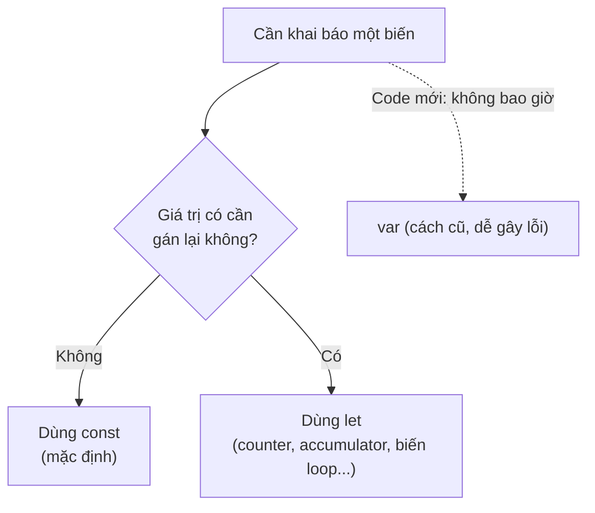

# Khai báo biến: var, let, const

Biến (variable) là "cái hộp" có tên dùng để lưu trữ dữ liệu để tái sử dụng trong chương trình. Trong JavaScript có ba cách khai báo biến là `var`, `let` và `const`, mỗi cách có đặc điểm riêng về khả năng thay đổi giá trị và phạm vi sử dụng. Người mới nên ưu tiên dùng `let` và `const`, vì `var` là cách cũ dễ gây lỗi.

---

:::note[Ghi nhớ nhanh]

- ⭐ **Mặc định dùng `const`, chỉ dùng `let` khi cần gán lại, không dùng `var`** — quy tắc vàng cho code hiện đại.
- ⭐ **`const` không phải immutable** — nó chỉ chặn gán lại biến; object/array bên trong vẫn sửa được (muốn khoá dùng `Object.freeze()`).
- **`var` scope theo function, `let`/`const` scope theo block** — `var` lọt ra ngoài `{}`, còn `let`/`const` chỉ sống trong khối.
- **`let`/`const` có TDZ** — truy cập biến trước dòng khai báo ném `ReferenceError`, giúp phát hiện sớm bug.
- **ESLint `no-var` và `prefer-const`** — tự ép quy tắc trên trong codebase.

:::

---

## Mục lục

- [Tổng quan](#tổng-quan)
- [var](#var)
- [let](#let)
- [const](#const)
- [Khi nào dùng cái nào?](#khi-nào-dùng-cái-nào)
- [Câu hỏi phỏng vấn](#câu-hỏi-phỏng-vấn)

---

## Tổng quan

JavaScript có **3 từ khoá** để khai báo biến:

| Từ khoá | Scope | Hoisting | Reassign | TDZ |
|---------|-------|----------|----------|-----|
| `var` | Function | Có (giá trị `undefined`) | Có | Không |
| `let` | Block | Có (TDZ) | Có | **Có** |
| `const` | Block | Có (TDZ) | **Không** | **Có** |

---

## var

`var` là cách khai báo **cũ** (trước ES6). Scope theo **function**:

```js
function test() {
  if (true) {
    var x = 10;
  }
  console.log(x); // 10 — vẫn truy cập được
}
```

`var` có thể khai báo lại cùng tên không lỗi:

```js
var name = "An";
var name = "Bình"; // OK
```

---

## let

`let` (ES6) có scope theo **block** — chỉ tồn tại trong `{}`:

```js
function test() {
  if (true) {
    let x = 10;
  }
  console.log(x); // ReferenceError
}
```

Không cho khai báo lại cùng tên trong cùng scope:

```js
let name = "An";
let name = "Bình"; // SyntaxError
```

Có thể gán lại giá trị:

```js
let count = 0;
count = 1; // OK
```

---

## const

`const` cũng scope block, nhưng **không gán lại được**:

```js
const PI = 3.14;
PI = 3.15; // TypeError
```

:::warning[Cần lưu ý]

`const` **không** có nghĩa là "immutable" — nó chỉ chặn **gán lại biến**.
Object hoặc array bên trong vẫn sửa được:

```js
const user = { name: "An" };
user.name = "Bình";  // OK — sửa property
user.age = 25;       // OK — thêm property

const arr = [1, 2, 3];
arr.push(4);         // OK — sửa nội dung
arr = [];            // Error — gán lại biến
```

Muốn immutable thực sự, dùng `Object.freeze()`:

```js
const config = Object.freeze({ url: "/api" });
config.url = "x"; // Silently fail (strict mode: TypeError)
```

`Object.freeze` cũng chỉ **shallow** — nested object vẫn sửa được. Cần
deep freeze tự viết hoặc dùng thư viện (Immer, Immutable.js).

:::

---

## Khi nào dùng cái nào?

**Quy tắc 2026:**

1. **Mặc định dùng `const`**.
2. **Chỉ dùng `let`** khi biết chắc sẽ gán lại (counter, accumulator, biến
   trong loop...).
3. **Không bao giờ dùng `var`** trong code mới.



```js
const users = await fetchUsers(); // không gán lại → const
let total = 0;                     // sẽ thay đổi → let
for (let i = 0; i < users.length; i++) {
  total += users[i].score;
}
```

:::info[Phân tích]

**Temporal Dead Zone (TDZ)** là khoảng từ đầu block tới dòng khai báo
`let`/`const`. Truy cập biến trong TDZ ném `ReferenceError`:

```js
console.log(x); // ReferenceError: Cannot access 'x' before initialization
let x = 10;
```

So với `var`:

```js
console.log(y); // undefined (hoisted với giá trị undefined)
var y = 10;
```

→ TDZ giúp **phát hiện sớm bug** dùng biến trước khi khai báo. Đây là
một trong các lý do `let`/`const` an toàn hơn `var`.

Senior thường được hỏi: "Tại sao `typeof` an toàn với biến chưa khai báo
nhưng không an toàn với `let` trong TDZ?":

```js
typeof undeclared; // "undefined" (an toàn)
typeof x;          // ReferenceError (TDZ với let/const)
let x = 1;
```

Lý do: TDZ là **trạng thái thực sự** của biến đã được tạo nhưng chưa
khởi tạo — không phải "không tồn tại".

:::

:::tip[Mẹo]

Trong codebase hiện đại, ESLint rule **`no-var`** và **`prefer-const`**
sẽ tự ép quy tắc trên. Bật chúng trong ESLint config:

```js
// eslint.config.js
{
  rules: {
    "no-var": "error",
    "prefer-const": "warn",
  }
}
```

:::

---

## Câu hỏi phỏng vấn

Những câu thường gặp về chủ đề này. Tự trả lời trước, rồi đối chiếu lại với nội dung phía trên.

1. JavaScript có mấy cách khai báo biến? So sánh `var`, `let`, `const` theo scope, hoisting, khả năng gán lại và TDZ.
2. Phân biệt `function scope` và `block scope`. Cho ví dụ code mà `var` "lọt" ra ngoài khối `if` còn `let` thì không.
3. Khai báo lại cùng một tên biến hai lần với `var`, với `let`, với `const` — mỗi trường hợp cho kết quả gì?
4. `const` có nghĩa là giá trị bất biến (`immutable`) không? Giải thích bằng ví dụ với object và array.
5. Làm sao để thực sự khoá một object không cho sửa? `Object.freeze()` có hạn chế gì và khắc phục ra sao?
6. `Temporal Dead Zone (TDZ)` là gì? Nó bắt đầu và kết thúc ở đâu trong một block?
7. Đoán output và giải thích: `console.log(a); var a = 1;` so với `console.log(b); let b = 1;`
8. Vì sao `typeof` với một biến **chưa hề khai báo** trả về `"undefined"` nhưng `typeof` với biến `let` đang trong TDZ lại ném `ReferenceError`?
9. Đoán output: vòng lặp `for (var i = 0; i < 3; i++) setTimeout(() => console.log(i))` in ra gì? Đổi `var` thành `let` thì sao? Giải thích cơ chế.
10. Nếu buộc phải dùng `var` trong vòng lặp trên mà vẫn muốn in `0 1 2`, bạn xử lý thế nào (gợi ý: `IIFE`, closure)?
11. Gán giá trị cho một biến chưa khai báo (`x = 5`) thì chuyện gì xảy ra? Ở `strict mode` thì khác gì?
12. Vì sao quy tắc hiện đại là "mặc định `const`, cần gán lại mới dùng `let`, không dùng `var`"? Lợi ích cụ thể là gì?
13. `for (const item of arr)` chạy được, nhưng `for (const i = 0; i < 3; i++)` thì lỗi. Giải thích vì sao.
14. Rule ESLint `no-var` và `prefer-const` làm gì? Vì sao nên bật chúng trong codebase nhóm?
15. Biến khai báo bằng `var` ở top-level trong trình duyệt có trở thành property của `window` không? Còn `let`/`const` thì sao?
