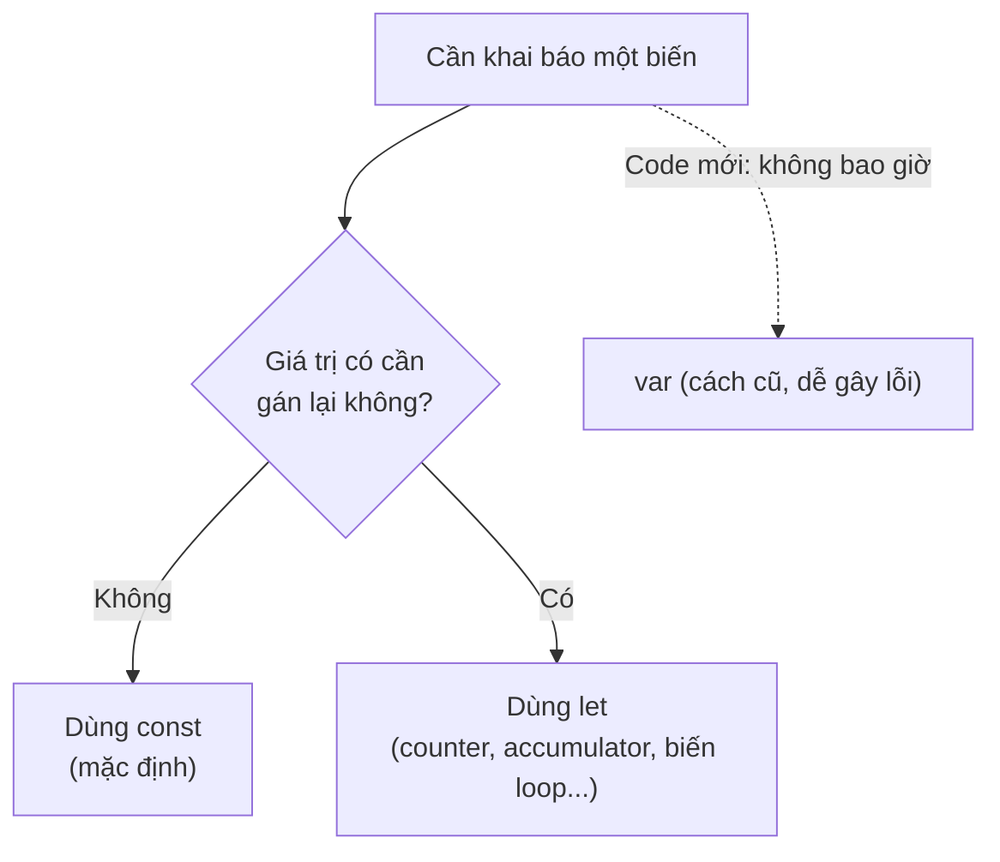

# Khai báo biến: var, let, const

Biến (variable) là "cái hộp" có tên dùng để lưu trữ dữ liệu để tái sử dụng trong chương trình. Trong JavaScript có ba cách khai báo biến là `var`, `let` và `const`, mỗi cách có đặc điểm riêng về khả năng thay đổi giá trị và phạm vi sử dụng. Người mới nên ưu tiên dùng `let` và `const`, vì `var` là cách cũ dễ gây lỗi.

[](pathname:///img/javascript/khai-bao-bien.webp)

---

:::note[Ghi nhớ nhanh]

- ⭐ **Mặc định dùng `const`, chỉ dùng `let` khi cần gán lại, không dùng `var`** — quy tắc vàng cho code hiện đại.
- ⭐ **`const` không phải immutable** — nó chỉ chặn gán lại biến; object/array bên trong vẫn sửa được (muốn khoá dùng `Object.freeze()`).
- **`var` scope theo function, `let`/`const` scope theo block** — `var` lọt ra ngoài `{}`, còn `let`/`const` chỉ sống trong khối.
- **`let`/`const` có TDZ** — truy cập biến trước dòng khai báo ném `ReferenceError`, giúp phát hiện sớm bug.
- **ESLint `no-var` và `prefer-const`** — tự ép quy tắc trên trong codebase.

:::

---

## Mục lục

- [Tổng quan](#tổng-quan)
- [var](#var)
- [let](#let)
- [const](#const)
- [Khi nào dùng cái nào?](#khi-nào-dùng-cái-nào)
- [Câu hỏi phỏng vấn](#câu-hỏi-phỏng-vấn)

---

## Tổng quan

JavaScript có **3 từ khoá** để khai báo biến:

| Từ khoá | Scope | Hoisting | Reassign | TDZ |
|---------|-------|----------|----------|-----|
| `var` | Function | Có (giá trị `undefined`) | Có | Không |
| `let` | Block | Có (TDZ) | Có | **Có** |
| `const` | Block | Có (TDZ) | **Không** | **Có** |

---

## var

`var` là cách khai báo **cũ** (trước ES6). Scope theo **function**:

```js
function test() {
  if (true) {
    var x = 10;
  }
  console.log(x); // 10 — vẫn truy cập được
}
```

`var` có thể khai báo lại cùng tên không lỗi:

```js
var name = "An";
var name = "Bình"; // OK
```

---

## let

`let` (ES6) có scope theo **block** — chỉ tồn tại trong `{}`:

```js
function test() {
  if (true) {
    let x = 10;
  }
  console.log(x); // ReferenceError
}
```

Không cho khai báo lại cùng tên trong cùng scope:

```js
let name = "An";
let name = "Bình"; // SyntaxError
```

Có thể gán lại giá trị:

```js
let count = 0;
count = 1; // OK
```

---

## const

`const` cũng scope block, nhưng **không gán lại được**:

```js
const PI = 3.14;
PI = 3.15; // TypeError
```

:::warning[Cần lưu ý]

`const` **không** có nghĩa là "immutable" — nó chỉ chặn **gán lại biến**.
Object hoặc array bên trong vẫn sửa được:

```js
const user = { name: "An" };
user.name = "Bình";  // OK — sửa property
user.age = 25;       // OK — thêm property

const arr = [1, 2, 3];
arr.push(4);         // OK — sửa nội dung
arr = [];            // Error — gán lại biến
```

Muốn immutable thực sự, dùng `Object.freeze()`:

```js
const config = Object.freeze({ url: "/api" });
config.url = "x"; // Silently fail (strict mode: TypeError)
```

`Object.freeze` cũng chỉ **shallow** — nested object vẫn sửa được. Cần
deep freeze tự viết hoặc dùng thư viện (Immer, Immutable.js).

:::

---

## Khi nào dùng cái nào?

**Quy tắc 2026:**

1. **Mặc định dùng `const`**.
2. **Chỉ dùng `let`** khi biết chắc sẽ gán lại (counter, accumulator, biến
   trong loop...).
3. **Không bao giờ dùng `var`** trong code mới.



```js
const users = await fetchUsers(); // không gán lại → const
let total = 0;                     // sẽ thay đổi → let
for (let i = 0; i < users.length; i++) {
  total += users[i].score;
}
```

:::info[Phân tích]

**Temporal Dead Zone (TDZ)** là khoảng từ đầu block tới dòng khai báo
`let`/`const`. Truy cập biến trong TDZ ném `ReferenceError`:

```js
console.log(x); // ReferenceError: Cannot access 'x' before initialization
let x = 10;
```

So với `var`:

```js
console.log(y); // undefined (hoisted với giá trị undefined)
var y = 10;
```

→ TDZ giúp **phát hiện sớm bug** dùng biến trước khi khai báo. Đây là
một trong các lý do `let`/`const` an toàn hơn `var`.

Senior thường được hỏi: "Tại sao `typeof` an toàn với biến chưa khai báo
nhưng không an toàn với `let` trong TDZ?":

```js
typeof undeclared; // "undefined" (an toàn)
typeof x;          // ReferenceError (TDZ với let/const)
let x = 1;
```

Lý do: TDZ là **trạng thái thực sự** của biến đã được tạo nhưng chưa
khởi tạo — không phải "không tồn tại".

:::

:::tip[Mẹo]

Trong codebase hiện đại, ESLint rule **`no-var`** và **`prefer-const`**
sẽ tự ép quy tắc trên. Bật chúng trong ESLint config:

```js
// eslint.config.js
{
  rules: {
    "no-var": "error",
    "prefer-const": "warn",
  }
}
```

:::

---

## Câu hỏi phỏng vấn

Những câu thường gặp về chủ đề này. Tự trả lời trước, rồi bấm **Xem đáp án** để đối chiếu.

**1. JavaScript có mấy cách khai báo biến? So sánh `var`, `let`, `const` theo scope, hoisting, khả năng gán lại và TDZ.**

<details className="qa">
<summary>Xem đáp án</summary>

JavaScript có **3 từ khoá** khai báo biến: `var` (từ thời đầu) cùng `let` và `const` (thêm từ ES6/2015).

| Từ khoá | Scope | Hoisting | Gán lại | TDZ |
|---|---|---|---|---|
| `var` | **Function** | Có — khởi tạo sẵn giá trị `undefined` | Có | Không |
| `let` | **Block** | Có — nhưng chưa khởi tạo (TDZ) | Có | **Có** |
| `const` | **Block** | Có — nhưng chưa khởi tạo (TDZ) | **Không** | **Có** |

Vài điểm bổ sung:

- `var` cho phép **khai báo lại** cùng tên không báo lỗi; `let`/`const` khai báo lại trong cùng scope là `SyntaxError`.
- `const` **bắt buộc gán giá trị ngay** lúc khai báo; `let` thì không (mặc định `undefined`).
- `const` chỉ chặn **gán lại biến**, không làm giá trị bên trong bất biến.

Quy tắc thực hành hiện đại: mặc định `const`, cần gán lại mới dùng `let`, không dùng `var` trong code mới.

</details>

**2. Phân biệt `function scope` và `block scope`. Cho ví dụ code mà `var` "lọt" ra ngoài khối `if` còn `let` thì không.**

<details className="qa">
<summary>Xem đáp án</summary>

- **Function scope**: biến sống trong toàn bộ hàm chứa nó, bất kể được khai báo bên trong khối `{}` nào. Đây là cách `var` hoạt động.
- **Block scope**: biến chỉ sống trong cặp `{}` gần nhất — thân `if`, `for`, `while`, hay khối `{}` trơn. Đây là cách `let`/`const` hoạt động.

```js
function test() {
  if (true) {
    var x = 10;
    let y = 20;
  }
  console.log(x); // 10 — var "lọt" ra ngoài khối if
  console.log(y); // ReferenceError: y is not defined
}
```

`var x` tuy viết bên trong `if` nhưng thực chất thuộc về cả hàm `test`, nên vẫn truy cập được sau khối. `let y` thì "chết" ngay khi ra khỏi `{}`.

Vì sao block scope tốt hơn: biến chỉ tồn tại đúng nơi cần dùng, giảm nguy cơ ghi đè nhầm biến cùng tên ở chỗ khác, và giúp bộ nhớ được giải phóng sớm hơn. Đây là lý do chính khiến `var` bị xem là nguồn bug.

</details>

**3. Khai báo lại cùng một tên biến hai lần với `var`, với `let`, với `const` — mỗi trường hợp cho kết quả gì?**

<details className="qa">
<summary>Xem đáp án</summary>

```js
// var — hợp lệ, không báo lỗi gì
var name = "An";
var name = "Bình";     // OK, name === "Bình"

// let — lỗi cú pháp
let age = 20;
let age = 30;          // SyntaxError: Identifier 'age' has already been declared

// const — cũng lỗi cú pháp
const PI = 3.14;
const PI = 3.15;       // SyntaxError: Identifier 'PI' has already been declared
```

Lưu ý quan trọng: `SyntaxError` ở đây được phát hiện **lúc parse**, trước khi bất kỳ dòng nào chạy — nên cả file không chạy được, kể cả `console.log` ở dòng đầu tiên.

Việc `var` cho phép khai báo lại là một nguồn bug kinh điển: trong một hàm dài, bạn vô tình khai báo lại một biến đã tồn tại và ghi đè nó mà không nhận được cảnh báo nào. `let`/`const` báo lỗi ngay, giúp phát hiện xung đột tên sớm.

Cũng cần phân biệt: khai báo lại trong **scope khác** (ví dụ khối lồng bên trong) thì hợp lệ với cả ba — đó là **shadowing**, không phải khai báo lại.

</details>

**4. `const` có nghĩa là giá trị bất biến (`immutable`) không? Giải thích bằng ví dụ với object và array.**

<details className="qa">
<summary>Xem đáp án</summary>

**Không.** `const` chỉ đảm bảo **binding không đổi** — tức là tên biến luôn trỏ tới cùng một giá trị, không thể gán lại. Nó **không** khoá nội dung bên trong của giá trị đó.

Với kiểu nguyên thủy (number, string...) thì điều này trông giống như bất biến, vì bản thân giá trị nguyên thủy vốn đã bất biến. Nhưng với object và array thì khác hẳn:

```js
const user = { name: "An" };
user.name = "Bình";  // OK — sửa property
user.age = 25;       // OK — thêm property
user = {};           // TypeError: Assignment to constant variable

const arr = [1, 2, 3];
arr.push(4);         // OK — [1, 2, 3, 4]
arr[0] = 99;         // OK
arr = [];            // TypeError
```

Cách hiểu đúng: biến `const` giống một cái hộp bị dán niêm phong — bạn không đổi được **cái hộp** (địa chỉ tham chiếu), nhưng vẫn thò tay vào sắp xếp lại **đồ bên trong**.

Muốn bất biến thật sự thì cần `Object.freeze()` hoặc thư viện chuyên dụng.

</details>

**5. Làm sao để thực sự khoá một object không cho sửa? `Object.freeze()` có hạn chế gì và khắc phục ra sao?**

<details className="qa">
<summary>Xem đáp án</summary>

Dùng **`Object.freeze()`** — nó chặn thêm, xóa và sửa property của object:

```js
const config = Object.freeze({ url: "/api" });
config.url = "x";  // Silently fail (ở strict mode: TypeError)
console.log(config.url); // "/api"
```

**Hạn chế lớn nhất: `Object.freeze` chỉ là shallow (nông)** — nó chỉ khoá tầng ngoài cùng, object lồng bên trong vẫn sửa được:

```js
const cfg = Object.freeze({ db: { host: "localhost" } });
cfg.db.host = "remote";       // vẫn sửa được!
console.log(cfg.db.host);     // "remote"
```

Hạn chế khác: ở **non-strict mode** việc gán bị thất bại **im lặng**, không báo lỗi gì — rất khó phát hiện bug.

**Cách khắc phục:**

- Viết hàm **deep freeze** đệ quy: duyệt mọi property là object rồi `freeze` từng cái.
- Dùng thư viện chuyên dụng: **Immer** (viết code như đang mutate nhưng tạo ra bản sao bất biến), **Immutable.js** (cấu trúc dữ liệu bất biến).
- Luôn bật **strict mode** (ES Module mặc định strict) để mọi vi phạm ném `TypeError` thay vì im lặng.

</details>

**6. `Temporal Dead Zone (TDZ)` là gì? Nó bắt đầu và kết thúc ở đâu trong một block?**

<details className="qa">
<summary>Xem đáp án</summary>

**TDZ (Temporal Dead Zone — vùng chết tạm thời)** là khoảng thời gian mà một biến `let`/`const` **đã được tạo ra nhưng chưa được khởi tạo**. Truy cập biến trong khoảng này ném `ReferenceError`.

- **Bắt đầu**: ngay tại **đầu block** chứa khai báo (không phải đầu file).
- **Kết thúc**: tại **dòng khai báo** được thực thi và giá trị được gán xong.

```js
{
  // ── TDZ của x bắt đầu từ đây ──
  console.log(x); // ReferenceError: Cannot access 'x' before initialization
  let x = 10;     // ── TDZ kết thúc tại đây ──
  console.log(x); // 10
}
```

So sánh với `var` — được hoisting **kèm khởi tạo `undefined`** nên không có TDZ:

```js
console.log(y); // undefined — không lỗi
var y = 10;
```

Điểm cần nhớ: `let`/`const` **cũng được hoisting** (engine biết chúng tồn tại từ đầu block), chỉ khác là không được khởi tạo sẵn. Ý nghĩa của TDZ là **phát hiện sớm bug** dùng biến trước khi khai báo — thay vì âm thầm nhận `undefined` rồi lỗi ở chỗ khác khó truy.

</details>

**7. Đoán output và giải thích: `console.log(a); var a = 1;` so với `console.log(b); let b = 1;`**

<details className="qa">
<summary>Xem đáp án</summary>

```js
console.log(a); // undefined
var a = 1;

console.log(b); // ReferenceError: Cannot access 'b' before initialization
let b = 1;
```

**Vì sao khác nhau:** cả `var` lẫn `let` đều được **hoisting** — engine ghi nhận sự tồn tại của biến ngay khi vào scope. Khác biệt nằm ở **bước khởi tạo**:

- `var a` được hoisting **kèm khởi tạo giá trị `undefined`**. Nên lúc `console.log(a)` chạy, biến đã tồn tại và có giá trị `undefined` → in ra `undefined`, không lỗi.
- `let b` được hoisting nhưng **chưa khởi tạo** — nó nằm trong **TDZ**. Truy cập biến ở trạng thái này ném `ReferenceError`.

Chú ý thông điệp lỗi: `"Cannot access 'b' before initialization"` khác với `"b is not defined"`. Câu đầu nghĩa là biến **có tồn tại** nhưng chưa khởi tạo (TDZ); câu sau nghĩa là biến **không hề được khai báo**.

Hành vi `undefined` im lặng của `var` chính là thứ TDZ sinh ra để khắc phục.

</details>

**8. Vì sao `typeof` với một biến chưa hề khai báo trả về `"undefined"` nhưng `typeof` với biến `let` đang trong TDZ lại ném `ReferenceError`?**

<details className="qa">
<summary>Xem đáp án</summary>

```js
typeof undeclared; // "undefined" — an toàn
typeof x;          // ReferenceError — TDZ
let x = 1;
```

**Với biến chưa khai báo:** `typeof` được đặc cách trong spec — đây là một ngoại lệ có từ thời JS sơ khai, cố ý cho phép kiểm tra sự tồn tại của biến mà không gây lỗi. Nó vốn được dùng để **feature detection** (`if (typeof someGlobal !== "undefined")`) khi chưa có API kiểm tra nào tốt hơn.

**Với biến `let` trong TDZ:** ngoại lệ trên **không áp dụng**. Lý do: TDZ không phải trạng thái "không tồn tại" mà là **trạng thái thực sự của một biến đã được tạo nhưng chưa khởi tạo**. Engine biết chắc `x` tồn tại trong scope này, chỉ là chưa có giá trị — nên mọi thao tác đọc nó, kể cả `typeof`, đều bị chặn.

Đây cũng là một thiết kế có chủ đích: nếu `typeof` "cứu" được TDZ thì sẽ mất luôn tác dụng phát hiện sớm bug. Hệ quả thực tế: `typeof` **không còn là cách an toàn tuyệt đối** để kiểm tra biến — với biến toàn cục nên dùng `"name" in globalThis`.

</details>

**9. Đoán output: vòng lặp `for (var i = 0; i < 3; i++) setTimeout(() => console.log(i))` in ra gì? Đổi `var` thành `let` thì sao? Giải thích cơ chế.**

<details className="qa">
<summary>Xem đáp án</summary>

```js
for (var i = 0; i < 3; i++) setTimeout(() => console.log(i));
// Output: 3, 3, 3

for (let i = 0; i < 3; i++) setTimeout(() => console.log(i));
// Output: 0, 1, 2
```

**Với `var`:** chỉ có **một biến `i` duy nhất** ở function scope, dùng chung cho cả vòng lặp. `setTimeout` là bất đồng bộ — các callback chỉ chạy sau khi toàn bộ code đồng bộ kết thúc, tức là sau khi vòng lặp đã chạy xong và `i` đã bằng `3`. Cả ba closure đều trỏ tới **cùng một biến** đó nên đều in `3`.

**Với `let`:** đây là hành vi đặc biệt được spec quy định riêng cho vòng `for` — mỗi lần lặp, engine tạo một **binding mới** của `i` và sao chép giá trị hiện tại vào đó. Ba callback vì vậy "bắt" (capture) ba biến khác nhau, giữ đúng giá trị `0`, `1`, `2` tại thời điểm chúng được tạo.

Đây là một trong những câu phỏng vấn kinh điển nhất về closure — và cũng là ví dụ rõ nhất cho thấy block scope giải quyết được vấn đề gì.

</details>

**10. Nếu buộc phải dùng `var` trong vòng lặp trên mà vẫn muốn in `0 1 2`, bạn xử lý thế nào (gợi ý: `IIFE`, closure)?**

<details className="qa">
<summary>Xem đáp án</summary>

Vấn đề là cả ba callback dùng chung một biến `i`. Giải pháp: **tạo một scope riêng cho mỗi lần lặp** để "đóng băng" giá trị `i` tại thời điểm đó.

**Cách 1 — IIFE (Immediately Invoked Function Expression):**

```js
for (var i = 0; i < 3; i++) {
  (function (j) {
    setTimeout(() => console.log(j)); // 0, 1, 2
  })(i); // truyền i vào làm tham số → mỗi lần gọi có j riêng
}
```

Mỗi lần lặp gọi một hàm mới, tạo ra một function scope mới với tham số `j` giữ bản sao của `i`.

**Cách 2 — truyền tham số qua `setTimeout`:**

```js
for (var i = 0; i < 3; i++) {
  setTimeout((j) => console.log(j), 0, i); // 0, 1, 2
}
```

`setTimeout` chuyển các tham số từ vị trí thứ 3 trở đi cho callback — giá trị `i` được chốt ngay lúc gọi.

Trước ES6, IIFE là cách chuẩn mực để mô phỏng block scope. Ngày nay chỉ cần đổi `var` thành `let` là xong — đó chính là lý do `let` ra đời.

</details>

**11. Gán giá trị cho một biến chưa khai báo (`x = 5`) thì chuyện gì xảy ra? Ở `strict mode` thì khác gì?**

<details className="qa">
<summary>Xem đáp án</summary>

**Ở non-strict mode (sloppy mode):** JS âm thầm tạo một **biến toàn cục ngầm** (implicit global) — thực chất là một property trên object global (`window` trong trình duyệt):

```js
function f() {
  x = 5;  // không có var/let/const
}
f();
console.log(x);        // 5 — rò ra global!
console.log(window.x); // 5
```

Đây là nguồn bug nghiêm trọng: gõ sai tên biến (`cont` thay vì `count`) không báo lỗi mà lặng lẽ tạo ra một biến global mới, gây xung đột tên giữa các module và rò rỉ bộ nhớ.

**Ở strict mode:** hành vi này bị cấm, ném lỗi ngay:

```js
"use strict";
x = 5; // ReferenceError: x is not defined
```

Điểm thực tế cần nhớ: **ES Module và thân `class` luôn ở strict mode**, nên trong code hiện đại (dùng `import`/`export`, bundler, framework) bạn tự động được bảo vệ. Chỉ script cũ dạng `<script>` thường mới còn rơi vào non-strict mode. Cách phòng ngừa tốt nhất vẫn là luôn khai báo biến tường minh bằng `const`/`let`.

</details>

**12. Vì sao quy tắc hiện đại là "mặc định `const`, cần gán lại mới dùng `let`, không dùng `var`"? Lợi ích cụ thể là gì?**

<details className="qa">
<summary>Xem đáp án</summary>

**Vì sao `const` trước tiên:**

- **Truyền đạt ý định**: đọc `const` là biết ngay biến này không bị gán lại ở đâu khác trong hàm — bớt hẳn một thứ phải theo dõi khi đọc code.
- **Ngăn bug gán nhầm**: gán lại sẽ bị `TypeError` ngay thay vì âm thầm làm hỏng logic.
- **Dễ refactor**: khi cần tách hàm hay di chuyển code, biến bất biến an toàn hơn nhiều.

**Vì sao `let` chỉ khi cần:** dùng `let` là một tín hiệu rõ ràng "biến này sẽ thay đổi" — dành cho counter, accumulator, biến tích lũy trong vòng lặp.

**Vì sao tránh `var`:**

- Function scope khiến biến "lọt" ra ngoài khối, dễ va chạm tên.
- Hoisting kèm `undefined` che giấu lỗi dùng biến trước khi khai báo.
- Cho phép khai báo lại, âm thầm ghi đè biến cũ.
- Ở top-level trình duyệt còn tạo property trên `window`, gây ô nhiễm global.
- Gây bug closure trong vòng lặp (câu `setTimeout` in `3 3 3`).

```js
const users = await fetchUsers(); // không gán lại → const
let total = 0;                    // sẽ thay đổi → let
```

Bật ESLint `no-var` và `prefer-const` để cả nhóm tuân thủ tự động.

</details>

**13. `for (const item of arr)` chạy được, nhưng `for (const i = 0; i < 3; i++)` thì lỗi. Giải thích vì sao.**

<details className="qa">
<summary>Xem đáp án</summary>

Khác biệt nằm ở chỗ **biến có bị gán lại hay không**.

**`for...of` với `const` — hợp lệ:**

```js
for (const item of [1, 2, 3]) {
  console.log(item); // 1, 2, 3
}
```

Mỗi lần lặp, engine tạo một **binding `item` hoàn toàn mới** và gán giá trị phần tử kế tiếp cho nó. Không có thao tác gán lại nào trên cùng một binding, nên `const` không bị vi phạm. (`for...in` cũng tương tự.)

**`for` cổ điển với `const` — lỗi:**

```js
for (const i = 0; i < 3; i++) {
  // TypeError: Assignment to constant variable.
}
```

Ở đây `i` được khởi tạo **một lần duy nhất**, rồi biểu thức `i++` **gán lại** chính binding đó ở cuối mỗi vòng. Đó chính là thao tác `const` cấm. Cụ thể: vòng đầu tiên vẫn chạy được thân lặp, lỗi ném ra khi tới bước `i++`.

Quy tắc dễ nhớ: `for...of` / `for...in` → dùng `const` (trừ khi cần sửa biến lặp); vòng `for` cổ điển có bộ đếm → phải dùng `let`.

</details>

**14. Rule ESLint `no-var` và `prefer-const` làm gì? Vì sao nên bật chúng trong codebase nhóm?**

<details className="qa">
<summary>Xem đáp án</summary>

- **`no-var`** — báo lỗi mọi khai báo bằng `var`, buộc dùng `let`/`const`.
- **`prefer-const`** — báo khi một biến khai báo bằng `let` nhưng **không hề bị gán lại** ở đâu, gợi ý đổi sang `const`.

```js
// eslint.config.js
{
  rules: {
    "no-var": "error",
    "prefer-const": "warn",
  }
}
```

**Vì sao nên bật trong nhóm:**

- **Tự động hoá quy ước**: quy tắc "const trước, let khi cần, không var" không còn phụ thuộc vào trí nhớ hay thiện chí của từng người.
- **Bỏ tranh cãi trong code review**: máy nhắc thay người, reviewer tập trung vào logic thay vì style.
- **Nhất quán toàn codebase**, kể cả với thành viên mới hoặc code kế thừa.
- **Sửa được tự động**: cả hai rule đều hỗ trợ `--fix`, chạy một lệnh là migrate được cả dự án.
- **Bắt lỗi sớm**: `prefer-const` còn gián tiếp cho thấy biến nào thực sự thay đổi — hữu ích khi đọc và refactor.

Thường đi kèm với việc chạy ESLint trong pre-commit hook và CI để không lọt lên nhánh chính.

</details>

**15. Biến khai báo bằng `var` ở top-level trong trình duyệt có trở thành property của `window` không? Còn `let`/`const` thì sao?**

<details className="qa">
<summary>Xem đáp án</summary>

Trong một `<script>` thường (không phải module):

```js
var a = 1;
let b = 2;
const c = 3;

console.log(window.a); // 1        — var TRỞ THÀNH property của window
console.log(window.b); // undefined — let thì không
console.log(window.c); // undefined — const cũng không

console.log(b); // 2 — vẫn truy cập bình thường bằng tên
```

**Vì sao khác nhau:** `var` và `function` ở top-level được ghi vào **object environment record** của global scope — chính là object `window`. Còn `let`, `const` và `class` được ghi vào một **declarative environment record** riêng (thường gọi là "script scope"), nằm ngoài `window` nhưng vẫn thuộc phạm vi toàn cục nên truy cập bằng tên vẫn được.

Đây là thiết kế có chủ đích: tránh làm ô nhiễm `window`, giảm nguy cơ hai script vô tình ghi đè biến của nhau, và không cho phép ghi đè các property có sẵn của trình duyệt.

Hai lưu ý thêm:

- Trong **ES Module** (`<script type="module">`), kể cả `var` ở top-level **cũng không** lên `window` — module có scope riêng.
- Trong **Node.js**, mỗi file CommonJS là một module nên `var` top-level cũng không thành property của `globalThis`.

</details>
