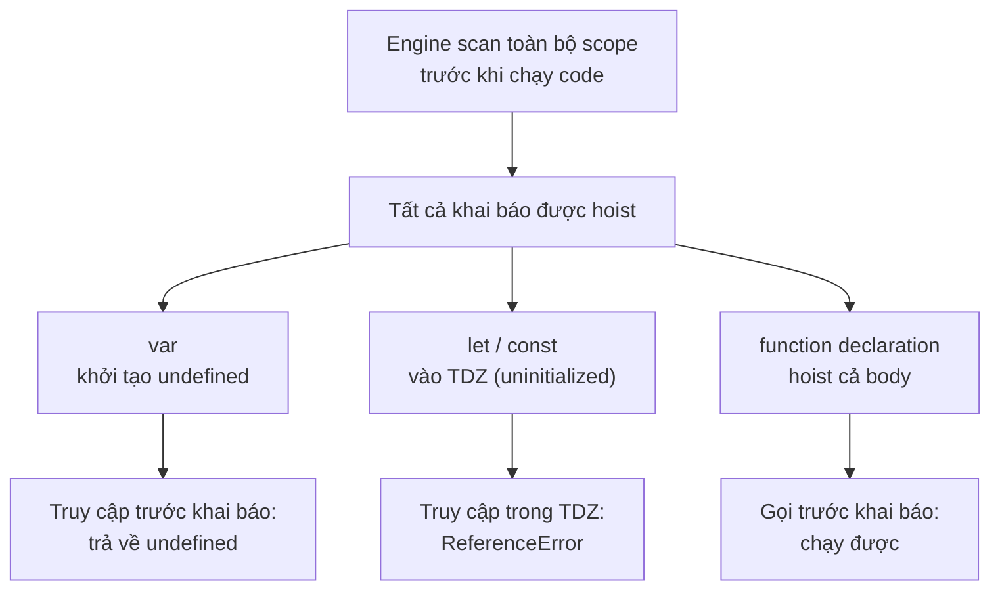

# Hoisting và Quy tắc đặt tên

**Hoisting** (kéo khai báo lên đầu) là cơ chế JavaScript tự "đưa" các khai báo biến và hàm lên trên cùng phạm vi trước khi chạy code, điều này đôi khi gây ra kết quả bất ngờ cho người mới. Bài này cũng nói về **quy tắc đặt tên** (naming) biến sao cho hợp lệ và dễ đọc. Hiểu hai chủ đề này giúp bạn tránh nhiều lỗi khó hiểu khi mới học.

---

:::note[Ghi nhớ nhanh]

- ⭐ **Tất cả khai báo đều được hoist**, nhưng khác nhau: `var` khởi tạo `undefined`, `let`/`const` vào TDZ (truy cập trước khai báo ném `ReferenceError`) — đây là câu trả lời chuẩn khi phỏng vấn.
- ⭐ **`function` declaration được hoist cả body** (gọi trước khi khai báo vẫn chạy), nhưng function expression / arrow function gán vào biến thì không.
- **Không nên khai báo `function` trong block** — behavior khác nhau giữa strict và sloppy mode; nên dùng function expression hoặc arrow function.
- **Tên biến hợp lệ** chứa chữ, số, `_`, `$`, không bắt đầu bằng số, không trùng reserved keyword.
- **Convention đặt tên** — `camelCase` cho biến/hàm, `PascalCase` cho class, `UPPER_SNAKE_CASE` cho hằng, prefix `is/has/can` cho boolean.

:::

---

## Mục lục

- [Hoisting là gì?](#hoisting-là-gì)
- [Hoisting với var](#hoisting-với-var)
- [Hoisting với let / const](#hoisting-với-let--const)
- [Hoisting với function](#hoisting-với-function)
- [Quy tắc đặt tên](#quy-tắc-đặt-tên)
- [Câu hỏi phỏng vấn](#câu-hỏi-phỏng-vấn)

---

## Hoisting là gì?

**Hoisting** ("cẩu lên") là cơ chế JavaScript engine **đưa khai báo
biến và hàm lên đầu scope** trước khi chạy code.

Code thật:

```js
console.log(x);
var x = 10;
```

Engine xử lý như:

```js
var x;          // khai báo được "cẩu" lên đầu
console.log(x); // undefined (chưa gán)
x = 10;         // gán xảy ra ở đúng dòng
```

---

## Hoisting với var

`var` được hoist với giá trị **`undefined`** — truy cập trước khai báo
không lỗi, nhưng giá trị là `undefined`:

```js
console.log(name); // undefined
var name = "An";
```

---

## Hoisting với let / const

`let` và `const` cũng được hoist, **nhưng** ở trong **Temporal Dead
Zone (TDZ)** — truy cập trước khai báo ném `ReferenceError`:

```js
console.log(x); // ReferenceError
let x = 10;
```

:::info[Phân tích]

Khẳng định "let/const không hoist" thường gặp trong tài liệu cũ là **sai**.

Thực tế:

1. Engine vẫn **scan toàn block** trước khi chạy → biến đã tồn tại.
2. Nhưng biến ở trạng thái **uninitialized** (TDZ) cho đến dòng khai báo.
3. Truy cập biến uninitialized ném `ReferenceError`.

So với `var`:

| | `var` | `let` / `const` |
|--|--|--|
| Được hoist? | Có | **Có** |
| Giá trị ban đầu | `undefined` | TDZ (không truy cập được) |
| Truy cập trước khai báo | Trả về `undefined` | **ReferenceError** |

Câu trả lời chuẩn cho phỏng vấn: "**Tất cả đều hoist**, nhưng `let`/`const`
ở trong TDZ cho đến dòng khai báo."

:::

---

## Hoisting với function

Function declaration được **hoist toàn bộ** (cả tên + body):

```js
greet(); // "Hi" — chạy được!

function greet() {
  console.log("Hi");
}
```

Function expression (gán cho biến) **không** được hoist như function:

```js
greet(); // TypeError: greet is not a function

var greet = function () {
  console.log("Hi");
};
```

Vì `var greet` được hoist với giá trị `undefined`, tại thời điểm gọi
`greet()` thì giá trị là `undefined`, không phải function.

Arrow function (`const`/`let`) còn ném `ReferenceError`:

```js
greet(); // ReferenceError (TDZ)

const greet = () => console.log("Hi");
```

:::warning[Cần lưu ý]

**Function trong block scope** behavior khác nhau giữa strict mode và
sloppy mode. Trong strict mode, function declaration trong `if`/`for`
được scope vào block:

```js
"use strict";

if (true) {
  function foo() {}
}
foo(); // ReferenceError trong strict
       // OK trong sloppy mode (foo bị hoist ra ngoài)
```

→ Không nên khai báo function trong block. Dùng function expression
hoặc arrow function gán vào biến.

:::

Sơ đồ dưới đây tóm tắt: mọi khai báo đều được hoist, nhưng cách truy cập
trước dòng khai báo khác nhau tùy loại:



---

## Quy tắc đặt tên

**Hợp lệ:**

- Chứa chữ cái (a-z, A-Z), số (0-9), `_`, `$`.
- **Không** bắt đầu bằng số.
- Hỗ trợ Unicode (tên tiếng Việt có dấu chạy được).

```js
let name;
let _private;
let $element;
let user1;
let người_dùng; // OK nhưng không khuyến nghị
```

**Không hợp lệ:**

```js
let 1user;    // SyntaxError — bắt đầu bằng số
let my-name;  // SyntaxError — chứa dấu trừ
let class;    // SyntaxError — từ khoá dành riêng
```

**Reserved keywords không được dùng làm tên biến:**

```
break case catch class const continue debugger default delete do
else export extends false finally for function if import in instanceof
new null return super switch this throw true try typeof var void
while with yield let static
```

---

## Convention đặt tên

| Loại | Convention | Ví dụ |
|------|-----------|-------|
| Biến, hàm | camelCase | `userName`, `getCurrentUser()` |
| Class, constructor | PascalCase | `User`, `UserService` |
| Hằng số global | UPPER_SNAKE_CASE | `MAX_RETRIES`, `API_URL` |
| Private (theo quy ước) | `_camelCase` | `_internalState` |
| Private thật (class) | `#camelCase` | `#password` |
| Boolean | `is/has/can` prefix | `isActive`, `hasPermission` |

:::tip[Mẹo]

**Tên biến tốt** đáng giá hơn comment. Một tên rõ ràng giúp người đọc
hiểu code mà không cần đọc context:

```js
// Tệ
const d = new Date() - user.createdAt;

// Tốt
const accountAgeMs = Date.now() - user.createdAt.getTime();
```

Trong code review, đổi tên thường là feedback **dễ nhất và hiệu quả
nhất**. Đừng tiếc thời gian đặt tên cho rõ.

:::

---

## Câu hỏi phỏng vấn

Những câu thường gặp về chủ đề này. Tự trả lời trước, rồi đối chiếu lại với nội dung phía trên.

1. `Hoisting` là gì? Engine làm gì trước khi thực sự chạy code trong một scope?
2. Câu nói "`let` và `const` không được hoist" đúng hay sai? Trả lời chuẩn cho phỏng vấn là gì?
3. So sánh trạng thái ban đầu của `var`, `let`/`const` và `function` sau khi được hoist.
4. Đoán output và giải thích: `console.log(name); var name = "An";`
5. Đoán output và giải thích: `greet(); function greet() { console.log("Hi"); }`
6. Đoán output và giải thích: `greet(); var greet = function () {};` — vì sao lại là `TypeError` chứ không phải `ReferenceError`?
7. Đoán output và giải thích: `greet(); const greet = () => {};` — vì sao lỗi ở đây khác với câu trên?
8. Phân biệt `function declaration` và `function expression` về hoisting. Khi nào nên dùng cái nào?
9. Khai báo `function` bên trong một block `if` thì hành vi khác nhau ra sao giữa `strict mode` và `sloppy mode`? Nên viết thế nào để an toàn?
10. Nếu trong cùng scope có cả `var foo` và `function foo()` thì cái nào "thắng"? Giải thích thứ tự hoisting.
11. Những ký tự nào hợp lệ trong tên biến JavaScript? Vì sao `let 1user`, `let my-name`, `let class` đều lỗi?
12. `Reserved keyword` là gì? Kể vài từ khoá không được dùng làm tên biến.
13. Nêu convention đặt tên cho biến/hàm, class, hằng số global, boolean. Vì sao boolean nên có prefix `is`/`has`/`can`?
14. Phân biệt quy ước `_privateField` và private thật sự `#privateField` trong class.
15. Vì sao "tên biến tốt đáng giá hơn comment"? Cho ví dụ đổi tên biến làm code tự giải thích được.
16. `Shadowing` là gì? Cho ví dụ biến ở block trong che biến cùng tên ở block ngoài, và trường hợp nào gây `illegal shadowing`?
