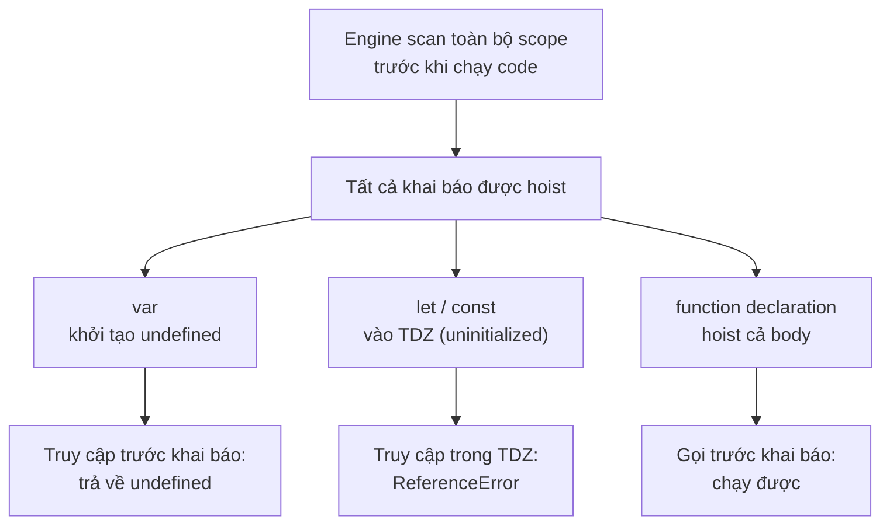

# Hoisting và Quy tắc đặt tên

**Hoisting** (kéo khai báo lên đầu) là cơ chế JavaScript tự "đưa" các khai báo biến và hàm lên trên cùng phạm vi trước khi chạy code, điều này đôi khi gây ra kết quả bất ngờ cho người mới. Bài này cũng nói về **quy tắc đặt tên** (naming) biến sao cho hợp lệ và dễ đọc. Hiểu hai chủ đề này giúp bạn tránh nhiều lỗi khó hiểu khi mới học.

[](pathname:///img/javascript/hoisting-naming.webp)

---

:::note[Ghi nhớ nhanh]

- ⭐ **Tất cả khai báo đều được hoist**, nhưng khác nhau: `var` khởi tạo `undefined`, `let`/`const` vào TDZ (truy cập trước khai báo ném `ReferenceError`) — đây là câu trả lời chuẩn khi phỏng vấn.
- ⭐ **`function` declaration được hoist cả body** (gọi trước khi khai báo vẫn chạy), nhưng function expression / arrow function gán vào biến thì không.
- **Không nên khai báo `function` trong block** — behavior khác nhau giữa strict và sloppy mode; nên dùng function expression hoặc arrow function.
- **Tên biến hợp lệ** chứa chữ, số, `_`, `$`, không bắt đầu bằng số, không trùng reserved keyword.
- **Convention đặt tên** — `camelCase` cho biến/hàm, `PascalCase` cho class, `UPPER_SNAKE_CASE` cho hằng, prefix `is/has/can` cho boolean.

:::

---

## Mục lục

- [Hoisting là gì?](#hoisting-là-gì)
- [Hoisting với var](#hoisting-với-var)
- [Hoisting với let / const](#hoisting-với-let--const)
- [Hoisting với function](#hoisting-với-function)
- [Quy tắc đặt tên](#quy-tắc-đặt-tên)
- [Câu hỏi phỏng vấn](#câu-hỏi-phỏng-vấn)

---

## Hoisting là gì?

**Hoisting** ("cẩu lên") là cơ chế JavaScript engine **đưa khai báo
biến và hàm lên đầu scope** trước khi chạy code.

Code thật:

```js
console.log(x);
var x = 10;
```

Engine xử lý như:

```js
var x;          // khai báo được "cẩu" lên đầu
console.log(x); // undefined (chưa gán)
x = 10;         // gán xảy ra ở đúng dòng
```

---

## Hoisting với var

`var` được hoist với giá trị **`undefined`** — truy cập trước khai báo
không lỗi, nhưng giá trị là `undefined`:

```js
console.log(name); // undefined
var name = "An";
```

---

## Hoisting với let / const

`let` và `const` cũng được hoist, **nhưng** ở trong **Temporal Dead
Zone (TDZ)** — truy cập trước khai báo ném `ReferenceError`:

```js
console.log(x); // ReferenceError
let x = 10;
```

:::info[Phân tích]

Khẳng định "let/const không hoist" thường gặp trong tài liệu cũ là **sai**.

Thực tế:

1. Engine vẫn **scan toàn block** trước khi chạy → biến đã tồn tại.
2. Nhưng biến ở trạng thái **uninitialized** (TDZ) cho đến dòng khai báo.
3. Truy cập biến uninitialized ném `ReferenceError`.

So với `var`:

| | `var` | `let` / `const` |
|--|--|--|
| Được hoist? | Có | **Có** |
| Giá trị ban đầu | `undefined` | TDZ (không truy cập được) |
| Truy cập trước khai báo | Trả về `undefined` | **ReferenceError** |

Câu trả lời chuẩn cho phỏng vấn: "**Tất cả đều hoist**, nhưng `let`/`const`
ở trong TDZ cho đến dòng khai báo."

:::

---

## Hoisting với function

Function declaration được **hoist toàn bộ** (cả tên + body):

```js
greet(); // "Hi" — chạy được!

function greet() {
  console.log("Hi");
}
```

Function expression (gán cho biến) **không** được hoist như function:

```js
greet(); // TypeError: greet is not a function

var greet = function () {
  console.log("Hi");
};
```

Vì `var greet` được hoist với giá trị `undefined`, tại thời điểm gọi
`greet()` thì giá trị là `undefined`, không phải function.

Arrow function (`const`/`let`) còn ném `ReferenceError`:

```js
greet(); // ReferenceError (TDZ)

const greet = () => console.log("Hi");
```

:::warning[Cần lưu ý]

**Function trong block scope** behavior khác nhau giữa strict mode và
sloppy mode. Trong strict mode, function declaration trong `if`/`for`
được scope vào block:

```js
"use strict";

if (true) {
  function foo() {}
}
foo(); // ReferenceError trong strict
       // OK trong sloppy mode (foo bị hoist ra ngoài)
```

→ Không nên khai báo function trong block. Dùng function expression
hoặc arrow function gán vào biến.

:::

Sơ đồ dưới đây tóm tắt: mọi khai báo đều được hoist, nhưng cách truy cập
trước dòng khai báo khác nhau tùy loại:



---

## Quy tắc đặt tên

**Hợp lệ:**

- Chứa chữ cái (a-z, A-Z), số (0-9), `_`, `$`.
- **Không** bắt đầu bằng số.
- Hỗ trợ Unicode (tên tiếng Việt có dấu chạy được).

```js
let name;
let _private;
let $element;
let user1;
let người_dùng; // OK nhưng không khuyến nghị
```

**Không hợp lệ:**

```js
let 1user;    // SyntaxError — bắt đầu bằng số
let my-name;  // SyntaxError — chứa dấu trừ
let class;    // SyntaxError — từ khoá dành riêng
```

**Reserved keywords không được dùng làm tên biến:**

```
break case catch class const continue debugger default delete do
else export extends false finally for function if import in instanceof
new null return super switch this throw true try typeof var void
while with yield let static
```

---

## Convention đặt tên

| Loại | Convention | Ví dụ |
|------|-----------|-------|
| Biến, hàm | camelCase | `userName`, `getCurrentUser()` |
| Class, constructor | PascalCase | `User`, `UserService` |
| Hằng số global | UPPER_SNAKE_CASE | `MAX_RETRIES`, `API_URL` |
| Private (theo quy ước) | `_camelCase` | `_internalState` |
| Private thật (class) | `#camelCase` | `#password` |
| Boolean | `is/has/can` prefix | `isActive`, `hasPermission` |

:::tip[Mẹo]

**Tên biến tốt** đáng giá hơn comment. Một tên rõ ràng giúp người đọc
hiểu code mà không cần đọc context:

```js
// Tệ
const d = new Date() - user.createdAt;

// Tốt
const accountAgeMs = Date.now() - user.createdAt.getTime();
```

Trong code review, đổi tên thường là feedback **dễ nhất và hiệu quả
nhất**. Đừng tiếc thời gian đặt tên cho rõ.

:::

---

## Câu hỏi phỏng vấn

Những câu thường gặp về chủ đề này. Tự trả lời trước, rồi bấm **Xem đáp án** để đối chiếu.

**1. `Hoisting` là gì? Engine làm gì trước khi thực sự chạy code trong một scope?**

<details className="qa">
<summary>Xem đáp án</summary>

**Hoisting** ("cẩu lên") là cơ chế JavaScript engine **đưa khai báo biến và hàm lên đầu scope** trước khi chạy code. Nói chính xác hơn, engine xử lý mỗi scope theo hai pha:

- **Pha tạo (creation)**: engine **scan toàn bộ scope**, đăng ký trước mọi tên được khai báo (`var`, `let`, `const`, `function`, `class`) vào môi trường của scope đó.
- **Pha thực thi (execution)**: chạy code từng dòng, thực hiện các phép gán.

Vì vậy khi code chạy tới dòng đầu tiên thì tất cả tên đã tồn tại sẵn — chỉ khác nhau ở **trạng thái ban đầu**:

```js
console.log(x); // undefined — x đã tồn tại, chưa gán
var x = 10;     // gán xảy ra ở đúng dòng này
```

Hiểu đúng: hoisting **không di chuyển code**, nó chỉ là hệ quả của việc engine đăng ký khai báo trước khi chạy.

</details>

**2. Câu nói "`let` và `const` không được hoist" đúng hay sai? Trả lời chuẩn cho phỏng vấn là gì?**

<details className="qa">
<summary>Xem đáp án</summary>

**Sai.** Đây là khẳng định phổ biến trong tài liệu cũ nhưng không chính xác. Thực tế:

1. Engine vẫn **scan toàn block** trước khi chạy → biến `let`/`const` **đã tồn tại**.
2. Nhưng biến ở trạng thái **uninitialized** — nằm trong **Temporal Dead Zone (TDZ)** cho đến dòng khai báo.
3. Truy cập biến uninitialized ném `ReferenceError`.

Bằng chứng biến đã tồn tại: nếu `let` không hoist, dòng dưới sẽ đọc được biến ở scope ngoài, nhưng thực tế nó báo lỗi.

```js
let x = "ngoài";
{
  console.log(x); // ReferenceError, không phải "ngoài"
  let x = "trong";
}
```

**Trả lời chuẩn cho phỏng vấn:** "**Tất cả khai báo đều được hoist**, nhưng `let`/`const` nằm trong TDZ cho đến dòng khai báo, nên truy cập trước đó ném `ReferenceError` thay vì trả về `undefined`."

</details>

**3. So sánh trạng thái ban đầu của `var`, `let`/`const` và `function` sau khi được hoist.**

<details className="qa">
<summary>Xem đáp án</summary>

| Loại khai báo | Được hoist? | Trạng thái ban đầu | Truy cập trước dòng khai báo |
|---|---|---|---|
| `var` | Có | Khởi tạo sẵn `undefined` | Trả về `undefined` |
| `let` / `const` | **Có** | Uninitialized (TDZ) | **`ReferenceError`** |
| `function` declaration | Có | Đã gán **toàn bộ body** | Gọi được bình thường |
| `class` | Có | Uninitialized (TDZ) | `ReferenceError` |

Điểm mấu chốt: hoisting là chuyện **tên được đăng ký trước**, còn khác biệt nằm ở **giá trị khởi tạo**. `var` được khởi tạo `undefined` ngay; `function` declaration được gán luôn hàm nên gọi trước cũng chạy; `let`/`const`/`class` thì chưa khởi tạo gì cả nên chạm vào là lỗi.

```js
console.log(a); // undefined
console.log(fn()); // "ok"
console.log(b); // ReferenceError

var a = 1;
function fn() { return "ok"; }
let b = 2;
```

</details>

**4. Đoán output và giải thích: `console.log(name); var name = "An";`**

<details className="qa">
<summary>Xem đáp án</summary>

Output: **`undefined`**.

```js
console.log(name); // undefined
var name = "An";
```

Engine xử lý tương đương như sau:

```js
var name;          // khai báo hoist lên đầu, khởi tạo undefined
console.log(name); // undefined — biến tồn tại nhưng chưa gán
name = "An";       // phép gán ở lại đúng vị trí ban đầu
```

Vì sao **không** phải `ReferenceError`? Vì biến `name` đã được đăng ký và **khởi tạo sẵn `undefined`** trong pha tạo. Chỉ có `let`/`const` mới ném `ReferenceError` do nằm trong TDZ.

Vì sao **không** phải `"An"`? Vì hoisting chỉ cẩu **khai báo**, không cẩu **phép gán** — `name = "An"` vẫn chạy ở dòng thứ hai.

*(Lưu ý nhỏ: nếu chạy đoạn này ở scope toàn cục của trình duyệt, `name` trùng với `window.name` có sẵn nên kết quả có thể là chuỗi rỗng. Chạy trong hàm hoặc module thì đúng là `undefined`.)*

</details>

**5. Đoán output và giải thích: `greet(); function greet() { console.log("Hi"); }`**

<details className="qa">
<summary>Xem đáp án</summary>

Output: **`Hi`** — chạy hoàn toàn bình thường, không lỗi.

```js
greet(); // "Hi" — chạy được!

function greet() {
  console.log("Hi");
}
```

Lý do: **function declaration được hoist toàn bộ** — cả tên lẫn body. Trong pha tạo, engine đăng ký tên `greet` và **gán luôn giá trị là hàm** vào đó. Nên đến khi code chạy dòng `greet()`, biến `greet` đã là một function đầy đủ, gọi được ngay.

Đây là điểm khác biệt lớn nhất so với `var`: `var` chỉ được khởi tạo `undefined`, còn `function` declaration được khởi tạo bằng chính hàm.

Trên thực tế, đặc tính này cho phép viết code theo kiểu "hàm chính ở trên, hàm phụ định nghĩa ở dưới" mà vẫn chạy được — một phong cách khá phổ biến trong JS.

</details>

**6. Đoán output và giải thích: `greet(); var greet = function () {};` — vì sao lại là `TypeError` chứ không phải `ReferenceError`?**

<details className="qa">
<summary>Xem đáp án</summary>

Output: **`TypeError: greet is not a function`**.

```js
greet(); // TypeError: greet is not a function

var greet = function () {
  console.log("Hi");
};
```

Đây là **function expression** — vế phải chỉ là một giá trị được gán cho biến `var greet`. Engine hoist **biến** `greet` (khởi tạo `undefined`), chứ không hoist hàm. Tại thời điểm gọi:

```js
var greet;   // undefined
greet();     // undefined() → TypeError
greet = function () { ... };
```

**Vì sao là `TypeError` chứ không phải `ReferenceError`?** Hai lỗi phản ánh hai vấn đề khác nhau:

- `ReferenceError` = **không tìm thấy biến** (hoặc biến đang trong TDZ).
- `TypeError` = **tìm thấy biến rồi, nhưng làm sai thao tác với giá trị của nó**.

Ở đây biến `greet` tồn tại và có giá trị `undefined`; lỗi nằm ở chỗ ta cố **gọi** một giá trị không phải hàm.

</details>

**7. Đoán output và giải thích: `greet(); const greet = () => {};` — vì sao lỗi ở đây khác với câu trên?**

<details className="qa">
<summary>Xem đáp án</summary>

Output: **`ReferenceError: Cannot access 'greet' before initialization`**.

```js
greet(); // ReferenceError (TDZ)

const greet = () => console.log("Hi");
```

Khác biệt nằm ở **cách khai báo biến**, không phải ở arrow function:

| | `var greet = function(){}` | `const greet = () => {}` |
|---|---|---|
| Biến được hoist | Có, khởi tạo `undefined` | Có, nhưng **uninitialized (TDZ)** |
| Gọi trước khai báo | `undefined()` → **`TypeError`** | Chạm vào biến → **`ReferenceError`** |

Với `var`, engine cho phép **đọc** biến (ra `undefined`), lỗi chỉ phát sinh khi gọi nó như hàm. Với `const`/`let`, engine **chặn ngay từ bước đọc biến** vì nó đang trong TDZ — chưa kịp tới chuyện gọi hàm hay không.

Lỗi TDZ thực ra "tốt" hơn: nó báo đúng bản chất vấn đề (dùng biến trước khi khai báo) thay vì để lộ ra một `undefined` khó lần.

</details>

**8. Phân biệt `function declaration` và `function expression` về hoisting. Khi nào nên dùng cái nào?**

<details className="qa">
<summary>Xem đáp án</summary>

| Tiêu chí | Function declaration | Function expression |
|---|---|---|
| Cú pháp | `function greet() {}` | `const greet = function () {}` / `() => {}` |
| Hoisting | Hoist **cả tên lẫn body** | Chỉ hoist **biến** chứa nó |
| Gọi trước khi khai báo | Chạy được | `TypeError` (`var`) hoặc `ReferenceError` (`let`/`const`) |
| Trong block scope | Hành vi khác nhau giữa strict/sloppy mode | Tuân theo scope của biến, nhất quán |

```js
sayHi();             // OK — declaration
function sayHi() {}

sayBye();            // ReferenceError — expression với const
const sayBye = () => {};
```

**Khi nào dùng cái nào:**

- **Declaration**: hàm tiện ích cấp module, muốn định nghĩa ở cuối file mà vẫn gọi được ở trên; dễ đọc tên hàm trong stack trace.
- **Expression (ưu tiên trong code hiện đại)**: khi cần truyền hàm làm tham số, gán vào object, hoặc muốn ràng buộc thứ tự "khai báo trước — dùng sau" cho rõ ràng. Đặc biệt nên dùng khi khai báo hàm **bên trong block**.

</details>

**9. Khai báo `function` bên trong một block `if` thì hành vi khác nhau ra sao giữa `strict mode` và `sloppy mode`? Nên viết thế nào để an toàn?**

<details className="qa">
<summary>Xem đáp án</summary>

```js
"use strict";

if (true) {
  function foo() {}
}
foo(); // ReferenceError trong strict
       // OK trong sloppy mode (foo bị hoist ra ngoài)
```

- **Strict mode**: function declaration trong block được **scope vào chính block đó** — ra ngoài block là không còn tồn tại.
- **Sloppy mode**: vì lý do tương thích ngược, engine áp dụng cơ chế đặc biệt khiến tên hàm "rò" ra function scope bên ngoài, nên `foo()` bên ngoài vẫn gọi được.

Hệ quả: cùng một đoạn code cho hai kết quả khác nhau tùy môi trường — nguồn bug rất khó lần, nhất là khi code được bundle hoặc chuyển sang module (module luôn ở strict mode).

**Cách viết an toàn:** không khai báo `function` trong block. Thay bằng function expression hoặc arrow function gán vào biến:

```js
let foo;
if (true) {
  foo = () => { /* ... */ };
}
```

Khi đó phạm vi của `foo` do chính khai báo biến quyết định, nhất quán ở mọi mode.

</details>

**10. Nếu trong cùng scope có cả `var foo` và `function foo()` thì cái nào "thắng"? Giải thích thứ tự hoisting.**

<details className="qa">
<summary>Xem đáp án</summary>

Sau pha hoisting, **`function` thắng** — tên `foo` mang giá trị là hàm.

```js
console.log(typeof foo); // "function"

var foo;
function foo() {}
```

Thứ tự trong pha tạo:

1. Engine đăng ký các khai báo `var` trước, khởi tạo `undefined`.
2. Sau đó xử lý `function` declaration, **ghi đè** tên đó bằng chính hàm.
3. `var foo;` **không có initializer** nên ở bước này không xóa giá trị hàm đi.

Nhưng nếu `var` **có phép gán**, phép gán đó chạy ở pha thực thi và sẽ ghi đè hàm:

```js
console.log(typeof foo); // "function" — sau hoisting
var foo = 42;
function foo() {}
console.log(typeof foo); // "number" — phép gán đã chạy
```

Kết luận thực dụng: đây là code khó đọc và dễ gây hiểu nhầm. Đừng trùng tên giữa biến và hàm; dùng `let`/`const` thì engine còn báo `SyntaxError` ngay, an toàn hơn.

</details>

**11. Những ký tự nào hợp lệ trong tên biến JavaScript? Vì sao `let 1user`, `let my-name`, `let class` đều lỗi?**

<details className="qa">
<summary>Xem đáp án</summary>

Tên biến hợp lệ:

- Chứa chữ cái (a-z, A-Z), số (0-9), dấu gạch dưới `_` và ký hiệu `$`.
- **Không** bắt đầu bằng số.
- Hỗ trợ Unicode — tên tiếng Việt có dấu chạy được nhưng không khuyến nghị.

```js
let name;
let _private;
let $element;
let user1;
let người_dùng; // OK nhưng không khuyến nghị
```

Vì sao ba trường hợp kia lỗi (đều là `SyntaxError`):

- `let 1user` — **bắt đầu bằng số**. Parser gặp `1` sẽ hiểu đó là số literal, không thể là định danh.
- `let my-name` — chứa **dấu trừ**, mà `-` là toán tử. Engine đọc thành biểu thức `my - name`, không phải một tên.
- `let class` — `class` là **reserved keyword**, đã được ngôn ngữ dành riêng cho cú pháp khác.

</details>

**12. `Reserved keyword` là gì? Kể vài từ khoá không được dùng làm tên biến.**

<details className="qa">
<summary>Xem đáp án</summary>

**Reserved keyword** (từ khoá dành riêng) là những từ đã được ngôn ngữ giữ chỗ cho cú pháp của chính nó. Vì parser hiểu chúng theo nghĩa ngữ pháp, ta **không thể dùng làm tên biến, tên hàm hay tên tham số** — làm vậy sẽ gặp `SyntaxError`.

Danh sách các từ khoá dành riêng:

```
break case catch class const continue debugger default delete do
else export extends false finally for function if import in instanceof
new null return super switch this throw true try typeof var void
while with yield let static
```

Vài lưu ý thực tế:

- Một số từ chỉ bị cấm **theo ngữ cảnh**: `let`, `static`, `yield` chỉ là từ khoá trong strict mode hoặc trong generator.
- `undefined`, `NaN`, `Infinity` **không** phải keyword mà là thuộc tính toàn cục — gán đè vào chúng không báo lỗi cú pháp nhưng là thói quen rất xấu.
- Cách né đơn giản khi bị trùng: đổi tên cho rõ nghĩa hơn (`className`, `defaultValue`, `newUser`) thay vì thêm gạch dưới.

</details>

**13. Nêu convention đặt tên cho biến/hàm, class, hằng số global, boolean. Vì sao boolean nên có prefix `is`/`has`/`can`?**

<details className="qa">
<summary>Xem đáp án</summary>

| Loại | Convention | Ví dụ |
|------|-----------|-------|
| Biến, hàm | camelCase | `userName`, `getCurrentUser()` |
| Class, constructor | PascalCase | `User`, `UserService` |
| Hằng số global | UPPER_SNAKE_CASE | `MAX_RETRIES`, `API_URL` |
| Private (theo quy ước) | `_camelCase` | `_internalState` |
| Private thật (class) | `#camelCase` | `#password` |
| Boolean | `is`/`has`/`can` prefix | `isActive`, `hasPermission` |

**Vì sao boolean nên có prefix:** prefix biến tên biến thành một **câu hỏi có/không**, nên vừa đọc đã biết ngay giá trị chỉ là `true`/`false` và ý nghĩa của từng nhánh.

```js
if (user.admin) { }      // admin là boolean? là object? là id?
if (user.isAdmin) { }    // rõ ràng ngay
if (cart.items) { }      // mảng — luôn truthy, dễ sai
if (cart.hasItems) { }   // đúng ý định
```

Quy ước chung: `is` cho trạng thái (`isLoading`), `has` cho sở hữu (`hasError`), `can`/`should` cho quyền hoặc quyết định (`canEdit`, `shouldRetry`).

</details>

**14. Phân biệt quy ước `_privateField` và private thật sự `#privateField` trong class.**

<details className="qa">
<summary>Xem đáp án</summary>

| | `_privateField` | `#privateField` |
|---|---|---|
| Bản chất | **Quy ước đặt tên**, không có gì ép buộc | **Tính năng ngôn ngữ** (private class field) |
| Truy cập từ bên ngoài | Vẫn được, chỉ là "không nên" | `SyntaxError` — không thể truy cập |
| Xuất hiện khi lặp/`JSON.stringify` | Có | Không |
| Phạm vi hỗ trợ | Mọi nơi (object thường, class...) | Chỉ trong thân class |

```js
class User {
  _token = "abc";   // quy ước
  #password = "123"; // private thật

  check() { return this.#password; } // OK trong class
}

const u = new User();
u._token;     // "abc" — vẫn đọc được
u.#password;  // SyntaxError
```

Ý nghĩa thực tế: `_` là **tín hiệu cho đồng đội** ("đây là nội bộ, đừng phụ thuộc vào nó"), còn `#` là **rào chắn thật** do engine bảo đảm. Trong code mới viết bằng `class`, ưu tiên `#` khi muốn đóng gói thực sự; dùng `_` khi chỉ cần đánh dấu ý định hoặc khi cần truy cập trong test/kế thừa.

</details>

**15. Vì sao "tên biến tốt đáng giá hơn comment"? Cho ví dụ đổi tên biến làm code tự giải thích được.**

<details className="qa">
<summary>Xem đáp án</summary>

Vì tên biến **đi cùng code ở mọi nơi nó được dùng**, còn comment chỉ nằm ở một chỗ và rất dễ **lỗi thời** khi code thay đổi. Một tên rõ ràng giúp người đọc hiểu code mà không cần đọc context xung quanh; comment giải thích "biến này là gì" thường là dấu hiệu tên đang đặt tệ.

```js
// Tệ
const d = new Date() - user.createdAt;

// Tốt
const accountAgeMs = Date.now() - user.createdAt.getTime();
```

Tên `accountAgeMs` nói luôn ba điều: nội dung (tuổi tài khoản), kiểu (số) và **đơn vị** (mili giây) — thứ mà đọc `d` không tài nào đoán ra.

Vài nguyên tắc rút ra:

- Đặt tên theo **ý nghĩa nghiệp vụ**, không theo kiểu dữ liệu (`activeUsers` thay vì `arr`).
- Gắn **đơn vị** khi có (`timeoutMs`, `priceVnd`, `widthPx`).
- Tên dài mà rõ vẫn tốt hơn tên ngắn mà mơ hồ.

Trong code review, đổi tên thường là feedback **dễ nhất và hiệu quả nhất** — chi phí gần như bằng không, lợi ích kéo dài.

</details>

**16. `Shadowing` là gì? Cho ví dụ biến ở block trong che biến cùng tên ở block ngoài, và trường hợp nào gây `illegal shadowing`?**

<details className="qa">
<summary>Xem đáp án</summary>

**Shadowing** (che biến) là khi một biến khai báo ở scope bên trong **trùng tên** với biến ở scope ngoài, khiến trong phạm vi đó biến ngoài bị "che" hoàn toàn.

```js
let message = "ngoài";

{
  let message = "trong"; // che biến ngoài
  console.log(message);  // "trong"
}

console.log(message);    // "ngoài" — biến ngoài không bị ảnh hưởng
```

Shadowing hợp lệ và đôi khi hữu ích (ví dụ tham số hàm trùng tên biến ngoài), nhưng lạm dụng sẽ khiến code khó theo dõi.

**Illegal shadowing** xảy ra khi dùng `var` bên trong để che một biến `let`/`const` ở ngoài. Vì `var` không bị giới hạn bởi block, nó "tràn" ra function scope và đụng độ với khai báo `let` sẵn có:

```js
let x = 1;
{
  var x = 2; // SyntaxError: Identifier 'x' has already been declared
}
```

Chiều ngược lại thì hợp lệ, vì `let` nằm gọn trong block:

```js
var y = 1;
{
  let y = 2; // OK
}
```

</details>
