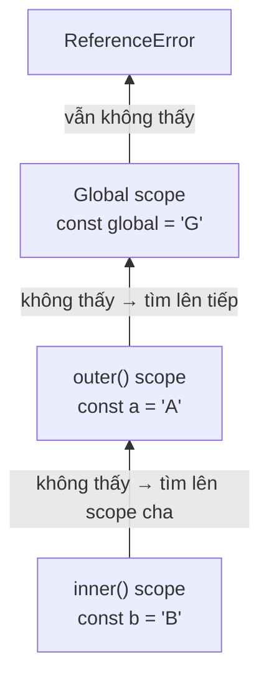

# Scope (Phạm vi biến)

**Scope** (phạm vi biến) là vùng trong code mà tại đó một biến có thể được nhìn thấy và sử dụng. Hiểu đơn giản, không phải biến nào cũng dùng được ở mọi nơi: có biến dùng được toàn chương trình (global), có biến chỉ dùng được trong một hàm hoặc một khối lệnh (block). Nắm vững scope giúp người mới biết biến "sống" ở đâu và tránh lỗi gọi nhầm biến không tồn tại.

---

## Mục lục

- [Vì sao closure & scope ra đời?](#vì-sao-closure--scope-ra-đời)
- [Scope là gì?](#scope-là-gì)
- [Global Scope](#global-scope)
- [Function Scope](#function-scope)
- [Block Scope](#block-scope)
- [Lexical Scope](#lexical-scope)
- [Scope Chain](#scope-chain)

---

## Vì sao closure & scope ra đời?

**Vấn đề:**

Khi viết code, mọi biến nằm chung một "rổ" toàn cục thì rất dễ **đụng độ
tên** và **làm bẩn global**. Hai đoạn code không liên quan vô tình dùng
cùng tên biến sẽ ghi đè lẫn nhau. Tệ hơn, không có cách nào "giấu" dữ
liệu nội bộ — ai cũng đọc/sửa được:

```js
// Cách làm cũ: tất cả nằm chung global
var count = 0; // ai cũng sửa được

function increment() {
  count++; // dễ bị code khác vô tình ghi đè
}

count = 999; // "tai nạn" — không có gì bảo vệ
```

**Giải pháp:**

**Scope** ra đời để kiểm soát "biến nào nhìn thấy ở đâu", giữ biến nằm
gọn trong phạm vi cần thiết. **Lexical scope** xác định phạm vi theo
*nơi viết code*. Từ đó sinh ra **closure**: một hàm "nhớ" được biến của
scope bên ngoài **kể cả sau khi scope đó đã kết thúc** — nhờ vậy ta tạo
được biến **private** (đóng gói dữ liệu):

```js
function createCounter() {
  let count = 0; // private — bên ngoài không chạm tới được

  return function () {
    count++;
    return count;
  };
}

const next = createCounter();
next(); // 1
next(); // 2 — count vẫn "sống" nhờ closure
```

:::tip[Dùng thực tế]

Closure & scope xuất hiện ở khắp nơi trong code thực tế:

- **Counter / state riêng**: giữ giá trị nội bộ mà bên ngoài không sửa được.
- **Factory function**: hàm tạo ra hàm có cấu hình/state riêng từng cái.
- **Debounce / throttle**: nhớ timer hoặc thời điểm gọi gần nhất giữa các lần chạy.
- **Callback & event handler**: giữ được context (biến cha) khi chạy sau, ví dụ trong `setTimeout` hay listener.

:::

---

## Scope là gì?

**Scope** là **phạm vi truy cập** của biến — vùng code mà biến có thể
được nhìn thấy và sử dụng.

JavaScript có 3 loại scope chính:

| Scope | Tạo bởi |
|-------|---------|
| Global | Ngoài mọi function và block |
| Function | Bên trong function (kể cả `var`) |
| Block | Bên trong `{}` (`let`/`const`) |

---

## Global Scope

Biến khai báo **ngoài mọi function/block** thuộc global scope, truy
cập được từ bất kỳ đâu.

```js
const APP_NAME = "MyApp"; // global

function show() {
  console.log(APP_NAME); // OK
}
```

:::warning[Cần lưu ý]

Trong trình duyệt, biến global tạo bằng `var` (hoặc khai báo không
từ khoá trong sloppy mode) sẽ trở thành property của `window`:

```js
var x = 10;
console.log(window.x); // 10 (browser, sloppy mode)
```

Với `let`/`const` thì **không**:

```js
let y = 20;
console.log(window.y); // undefined
```

Trong ES Module và strict mode, biến top-level **không** thuộc `window`/
`global` — đây là behavior chuẩn nên dùng.

:::

---

## Function Scope

Biến khai báo trong function **chỉ tồn tại trong function đó**.

```js
function test() {
  var x = 10;
  let y = 20;
  console.log(x, y); // OK
}

console.log(x); // ReferenceError
console.log(y); // ReferenceError
```

`var` luôn scope theo function — ngay cả trong block:

```js
function demo() {
  if (true) {
    var a = 1;
    let b = 2;
  }
  console.log(a); // 1 — var lọt ra ngoài if
  console.log(b); // ReferenceError — let bị scope vào if
}
```

---

## Block Scope

Block scope = trong cặp `{}` (`if`, `for`, `while`, hoặc đơn giản là
`{ ... }`).

```js
{
  let x = 10;
  const y = 20;
  console.log(x, y); // OK
}
console.log(x); // ReferenceError
```

Block scope rất quan trọng trong `for` loop:

```js
for (let i = 0; i < 3; i++) {
  setTimeout(() => console.log(i), 100);
}
// In ra: 0, 1, 2 (mỗi vòng có scope riêng)

for (var j = 0; j < 3; j++) {
  setTimeout(() => console.log(j), 100);
}
// In ra: 3, 3, 3 (j được share, đã là 3 khi setTimeout chạy)
```

:::info[Phân tích]

**Mỗi iteration `for (let i...)` tạo một binding mới của `i`** trong
một scope mới. Đây là behavior đặc biệt của `let` trong vòng lặp `for`,
giải quyết vấn đề kinh điển của `var` trong closure.

Tương đương ngầm:

```js
// for (let i = 0; i < 3; i++) ... thực ra là:
for (
  let _binding = 0;
  _binding < 3;
  _binding++
) {
  let i = _binding; // tạo mới mỗi vòng
  // ...
}
```

→ Hiểu cơ chế này là chìa khoá đáp đúng câu hỏi phỏng vấn về closure +
loop, một trong các topic kinh điển của JS.

:::

---

## Lexical Scope

**Lexical scope** (còn gọi là *static scope*) = scope được xác định bởi
**vị trí code khi viết**, không phải bởi **vị trí khi gọi**.

> Chữ **"lexical"** nghĩa là "thuộc về văn bản code". Tức là chỉ cần
> **nhìn vào nơi bạn viết** một function trong file — lồng bên trong
> function/block nào — là đã biết nó truy cập được những biến nào.
> Điều này được "chốt" ngay lúc viết code, và **không thay đổi** dù sau
> này bạn gọi function đó từ đâu.

```js
function outer() {
  const name = "An";

  function inner() {
    console.log(name); // truy cập được — "An"
  }

  return inner;
}

const fn = outer();
fn(); // "An" — vẫn truy cập được name
```

`inner` được **viết bên trong** `outer`, nên nó **luôn truy cập được**
biến của `outer`, kể cả khi gọi từ bên ngoài.

### Quyết định lúc viết, không phải lúc gọi

Điểm cốt lõi dễ nhầm: biến mà một function "nhìn thấy" phụ thuộc vào
**nơi nó được định nghĩa**, KHÔNG phải nơi nó được gọi.

```js
const message = "global";

function inner() {
  console.log(message); // luôn nhìn lên nơi inner ĐƯỢC VIẾT
}

function outer() {
  const message = "local trong outer";
  inner(); // gọi inner ở đây, nhưng...
}

outer(); // In ra "global", KHÔNG phải "local trong outer"
```

`inner` được viết ở top-level (cạnh biến `message = "global"`), nên dù
được **gọi bên trong** `outer`, nó vẫn lấy `message` ở nơi nó được viết
ra. Nếu JavaScript dùng *dynamic scope* (lấy biến theo nơi gọi) thì kết
quả sẽ là `"local trong outer"` — nhưng JS **không** làm vậy.

:::info[Lexical scope vs Dynamic scope]

| Tiêu chí | Lexical scope (JS dùng) | Dynamic scope |
|----------|-------------------------|---------------|
| Quyết định khi nào | Lúc **viết** code (static) | Lúc **chạy/gọi** hàm |
| Lấy biến từ đâu | Nơi hàm **được định nghĩa** | Nơi hàm **được gọi** |
| Đoán kết quả | Dễ — nhìn cấu trúc code | Khó — phải lần theo call stack |

Hầu hết ngôn ngữ hiện đại (JavaScript, Python, C...) dùng **lexical
scope** vì nó dễ đọc, dễ suy luận và an toàn hơn. Dynamic scope hiếm gặp
(vd Bash, Emacs Lisp cũ).

:::

Đây là nền tảng của **closure** (sẽ học sâu ở phần Functions): vì scope
được "chốt" theo vị trí viết, function con vẫn nhớ và truy cập được biến
của scope cha **kể cả khi scope cha đã kết thúc**.

---

## Scope Chain

Khi truy cập biến, JS tìm theo **chuỗi scope** từ trong ra ngoài:

```js
const global = "G";

function outer() {
  const a = "A";

  function inner() {
    const b = "B";
    console.log(b);      // inner scope
    console.log(a);      // outer scope
    console.log(global); // global scope
  }

  inner();
}

outer();
```

Thứ tự tìm kiếm: **inner → outer → ... → global**.

Nếu không tìm thấy, JS ném `ReferenceError`.



:::info[Phân tích]

Tại runtime, mỗi function call tạo một **Lexical Environment** chứa:

- **Environment Record**: bảng các biến của scope.
- **Outer reference**: liên kết tới scope cha (theo lexical).

Scope chain chính là chuỗi outer references này. Khi truy cập biến, JS
duyệt qua từng environment cho đến khi tìm thấy (hoặc tới global).

Hiểu cơ chế này giải thích được:

- Closure giữ biến sống dù function đã kết thúc.
- Memory leak khi closure giữ tham chiếu DOM.
- Performance: scope quá sâu → tìm biến chậm (V8 tối ưu nhưng vẫn có
  chi phí).

:::

:::tip[Mẹo]

**Quy tắc tổ chức scope**:

- Khai báo biến **càng gần nơi dùng càng tốt** (giữ scope nhỏ).
- Tránh global biến trừ hằng số.
- Trong ES Module, top-level đã không còn global — yên tâm dùng.
- Dùng IIFE hoặc block scope để cô lập code legacy:

```js
(function () {
  const internalState = {};
  // ...
})();
```

Trong code hiện đại với `let`/`const` + module, IIFE gần như không còn
cần thiết.

:::
