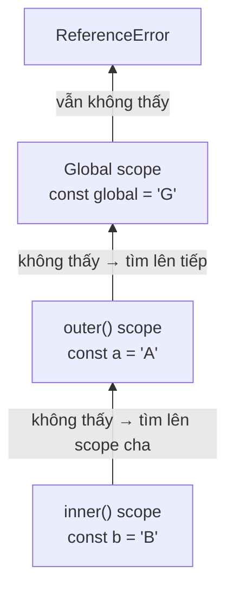

# Scope (Phạm vi biến)

**Scope** (phạm vi biến) là vùng trong code mà tại đó một biến có thể được nhìn thấy và sử dụng. Hiểu đơn giản, không phải biến nào cũng dùng được ở mọi nơi: có biến dùng được toàn chương trình (global), có biến chỉ dùng được trong một hàm hoặc một khối lệnh (block). Nắm vững scope giúp người mới biết biến "sống" ở đâu và tránh lỗi gọi nhầm biến không tồn tại.

[](pathname:///img/javascript/scope.webp)

---

:::note[Ghi nhớ nhanh]

- ⭐ **JS có 3 loại scope**: global (ngoài mọi hàm/block), function (`var`), và block (`let`/`const` trong `{}`) — `var` lọt ra ngoài block, `let`/`const` thì không.
- ⭐ **Lexical scope**: biến một hàm nhìn thấy được quyết định bởi *nơi hàm được viết*, KHÔNG phải nơi được gọi — nền tảng của closure.
- **Mỗi vòng `for (let i...)` tạo binding `i` mới** — giải quyết bug kinh điển của `var` trong closure (`var` in ra `3,3,3`, `let` in ra `0,1,2`).
- **Scope chain** — JS tìm biến từ trong ra ngoài (inner → outer → global), không thấy thì ném `ReferenceError`.
- **Đặt biến càng gần nơi dùng càng tốt**, tránh biến global (trừ hằng số); với `let`/`const` + module thì IIFE gần như không còn cần.

:::

---

## Mục lục

- [Vì sao closure & scope ra đời?](#vì-sao-closure--scope-ra-đời)
- [Scope là gì?](#scope-là-gì)
- [Global Scope](#global-scope)
- [Function Scope](#function-scope)
- [Block Scope](#block-scope)
- [Lexical Scope](#lexical-scope)
- [Scope Chain](#scope-chain)
- [Câu hỏi phỏng vấn](#câu-hỏi-phỏng-vấn)

---

## Vì sao closure & scope ra đời?

**Vấn đề:**

Khi viết code, mọi biến nằm chung một "rổ" toàn cục thì rất dễ **đụng độ
tên** và **làm bẩn global**. Hai đoạn code không liên quan vô tình dùng
cùng tên biến sẽ ghi đè lẫn nhau. Tệ hơn, không có cách nào "giấu" dữ
liệu nội bộ — ai cũng đọc/sửa được:

```js
// Cách làm cũ: tất cả nằm chung global
var count = 0; // ai cũng sửa được

function increment() {
  count++; // dễ bị code khác vô tình ghi đè
}

count = 999; // "tai nạn" — không có gì bảo vệ
```

**Giải pháp:**

**Scope** ra đời để kiểm soát "biến nào nhìn thấy ở đâu", giữ biến nằm
gọn trong phạm vi cần thiết. **Lexical scope** xác định phạm vi theo
*nơi viết code*. Từ đó sinh ra **closure**: một hàm "nhớ" được biến của
scope bên ngoài **kể cả sau khi scope đó đã kết thúc** — nhờ vậy ta tạo
được biến **private** (đóng gói dữ liệu):

```js
function createCounter() {
  let count = 0; // private — bên ngoài không chạm tới được

  return function () {
    count++;
    return count;
  };
}

const next = createCounter();
next(); // 1
next(); // 2 — count vẫn "sống" nhờ closure
```

:::tip[Dùng thực tế]

Closure & scope xuất hiện ở khắp nơi trong code thực tế:

- **Counter / state riêng**: giữ giá trị nội bộ mà bên ngoài không sửa được.
- **Factory function**: hàm tạo ra hàm có cấu hình/state riêng từng cái.
- **Debounce / throttle**: nhớ timer hoặc thời điểm gọi gần nhất giữa các lần chạy.
- **Callback & event handler**: giữ được context (biến cha) khi chạy sau, ví dụ trong `setTimeout` hay listener.

:::

---

## Scope là gì?

**Scope** là **phạm vi truy cập** của biến — vùng code mà biến có thể
được nhìn thấy và sử dụng.

JavaScript có 3 loại scope chính:

| Scope | Tạo bởi |
|-------|---------|
| Global | Ngoài mọi function và block |
| Function | Bên trong function (kể cả `var`) |
| Block | Bên trong `{}` (`let`/`const`) |

---

## Global Scope

Biến khai báo **ngoài mọi function/block** thuộc global scope, truy
cập được từ bất kỳ đâu.

```js
const APP_NAME = "MyApp"; // global

function show() {
  console.log(APP_NAME); // OK
}
```

:::warning[Cần lưu ý]

Trong trình duyệt, biến global tạo bằng `var` (hoặc khai báo không
từ khoá trong sloppy mode) sẽ trở thành property của `window`:

```js
var x = 10;
console.log(window.x); // 10 (browser, sloppy mode)
```

Với `let`/`const` thì **không**:

```js
let y = 20;
console.log(window.y); // undefined
```

Trong ES Module và strict mode, biến top-level **không** thuộc `window`/
`global` — đây là behavior chuẩn nên dùng.

:::

---

## Function Scope

Biến khai báo trong function **chỉ tồn tại trong function đó**.

```js
function test() {
  var x = 10;
  let y = 20;
  console.log(x, y); // OK
}

console.log(x); // ReferenceError
console.log(y); // ReferenceError
```

`var` luôn scope theo function — ngay cả trong block:

```js
function demo() {
  if (true) {
    var a = 1;
    let b = 2;
  }
  console.log(a); // 1 — var lọt ra ngoài if
  console.log(b); // ReferenceError — let bị scope vào if
}
```

---

## Block Scope

Block scope = trong cặp `{}` (`if`, `for`, `while`, hoặc đơn giản là
`{ ... }`).

```js
{
  let x = 10;
  const y = 20;
  console.log(x, y); // OK
}
console.log(x); // ReferenceError
```

Block scope rất quan trọng trong `for` loop:

```js
for (let i = 0; i < 3; i++) {
  setTimeout(() => console.log(i), 100);
}
// In ra: 0, 1, 2 (mỗi vòng có scope riêng)

for (var j = 0; j < 3; j++) {
  setTimeout(() => console.log(j), 100);
}
// In ra: 3, 3, 3 (j được share, đã là 3 khi setTimeout chạy)
```

:::info[Phân tích]

**Mỗi iteration `for (let i...)` tạo một binding mới của `i`** trong
một scope mới. Đây là behavior đặc biệt của `let` trong vòng lặp `for`,
giải quyết vấn đề kinh điển của `var` trong closure.

Tương đương ngầm:

```js
// for (let i = 0; i < 3; i++) ... thực ra là:
for (
  let _binding = 0;
  _binding < 3;
  _binding++
) {
  let i = _binding; // tạo mới mỗi vòng
  // ...
}
```

→ Hiểu cơ chế này là chìa khoá đáp đúng câu hỏi phỏng vấn về closure +
loop, một trong các topic kinh điển của JS.

:::

---

## Lexical Scope

**Lexical scope** (còn gọi là *static scope*) = scope được xác định bởi
**vị trí code khi viết**, không phải bởi **vị trí khi gọi**.

> Chữ **"lexical"** nghĩa là "thuộc về văn bản code". Tức là chỉ cần
> **nhìn vào nơi bạn viết** một function trong file — lồng bên trong
> function/block nào — là đã biết nó truy cập được những biến nào.
> Điều này được "chốt" ngay lúc viết code, và **không thay đổi** dù sau
> này bạn gọi function đó từ đâu.

```js
function outer() {
  const name = "An";

  function inner() {
    console.log(name); // truy cập được — "An"
  }

  return inner;
}

const fn = outer();
fn(); // "An" — vẫn truy cập được name
```

`inner` được **viết bên trong** `outer`, nên nó **luôn truy cập được**
biến của `outer`, kể cả khi gọi từ bên ngoài.

### Quyết định lúc viết, không phải lúc gọi

Điểm cốt lõi dễ nhầm: biến mà một function "nhìn thấy" phụ thuộc vào
**nơi nó được định nghĩa**, KHÔNG phải nơi nó được gọi.

```js
const message = "global";

function inner() {
  console.log(message); // luôn nhìn lên nơi inner ĐƯỢC VIẾT
}

function outer() {
  const message = "local trong outer";
  inner(); // gọi inner ở đây, nhưng...
}

outer(); // In ra "global", KHÔNG phải "local trong outer"
```

`inner` được viết ở top-level (cạnh biến `message = "global"`), nên dù
được **gọi bên trong** `outer`, nó vẫn lấy `message` ở nơi nó được viết
ra. Nếu JavaScript dùng *dynamic scope* (lấy biến theo nơi gọi) thì kết
quả sẽ là `"local trong outer"` — nhưng JS **không** làm vậy.

:::info[Lexical scope vs Dynamic scope]

| Tiêu chí | Lexical scope (JS dùng) | Dynamic scope |
|----------|-------------------------|---------------|
| Quyết định khi nào | Lúc **viết** code (static) | Lúc **chạy/gọi** hàm |
| Lấy biến từ đâu | Nơi hàm **được định nghĩa** | Nơi hàm **được gọi** |
| Đoán kết quả | Dễ — nhìn cấu trúc code | Khó — phải lần theo call stack |

Hầu hết ngôn ngữ hiện đại (JavaScript, Python, C...) dùng **lexical
scope** vì nó dễ đọc, dễ suy luận và an toàn hơn. Dynamic scope hiếm gặp
(vd Bash, Emacs Lisp cũ).

:::

Đây là nền tảng của **closure** (sẽ học sâu ở phần Functions): vì scope
được "chốt" theo vị trí viết, function con vẫn nhớ và truy cập được biến
của scope cha **kể cả khi scope cha đã kết thúc**.

---

## Scope Chain

Khi truy cập biến, JS tìm theo **chuỗi scope** từ trong ra ngoài:

```js
const global = "G";

function outer() {
  const a = "A";

  function inner() {
    const b = "B";
    console.log(b);      // inner scope
    console.log(a);      // outer scope
    console.log(global); // global scope
  }

  inner();
}

outer();
```

Thứ tự tìm kiếm: **inner → outer → ... → global**.

Nếu không tìm thấy, JS ném `ReferenceError`.



:::info[Phân tích]

Tại runtime, mỗi function call tạo một **Lexical Environment** chứa:

- **Environment Record**: bảng các biến của scope.
- **Outer reference**: liên kết tới scope cha (theo lexical).

Scope chain chính là chuỗi outer references này. Khi truy cập biến, JS
duyệt qua từng environment cho đến khi tìm thấy (hoặc tới global).

Hiểu cơ chế này giải thích được:

- Closure giữ biến sống dù function đã kết thúc.
- Memory leak khi closure giữ tham chiếu DOM.
- Performance: scope quá sâu → tìm biến chậm (V8 tối ưu nhưng vẫn có
  chi phí).

:::

:::tip[Mẹo]

**Quy tắc tổ chức scope**:

- Khai báo biến **càng gần nơi dùng càng tốt** (giữ scope nhỏ).
- Tránh global biến trừ hằng số.
- Trong ES Module, top-level đã không còn global — yên tâm dùng.
- Dùng IIFE hoặc block scope để cô lập code legacy:

```js
(function () {
  const internalState = {};
  // ...
})();
```

Trong code hiện đại với `let`/`const` + module, IIFE gần như không còn
cần thiết.

:::

---

## Câu hỏi phỏng vấn

Những câu thường gặp về chủ đề này. Tự trả lời trước, rồi bấm **Xem đáp án** để đối chiếu.

**1. `Scope` là gì? JavaScript có mấy loại scope và mỗi loại được tạo ra bởi cái gì?**

<details className="qa">
<summary>Xem đáp án</summary>

**Scope** là **phạm vi truy cập** của biến — vùng code mà tại đó biến có thể được nhìn thấy và sử dụng. Scope tồn tại để kiểm soát "biến nào nhìn thấy ở đâu", tránh đụng độ tên và làm bẩn global.

JavaScript có 3 loại scope chính:

| Scope | Tạo bởi | Ví dụ khai báo |
|-------|---------|----------------|
| Global | Ngoài mọi function và block | `const APP_NAME = "MyApp"` ở top-level |
| Function | Bên trong một function | `var`, `let`, `const` trong thân hàm |
| Block | Bên trong cặp `{}` (`if`, `for`, `while`, block trần) | chỉ `let` / `const` |

```js
const APP_NAME = "MyApp"; // global

function show() {
  var inFn = 1;           // function scope
  if (true) {
    let inBlock = 2;      // block scope
  }
  console.log(inBlock);   // ReferenceError
}
```

Điểm cần nhớ: `var` **không** tạo block scope — nó luôn thuộc về function gần nhất.

</details>

**2. `var`, `let` và `const` khác nhau thế nào về scope? Vì sao biến `var` khai báo bên trong `if` vẫn đọc được ở ngoài block đó?**

<details className="qa">
<summary>Xem đáp án</summary>

| | `var` | `let` / `const` |
|---|---|---|
| Phạm vi | **Function scope** | **Block scope** |
| Trong `if` / `for` | Lọt ra ngoài block | Bị giới hạn trong block |
| Khai báo lại cùng scope | Được | `SyntaxError` |
| Truy cập trước khai báo | `undefined` | `ReferenceError` (TDZ) |

```js
function demo() {
  if (true) {
    var a = 1;
    let b = 2;
  }
  console.log(a); // 1 — var lọt ra ngoài if
  console.log(b); // ReferenceError — let bị scope vào if
}
```

**Vì sao `var` lọt ra ngoài?** Vì `var` có từ ES1, khi JavaScript chưa có khái niệm block scope — đơn vị phạm vi nhỏ nhất lúc đó là **function**. Engine đăng ký `var a` vào môi trường của `demo()` chứ không phải của khối `if`, nên sau khi ra khỏi `if`, biến vẫn còn sống. ES6 thêm `let`/`const` để sửa đúng điểm này, và vì lý do tương thích ngược, hành vi của `var` được giữ nguyên.

</details>

**3. Giải thích `hoisting`. Vì sao truy cập biến `let` trước dòng khai báo lại ném `ReferenceError` thay vì cho `undefined`? `TDZ` (Temporal Dead Zone) là gì?**

<details className="qa">
<summary>Xem đáp án</summary>

**Hoisting** là việc engine **scan toàn scope và đăng ký mọi khai báo trước khi chạy code**. Mọi khai báo (`var`, `let`, `const`, `function`) đều được hoist — khác nhau ở **trạng thái khởi tạo**:

- `var` → khởi tạo sẵn `undefined`, đọc trước khai báo ra `undefined`.
- `let` / `const` → **uninitialized**, nằm trong TDZ.
- `function` declaration → gán sẵn cả body, gọi trước vẫn chạy.

**TDZ (Temporal Dead Zone)** là khoảng thời gian từ lúc vào scope cho tới lúc thực thi dòng khai báo. Trong khoảng đó biến **đã tồn tại nhưng chưa khởi tạo**, và mọi thao tác đọc/ghi vào nó đều ném `ReferenceError`.

```js
{
  // TDZ của x bắt đầu từ đây
  console.log(x); // ReferenceError: Cannot access 'x' before initialization
  let x = 10;     // TDZ kết thúc
  console.log(x); // 10
}
```

Đây là thiết kế **có chủ đích**: thay vì âm thầm trả về `undefined` như `var`, TDZ ép lỗi lộ ra ngay tại nơi viết sai thứ tự.

</details>

**4. `Lexical scope` (static scope) nghĩa là gì? Nếu một hàm được **viết** ở top-level nhưng được **gọi** bên trong một hàm khác, nó đọc biến ở đâu?**

<details className="qa">
<summary>Xem đáp án</summary>

**Lexical scope** (static scope) nghĩa là scope của một hàm được xác định bởi **vị trí code khi viết**, không phải vị trí khi gọi. Chữ "lexical" = "thuộc về văn bản code": chỉ cần nhìn hàm được viết lồng bên trong function/block nào là biết nó truy cập được biến nào — điều này được "chốt" ngay lúc viết và không đổi.

Hàm viết ở top-level sẽ **luôn đọc biến ở top-level**, bất kể được gọi ở đâu:

```js
const message = "global";

function inner() {
  console.log(message); // nhìn lên nơi inner ĐƯỢC VIẾT
}

function outer() {
  const message = "local trong outer";
  inner(); // gọi ở đây, nhưng...
}

outer(); // In ra "global", KHÔNG phải "local trong outer"
```

Nếu JS dùng *dynamic scope* (lấy biến theo nơi gọi) thì kết quả sẽ là `"local trong outer"` — nhưng JS **không** làm vậy. Chính đặc tính này là nền tảng của **closure**.

</details>

**5. So sánh `lexical scope` và `dynamic scope`. JavaScript dùng loại nào, và điều đó giúp gì cho việc suy luận code?**

<details className="qa">
<summary>Xem đáp án</summary>

| Tiêu chí | Lexical scope (JS dùng) | Dynamic scope |
|----------|-------------------------|---------------|
| Quyết định khi nào | Lúc **viết** code (static) | Lúc **chạy/gọi** hàm |
| Lấy biến từ đâu | Nơi hàm **được định nghĩa** | Nơi hàm **được gọi** |
| Đoán kết quả | Dễ — nhìn cấu trúc code | Khó — phải lần theo call stack |

**JavaScript dùng lexical scope.** Lợi ích cho việc suy luận code:

- **Đọc code là biết ngay**: chỉ cần nhìn cấu trúc lồng nhau trong file, không cần biết hàm sẽ được gọi từ đâu.
- **Engine tối ưu được**: vì scope chain cố định từ lúc parse, V8 có thể phân giải biến trước, không phải tra cứu động lúc chạy.
- **An toàn hơn**: một hàm không thể bị "đổi nghĩa" chỉ vì ai đó gọi nó từ một ngữ cảnh có biến trùng tên.
- **Tooling hoạt động được**: linter, "go to definition", refactor đổi tên, tree-shaking đều dựa trên tính tĩnh này.

Hầu hết ngôn ngữ hiện đại (JavaScript, Python, C...) dùng lexical scope; dynamic scope hiếm gặp (Bash, Emacs Lisp cũ). Lưu ý: `this` trong JS lại là ngoại lệ — nó được quyết định theo cách gọi, gần với dynamic hơn.

</details>

**6. Mô tả `scope chain`: khi truy cập một biến, engine tìm theo thứ tự nào và chuyện gì xảy ra khi tìm hết chuỗi mà vẫn không thấy?**

<details className="qa">
<summary>Xem đáp án</summary>

Khi truy cập một biến, JS tìm theo **chuỗi scope từ trong ra ngoài**: **inner → outer → ... → global**. Tìm thấy ở đâu thì dừng ở đó (nên biến gần nhất "che" biến cùng tên ở ngoài).

```js
const global = "G";

function outer() {
  const a = "A";

  function inner() {
    const b = "B";
    console.log(b);      // thấy ngay ở inner scope
    console.log(a);      // không có ở inner → lên outer scope
    console.log(global); // lên tiếp tới global scope
  }

  inner();
}

outer();
```

Nếu duyệt hết chuỗi mà vẫn không thấy, JS ném **`ReferenceError`**.

Về mặt runtime, mỗi lần gọi hàm engine tạo một **Lexical Environment** gồm bảng biến của scope đó và một **outer reference** trỏ tới scope cha (theo lexical, tức nơi hàm được viết). Scope chain chính là chuỗi outer reference này. Lưu ý chiều tìm kiếm chỉ đi **một hướng**: scope trong nhìn ra được scope ngoài, còn scope ngoài không nhìn vào trong được.

</details>

**7. Đoán output: `for (var i = 0; i < 3; i++) setTimeout(() => console.log(i), 100)` in ra gì? Đổi `var` thành `let` thì in ra gì? Giải thích cơ chế đằng sau sự khác biệt.**

<details className="qa">
<summary>Xem đáp án</summary>

```js
for (var j = 0; j < 3; j++) {
  setTimeout(() => console.log(j), 100);
}
// In ra: 3, 3, 3

for (let i = 0; i < 3; i++) {
  setTimeout(() => console.log(i), 100);
}
// In ra: 0, 1, 2
```

**Với `var`:** chỉ có **một biến `j` duy nhất** ở function scope. Vòng lặp chạy xong tức thì (callback `setTimeout` phải chờ tới khi call stack rỗng), lúc đó `j` đã là `3`. Cả ba closure cùng đóng trên **một binding**, nên đều đọc ra `3`.

**Với `let`:** **mỗi iteration tạo một binding `i` mới** trong một scope riêng. Mỗi callback đóng trên binding của chính vòng đó.

Tương đương ngầm:

```js
// for (let i = 0; i < 3; i++) ... thực ra là:
for (let _binding = 0; _binding < 3; _binding++) {
  let i = _binding; // tạo mới mỗi vòng
  // ...
}
```

Đây là hành vi đặc biệt của `let` trong vòng `for`, sinh ra chính để giải quyết bug kinh điển này.

</details>

**8. Nếu bắt buộc phải dùng `var` trong vòng lặp trên mà vẫn muốn in ra `0, 1, 2`, bạn sửa bằng những cách nào (`IIFE`, tham số thứ ba của `setTimeout`, hàm nhận tham số...)?**

<details className="qa">
<summary>Xem đáp án</summary>

Mấu chốt: phải **copy giá trị `i` của từng vòng vào một scope riêng**.

**Cách 1 — IIFE** (kinh điển thời trước ES6): mỗi vòng tạo một function scope mới.

```js
for (var i = 0; i < 3; i++) {
  (function (n) {
    setTimeout(() => console.log(n), 100);
  })(i);
}
// 0, 1, 2
```

**Cách 2 — hàm nhận tham số** (bản tách rời, dễ đọc hơn IIFE):

```js
function schedule(n) {
  setTimeout(() => console.log(n), 100);
}
for (var i = 0; i < 3; i++) schedule(i);
```

**Cách 3 — tham số thứ ba trở đi của `setTimeout`**: các tham số sau `delay` được truyền vào callback.

```js
for (var i = 0; i < 3; i++) {
  setTimeout((n) => console.log(n), 100, i);
}
```

Cả ba đều dựa trên cùng nguyên lý: **truyền `i` làm tham số** để tạo một biến mới, độc lập với `i` dùng chung. Trong code hiện đại thì chỉ cần đổi `var` thành `let`.

</details>

**9. `Closure` là gì? Viết hàm `createCounter` giữ biến `count` private, rồi giải thích vì sao `count` không bị thu hồi sau khi hàm cha đã return.**

<details className="qa">
<summary>Xem đáp án</summary>

**Closure** là một hàm "nhớ" được biến của scope bên ngoài nơi nó được viết, **kể cả sau khi scope đó đã kết thúc**.

```js
function createCounter() {
  let count = 0; // private — bên ngoài không chạm tới được

  return function () {
    count++;
    return count;
  };
}

const next = createCounter();
next(); // 1
next(); // 2 — count vẫn "sống" nhờ closure
```

**Vì sao `count` không bị thu hồi?** Vì garbage collector chỉ dọn những gì **không còn ai tham chiếu tới**. Khi `createCounter()` chạy, engine tạo một Lexical Environment chứa `count`. Hàm con được trả về giữ một **outer reference** tới môi trường đó. Sau khi `createCounter` return, call stack đã pop nhưng môi trường kia vẫn **đang được hàm con trỏ tới**, nên nó không bị thu hồi — chỉ khi biến `next` không còn tham chiếu nào thì cả cụm mới được dọn.

Nhờ vậy ta có biến **private** thật sự: `count` chỉ thay đổi qua hàm được trả về.

</details>

**10. Closure giữ **giá trị** hay giữ **tham chiếu** tới biến? Điều đó ảnh hưởng ra sao khi nhiều closure cùng đóng trên một biến?**

<details className="qa">
<summary>Xem đáp án</summary>

Closure giữ **tham chiếu tới biến (binding)**, không phải bản sao giá trị tại thời điểm hàm được tạo. Vì vậy closure luôn đọc ra **giá trị mới nhất** của biến đó.

```js
let x = 1;
const show = () => console.log(x);
x = 99;
show(); // 99 — không phải 1
```

**Khi nhiều closure cùng đóng trên một biến**, chúng chia sẻ cùng một binding — sửa ở một chỗ thì chỗ kia thấy ngay:

```js
function makePair() {
  let count = 0;
  return {
    inc: () => ++count,
    get: () => count,
  };
}

const c = makePair();
c.inc();
c.inc();
c.get(); // 2 — inc và get dùng chung một count
```

Đây vừa là **tính năng** (làm được module pattern, state dùng chung), vừa là **cái bẫy** — chính là nguyên nhân của `3, 3, 3` trong vòng lặp `var`: ba callback cùng đóng trên một binding `j`. Muốn mỗi closure có bản riêng thì phải **tạo binding mới** (dùng `let` trong `for`, hoặc truyền qua tham số hàm).

</details>

**11. Trong trình duyệt, vì sao `var x = 1` ở top-level tạo ra `window.x` còn `let y = 1` thì không? Trong ES Module và strict mode thì behavior khác gì?**

<details className="qa">
<summary>Xem đáp án</summary>

```js
var x = 10;
console.log(window.x); // 10 (browser, script thường)

let y = 20;
console.log(window.y); // undefined
```

Lý do: ở top-level của một script trong trình duyệt, môi trường toàn cục có **hai phần**. `var` và `function` declaration được ghi vào **object environment record** — chính là object `window`, nên chúng thành property của `window`. Còn `let`, `const`, `class` được ghi vào một **declarative record** riêng (thường gọi là *global declarative environment*) — vẫn là biến toàn cục, truy cập được ở mọi nơi, nhưng **không gắn vào `window`**. ES6 cố ý thiết kế vậy để ngừng làm bẩn object global.

**Trong ES Module** (`<script type="module">` hoặc file `.mjs`): mọi biến top-level đều thuộc **module scope**, kể cả `var` — không có gì lọt ra `window`. Module cũng luôn chạy ở **strict mode**, nên không thể tạo biến global ngầm bằng cách gán vào tên chưa khai báo (`z = 1` sẽ ném `ReferenceError` thay vì âm thầm tạo `window.z`). Đây là behavior chuẩn nên dùng.

</details>

**12. Mỗi lần gọi hàm, engine tạo ra một `Lexical Environment` gồm những thành phần nào? `Environment Record` và outer reference liên quan gì tới closure?**

<details className="qa">
<summary>Xem đáp án</summary>

Mỗi function call tạo một **Lexical Environment** gồm hai phần:

- **Environment Record**: bảng lưu các biến/tham số/hàm được khai báo trong scope đó (tên → giá trị).
- **Outer reference**: con trỏ tới Lexical Environment của **scope cha theo lexical** — tức nơi hàm được *viết*, không phải nơi được *gọi*.

**Scope chain chính là chuỗi outer reference này.** Khi truy cập một biến, engine tra trong Environment Record hiện tại; không thấy thì đi theo outer reference lên tiếp, cho tới global — hết chuỗi vẫn không thấy thì ném `ReferenceError`.

**Liên quan tới closure:** khi một hàm con được trả ra ngoài, nó mang theo outer reference trỏ tới Environment Record của hàm cha. Chừng nào hàm con còn sống thì record đó còn được tham chiếu, nên **không bị garbage collector thu hồi** — đó chính là cơ chế vật lý của closure.

Hiểu mô hình này giải thích được cả ba chuyện: closure giữ biến sống, memory leak khi closure giữ tham chiếu DOM, và chi phí khi scope lồng quá sâu.

</details>

**13. Closure có thể gây `memory leak` trong tình huống nào? Cho ví dụ với DOM node hoặc event listener và cách phòng tránh.**

<details className="qa">
<summary>Xem đáp án</summary>

Closure gây leak khi nó **giữ tham chiếu tới dữ liệu lớn hoặc DOM node lâu hơn mức cần thiết**, khiến garbage collector không dọn được.

```js
function setup() {
  const bigData = new Array(1_000_000).fill("x");
  const el = document.getElementById("btn");

  el.addEventListener("click", () => {
    console.log(el.id, bigData.length); // giữ cả el lẫn bigData sống mãi
  });
}
```

Hai vấn đề: (1) listener chưa gỡ nên closure còn sống; (2) closure tham chiếu `el`, nên dù node bị xoá khỏi DOM nó vẫn nằm trong bộ nhớ (*detached DOM node*) — kéo theo `bigData`.

Cách phòng tránh:

- **Gỡ listener** khi không dùng nữa: `removeEventListener`, hoặc `{ once: true }`, hoặc `AbortController` với `{ signal }`. Trong React thì trả hàm cleanup từ `useEffect`.
- **Chỉ đóng trên thứ thực sự cần**: lấy `el.id` ra biến riêng thay vì giữ cả node; giải phóng dữ liệu lớn (`bigData = null`) khi xong.
- **Dùng `WeakMap`/`WeakRef`** khi cần gắn dữ liệu kèm theo DOM node.
- Kiểm tra bằng tab **Memory** của DevTools: chụp heap snapshot và tìm "Detached" node.

</details>

**14. Kể vài ứng dụng thực tế của closure: `debounce`/`throttle`, `factory function`, `module pattern`, `memoize` — mỗi cái closure giữ lại cái gì?**

<details className="qa">
<summary>Xem đáp án</summary>

| Ứng dụng | Closure giữ lại gì |
|---|---|
| `debounce` | `timerId` của lần hẹn giờ gần nhất, để huỷ và đặt lại |
| `throttle` | Mốc **thời gian gọi gần nhất** (hoặc cờ đang khoá) |
| Factory function | **Cấu hình/state riêng** của từng instance được tạo ra |
| Module pattern | Các biến/hàm **private**, chỉ lộ ra API công khai |
| `memoize` | **Cache** kết quả đã tính theo tham số |

```js
function debounce(fn, delay) {
  let timerId; // closure giữ biến này qua các lần gọi
  return (...args) => {
    clearTimeout(timerId);
    timerId = setTimeout(() => fn(...args), delay);
  };
}

function memoize(fn) {
  const cache = new Map(); // closure giữ cache
  return (n) => {
    if (!cache.has(n)) cache.set(n, fn(n));
    return cache.get(n);
  };
}
```

Điểm chung: tất cả đều cần **state tồn tại giữa các lần gọi** nhưng **không muốn để lộ ra global**. Closure là công cụ tự nhiên nhất cho việc đó — cũng chính là nền tảng của event handler, callback và hooks trong React.

</details>

**15. Với `let`/`const` và ES Module ngày nay, `IIFE` còn cần thiết không? Trước đây nó được dùng để giải quyết vấn đề gì?**

<details className="qa">
<summary>Xem đáp án</summary>

**Trước đây** JS chỉ có `var` (function scope) và chưa có module. Mọi file `<script>` đều đổ biến vào cùng một global, nên rất dễ đụng độ tên và làm bẩn `window`. **IIFE** (Immediately Invoked Function Expression) là cách duy nhất tạo ra một scope riêng để cô lập code:

```js
(function () {
  const internalState = {};
  // ...
})();
```

Nó giải quyết ba việc: tạo scope riêng, giấu biến private, và tránh làm bẩn global.

**Ngày nay** cả ba việc đó đã có giải pháp tốt hơn:

- `let`/`const` cho **block scope** — chỉ cần `{ ... }` là đủ cô lập.
- **ES Module** có scope riêng theo file; muốn lộ ra thì phải `export`.
- Bundler và strict mode xử lý phần còn lại.

Nên **IIFE gần như không còn cần thiết** trong code mới. Nó vẫn còn chỗ dùng: cô lập code legacy, viết script chèn trực tiếp vào trang, hoặc `(async () => { ... })()` khi cần `await` ở nơi chưa hỗ trợ top-level await. Ngoài ra, đọc hiểu IIFE vẫn quan trọng vì bundler và thư viện cũ đầy pattern này.

</details>

**16. Đặt biến ở scope càng nhỏ càng tốt mang lại lợi ích gì? Vì sao biến global bị coi là mùi code xấu (trừ hằng số)?**

<details className="qa">
<summary>Xem đáp án</summary>

**Lợi ích của scope nhỏ** (khai báo biến càng gần nơi dùng càng tốt):

- **Dễ đọc**: người đọc chỉ cần quét vài dòng là biết biến được dùng ở đâu, gán ở đâu.
- **Dễ suy luận và debug**: số nơi có thể sửa biến ít đi, nên lỗi dễ khoanh vùng.
- **Dễ refactor**: tách hàm, đổi tên, xoá code chết đều an toàn hơn.
- **Tốt cho bộ nhớ**: biến hết scope là được thu hồi, không sống dai vô ích.

**Vì sao global là mùi code xấu:**

- **Đụng độ tên**: hai đoạn code không liên quan vô tình dùng cùng tên sẽ ghi đè nhau.
- **Không kiểm soát được ai sửa**: `count = 999` từ bất kỳ đâu cũng phá được state, không có gì bảo vệ.
- **Khó test**: state toàn cục rò rỉ giữa các test case, kết quả phụ thuộc thứ tự chạy.
- **Coupling ngầm**: các module phụ thuộc nhau qua biến global thay vì qua tham số/`import` rõ ràng.

**Ngoại lệ**: hằng số cấu hình (`const MAX_RETRIES`, `API_URL`) — bất biến, không mang state, nên an toàn. Với ES Module thì top-level vốn đã không còn là global, cứ `export` thứ cần chia sẻ là đủ.

</details>
