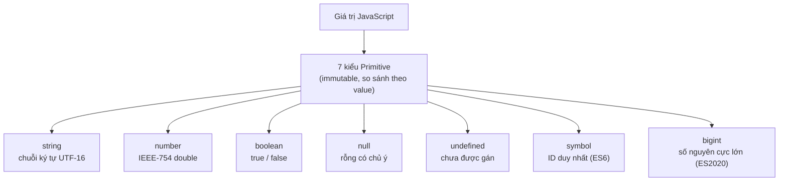

# Primitive Types

Trong JavaScript, **primitive** (kiểu nguyên thuỷ) là những kiểu dữ liệu cơ bản nhất, lưu một giá trị đơn giản duy nhất chứ không phải một tập hợp các giá trị. JavaScript có 7 kiểu nguyên thuỷ: `string` (chuỗi), `number` (số), `boolean` (đúng/sai), `null`, `undefined`, `symbol` và `bigint`. Điểm quan trọng là giá trị nguyên thuỷ là bất biến (immutable) — bạn không thể thay đổi chính giá trị đó, mà chỉ có thể gán một giá trị mới cho biến.

[](pathname:///img/javascript/primitive.webp)

---

:::note[Ghi nhớ nhanh]

- ⭐ **JS có 7 kiểu primitive** — `string`, `number`, `boolean`, `null`, `undefined`, `symbol`, `bigint`, đều **immutable** và so sánh theo giá trị.
- ⭐ **`number` dùng IEEE-754** — nên `0.1 + 0.2 !== 0.3`; cần chính xác thì dùng integer (cents) hoặc `bigint`.
- **`symbol`** tạo key duy nhất, không đụng key khác — tiện làm property riêng tư và `Symbol.iterator`.
- **`bigint`** (suffix `n`) cho số nguyên cực lớn vượt `Number.MAX_SAFE_INTEGER`, không trộn trực tiếp với `number`.
- **`null` vs `undefined`** — `undefined` là "chưa gán", `null` là "cố ý rỗng"; nên nhất quán một quy ước.
- **8 giá trị falsy** — `false`, `0`, `-0`, `0n`, `""`, `null`, `undefined`, `NaN`; còn lại đều truthy (kể cả `"0"`, `[]`, `{}`).

:::

---

## Mục lục

- [Vì sao cần hiểu kiểu primitive?](#vì-sao-cần-hiểu-kiểu-primitive)
- [Tổng quan](#tổng-quan)
- [String](#string)
- [Number](#number)
- [Boolean](#boolean)
- [null và undefined](#null-và-undefined)
- [Symbol](#symbol)
- [BigInt](#bigint)
- [Câu hỏi phỏng vấn](#câu-hỏi-phỏng-vấn)

---

## Vì sao cần hiểu kiểu primitive?

Mỗi kiểu primitive sinh ra để giải một bài toán riêng. Nắm rõ chúng giúp bạn tránh những lỗi khó chịu khi đặt key cho object, tính toán số lớn, hay phân biệt "chưa có" với "cố ý rỗng".

**Vấn đề:**

```js
// 1. Key string dễ ĐỤNG ĐỘ — library và bạn cùng dùng "id"
const user = { id: 1 };
user.id = "private-token"; // ghi đè mất id gốc của library!

// 2. Số nguyên lớn VƯỢT giới hạn an toàn của Number → sai số
const bigId = 9007199254740993;     // id từ DB
bigId === 9007199254740992;         // true (!) — mất 1 đơn vị
Number.MAX_SAFE_INTEGER;            // 9007199254740991

// 3. Không phân biệt được "chưa load" và "không có"
let user2;          // undefined hay null? code khác đọc sẽ đoán mò
```

**Giải pháp:**

```js
// 1. Symbol (ES6) — key DUY NHẤT, không bao giờ đụng key khác
const ID = Symbol("id");
const user = { [ID]: 1 };
user[ID]; // 1 — an toàn, không ai vô tình ghi đè

// 2. BigInt (ES2020) — số nguyên lớn KHÔNG sai số
const bigId = 9007199254740993n;    // suffix n
bigId === 9007199254740992n;        // false — chính xác

// 3. null vs undefined — quy ước rõ ràng
let user2 = null;   // CỐ Ý rỗng: "đã check, không có user"
let user3;          // undefined: "chưa gán / chưa load"
```

:::tip[Dùng thực tế]

- **Symbol làm key riêng tư**: thêm metadata vào object của người khác mà không sợ trùng tên hay bị `for...in`/`Object.keys` lộ ra.
- **Symbol.iterator**: cho object của bạn chạy được với `for...of`, spread `[...obj]`, destructuring.
- **BigInt cho id/tài chính**: id Twitter/Discord (snowflake 64-bit), timestamp nanosecond, hoặc tính tiền tệ ở đơn vị nhỏ nhất cần độ chính xác tuyệt đối.
- **Check null/undefined trước khi dùng**: dùng `value == null` (bắt cả hai) hoặc `value ?? default` để xử lý an toàn dữ liệu từ API.

:::

---

## Tổng quan

JavaScript có **7 kiểu primitive**:

| Kiểu | Giá trị |
|------|---------|
| `string` | Chuỗi ký tự |
| `number` | Số (int + float, IEEE-754) |
| `boolean` | `true` / `false` |
| `null` | Rỗng có chủ ý |
| `undefined` | Chưa được gán |
| `symbol` | ID duy nhất |
| `bigint` | Số nguyên cực lớn |

Primitive là **immutable** — không sửa được, chỉ thay bằng giá trị mới.

Sơ đồ dưới đây tóm tắt 7 kiểu primitive và vai trò của từng kiểu:



---

## String

```js
const a = "double quotes";
const b = 'single quotes';
const c = `template literal với ${a}`;

c.length;       // số ký tự
c.toUpperCase();
c.includes("quote");
c.split(" ");
```

Template literal hỗ trợ multi-line + interpolation:

```js
const name = "An";
const html = `
  <div>
    <h1>${name}</h1>
  </div>
`;
```

:::info[Phân tích]

JS string là **immutable UTF-16**. Một số hệ quả quan trọng:

```js
"😀".length; // 2 — emoji chiếm 2 code unit UTF-16
"😀"[0];     // "\uD83D" (surrogate pair, vô nghĩa)

[..."😀"].length;        // 1 — iterator hiểu code point
"😀".codePointAt(0);     // 128512
```

Khi xử lý string có emoji, ký tự đặc biệt, ngôn ngữ phức tạp:

- **Đếm số ký tự "thật"**: dùng `[...str].length` hoặc `Intl.Segmenter`.
- **Cắt string**: tránh `slice`/`substring` ở giữa surrogate pair.
- **So sánh**: dùng `localeCompare` với locale phù hợp.

:::

---

## Number

```js
const dec = 42;
const float = 3.14;
const hex = 0xff;       // 255
const bin = 0b1010;     // 10
const oct = 0o777;      // 511
const exp = 1.5e3;      // 1500
```

Giá trị đặc biệt:

```js
Infinity;
-Infinity;
NaN;            // Not-a-Number

Number.isFinite(42);    // true
Number.isNaN(NaN);      // true
Number.MAX_SAFE_INTEGER; // 2^53 - 1
```

:::warning[Cần lưu ý]

JS dùng **IEEE-754 double precision** cho mọi số → không chính xác tuyệt
đối với số thập phân:

```js
0.1 + 0.2;              // 0.30000000000000004
0.1 + 0.2 === 0.3;      // false
```

Khi cần chính xác (tiền tệ, đo lường):

- Dùng **integer (cents)** thay vì float (`$1.00` → `100` cents).
- Hoặc thư viện như **decimal.js**, **big.js**.

```js
// Sai
const total = price * 0.1; // có thể sai số

// Đúng
const totalCents = Math.round(priceCents * 0.1);
```

:::

---

## Boolean

```js
const yes = true;
const no = false;

Boolean(1);    // true
Boolean("");   // false
!!"hello";     // true (idiom convert sang boolean)
```

**Falsy values** (8 cái): `false`, `0`, `-0`, `0n`, `""`, `null`,
`undefined`, `NaN`. Mọi thứ khác là truthy — kể cả `"0"`, `[]`, `{}`.

---

## null và undefined

```js
let a;            // a = undefined (mặc định)
let b = null;     // null — chủ ý gán

typeof undefined; // "undefined"
typeof null;      // "object" (bug lịch sử của JS)

null == undefined;  // true (loose equality)
null === undefined; // false
```

:::info[Phân tích]

**Quy ước thực dụng**:

- `undefined`: dùng cho **giá trị mặc định** (biến chưa gán, hàm không
  return, property không tồn tại). **Không nên gán thủ công**.
- `null`: dùng khi **chủ ý gán** một giá trị "rỗng" (vd biến reset, API
  trả về "không có").

```js
function find(id) {
  // ...
  return null; // chủ ý: "không tìm thấy"
}

let user; // undefined — chưa load
user = await fetchUser();
```

Khi viết API/library, **nhất quán** chỉ dùng một trong hai cho ý nghĩa
"rỗng" — đừng trộn lẫn (gây nhầm khi check).

:::

---

## Symbol

`Symbol` (ES6) tạo **identifier duy nhất** — hai symbol khác nhau dù
cùng description:

```js
const a = Symbol("id");
const b = Symbol("id");
a === b; // false

const KEY = Symbol("user.private");
const user = { name: "An", [KEY]: "secret" };
user[KEY]; // "secret"
```

Symbol thường dùng để:

- Tạo **property không trùng** với key của library/user.
- Định nghĩa **well-known symbol** (`Symbol.iterator`, `Symbol.asyncIterator`,
  `Symbol.toPrimitive`...).

:::tip[Mẹo]

Pattern phổ biến — implement iterator protocol:

```js
class Range {
  constructor(start, end) { this.start = start; this.end = end; }

  [Symbol.iterator]() {
    let i = this.start;
    return {
      next: () => i <= this.end
        ? { value: i++, done: false }
        : { value: undefined, done: true },
    };
  }
}

for (const n of new Range(1, 5)) console.log(n); // 1, 2, 3, 4, 5
```

`Symbol.iterator` là cách JS kết nối object với `for...of`, spread, destructuring.

:::

---

## BigInt

`BigInt` (ES2020) — số nguyên cực lớn, không bị giới hạn 2^53.

```js
const big = 9007199254740993n;       // suffix n
const fromNumber = BigInt(10);
const fromString = BigInt("12345678901234567890");

big + 1n;        // OK
big + 1;         // TypeError — không trộn với number
Number(big);     // convert tường minh
```

:::warning[Cần lưu ý]

**BigInt và Number không thao tác trực tiếp** — phải convert tường minh:

```js
const a = 10n;
const b = 5;

a + b;           // TypeError
a + BigInt(b);   // 15n
Number(a) + b;   // 15
```

BigInt **không có thập phân** — `10n / 3n === 3n` (cắt phần dư).

Performance: BigInt **chậm hơn** Number đáng kể vì không dùng được CPU
register trực tiếp. Chỉ dùng khi thực sự cần (crypto, ID khổng lồ, timestamp
nanosecond...).

:::

---

## Câu hỏi phỏng vấn

Những câu thường gặp về chủ đề này. Tự trả lời trước, rồi bấm **Xem đáp án** để đối chiếu.

**1. JavaScript có mấy kiểu `primitive`? Kể đủ và nêu điểm chung của chúng.**

<details className="qa">
<summary>Xem đáp án</summary>

JavaScript có **7 kiểu primitive**:

| Kiểu | Giá trị |
|------|---------|
| `string` | Chuỗi ký tự (UTF-16) |
| `number` | Số nguyên + thực, theo IEEE-754 |
| `boolean` | `true` / `false` |
| `null` | Rỗng có chủ ý |
| `undefined` | Chưa được gán |
| `symbol` | ID duy nhất (ES6) |
| `bigint` | Số nguyên cực lớn (ES2020) |

Điểm chung của chúng:

- **Immutable** — không sửa được chính giá trị, chỉ gán giá trị mới cho biến.
- **So sánh theo giá trị**: `"a" === "a"` là `true` (khác object, so theo tham chiếu).
- **Không phải object** — không có property riêng (trừ `null`/`undefined`, các kiểu còn lại mượn method qua wrapper object tạm thời).
- Được lưu trực tiếp trong biến, sao chép khi gán và khi truyền vào hàm.

Mọi thứ còn lại trong JS (`object`, `array`, `function`, `Date`, `Map`...) đều là **object**.

</details>

**2. Nói primitive là `immutable` nghĩa là gì? Vì sao `str[0] = "X"` không làm đổi chuỗi mà cũng không báo lỗi ở sloppy mode?**

<details className="qa">
<summary>Xem đáp án</summary>

**Immutable** nghĩa là bản thân **giá trị** không thể bị sửa đổi. Các method của string đều **trả về chuỗi mới**, không đụng tới chuỗi gốc:

```js
let s = "hello";
s.toUpperCase(); // "HELLO" — giá trị mới
s;               // "hello" — không đổi
s = "world";     // đây là gán lại BIẾN, không phải sửa giá trị cũ
```

Về `str[0] = "X"`:

```js
let str = "hello";
str[0] = "X";
console.log(str); // "hello" — không đổi
```

Khi gán vào `str[0]`, engine **autobox** `str` thành một object `String` **tạm thời**, thực hiện phép gán trên object tạm đó rồi vứt đi ngay. Chuỗi gốc không hề bị ảnh hưởng.

Còn chuyện không báo lỗi: các index của string là property **read-only**. Ở **sloppy mode**, gán vào property read-only **thất bại trong im lặng**; ở **strict mode** (và trong ES Module) thì ném `TypeError`. Muốn đổi ký tự, phải tạo chuỗi mới: `"X" + str.slice(1)`.

</details>

**3. So sánh primitive và object về cách lưu trữ và cách truyền vào hàm (`pass by value` với `pass by reference`). Cho ví dụ chứng minh.**

<details className="qa">
<summary>Xem đáp án</summary>

| | Primitive | Object |
|---|---|---|
| Biến chứa gì | **Chính giá trị** | **Tham chiếu** tới vùng nhớ chứa object |
| Gán `b = a` | Copy giá trị — hai biến độc lập | Copy tham chiếu — hai biến trỏ cùng một object |
| So sánh `===` | Theo giá trị | Theo tham chiếu (cùng một object hay không) |

```js
let a = 1;
let b = a;
b = 2;
console.log(a); // 1 — độc lập

const o1 = { n: 1 };
const o2 = o1;
o2.n = 2;
console.log(o1.n); // 2 — chung một object

console.log({ n: 1 } === { n: 1 }); // false — hai object khác nhau
```

**Về truyền vào hàm:** JavaScript **luôn là pass by value**. Với object, cái được copy vào tham số là **giá trị của tham chiếu** — nên hàm sửa được nội dung bên trong, nhưng **gán lại** tham số thì không ảnh hưởng biến bên ngoài:

```js
function f(obj) {
  obj.n = 99;        // ảnh hưởng ra ngoài
  obj = { n: 0 };    // KHÔNG ảnh hưởng — chỉ đổi biến cục bộ
}
const o = { n: 1 };
f(o);
console.log(o.n); // 99
```

Cơ chế này thường được gọi là **pass by sharing**.

</details>

**4. `typeof NaN` trả về gì? Vì sao? `NaN === NaN` cho kết quả gì, và cách kiểm tra `NaN` đúng chuẩn là gì?**

<details className="qa">
<summary>Xem đáp án</summary>

```js
typeof NaN;   // "number"
NaN === NaN;  // false
```

**`typeof NaN` là `"number"`** — nghe nghịch lý nhưng đúng: `NaN` (Not-a-Number) là một **giá trị đặc biệt thuộc kiểu number** theo chuẩn IEEE-754, dùng để biểu diễn kết quả của một phép toán số không cho ra số hợp lệ (`0/0`, `Math.sqrt(-1)`, `Number("abc")`). Nó nói "phép tính số này thất bại", chứ không nói "đây không phải kiểu số".

**`NaN === NaN` là `false`** vì IEEE-754 quy định `NaN` **không bằng bất cứ giá trị nào, kể cả chính nó** — hai phép tính hỏng khác nhau thì không có lý do gì để coi là bằng nhau. `NaN` là giá trị duy nhất trong JS có tính chất này.

Cách kiểm tra đúng chuẩn:

```js
Number.isNaN(x);   // chuẩn nhất — không ép kiểu
Object.is(x, NaN); // cũng đúng
x !== x;           // trick cũ, vẫn chính xác

isNaN(x);          // TRÁNH — ép kiểu trước khi kiểm tra
```

</details>

**5. Phân biệt `isNaN()` toàn cục với `Number.isNaN()`. Vì sao `isNaN("foo")` trả về `true`?**

<details className="qa">
<summary>Xem đáp án</summary>

| | `isNaN(x)` (toàn cục) | `Number.isNaN(x)` (ES6) |
|---|---|---|
| Cách hoạt động | **Ép `x` sang number trước**, rồi mới kiểm tra | Kiểm tra trực tiếp: `x` có đúng là giá trị `NaN` không |
| Trả về `true` khi | `x` không chuyển được sang số hợp lệ | Chỉ khi `x` **chính là** `NaN` |
| Nên dùng | Không | Có |

```js
isNaN("foo");          // true
Number.isNaN("foo");   // false

isNaN("123");          // false — "123" ép được thành 123
isNaN(undefined);      // true  — Number(undefined) là NaN
Number.isNaN(undefined); // false

isNaN(NaN);            // true
Number.isNaN(NaN);     // true
```

**Vì sao `isNaN("foo")` là `true`?** Vì nó thực hiện `Number("foo")` trước, ra `NaN`, rồi kết luận "đúng là NaN". Nói chính xác thì `isNaN` trả lời câu hỏi *"giá trị này có ép sang số được không?"*, chứ không phải *"giá trị này có phải `NaN` không?"* — cái tên gây hiểu nhầm. Trong code hiện đại luôn dùng `Number.isNaN` (hoặc `Object.is(x, NaN)`).

</details>

**6. Vì sao `0.1 + 0.2 !== 0.3`? Giải thích ngắn gọn `IEEE-754` và cách bạn xử lý khi tính tiền tệ.**

<details className="qa">
<summary>Xem đáp án</summary>

```js
0.1 + 0.2;         // 0.30000000000000004
0.1 + 0.2 === 0.3; // false
```

JS dùng **IEEE-754 double precision** (64 bit) cho mọi số: 1 bit dấu, 11 bit số mũ, 52 bit phần định trị — lưu số dưới dạng **nhị phân**. Vấn đề là `0.1` và `0.2` trong hệ nhị phân là **phân số vô hạn tuần hoàn** (giống như `1/3` trong hệ thập phân), nên buộc phải làm tròn khi lưu. Cộng hai giá trị đã làm tròn lại cho ra sai số nhỏ ở khoảng chữ số thứ 17.

Cách xử lý khi tính tiền tệ:

- **Dùng integer, quy về đơn vị nhỏ nhất** (cents, đồng) — cách phổ biến và đơn giản nhất.

```js
// Sai
const total = price * 0.1; // có thể sai số

// Đúng
const totalCents = Math.round(priceCents * 0.1);
```

- Dùng thư viện số thập phân chính xác: **decimal.js**, **big.js**.
- Với số nguyên rất lớn thì dùng **BigInt**.
- Khi buộc phải so sánh float, so theo **epsilon**: `Math.abs(a - b) < Number.EPSILON`.
- Chỉ làm tròn/định dạng ở **bước hiển thị** (`Intl.NumberFormat`), không làm tròn giữa chừng khi tính.

</details>

**7. `Number.MAX_SAFE_INTEGER` nghĩa là gì? Chuyện gì xảy ra khi backend trả về một `id` số vượt quá giới hạn đó?**

<details className="qa">
<summary>Xem đáp án</summary>

`Number.MAX_SAFE_INTEGER` = **2^53 − 1 = 9007199254740991**. "An toàn" nghĩa là trong khoảng này, mọi số nguyên đều biểu diễn được **chính xác và duy nhất** bằng IEEE-754 double. Vượt quá, phần định trị 52 bit không đủ chỗ, nên nhiều số nguyên khác nhau bị làm tròn về **cùng một giá trị**:

```js
const bigId = 9007199254740993;  // id từ DB
bigId === 9007199254740992;      // true (!) — mất 1 đơn vị
Number.MAX_SAFE_INTEGER;         // 9007199254740991
```

**Khi backend trả id vượt giới hạn** (id 64-bit kiểu snowflake của Twitter/Discord, `BIGINT` của DB): `JSON.parse` sẽ biến nó thành `number` bị **sai lệch âm thầm** — hai bản ghi khác nhau có thể nhận cùng một id, hoặc gửi id lên server lại thành id của người khác. Nguy hiểm vì không hề có lỗi nào được ném ra.

Cách xử lý:

- **Backend trả id dưới dạng string** (giải pháp thực dụng nhất, Twitter dùng `id_str`).
- Dùng **BigInt** nếu cần tính toán: `9007199254740993n`.
- Kiểm tra bằng `Number.isSafeInteger(x)` trước khi tin vào một số.
- Không bao giờ dùng số lớn làm khóa mà chưa xác nhận nó nằm trong vùng an toàn.

</details>

**8. Phân biệt `null` và `undefined` về ý nghĩa và về `typeof`. Vì sao `typeof null === "object"`?**

<details className="qa">
<summary>Xem đáp án</summary>

| | `undefined` | `null` |
|---|---|---|
| Ý nghĩa | "**Chưa gán**" — giá trị mặc định | "**Cố ý rỗng**" — chủ ý gán |
| Ai tạo ra | Engine (biến chưa gán, hàm không `return`, property không tồn tại, tham số thiếu) | Lập trình viên gán tay |
| `typeof` | `"undefined"` | `"object"` |
| Nên gán thủ công? | Không nên | Có, khi muốn nói "không có" |

```js
let a;            // undefined — chưa load
let b = null;     // null — đã check, không có

function find(id) {
  return null;    // chủ ý: "không tìm thấy"
}
```

**Vì sao `typeof null === "object"`?** Đây là **bug lịch sử** từ bản JS đầu tiên năm 1995. Khi đó giá trị được lưu kèm một **type tag** ở vài bit thấp, và tag `000` nghĩa là "object". `null` được biểu diễn bằng con trỏ NULL — toàn bit 0 — nên `typeof` đọc ra tag `000` và kết luận là `"object"`. Lỗi này từng được đề xuất sửa nhưng bị bác vì sẽ **phá vỡ vô số website cũ**, nên nó ở lại vĩnh viễn. Muốn kiểm tra chính xác thì dùng `x === null`.

</details>

**9. `null == undefined` và `null === undefined` cho kết quả gì? Khi nào bạn cố tình dùng `==` để check cả hai?**

<details className="qa">
<summary>Xem đáp án</summary>

```js
null == undefined;  // true  — loose equality
null === undefined; // false — khác kiểu
```

`===` so cả **kiểu lẫn giá trị**; `null` và `undefined` là hai kiểu khác nhau nên không bằng. Còn với `==`, spec có một **luật riêng**: `null` và `undefined` chỉ loose-equal với nhau (và **không** loose-equal với bất kỳ giá trị nào khác — kể cả `0`, `""` hay `false`).

Đây chính là **use case hợp lệ hiếm hoi của `==`**: idiom `value == null` để bắt gọn cả hai trường hợp "không có giá trị":

```js
if (value == null) {
  // bắt cả null lẫn undefined, không bắt 0, "", false
}

// Tương đương, dài hơn:
if (value === null || value === undefined) { }
```

Rất tiện khi xử lý dữ liệu từ API — nơi một field vắng mặt có thể là `undefined` (không có key) hoặc `null` (server trả rõ là rỗng).

Cùng họ với idiom này là `??` và `?.`, vì chúng cũng chỉ phản ứng với đúng hai giá trị `null` và `undefined`.

</details>

**10. So sánh toán tử `??` và `||`. Với `count = 0` hoặc `name = ""` thì hai toán tử cho kết quả khác nhau ra sao?**

<details className="qa">
<summary>Xem đáp án</summary>

| | `\|\|` (logical OR) | `??` (nullish coalescing) |
|---|---|---|
| Lấy vế phải khi vế trái là | Bất kỳ giá trị **falsy** nào | **Chỉ** `null` hoặc `undefined` |
| Bao gồm `0`, `""`, `false`, `NaN` | Có — bị coi là "không có" | Không — vẫn là giá trị hợp lệ |

```js
const count = 0;
count || 10;   // 10 — sai ý định! 0 là giá trị thật
count ?? 10;   // 0  — đúng

const name = "";
name || "Ẩn danh";  // "Ẩn danh"
name ?? "Ẩn danh";  // ""  — chuỗi rỗng là lựa chọn hợp lệ của người dùng
```

Đây là nguồn bug rất phổ biến: dùng `||` để đặt giá trị mặc định cho các option số hoặc chuỗi, rồi `0`, `""`, `false` âm thầm bị thay bằng default.

Quy tắc chọn:

- Dùng `??` khi mặc định chỉ nên áp dụng lúc **thiếu giá trị** (cấu hình, dữ liệu API) — đây là mặc định nên dùng.
- Dùng `||` khi bạn **thật sự** muốn gộp mọi giá trị falsy (ví dụ `str || "N/A"` khi chuỗi rỗng cũng coi như không có).

Lưu ý cú pháp: không được trộn `??` với `&&`/`||` mà không có ngoặc — `a || b ?? c` là `SyntaxError`.

</details>

**11. Kể đủ 8 giá trị `falsy`. `"0"`, `[]`, `{}` là truthy hay falsy? Vậy vì sao `[] == false` lại là `true`?**

<details className="qa">
<summary>Xem đáp án</summary>

**8 giá trị falsy**: `false`, `0`, `-0`, `0n`, `""`, `null`, `undefined`, `NaN`.

Mọi thứ khác đều **truthy** — bao gồm `"0"`, `"false"`, `[]`, `{}`, `function(){}`, `Infinity`, `-1`.

```js
Boolean("0");  // true — chuỗi khác rỗng
Boolean([]);   // true
Boolean({});   // true
if ([]) console.log("chạy vào đây"); // có chạy
```

**Vậy vì sao `[] == false` là `true`?** Vì `==` **không** dùng phép chuyển sang boolean như `if` — nó chạy thuật toán riêng, quy cả hai vế **về number**:

1. Một vế là boolean → `false` chuyển thành `0`. Còn lại: `[] == 0`.
2. Một vế là object → `[]` qua `ToPrimitive`: `[].toString()` cho `""`.
3. So `"" == 0` → chuỗi chuyển thành number: `Number("")` là `0`.
4. `0 == 0` → **`true`**.

Nên `[]` vừa truthy (trong `if`) vừa `== false` — hai cơ chế hoàn toàn khác nhau. Đây là lý do kinh điển để luôn dùng `===` và kiểm tra mảng bằng `arr.length === 0`.

</details>

**12. `Symbol` sinh ra để giải quyết vấn đề gì? `Symbol("id") === Symbol("id")` cho kết quả gì, và `Symbol.for("id")` khác chỗ nào?**

<details className="qa">
<summary>Xem đáp án</summary>

`Symbol` (ES6) sinh ra để tạo **identifier duy nhất**, giải quyết bài toán **đụng độ key** khi nhiều bên cùng gắn property lên một object:

```js
// Vấn đề: key string dễ đụng độ
const user = { id: 1 };
user.id = "private-token"; // ghi đè mất id gốc của library!

// Giải pháp
const ID = Symbol("id");
const user2 = { [ID]: 1 };
user2[ID]; // 1 — an toàn, không ai vô tình ghi đè
```

**`Symbol("id") === Symbol("id")` là `false`** — mỗi lần gọi `Symbol()` tạo ra một symbol **hoàn toàn mới**; chuỗi truyền vào chỉ là *description* để debug, không tham gia so sánh.

**`Symbol.for("id")` khác ở chỗ** nó dùng một **registry toàn cục**: gọi lần đầu thì tạo và lưu lại, gọi lại cùng khoá thì **trả về đúng symbol cũ**:

```js
Symbol("id") === Symbol("id");         // false
Symbol.for("id") === Symbol.for("id"); // true
Symbol.keyFor(Symbol.for("id"));       // "id"
```

Dùng `Symbol()` khi muốn key thật sự riêng tư trong module của mình; dùng `Symbol.for()` khi cần **chia sẻ cùng một symbol qua nhiều file, iframe hay realm**.

</details>

**13. Property có key là `symbol` có xuất hiện trong `Object.keys`, `for...in` hay `JSON.stringify` không? Cách lấy chúng ra?**

<details className="qa">
<summary>Xem đáp án</summary>

**Không** — cả ba đều bỏ qua key symbol:

```js
const KEY = Symbol("user.private");
const user = { name: "An", [KEY]: "secret" };

Object.keys(user);          // ["name"]
for (const k in user) {}    // chỉ "name"
JSON.stringify(user);       // '{"name":"An"}'
Object.entries(user);       // [["name", "An"]]
```

Đây là lý do symbol hợp để gắn **metadata riêng tư**: nó không lộ ra khi log, serialize hay lặp qua object. Lưu ý đây là "riêng tư theo quy ước", **không phải bảo mật** — ai có tham chiếu tới symbol vẫn đọc được.

Cách lấy ra:

```js
Object.getOwnPropertySymbols(user); // [Symbol(user.private)]
Reflect.ownKeys(user);             // ["name", Symbol(user.private)]
user[KEY];                          // "secret" — nếu có sẵn symbol
```

Ngoài ra, `Object.assign` và spread `{ ...user }` **có** copy key symbol (chúng copy mọi own enumerable property, kể cả symbol) — khác với `JSON.stringify`. Muốn serialize được, phải tự xử lý qua `toJSON` hoặc chuyển sang key string.

</details>

**14. `Symbol.iterator` dùng để làm gì? Nó liên quan thế nào tới `for...of`, spread và destructuring?**

<details className="qa">
<summary>Xem đáp án</summary>

`Symbol.iterator` là một **well-known symbol**: nó là "cái móc" mà JS dùng để hỏi một object *"làm sao lặp qua bạn?"*. Object nào có method ở key `[Symbol.iterator]` trả về một iterator (object có `next()` cho ra `{ value, done }`) thì được coi là **iterable**.

```js
class Range {
  constructor(start, end) { this.start = start; this.end = end; }

  [Symbol.iterator]() {
    let i = this.start;
    return {
      next: () => i <= this.end
        ? { value: i++, done: false }
        : { value: undefined, done: true },
    };
  }
}

const r = new Range(1, 5);
for (const n of r) console.log(n); // 1, 2, 3, 4, 5
[...r];                            // [1, 2, 3, 4, 5]
const [first, second] = r;         // 1, 2
```

Ba cú pháp trong ví dụ đều **gọi ngầm `[Symbol.iterator]()`**: `for...of`, spread (`[...r]`, và cả khi truyền đối số) và destructuring mảng. `Array.from`, `Promise.all`, `new Map(...)`, `yield*` cũng vậy.

Nhờ cơ chế này, `Array`, `String`, `Map`, `Set`, `arguments`, `NodeList` đều dùng chung một giao thức — và object tự viết cũng "hoà nhập" được chỉ bằng một method.

</details>

**15. `BigInt` ra đời để giải bài toán nào? Vì sao `10n + 1` ném `TypeError`? `10n / 3n` bằng bao nhiêu?**

<details className="qa">
<summary>Xem đáp án</summary>

**`BigInt` (ES2020)** ra đời cho **số nguyên vượt quá `Number.MAX_SAFE_INTEGER` (2^53 − 1)** — nơi `number` bắt đầu mất chính xác: id 64-bit (snowflake của Twitter/Discord), `BIGINT` từ DB, timestamp nanosecond, crypto.

```js
const bigId = 9007199254740993n;  // suffix n
bigId === 9007199254740992n;      // false — chính xác
BigInt("12345678901234567890");
```

**Vì sao `10n + 1` ném `TypeError`?** Vì `bigint` và `number` là **hai kiểu khác nhau với ngữ nghĩa khác nhau** — `number` có thập phân và làm tròn, `bigint` là số nguyên chính xác tuyệt đối. Nếu cho trộn ngầm, engine sẽ phải chọn ép về bên nào, và ép về `number` thì lại **âm thầm mất chính xác** — đúng thứ mà `BigInt` sinh ra để tránh. Nên spec bắt **convert tường minh**:

```js
10n + 1;          // TypeError
10n + BigInt(1);  // 11n
Number(10n) + 1;  // 11
```

**`10n / 3n` bằng `3n`** — `BigInt` không có thập phân, phép chia **cắt bỏ phần dư** (truncate về phía 0).

Lưu ý: `BigInt` chậm hơn `number` đáng kể vì không dùng trực tiếp CPU register — chỉ dùng khi thực sự cần.

</details>

**16. `10n == 10` và `10n === 10` cho kết quả gì? Vì sao lại khác nhau?**

<details className="qa">
<summary>Xem đáp án</summary>

```js
10n == 10;   // true
10n === 10;  // false
```

Khác nhau vì hai toán tử làm hai việc khác nhau:

- **`===` (strict equality)** yêu cầu **cùng kiểu** trước đã. `typeof 10n` là `"bigint"`, `typeof 10` là `"number"` — khác kiểu nên trả `false` ngay, không cần so giá trị.
- **`==` (loose equality)** cho phép ép kiểu. Với cặp bigint–number, spec so sánh **giá trị toán học** của hai bên: `10n` và `10` cùng biểu diễn số 10, nên `true`.

Vài ví dụ liên quan:

```js
0n == 0;         // true
0n === 0;        // false
10n == "10";     // true  — chuỗi được parse thành bigint
10n > 9;         // true  — toán tử so sánh CÓ cho trộn kiểu
10n + 1;         // TypeError — toán tử số học thì KHÔNG

typeof 10n;      // "bigint"
Boolean(0n);     // false — 0n là một trong 8 giá trị falsy
```

Điểm dễ nhầm: `BigInt` cấm trộn kiểu ở **toán tử số học** (vì dễ mất chính xác), nhưng vẫn cho **so sánh** (`==`, `<`, `>`) giữa bigint và number.

</details>

**17. String là primitive, vậy vì sao `"abc".toUpperCase()` vẫn chạy được? Giải thích `wrapper object` / autoboxing và vì sao `new String("a") === "a"` là `false`.**

<details className="qa">
<summary>Xem đáp án</summary>

Primitive không có property hay method. Khi bạn viết `"abc".toUpperCase()`, engine thực hiện **autoboxing**:

1. Tạo tạm một **wrapper object** `String` bọc lấy giá trị `"abc"`.
2. Gọi method `toUpperCase` lấy từ `String.prototype` của object tạm đó.
3. Trả kết quả rồi **vứt bỏ object tạm** ngay lập tức.

Ba kiểu có wrapper tương ứng: `String`, `Number`, `Boolean` (thêm `Symbol`, `BigInt` ở dạng hạn chế). `null` và `undefined` không có — nên gọi method trên chúng là `TypeError`.

Hệ quả dễ thấy của việc object tạm bị vứt đi:

```js
let s = "hello";
s.custom = 1;   // gán lên object tạm rồi bỏ
s.custom;       // undefined
```

**Vì sao `new String("a") === "a"` là `false`?** Vì `new String("a")` tạo một **object thật sự**, còn `"a"` là primitive:

```js
typeof "a";                // "string"
typeof new String("a");    // "object"
new String("a") === "a";   // false — khác kiểu
new String("a") == "a";    // true  — == ép object về primitive
new String("a") === new String("a"); // false — hai object khác nhau
```

Vì vậy **không bao giờ dùng `new String`/`new Number`/`new Boolean`** — chúng còn luôn truthy, kể cả `new Boolean(false)`.

</details>

**18. `"😀".length` bằng bao nhiêu và vì sao? Làm sao đếm đúng số ký tự người dùng nhìn thấy?**

<details className="qa">
<summary>Xem đáp án</summary>

```js
"😀".length; // 2
"😀"[0];     // "\uD83D" — nửa surrogate pair, vô nghĩa
```

Vì string trong JS là dãy **UTF-16 code unit**, và `.length` đếm **code unit chứ không đếm ký tự**. Các ký tự nằm ngoài mặt phẳng cơ bản (emoji, một số chữ Hán hiếm, ký hiệu toán học) cần **2 code unit** — gọi là **surrogate pair** — nên `.length` trả về 2.

Cách đếm đúng hơn:

```js
[..."😀"].length;      // 1 — iterator của string hiểu code point
"😀".codePointAt(0);   // 128512

// Đếm theo "ký tự người dùng nhìn thấy" (grapheme cluster):
const seg = new Intl.Segmenter("vi", { granularity: "grapheme" });
[...seg.segment("👨‍👩‍👧")].length; // 1
```

Vì sao cần `Intl.Segmenter`? Vì ngay cả code point cũng chưa đủ: emoji gia đình `👨‍👩‍👧` gồm nhiều code point nối bằng ZWJ, cờ quốc gia gồm 2 ký tự vùng, chữ có dấu kết hợp cũng vậy — người dùng nhìn thấy **một** ký tự.

Lưu ý thực tế: tránh `slice`/`substring` cắt giữa surrogate pair (sẽ ra ký tự hỏng), và dùng `localeCompare` khi so sánh chuỗi theo ngôn ngữ.

</details>

**19. So sánh `==` và `===`. Kể vài trường hợp coercion gây bất ngờ mà bạn từng gặp.**

<details className="qa">
<summary>Xem đáp án</summary>

| | `==` (loose equality) | `===` (strict equality) |
|---|---|---|
| Kiểu khác nhau | **Ép kiểu** rồi mới so | Trả `false` ngay |
| Quy tắc | Phức tạp, nhiều bước theo spec | Đơn giản: cùng kiểu và cùng giá trị |
| Nên dùng | Chỉ trong idiom `x == null` | **Mặc định dùng cái này** |

Các trường hợp coercion gây bất ngờ:

```js
"" == 0;            // true  — "" ép thành 0
"0" == 0;           // true
"" == "0";          // false — hai chuỗi khác nhau (!)

[] == false;        // true  — [] → "" → 0, false → 0
[] == ![];          // true  — cùng lý do
[1] == 1;           // true  — [1] → "1" → 1

null == undefined;  // true  — luật riêng của spec
null == 0;          // false — null KHÔNG ép sang số
NaN == NaN;         // false — NaN không bằng chính nó

"1" === 1;          // false — khác kiểu, rõ ràng
```

Chú ý `==` **không có tính bắc cầu**: `"" == 0` và `"0" == 0` đều `true` nhưng `"" == "0"` lại `false` — đủ thấy nó khó suy luận tới mức nào.

Quy tắc thực dụng: luôn dùng `===` (bật rule `eqeqeq` của ESLint), ngoại lệ duy nhất là `value == null` để bắt gọn cả `null` lẫn `undefined`.

</details>
