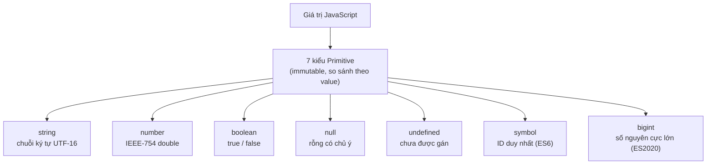

# Primitive Types

Trong JavaScript, **primitive** (kiểu nguyên thuỷ) là những kiểu dữ liệu cơ bản nhất, lưu một giá trị đơn giản duy nhất chứ không phải một tập hợp các giá trị. JavaScript có 7 kiểu nguyên thuỷ: `string` (chuỗi), `number` (số), `boolean` (đúng/sai), `null`, `undefined`, `symbol` và `bigint`. Điểm quan trọng là giá trị nguyên thuỷ là bất biến (immutable) — bạn không thể thay đổi chính giá trị đó, mà chỉ có thể gán một giá trị mới cho biến.

---

## 🎯 Cần nắm gì sau bài này?

:::note[Ghi nhớ nhanh — ⭐ là phần quan trọng nhất]

- ⭐ **JS có 7 kiểu primitive** — `string`, `number`, `boolean`, `null`, `undefined`, `symbol`, `bigint`, đều **immutable** và so sánh theo giá trị.
- ⭐ **`number` dùng IEEE-754** — nên `0.1 + 0.2 !== 0.3`; cần chính xác thì dùng integer (cents) hoặc `bigint`.
- **`symbol`** tạo key duy nhất, không đụng key khác — tiện làm property riêng tư và `Symbol.iterator`.
- **`bigint`** (suffix `n`) cho số nguyên cực lớn vượt `Number.MAX_SAFE_INTEGER`, không trộn trực tiếp với `number`.
- **`null` vs `undefined`** — `undefined` là "chưa gán", `null` là "cố ý rỗng"; nên nhất quán một quy ước.
- **8 giá trị falsy** — `false`, `0`, `-0`, `0n`, `""`, `null`, `undefined`, `NaN`; còn lại đều truthy (kể cả `"0"`, `[]`, `{}`).

:::

---

## Mục lục

- [Vì sao cần hiểu kiểu primitive?](#vì-sao-cần-hiểu-kiểu-primitive)
- [Tổng quan](#tổng-quan)
- [String](#string)
- [Number](#number)
- [Boolean](#boolean)
- [null và undefined](#null-và-undefined)
- [Symbol](#symbol)
- [BigInt](#bigint)

---

## Vì sao cần hiểu kiểu primitive?

Mỗi kiểu primitive sinh ra để giải một bài toán riêng. Nắm rõ chúng giúp bạn tránh những lỗi khó chịu khi đặt key cho object, tính toán số lớn, hay phân biệt "chưa có" với "cố ý rỗng".

**Vấn đề:**

```js
// 1. Key string dễ ĐỤNG ĐỘ — library và bạn cùng dùng "id"
const user = { id: 1 };
user.id = "private-token"; // ghi đè mất id gốc của library!

// 2. Số nguyên lớn VƯỢT giới hạn an toàn của Number → sai số
const bigId = 9007199254740993;     // id từ DB
bigId === 9007199254740992;         // true (!) — mất 1 đơn vị
Number.MAX_SAFE_INTEGER;            // 9007199254740991

// 3. Không phân biệt được "chưa load" và "không có"
let user2;          // undefined hay null? code khác đọc sẽ đoán mò
```

**Giải pháp:**

```js
// 1. Symbol (ES6) — key DUY NHẤT, không bao giờ đụng key khác
const ID = Symbol("id");
const user = { [ID]: 1 };
user[ID]; // 1 — an toàn, không ai vô tình ghi đè

// 2. BigInt (ES2020) — số nguyên lớn KHÔNG sai số
const bigId = 9007199254740993n;    // suffix n
bigId === 9007199254740992n;        // false — chính xác

// 3. null vs undefined — quy ước rõ ràng
let user2 = null;   // CỐ Ý rỗng: "đã check, không có user"
let user3;          // undefined: "chưa gán / chưa load"
```

:::tip[Dùng thực tế]

- **Symbol làm key riêng tư**: thêm metadata vào object của người khác mà không sợ trùng tên hay bị `for...in`/`Object.keys` lộ ra.
- **Symbol.iterator**: cho object của bạn chạy được với `for...of`, spread `[...obj]`, destructuring.
- **BigInt cho id/tài chính**: id Twitter/Discord (snowflake 64-bit), timestamp nanosecond, hoặc tính tiền tệ ở đơn vị nhỏ nhất cần độ chính xác tuyệt đối.
- **Check null/undefined trước khi dùng**: dùng `value == null` (bắt cả hai) hoặc `value ?? default` để xử lý an toàn dữ liệu từ API.

:::

---

## Tổng quan

JavaScript có **7 kiểu primitive**:

| Kiểu | Giá trị |
|------|---------|
| `string` | Chuỗi ký tự |
| `number` | Số (int + float, IEEE-754) |
| `boolean` | `true` / `false` |
| `null` | Rỗng có chủ ý |
| `undefined` | Chưa được gán |
| `symbol` | ID duy nhất |
| `bigint` | Số nguyên cực lớn |

Primitive là **immutable** — không sửa được, chỉ thay bằng giá trị mới.

Sơ đồ dưới đây tóm tắt 7 kiểu primitive và vai trò của từng kiểu:



---

## String

```js
const a = "double quotes";
const b = 'single quotes';
const c = `template literal với ${a}`;

c.length;       // số ký tự
c.toUpperCase();
c.includes("quote");
c.split(" ");
```

Template literal hỗ trợ multi-line + interpolation:

```js
const name = "An";
const html = `
  <div>
    <h1>${name}</h1>
  </div>
`;
```

:::info[Phân tích]

JS string là **immutable UTF-16**. Một số hệ quả quan trọng:

```js
"😀".length; // 2 — emoji chiếm 2 code unit UTF-16
"😀"[0];     // "\uD83D" (surrogate pair, vô nghĩa)

[..."😀"].length;        // 1 — iterator hiểu code point
"😀".codePointAt(0);     // 128512
```

Khi xử lý string có emoji, ký tự đặc biệt, ngôn ngữ phức tạp:

- **Đếm số ký tự "thật"**: dùng `[...str].length` hoặc `Intl.Segmenter`.
- **Cắt string**: tránh `slice`/`substring` ở giữa surrogate pair.
- **So sánh**: dùng `localeCompare` với locale phù hợp.

:::

---

## Number

```js
const dec = 42;
const float = 3.14;
const hex = 0xff;       // 255
const bin = 0b1010;     // 10
const oct = 0o777;      // 511
const exp = 1.5e3;      // 1500
```

Giá trị đặc biệt:

```js
Infinity;
-Infinity;
NaN;            // Not-a-Number

Number.isFinite(42);    // true
Number.isNaN(NaN);      // true
Number.MAX_SAFE_INTEGER; // 2^53 - 1
```

:::warning[Cần lưu ý]

JS dùng **IEEE-754 double precision** cho mọi số → không chính xác tuyệt
đối với số thập phân:

```js
0.1 + 0.2;              // 0.30000000000000004
0.1 + 0.2 === 0.3;      // false
```

Khi cần chính xác (tiền tệ, đo lường):

- Dùng **integer (cents)** thay vì float (`$1.00` → `100` cents).
- Hoặc thư viện như **decimal.js**, **big.js**.

```js
// Sai
const total = price * 0.1; // có thể sai số

// Đúng
const totalCents = Math.round(priceCents * 0.1);
```

:::

---

## Boolean

```js
const yes = true;
const no = false;

Boolean(1);    // true
Boolean("");   // false
!!"hello";     // true (idiom convert sang boolean)
```

**Falsy values** (8 cái): `false`, `0`, `-0`, `0n`, `""`, `null`,
`undefined`, `NaN`. Mọi thứ khác là truthy — kể cả `"0"`, `[]`, `{}`.

---

## null và undefined

```js
let a;            // a = undefined (mặc định)
let b = null;     // null — chủ ý gán

typeof undefined; // "undefined"
typeof null;      // "object" (bug lịch sử của JS)

null == undefined;  // true (loose equality)
null === undefined; // false
```

:::info[Phân tích]

**Quy ước thực dụng**:

- `undefined`: dùng cho **giá trị mặc định** (biến chưa gán, hàm không
  return, property không tồn tại). **Không nên gán thủ công**.
- `null`: dùng khi **chủ ý gán** một giá trị "rỗng" (vd biến reset, API
  trả về "không có").

```js
function find(id) {
  // ...
  return null; // chủ ý: "không tìm thấy"
}

let user; // undefined — chưa load
user = await fetchUser();
```

Khi viết API/library, **nhất quán** chỉ dùng một trong hai cho ý nghĩa
"rỗng" — đừng trộn lẫn (gây nhầm khi check).

:::

---

## Symbol

`Symbol` (ES6) tạo **identifier duy nhất** — hai symbol khác nhau dù
cùng description:

```js
const a = Symbol("id");
const b = Symbol("id");
a === b; // false

const KEY = Symbol("user.private");
const user = { name: "An", [KEY]: "secret" };
user[KEY]; // "secret"
```

Symbol thường dùng để:

- Tạo **property không trùng** với key của library/user.
- Định nghĩa **well-known symbol** (`Symbol.iterator`, `Symbol.asyncIterator`,
  `Symbol.toPrimitive`...).

:::tip[Mẹo]

Pattern phổ biến — implement iterator protocol:

```js
class Range {
  constructor(start, end) { this.start = start; this.end = end; }

  [Symbol.iterator]() {
    let i = this.start;
    return {
      next: () => i <= this.end
        ? { value: i++, done: false }
        : { value: undefined, done: true },
    };
  }
}

for (const n of new Range(1, 5)) console.log(n); // 1, 2, 3, 4, 5
```

`Symbol.iterator` là cách JS kết nối object với `for...of`, spread, destructuring.

:::

---

## BigInt

`BigInt` (ES2020) — số nguyên cực lớn, không bị giới hạn 2^53.

```js
const big = 9007199254740993n;       // suffix n
const fromNumber = BigInt(10);
const fromString = BigInt("12345678901234567890");

big + 1n;        // OK
big + 1;         // TypeError — không trộn với number
Number(big);     // convert tường minh
```

:::warning[Cần lưu ý]

**BigInt và Number không thao tác trực tiếp** — phải convert tường minh:

```js
const a = 10n;
const b = 5;

a + b;           // TypeError
a + BigInt(b);   // 15n
Number(a) + b;   // 15
```

BigInt **không có thập phân** — `10n / 3n === 3n` (cắt phần dư).

Performance: BigInt **chậm hơn** Number đáng kể vì không dùng được CPU
register trực tiếp. Chỉ dùng khi thực sự cần (crypto, ID khổng lồ, timestamp
nanosecond...).

:::
