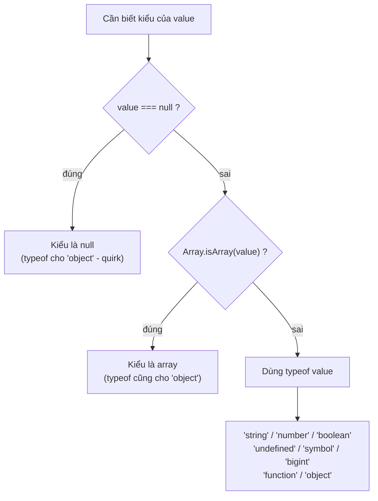

# Object và typeof

**Object** (đối tượng) là kiểu dữ liệu cho phép gom nhiều giá trị liên quan lại với nhau dưới dạng các cặp `key: value` (khoá: giá trị), ví dụ một người dùng có `tên`, `tuổi`, `email`. Khác với kiểu nguyên thuỷ chỉ giữ một giá trị, object có thể chứa nhiều thuộc tính (property) và cả hàm. Toán tử **typeof** giúp bạn kiểm tra xem một biến đang thuộc kiểu dữ liệu nào, rất hữu ích khi cần biết mình đang làm việc với số, chuỗi hay object.

---

## 🎯 Cần nắm gì sau bài này?

:::note[Ghi nhớ nhanh — ⭐ là phần quan trọng nhất]

- ⭐ **`object` là reference type** — gán biến chỉ copy tham chiếu; muốn copy thật dùng spread/`Object.assign` (shallow) hoặc `structuredClone` (deep).
- ⭐ **`typeof` có quirk** — `typeof null === "object"` (bug lịch sử) và `typeof [] === "object"`; nhận diện mảng phải dùng `Array.isArray()`.
- **Truy cập property** qua dot hoặc bracket; dùng bracket cho key đặc biệt/động, và `?.` để truy cập an toàn.
- **`in` vs `Object.hasOwn`** — `in` tính cả prototype, `Object.hasOwn` (ES2022) chỉ xét own property và an toàn hơn `hasOwnProperty`.
- **Computed property** `[key]` cho phép đặt tên property tính từ biến lúc runtime.

:::

---

## Mục lục

- [Vì sao cần typeof & cách kiểm tra kiểu?](#vì-sao-cần-typeof--cách-kiểm-tra-kiểu)
- [Object cơ bản](#object-cơ-bản)
- [Truy cập property](#truy-cập-property)
- [Computed property](#computed-property)
- [Toán tử typeof](#toán-tử-typeof)
- [Toán tử in và Object.hasOwn](#toán-tử-in-và-objecthasown)

---

## Vì sao cần typeof & cách kiểm tra kiểu?

**Vấn đề:** JS là ngôn ngữ **động kiểu** (dynamically typed) — một biến có thể chứa bất kỳ kiểu nào lúc runtime. Bạn không biết chắc nó đang giữ gì cho tới khi chạy, nên dễ gọi nhầm method không tồn tại.

```js
function shout(value) {
  return value.toUpperCase(); // chỉ hợp lệ với string
}

shout("hi");  // "HI"
shout(42);    // TypeError: value.toUpperCase is not a function
shout(null);  // TypeError: Cannot read properties of null
```

**Giải pháp:** Toán tử `typeof` ra đời để **kiểm tra kiểu lúc chạy** trước khi xử lý. Nhưng nó có vài quirk lịch sử cần nhớ: `typeof null === "object"` (bug giữ lại để tương thích) và `typeof [] === "object"` (mảng cũng là object) — nên muốn nhận diện mảng phải dùng `Array.isArray()`.

```js
function shout(value) {
  if (typeof value !== "string") return String(value).toUpperCase();
  return value.toUpperCase();
}

typeof null;            // "object" — quirk, KHÔNG phải "null"
typeof [];              // "object" — mảng vẫn là object
Array.isArray([1, 2]);  // true  — cách đúng để nhận diện mảng
Array.isArray({});      // false
```

:::tip[Dùng thực tế]

- **Validate input** trước khi xử lý: `if (typeof age !== "number") throw new Error(...)`.
- **Hàm nhận nhiều kiểu**: rẽ nhánh theo `typeof` để xử lý string, number, object khác nhau.
- **Guard trước khi gọi method**: `if (typeof obj.greet === "function") obj.greet()`.
- **Kiểm tra mảng**: luôn dùng `Array.isArray(x)` thay vì `typeof x === "object"`.

:::

---

## Object cơ bản

Object là **tập key-value** — kiểu dữ liệu **non-primitive** (reference type).

```js
const user = {
  name: "An",
  age: 25,
  isAdmin: true,
  greet() {
    return `Hi ${this.name}`;
  },
};
```

Object cũng là **reference** — gán biến chỉ copy tham chiếu:

```js
const a = { x: 1 };
const b = a;
b.x = 2;
console.log(a.x); // 2 — a và b cùng trỏ tới một object
```

Để copy thật, dùng spread hoặc `Object.assign`:

```js
const a = { x: 1 };
const b = { ...a };
b.x = 2;
console.log(a.x); // 1
```

:::warning[Cần lưu ý]

Spread và `Object.assign` chỉ **shallow copy** — nested object vẫn dùng
chung tham chiếu:

```js
const a = { user: { name: "An" } };
const b = { ...a };
b.user.name = "Bình";
console.log(a.user.name); // "Bình" — bị thay đổi!
```

Deep copy:

```js
const c = structuredClone(a);   // built-in từ Node 17, browser hiện đại
c.user.name = "Cường";
console.log(a.user.name);       // "An" — không bị ảnh hưởng
```

`JSON.parse(JSON.stringify(a))` cũng deep copy nhưng **mất** function,
`Date`, `Map`, `Set`, `undefined`, circular reference. Dùng
`structuredClone` an toàn hơn.

:::

---

## Truy cập property

Hai cú pháp:

```js
const user = { name: "An", "full-name": "An Nguyễn" };

user.name;          // dot notation
user["name"];       // bracket notation
user["full-name"];  // bracket cho key không hợp lệ với dot
```

Dùng bracket khi:

- Key có ký tự đặc biệt (`-`, space, số đầu tiên).
- Key là biến: `user[keyVar]`.
- Key tính toán runtime.

Optional chaining `?.` cho truy cập an toàn:

```js
const city = user?.address?.city; // undefined nếu address là null/undefined
```

---

## Computed property

Tên property tính từ biến (ES6):

```js
const key = "name";
const user = { [key]: "An" };
// { name: "An" }

const prefix = "user_";
const obj = {
  [`${prefix}id`]: 1,
  [`${prefix}name`]: "An",
};
// { user_id: 1, user_name: "An" }
```

---

## Toán tử typeof

`typeof` trả về **chuỗi** mô tả kiểu.

```js
typeof "hi";       // "string"
typeof 42;         // "number"
typeof true;       // "boolean"
typeof undefined;  // "undefined"
typeof 10n;        // "bigint"
typeof Symbol();   // "symbol"
typeof function(){}; // "function"

typeof null;       // "object" — BUG lịch sử
typeof [];         // "object"
typeof {};         // "object"
```

:::info[Phân tích]

**`typeof null === "object"`** là bug từ phiên bản đầu của JS (1995):

- Trong implementation gốc, kiểu được lưu ở 3 bit đầu của một con trỏ.
- Object có tag `000`, và `null` được biểu diễn bằng pointer 0x00 →
  tag cũng là `000`.
- Khi đề xuất sửa trong ES5, đã có quá nhiều code dựa vào behavior này
  → quyết định **giữ lại vĩnh viễn**.

Cách check chính xác — luồng quyết định khi cần biết kiểu thật của một giá trị:



```js
function getType(v) {
  if (v === null) return "null";
  if (Array.isArray(v)) return "array";
  return typeof v;
}
```

Hoặc dùng `Object.prototype.toString.call`:

```js
Object.prototype.toString.call(null);       // "[object Null]"
Object.prototype.toString.call([]);         // "[object Array]"
Object.prototype.toString.call(new Date()); // "[object Date]"
```

:::

---

## Toán tử in và Object.hasOwn

`in` kiểm tra **key có tồn tại** (kể cả prototype):

```js
const user = { name: "An" };

"name" in user;       // true
"toString" in user;   // true — kế thừa từ Object.prototype
```

`Object.hasOwn` (ES2022) — chỉ kiểm tra **own property**, không tính
prototype:

```js
Object.hasOwn(user, "name");      // true
Object.hasOwn(user, "toString");  // false
```

:::tip[Mẹo]

**`Object.hasOwn`** thay thế hoàn toàn `hasOwnProperty` cũ:

```js
// Cũ — không an toàn nếu object có property tên "hasOwnProperty"
user.hasOwnProperty("name");

// Cũ — verbose
Object.prototype.hasOwnProperty.call(user, "name");

// Mới — chuẩn và an toàn
Object.hasOwn(user, "name");
```

ESLint rule `prefer-object-has-own` sẽ tự nhắc bạn migrate.

:::
