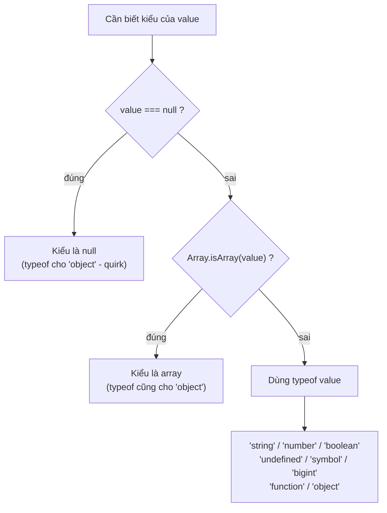

# Object và typeof

**Object** (đối tượng) là kiểu dữ liệu cho phép gom nhiều giá trị liên quan lại với nhau dưới dạng các cặp `key: value` (khoá: giá trị), ví dụ một người dùng có `tên`, `tuổi`, `email`. Khác với kiểu nguyên thuỷ chỉ giữ một giá trị, object có thể chứa nhiều thuộc tính (property) và cả hàm. Toán tử **typeof** giúp bạn kiểm tra xem một biến đang thuộc kiểu dữ liệu nào, rất hữu ích khi cần biết mình đang làm việc với số, chuỗi hay object.

[](pathname:///img/javascript/object-typeof.webp)

---

:::note[Ghi nhớ nhanh]

- ⭐ **`object` là reference type** — gán biến chỉ copy tham chiếu; muốn copy thật dùng spread/`Object.assign` (shallow) hoặc `structuredClone` (deep).
- ⭐ **`typeof` có quirk** — `typeof null === "object"` (bug lịch sử) và `typeof [] === "object"`; nhận diện mảng phải dùng `Array.isArray()`.
- **Truy cập property** qua dot hoặc bracket; dùng bracket cho key đặc biệt/động, và `?.` để truy cập an toàn.
- **`in` vs `Object.hasOwn`** — `in` tính cả prototype, `Object.hasOwn` (ES2022) chỉ xét own property và an toàn hơn `hasOwnProperty`.
- **Computed property** `[key]` cho phép đặt tên property tính từ biến lúc runtime.

:::

---

## Mục lục

- [Vì sao cần typeof & cách kiểm tra kiểu?](#vì-sao-cần-typeof--cách-kiểm-tra-kiểu)
- [Object cơ bản](#object-cơ-bản)
- [Truy cập property](#truy-cập-property)
- [Computed property](#computed-property)
- [Toán tử typeof](#toán-tử-typeof)
- [Toán tử in và Object.hasOwn](#toán-tử-in-và-objecthasown)
- [Câu hỏi phỏng vấn](#câu-hỏi-phỏng-vấn)

---

## Vì sao cần typeof & cách kiểm tra kiểu?

**Vấn đề:** JS là ngôn ngữ **động kiểu** (dynamically typed) — một biến có thể chứa bất kỳ kiểu nào lúc runtime. Bạn không biết chắc nó đang giữ gì cho tới khi chạy, nên dễ gọi nhầm method không tồn tại.

```js
function shout(value) {
  return value.toUpperCase(); // chỉ hợp lệ với string
}

shout("hi");  // "HI"
shout(42);    // TypeError: value.toUpperCase is not a function
shout(null);  // TypeError: Cannot read properties of null
```

**Giải pháp:** Toán tử `typeof` ra đời để **kiểm tra kiểu lúc chạy** trước khi xử lý. Nhưng nó có vài quirk lịch sử cần nhớ: `typeof null === "object"` (bug giữ lại để tương thích) và `typeof [] === "object"` (mảng cũng là object) — nên muốn nhận diện mảng phải dùng `Array.isArray()`.

```js
function shout(value) {
  if (typeof value !== "string") return String(value).toUpperCase();
  return value.toUpperCase();
}

typeof null;            // "object" — quirk, KHÔNG phải "null"
typeof [];              // "object" — mảng vẫn là object
Array.isArray([1, 2]);  // true  — cách đúng để nhận diện mảng
Array.isArray({});      // false
```

:::tip[Dùng thực tế]

- **Validate input** trước khi xử lý: `if (typeof age !== "number") throw new Error(...)`.
- **Hàm nhận nhiều kiểu**: rẽ nhánh theo `typeof` để xử lý string, number, object khác nhau.
- **Guard trước khi gọi method**: `if (typeof obj.greet === "function") obj.greet()`.
- **Kiểm tra mảng**: luôn dùng `Array.isArray(x)` thay vì `typeof x === "object"`.

:::

---

## Object cơ bản

Object là **tập key-value** — kiểu dữ liệu **non-primitive** (reference type).

```js
const user = {
  name: "An",
  age: 25,
  isAdmin: true,
  greet() {
    return `Hi ${this.name}`;
  },
};
```

Object cũng là **reference** — gán biến chỉ copy tham chiếu:

```js
const a = { x: 1 };
const b = a;
b.x = 2;
console.log(a.x); // 2 — a và b cùng trỏ tới một object
```

Để copy thật, dùng spread hoặc `Object.assign`:

```js
const a = { x: 1 };
const b = { ...a };
b.x = 2;
console.log(a.x); // 1
```

:::warning[Cần lưu ý]

Spread và `Object.assign` chỉ **shallow copy** — nested object vẫn dùng
chung tham chiếu:

```js
const a = { user: { name: "An" } };
const b = { ...a };
b.user.name = "Bình";
console.log(a.user.name); // "Bình" — bị thay đổi!
```

Deep copy:

```js
const c = structuredClone(a);   // built-in từ Node 17, browser hiện đại
c.user.name = "Cường";
console.log(a.user.name);       // "An" — không bị ảnh hưởng
```

`JSON.parse(JSON.stringify(a))` cũng deep copy nhưng **mất** function,
`Date`, `Map`, `Set`, `undefined`, circular reference. Dùng
`structuredClone` an toàn hơn.

:::

---

## Truy cập property

Hai cú pháp:

```js
const user = { name: "An", "full-name": "An Nguyễn" };

user.name;          // dot notation
user["name"];       // bracket notation
user["full-name"];  // bracket cho key không hợp lệ với dot
```

Dùng bracket khi:

- Key có ký tự đặc biệt (`-`, space, số đầu tiên).
- Key là biến: `user[keyVar]`.
- Key tính toán runtime.

Optional chaining `?.` cho truy cập an toàn:

```js
const city = user?.address?.city; // undefined nếu address là null/undefined
```

---

## Computed property

Tên property tính từ biến (ES6):

```js
const key = "name";
const user = { [key]: "An" };
// { name: "An" }

const prefix = "user_";
const obj = {
  [`${prefix}id`]: 1,
  [`${prefix}name`]: "An",
};
// { user_id: 1, user_name: "An" }
```

---

## Toán tử typeof

`typeof` trả về **chuỗi** mô tả kiểu.

```js
typeof "hi";       // "string"
typeof 42;         // "number"
typeof true;       // "boolean"
typeof undefined;  // "undefined"
typeof 10n;        // "bigint"
typeof Symbol();   // "symbol"
typeof function(){}; // "function"

typeof null;       // "object" — BUG lịch sử
typeof [];         // "object"
typeof {};         // "object"
```

:::info[Phân tích]

**`typeof null === "object"`** là bug từ phiên bản đầu của JS (1995):

- Trong implementation gốc, kiểu được lưu ở 3 bit đầu của một con trỏ.
- Object có tag `000`, và `null` được biểu diễn bằng pointer 0x00 →
  tag cũng là `000`.
- Khi đề xuất sửa trong ES5, đã có quá nhiều code dựa vào behavior này
  → quyết định **giữ lại vĩnh viễn**.

Cách check chính xác — luồng quyết định khi cần biết kiểu thật của một giá trị:



```js
function getType(v) {
  if (v === null) return "null";
  if (Array.isArray(v)) return "array";
  return typeof v;
}
```

Hoặc dùng `Object.prototype.toString.call`:

```js
Object.prototype.toString.call(null);       // "[object Null]"
Object.prototype.toString.call([]);         // "[object Array]"
Object.prototype.toString.call(new Date()); // "[object Date]"
```

:::

---

## Toán tử in và Object.hasOwn

`in` kiểm tra **key có tồn tại** (kể cả prototype):

```js
const user = { name: "An" };

"name" in user;       // true
"toString" in user;   // true — kế thừa từ Object.prototype
```

`Object.hasOwn` (ES2022) — chỉ kiểm tra **own property**, không tính
prototype:

```js
Object.hasOwn(user, "name");      // true
Object.hasOwn(user, "toString");  // false
```

:::tip[Mẹo]

**`Object.hasOwn`** thay thế hoàn toàn `hasOwnProperty` cũ:

```js
// Cũ — không an toàn nếu object có property tên "hasOwnProperty"
user.hasOwnProperty("name");

// Cũ — verbose
Object.prototype.hasOwnProperty.call(user, "name");

// Mới — chuẩn và an toàn
Object.hasOwn(user, "name");
```

ESLint rule `prefer-object-has-own` sẽ tự nhắc bạn migrate.

:::

---

## Câu hỏi phỏng vấn

Những câu thường gặp về chủ đề này. Tự trả lời trước, rồi bấm **Xem đáp án** để đối chiếu.

**1. Object khác primitive ở điểm nào? Vì sao object được gọi là `reference type`?**

<details className="qa">
<summary>Xem đáp án</summary>

**Primitive** (`string`, `number`, `boolean`, `null`, `undefined`, `symbol`, `bigint`) chỉ giữ **một giá trị duy nhất** và **immutable** — không sửa được tại chỗ, mọi thao tác đều tạo giá trị mới. **Object** gom nhiều cặp `key: value` (kể cả method) và **mutable** — sửa property trực tiếp được.

Khác biệt cốt lõi nằm ở **cách lưu**: biến primitive giữ luôn giá trị, còn biến object chỉ giữ **tham chiếu** (địa chỉ) tới vùng nhớ chứa object. Vì vậy object được gọi là **reference type**:

```js
let a = 1, b = a;
b = 2;
console.log(a);       // 1 — copy giá trị

const o1 = { x: 1 }, o2 = o1;
o2.x = 2;
console.log(o1.x);    // 2 — copy tham chiếu, cùng một object

console.log({ x: 1 } === { x: 1 }); // false — khác tham chiếu
```

Hệ quả: gán biến không tạo bản sao, so sánh `===` so sánh tham chiếu chứ không so sánh nội dung, và truyền object vào hàm thì hàm có thể sửa được object gốc.

</details>

**2. Đoán output: `const a = { x: 1 }; const b = a; b.x = 2; console.log(a.x)`. Giải thích vì sao.**

<details className="qa">
<summary>Xem đáp án</summary>

Output: **`2`**.

```js
const a = { x: 1 };
const b = a;   // KHÔNG tạo object mới — b giữ cùng tham chiếu với a
b.x = 2;       // sửa property của object mà cả hai cùng trỏ tới
console.log(a.x); // 2
```

Lý do: object là **reference type**. Dòng `const b = a` chỉ copy **địa chỉ** của object, không copy nội dung. Sau đó `a` và `b` là hai biến trỏ tới **cùng một object** trong bộ nhớ, nên sửa qua `b` thì đọc qua `a` cũng thấy.

`const` cũng không cứu được: nó chỉ khoá **binding** (không cho gán lại biến), chứ không đóng băng nội dung object.

Muốn `a` không bị ảnh hưởng thì phải copy thật:

```js
const b = { ...a };  // shallow copy — b là object mới
b.x = 2;
console.log(a.x);    // 1
```

</details>

**3. Key của một object thực chất được lưu ở kiểu gì? `obj[1]` và `obj["1"]` có trỏ tới cùng một property không? Còn key là `symbol` thì sao?**

<details className="qa">
<summary>Xem đáp án</summary>

Key của object thuần chỉ có **hai kiểu hợp lệ**: `string` và `symbol`. Mọi key khác (number, boolean, `null`, object...) đều bị **ép ngầm sang string** khi dùng làm key.

Vì vậy `obj[1]` và `obj["1"]` là **cùng một property** — số `1` được chuyển thành chuỗi `"1"`:

```js
const obj = {};
obj[1] = "a";
obj["1"] = "b";
console.log(obj[1]);          // "b" — ghi đè lên cùng key
console.log(Object.keys(obj)); // ["1"] — key là string
```

**Symbol key** thì khác hẳn: mỗi `Symbol()` là duy nhất, không bao giờ trùng với key khác, và **bị ẩn** khỏi các cách duyệt thông thường:

```js
const id = Symbol("id");
const user = { name: "An", [id]: 123 };

Object.keys(user);          // ["name"] — không thấy symbol
JSON.stringify(user);       // '{"name":"An"}'
user[id];                   // 123 — vẫn truy cập được
Object.getOwnPropertySymbols(user); // [Symbol(id)]
```

Nhờ đặc tính này, symbol hay được dùng làm key "riêng tư" hoặc metadata, tránh đụng tên với key của người khác.

</details>

**4. Khi nào bắt buộc phải dùng bracket notation thay vì dot notation?**

<details className="qa">
<summary>Xem đáp án</summary>

Dot notation chỉ dùng được khi key là một **identifier hợp lệ** viết cứng trong code. Phải chuyển sang bracket trong các trường hợp:

- **Key chứa ký tự đặc biệt hoặc khoảng trắng**: `user["full-name"]`, `user["first name"]`.
- **Key bắt đầu bằng số**: `obj["2fa"]` (viết `obj.2fa` là lỗi cú pháp).
- **Key nằm trong biến**: khi tên property chỉ biết lúc chạy.
- **Key tính toán runtime**: ghép chuỗi, lấy từ API, từ input người dùng.
- **Key là symbol**: `user[Symbol.iterator]`.

```js
const user = { name: "An", "full-name": "An Nguyễn" };

const key = "name";
user.key;        // undefined — tìm property tên đúng là "key"
user[key];       // "An"     — lấy giá trị của biến key

user["full-name"];          // "An Nguyễn"
user[`user_${1}`] = true;   // key ghép động
```

Lỗi kinh điển của người mới: dùng `obj.key` khi `key` là biến. Nhớ quy tắc — **dot lấy tên chữ, bracket lấy giá trị biểu thức**.

</details>

**5. `computed property` là gì và dùng trong tình huống nào?**

<details className="qa">
<summary>Xem đáp án</summary>

**Computed property** (ES6) cho phép đặt tên property bằng một **biểu thức tính lúc runtime**, viết trong cặp ngoặc vuông ngay trong object literal:

```js
const key = "name";
const user = { [key]: "An" };   // { name: "An" }

const prefix = "user_";
const obj = {
  [`${prefix}id`]: 1,
  [`${prefix}name`]: "An",
};                              // { user_id: 1, user_name: "An" }
```

Trước ES6 phải tạo object rỗng rồi gán từng key bằng bracket — dài dòng và không dùng được trong literal.

Tình huống thường gặp:

- **Form động**: cập nhật state theo tên field, `setForm({ ...form, [e.target.name]: e.target.value })` — rất phổ biến trong React.
- **Biến object thành lookup table / map theo id**: `{ [item.id]: item }`.
- **Key theo hằng số hoặc symbol**: `{ [ACTION_TYPE]: handler }`, `{ [Symbol.iterator]() {...} }`.
- **i18n, cấu hình theo môi trường**: `{ [locale]: messages }`.

</details>

**6. Phân biệt `shallow copy` và `deep copy`. Spread `...` và `Object.assign` copy tới mức nào?**

<details className="qa">
<summary>Xem đáp án</summary>

- **Shallow copy** (copy nông): tạo object mới, nhưng chỉ copy **một tầng**. Property là primitive thì copy giá trị; property là object thì copy **tham chiếu** — object lồng bên trong vẫn dùng chung.
- **Deep copy** (copy sâu): sao chép đệ quy toàn bộ các tầng, bản sao hoàn toàn độc lập với bản gốc.

Spread `...` và `Object.assign` đều chỉ là **shallow copy**:

```js
const a = { x: 1, user: { name: "An" } };
const b = { ...a };

b.x = 99;
console.log(a.x);           // 1   — tầng 1 độc lập

b.user.name = "Bình";
console.log(a.user.name);   // "Bình" — tầng 2 dùng chung tham chiếu!
```

Muốn độc lập hoàn toàn, dùng `structuredClone`:

```js
const c = structuredClone(a);
c.user.name = "Cường";
console.log(a.user.name);   // "An"
```

Đây là nguồn bug rất hay gặp khi làm việc với state lồng nhau (React, Redux) — tưởng đã copy an toàn nhưng vẫn vô tình mutate dữ liệu gốc.

</details>

**7. So sánh `structuredClone` với `JSON.parse(JSON.stringify(obj))` khi deep clone. Cách thứ hai làm mất những gì?**

<details className="qa">
<summary>Xem đáp án</summary>

| Tiêu chí | `structuredClone` | `JSON.parse(JSON.stringify(...))` |
|---|---|---|
| Hỗ trợ | Built-in từ Node 17 và trình duyệt hiện đại | Chạy ở mọi nơi |
| `Date` | Giữ nguyên là `Date` | Biến thành **string** |
| `Map`, `Set` | Clone đúng | **Mất** — thành `{}` |
| `undefined`, `function`, `symbol` | `undefined` giữ được; function/symbol gây lỗi | Bị **bỏ qua** hoặc thành `null` trong mảng |
| `NaN`, `Infinity` | Giữ nguyên | Thành `null` |
| Circular reference | Xử lý được | Ném `TypeError` |

```js
const a = { d: new Date(), s: new Set([1]), u: undefined, n: NaN };

JSON.parse(JSON.stringify(a));
// { d: "2024-01-01T...", s: {}, n: null } — u biến mất

structuredClone(a);
// { d: Date, s: Set(1), u: undefined, n: NaN } — đúng
```

Kết luận: `structuredClone` là lựa chọn mặc định. Hai giới hạn cần nhớ — nó **không clone được function** (ném `DataCloneError`) và **không giữ prototype** của class, object clone ra là object thuần.

</details>

**8. `typeof` trả về gì với `null`, `[]`, `{}`, `function(){}`, `NaN`? Vì sao `typeof null === "object"`?**

<details className="qa">
<summary>Xem đáp án</summary>

```js
typeof null;          // "object"   — quirk, KHÔNG phải "null"
typeof [];            // "object"   — mảng cũng là object
typeof {};            // "object"
typeof function(){};  // "function" — ngoại lệ đặc biệt
typeof NaN;           // "number"   — NaN là một giá trị số
```

**Vì sao `typeof null === "object"`?** Đây là **bug lịch sử** từ bản JS đầu tiên năm 1995: trong implementation gốc, kiểu của giá trị được mã hoá ở **3 bit đầu** của con trỏ. Object mang tag `000`, còn `null` được biểu diễn bằng pointer `0x00` — cũng cho ra tag `000`. Vì thế `typeof null` rơi vào nhánh "object".

Khi có đề xuất sửa trong ES5, quá nhiều code ngoài thực tế đã phụ thuộc vào hành vi này, nên quyết định **giữ lại vĩnh viễn** để không phá vỡ web.

Hệ quả thực tế: không bao giờ dùng `typeof x === "object"` để kết luận x là object — phải loại `null` trước, và dùng `Array.isArray()` để tách mảng.

</details>

**9. Làm sao phân biệt chính xác array, object thuần, `null` và `Date`? So sánh `Array.isArray`, `instanceof` và `Object.prototype.toString.call`.**

<details className="qa">
<summary>Xem đáp án</summary>

| Cách | Ưu | Nhược |
|---|---|---|
| `Array.isArray(v)` | Chuẩn xác, hoạt động cả cross-realm (iframe) | Chỉ dùng cho mảng |
| `v instanceof Date` | Đọc dễ, dùng được với mọi class | Sai khi giá trị đến từ realm khác; phụ thuộc prototype chain |
| `Object.prototype.toString.call(v)` | Phân biệt được hầu hết built-in type bằng một hàm | Dài dòng; có thể bị `Symbol.toStringTag` giả mạo |

```js
Object.prototype.toString.call(null);       // "[object Null]"
Object.prototype.toString.call([]);         // "[object Array]"
Object.prototype.toString.call({});         // "[object Object]"
Object.prototype.toString.call(new Date()); // "[object Date]"
```

Hàm kiểm tra kiểu thực dụng, đúng như bài đã trình bày:

```js
function getType(v) {
  if (v === null) return "null";
  if (Array.isArray(v)) return "array";
  return typeof v;
}
```

Thứ tự quan trọng: kiểm tra `null` **trước**, rồi tới mảng, cuối cùng mới dùng `typeof`. Với `Date` và các built-in khác thì dùng `Object.prototype.toString.call`.

</details>

**10. Vì sao `instanceof Array` có thể cho kết quả sai khi object đến từ một `iframe` khác?**

<details className="qa">
<summary>Xem đáp án</summary>

`instanceof` không so sánh "hình dạng" của giá trị — nó đi dọc **prototype chain** của object và kiểm tra xem có gặp đúng `Array.prototype` của **realm hiện tại** hay không.

Mỗi `iframe` (hay mỗi worker, mỗi vm context trong Node) là một **realm** riêng, có bộ global object riêng, nghĩa là có một `Array` và một `Array.prototype` **khác**. Mảng tạo bên trong iframe kế thừa từ `Array.prototype` của iframe đó, không phải của trang cha:

```js
const iframe = document.createElement("iframe");
document.body.appendChild(iframe);
const arr = new iframe.contentWindow.Array(1, 2, 3);

arr instanceof Array;   // false — khác realm!
Array.isArray(arr);     // true  — vẫn đúng
```

`Array.isArray` được đặc tả ở mức thấp hơn: nó kiểm tra **internal slot** của giá trị chứ không dựa vào prototype, nên vượt qua được ranh giới realm.

Đây chính là lý do khuyến nghị luôn dùng `Array.isArray()` thay cho `instanceof Array` — đặc biệt trong thư viện dùng chung, code xử lý postMessage hay embed widget qua iframe.

</details>

**11. `typeof` với một biến chưa hề khai báo cho kết quả gì? Vì sao nó không ném `ReferenceError`?**

<details className="qa">
<summary>Xem đáp án</summary>

Kết quả là chuỗi **`"undefined"`**, không ném lỗi:

```js
console.log(typeof khongTonTai); // "undefined" — an toàn
console.log(khongTonTai);        // ReferenceError: khongTonTai is not defined
```

`typeof` là toán tử **duy nhất** được đặc tả cho phép nhận một tham chiếu chưa resolve được mà vẫn trả kết quả thay vì ném lỗi. Trong spec, `typeof` không thực hiện `GetValue` theo cách thông thường khi toán hạng là một *unresolvable reference* — nó trả thẳng `"undefined"`.

Mục đích thực tế: cho phép **dò xem một API có tồn tại hay không** mà không cần try/catch — rất hữu ích thời chưa có module:

```js
if (typeof window !== "undefined") {
  // đang chạy trong trình duyệt
}
```

**Một ngoại lệ quan trọng:** biến khai báo bằng `let`/`const` trong **Temporal Dead Zone** vẫn ném `ReferenceError` khi gọi `typeof`:

```js
typeof x; // ReferenceError
let x = 1;
```

</details>

**12. So sánh `in`, `Object.hasOwn` và `obj.key !== undefined` khi kiểm tra sự tồn tại của property. Mỗi cách sai ở tình huống nào?**

<details className="qa">
<summary>Xem đáp án</summary>

| Cách | Xét prototype? | Sai ở đâu |
|---|---|---|
| `"k" in obj` | **Có** | Trả `true` với property kế thừa (`"toString" in obj`) — không phải lúc nào cũng mong muốn |
| `Object.hasOwn(obj, "k")` | Không | Gần như không có nhược điểm; chỉ cần môi trường hỗ trợ ES2022 |
| `obj.k !== undefined` | Có (đọc qua chain) | **Sai khi property tồn tại nhưng giá trị là `undefined`** |

```js
const user = { name: "An", nickname: undefined };

"name" in user;                  // true
"toString" in user;              // true — kế thừa từ Object.prototype
Object.hasOwn(user, "toString"); // false

"nickname" in user;                  // true  — property có tồn tại
Object.hasOwn(user, "nickname");     // true
user.nickname !== undefined;         // false — kết luận SAI
```

Quy tắc chọn: muốn biết object **tự** có property → `Object.hasOwn`. Muốn biết truy cập được property (kể cả kế thừa từ class/prototype) → `in`. Còn `!== undefined` chỉ nên dùng khi bạn chắc chắn giá trị `undefined` không phải là dữ liệu hợp lệ.

</details>

**13. Vì sao `Object.hasOwn(obj, key)` được khuyến nghị thay cho `obj.hasOwnProperty(key)`?**

<details className="qa">
<summary>Xem đáp án</summary>

Ba lý do:

**1. Không bị object che khuất (shadow).** `obj.hasOwnProperty` là method kế thừa từ `Object.prototype`, nên nếu chính object có property trùng tên thì gọi sẽ sai hoặc crash:

```js
const obj = { hasOwnProperty: () => false };
obj.hasOwnProperty("a");        // false — luôn sai!
Object.hasOwn(obj, "a");        // false (đúng), và không bị đánh lừa
```

**2. Dùng được với object không có prototype.** `Object.create(null)` tạo object "sạch" (hay dùng làm dictionary), nó **không hề có** `hasOwnProperty`:

```js
const dict = Object.create(null);
dict.a = 1;
dict.hasOwnProperty("a");    // TypeError: is not a function
Object.hasOwn(dict, "a");    // true
```

**3. Ngắn hơn cách viết an toàn cũ.** Trước ES2022 phải viết `Object.prototype.hasOwnProperty.call(obj, key)` — dài và khó đọc.

`Object.hasOwn` (ES2022) là hàm static nên không phụ thuộc vào object đang xét. ESLint có rule `prefer-object-has-own` để tự nhắc migrate.

</details>

**14. `?.` (optional chaining) giải quyết vấn đề gì và khác gì so với chuỗi `&&`? Nó có che giấu lỗi thật không?**

<details className="qa">
<summary>Xem đáp án</summary>

`?.` giải quyết việc truy cập sâu vào object có thể `null`/`undefined` mà không ném `TypeError`. Nếu toán hạng bên trái là `null` hoặc `undefined`, biểu thức **short-circuit** và trả về `undefined`:

```js
user?.address?.city;      // undefined nếu user hoặc address là null/undefined
user.getName?.();         // chỉ gọi nếu getName tồn tại
arr?.[0];                 // optional với bracket
```

**Khác gì `&&`?**

| | `a && a.b` | `a?.b` |
|---|---|---|
| Điều kiện dừng | Mọi giá trị **falsy** (`0`, `""`, `NaN`, `false`...) | Chỉ `null` và `undefined` |
| Giá trị trả về khi dừng | Chính giá trị falsy đó (`0`, `""`...) | Luôn là `undefined` |

Vì vậy `count && count.toFixed()` sẽ trả `0` khi `count = 0`, còn `count?.toFixed()` vẫn chạy đúng.

**Có che giấu lỗi không?** Có. Rải `?.` khắp nơi sẽ biến một bug thật (gõ sai tên property, API đổi schema) thành `undefined` lặng lẽ, lỗi nổ ở chỗ khác rất khó truy. Chỉ dùng `?.` ở những nơi giá trị vắng mặt là **hợp lệ về nghiệp vụ**.

</details>

**15. `{ a: 1 } === { a: 1 }` cho kết quả gì? Bạn so sánh sâu hai object như thế nào?**

<details className="qa">
<summary>Xem đáp án</summary>

Kết quả là **`false`**. Object là reference type, `===` so sánh **tham chiếu** chứ không so sánh nội dung — đây là hai object khác nhau trong bộ nhớ dù trông giống hệt.

```js
const a = { x: 1 };
console.log(a === { x: 1 }); // false
console.log(a === a);        // true — cùng tham chiếu
```

Các cách so sánh sâu:

- **Thư viện**: `lodash.isEqual(a, b)` — an toàn và đầy đủ nhất, xử lý được `Date`, `Map`, `Set`, mảng lồng, circular.
- **`JSON.stringify(a) === JSON.stringify(b)`**: nhanh và tiện nhưng **không đáng tin** — phụ thuộc **thứ tự key**, mất `undefined`/function, biến `Date` thành string:

  ```js
  JSON.stringify({ a: 1, b: 2 }) === JSON.stringify({ b: 2, a: 1 }); // false!
  ```

- **Tự viết đệ quy**: duyệt `Object.keys` hai bên, so số lượng key rồi so từng giá trị đệ quy — đủ dùng cho dữ liệu đơn giản, nhưng phải tự lo `null`, mảng và circular reference.

</details>

**16. So sánh `Object.keys`, `Object.entries` và `for...in` — cái nào duyệt cả property kế thừa từ prototype?**

<details className="qa">
<summary>Xem đáp án</summary>

| Cách | Trả về | Own property? | Kế thừa? | Symbol key? |
|---|---|---|---|---|
| `Object.keys(obj)` | Mảng các key (string) | Có (enumerable) | **Không** | Không |
| `Object.entries(obj)` | Mảng `[key, value]` | Có (enumerable) | **Không** | Không |
| `for...in` | Lặp qua từng key | Có (enumerable) | **Có** | Không |

Chỉ `for...in` duyệt cả property **enumerable kế thừa** từ prototype chain:

```js
const base = { shared: 1 };
const obj = Object.create(base);
obj.own = 2;

Object.keys(obj);                    // ["own"]
Object.entries(obj);                 // [["own", 2]]
for (const k in obj) console.log(k); // "own", "shared"
```

Method built-in như `toString` không bị lộ ra vì chúng **non-enumerable**, nhưng property bạn tự thêm vào prototype thì có. Đó là lý do code cũ hay phải lọc `if (Object.hasOwn(obj, k))` bên trong `for...in`.

Thực tế: ưu tiên `Object.keys` / `Object.entries` (kết quả là mảng, dùng được `map`, `filter`, destructuring), hạn chế `for...in`. Với **mảng** thì dùng `for...of` — `for...in` duyệt index dạng string và không đảm bảo thứ tự.

</details>

**17. `const obj = {}` — vì sao vẫn thêm/sửa được property? `Object.freeze` chặn được tới đâu, có phải deep freeze không?**

<details className="qa">
<summary>Xem đáp án</summary>

`const` chỉ khoá **binding** — không cho gán lại biến sang giá trị khác. Nó hoàn toàn không đụng tới nội dung object mà biến đang trỏ tới:

```js
const obj = {};
obj.x = 1;        // OK — tham chiếu không đổi
obj = { x: 1 };   // TypeError: Assignment to constant variable
```

`Object.freeze(obj)` mới thực sự đóng băng: không thêm, không xoá, không sửa property, không đổi prototype. Ở strict mode (và trong module), vi phạm sẽ ném `TypeError`; ở sloppy mode thì **thất bại im lặng**.

Nhưng `Object.freeze` chỉ **shallow** — object lồng bên trong vẫn sửa được:

```js
const o = Object.freeze({ a: 1, nested: { b: 2 } });
o.a = 99;          // không đổi
o.nested.b = 99;   // ĐỔI được — nested không bị freeze
```

Muốn deep freeze phải tự đệ quy:

```js
function deepFreeze(o) {
  Object.values(o).forEach((v) => {
    if (v && typeof v === "object") deepFreeze(v);
  });
  return Object.freeze(o);
}
```

</details>

**18. Khi nào nên dùng `Map` thay vì object thuần để làm dictionary?**

<details className="qa">
<summary>Xem đáp án</summary>

Dùng `Map` khi:

- **Key không phải string/symbol** — `Map` chấp nhận mọi kiểu làm key, kể cả object và function; object thuần thì ép hết về string.
- **Thêm/xoá key liên tục** — `Map` được tối ưu cho thao tác này, còn `delete obj.k` làm engine phải đổi hidden class, chậm hơn.
- **Cần biết số phần tử** — `map.size` là O(1), còn object phải `Object.keys(obj).length`.
- **Cần duyệt theo đúng thứ tự chèn** — `Map` bảo toàn thứ tự chèn với mọi key; object thì key dạng số nguyên luôn bị sắp lên đầu theo giá trị tăng dần.
- **Key do người dùng/dữ liệu ngoài quyết định** — tránh đụng với property kế thừa như `__proto__`, `constructor`, `toString`.

```js
const m = new Map();
m.set({ id: 1 }, "a").set(42, "b");
m.size;                    // 2
for (const [k, v] of m) {} // duyệt trực tiếp, đúng thứ tự chèn
```

Ngược lại, dùng **object thuần** khi cấu trúc cố định, key là string biết trước, hoặc cần `JSON.stringify` (Map không serialize được sang JSON).

</details>
