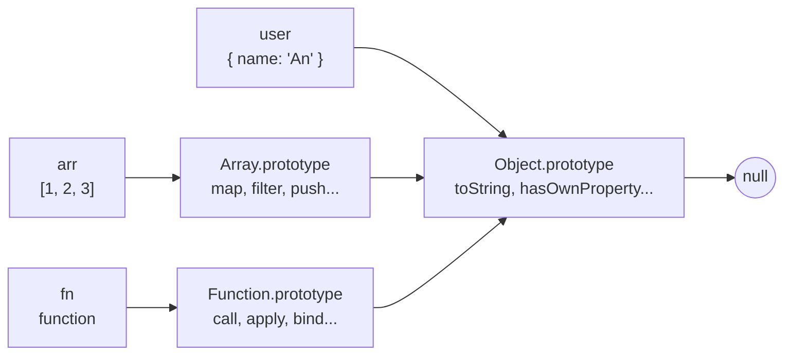
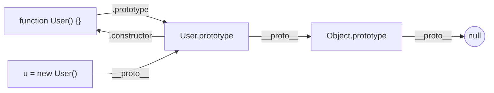

# Prototype và Prototypal Inheritance

Trong JavaScript, mỗi object đều có một **prototype** (nguyên mẫu) — một object "cha" mà nó có thể mượn các thuộc tính và phương thức. Khi bạn gọi một thuộc tính không có sẵn trên object, JavaScript sẽ tự động tìm ngược lên prototype, rồi prototype của prototype, tạo thành một chuỗi gọi là **prototype chain** (chuỗi nguyên mẫu). Cơ chế dùng lại code thông qua prototype này được gọi là **prototypal inheritance** (kế thừa qua nguyên mẫu), và đây chính là nền tảng đứng sau cú pháp `class` hiện đại.

---

## 🎯 Cần nắm gì sau bài này?

:::note[Ghi nhớ nhanh — ⭐ là phần quan trọng nhất]

- ⭐ **Mỗi object có `[[Prototype]]`** trỏ tới object cha, tạo thành **prototype chain** kết thúc ở `null`; JS tra property ngược lên chuỗi này.
- ⭐ **Prototype để chia sẻ method** — gắn vào `Constructor.prototype` giúp mọi instance dùng chung một bản, tiết kiệm bộ nhớ.
- **`class` chỉ là syntactic sugar** của prototype, không phải cơ chế mới; method trong class nằm trên `prototype`.
- **`__proto__` vs `prototype`** — `__proto__` thuộc mọi object (dùng `Object.getPrototypeOf`), `prototype` chỉ thuộc function (constructor).
- **`Object.create`** tạo object với prototype tùy chỉnh; `Object.create(null)` cho dictionary thuần không kế thừa.
- **Đừng sửa `Object.prototype`** — gây prototype pollution, là lỗ hổng bảo mật khi merge input không sanitize.

:::

---

## Mục lục

- [Vì sao prototype ra đời?](#vì-sao-prototype-ra-đời)
- [Prototype là gì?](#prototype-là-gì)
- [Prototype chain](#prototype-chain)
- [Tạo object với prototype tùy chỉnh](#tạo-object-với-prototype-tùy-chỉnh)
- [Class chỉ là sugar của prototype](#class-chỉ-là-sugar-của-prototype)
- [Quan hệ với constructor function](#quan-hệ-với-constructor-function)

---

## Vì sao prototype ra đời?

**Vấn đề:**

Nếu mỗi object tự chứa **bản sao** của mọi method thì cùng một hàm bị lặp
lại trên từng instance — tốn bộ nhớ và khó cập nhật chung:

```js
function createUser(name) {
  return {
    name,
    greet() { return `Hi ${this.name}`; }, // mỗi object một bản sao greet
  };
}

const u1 = createUser("An");
const u2 = createUser("Bình");

u1.greet === u2.greet; // false — hai function khác nhau, tốn RAM
// Có 1000 user → 1000 bản sao greet, sửa logic phải sửa mọi nơi
```

**Giải pháp:**

Prototype cho phép các instance **chia sẻ** method qua prototype chain thay
vì copy. Khi tra cứu thuộc tính, JS đi ngược chuỗi prototype để tìm — nhờ
vậy chỉ cần lưu một bản method, sửa một chỗ là mọi instance áp dụng:

```js
function User(name) {
  this.name = name;
}
User.prototype.greet = function () {
  return `Hi ${this.name}`;
}; // chỉ một bản greet duy nhất, dùng chung

const u1 = new User("An");
const u2 = new User("Bình");

u1.greet === u2.greet; // true — chung một function, tiết kiệm bộ nhớ
// Sửa User.prototype.greet một lần → mọi instance đổi theo
```

JS chọn mô hình **prototype-based** (lấy cảm hứng từ ngôn ngữ Self) thay vì
**class-based** như Java/C++. `class` của ES6 chỉ là lớp đường (syntactic
sugar) phủ lên prototype, không phải cơ chế mới.

:::tip[Dùng thực tế]

- **Thêm method dùng chung** cho mọi instance: gắn vào `Constructor.prototype`
  để mọi object chia sẻ một bản, không lặp lại trên từng instance.
- **Hiểu vì sao mọi mảng có `.map`**: `[].map` không nằm trên mảng mà nằm
  trên `Array.prototype` — mọi mảng đều mượn được qua chuỗi prototype.
- **Đọc/mở rộng built-in prototype**: biết các method như `.toUpperCase`,
  `.filter` sống ở đâu (`String.prototype`, `Array.prototype`) để tra cứu
  và debug nhanh.
- **Hiểu `instanceof`**: toán tử này kiểm tra `Constructor.prototype` có nằm
  trong chuỗi prototype của object hay không — gốc rễ chính là cơ chế này.

:::

---

## Prototype là gì?

JavaScript dùng **prototype-based inheritance** — không có class thật
như Java/C++. Mỗi object có một property ẩn `[[Prototype]]` trỏ tới
**object cha**.

Truy cập qua `Object.getPrototypeOf`:

```js
const user = { name: "An" };
Object.getPrototypeOf(user) === Object.prototype; // true
```

Hoặc qua `__proto__` (cũ, vẫn được hỗ trợ):

```js
user.__proto__ === Object.prototype; // true
```

---

## Prototype chain

Khi truy cập property của object, JS tìm theo **chuỗi prototype**:

```js
const user = { name: "An" };

user.toString();
// 1. Tìm trong user → không có
// 2. Tìm trong Object.prototype → có
// 3. Gọi method đó
```

Chain kết thúc ở `null`:

```
user → Object.prototype → null
arr  → Array.prototype  → Object.prototype → null
fn   → Function.prototype → Object.prototype → null
```



Mọi mũi tên trên đều là `[[Prototype]]` — khi không tìm thấy property,
JS đi theo mũi tên cho đến khi gặp `null`.

---

## Tạo object với prototype tùy chỉnh

```js
const animal = {
  eat() { console.log(`${this.name} đang ăn`); },
};

const dog = Object.create(animal); // dog kế thừa từ animal
dog.name = "Lulu";
dog.eat(); // "Lulu đang ăn"
```

`Object.create(null)` tạo object **không có prototype** — không có
`toString`, `hasOwnProperty`...:

```js
const plain = Object.create(null);
plain.x = 1;
plain.toString; // undefined
```

:::tip[Mẹo]

`Object.create(null)` rất hữu ích cho **dictionary thuần** — tránh xung
đột với property kế thừa:

```js
// Dictionary nguy hiểm
const dict = {};
dict["toString"] = "value"; // ghi đè method!
if (dict["toString"]) { /* always true vì toString tồn tại */ }

// Dictionary an toàn
const dict = Object.create(null);
dict["toString"] = "value"; // không xung đột
if (dict["toString"]) { /* chỉ true khi có key */ }
```

Map (ES6) là lựa chọn hiện đại hơn — type-safe key, iterable, có `size`.

:::

---

## Class chỉ là sugar của prototype

`class` (ES6) là **cú pháp đẹp** cho prototype, không phải tính năng mới:

```js
// ES6 class
class User {
  constructor(name) { this.name = name; }
  greet() { return `Hi ${this.name}`; }
}

// Tương đương prototype
function User(name) {
  this.name = name;
}
User.prototype.greet = function () {
  return "Hi " + this.name;
};

new User("An").greet(); // cả hai đều "Hi An"
```

Method khai báo trong class được gắn vào `User.prototype`, không phải
mỗi instance:

```js
const u1 = new User("An");
const u2 = new User("Bình");

u1.greet === u2.greet; // true — chung một function
```

---

## Quan hệ với constructor function

Mọi function có property `prototype` (chính là object sẽ làm parent cho
instance):

```js
function User(name) {
  this.name = name;
}

const u = new User("An");

u.__proto__ === User.prototype;        // true
User.prototype.constructor === User;   // true
```

`new` thực ra làm 4 việc:

1. Tạo object mới `{}`.
2. Đặt `__proto__` của object đó = `Function.prototype`.
3. Gọi function với `this` = object mới.
4. Trả về object (hoặc giá trị explicit return).

:::info[Phân tích]

**Câu hỏi phỏng vấn kinh điển**: "Khác biệt giữa `__proto__` và `prototype`?"

| | `__proto__` | `prototype` |
|--|--|--|
| Thuộc về | **Mọi object** (instance) | **Chỉ function** (constructor) |
| Trỏ tới | Object cha trong chain | Object sẽ làm cha của instance |
| Truy cập đúng | `Object.getPrototypeOf(obj)` | `Constructor.prototype` |

Mối quan hệ:

```js
function User() {}
const u = new User();

u.__proto__ === User.prototype;       // true
User.__proto__ === Function.prototype; // true (User cũng là object)
User.prototype.__proto__ === Object.prototype; // true
```

→ Chain của `u`: `u → User.prototype → Object.prototype → null`.



Hiểu được hai khái niệm này tách bạch là dấu hiệu nắm chắc JS — phân
biệt junior và mid/senior.

:::

:::warning[Cần lưu ý]

**Không sửa `Object.prototype` (prototype pollution)** — gây bug toàn hệ
thống:

```js
// KHÔNG BAO GIỜ
Object.prototype.toString = "x";
({}).toString; // "x" — mọi object bị ảnh hưởng!
```

Đây là loại lỗi bảo mật nghiêm trọng (CVE) khi nhận input không sanitize
ghi vào `__proto__`:

```js
const config = {};
const userInput = JSON.parse(req.body); // { __proto__: { isAdmin: true } }
Object.assign(config, userInput);

({}).isAdmin; // true — mọi object trong app!
```

→ Khi merge object từ untrusted source, dùng `Object.create(null)` hoặc
filter `__proto__` thủ công. Thư viện lodash đã từng có CVE về vấn đề này.

:::
