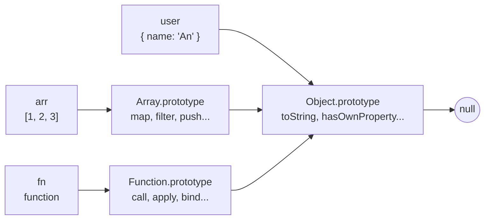
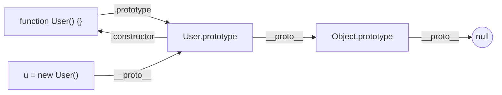

# Prototype và Prototypal Inheritance

Trong JavaScript, mỗi object đều có một **prototype** (nguyên mẫu) — một object "cha" mà nó có thể mượn các thuộc tính và phương thức. Khi bạn gọi một thuộc tính không có sẵn trên object, JavaScript sẽ tự động tìm ngược lên prototype, rồi prototype của prototype, tạo thành một chuỗi gọi là **prototype chain** (chuỗi nguyên mẫu). Cơ chế dùng lại code thông qua prototype này được gọi là **prototypal inheritance** (kế thừa qua nguyên mẫu), và đây chính là nền tảng đứng sau cú pháp `class` hiện đại.

[](pathname:///img/javascript/prototype.webp)

---

:::note[Ghi nhớ nhanh]

- ⭐ **Mỗi object có `[[Prototype]]`** trỏ tới object cha, tạo thành **prototype chain** kết thúc ở `null`; JS tra property ngược lên chuỗi này.
- ⭐ **Prototype để chia sẻ method** — gắn vào `Constructor.prototype` giúp mọi instance dùng chung một bản, tiết kiệm bộ nhớ.
- **`class` chỉ là syntactic sugar** của prototype, không phải cơ chế mới; method trong class nằm trên `prototype`.
- **`__proto__` vs `prototype`** — `__proto__` thuộc mọi object (dùng `Object.getPrototypeOf`), `prototype` chỉ thuộc function (constructor).
- **`Object.create`** tạo object với prototype tùy chỉnh; `Object.create(null)` cho dictionary thuần không kế thừa.
- **Đừng sửa `Object.prototype`** — gây prototype pollution, là lỗ hổng bảo mật khi merge input không sanitize.

:::

---

## Mục lục

- [Vì sao prototype ra đời?](#vì-sao-prototype-ra-đời)
- [Prototype là gì?](#prototype-là-gì)
- [Prototype chain](#prototype-chain)
- [Tạo object với prototype tùy chỉnh](#tạo-object-với-prototype-tùy-chỉnh)
- [Class chỉ là sugar của prototype](#class-chỉ-là-sugar-của-prototype)
- [Quan hệ với constructor function](#quan-hệ-với-constructor-function)
- [Câu hỏi phỏng vấn](#câu-hỏi-phỏng-vấn)

---

## Vì sao prototype ra đời?

**Vấn đề:**

Nếu mỗi object tự chứa **bản sao** của mọi method thì cùng một hàm bị lặp
lại trên từng instance — tốn bộ nhớ và khó cập nhật chung:

```js
function createUser(name) {
  return {
    name,
    greet() { return `Hi ${this.name}`; }, // mỗi object một bản sao greet
  };
}

const u1 = createUser("An");
const u2 = createUser("Bình");

u1.greet === u2.greet; // false — hai function khác nhau, tốn RAM
// Có 1000 user → 1000 bản sao greet, sửa logic phải sửa mọi nơi
```

**Giải pháp:**

Prototype cho phép các instance **chia sẻ** method qua prototype chain thay
vì copy. Khi tra cứu thuộc tính, JS đi ngược chuỗi prototype để tìm — nhờ
vậy chỉ cần lưu một bản method, sửa một chỗ là mọi instance áp dụng:

```js
function User(name) {
  this.name = name;
}
User.prototype.greet = function () {
  return `Hi ${this.name}`;
}; // chỉ một bản greet duy nhất, dùng chung

const u1 = new User("An");
const u2 = new User("Bình");

u1.greet === u2.greet; // true — chung một function, tiết kiệm bộ nhớ
// Sửa User.prototype.greet một lần → mọi instance đổi theo
```

JS chọn mô hình **prototype-based** (lấy cảm hứng từ ngôn ngữ Self) thay vì
**class-based** như Java/C++. `class` của ES6 chỉ là lớp đường (syntactic
sugar) phủ lên prototype, không phải cơ chế mới.

:::tip[Dùng thực tế]

- **Thêm method dùng chung** cho mọi instance: gắn vào `Constructor.prototype`
  để mọi object chia sẻ một bản, không lặp lại trên từng instance.
- **Hiểu vì sao mọi mảng có `.map`**: `[].map` không nằm trên mảng mà nằm
  trên `Array.prototype` — mọi mảng đều mượn được qua chuỗi prototype.
- **Đọc/mở rộng built-in prototype**: biết các method như `.toUpperCase`,
  `.filter` sống ở đâu (`String.prototype`, `Array.prototype`) để tra cứu
  và debug nhanh.
- **Hiểu `instanceof`**: toán tử này kiểm tra `Constructor.prototype` có nằm
  trong chuỗi prototype của object hay không — gốc rễ chính là cơ chế này.

:::

---

## Prototype là gì?

JavaScript dùng **prototype-based inheritance** — không có class thật
như Java/C++. Mỗi object có một property ẩn `[[Prototype]]` trỏ tới
**object cha**.

Truy cập qua `Object.getPrototypeOf`:

```js
const user = { name: "An" };
Object.getPrototypeOf(user) === Object.prototype; // true
```

Hoặc qua `__proto__` (cũ, vẫn được hỗ trợ):

```js
user.__proto__ === Object.prototype; // true
```

---

## Prototype chain

Khi truy cập property của object, JS tìm theo **chuỗi prototype**:

```js
const user = { name: "An" };

user.toString();
// 1. Tìm trong user → không có
// 2. Tìm trong Object.prototype → có
// 3. Gọi method đó
```

Chain kết thúc ở `null`:

```
user → Object.prototype → null
arr  → Array.prototype  → Object.prototype → null
fn   → Function.prototype → Object.prototype → null
```



Mọi mũi tên trên đều là `[[Prototype]]` — khi không tìm thấy property,
JS đi theo mũi tên cho đến khi gặp `null`.

---

## Tạo object với prototype tùy chỉnh

```js
const animal = {
  eat() { console.log(`${this.name} đang ăn`); },
};

const dog = Object.create(animal); // dog kế thừa từ animal
dog.name = "Lulu";
dog.eat(); // "Lulu đang ăn"
```

`Object.create(null)` tạo object **không có prototype** — không có
`toString`, `hasOwnProperty`...:

```js
const plain = Object.create(null);
plain.x = 1;
plain.toString; // undefined
```

:::tip[Mẹo]

`Object.create(null)` rất hữu ích cho **dictionary thuần** — tránh xung
đột với property kế thừa:

```js
// Dictionary nguy hiểm
const dict = {};
dict["toString"] = "value"; // ghi đè method!
if (dict["toString"]) { /* always true vì toString tồn tại */ }

// Dictionary an toàn
const dict = Object.create(null);
dict["toString"] = "value"; // không xung đột
if (dict["toString"]) { /* chỉ true khi có key */ }
```

Map (ES6) là lựa chọn hiện đại hơn — type-safe key, iterable, có `size`.

:::

---

## Class chỉ là sugar của prototype

`class` (ES6) là **cú pháp đẹp** cho prototype, không phải tính năng mới:

```js
// ES6 class
class User {
  constructor(name) { this.name = name; }
  greet() { return `Hi ${this.name}`; }
}

// Tương đương prototype
function User(name) {
  this.name = name;
}
User.prototype.greet = function () {
  return "Hi " + this.name;
};

new User("An").greet(); // cả hai đều "Hi An"
```

Method khai báo trong class được gắn vào `User.prototype`, không phải
mỗi instance:

```js
const u1 = new User("An");
const u2 = new User("Bình");

u1.greet === u2.greet; // true — chung một function
```

---

## Quan hệ với constructor function

Mọi function có property `prototype` (chính là object sẽ làm parent cho
instance):

```js
function User(name) {
  this.name = name;
}

const u = new User("An");

u.__proto__ === User.prototype;        // true
User.prototype.constructor === User;   // true
```

`new` thực ra làm 4 việc:

1. Tạo object mới `{}`.
2. Đặt `__proto__` của object đó = `Constructor.prototype`.
3. Gọi function với `this` = object mới.
4. Trả về object (hoặc giá trị explicit return).

:::info[Phân tích]

**Câu hỏi phỏng vấn kinh điển**: "Khác biệt giữa `__proto__` và `prototype`?"

| | `__proto__` | `prototype` |
|--|--|--|
| Thuộc về | **Mọi object** (instance) | **Chỉ function** (constructor) |
| Trỏ tới | Object cha trong chain | Object sẽ làm cha của instance |
| Truy cập đúng | `Object.getPrototypeOf(obj)` | `Constructor.prototype` |

Mối quan hệ:

```js
function User() {}
const u = new User();

u.__proto__ === User.prototype;       // true
User.__proto__ === Function.prototype; // true (User cũng là object)
User.prototype.__proto__ === Object.prototype; // true
```

→ Chain của `u`: `u → User.prototype → Object.prototype → null`.



Hiểu được hai khái niệm này tách bạch là dấu hiệu nắm chắc JS — phân
biệt junior và mid/senior.

:::

:::warning[Cần lưu ý]

**Không sửa `Object.prototype` (prototype pollution)** — gây bug toàn hệ
thống:

```js
// KHÔNG BAO GIỜ
Object.prototype.toString = "x";
({}).toString; // "x" — mọi object bị ảnh hưởng!
```

Đây là loại lỗi bảo mật nghiêm trọng (CVE) khi nhận input không sanitize
ghi vào `__proto__`:

```js
const config = {};
const userInput = JSON.parse(req.body); // { __proto__: { isAdmin: true } }
Object.assign(config, userInput);

({}).isAdmin; // true — mọi object trong app!
```

→ Khi merge object từ untrusted source, dùng `Object.create(null)` hoặc
filter `__proto__` thủ công. Thư viện lodash đã từng có CVE về vấn đề này.

:::

---

## Câu hỏi phỏng vấn

Những câu thường gặp về chủ đề này. Tự trả lời trước, rồi bấm **Xem đáp án** để đối chiếu.

**1. `Prototypal inheritance` là gì? Nó khác mô hình class-based của Java/C++ ở chỗ nào?**

<details className="qa">
<summary>Xem đáp án</summary>

**Prototypal inheritance** là cơ chế trong đó mỗi object có một liên kết ẩn `[[Prototype]]` trỏ tới một **object khác**. Khi truy cập property không có sẵn, engine đi ngược theo chuỗi liên kết (prototype chain) để tìm. Nhờ vậy nhiều object có thể **dùng chung** một bản method thay vì mỗi object giữ một bản sao.

| | Class-based (Java/C++) | Prototype-based (JS) |
|---|---|---|
| Đơn vị kế thừa | Class — bản thiết kế, không tồn tại lúc chạy | Object thật, tồn tại trong bộ nhớ |
| Quan hệ | Class kế thừa class, instance sinh từ class | Object liên kết tới object |
| Thời điểm cố định | Lúc compile | Lúc runtime — đổi prototype được |
| Thêm method sau khi tạo | Không | Có — sửa `prototype` là mọi instance đổi theo |

```js
const animal = { eat() { console.log(`${this.name} đang ăn`); } };
const dog = Object.create(animal);   // object kế thừa object
dog.name = "Lulu";
dog.eat();                           // "Lulu đang ăn"
```

JS lấy mô hình này từ ngôn ngữ **Self**. `class` của ES6 chỉ là lớp đường phủ lên đúng cơ chế prototype này, không phải kế thừa class-based thật.

</details>

**2. `[[Prototype]]`, `__proto__` và `Object.getPrototypeOf()` liên quan với nhau ra sao? Cái nào nên dùng trong code mới?**

<details className="qa">
<summary>Xem đáp án</summary>

- **`[[Prototype]]`** là **internal slot** — tên trong đặc tả ECMAScript cho liên kết ẩn từ object tới prototype của nó. Bạn không truy cập trực tiếp được, nó chỉ là khái niệm trong spec.
- **`__proto__`** là **accessor property** (getter/setter) nằm trên `Object.prototype`, đọc và ghi vào `[[Prototype]]`. Nó vốn là phần mở rộng riêng của trình duyệt, sau mới được chuẩn hoá ở **Annex B** — tức chuẩn hoá để tương thích ngược, **không khuyến khích dùng**.
- **`Object.getPrototypeOf(obj)` / `Object.setPrototypeOf(obj, p)`** là API chính thức (ES5/ES6) để đọc và ghi cùng giá trị đó.

```js
const user = { name: "An" };

user.__proto__ === Object.prototype;                 // true
Object.getPrototypeOf(user) === Object.prototype;    // true
```

**Code mới nên dùng `Object.getPrototypeOf`.** Lý do: `__proto__` không tồn tại trên object tạo bằng `Object.create(null)`, có thể bị shadow, và là nguồn gốc của lỗ hổng **prototype pollution** khi ghi từ dữ liệu người dùng. Muốn *tạo* object với prototype chỉ định thì dùng `Object.create(proto)` — vừa rõ ràng vừa không phạt hiệu năng.

</details>

**3. Câu kinh điển: phân biệt `__proto__` và `prototype`. Mỗi cái thuộc về đối tượng nào và trỏ tới đâu?**

<details className="qa">
<summary>Xem đáp án</summary>

| | `__proto__` | `prototype` |
|---|---|---|
| Thuộc về | **Mọi object** (kể cả function, vì function cũng là object) | **Chỉ function** (constructor) |
| Trỏ tới | Object cha trong prototype chain | Object sẽ trở thành cha của các instance sinh ra bằng `new` |
| Truy cập đúng chuẩn | `Object.getPrototypeOf(obj)` | `Constructor.prototype` |
| Vai trò | Liên kết **đang có** của object | **Khuôn** dùng để gắn liên kết cho instance tương lai |

```js
function User() {}
const u = new User();

u.__proto__ === User.prototype;                 // true — new gắn liên kết này
User.__proto__ === Function.prototype;          // true — User cũng là object
User.prototype.__proto__ === Object.prototype;  // true
u.prototype;                                    // undefined — u không phải function
```

Cách nhớ: `prototype` là **thứ constructor phát ra**, `__proto__` là **thứ object đang cầm**. Chain của `u` là `u → User.prototype → Object.prototype → null`. Nhầm lẫn hai khái niệm này là dấu hiệu chưa nắm chắc mô hình object của JS.

</details>

**4. Mô tả từng bước engine làm gì khi bạn gọi `user.toString()` trên một object thuần. Chuỗi prototype kết thúc ở đâu?**

<details className="qa">
<summary>Xem đáp án</summary>

```js
const user = { name: "An" };
user.toString(); // "[object Object]"
```

Các bước engine thực hiện:

1. Tìm **own property** `toString` trên chính `user` → không có.
2. Lấy `[[Prototype]]` của `user`, ở đây là `Object.prototype` → tìm `toString` → **tìm thấy**.
3. Gọi function đó với `this` = `user` (điểm quan trọng: `this` luôn là object **gốc** khởi đầu lời gọi, không phải object chứa method).
4. Trả về kết quả.

Nếu không tìm thấy, engine tiếp tục đi lên cho tới khi `[[Prototype]]` bằng **`null`** — đó là điểm kết thúc chuỗi. Không tìm thấy thì biểu thức trả `undefined`, và nếu bạn gọi nó như hàm sẽ nhận `TypeError: ... is not a function`.

Ví dụ các chain khác:

```
user → Object.prototype → null
arr  → Array.prototype → Object.prototype → null
fn   → Function.prototype → Object.prototype → null
```

`Object.create(null)` tạo object có `[[Prototype]]` bằng `null` ngay từ đầu — chain dài đúng một mắt xích.

</details>

**5. Vì sao mọi mảng đều có `.map` dù bạn không định nghĩa? `.map` thực sự nằm ở đâu?**

<details className="qa">
<summary>Xem đáp án</summary>

Vì `.map` **không nằm trên mảng** — nó nằm trên **`Array.prototype`**, và mọi mảng đều có `[[Prototype]]` trỏ tới đó.

```js
const arr = [1, 2, 3];

Object.hasOwn(arr, "map");                    // false — không phải own property
Object.getPrototypeOf(arr) === Array.prototype; // true
arr.map === Array.prototype.map;              // true — chung một function
```

Khi gọi `arr.map(...)`, engine tìm `map` trên `arr` → không có → đi lên `Array.prototype` → tìm thấy → gọi với `this = arr`.

Chain đầy đủ của một mảng: `arr → Array.prototype → Object.prototype → null`. Đó cũng là lý do mảng vừa có `map`, `filter`, `push` (từ `Array.prototype`) vừa có `toString`, `hasOwnProperty` (từ `Object.prototype`).

Ích lợi của thiết kế này: dù bạn tạo một triệu mảng, trong bộ nhớ vẫn chỉ có **một bản** của `map`. Nguyên tắc tương tự áp dụng cho `"abc".toUpperCase()` (`String.prototype`) hay `fn.bind()` (`Function.prototype`).

</details>

**6. Toán tử `new` thực hiện những bước nào? Nếu constructor `return` một object thì kết quả của `new` là gì?**

<details className="qa">
<summary>Xem đáp án</summary>

`new Constructor(args)` làm 4 việc:

1. Tạo một object rỗng mới.
2. Gắn `[[Prototype]]` của object đó bằng **`Constructor.prototype`**.
3. Gọi `Constructor` với `this` = object mới, truyền `args` vào.
4. Nếu constructor **không** return một object thì trả về object mới; nếu có thì trả về chính object được return.

Mô phỏng bằng code:

```js
function myNew(Ctor, ...args) {
  const obj = Object.create(Ctor.prototype);   // bước 1 + 2
  const result = Ctor.apply(obj, args);        // bước 3
  return typeof result === "object" && result !== null ? result : obj; // bước 4
}
```

**Return một object thì sao?** `new` trả về **object đó**, bỏ qua object vừa tạo:

```js
function A() { this.x = 1; return { y: 2 }; }
new A();          // { y: 2 } — mất this.x

function B() { this.x = 1; return 42; }
new B();          // { x: 1 } — return primitive bị BỎ QUA
```

Chỉ giá trị **object** (kể cả mảng, function) mới ghi đè; primitive thì bị phớt lờ. Đây là nền tảng của pattern singleton viết bằng constructor.

</details>

**7. `Object.create(proto)` khác `new Constructor()` thế nào? `Object.create(null)` tạo ra object đặc biệt ở chỗ nào và dùng khi nào?**

<details className="qa">
<summary>Xem đáp án</summary>

| | `Object.create(proto)` | `new Constructor()` |
|---|---|---|
| Prototype của object mới | Chính `proto` bạn truyền vào | `Constructor.prototype` |
| Chạy hàm khởi tạo | **Không** | Có — thân constructor chạy với `this` |
| Object trả về | Rỗng hoàn toàn (trừ `propertiesObject` tuỳ chọn) | Đã có các property gán trong constructor |

```js
const animal = { eat() { console.log(`${this.name} đang ăn`); } };
const dog = Object.create(animal);  // chưa có property nào
dog.name = "Lulu";
dog.eat();                          // "Lulu đang ăn"
```

**`Object.create(null)`** tạo object **không có prototype** — chain kết thúc ngay lập tức. Nó không có `toString`, `hasOwnProperty`, `valueOf`, `__proto__`:

```js
const dict = Object.create(null);
dict.toString = "value";   // không ghi đè gì cả, chỉ là data thường
dict.hasOwnProperty;       // undefined
Object.hasOwn(dict, "toString"); // true — vẫn kiểm tra được
```

Dùng khi cần **dictionary thuần** với key đến từ dữ liệu ngoài: tránh va chạm với property kế thừa và miễn nhiễm với prototype pollution qua `__proto__`. Lựa chọn hiện đại hơn cho nhu cầu này là `Map`.

</details>

**8. Đặt method trên `Constructor.prototype` khác gì đặt trong thân constructor? Vì sao `u1.greet === u2.greet` lại là `true` ở cách thứ nhất?**

<details className="qa">
<summary>Xem đáp án</summary>

Đặt trong **thân constructor** nghĩa là mỗi lần `new` chạy, một **function object mới** được tạo và gán làm own property của instance. 1000 instance → 1000 bản sao.

Đặt trên **prototype** thì function chỉ được tạo **một lần**, mọi instance chia sẻ qua prototype chain.

```js
function A(name) {
  this.name = name;
  this.greet = function () { return `Hi ${this.name}`; }; // mỗi instance một bản
}
new A("An").greet === new A("Bình").greet;   // false

function B(name) { this.name = name; }
B.prototype.greet = function () { return `Hi ${this.name}`; };
new B("An").greet === new B("Bình").greet;   // true — cùng một function object
```

`=== ` so sánh tham chiếu. Ở cách prototype, cả `u1.greet` và `u2.greet` đều **không phải own property** — engine tra lên và lấy đúng một object hàm nằm trên `B.prototype`, nên hai biểu thức trỏ tới cùng địa chỉ → `true`.

Lợi ích thêm: tiết kiệm bộ nhớ và sửa `B.prototype.greet` một lần là mọi instance đang sống đổi theo. Method trong `class` cũng nằm trên prototype đúng như vậy.

</details>

**9. `class` của ES6 có phải cơ chế kế thừa mới không? Chỉ ra vài điểm mà `class` KHÔNG chỉ là syntactic sugar (không hoist, buộc gọi bằng `new`, luôn strict mode...).**

<details className="qa">
<summary>Xem đáp án</summary>

**Không** — mô hình kế thừa bên dưới vẫn 100% là prototype chain. Method khai báo trong class nằm trên `Class.prototype`, `typeof Class === "function"`, `Object.getPrototypeOf(instance) === Class.prototype`.

Nhưng gọi là "chỉ sugar" thì chưa đủ. Những khác biệt **thật** so với constructor function:

- **Bắt buộc gọi bằng `new`** — `User()` ném `TypeError`, còn function thường gọi thiếu `new` thì `this` thành `undefined`/global và âm thầm sai.
- **Không hoisting theo kiểu dùng được trước khi khai báo** — class nằm trong **Temporal Dead Zone**, dùng trước khi khai báo là `ReferenceError`; function declaration thì gọi trước vẫn chạy.
- **Luôn ở strict mode**, kể cả khi file không có `"use strict"`.
- **Method là non-enumerable** — không lộ ra khi `for...in`, khác với gán tay lên `prototype`.
- **`super`, class fields, private field `#x`, static block** — không có cách viết tương đương gọn bằng constructor function.
- **`new.target`, kế thừa built-in** (`class MyArr extends Array`) hoạt động đúng, còn cách cũ thì không.

Tóm lại: cú pháp mới + vài ràng buộc an toàn mới, nhưng **cơ chế** thì vẫn là prototype.

</details>

**10. `instanceof` hoạt động dựa trên cơ chế nào? Vì sao nó có thể cho kết quả sai giữa các realm khác nhau?**

<details className="qa">
<summary>Xem đáp án</summary>

`obj instanceof Ctor` đi dọc **prototype chain** của `obj` và kiểm tra xem có mắt xích nào **chính là** `Ctor.prototype` hay không:

```js
function myInstanceof(obj, Ctor) {
  let proto = Object.getPrototypeOf(obj);
  while (proto !== null) {
    if (proto === Ctor.prototype) return true;
    proto = Object.getPrototypeOf(proto);
  }
  return false;
}
```

Vì phép so sánh là `===` trên **tham chiếu**, nên nó phụ thuộc vào việc hai bên cùng trỏ tới đúng một object `Ctor.prototype`.

**Vấn đề cross-realm:** mỗi `iframe`, worker hay vm context là một **realm** riêng với bộ global object riêng — có `Array`, `Object`, `Array.prototype` **khác**. Mảng tạo trong iframe kế thừa `Array.prototype` của iframe đó:

```js
const arr = new iframe.contentWindow.Array(1, 2, 3);
arr instanceof Array;  // false — khác realm
Array.isArray(arr);    // true  — kiểm tra internal slot, vượt realm
```

Vì thế nên dùng `Array.isArray()`, `Object.prototype.toString.call()` hoặc duck typing thay cho `instanceof` ở ranh giới realm. Lưu ý thêm: `Symbol.hasInstance` cho phép class tự định nghĩa lại hành vi của `instanceof`.

</details>

**11. `Constructor.prototype.constructor` là gì? Chuyện gì hỏng nếu bạn gán đè `Constructor.prototype = { ... }`?**

<details className="qa">
<summary>Xem đáp án</summary>

Khi bạn khai báo một function, JS tự tạo cho nó object `prototype`, và object đó có sẵn property `constructor` **trỏ ngược lại chính function**:

```js
function User() {}
User.prototype.constructor === User;   // true
new User().constructor === User;       // true — kế thừa qua chain
```

Nếu **gán đè** cả object prototype, liên kết ngược đó biến mất:

```js
function User(name) { this.name = name; }
User.prototype = {
  greet() { return `Hi ${this.name}`; },
};

const u = new User("An");
u.greet();                // "Hi An" — vẫn chạy
u.constructor === User;   // false!
u.constructor === Object; // true — kế thừa từ Object.prototype
```

Hậu quả: code dựa vào `obj.constructor` để clone (`new obj.constructor()`), để log tên class (`obj.constructor.name`) hay để nhận diện kiểu sẽ sai. Ngoài ra instance tạo **trước** khi gán đè vẫn giữ prototype cũ → hai nhóm instance không nhất quán.

Cách xử lý: hoặc gán từng method (`User.prototype.greet = ...`), hoặc khôi phục thủ công:

```js
User.prototype = { constructor: User, greet() { /* ... */ } };
```

</details>

**12. Khi gán `obj.toString = ...`, prototype có bị ảnh hưởng không? Việc ghi property có đi theo prototype chain giống việc đọc không?**

<details className="qa">
<summary>Xem đáp án</summary>

**Không** — prototype hoàn toàn không bị ảnh hưởng. Đọc và ghi hoạt động khác nhau:

- **Đọc**: nếu không có own property, engine **đi ngược prototype chain** để tìm.
- **Ghi**: engine tạo (hoặc cập nhật) **own property** ngay trên chính object đó, **không đi lên chain**. Property mới này **che khuất** (shadow) property cùng tên trên prototype.

```js
const obj = {};
obj.toString = () => "custom";

obj.toString();                    // "custom" — own property che khuất
({}).toString();                   // "[object Object]" — Object.prototype nguyên vẹn
Object.hasOwn(obj, "toString");    // true
delete obj.toString;
obj.toString();                    // "[object Object]" — lộ lại bản kế thừa
```

Đây là lý do `Object.prototype` an toàn khi bạn chỉ gán lên instance — muốn làm ô nhiễm nó thì phải ghi trực tiếp `Object.prototype.x = ...` hoặc ghi qua `__proto__`.

**Ngoại lệ quan trọng:** nếu property trên prototype là một **accessor có setter**, phép gán sẽ gọi setter đó thay vì tạo own property. Và nếu nó là data property **read-only**, phép gán thất bại im lặng (sloppy mode) hoặc ném `TypeError` (strict mode).

</details>

**13. Vì sao `Object.setPrototypeOf` bị khuyến cáo là hại performance? Nên làm gì thay thế?**

<details className="qa">
<summary>Xem đáp án</summary>

Engine tối ưu việc truy cập property bằng **hidden class (shape)** và **inline cache**: nó ghi nhớ "object có shape X thì property `y` nằm ở vị trí này, prototype là object kia" rồi sinh mã máy nhanh dựa trên giả định đó.

`Object.setPrototypeOf(obj, proto)` **thay đổi prototype của một object đã tồn tại**, phá vỡ giả định đó. Hậu quả:

- Mọi inline cache liên quan tới object (và các object cùng shape) bị vô hiệu.
- Code đã tối ưu bị **deoptimize**, quay về chạy bytecode.
- Engine có thể đánh dấu object vào chế độ "dictionary mode" chậm hơn hẳn.

Đây là thao tác được cảnh báo rõ trong tài liệu MDN và V8 — chi phí cao hơn nhiều so với việc tạo mới một object.

**Thay thế:** quyết định prototype **ngay lúc tạo**:

```js
const dog = Object.create(animal);          // đặt prototype lúc khởi tạo
const obj = { __proto__: animal, name: "Lulu" }; // literal, cũng nhanh
class Dog extends Animal {}                 // cách chuẩn cho hệ thống class
```

Nếu buộc phải "đổi kiểu" lúc chạy thì thường nên tạo object mới và copy dữ liệu sang, thay vì setPrototypeOf.

</details>

**14. Giải thích các biểu thức sau: `u.__proto__ === User.prototype`, `User.__proto__ === Function.prototype`, `User.prototype.__proto__ === Object.prototype`.**

<details className="qa">
<summary>Xem đáp án</summary>

Cả ba đều là **`true`**, và mỗi câu nói về một chuỗi khác nhau:

```js
function User(name) { this.name = name; }
const u = new User("An");
```

- **`u.__proto__ === User.prototype`** — khi `new` chạy, nó gắn `[[Prototype]]` của object mới bằng `User.prototype`. Đây là lý do `u` mượn được mọi method gắn trên `User.prototype`.
- **`User.__proto__ === Function.prototype`** — `User` bản thân nó là một **function**, mà function cũng là object. Chuỗi prototype của nó đi qua `Function.prototype`, nên `User` có sẵn `call`, `apply`, `bind`.
- **`User.prototype.__proto__ === Object.prototype`** — `User.prototype` là một object thuần được JS tự tạo, nên cha của nó là `Object.prototype`. Nhờ vậy instance của `User` vẫn dùng được `toString`, `hasOwnProperty`.

Ghép lại thành hai chuỗi song song:

```
u    → User.prototype → Object.prototype → null   (chuỗi của instance)
User → Function.prototype → Object.prototype → null (chuỗi của chính function)
```

Nhớ: `prototype` là property của function, `__proto__` là liên kết của mọi object.

</details>

**15. `prototype pollution` là gì? Mô tả kịch bản tấn công qua `__proto__` khi merge JSON từ người dùng, và cách phòng.**

<details className="qa">
<summary>Xem đáp án</summary>

**Prototype pollution** là lỗ hổng cho phép kẻ tấn công ghi property vào `Object.prototype`. Vì gần như mọi object đều kế thừa từ đó, property độc hại lập tức xuất hiện trên **toàn bộ object trong ứng dụng**.

Kịch bản kinh điển — hàm merge/clone đệ quy không lọc key:

```js
const config = {};
const userInput = JSON.parse(req.body); // {"__proto__": {"isAdmin": true}}
deepMerge(config, userInput);           // ghi vào Object.prototype

({}).isAdmin;        // true — mọi object trong app!
if (user.isAdmin) { /* bypass phân quyền */ }
```

Ngoài leo thang quyền, nó còn gây DoS (ghi đè `toString`), hoặc biến thành RCE khi kết hợp với template engine. Nhiều thư viện lớn (lodash, jQuery, minimist) từng dính CVE dạng này.

**Cách phòng:**

- **Lọc key nguy hiểm**: bỏ qua `__proto__`, `constructor`, `prototype` trong mọi hàm merge/set đệ quy.
- Dùng **`Object.create(null)`** làm object đích, hoặc `Map` cho dữ liệu đến từ người dùng.
- **`Object.freeze(Object.prototype)`** ở điểm khởi động ứng dụng.
- Dùng **schema validation** (Zod, Ajv) — chỉ nhận đúng field đã khai báo.
- Ưu tiên thư viện đã vá và dùng `structuredClone` thay cho merge tự viết.

</details>

**16. Trong ngữ cảnh prototype, `in` và `Object.hasOwn` cho kết quả khác nhau ra sao? Vì sao `for...in` hay gây bug?**

<details className="qa">
<summary>Xem đáp án</summary>

`in` tra **toàn bộ prototype chain**, còn `Object.hasOwn` chỉ xét **own property**:

```js
const animal = { eat() {} };
const dog = Object.create(animal);
dog.name = "Lulu";

"name" in dog;                  // true
"eat" in dog;                   // true  — kế thừa từ animal
"toString" in dog;              // true  — kế thừa từ Object.prototype
Object.hasOwn(dog, "eat");      // false
Object.hasOwn(dog, "name");     // true
```

**`for...in` gây bug** vì nó duyệt **mọi property enumerable, kể cả kế thừa**:

```js
for (const k in dog) console.log(k); // "name", "eat"
```

Method built-in không lộ ra (chúng non-enumerable), nhưng property bạn hoặc thư viện gắn lên prototype thì có — nghĩa là một đoạn code ở file khác cũng có thể làm vòng lặp của bạn chạy sai. Đó là lý do code phòng thủ hay viết `if (!Object.hasOwn(obj, k)) continue;`.

Thực tế nên tránh `for...in`: dùng `Object.keys` / `Object.entries` cho object, `for...of` cho mảng và iterable. Prototype pollution càng làm `for...in` nguy hiểm hơn.

</details>

**17. `class B extends A` và `super()` được ánh xạ sang prototype như thế nào?**

<details className="qa">
<summary>Xem đáp án</summary>

`extends` thiết lập **hai** liên kết prototype, không phải một:

```js
class A { greet() { return "A"; } }
class B extends A { }

Object.getPrototypeOf(B.prototype) === A.prototype; // true — kế thừa method instance
Object.getPrototypeOf(B) === A;                     // true — kế thừa static member
```

- Liên kết thứ nhất nối `B.prototype → A.prototype`, nhờ đó instance của `B` tra được method của `A` qua chain: `b → B.prototype → A.prototype → Object.prototype → null`.
- Liên kết thứ hai nối chính `B → A`, nhờ đó `B` thừa hưởng cả **static method** của `A`.

**`super()`** trong constructor gọi constructor của lớp cha để khởi tạo phần dữ liệu của nó với `this` hiện tại. Trong class con, `this` **chưa tồn tại** cho tới khi `super()` chạy xong — dùng `this` trước đó là `ReferenceError`:

```js
class B extends A {
  constructor(name) {
    // this.x = 1;   // ReferenceError
    super();
    this.name = name;
  }
}
```

Trong method, `super.greet()` tra `greet` bắt đầu từ prototype của lớp cha nhưng vẫn chạy với `this` là instance hiện tại.

</details>

**18. Vì sao không nên mở rộng prototype của built-in (`Array.prototype.myMethod = ...`)?**

<details className="qa">
<summary>Xem đáp án</summary>

Sửa `Array.prototype`, `Object.prototype`, `String.prototype`... là thay đổi **toàn cục**, ảnh hưởng mọi đoạn code trong ứng dụng, kể cả thư viện bên thứ ba. Các rủi ro:

- **Xung đột tên**: hai thư viện cùng thêm `Array.prototype.contains` với hành vi khác nhau → bên nào load sau thắng, bug rất khó truy.
- **Xung đột với chuẩn tương lai**: đây là chuyện có thật — đề xuất `Array.prototype.flatten` phải đổi tên thành `flat` vì MooTools đã định nghĩa `flatten` và giữ nguyên tên sẽ làm hỏng hàng loạt website ("SmooshGate").
- **Phá `for...in`**: property thêm tay mặc định là **enumerable**, nên nó lọt vào mọi vòng `for...in` trên mảng/object.
- **Hại performance**: engine phải deoptimize các inline cache dựa trên shape của built-in.
- **Bảo mật**: với `Object.prototype` thì đó chính là prototype pollution.

**Nên làm gì thay thế:** viết hàm thuần (`function chunk(arr, n) {...}`), dùng utility module, hoặc bọc bằng class riêng. Nếu bắt buộc phải thêm, ít nhất dùng `Object.defineProperty` với `enumerable: false` và đặt tên qua `Symbol` để tránh đụng chuẩn.

</details>
