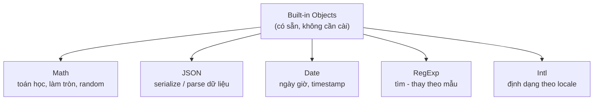

# Built-in Objects

**Built-in** (tích hợp sẵn) nghĩa là những thứ JavaScript **đã có sẵn**, bạn dùng được ngay mà không cần cài thêm hay tự viết. **Built-in Objects** (đối tượng tích hợp sẵn) là bộ các đối tượng/công cụ có sẵn trong ngôn ngữ — như `JSON`, `Math`, `Date`, `RegExp`, `Intl` — giúp xử lý các tác vụ phổ biến (tính toán, ngày giờ, chuỗi, dữ liệu...).

[](pathname:///img/javascript/built-in.webp)

---

:::note[Ghi nhớ nhanh]

- ⭐ **Built-in object có sẵn, không cần cài** — `JSON`, `Math`, `Date`, `RegExp`, `Intl` xử lý các tác vụ phổ biến thay vì tự viết.
- ⭐ **`JSON.stringify`/`JSON.parse`** serialize dữ liệu, nhưng bỏ qua `function`/`undefined`/`symbol`, lỗi với `bigint`, và biến `Date` thành chuỗi ISO.
- **`Math`** gồm hằng số và method static (làm tròn, `max`/`min`, `random`); `Math.random()` không dùng cho crypto — dùng `crypto`.
- **`Date`** nhiều bất tiện (`getMonth()` 0-11, mutable); năm 2026 nên dùng date-fns/Day.js/Luxon hoặc Temporal API.
- **`RegExp`** match theo mẫu với flag (`g`, `i`, `m`, `s`, `u`, `y`), capture group và named group.
- **`Intl`** (chuẩn ECMA-402) format số, tiền, ngày giờ theo locale mà không cần thư viện.

:::

---

## Mục lục

- [Vì sao có các built-in object?](#vì-sao-có-các-built-in-object)
- [JSON](#json)
- [Math](#math)
- [Date](#date)
- [RegExp](#regexp)
- [Intl](#intl)
- [Câu hỏi phỏng vấn](#câu-hỏi-phỏng-vấn)

---

## Vì sao có các built-in object?

**Vấn đề:** Các tác vụ phổ biến (tính toán, xử lý ngày giờ, chuyển dữ liệu sang chuỗi để truyền/lưu, tìm kiếm theo mẫu) nếu dev tự viết sẽ lặp lại khắp nơi, dễ sai và khó bảo trì.

```js
// Tự viết hàm làm tròn, đổi object thành chuỗi, validate email...
function round(n) {
  return n >= 0 ? (n - Math.floor(n) >= 0.5 ? Math.floor(n) + 1 : Math.floor(n)) : 0;
}

function toJson(obj) {
  let s = "{";
  for (const k in obj) s += `"${k}":"${obj[k]}",`; // dễ sai với số, mảng, ký tự đặc biệt
  return s.slice(0, -1) + "}";
}
// Mỗi project viết lại một kiểu → bug khắp nơi
```

**Giải pháp:** JavaScript cung cấp sẵn các built-in object đã được chuẩn hoá và tối ưu — dùng ngay, không cần tự viết:

```js
Math.round(3.5);              // 4 — toán học
new Date().toISOString();     // ngày giờ
JSON.stringify({ name: "An" }); // '{"name":"An"}' — đổi sang chuỗi
/^[^@]+@[^@]+\.[^@]+$/.test("a@b.com"); // true — tìm theo mẫu
```

Các built-in object hay dùng nhất, phân theo mục đích:



:::tip[Dùng thực tế]

- **`Math.random()` + `Math.round()`**: random xí ngầu, làm tròn giá tiền, chia phần trăm.
- **`Date` / `Intl.DateTimeFormat`**: hiển thị "ngày đăng bài", đếm ngược, định dạng theo `vi-VN`.
- **`JSON.stringify` / `JSON.parse`**: gửi body khi gọi API, lưu/đọc `localStorage`.
- **`RegExp`**: validate email/số điện thoại, tách chuỗi, tìm-thay theo mẫu.

:::

---

## JSON

JSON (JavaScript Object Notation) — format text để serialize dữ liệu.

```js
const user = { name: "An", age: 25 };

const json = JSON.stringify(user);
// '{"name":"An","age":25}'

const obj = JSON.parse(json);
// { name: "An", age: 25 }
```

Format đẹp khi log:

```js
JSON.stringify(user, null, 2);
// {
//   "name": "An",
//   "age": 25
// }
```

Replacer + reviver:

```js
// Lọc property
JSON.stringify(user, ["name"]);    // '{"name":"An"}'

// Custom transform
JSON.stringify(user, (k, v) => k === "age" ? undefined : v);

JSON.parse(json, (k, v) => k === "age" ? v + 1 : v);
```

:::warning[Cần lưu ý]

`JSON.stringify` **bỏ qua** một số kiểu:

```js
JSON.stringify({
  fn: () => {},          // function → bỏ
  undef: undefined,      // undefined → bỏ
  sym: Symbol(),         // symbol → bỏ
  big: 10n,              // bigint → TypeError
});
// '{}'

JSON.stringify({ d: new Date() });
// '{"d":"2026-01-01T..."}' — Date thành string ISO

JSON.stringify(NaN);     // "null"
JSON.stringify(Infinity); // "null"
```

Với Map, Set: cần convert tay (`Array.from`) trước khi stringify.

Để JSON hỗ trợ kiểu phức tạp, dùng `JSON.stringify` với replacer hoặc
thư viện như **superjson**, **devalue**.

:::

---

## Math

Hằng số và method toán học (static — không cần `new`):

```js
Math.PI;          // 3.141592...
Math.E;           // 2.718...

Math.abs(-5);     // 5
Math.floor(3.9);  // 3
Math.ceil(3.1);   // 4
Math.round(3.5);  // 4
Math.trunc(3.9);  // 3 (cắt phần thập phân, không làm tròn)

Math.max(1, 5, 3);    // 5
Math.min(1, 5, 3);    // 1
Math.max(...[1, 5, 3]); // dùng spread cho mảng

Math.pow(2, 10);  // 1024 — hoặc 2 ** 10
Math.sqrt(16);    // 4
Math.random();    // [0, 1)
```

Random integer trong khoảng:

```js
function randInt(min, max) {
  return Math.floor(Math.random() * (max - min + 1)) + min;
}

randInt(1, 6); // 1-6 (xí ngầu)
```

:::tip[Mẹo]

`Math.random()` **không phù hợp cho crypto** — không an toàn, có thể bị
dự đoán. Khi cần random bảo mật (token, password):

```js
// Browser
crypto.getRandomValues(new Uint32Array(1))[0];

// Browser hiện đại
crypto.randomUUID();

// Node.js
import { randomBytes, randomUUID } from "node:crypto";
randomUUID();
randomBytes(16).toString("hex");
```

:::

---

## Date

```js
const now = new Date();
const specific = new Date("2026-01-15");
const fromMs = new Date(1735689600000);

now.getFullYear();
now.getMonth();      // 0-11
now.getDate();       // 1-31
now.getDay();        // 0-6 (0 = Chủ nhật)
now.getHours();

now.toISOString();   // "2026-01-15T08:00:00.000Z"
now.toLocaleString("vi-VN");
```

Tính khoảng thời gian:

```js
const start = Date.now(); // ms từ epoch
// ... làm gì đó
const elapsed = Date.now() - start;
```

:::warning[Cần lưu ý]

`Date` của JS có nhiều bất tiện:

- `getMonth()` trả về **0-11** (tháng 1 = 0).
- Mutable — `date.setHours()` sửa chính object.
- Không có timezone-aware ngoài UTC và local.
- Parsing string không nhất quán giữa browser.

**Năm 2026, dùng thư viện hoặc Temporal API**:

| Lựa chọn | Khi nào |
|----------|---------|
| **date-fns** | Functional, tree-shakeable, gọn |
| **Day.js** | API giống Moment, nhẹ |
| **Luxon** | Timezone tốt, API hiện đại |
| **Temporal** (đang Stage 3) | Native API mới của JS, sắp ra |

Đừng dùng **Moment.js** trong code mới — đã được deprecate.

:::

---

## RegExp

Regular Expression — pattern match cho string.

```js
const re = /hello/i;       // i = case-insensitive
const re2 = new RegExp("hello", "i");

re.test("Hello world");    // true

"hello hello".match(/hello/g); // ["hello", "hello"]
"hello".replace(/l/g, "L"); // "heLLo"
"a,b;c".split(/[,;]/);     // ["a", "b", "c"]
```

Flags hay dùng:

| Flag | Ý nghĩa |
|------|---------|
| `g` | Global — match tất cả |
| `i` | Case-insensitive |
| `m` | Multi-line — `^`/`$` match đầu/cuối dòng |
| `s` | Dotall — `.` match cả `\n` |
| `u` | Unicode |
| `y` | Sticky |

Capture groups:

```js
const match = "2026-01-15".match(/(\d{4})-(\d{2})-(\d{2})/);
// match[1] = "2026", match[2] = "01", match[3] = "15"

// Named groups
const m = "2026-01-15".match(/(?<year>\d{4})-(?<month>\d{2})-(?<day>\d{2})/);
m.groups.year; // "2026"
```

---

## Intl

API quốc tế hoá — format số, ngày, tiền tệ theo locale.

```js
new Intl.NumberFormat("vi-VN").format(1234567);
// "1.234.567"

new Intl.NumberFormat("vi-VN", {
  style: "currency",
  currency: "VND",
}).format(1234567);
// "1.234.567 ₫"

new Intl.DateTimeFormat("vi-VN", {
  dateStyle: "full",
  timeStyle: "short",
}).format(new Date());
// "Thứ Năm, 15 tháng 1, 2026 lúc 15:30"
```

:::info[Phân tích]

`Intl` là API **chuẩn ECMA-402** — built-in, không cần thư viện cho format
cơ bản. Các class hữu dụng:

- `Intl.NumberFormat` — format số, tiền, đơn vị.
- `Intl.DateTimeFormat` — format ngày giờ.
- `Intl.RelativeTimeFormat` — "2 ngày trước", "trong 3 tháng".
- `Intl.ListFormat` — "A, B, và C".
- `Intl.PluralRules` — số nhiều theo locale ("1 item", "2 items").
- `Intl.Collator` — sort string theo locale.
- `Intl.Segmenter` — chia string theo từ/câu/grapheme (hỗ trợ emoji).

Sử dụng `Intl` thay vì viết tay format string khi cần đa ngôn ngữ —
chính xác hơn nhiều, không phải maintain.

:::

---

## Câu hỏi phỏng vấn

Những câu thường gặp về chủ đề này. Tự trả lời trước, rồi bấm **Xem đáp án** để đối chiếu.

**1. `Built-in object` là gì? Kể vài cái bạn dùng thường xuyên và mục đích của từng cái.**

<details className="qa">
<summary>Xem đáp án</summary>

**Built-in object** là các đối tượng do chính ngôn ngữ (chuẩn ECMAScript) cung cấp sẵn trong môi trường toàn cục — dùng được ngay, không cần import hay cài thư viện. Chúng đã được chuẩn hoá, tối ưu bằng mã native trong engine nên vừa nhanh vừa nhất quán giữa các môi trường.

Những cái dùng thường xuyên:

| Built-in | Mục đích |
|---|---|
| `JSON` | Serialize/deserialize dữ liệu — gọi API, lưu `localStorage` |
| `Math` | Toán học: làm tròn, `max`/`min`, luỹ thừa, `random` |
| `Date` | Ngày giờ, timestamp, đo khoảng thời gian |
| `RegExp` | Tìm kiếm, validate, tách và thay thế chuỗi theo mẫu |
| `Intl` | Định dạng số, tiền tệ, ngày giờ theo locale |
| `Object`, `Array`, `String`, `Number` | Kiểu dữ liệu nền tảng cùng bộ method của chúng |
| `Map`, `Set`, `Promise`, `Symbol` | Cấu trúc dữ liệu và bất đồng bộ |

Lưu ý phân biệt: `console`, `fetch`, `setTimeout`, `document` **không phải** built-in của ngôn ngữ — chúng do **runtime** (trình duyệt/Node.js) cung cấp, không nằm trong chuẩn ECMAScript.

</details>

**2. Vì sao `Math` gọi được `Math.round(...)` mà không cần `new`, còn `Date` thì phải `new Date()`?**

<details className="qa">
<summary>Xem đáp án</summary>

Vì hai thứ này thuộc hai loại khác nhau:

- **`Math` là một object thường**, đóng vai trò **namespace** gom các hằng số và hàm tiện ích. Nó **không phải constructor** — mọi thành viên đều là **static**, gọi thẳng qua tên object.
- **`Date` là một constructor function**. Mỗi đối tượng ngày giờ là một **instance** mang trạng thái riêng (một timestamp), nên cần `new` để tạo.

```js
typeof Math;        // "object"
new Math();         // TypeError: Math is not a constructor

typeof Date;        // "function"
const d = new Date(); // instance riêng, có state
Date.now();         // Date cũng có method static
```

Lý do thiết kế: `Math.round(3.5)` không cần nhớ gì giữa các lần gọi — hàm thuần, không state. Còn một `Date` phải lưu "thời điểm nào" để `getFullYear()`, `setHours()` thao tác lên.

Bẫy nhỏ: gọi `Date()` **không có `new`** không tạo object mà trả về một **chuỗi** mô tả thời gian hiện tại — nguồn bug im lặng khi lỡ quên `new`.

</details>

**3. Phân biệt `JSON.stringify` và `JSON.parse`. Chúng dùng ở đâu trong một app thực tế?**

<details className="qa">
<summary>Xem đáp án</summary>

- **`JSON.stringify(value)`**: object/mảng JS → **chuỗi** JSON (serialize).
- **`JSON.parse(text)`**: chuỗi JSON → **giá trị** JS (deserialize).

```js
const user = { name: "An", age: 25 };

const json = JSON.stringify(user);  // '{"name":"An","age":25}'
const back = JSON.parse(json);      // { name: "An", age: 25 }
```

Lý do cần: dữ liệu đi qua mạng hay lưu xuống đĩa chỉ là **text/bytes**, không thể truyền thẳng một object trong bộ nhớ.

Tình huống thực tế:

- **Gọi API**: `body: JSON.stringify(payload)` khi `fetch`; chiều ngược lại `res.json()` thực chất là `JSON.parse` phía sau.
- **`localStorage` / `sessionStorage`**: chỉ lưu được string → stringify khi ghi, parse khi đọc.
- **File cấu hình**: `package.json`, `tsconfig.json`.
- **Log và debug**: `JSON.stringify(obj, null, 2)` để in đẹp.

Lưu ý `JSON.parse` ném `SyntaxError` với chuỗi không hợp lệ (ví dụ server trả HTML lỗi thay vì JSON) — nên bọc `try/catch`.

</details>

**4. `JSON.stringify` xử lý ra sao với `undefined`, `function`, `Symbol`, `NaN`, `Infinity`, `Date`, `BigInt`, `Map`/`Set`?**

<details className="qa">
<summary>Xem đáp án</summary>

| Giá trị | Kết quả |
|---|---|
| `undefined`, `function`, `symbol` | **Bị bỏ qua** khi là property của object; thành `null` khi nằm trong mảng |
| `NaN`, `Infinity`, `-Infinity` | Thành `null` |
| `Date` | Thành **chuỗi ISO** (do `Date.prototype.toJSON`) |
| `BigInt` | Ném **`TypeError`** |
| `Map`, `Set` | Thành `{}` — **mất sạch dữ liệu** |
| Circular reference | Ném `TypeError` |

```js
JSON.stringify({ fn: () => {}, u: undefined, s: Symbol() }); // '{}'
JSON.stringify([undefined, () => {}]);        // '[null,null]'
JSON.stringify({ n: NaN, i: Infinity });      // '{"n":null,"i":null}'
JSON.stringify({ d: new Date() });            // '{"d":"2026-01-01T..."}'
JSON.stringify({ s: new Set([1, 2]) });       // '{"s":{}}'
JSON.stringify({ b: 10n });                   // TypeError
```

Nguyên nhân: JSON là format rất tối giản, chỉ có object, array, string, number, boolean, `null`.

Cách xử lý: convert tay trước khi stringify (`Array.from(set)`), dùng `replacer`, thêm `BigInt.prototype.toJSON`, hoặc dùng thư viện như **superjson**, **devalue** khi cần giữ đúng kiểu.

</details>

**5. Tham số thứ hai và thứ ba của `JSON.stringify` (`replacer`, `space`) dùng để làm gì? Còn `reviver` của `JSON.parse`?**

<details className="qa">
<summary>Xem đáp án</summary>

**`replacer`** (tham số 2) — lọc hoặc biến đổi dữ liệu trước khi ghi ra chuỗi. Có hai dạng:

```js
const user = { name: "An", age: 25, password: "x" };

// Dạng mảng: whitelist property
JSON.stringify(user, ["name"]);                 // '{"name":"An"}'

// Dạng hàm: trả undefined để loại bỏ
JSON.stringify(user, (k, v) => (k === "password" ? undefined : v));
```

**`space`** (tham số 3) — thụt lề cho dễ đọc, nhận số (số khoảng trắng) hoặc chuỗi:

```js
JSON.stringify(user, null, 2); // xuống dòng, thụt 2 space
```

**`reviver`** của `JSON.parse` — chạy trên từng cặp key/value sau khi parse, để **khôi phục kiểu** đã mất khi serialize:

```js
const json = '{"createdAt":"2026-01-15T00:00:00.000Z"}';
const obj = JSON.parse(json, (k, v) =>
  k === "createdAt" ? new Date(v) : v
);
obj.createdAt instanceof Date; // true
```

Ứng dụng phổ biến: che thông tin nhạy cảm khi log, và chuyển chuỗi ISO từ API ngược lại thành `Date`.

</details>

**6. Nếu một object có method `toJSON`, `JSON.stringify` sẽ hành xử thế nào? Vì sao `Date` lại ra chuỗi ISO?**

<details className="qa">
<summary>Xem đáp án</summary>

Trước khi serialize một giá trị, `JSON.stringify` kiểm tra xem giá trị đó có method **`toJSON`** hay không. Nếu có, nó **gọi `toJSON()` và serialize kết quả trả về** thay cho chính object.

```js
const user = {
  name: "An",
  password: "secret",
  toJSON() {
    return { name: this.name };   // tự quyết định hình dạng JSON
  },
};

JSON.stringify(user); // '{"name":"An"}' — password không lọt ra
```

Thứ tự áp dụng: `toJSON` chạy **trước**, rồi mới tới `replacer`.

**Vì sao `Date` ra chuỗi ISO?** Vì `Date.prototype` có sẵn method `toJSON`, và nó gọi `toISOString()`:

```js
new Date().toJSON() === new Date().toISOString(); // true
JSON.stringify({ d: new Date() }); // '{"d":"2026-01-15T08:00:00.000Z"}'
```

Đây là cơ chế rất hữu ích để tự kiểm soát dữ liệu xuất ra: model của ORM, class domain, hay object chứa field nhạy cảm đều có thể định nghĩa `toJSON` riêng. Lưu ý chiều ngược lại **không tự động** — parse về vẫn là chuỗi, phải dùng `reviver`.

</details>

**7. Vì sao `JSON.parse(JSON.stringify(obj))` là cách deep clone không an toàn? Nó ném lỗi gì với circular reference, và bạn thay bằng gì?**

<details className="qa">
<summary>Xem đáp án</summary>

Vì nó đi qua format JSON, nên **mất hết** những gì JSON không biểu diễn được:

- `function`, `undefined`, `symbol` → biến mất (hoặc thành `null` trong mảng).
- `Date` → thành **chuỗi**, không còn là `Date`.
- `Map`, `Set` → thành `{}` rỗng.
- `NaN`, `Infinity` → thành `null`.
- `BigInt` → ném `TypeError`.
- Prototype/class biến mất — clone ra là object thuần.

Với **circular reference**, nó ném:

```js
const a = { name: "x" };
a.self = a;
JSON.parse(JSON.stringify(a));
// TypeError: Converting circular structure to JSON
```

Ngoài ra còn chậm với dữ liệu lớn vì phải dựng cả chuỗi trung gian.

**Thay bằng `structuredClone`** (built-in từ Node 17 và trình duyệt hiện đại):

```js
const clone = structuredClone(a); // xử lý được circular, Date, Map, Set
```

Hai giới hạn của `structuredClone`: không clone được **function** (ném `DataCloneError`) và **không giữ prototype** của class. Khi cần cả hai, dùng thư viện như `lodash.cloneDeep` hoặc tự viết clone đệ quy.

</details>

**8. So sánh `Math.round`, `Math.floor`, `Math.ceil`, `Math.trunc`. `Math.round(-3.5)` bằng bao nhiêu và vì sao?**

<details className="qa">
<summary>Xem đáp án</summary>

| Hàm | Quy tắc | `3.5` | `3.2` | `-3.5` | `-3.2` |
|---|---|---|---|---|---|
| `Math.round` | Làm tròn về số nguyên gần nhất, `.5` làm tròn **lên phía `+∞`** | 4 | 3 | **-3** | -3 |
| `Math.floor` | Luôn xuống phía `-∞` | 3 | 3 | -4 | -4 |
| `Math.ceil` | Luôn lên phía `+∞` | 4 | 4 | -3 | -3 |
| `Math.trunc` | Cắt bỏ phần thập phân | 3 | 3 | -3 | -3 |

**`Math.round(-3.5)` bằng `-3`.** Lý do: đặc tả định nghĩa `Math.round(x)` là `Math.floor(x + 0.5)`. Với `-3.5` thì `-3.5 + 0.5 = -3`, `floor(-3)` = `-3`. Nói cách khác, khi gặp đúng nửa đơn vị, JS luôn làm tròn về phía **dương vô cực**, chứ không phải "làm tròn ra xa số 0" như nhiều người tưởng.

```js
Math.round(-3.5);  // -3  (không phải -4)
Math.round(-3.6);  // -4
```

Điểm dễ nhầm còn lại: với số âm thì `floor` và `trunc` cho kết quả **khác nhau** (`-4` vs `-3`) — với số dương thì giống nhau, nên bug chỉ lộ khi gặp giá trị âm.

</details>

**9. Viết hàm trả về số nguyên ngẫu nhiên trong khoảng `[min, max]` (bao gồm hai đầu) và giải thích công thức.**

<details className="qa">
<summary>Xem đáp án</summary>

```js
function randInt(min, max) {
  return Math.floor(Math.random() * (max - min + 1)) + min;
}

randInt(1, 6); // 1..6 — xí ngầu
```

Giải thích từng bước:

1. `Math.random()` trả về số thực trong nửa khoảng **`[0, 1)`** — bao gồm 0, **không** bao gồm 1.
2. Nhân với `(max - min + 1)` → dải `[0, max - min + 1)`. Phải `+ 1` vì muốn bao gồm cả `max`; nếu chỉ nhân `(max - min)` thì `max` gần như không bao giờ trúng.
3. `Math.floor` cắt xuống → các số nguyên `0, 1, ..., max - min` với xác suất bằng nhau.
4. `+ min` dịch dải về đúng `[min, max]`.

Kiểm chứng với `randInt(1, 6)`: `Math.random() * 6` cho `[0, 6)`, `floor` cho `0..5`, cộng 1 thành `1..6`.

Lưu ý: dùng `Math.round` thay `Math.floor` là **sai** — hai giá trị ở hai đầu sẽ có xác suất chỉ bằng một nửa các giá trị giữa. Và nhớ rằng hàm này **không dùng được cho mục đích bảo mật**.

</details>

**10. Vì sao `Math.random()` không được dùng để sinh token, mã OTP hay mật khẩu? Nên dùng API nào thay thế?**

<details className="qa">
<summary>Xem đáp án</summary>

Vì `Math.random()` là **PRNG (pseudo-random)** — không phải nguồn ngẫu nhiên an toàn về mật mã:

- Nó chạy từ một **trạng thái nội bộ hữu hạn**; kẻ tấn công quan sát đủ output có thể suy ngược trạng thái và **dự đoán mọi giá trị tiếp theo**.
- Đặc tả **không đảm bảo** chất lượng ngẫu nhiên và nói rõ nó không phù hợp cho mục đích mật mã.
- Thuật toán khác nhau giữa các engine, seed không kiểm soát được.

Hậu quả thực tế: token reset mật khẩu, OTP, session id, mã mời sinh bằng `Math.random()` đều có thể bị đoán trước — đây là lỗ hổng bảo mật đã xuất hiện nhiều lần trong thực tế.

**Dùng Web Crypto API (CSPRNG)** thay thế:

```js
// Browser
crypto.randomUUID();                            // UUID v4
crypto.getRandomValues(new Uint32Array(1))[0];  // số ngẫu nhiên an toàn

// Node.js
import { randomBytes, randomUUID, randomInt } from "node:crypto";
randomUUID();
randomBytes(32).toString("hex");
randomInt(100000, 1000000);   // OTP 6 chữ số, không lệch phân phối
```

Quy tắc: bất cứ giá trị nào mà việc **đoán trúng gây hại** thì phải dùng `crypto`, không dùng `Math.random`.

</details>

**11. `getMonth()` trả về giá trị trong khoảng nào? Kể vài cái bẫy kinh điển khác của `Date`.**

<details className="qa">
<summary>Xem đáp án</summary>

`getMonth()` trả về **0–11** — tháng 1 là `0`, tháng 12 là `11`. Đây là di sản từ C, và là nguồn bug "lệch một tháng" kinh điển.

Các bẫy khác:

- **`getDate()` vs `getDay()`**: `getDate()` là ngày trong tháng (1–31), còn `getDay()` là **thứ** trong tuần (0–6, `0` = Chủ nhật). Rất dễ gọi nhầm.
- **Constructor cũng dùng tháng 0-based**: `new Date(2026, 0, 15)` là 15/01/2026.
- **Mutable**: `date.setHours(0)` sửa **chính object** chứ không trả bản mới — truyền `Date` vào hàm rồi bị sửa ngầm là chuyện thường gặp.
- **Parsing không nhất quán**: chuỗi không đúng chuẩn ISO được parse theo cách riêng của từng engine.
- **Timezone**: chỉ có UTC và giờ local của máy, không đặt được timezone tuỳ ý.
- **Tràn giá trị im lặng**: `new Date(2026, 0, 32)` không báo lỗi mà thành 01/02/2026.
- **So sánh**: `d1 === d2` luôn `false` (object); phải so `d1.getTime() === d2.getTime()`.

Vì vậy code hiện đại nên dùng date-fns, Day.js, Luxon hoặc Temporal API.

</details>

**12. So sánh `Date.now()`, `new Date()` và `performance.now()`. Đo thời gian chạy của một đoạn code thì nên dùng cái nào?**

<details className="qa">
<summary>Xem đáp án</summary>

| | Trả về | Mốc gốc | Đặc điểm |
|---|---|---|---|
| `Date.now()` | Số nguyên (ms) | Unix epoch (1/1/1970 UTC) | Nhanh, không tạo object; phụ thuộc **đồng hồ hệ thống** |
| `new Date()` | Object `Date` | Unix epoch | Đầy đủ API ngày giờ, nhưng tạo object nên nặng hơn |
| `performance.now()` | Số thực (ms, có phần thập phân) | **Time origin** của trang/tiến trình | **Monotonic** — luôn tăng, không bị đồng hồ hệ thống tác động |

```js
const t0 = performance.now();
doSomething();
console.log(`${(performance.now() - t0).toFixed(2)} ms`);
```

**Đo thời gian chạy nên dùng `performance.now()`.** Lý do: `Date.now()` lấy theo đồng hồ treo tường, có thể **nhảy lùi hoặc nhảy tới** khi hệ thống đồng bộ NTP hay người dùng đổi giờ — kết quả đo có thể âm hoặc sai lệch. `performance.now()` thì đơn điệu tăng và có độ phân giải cao hơn.

Lưu ý: vì lý do bảo mật (Spectre), trình duyệt đã **làm thô** độ chính xác của `performance.now()`, nên với đoạn code rất nhanh hãy chạy lặp nhiều lần rồi lấy trung bình. Trong Node.js dùng `performance.now()` hoặc `process.hrtime.bigint()`.

</details>

**13. `Date` là mutable — điều đó gây rủi ro gì? `setDate(date.getDate() + 1)` xử lý ra sao khi vượt qua cuối tháng?**

<details className="qa">
<summary>Xem đáp án</summary>

**Rủi ro của mutable:** các method `setX` sửa **chính object** và trả về timestamp, không trả bản sao. Truyền một `Date` vào hàm nghĩa là hàm đó có thể âm thầm thay đổi dữ liệu của bạn — bug rất khó truy vì lỗi nổ ở nơi khác:

```js
function addDay(d) {
  d.setDate(d.getDate() + 1);  // sửa object GỐC!
  return d;
}

const start = new Date("2026-01-15");
const end = addDay(start);
start.getDate();   // 16 — start đã bị đổi, end === start
```

Cách viết an toàn là clone trước: `const copy = new Date(d)`.

**Vượt qua cuối tháng thì sao?** `Date` tự động **tràn (roll over)** sang tháng/năm kế tiếp một cách đúng đắn:

```js
const d = new Date(2026, 0, 31);   // 31/01/2026
d.setDate(d.getDate() + 1);        // 01/02/2026 — tự sang tháng 2
```

Đây là hành vi mong muốn. Nhưng `setMonth` thì có bẫy: từ 31/01 cộng 1 tháng sẽ ra **03/03** (vì 31/02 không tồn tại nên tràn tiếp), chứ không phải 28/02. Các thư viện như date-fns xử lý trường hợp này hợp lý hơn.

</details>

**14. `new Date("2026-01-15")` và `new Date("2026/01/15")` được parse khác nhau thế nào (UTC hay local time)?**

<details className="qa">
<summary>Xem đáp án</summary>

- **`"2026-01-15"`** đúng chuẩn **ISO 8601 dạng chỉ có ngày** → đặc tả quy định parse theo **UTC**, tức `2026-01-15T00:00:00Z`.
- **`"2026/01/15"`** **không** thuộc chuẩn ISO → rơi vào nhánh parse tuỳ ý của từng engine; trên thực tế các engine phổ biến hiểu nó là **giờ local**.

```js
// Máy ở múi giờ UTC+7 (Việt Nam)
new Date("2026-01-15").toString();
// Thu Jan 15 2026 07:00:00 GMT+0700 — vì gốc là 00:00 UTC

new Date("2026/01/15").toString();
// Thu Jan 15 2026 00:00:00 GMT+0700 — giờ local

new Date("2026-01-15").getDate();  // ở múi giờ âm (vd UTC-5) sẽ ra 14!
```

Hệ quả nguy hiểm: cùng một chuỗi ngày, người dùng ở châu Mỹ nhìn thấy **lệch một ngày** so với người dùng ở châu Á.

Cách tránh:

- Luôn dùng chuỗi ISO **đầy đủ kèm offset**: `"2026-01-15T00:00:00+07:00"`.
- Hoặc dựng bằng số: `new Date(2026, 0, 15)` (local) / `Date.UTC(2026, 0, 15)`.
- Với "ngày thuần" không có giờ (sinh nhật, hạn nộp), tốt nhất lưu dạng chuỗi `"YYYY-MM-DD"` và xử lý bằng thư viện thay vì `Date`.

</details>

**15. Bạn lưu thời gian xuống database theo chuẩn nào và vì sao? Xử lý timezone cho người dùng nhiều quốc gia ra sao?**

<details className="qa">
<summary>Xem đáp án</summary>

**Nguyên tắc: lưu UTC, hiển thị theo giờ người dùng.**

- Trong DB dùng kiểu có nhận biết múi giờ: `timestamptz` (PostgreSQL), `DATETIME` chuẩn hoá UTC (MySQL), hoặc lưu chuỗi **ISO 8601** `2026-01-15T08:00:00Z`.
- Server đặt timezone là UTC, API trả chuỗi ISO có hậu tố `Z`.
- Client nhận chuỗi ISO rồi format sang giờ địa phương ở **tầng hiển thị**.

Lý do: UTC là một mốc tuyệt đối, không bị ảnh hưởng bởi DST (giờ mùa hè) hay việc chính phủ đổi quy định múi giờ. Nếu lưu giờ local, cùng một giá trị có thể mơ hồ (giờ 2h sáng lặp lại khi lùi giờ) hoặc không tồn tại (khi tiến giờ).

Phía client, dùng `Intl` để format theo locale và timezone:

```js
new Intl.DateTimeFormat("vi-VN", {
  dateStyle: "medium",
  timeStyle: "short",
  timeZone: "Asia/Ho_Chi_Minh",
}).format(new Date(isoString));
```

Vài lưu ý thêm: lấy timezone người dùng bằng `Intl.DateTimeFormat().resolvedOptions().timeZone`; với sự kiện tương lai (lịch họp) nên lưu **kèm tên timezone IANA** chứ không chỉ offset, vì quy tắc DST có thể thay đổi; còn "ngày thuần" như ngày sinh thì lưu `DATE`, đừng lưu timestamp.

</details>

**16. `Temporal API` giải quyết những nhược điểm nào của `Date`? Trước khi nó phổ biến, bạn dùng thư viện gì (`date-fns`, `Day.js`, `Luxon`) và vì sao không dùng Moment.js cho code mới?**

<details className="qa">
<summary>Xem đáp án</summary>

**Temporal** (đề xuất TC39, Stage 3) được thiết kế lại từ đầu để sửa các khuyết điểm của `Date`:

- **Immutable** — mọi thao tác trả về object mới, hết bug sửa ngầm.
- **Tách kiểu rõ ràng**: `Temporal.PlainDate`, `PlainTime`, `PlainDateTime`, `ZonedDateTime`, `Duration`, `Instant` — không còn nhét mọi thứ vào một kiểu.
- **Timezone và calendar là công dân hạng nhất**, hỗ trợ IANA timezone đúng nghĩa.
- **Tháng đánh số từ 1**, parse chặt chẽ và nhất quán.
- **Số học ngày giờ có sẵn**: `add`, `subtract`, `until`, `since`.

Trong thời gian chờ Temporal phổ biến:

| Thư viện | Điểm mạnh |
|---|---|
| **date-fns** | Hàm thuần, tree-shakeable — chỉ bundle những gì dùng |
| **Day.js** | Rất nhẹ (~2KB), API giống Moment nên dễ migrate |
| **Luxon** | Xử lý timezone và i18n mạnh nhất, do chính tác giả Moment viết |

**Không dùng Moment.js cho code mới** vì nhóm phát triển đã tuyên bố dự án ở **chế độ bảo trì (legacy)**: bundle lớn và không tree-shake được, object **mutable** dễ gây bug, API kiểu cũ. Dự án đang dùng Moment thì giữ được, nhưng code mới nên chọn một trong ba lựa chọn trên.

</details>

**17. So sánh `regex.test`, `str.match`, `str.matchAll` và `regex.exec` — khi nào dùng cái nào?**

<details className="qa">
<summary>Xem đáp án</summary>

| Method | Trả về | Dùng khi |
|---|---|---|
| `regex.test(str)` | `true` / `false` | Chỉ cần biết **có khớp hay không** — validate |
| `str.match(regex)` | Không cờ `g`: mảng chi tiết (match, capture group, `index`); có `g`: mảng **chuỗi** khớp, **mất** group | Lấy một kết quả kèm group, hoặc lấy nhanh danh sách chuỗi khớp |
| `str.matchAll(regex)` | **Iterator** các object match đầy đủ (kèm group) — **bắt buộc** cờ `g` | Cần tất cả kết quả **và** capture group |
| `regex.exec(str)` | Một match kèm group, hoặc `null`; với cờ `g` thì gọi lặp để duyệt tiếp | Duyệt thủ công, cần kiểm soát `lastIndex` |

```js
const re = /(\d{4})-(\d{2})/g;
const s = "2026-01 và 2027-02";

/\d/.test(s);                  // true
s.match(/(\d{4})-(\d{2})/);    // ["2026-01", "2026", "01", index: 0, ...]
s.match(re);                   // ["2026-01", "2027-02"] — mất group!
[...s.matchAll(re)];           // 2 match, mỗi cái đầy đủ group
```

Quy tắc chọn: **validate** → `test`; **lấy tất cả kèm group** → `matchAll` (hiện đại, sạch nhất); **lấy một match** → `match` không cờ `g`. Chỉ dùng `exec` khi thực sự cần vòng lặp thủ công.

</details>

**18. Flag `g` của một `RegExp` dùng lại nhiều lần với `.test()` gây bug gì? Giải thích vai trò của `lastIndex`.**

<details className="qa">
<summary>Xem đáp án</summary>

Regex có cờ `g` (hoặc `y`) mang **trạng thái**: property `lastIndex` ghi nhớ vị trí kết thúc của lần khớp trước. Lần gọi `test`/`exec` kế tiếp bắt đầu dò **từ vị trí đó**, và khi không còn khớp thì `lastIndex` được reset về `0`. Hệ quả là cùng một chuỗi cho kết quả **luân phiên đúng/sai**:

```js
const re = /abc/g;

re.test("abc");  // true  — lastIndex = 3
re.test("abc");  // false — bắt đầu dò từ vị trí 3, hết chuỗi → reset về 0
re.test("abc");  // true
```

Bug này đặc biệt hiểm khi regex được khai báo ở **module scope** hoặc dùng làm hằng số chia sẻ giữa nhiều lần validate — form lúc pass lúc fail mà không rõ lý do.

Cách phòng:

- **Bỏ cờ `g`** nếu chỉ cần kiểm tra có khớp hay không — `test` không cần `g`.
- Reset thủ công: `re.lastIndex = 0` trước mỗi lần dùng.
- Tạo regex mới mỗi lần gọi (đánh đổi một chút hiệu năng).
- Dùng `str.match` / `str.matchAll` thay vì thao tác trực tiếp trên object regex.

`lastIndex` cũng chính là cơ chế giúp `exec` trong vòng `while` duyệt được lần lượt mọi kết quả.

</details>

**19. Phân biệt capture group thường và `named group`. Greedy và lazy quantifier khác nhau thế nào?**

<details className="qa">
<summary>Xem đáp án</summary>

**Capture group thường** `(...)` đánh số theo thứ tự dấu mở ngoặc, truy cập qua chỉ số. **Named group** `(?<tên>...)` (ES2018) đặt tên, truy cập qua `.groups` — dễ đọc và không vỡ khi bạn thêm/bớt nhóm:

```js
"2026-01-15".match(/(\d{4})-(\d{2})-(\d{2})/)[1];              // "2026"

const m = "2026-01-15".match(/(?<year>\d{4})-(?<month>\d{2})-(?<day>\d{2})/);
m.groups.year;   // "2026"
m.groups.month;  // "01"
```

Còn `(?:...)` là **non-capturing group** — nhóm để gom mà không lưu kết quả.

**Greedy vs lazy:** quantifier (`*`, `+`, `?`, `{n,m}`) mặc định là **greedy** — khớp **nhiều nhất có thể** rồi lùi dần (backtrack) cho tới khi phần còn lại khớp. Thêm `?` phía sau biến nó thành **lazy** — khớp **ít nhất có thể** rồi mở rộng dần:

```js
const html = "<b>a</b><i>b</i>";
html.match(/<.+>/)[0];    // "<b>a</b><i>b</i>" — greedy, nuốt hết
html.match(/<.+?>/)[0];   // "<b>"              — lazy, dừng sớm nhất
```

Chọn sai giữa greedy và lazy là lỗi thường gặp nhất khi trích xuất nội dung giữa hai dấu phân cách.

</details>

**20. `catastrophic backtracking` / `ReDoS` là gì? Vì sao regex validate email phức tạp có thể treo server?**

<details className="qa">
<summary>Xem đáp án</summary>

Engine regex của JS dùng thuật toán **backtracking**: khi một nhánh không khớp, nó quay lui thử tổ hợp khác. Nếu pattern có **quantifier lồng nhau** hoặc các nhánh chồng lấn nhau, số tổ hợp cần thử tăng **theo hàm mũ** với độ dài chuỗi — đó là **catastrophic backtracking**.

```js
const re = /^(a+)+$/;
re.test("aaaaaaaaaaaaaaaaaaaaaaaaaaX");
// treo rất lâu: engine thử mọi cách chia chuỗi "a" thành các nhóm
```

Các mẫu nguy hiểm điển hình: `(a+)+`, `(a|a)*`, `(\s*.*)+`, `(.*,)*`.

**Vì sao treo server?** Node.js **single-threaded** — event loop chỉ có một luồng. Regex chạy đồng bộ, không bị gián đoạn, nên một request với chuỗi input được dựng khéo có thể chiếm CPU hàng giây tới hàng phút, làm **toàn bộ** request khác đứng chờ. Đây chính là tấn công **ReDoS (Regular expression Denial of Service)** — chỉ cần vài request là hạ được cả service. Các regex email "đầy đủ" chép trên mạng rất hay chứa mẫu lồng nhau kiểu này.

**Phòng tránh:** dùng regex đơn giản (`/^[^\s@]+@[^\s@]+\.[^\s@]+$/`) rồi xác thực thật bằng email kích hoạt; giới hạn độ dài input trước khi match; tránh quantifier lồng; quét bằng công cụ (ESLint plugin, `safe-regex`); và dùng thư viện validate đã kiểm chứng thay vì tự chế.

</details>

**21. `Intl.NumberFormat` và `Intl.DateTimeFormat` hơn gì so với tự format chuỗi bằng tay?**

<details className="qa">
<summary>Xem đáp án</summary>

Tự format bằng tay nghĩa là bạn phải tự gánh toàn bộ khác biệt văn hoá — và gần như chắc chắn sẽ sai ở đâu đó:

- **Dấu phân cách khác nhau theo locale**: `1.234.567` (vi-VN, de-DE) vs `1,234,567` (en-US) vs `1 234 567` (fr-FR).
- **Ký hiệu tiền tệ và vị trí đặt nó** khác nhau: `1.234.567 ₫` vs `$1,234,567`.
- **Thứ tự ngày/tháng/năm**, tên thứ và tên tháng theo ngôn ngữ, định dạng 12h/24h.
- **Quy tắc làm tròn, chữ số thập phân theo từng đơn vị tiền** (JPY không có phần lẻ, VND cũng vậy).
- **Timezone và calendar** được xử lý sẵn.

```js
new Intl.NumberFormat("vi-VN", { style: "currency", currency: "VND" })
  .format(1234567);                    // "1.234.567 ₫"

new Intl.DateTimeFormat("vi-VN", { dateStyle: "full" })
  .format(new Date());                 // "Thứ Năm, 15 tháng 1, 2026"
```

Ngoài ra `Intl` là **chuẩn ECMA-402 built-in** — không tốn bundle size, được engine cài đặt bằng dữ liệu CLDR và cập nhật theo trình duyệt, nên bạn không phải bảo trì.

Mẹo hiệu năng: khởi tạo formatter **một lần** rồi tái sử dụng, vì việc tạo object formatter khá đắt.

</details>

**22. Kể vài class hữu ích khác của `Intl` (`RelativeTimeFormat`, `PluralRules`, `Collator`, `Segmenter`) và tình huống dùng.**

<details className="qa">
<summary>Xem đáp án</summary>

- **`Intl.RelativeTimeFormat`** — hiển thị thời gian tương đối như "2 ngày trước", "trong 3 tháng". Dùng cho timestamp của bài viết, bình luận, thông báo.

  ```js
  new Intl.RelativeTimeFormat("vi", { numeric: "auto" }).format(-2, "day");
  // "2 ngày trước"
  ```

- **`Intl.PluralRules`** — chọn dạng số nhiều đúng theo locale. Tiếng Anh có 2 dạng, tiếng Nga/Ba Lan có tới 4 — không thể xử lý bằng `if (n > 1)`.

  ```js
  new Intl.PluralRules("en-US").select(1);  // "one"
  new Intl.PluralRules("en-US").select(5);  // "other"
  ```

- **`Intl.Collator`** — sắp xếp chuỗi đúng theo ngôn ngữ. `sort()` mặc định so theo mã Unicode nên tiếng Việt có dấu sẽ sai thứ tự.

  ```js
  ["Ánh", "An", "Bình"].sort(new Intl.Collator("vi").compare);
  ```

- **`Intl.Segmenter`** — tách chuỗi theo grapheme, từ hoặc câu. Cần khi đếm ký tự có emoji (`"👨‍👩‍👧".length` cho ra số lớn hơn 1) hoặc tách từ với tiếng Thái, Nhật, Trung — những ngôn ngữ không dùng khoảng trắng.

- **`Intl.ListFormat`** — nối danh sách đúng ngữ pháp: "A, B và C".

</details>
