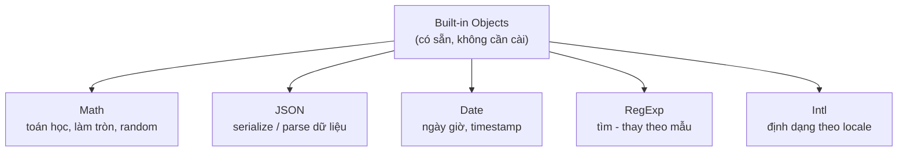

# Built-in Objects

**Built-in** (tích hợp sẵn) nghĩa là những thứ JavaScript **đã có sẵn**, bạn dùng được ngay mà không cần cài thêm hay tự viết. **Built-in Objects** (đối tượng tích hợp sẵn) là bộ các đối tượng/công cụ có sẵn trong ngôn ngữ — như `JSON`, `Math`, `Date`, `RegExp`, `Intl` — giúp xử lý các tác vụ phổ biến (tính toán, ngày giờ, chuỗi, dữ liệu...).

---

:::note[Ghi nhớ nhanh]

- ⭐ **Built-in object có sẵn, không cần cài** — `JSON`, `Math`, `Date`, `RegExp`, `Intl` xử lý các tác vụ phổ biến thay vì tự viết.
- ⭐ **`JSON.stringify`/`JSON.parse`** serialize dữ liệu, nhưng bỏ qua `function`/`undefined`/`symbol`, lỗi với `bigint`, và biến `Date` thành chuỗi ISO.
- **`Math`** gồm hằng số và method static (làm tròn, `max`/`min`, `random`); `Math.random()` không dùng cho crypto — dùng `crypto`.
- **`Date`** nhiều bất tiện (`getMonth()` 0-11, mutable); năm 2026 nên dùng date-fns/Day.js/Luxon hoặc Temporal API.
- **`RegExp`** match theo mẫu với flag (`g`, `i`, `m`, `s`, `u`, `y`), capture group và named group.
- **`Intl`** (chuẩn ECMA-402) format số, tiền, ngày giờ theo locale mà không cần thư viện.

:::

---

## Mục lục

- [Vì sao có các built-in object?](#vì-sao-có-các-built-in-object)
- [JSON](#json)
- [Math](#math)
- [Date](#date)
- [RegExp](#regexp)
- [Intl](#intl)

---

## Vì sao có các built-in object?

**Vấn đề:** Các tác vụ phổ biến (tính toán, xử lý ngày giờ, chuyển dữ liệu sang chuỗi để truyền/lưu, tìm kiếm theo mẫu) nếu dev tự viết sẽ lặp lại khắp nơi, dễ sai và khó bảo trì.

```js
// Tự viết hàm làm tròn, đổi object thành chuỗi, validate email...
function round(n) {
  return n >= 0 ? (n - Math.floor(n) >= 0.5 ? Math.floor(n) + 1 : Math.floor(n)) : 0;
}

function toJson(obj) {
  let s = "{";
  for (const k in obj) s += `"${k}":"${obj[k]}",`; // dễ sai với số, mảng, ký tự đặc biệt
  return s.slice(0, -1) + "}";
}
// Mỗi project viết lại một kiểu → bug khắp nơi
```

**Giải pháp:** JavaScript cung cấp sẵn các built-in object đã được chuẩn hoá và tối ưu — dùng ngay, không cần tự viết:

```js
Math.round(3.5);              // 4 — toán học
new Date().toISOString();     // ngày giờ
JSON.stringify({ name: "An" }); // '{"name":"An"}' — đổi sang chuỗi
/^[^@]+@[^@]+\.[^@]+$/.test("a@b.com"); // true — tìm theo mẫu
```

Các built-in object hay dùng nhất, phân theo mục đích:



:::tip[Dùng thực tế]

- **`Math.random()` + `Math.round()`**: random xí ngầu, làm tròn giá tiền, chia phần trăm.
- **`Date` / `Intl.DateTimeFormat`**: hiển thị "ngày đăng bài", đếm ngược, định dạng theo `vi-VN`.
- **`JSON.stringify` / `JSON.parse`**: gửi body khi gọi API, lưu/đọc `localStorage`.
- **`RegExp`**: validate email/số điện thoại, tách chuỗi, tìm-thay theo mẫu.

:::

---

## JSON

JSON (JavaScript Object Notation) — format text để serialize dữ liệu.

```js
const user = { name: "An", age: 25 };

const json = JSON.stringify(user);
// '{"name":"An","age":25}'

const obj = JSON.parse(json);
// { name: "An", age: 25 }
```

Format đẹp khi log:

```js
JSON.stringify(user, null, 2);
// {
//   "name": "An",
//   "age": 25
// }
```

Replacer + reviver:

```js
// Lọc property
JSON.stringify(user, ["name"]);    // '{"name":"An"}'

// Custom transform
JSON.stringify(user, (k, v) => k === "age" ? undefined : v);

JSON.parse(json, (k, v) => k === "age" ? v + 1 : v);
```

:::warning[Cần lưu ý]

`JSON.stringify` **bỏ qua** một số kiểu:

```js
JSON.stringify({
  fn: () => {},          // function → bỏ
  undef: undefined,      // undefined → bỏ
  sym: Symbol(),         // symbol → bỏ
  big: 10n,              // bigint → TypeError
});
// '{}'

JSON.stringify({ d: new Date() });
// '{"d":"2026-01-01T..."}' — Date thành string ISO

JSON.stringify(NaN);     // "null"
JSON.stringify(Infinity); // "null"
```

Với Map, Set: cần convert tay (`Array.from`) trước khi stringify.

Để JSON hỗ trợ kiểu phức tạp, dùng `JSON.stringify` với replacer hoặc
thư viện như **superjson**, **devalue**.

:::

---

## Math

Hằng số và method toán học (static — không cần `new`):

```js
Math.PI;          // 3.141592...
Math.E;           // 2.718...

Math.abs(-5);     // 5
Math.floor(3.9);  // 3
Math.ceil(3.1);   // 4
Math.round(3.5);  // 4
Math.trunc(3.9);  // 3 (cắt phần thập phân, không làm tròn)

Math.max(1, 5, 3);    // 5
Math.min(1, 5, 3);    // 1
Math.max(...[1, 5, 3]); // dùng spread cho mảng

Math.pow(2, 10);  // 1024 — hoặc 2 ** 10
Math.sqrt(16);    // 4
Math.random();    // [0, 1)
```

Random integer trong khoảng:

```js
function randInt(min, max) {
  return Math.floor(Math.random() * (max - min + 1)) + min;
}

randInt(1, 6); // 1-6 (xí ngầu)
```

:::tip[Mẹo]

`Math.random()` **không phù hợp cho crypto** — không an toàn, có thể bị
dự đoán. Khi cần random bảo mật (token, password):

```js
// Browser
crypto.getRandomValues(new Uint32Array(1))[0];

// Browser hiện đại
crypto.randomUUID();

// Node.js
import { randomBytes, randomUUID } from "node:crypto";
randomUUID();
randomBytes(16).toString("hex");
```

:::

---

## Date

```js
const now = new Date();
const specific = new Date("2026-01-15");
const fromMs = new Date(1735689600000);

now.getFullYear();
now.getMonth();      // 0-11
now.getDate();       // 1-31
now.getDay();        // 0-6 (0 = Chủ nhật)
now.getHours();

now.toISOString();   // "2026-01-15T08:00:00.000Z"
now.toLocaleString("vi-VN");
```

Tính khoảng thời gian:

```js
const start = Date.now(); // ms từ epoch
// ... làm gì đó
const elapsed = Date.now() - start;
```

:::warning[Cần lưu ý]

`Date` của JS có nhiều bất tiện:

- `getMonth()` trả về **0-11** (tháng 1 = 0).
- Mutable — `date.setHours()` sửa chính object.
- Không có timezone-aware ngoài UTC và local.
- Parsing string không nhất quán giữa browser.

**Năm 2026, dùng thư viện hoặc Temporal API**:

| Lựa chọn | Khi nào |
|----------|---------|
| **date-fns** | Functional, tree-shakeable, gọn |
| **Day.js** | API giống Moment, nhẹ |
| **Luxon** | Timezone tốt, API hiện đại |
| **Temporal** (đang Stage 3) | Native API mới của JS, sắp ra |

Đừng dùng **Moment.js** trong code mới — đã được deprecate.

:::

---

## RegExp

Regular Expression — pattern match cho string.

```js
const re = /hello/i;       // i = case-insensitive
const re2 = new RegExp("hello", "i");

re.test("Hello world");    // true

"hello hello".match(/hello/g); // ["hello", "hello"]
"hello".replace(/l/g, "L"); // "heLLo"
"a,b;c".split(/[,;]/);     // ["a", "b", "c"]
```

Flags hay dùng:

| Flag | Ý nghĩa |
|------|---------|
| `g` | Global — match tất cả |
| `i` | Case-insensitive |
| `m` | Multi-line — `^`/`$` match đầu/cuối dòng |
| `s` | Dotall — `.` match cả `\n` |
| `u` | Unicode |
| `y` | Sticky |

Capture groups:

```js
const match = "2026-01-15".match(/(\d{4})-(\d{2})-(\d{2})/);
// match[1] = "2026", match[2] = "01", match[3] = "15"

// Named groups
const m = "2026-01-15".match(/(?<year>\d{4})-(?<month>\d{2})-(?<day>\d{2})/);
m.groups.year; // "2026"
```

---

## Intl

API quốc tế hoá — format số, ngày, tiền tệ theo locale.

```js
new Intl.NumberFormat("vi-VN").format(1234567);
// "1.234.567"

new Intl.NumberFormat("vi-VN", {
  style: "currency",
  currency: "VND",
}).format(1234567);
// "1.234.567 ₫"

new Intl.DateTimeFormat("vi-VN", {
  dateStyle: "full",
  timeStyle: "short",
}).format(new Date());
// "Thứ Năm, 15 tháng 1, 2026 lúc 15:30"
```

:::info[Phân tích]

`Intl` là API **chuẩn ECMA-402** — built-in, không cần thư viện cho format
cơ bản. Các class hữu dụng:

- `Intl.NumberFormat` — format số, tiền, đơn vị.
- `Intl.DateTimeFormat` — format ngày giờ.
- `Intl.RelativeTimeFormat` — "2 ngày trước", "trong 3 tháng".
- `Intl.ListFormat` — "A, B, và C".
- `Intl.PluralRules` — số nhiều theo locale ("1 item", "2 items").
- `Intl.Collator` — sort string theo locale.
- `Intl.Segmenter` — chia string theo từ/câu/grapheme (hỗ trợ emoji).

Sử dụng `Intl` thay vì viết tay format string khi cần đa ngôn ngữ —
chính xác hơn nhiều, không phải maintain.

:::
