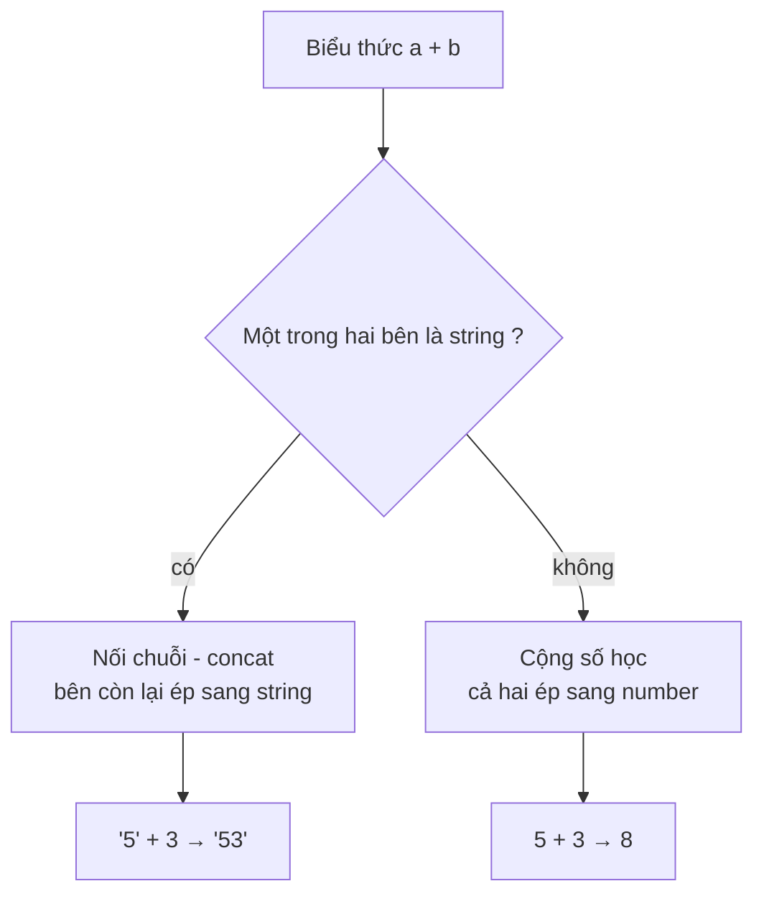

# Type Casting

**Type Casting** (ép kiểu — chuyển đổi kiểu dữ liệu) là việc **chuyển một giá trị từ kiểu dữ liệu này sang kiểu khác**, ví dụ từ chuỗi `"42"` (string) sang số `42` (number), hoặc từ số sang chuỗi.

Vì sao cần? Vì dữ liệu thường đến ở dạng không mong muốn — ví dụ ô nhập liệu trên web luôn trả về **chuỗi**, nên muốn tính toán bạn phải đổi nó sang **số** trước.

```js
"42" + 1            // "421"  -> bị nối chuỗi vì "42" là string
Number("42") + 1    // 43     -> đã ép sang số nên cộng đúng
```

Trong JavaScript, việc ép kiểu xảy ra theo **hai cách**: do bạn chủ động làm, hoặc do JavaScript **tự động** làm ngầm — đó chính là nội dung phần dưới đây.

[](pathname:///img/javascript/type-casting.webp)

---

:::note[Ghi nhớ nhanh]

- ⭐ **Ưu tiên ép kiểu tường minh và dùng `===`** — chủ động `Number()`, `String()`, `Boolean()` rồi so sánh bằng `===` để JavaScript không phải "đoán" giúp bạn.
- **Phân biệt conversion và coercion** — conversion là chủ ý của lập trình viên (`Number("42")`), coercion là JS tự làm ngầm (`"42" * 1`).
- ⭐ **Toán tử `+` là ngoại lệ** — chỉ cần một bên là string thì `+` sẽ nối chuỗi; các toán tử `-`, `*`, `/`, `%`, `**` luôn ép về số.
- **Thuộc 8 giá trị falsy** — `false`, `0`, `-0`, `0n`, `""`, `null`, `undefined`, `NaN`; mọi thứ khác (kể cả `"0"`, `[]`, `{}`) đều truthy.
- **Quy tắc `==`** — coerce khi khác kiểu; `null == undefined` là true (hard-code), nhưng `null == 0` là false.

:::

---

## Mục lục

- [Vì sao cần hiểu ép kiểu (type coercion)?](#vì-sao-cần-hiểu-ép-kiểu-type-coercion)
- [Conversion vs Coercion](#conversion-vs-coercion)
- [Explicit casting](#explicit-casting)
- [Implicit coercion](#implicit-coercion)
- [Quy tắc của ==](#quy-tắc-của-)
- [Mẹo tránh bug](#mẹo-tránh-bug)
- [Câu hỏi phỏng vấn](#câu-hỏi-phỏng-vấn)

---

## Vì sao cần hiểu ép kiểu (type coercion)?

**Vấn đề:**

JavaScript **tự động ép kiểu** (implicit coercion) trong rất nhiều phép toán. Nếu không nắm quy tắc, bạn nhận về kết quả bất ngờ và những bug rất khó truy vết — nhất là khi dữ liệu từ input/form/API hầu hết đều là **string**.

```js
"5" + 3;   // "53" — nối chuỗi, KHÔNG phải 8
"5" - 3;   // 2    — cùng dữ liệu nhưng lại ra số
[] + {};   // "[object Object]" — khó đoán
1 == "1";  // true — khác kiểu vẫn bằng nhau
```

**Giải pháp:**

Hiểu quy tắc coercion và chủ động **ép kiểu tường minh** (explicit), dùng `===` thay cho `==` để JavaScript không phải "đoán" giúp bạn.

```js
Number("5") + 3;          // 8    — ép sang số trước khi cộng
String(42) + " điểm";     // "42 điểm"
Boolean(0);               // false — kiểm soát truthy/falsy
parseInt("42px", 10);     // 42   — đọc số từ chuỗi có hậu tố

1 === "1";                // false — so sánh đúng kiểu, an toàn
```

:::tip[Dùng thực tế]

- **Tính toán từ form**: ô input trả về string, ép `Number()` trước khi cộng/nhân để tránh nối chuỗi nhầm.
- **Kiểm tra giá trị falsy**: phân biệt `0`, `""`, `null`, `undefined` khi validate dữ liệu rỗng.
- **Hiển thị ra UI**: ép số sang chuỗi bằng `String()` hoặc `.toString()` khi ghép nội dung hiển thị.
- **So sánh dữ liệu API**: dùng `===` và ép kiểu rõ ràng để tránh bug khi backend trả `"1"` thay vì `1`.

:::

---

## Conversion vs Coercion

| | Type Conversion | Type Coercion |
|--|----------------|---------------|
| Cách gọi | Explicit (tường minh) | Implicit (ngầm) |
| Ai làm | Lập trình viên | JavaScript engine |
| Ví dụ | `Number("42")` | `"42" * 1` |

Cả hai đều chuyển kiểu, nhưng **conversion là chủ ý**, **coercion là tự động**.

---

## Explicit casting

**Convert sang Number:**

```js
Number("42");      // 42
Number("42px");    // NaN
Number("");        // 0
Number(true);      // 1
Number(false);     // 0
Number(null);      // 0
Number(undefined); // NaN
Number([1]);       // 1
Number([1, 2]);    // NaN
Number({});        // NaN

parseInt("42px");  // 42 — chấp nhận trailing
parseFloat("3.14abc"); // 3.14
```

**Convert sang String:**

```js
String(42);        // "42"
String(true);      // "true"
String(null);      // "null"
String(undefined); // "undefined"
String([1, 2]);    // "1,2"
String({});        // "[object Object]"

(42).toString();   // "42"
(42).toString(2);  // "101010" — binary
(42).toString(16); // "2a" — hex
```

**Convert sang Boolean:**

```js
Boolean(0);     // false
Boolean("");    // false
Boolean(null);  // false
Boolean(NaN);   // false
Boolean({});    // true (mọi object đều truthy)
Boolean([]);    // true (kể cả array rỗng)

!!"hello";      // true (idiom)
```

:::info[Phân tích]

**8 falsy values** trong JavaScript:

1. `false`
2. `0`
3. `-0`
4. `0n` (BigInt zero)
5. `""` (string rỗng)
6. `null`
7. `undefined`
8. `NaN`

Mọi giá trị khác đều **truthy** — bao gồm:

- `"0"` (string chứa số 0)
- `"false"` (string)
- `[]` (array rỗng)
- `{}` (object rỗng)
- `function() {}`

Đây là nguồn gốc nhiều bug — đặc biệt với `[]` và `{}`:

```js
if ([] == false) { /* true! */ }
if ([]) { /* cũng true! */ }
```

Nhớ thuộc lòng 8 falsy values là kiến thức nền tảng để đoán đúng coercion.

:::

---

## Implicit coercion

JS tự động convert khi cần:

```js
"5" + 3;      // "53" — string concat
"5" - 3;      // 2 — số học, "5" → 5
"5" * "2";    // 10
"abc" - 1;    // NaN

1 + null;     // 1 (null → 0)
1 + undefined; // NaN

[] + [];      // "" — cả hai thành ""
[] + {};      // "[object Object]"
{} + [];      // 0 (trong console — {} bị parse là block)

true + 1;     // 2
false + 1;    // 1
```

:::warning[Cần lưu ý]

**Toán tử `+`** có quy tắc đặc biệt:

- Nếu **một bên là string** → concat.
- Ngược lại → cộng số.

```js
1 + 2;       // 3
1 + "2";     // "12"
"1" + 2;     // "12"
1 + 2 + "3"; // "33" — trái sang phải: (1+2) + "3"
"1" + 2 + 3; // "123" — đã thành string từ đầu
```

Luồng quyết định của toán tử `+`:



Các toán tử khác (`-`, `*`, `/`, `%`, `**`) **luôn cố convert sang number**.

:::

---

## Quy tắc của ==

`==` (loose equality) áp dụng **coercion** khi hai vế khác kiểu:

```js
1 == "1";        // true
0 == false;      // true
0 == "";         // true
null == undefined; // true
null == 0;       // false (!)
"" == 0;         // true (!)
[] == false;     // true
[1] == 1;        // true
```

Quy tắc cơ bản (đơn giản hoá):

1. Hai vế cùng kiểu → so sánh trực tiếp (= `===`).
2. `null == undefined` → `true`.
3. Number + String → String chuyển thành Number.
4. Boolean → chuyển thành Number trước.
5. Object → gọi `valueOf()` rồi `toString()`.

:::info[Phân tích]

**Tại sao `null == 0` lại `false` mà `null == undefined` lại `true`?**

Spec ES định nghĩa `null == undefined` là **trường hợp đặc biệt** —
được hard-code trả về `true`, không qua coercion. Với mọi cặp khác,
`null` **không** coerce sang number, nên `null == 0` so sánh khác kiểu
→ `false`.

Quy tắc thực tế: **luôn dùng `===`** trong code mới. ESLint rule `eqeqeq`
sẽ bắt buộc điều này. Chỉ giữ `==` trong một trường hợp đặc biệt:

```js
// Kiểm tra "null hoặc undefined" trong một dòng
if (value == null) { /* ... */ }
// Tương đương: value === null || value === undefined
```

:::

---

## Mẹo tránh bug

**1. Luôn `===` thay vì `==`**:

```js
// Tệ
if (count == "0") {}

// Tốt
if (count === 0) {}
```

**2. Convert tường minh trước khi so sánh**:

```js
const input = "42";
if (Number(input) > 10) {}  // rõ ràng
```

**3. Validate đầu vào tại boundary**:

```js
function setAge(age) {
  if (typeof age !== "number" || Number.isNaN(age)) {
    throw new TypeError("age must be a number");
  }
  // ...
}
```

**4. Cẩn thận với toán tử `+`**:

```js
const total = items.reduce((sum, item) => sum + item.price, 0);
// Nếu item.price là string "10" → bug nghiêm trọng
```

:::tip[Mẹo]

Khi viết TypeScript, coercion implicit gần như biến mất — TS bắt mọi
trường hợp khác kiểu tại compile time. Đây là một trong những lý do
project lớn nên migrate sang TS.

Nhưng vẫn cần hiểu coercion vì:
- Code review JS thuần.
- Đọc thư viện cũ.
- Debug khi data từ API về có kiểu sai.
- Phỏng vấn — chủ đề "value comparison" rất phổ biến.

:::

---

## Câu hỏi phỏng vấn

Những câu thường gặp về chủ đề này. Tự trả lời trước, rồi bấm **Xem đáp án** để đối chiếu.

**1. Phân biệt `type conversion` (explicit) và `type coercion` (implicit)? Ai là người thực hiện trong mỗi trường hợp?**

<details className="qa">
<summary>Xem đáp án</summary>

Cả hai đều là chuyển giá trị từ kiểu này sang kiểu khác, khác nhau ở **ai chủ động**:

| | Type Conversion | Type Coercion |
|---|---|---|
| Cách gọi | Explicit (tường minh) | Implicit (ngầm) |
| Ai làm | Lập trình viên viết ra | JavaScript engine tự làm |
| Ví dụ | `Number("42")`, `String(42)`, `Boolean(0)` | `"42" * 1`, `"5" + 3`, `if (value)` |

```js
Number("42") + 1;  // 43 — conversion: mình chủ động ép
"42" * 1;          // 42 — coercion: engine tự ép "42" sang số
```

Coercion xảy ra khi engine gặp một toán tử/ngữ cảnh đòi hỏi kiểu cụ thể (`-`, `*`, `if`, `==`...) mà giá trị lại không đúng kiểu đó, nên nó tự "đoán" giúp. Đây chính là nguồn gốc của phần lớn bug khó truy vết. Nguyên tắc thực hành: **luôn ưu tiên conversion** để code nói rõ ý định, và dùng `===` để engine không phải đoán.

</details>

**2. Liệt kê đủ 8 giá trị `falsy` trong JavaScript. Vì sao `[]` và `"0"` lại là `truthy`?**

<details className="qa">
<summary>Xem đáp án</summary>

Đúng **8 giá trị falsy**: `false`, `0`, `-0`, `0n` (BigInt zero), `""` (chuỗi rỗng), `null`, `undefined`, `NaN`. **Mọi giá trị khác đều truthy** — không có ngoại lệ.

- `"0"` là **string khác rỗng**. Quy tắc ép string sang boolean chỉ xét độ dài: rỗng → `false`, có ký tự → `true`. Nội dung bên trong không quan trọng, nên `"0"`, `"false"`, `" "` đều truthy.
- `[]` là **object**, và mọi object đều truthy, kể cả array rỗng hay `{}`. Không có bước "xem bên trong có phần tử không".

```js
Boolean("0");   // true
Boolean([]);    // true
if ([] == false) { /* true! — vì == ép [] về "" rồi về 0 */ }
if ([]) { /* cũng chạy — vì Boolean([]) là true */ }
```

Hai dòng cuối là bẫy kinh điển: `[]` vừa truthy vừa `== false`, vì hai ngữ cảnh dùng hai thuật toán ép kiểu khác nhau.

</details>

**3. Giải thích vì sao `"5" + 3` ra `"53"` nhưng `"5" - 3` lại ra `2`. Toán tử `+` khác các toán tử số học khác ở điểm nào?**

<details className="qa">
<summary>Xem đáp án</summary>

Vì `+` trong JavaScript **mang hai nghĩa**: cộng số và nối chuỗi. Quy tắc của nó là: sau khi ép cả hai toán hạng về primitive, **nếu một bên là string thì nối chuỗi**, bên còn lại bị ép sang string; ngược lại mới cộng số.

Các toán tử `-`, `*`, `/`, `%`, `**` **không có nghĩa thứ hai** — chúng luôn ép cả hai vế sang number.

```js
"5" + 3;   // "53" — có string → concat: "5" + "3"
"5" - 3;   // 2    — ép số: 5 - 3
"5" * "2"; // 10
"abc" - 1; // NaN  — "abc" ép sang số ra NaN
```

Hệ quả thực tế: dữ liệu từ form/API là string mà đem `+` thì được chuỗi nối, còn `-` lại ra số đúng — cùng một biến nhưng hai kết quả trái ngược. Đây là lý do phải `Number(input)` ngay tại boundary trước khi tính toán.

</details>

**4. Đoán output và giải thích: `1 + 2 + "3"` so với `"1" + 2 + 3`. Vì sao khác nhau?**

<details className="qa">
<summary>Xem đáp án</summary>

```js
1 + 2 + "3";  // "33"
"1" + 2 + 3;  // "123"
```

Toán tử `+` có **tính kết hợp trái sang phải**, nên biểu thức được tính theo từng cặp:

- `1 + 2 + "3"` → `(1 + 2)` = `3` (cả hai là số → cộng số) → rồi `3 + "3"`, có string → concat → `"33"`.
- `"1" + 2 + 3` → `("1" + 2)` = `"12"` (đã có string ngay bước đầu → concat) → rồi `"12" + 3` → `"123"`.

Bài học: chỉ cần **một string xuất hiện sớm** là toàn bộ chuỗi phép `+` phía sau bị "nhiễm" thành nối chuỗi. Đây chính là bug hay gặp trong `reduce` khi tính tổng:

```js
[{price: "10"}, {price: 5}].reduce((s, i) => s + i.price, 0); // "0105"
```

</details>

**5. So sánh `Number("42px")`, `parseInt("42px")` và `parseFloat("3.14abc")`. Khi nào nên dùng `parseInt` thay vì `Number`?**

<details className="qa">
<summary>Xem đáp án</summary>

```js
Number("42px");         // NaN
parseInt("42px", 10);   // 42
parseFloat("3.14abc");  // 3.14
```

| Hàm | Cách hoạt động |
|---|---|
| `Number(x)` | Ép **toàn bộ** chuỗi; chỉ cần một ký tự thừa là ra `NaN` (`Number("") === 0`) |
| `parseInt(s, radix)` | Đọc từ trái sang, **lấy phần số nguyên đầu tiên rồi dừng** khi gặp ký tự lạ |
| `parseFloat(s)` | Giống `parseInt` nhưng giữ cả phần thập phân |

Dùng `parseInt`/`parseFloat` khi chuỗi **cố ý có hậu tố** — ví dụ đọc `"42px"` từ CSS, `"10kg"`, `"3.5em"`. Dùng `Number()` khi bạn muốn **validate nghiêm ngặt**: dữ liệu phải là số sạch, sai một ký tự là biết ngay qua `NaN`. Lưu ý luôn truyền `radix` cho `parseInt` (`parseInt(s, 10)`) để tránh hiểu nhầm hệ cơ số.

</details>

**6. Vì sao `Number("")` ra `0` còn `Number(undefined)` ra `NaN`? `Number(null)` ra bao nhiêu và tại sao?**

<details className="qa">
<summary>Xem đáp án</summary>

```js
Number("");        // 0
Number("   ");     // 0 — chuỗi toàn khoảng trắng cũng vậy
Number(null);      // 0
Number(undefined); // NaN
```

Đây là các quy tắc **spec định nghĩa cứng**, không suy ra được từ logic chung:

- **String → Number**: chuỗi được trim trước; chuỗi rỗng sau khi trim được quy ước là `0`. Nếu phần còn lại không phải literal số hợp lệ mới ra `NaN`.
- **`null` → `0`**: `null` mang ý nghĩa "giá trị rỗng có chủ đích", spec ánh xạ nó thành `0`.
- **`undefined` → `NaN`**: `undefined` nghĩa là "không có giá trị nào cả", không có con số nào hợp lý để ánh xạ, nên kết quả là `NaN`.

Hệ quả cần nhớ: `1 + null` ra `1` nhưng `1 + undefined` ra `NaN`. Khi validate dữ liệu rỗng, đừng dựa vào `Number()` vì `""` và `null` đều lặng lẽ biến thành `0` — rất dễ ghi `0` vào database thay vì báo lỗi.

</details>

**7. Giải thích cơ chế biến một object thành primitive: `ToPrimitive`, `valueOf()`, `toString()` và `Symbol.toPrimitive` được gọi theo thứ tự nào?**

<details className="qa">
<summary>Xem đáp án</summary>

Khi cần một primitive từ object, engine gọi thuật toán nội bộ **`ToPrimitive(input, hint)`** với `hint` là `"number"`, `"string"` hoặc `"default"`:

1. Nếu object có `Symbol.toPrimitive` → gọi method này, kết quả là kết quả cuối cùng.
2. Ngược lại, theo hint mà chọn thứ tự:
   - hint `"number"` hoặc `"default"` → thử `valueOf()` trước, không ra primitive thì `toString()`.
   - hint `"string"` → thử `toString()` trước, rồi mới `valueOf()`.
3. Vẫn không ra primitive → ném `TypeError`.

```js
const money = {
  valueOf() { return 100; },
  toString() { return "một trăm"; }
};
money - 0;        // 100 — hint "number" → valueOf()
`${money}`;       // "một trăm" — hint "string" → toString()
money + "";       // "100" — toán tử + dùng hint "default" → valueOf()
```

Object thường (`{}`) không override gì nên `valueOf()` trả về chính nó (không phải primitive) → rơi xuống `toString()` → `"[object Object]"`.

</details>

**8. Đoán output: `Number([])`, `Number([1])`, `Number([1, 2])`, `Number({})`. Giải thích từng trường hợp qua `ToPrimitive`.**

<details className="qa">
<summary>Xem đáp án</summary>

```js
Number([]);      // 0
Number([1]);     // 1
Number([1, 2]);  // NaN
Number({});      // NaN
```

Cả bốn đều đi qua `ToPrimitive` với hint `"number"`: gọi `valueOf()` trước — array và object thường trả về **chính nó** (không phải primitive) — nên rơi xuống `toString()`:

- `[].toString()` → `""` → `Number("")` → **`0`**.
- `[1].toString()` → `"1"` → `Number("1")` → **`1`**.
- `[1, 2].toString()` → `"1,2"` (join bằng dấu phẩy) → không phải số hợp lệ → **`NaN`**.
- `({}).toString()` → `"[object Object]"` → **`NaN`**.

Mẹo nhớ: array ép về số thực chất là **`join(",")` rồi ép chuỗi đó về số**, nên chỉ array rỗng và array đúng 1 phần tử dạng số mới ra số. Đây cũng là lý do `[] == false` là `true`: `[]` → `""` → `0`, còn `false` → `0`.

</details>

**9. Vì sao `[] + {}` ra `"[object Object]"` còn `[] + []` ra chuỗi rỗng? Điều gì xảy ra khi gõ `{} + []` trong console?**

<details className="qa">
<summary>Xem đáp án</summary>

Toán tử `+` ép cả hai vế về primitive với hint `"default"`, mà array/object đều ra **string**. Khi đã có string, `+` chuyển sang nối chuỗi:

```js
[] + [];   // "" + ""                → ""
[] + {};   // "" + "[object Object]" → "[object Object]"
```

- `[].toString()` là `""` (array rỗng join ra chuỗi rỗng).
- `({}).toString()` là `"[object Object]"`.

**Trường hợp `{} + []` trong console** lại ra `0`, không phải `"[object Object]"` — nhưng lý do không nằm ở coercion mà ở **parsing**. Ở vị trí đầu câu lệnh, `{}` được parser hiểu là một **block rỗng**, không phải object literal. Phần còn lại `+[]` trở thành **toán tử `+` một ngôi**, ép `[]` về số: `+""` → `0`.

```js
{} + [];          // 0 — {} là block, +[] là unary plus
({}) + [];        // "[object Object]" — bọc ngoặc thì {} là object
console.log({} + []); // "[object Object]" — trong ngữ cảnh biểu thức
```

</details>

**10. Trong `if (value)`, JavaScript áp dụng phép ép kiểu nào? Khác gì với ép kiểu trong `value == true`?**

<details className="qa">
<summary>Xem đáp án</summary>

Hai ngữ cảnh dùng **hai thuật toán khác nhau**:

- `if (value)` → gọi **`ToBoolean(value)`**: chỉ hỏi "value có nằm trong 8 falsy không?". Không ép sang number, không gọi `toString()`.
- `value == true` → so sánh lỏng. Vế `true` là boolean nên **bị ép sang number `1`** trước, rồi `value` cũng bị ép về number để so sánh. Đây là đường đi qua `ToNumber`, hoàn toàn khác `ToBoolean`.

```js
if ("0") { /* chạy — "0" truthy */ }
"0" == true;     // false — 0 == 1

if ([]) { /* chạy — object luôn truthy */ }
[] == true;      // false — 0 == 1
[] == false;     // true  — 0 == 0

if ("1") { /* chạy */ }
"1" == true;     // true — 1 == 1
```

Kết luận: **đừng bao giờ viết `x == true`**. Nếu muốn kiểm tra truthy thì dùng thẳng `if (x)`; nếu muốn đúng giá trị boolean thì dùng `x === true`.

</details>

**11. Vì sao `"" == 0` là `true` nhưng `"" == "0"` lại là `false`? Truy vết từng bước theo quy tắc của `==`.**

<details className="qa">
<summary>Xem đáp án</summary>

Điểm mấu chốt: `==` **chỉ ép kiểu khi hai vế khác kiểu**. Cùng kiểu thì nó hành xử y hệt `===`.

**`"" == 0`** — khác kiểu (String vs Number):

1. Quy tắc "Number so với String → ép String sang Number".
2. `Number("")` → `0`.
3. So sánh `0 == 0` → **`true`**.

**`"" == "0"`** — **cùng kiểu String**:

1. Không có bước coercion nào cả.
2. So sánh chuỗi theo từng ký tự: `""` có độ dài 0, `"0"` có độ dài 1 → khác nhau → **`false`**.

```js
"" == 0;    // true  — ép "" về 0
"" == "0";  // false — cùng kiểu, so sánh chuỗi
0 == "0";   // true  — ép "0" về 0
```

Ba dòng trên cho thấy `==` **không có tính bắc cầu**: `"" == 0` và `0 == "0"` đều true, nhưng `"" == "0"` lại false. Một quan hệ "bằng nhau" mà mất tính bắc cầu thì không đáng tin — lý do rất mạnh để luôn dùng `===`.

</details>

**12. Vì sao `null == undefined` là `true` nhưng `null == 0` lại là `false`? Spec xử lý cặp `null`/`undefined` thế nào?**

<details className="qa">
<summary>Xem đáp án</summary>

Spec ECMAScript xử lý cặp này như một **trường hợp đặc biệt được hard-code**: trong thuật toán so sánh lỏng có hai dòng nói rằng `null == undefined` và `undefined == null` trả về `true` ngay lập tức, không qua bất kỳ bước coercion nào. Ý nghĩa: cả hai đều biểu thị "không có giá trị", nên được coi là tương đương.

Đồng thời, spec **không định nghĩa** bước ép `null` (hay `undefined`) sang number trong thuật toán `==`. Vì vậy `null == 0` rơi vào nhánh "khác kiểu, không có quy tắc nào áp dụng" → trả về `false`.

```js
null == undefined; // true  — hard-code trong spec
null == 0;         // false — null không coerce sang số ở đây
null >= 0;         // true (!) — toán tử so sánh lại dùng ToNumber: 0 >= 0
Number(null);      // 0 — ép tường minh thì null vẫn ra 0
```

Ứng dụng duy nhất đáng giữ của `==`:

```js
if (value == null) { /* bắt cả null lẫn undefined trong một dòng */ }
```

</details>

**13. `NaN` sinh ra từ đâu, `typeof NaN` trả về gì, và vì sao phải dùng `Number.isNaN()` thay cho `isNaN()`?**

<details className="qa">
<summary>Xem đáp án</summary>

`NaN` (Not-a-Number) là giá trị đặc biệt thuộc kiểu **number**, sinh ra khi một phép toán số học **không cho kết quả số hợp lệ**: ép chuỗi không phải số (`Number("42px")`), phép toán vô nghĩa (`"abc" - 1`, `0/0`, `Math.sqrt(-1)`), hoặc lan truyền từ một `NaN` khác.

```js
typeof NaN;        // "number" — nghe vô lý nhưng đúng theo IEEE 754
NaN === NaN;       // false — NaN không bằng chính nó
```

Vì `NaN !== NaN`, không thể kiểm tra bằng `===`. Có hai hàm:

| Hàm | Hành vi |
|---|---|
| `isNaN(x)` | **Ép `x` sang number trước** rồi mới kiểm tra → báo `true` cho cả thứ không phải `NaN` |
| `Number.isNaN(x)` | Không ép kiểu; chỉ `true` khi `x` **đúng là** giá trị `NaN` |

```js
isNaN("abc");         // true
isNaN("42px");        // true
isNaN({});            // true — nhưng {} đâu phải NaN!
Number.isNaN("abc");  // false — chính xác
Number.isNaN(NaN);    // true
```

Luôn dùng `Number.isNaN()` (hoặc `Number.isFinite()`) trong code mới.

</details>

**14. Ba cách ép sang boolean: `Boolean(x)`, `!!x`, và `if (x)` — chúng có khác nhau về kết quả không? Vì sao `!!` được coi là idiom?**

<details className="qa">
<summary>Xem đáp án</summary>

**Về kết quả thì cả ba hoàn toàn giống nhau** — đều đi qua đúng một thuật toán `ToBoolean`, tức cùng dựa trên danh sách 8 falsy. Không có trường hợp nào chúng cho kết luận khác nhau.

Khác nhau ở **mục đích sử dụng**:

- `Boolean(x)` — conversion tường minh, trả về giá trị boolean, rõ ràng nhất khi đọc.
- `!!x` — cũng trả về boolean: `!x` đảo truthy/falsy rồi `!` lần nữa đảo về đúng nghĩa gốc.
- `if (x)` — không trả về giá trị nào, chỉ là **ngữ cảnh boolean** để rẽ nhánh.

```js
Boolean("hello"); // true
!!"hello";        // true
!!0;              // false
```

`!!` thành idiom vì nó **ngắn, không cần gọi hàm** và rất tiện khi cần chuẩn hoá giá trị trả về:

```js
const hasItems = !!list.length;     // trả boolean thật, không phải số
return { isValid: !!user?.email };  // tránh lọt undefined ra API response
```

Nhược điểm là hơi khó đọc với người mới; nhiều team quy ước dùng `Boolean(x)` cho rõ nghĩa.

</details>

**15. Nêu một bug thực tế do coercion gây ra khi xử lý dữ liệu từ form hoặc API, và cách bạn phòng tránh nó ở boundary của hệ thống.**

<details className="qa">
<summary>Xem đáp án</summary>

**Bug điển hình — tính tổng giỏ hàng:** ô input trên web luôn trả về **string**, backend đôi khi trả `"10"` thay vì `10`. Khi cộng dồn, `+` nối chuỗi thay vì cộng số:

```js
const items = [{ price: "10" }, { price: "5" }];
items.reduce((sum, i) => sum + i.price, 0); // "0105" thay vì 15
```

Tổng sai âm thầm, không ném lỗi, và chỉ lộ ra khi khách hàng nhìn hoá đơn.

**Bug thứ hai — validate rỗng:** `if (!quantity)` sẽ chặn luôn cả `quantity = 0` hợp lệ, vì `0` là falsy.

**Phòng tránh ở boundary:**

- **Ép kiểu ngay khi dữ liệu vào hệ thống**, không để string lang thang xuống tầng logic: `Number(input)` rồi kiểm tra `Number.isNaN()`.
- Dùng **schema validation** (Zod, Yup, Pydantic...) tại điểm nhận request/response để ràng buộc kiểu.
- Luôn dùng `===`, bật ESLint rule `eqeqeq`.
- Kiểm tra rỗng chính xác: `value == null` hoặc `value === ""` thay vì `!value`.
- Dùng TypeScript để bắt lệch kiểu ngay lúc compile.

</details>
