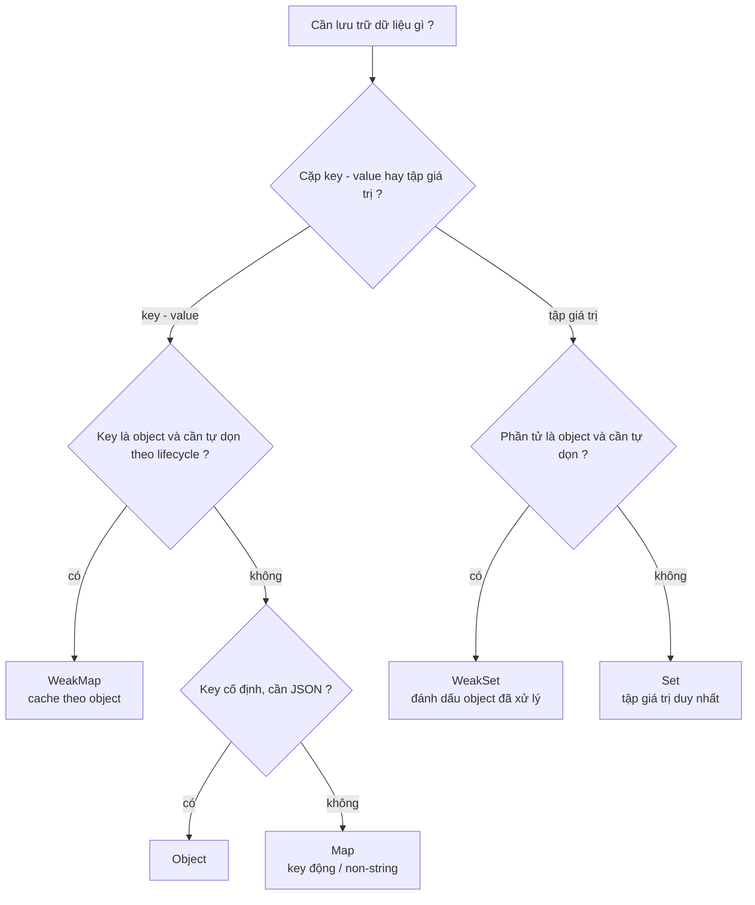

# Map, Set, WeakMap, WeakSet

Đây là nhóm **keyed collections** (tập hợp có khoá) — những cấu trúc dữ liệu giúp lưu trữ và tra cứu dữ liệu theo khoá thay vì theo vị trí số như mảng. **Map** lưu các cặp khoá–giá trị (giống object nhưng khoá có thể là bất kỳ kiểu nào), còn **Set** lưu một tập hợp các giá trị không trùng lặp. **WeakMap** và **WeakSet** là phiên bản "yếu" của chúng, cho phép bộ dọn rác (garbage collector) tự thu hồi bộ nhớ khi khoá không còn được dùng ở nơi khác.

---

## Mục lục

- [Vì sao Map & Set ra đời?](#vì-sao-map--set-ra-đời)
- [Map](#map)
- [Set](#set)
- [WeakMap](#weakmap)
- [WeakSet](#weakset)
- [Khi nào dùng cái nào?](#khi-nào-dùng-cái-nào)

---

## Vì sao Map & Set ra đời?

**Vấn đề:** trước ES6, ta thường lấy plain object làm "map". Nhưng object có nhiều hạn chế:

```js
const map = {};

map[1] = "số một";
map["1"] = "chuỗi một";
console.log(map[1]); // "chuỗi một" — key số bị ép thành string, đè lên nhau!

const user = { id: 1 };
map[user] = "data"; // key thành "[object Object]" — không dùng object làm key được

map["toString"] = "x"; // đè method có sẵn → "ô nhiễm" prototype

Object.keys(map).length; // không có .size, phải đếm thủ công
// thứ tự key không đảm bảo, key số bị engine tự sort → khó duyệt
```

Còn muốn lưu danh sách phần tử **duy nhất** thì phải tự viết vòng lặp lọc trùng.

**Giải pháp:** ES6 thêm `Map` và `Set` để giải quyết trọn vẹn:

```js
const map = new Map();

map.set(1, "số một");
map.set("1", "chuỗi một");
map.set({ id: 1 }, "data"); // object làm key thoải mái

map.get(1);   // "số một" — key giữ nguyên kiểu, không ép chuỗi
map.size;     // 3 — có size trực tiếp
// giữ đúng thứ tự chèn, không dính prototype, duyệt thẳng bằng for...of

const unique = [...new Set([1, 2, 2, 3])]; // [1, 2, 3] — tự loại trùng
```

:::tip[Dùng thực tế]

- **Cache theo key là object**: `WeakMap` lưu kết quả tính toán nặng gắn với từng object, tự dọn khi object bị xoá.
- **Đếm tần suất**: `Map` đếm số lần xuất hiện của từ/phần tử (`counts.set(x, (counts.get(x) ?? 0) + 1)`).
- **Loại phần tử trùng khỏi mảng**: idiom một dòng `[...new Set(arr)]`.
- **Lưu metadata gắn với DOM node**: `WeakMap` gắn dữ liệu phụ vào node mà không sửa node và không gây rò bộ nhớ.

:::

---

## Map

`Map` là **dictionary key-value**, hỗ trợ key **bất kỳ kiểu**.

```js
const m = new Map();

m.set("name", "An");
m.set(1, "số 1");
m.set({ id: 1 }, "object key"); // object cũng làm key được

m.get("name");      // "An"
m.has(1);           // true
m.size;             // 3

m.delete("name");
m.clear();
```

Khởi tạo từ array của tuple:

```js
const m = new Map([
  ["name", "An"],
  ["age", 25],
]);
```

Iteration (giữ **thứ tự thêm vào**):

```js
for (const [key, value] of m) { /* ... */ }
for (const key of m.keys()) {}
for (const value of m.values()) {}
m.forEach((v, k) => {});
```

:::info[Phân tích]

**Map vs Object** — khi nào dùng cái nào?

| | `Map` | `Object` |
|--|--|--|
| Key | **Bất kỳ** (kể cả object, function) | String / Symbol |
| Thứ tự | Giữ nguyên thứ tự insert | Không đảm bảo (engine tự sort key số) |
| Size | `.size` trực tiếp | Phải `Object.keys(o).length` |
| Iteration | Built-in iterable | Cần `Object.entries` / `for...in` |
| Performance | Tối ưu cho thêm/xóa nhiều | Tối ưu cho property cố định |
| JSON | Không (cần convert) | Native |
| Prototype chain | Không có | Có (dễ bị xung đột) |

**Quy tắc thực dụng:**

- **Map** khi: key động, key không phải string, cần size/iteration thường
  xuyên, dictionary lớn (>100 entries).
- **Object** khi: shape cố định, cần JSON, dữ liệu config / DTO.

Object có thể chạy nhanh hơn Map với shape cố định nhờ V8 hidden class —
nhưng với operation thêm/xóa key liên tục, Map nhanh và ít rò bộ nhớ hơn.

:::

---

## Set

`Set` là **tập giá trị duy nhất**.

```js
const s = new Set();
s.add(1);
s.add(2);
s.add(1); // bỏ qua, đã có

s.size;       // 2
s.has(1);     // true
s.delete(1);

for (const v of s) { /* ... */ }
```

Khởi tạo từ array — **loại trùng lặp**:

```js
const arr = [1, 2, 2, 3, 3, 3];
const unique = [...new Set(arr)]; // [1, 2, 3]
```

:::tip[Mẹo]

**Idiom loại trùng lặp một dòng**:

```js
[...new Set(arr)]
```

Cho object thì phức tạp hơn — Set so sánh bằng reference, không phải
value:

```js
const a = { id: 1 };
const b = { id: 1 };
new Set([a, b]).size; // 2 — hai reference khác nhau
```

Cần loại trùng theo property: dùng Map làm index:

```js
const unique = [...new Map(arr.map(o => [o.id, o])).values()];
```

:::

---

## WeakMap

`WeakMap` giống Map nhưng:

- Key **bắt buộc** là object (không nhận primitive).
- **Không giữ tham chiếu** key — nếu không còn ai dùng key, GC tự dọn entry.
- **Không iterable** — không có `size`, `keys()`, `forEach`.

```js
const wm = new WeakMap();
const key = { id: 1 };

wm.set(key, "secret data");
wm.get(key); // "secret data"

// Khi key không còn dùng ở đâu khác, entry tự bị xoá
```

Ứng dụng phổ biến — **gắn metadata vào object** mà không sửa object đó:

```js
const cache = new WeakMap();

function expensiveCalc(obj) {
  if (cache.has(obj)) return cache.get(obj);
  const result = /* tính toán nặng */;
  cache.set(obj, result);
  return result;
}

// Khi obj bị xoá, entry trong cache cũng tự dọn → không leak
```

---

## WeakSet

Tương tự WeakMap — chứa object, không giữ reference, không iterable.

```js
const ws = new WeakSet();
const obj = { x: 1 };

ws.add(obj);
ws.has(obj); // true

// obj bị xoá ở nơi khác → entry tự dọn
```

Ứng dụng — **đánh dấu trạng thái** mà không lưu reference:

```js
const visited = new WeakSet();

function process(node) {
  if (visited.has(node)) return;
  visited.add(node);
  // xử lý node
}
```

:::warning[Cần lưu ý]

**WeakMap/WeakSet không phải replacement cho Map/Set.** Chúng được thiết
kế cho use case **gắn dữ liệu phụ trợ vào object có lifecycle riêng**.

Không có cách để **iterate** hay biết **có bao nhiêu entry** — vì entry
có thể biến mất bất cứ lúc nào GC chạy. Nếu bạn cần `size`, `for...of`,
`forEach`, dùng Map/Set thường.

Lưu ý quan trọng cho phỏng vấn: **giá trị (value)** của WeakMap có
**giữ reference** — chỉ key là weak. Cẩn thận leak khi value chứa
reference vòng:

```js
const wm = new WeakMap();
const key = {};
const value = { key }; // value trỏ ngược lại key
wm.set(key, value);

// Khi mất `key` ở scope ngoài, GC vẫn không thể dọn vì value giữ key
```

:::

---

## Khi nào dùng cái nào?

| Tình huống | Dùng |
|------------|------|
| Dictionary với key string cố định | `Object` |
| Dictionary với key động hoặc non-string | `Map` |
| Tập hợp giá trị duy nhất | `Set` |
| Cache theo object lifecycle | `WeakMap` |
| Đánh dấu object đã xử lý | `WeakSet` |

Sơ đồ quyết định giúp chọn nhanh cấu trúc phù hợp:



:::tip[Mẹo]

Có **iterator helper** mới (ES2024+) áp dụng được trên Map/Set:

```js
// Sắp ra: Iterator.from(map.values()).filter(...).map(...).toArray()
[...m.values()].filter(v => v > 10).map(v => v * 2);
```

Hiện tại vẫn cần spread `[...]` để chuyển sang array. Tương lai sẽ
dùng iterator helper native — performant hơn với dataset lớn vì lazy
evaluation.

:::
