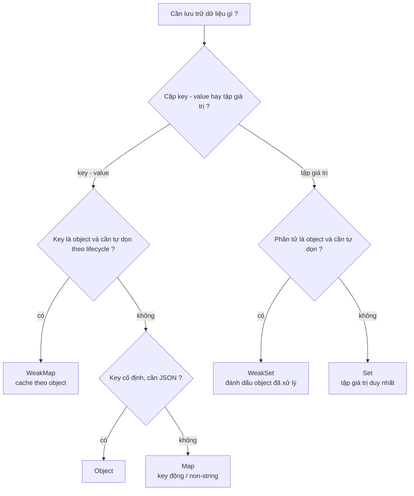

# Map, Set, WeakMap, WeakSet

Đây là nhóm **keyed collections** (tập hợp có khoá) — những cấu trúc dữ liệu giúp lưu trữ và tra cứu dữ liệu theo khoá thay vì theo vị trí số như mảng. **Map** lưu các cặp khoá–giá trị (giống object nhưng khoá có thể là bất kỳ kiểu nào), còn **Set** lưu một tập hợp các giá trị không trùng lặp. **WeakMap** và **WeakSet** là phiên bản "yếu" của chúng, cho phép bộ dọn rác (garbage collector) tự thu hồi bộ nhớ khi khoá không còn được dùng ở nơi khác.

[](pathname:///img/javascript/keyed-collections.webp)

---

:::note[Ghi nhớ nhanh]

- ⭐ **`Map` là dictionary key–value với key bất kỳ kiểu** — giữ nguyên kiểu key (không ép chuỗi như object), giữ đúng thứ tự chèn, có `.size` và duyệt thẳng bằng `for...of`.
- ⭐ **`Set` lưu tập giá trị duy nhất** — idiom loại trùng một dòng `[...new Set(arr)]`; nhưng Set so sánh object theo reference, không theo value.
- **Chọn `Map` hay `Object`** — dùng `Map` khi key động/non-string hoặc thêm–xóa nhiều; dùng `Object` khi shape cố định và cần JSON.
- **`WeakMap`/`WeakSet` chỉ nhận key/phần tử là object** — không iterable, không `size`, và GC tự dọn entry khi object không còn được dùng ở nơi khác.
- **`WeakMap` chỉ weak ở key** — value vẫn giữ reference, cẩn thận leak khi value trỏ ngược lại key.

:::

---

## Mục lục

- [Vì sao Map & Set ra đời?](#vì-sao-map--set-ra-đời)
- [Map](#map)
- [Set](#set)
- [WeakMap](#weakmap)
- [WeakSet](#weakset)
- [Khi nào dùng cái nào?](#khi-nào-dùng-cái-nào)
- [Câu hỏi phỏng vấn](#câu-hỏi-phỏng-vấn)

---

## Vì sao Map & Set ra đời?

**Vấn đề:** trước ES6, ta thường lấy plain object làm "map". Nhưng object có nhiều hạn chế:

```js
const map = {};

map[1] = "số một";
map["1"] = "chuỗi một";
console.log(map[1]); // "chuỗi một" — key số bị ép thành string, đè lên nhau!

const user = { id: 1 };
map[user] = "data"; // key thành "[object Object]" — không dùng object làm key được

map["toString"] = "x"; // đè method có sẵn → "ô nhiễm" prototype

Object.keys(map).length; // không có .size, phải đếm thủ công
// thứ tự key không đảm bảo, key số bị engine tự sort → khó duyệt
```

Còn muốn lưu danh sách phần tử **duy nhất** thì phải tự viết vòng lặp lọc trùng.

**Giải pháp:** ES6 thêm `Map` và `Set` để giải quyết trọn vẹn:

```js
const map = new Map();

map.set(1, "số một");
map.set("1", "chuỗi một");
map.set({ id: 1 }, "data"); // object làm key thoải mái

map.get(1);   // "số một" — key giữ nguyên kiểu, không ép chuỗi
map.size;     // 3 — có size trực tiếp
// giữ đúng thứ tự chèn, không dính prototype, duyệt thẳng bằng for...of

const unique = [...new Set([1, 2, 2, 3])]; // [1, 2, 3] — tự loại trùng
```

:::tip[Dùng thực tế]

- **Cache theo key là object**: `WeakMap` lưu kết quả tính toán nặng gắn với từng object, tự dọn khi object bị xoá.
- **Đếm tần suất**: `Map` đếm số lần xuất hiện của từ/phần tử (`counts.set(x, (counts.get(x) ?? 0) + 1)`).
- **Loại phần tử trùng khỏi mảng**: idiom một dòng `[...new Set(arr)]`.
- **Lưu metadata gắn với DOM node**: `WeakMap` gắn dữ liệu phụ vào node mà không sửa node và không gây rò bộ nhớ.

:::

---

## Map

`Map` là **dictionary key-value**, hỗ trợ key **bất kỳ kiểu**.

```js
const m = new Map();

m.set("name", "An");
m.set(1, "số 1");
m.set({ id: 1 }, "object key"); // object cũng làm key được

m.get("name");      // "An"
m.has(1);           // true
m.size;             // 3

m.delete("name");
m.clear();
```

Khởi tạo từ array của tuple:

```js
const m = new Map([
  ["name", "An"],
  ["age", 25],
]);
```

Iteration (giữ **thứ tự thêm vào**):

```js
for (const [key, value] of m) { /* ... */ }
for (const key of m.keys()) {}
for (const value of m.values()) {}
m.forEach((v, k) => {});
```

:::info[Phân tích]

**Map vs Object** — khi nào dùng cái nào?

| | `Map` | `Object` |
|--|--|--|
| Key | **Bất kỳ** (kể cả object, function) | String / Symbol |
| Thứ tự | Giữ nguyên thứ tự insert | Không đảm bảo (engine tự sort key số) |
| Size | `.size` trực tiếp | Phải `Object.keys(o).length` |
| Iteration | Built-in iterable | Cần `Object.entries` / `for...in` |
| Performance | Tối ưu cho thêm/xóa nhiều | Tối ưu cho property cố định |
| JSON | Không (cần convert) | Native |
| Prototype chain | Không có | Có (dễ bị xung đột) |

**Quy tắc thực dụng:**

- **Map** khi: key động, key không phải string, cần size/iteration thường
  xuyên, dictionary lớn (>100 entries).
- **Object** khi: shape cố định, cần JSON, dữ liệu config / DTO.

Object có thể chạy nhanh hơn Map với shape cố định nhờ V8 hidden class —
nhưng với operation thêm/xóa key liên tục, Map nhanh và ít rò bộ nhớ hơn.

:::

---

## Set

`Set` là **tập giá trị duy nhất**.

```js
const s = new Set();
s.add(1);
s.add(2);
s.add(1); // bỏ qua, đã có

s.size;       // 2
s.has(1);     // true
s.delete(1);

for (const v of s) { /* ... */ }
```

Khởi tạo từ array — **loại trùng lặp**:

```js
const arr = [1, 2, 2, 3, 3, 3];
const unique = [...new Set(arr)]; // [1, 2, 3]
```

:::tip[Mẹo]

**Idiom loại trùng lặp một dòng**:

```js
[...new Set(arr)]
```

Cho object thì phức tạp hơn — Set so sánh bằng reference, không phải
value:

```js
const a = { id: 1 };
const b = { id: 1 };
new Set([a, b]).size; // 2 — hai reference khác nhau
```

Cần loại trùng theo property: dùng Map làm index:

```js
const unique = [...new Map(arr.map(o => [o.id, o])).values()];
```

:::

---

## WeakMap

`WeakMap` giống Map nhưng:

- Key **bắt buộc** là object (không nhận primitive).
- **Không giữ tham chiếu** key — nếu không còn ai dùng key, GC tự dọn entry.
- **Không iterable** — không có `size`, `keys()`, `forEach`.

```js
const wm = new WeakMap();
const key = { id: 1 };

wm.set(key, "secret data");
wm.get(key); // "secret data"

// Khi key không còn dùng ở đâu khác, entry tự bị xoá
```

Ứng dụng phổ biến — **gắn metadata vào object** mà không sửa object đó:

```js
const cache = new WeakMap();

function expensiveCalc(obj) {
  if (cache.has(obj)) return cache.get(obj);
  const result = /* tính toán nặng */;
  cache.set(obj, result);
  return result;
}

// Khi obj bị xoá, entry trong cache cũng tự dọn → không leak
```

---

## WeakSet

Tương tự WeakMap — chứa object, không giữ reference, không iterable.

```js
const ws = new WeakSet();
const obj = { x: 1 };

ws.add(obj);
ws.has(obj); // true

// obj bị xoá ở nơi khác → entry tự dọn
```

Ứng dụng — **đánh dấu trạng thái** mà không lưu reference:

```js
const visited = new WeakSet();

function process(node) {
  if (visited.has(node)) return;
  visited.add(node);
  // xử lý node
}
```

:::warning[Cần lưu ý]

**WeakMap/WeakSet không phải replacement cho Map/Set.** Chúng được thiết
kế cho use case **gắn dữ liệu phụ trợ vào object có lifecycle riêng**.

Không có cách để **iterate** hay biết **có bao nhiêu entry** — vì entry
có thể biến mất bất cứ lúc nào GC chạy. Nếu bạn cần `size`, `for...of`,
`forEach`, dùng Map/Set thường.

Lưu ý quan trọng cho phỏng vấn: **giá trị (value)** của WeakMap có
**giữ reference** — chỉ key là weak. Cẩn thận leak khi value chứa
reference vòng:

```js
const wm = new WeakMap();
const key = {};
const value = { key }; // value trỏ ngược lại key
wm.set(key, value);

// Khi mất `key` ở scope ngoài, GC vẫn không thể dọn vì value giữ key
```

:::

---

## Khi nào dùng cái nào?

| Tình huống | Dùng |
|------------|------|
| Dictionary với key string cố định | `Object` |
| Dictionary với key động hoặc non-string | `Map` |
| Tập hợp giá trị duy nhất | `Set` |
| Cache theo object lifecycle | `WeakMap` |
| Đánh dấu object đã xử lý | `WeakSet` |

Sơ đồ quyết định giúp chọn nhanh cấu trúc phù hợp:



:::tip[Mẹo]

Có **iterator helper** mới (ES2024+) áp dụng được trên Map/Set:

```js
// Sắp ra: Iterator.from(map.values()).filter(...).map(...).toArray()
[...m.values()].filter(v => v > 10).map(v => v * 2);
```

Hiện tại vẫn cần spread `[...]` để chuyển sang array. Tương lai sẽ
dùng iterator helper native — performant hơn với dataset lớn vì lazy
evaluation.

:::

---

## Câu hỏi phỏng vấn

Những câu thường gặp về chủ đề này. Tự trả lời trước, rồi bấm **Xem đáp án** để đối chiếu.

**1. `Map` khác `Object` ở những điểm nào (kiểu key, thứ tự, `size`, iteration, prototype, JSON)? Khi nào bạn chọn cái nào?**

<details className="qa">
<summary>Xem đáp án</summary>

| | `Map` | `Object` |
|---|---|---|
| Key | **Bất kỳ kiểu** — object, function, số, `NaN` | Chỉ String / Symbol (mọi key khác bị ép về string) |
| Thứ tự | Giữ nguyên thứ tự chèn | Key số bị engine tự sắp tăng dần trước |
| Size | `.size` trực tiếp | Phải `Object.keys(o).length` |
| Iteration | Iterable sẵn, `for...of` chạy thẳng | Cần `Object.entries()` / `for...in` |
| Prototype | Không có prototype chain gây nhiễu | Kế thừa `Object.prototype` → dễ xung đột (`toString`...) |
| JSON | Không hỗ trợ trực tiếp | Native |
| Hiệu năng | Tốt khi thêm/xoá key liên tục | Tốt khi shape cố định (nhờ hidden class của V8) |

**Chọn thế nào:**

- **`Map`** khi key động, key không phải string, cần `size`/duyệt thường xuyên, hoặc dictionary lớn thêm–xoá nhiều.
- **`Object`** khi shape cố định, cần `JSON.stringify` trực tiếp, dữ liệu config/DTO, hoặc cần destructuring.

</details>

**2. Vì sao dùng plain object làm dictionary lại nguy hiểm? Điều gì xảy ra với `obj[1]` và `obj["1"]`, hoặc khi key trùng `toString`?**

<details className="qa">
<summary>Xem đáp án</summary>

Object có ba cái bẫy khi bị dùng như dictionary:

```js
const map = {};

map[1] = "số một";
map["1"] = "chuỗi một";
map[1];            // "chuỗi một" — key số bị ép thành string, đè lên nhau!

const user = { id: 1 };
map[user] = "data"; // key thành "[object Object]" — mọi object đều đè nhau

map["toString"];    // vốn đã tồn tại từ prototype, dù ta chưa set gì
```

- **Key luôn bị ép về string**: `1` và `"1"` là cùng một key, nên dữ liệu ghi đè âm thầm. Object làm key thì thành `"[object Object]"` — mọi object khác nhau đều trỏ về một ô.
- **Ô nhiễm prototype**: object kế thừa `Object.prototype`, nên `"toString"`, `"constructor"`, `"__proto__"` luôn "có sẵn". Kiểm tra `if (map[key])` với dữ liệu người dùng nhập có thể ra kết quả sai, thậm chí dẫn tới lỗ hổng *prototype pollution*.
- **Thứ tự và đếm**: key dạng số nguyên bị engine sắp lại, và không có `.size`.

Nếu buộc dùng object, hãy tạo bằng `Object.create(null)` để bỏ prototype — còn tốt nhất là dùng `Map`.

</details>

**3. Thuật toán nào được `Map` và `Set` dùng để so sánh key? Vì sao `new Set([NaN, NaN]).size` bằng `1`?**

<details className="qa">
<summary>Xem đáp án</summary>

`Map` và `Set` so sánh key/phần tử bằng thuật toán **SameValueZero**. Nó gần như giống `===`, chỉ khác đúng hai chỗ:

- **`NaN` được coi là bằng chính nó** (khác `===`, vì `NaN === NaN` là `false`).
- **`+0` và `-0` được coi là cùng một giá trị** (khác `Object.is`, vốn phân biệt hai giá trị này).

```js
new Set([NaN, NaN]).size;   // 1 — SameValueZero coi hai NaN là một
NaN === NaN;                // false
new Set([0, -0]).size;      // 1 — +0 và -0 gộp làm một
Object.is(0, -0);           // false — Object.is thì phân biệt

const m = new Map();
m.set(NaN, "ok");
m.get(NaN);                 // "ok" — tra cứu bằng NaN vẫn ra kết quả
```

Đây là lựa chọn thiết kế thực dụng: nếu dùng `===`, bạn sẽ không bao giờ lấy lại được giá trị đã lưu với key `NaN`. Lưu ý quan trọng: SameValueZero **vẫn so sánh object theo reference**, nên hai object có nội dung giống nhau vẫn là hai phần tử khác nhau.

</details>

**4. Đoán output: `new Set([{a: 1}, {a: 1}]).size`. Vì sao `Set` không loại được hai object trông giống nhau?**

<details className="qa">
<summary>Xem đáp án</summary>

Output là **`2`**.

```js
new Set([{ a: 1 }, { a: 1 }]).size; // 2

const a = { id: 1 };
new Set([a, a]).size;               // 1 — cùng một reference
```

Lý do: `Set` so sánh bằng **SameValueZero**, mà với object thì thuật toán này so sánh **reference** (địa chỉ trong bộ nhớ), không so sánh nội dung. Hai literal `{a: 1}` tạo ra **hai object riêng biệt** nằm ở hai vùng nhớ khác nhau, nên `{a:1} === {a:1}` là `false` — với `Set` chúng là hai phần tử hợp lệ.

JavaScript không có khái niệm "so sánh sâu" tích hợp sẵn cho object, và cũng không có cách để ta tự định nghĩa cách băm/so sánh như `equals`/`hashCode` trong Java. Muốn loại trùng theo nội dung, phải tự chọn một **khoá primitive** đại diện cho object (một property định danh, hoặc chuỗi `JSON.stringify`) rồi dùng `Map`/`Set` trên khoá đó.

</details>

**5. Viết cách loại phần tử trùng trong mảng object theo một property (ví dụ `id`) — vì sao `[...new Set(arr)]` không đủ?**

<details className="qa">
<summary>Xem đáp án</summary>

`[...new Set(arr)]` **không đủ** vì `Set` so sánh object theo reference — hai object khác reference dù cùng `id` vẫn được giữ lại cả hai.

Cách gọn nhất là dùng `Map` làm index theo `id`: key primitive nên so sánh đúng bằng giá trị, và `Map` giữ nguyên thứ tự chèn.

```js
const arr = [
  { id: 1, name: "An" },
  { id: 2, name: "Bình" },
  { id: 1, name: "An (bản mới)" },
];

const unique = [...new Map(arr.map(o => [o.id, o])).values()];
// [{id:1, name:"An (bản mới)"}, {id:2, name:"Bình"}]
```

Lưu ý hành vi: khi trùng `id`, bản **xuất hiện sau sẽ ghi đè** bản trước (vì `set` cùng key), nhưng **vị trí trong thứ tự vẫn là vị trí lần chèn đầu tiên**. Muốn giữ bản đầu tiên thay vì bản cuối, đảo mảng trước hoặc lọc bằng `Set` chứa các `id` đã gặp:

```js
const seen = new Set();
const unique2 = arr.filter(o => !seen.has(o.id) && seen.add(o.id));
```

</details>

**6. `Set` có giữ thứ tự chèn không? Duyệt `Map` bằng `for...of` trả về gì, và `keys()`, `values()`, `entries()` khác nhau ra sao?**

<details className="qa">
<summary>Xem đáp án</summary>

**Có** — cả `Map` và `Set` đều **giữ đúng thứ tự chèn**, và spec đảm bảo điều này (khác hẳn object, nơi key dạng số nguyên bị sắp lại). Nếu `set`/`add` lại một key đã tồn tại, giá trị được cập nhật nhưng **vị trí cũ được giữ nguyên**.

Duyệt `Map` bằng `for...of` trả về **từng cặp `[key, value]`** dạng mảng hai phần tử, nên thường destructuring luôn:

```js
const m = new Map([["name", "An"], ["age", 25]]);

for (const [k, v] of m) {}          // ["name","An"], rồi ["age",25]
for (const k of m.keys()) {}        // "name", "age"
for (const v of m.values()) {}      // "An", 25
for (const e of m.entries()) {}     // giống for...of trực tiếp
```

- `keys()` → iterator các key.
- `values()` → iterator các value.
- `entries()` → iterator các cặp `[key, value]`; đây chính là **iterator mặc định** của `Map`, nên `for...of m` tương đương `for...of m.entries()`.

Với `Set`, key và value là một, nên `keys()` và `values()` cho cùng kết quả, còn `entries()` trả về `[v, v]` — tồn tại chỉ để giữ API thống nhất với `Map`.

</details>

**7. Làm sao serialize một `Map` sang JSON và khôi phục lại? Vì sao `JSON.stringify(new Map(...))` cho ra `{}`?**

<details className="qa">
<summary>Xem đáp án</summary>

`JSON.stringify` chỉ duyệt các **own enumerable property** của object. Dữ liệu của `Map` không nằm ở property nào cả — nó được giữ trong **internal slot** của engine, chỉ truy cập được qua `get`/`set`/iterator. Không có property nào để duyệt nên kết quả là `{}`.

```js
const m = new Map([["name", "An"], ["age", 25]]);
JSON.stringify(m);                  // "{}" — mất sạch dữ liệu
```

**Serialize** — chuyển Map về dạng JSON hiểu được:

```js
JSON.stringify([...m]);                      // '[["name","An"],["age",25]]'
JSON.stringify(Object.fromEntries(m));       // '{"name":"An","age":25}'
```

**Khôi phục:**

```js
const m2 = new Map(JSON.parse('[["name","An"],["age",25]]'));
const m3 = new Map(Object.entries(JSON.parse('{"name":"An"}')));
```

Dạng **mảng tuple** giữ được key không phải string (số, boolean) nên an toàn hơn; dạng `Object.fromEntries` đọc dễ hơn nhưng mọi key bị ép thành string. Key là object thì không serialize được — phải tự ánh xạ sang một định danh primitive. `Set` cũng tương tự: dùng `JSON.stringify([...s])` và `new Set(JSON.parse(...))`.

</details>

**8. `WeakMap` khác `Map` ở những điểm nào? Vì sao `WeakMap` không có `size` và không iterable được?**

<details className="qa">
<summary>Xem đáp án</summary>

| | `Map` | `WeakMap` |
|---|---|---|
| Key | Bất kỳ kiểu | **Bắt buộc là object** (hoặc symbol không đăng ký) |
| Tham chiếu tới key | Mạnh — giữ key sống mãi | **Yếu** — GC được phép thu hồi |
| API | `size`, `keys`, `values`, `entries`, `forEach`, `clear` | Chỉ `get`, `set`, `has`, `delete` |
| Iterable | Có | **Không** |

```js
const wm = new WeakMap();
const key = { id: 1 };
wm.set(key, "secret");
wm.get(key);    // "secret"
wm.size;        // undefined
```

**Vì sao không có `size` và không duyệt được?** Vì nội dung của `WeakMap` **không xác định (non-deterministic)**: một entry có thể biến mất bất cứ lúc nào khi GC chạy, mà thời điểm GC chạy thì JavaScript không kiểm soát và không nên để lập trình viên quan sát. Nếu cho phép đọc `size` hay duyệt, cùng một đoạn code sẽ cho kết quả khác nhau giữa hai lần chạy, và chương trình sẽ "nhìn thấy" được hành vi của bộ dọn rác — điều spec cố tình che giấu.

</details>

**9. Vì sao `WeakMap` chỉ nhận object (và `Symbol` không đăng ký) làm key? Điều gì xảy ra khi bạn `set` một primitive?**

<details className="qa">
<summary>Xem đáp án</summary>

Vì cơ chế của `WeakMap` dựa trên **danh tính (identity) của một giá trị có thể bị thu hồi**. Primitive như `1`, `"abc"`, `true` không có danh tính riêng trong bộ nhớ — mọi `"abc"` đều là cùng một giá trị, không bao giờ "không còn ai dùng tới" để GC dọn. Weak reference tới chúng là vô nghĩa, nên spec cấm luôn để tránh hiểu nhầm.

Object (và từ ES2023 là **symbol không đăng ký**, tức không tạo qua `Symbol.for`) thì có danh tính duy nhất và có thể trở thành rác, nên làm key hợp lệ.

`set` với primitive sẽ **ném `TypeError` ngay lập tức**, không im lặng bỏ qua:

```js
const wm = new WeakMap();
wm.set("key", 1);          // TypeError: Invalid value used as weak map key
wm.set(1, "x");            // TypeError

wm.set({}, "ok");          // hợp lệ
wm.set(Symbol("id"), "ok"); // hợp lệ (ES2023+)
wm.set(Symbol.for("id"), "x"); // TypeError — symbol đăng ký sống mãi trong registry
```

Riêng `get`/`has` với primitive thì không ném lỗi, chỉ trả `undefined`/`false`.

</details>

**10. Giải thích cơ chế `weak reference` và vai trò của `garbage collector` với `WeakMap`. Khi nào entry thực sự bị dọn?**

<details className="qa">
<summary>Xem đáp án</summary>

**Strong reference** (tham chiếu mạnh) là loại tham chiếu thông thường: chừng nào còn một tham chiếu mạnh trỏ tới object, GC **không được phép** thu hồi object đó. Một `Map` bình thường giữ tham chiếu mạnh tới key — nên dù bạn đã xoá mọi biến khác trỏ tới object, nó vẫn sống chỉ vì nằm trong Map.

**Weak reference** (tham chiếu yếu) thì **không tính vào tiêu chí sống còn**. GC coi như tham chiếu đó không tồn tại khi quyết định object còn được dùng hay không.

```js
let key = { id: 1 };
const m = new Map(); m.set(key, "data");
const wm = new WeakMap(); wm.set(key, "data");

key = null;
// Với m: object vẫn sống vì Map giữ reference mạnh → leak nếu quên delete
// Với wm: không còn reference mạnh nào → GC được phép dọn cả key lẫn entry
```

**Khi nào entry thực sự bị dọn?** Khi **không còn bất kỳ tham chiếu mạnh nào** tới object key, và GC chạy tới. Thời điểm đó **không xác định** — có thể ngay lập tức, có thể vài phút sau, tuỳ engine và áp lực bộ nhớ. Vì vậy không được viết logic phụ thuộc vào việc entry đã biến mất hay chưa; `WeakMap` chỉ là cam kết "sẽ không giữ object sống", không phải công cụ để xoá theo ý muốn.

</details>

**11. Trong `WeakMap`, key là weak nhưng value thì sao? Mô tả kịch bản memory leak khi value trỏ ngược lại key.**

<details className="qa">
<summary>Xem đáp án</summary>

`WeakMap` **chỉ weak ở key**. Value được giữ bằng **tham chiếu mạnh** — nó sống chừng nào entry còn sống. Cơ chế đúng là: *nếu key còn sống thì value còn sống; khi key chết, cả entry (kể cả value) mới được dọn*.

Vấn đề phát sinh khi **value trỏ ngược lại key**, tạo thành vòng:

```js
const wm = new WeakMap();
let key = {};
const value = { key };   // value giữ reference mạnh tới key
wm.set(key, value);

key = null;
// value vẫn nằm trong entry → value giữ mạnh key → key không bao giờ "chết"
// → entry không bao giờ bị dọn → leak
```

Ở đây tham chiếu mạnh từ value tới key đã "vô hiệu hoá" toàn bộ tính weak. Một biến thể tinh vi hơn là value là một **closure** vô tình bắt biến key trong scope.

**Cách tránh:**

- Chỉ lưu value là dữ liệu thuần, không chứa reference ngược tới key.
- Nếu cần liên kết hai chiều, lưu một định danh primitive (`id`) thay vì object.
- Khi không chắc, `wm.delete(key)` tường minh ở thời điểm biết chắc vòng đời đã kết thúc.

</details>

**12. Nêu use case thực tế của `WeakMap` (cache theo object, private data, metadata cho DOM node) và vì sao `Map` không thay thế được.**

<details className="qa">
<summary>Xem đáp án</summary>

Điểm chung của mọi use case: **dữ liệu phụ gắn với một object có vòng đời riêng, và phải biến mất cùng object đó**.

**Cache kết quả tính toán nặng theo object:**

```js
const cache = new WeakMap();
function expensiveCalc(obj) {
  if (cache.has(obj)) return cache.get(obj);
  const result = heavyWork(obj);
  cache.set(obj, result);
  return result;
}
```

**Private data cho instance** (trước khi có `#field`):

```js
const privates = new WeakMap();
class User {
  constructor(pwd) { privates.set(this, { pwd }); }
  check(p) { return privates.get(this).pwd === p; }
}
```

**Metadata cho DOM node**: gắn dữ liệu phụ vào node mà không sửa node, không tạo property lạ.

**Vì sao `Map` không thay được:** `Map` giữ tham chiếu **mạnh** tới key. Object đã bị xoá khỏi UI/state vẫn bị Map "níu" lại mãi mãi, entry tích tụ dần → **memory leak**. Bạn buộc phải tự `delete` đúng thời điểm, mà thời điểm đó thường không ai biết. `WeakMap` chuyển trách nhiệm đó cho GC.

</details>

**13. `WeakSet` dùng để làm gì? Cho một ví dụ đánh dấu object đã xử lý mà không gây rò bộ nhớ.**

<details className="qa">
<summary>Xem đáp án</summary>

`WeakSet` dùng để **đánh dấu (tag) một tập object** — trả lời câu hỏi "object này đã được xử lý / đã đăng ký / có thuộc nhóm này không?" — mà không giữ object sống.

```js
const visited = new WeakSet();

function process(node) {
  if (visited.has(node)) return;  // đã xử lý rồi, bỏ qua
  visited.add(node);
  // ... xử lý node
  node.children.forEach(process);
}
```

Đây là cách chống lặp vô hạn khi duyệt cấu trúc có chu trình (cây DOM, đồ thị, deep clone). Khi `node` bị gỡ khỏi DOM và không còn ai giữ, entry trong `WeakSet` tự biến mất.

Các ứng dụng khác: đánh dấu instance đã khởi tạo đúng cách, đánh dấu object đã được validate, theo dõi các listener đã đăng ký.

**Vì sao không dùng `Set`:** `Set` giữ reference mạnh, nên mọi node từng được duyệt sẽ sống mãi trong bộ nhớ dù trang đã điều hướng đi nơi khác. Hạn chế của `WeakSet`: chỉ nhận object, không có `size`, không duyệt được — nó chỉ trả lời được đúng câu hỏi "có/không" cho một object cụ thể.

</details>

**14. So sánh độ phức tạp tra cứu của `Map`/`Set` với việc dùng `Array.prototype.includes` hoặc `indexOf` trên mảng lớn.**

<details className="qa">
<summary>Xem đáp án</summary>

| Thao tác | `Map`/`Set` | `Array` |
|---|---|---|
| Tra cứu (`has`/`get` vs `includes`/`indexOf`) | ~**O(1)** trung bình (bảng băm) | **O(n)** — quét tuần tự |
| Thêm | ~O(1) (`set`/`add`) | O(1) với `push` |
| Xoá | ~O(1) (`delete`) | O(n) với `splice` (phải dời phần tử) |

Hệ quả rõ nhất là ở bài toán **lọc trùng hoặc kiểm tra thành viên trong vòng lặp**:

```js
// O(n²) — với 100k phần tử là treo trình duyệt
const dup = arr.filter((x, i) => arr.indexOf(x) !== i);

// O(n) — nhanh hơn hàng nghìn lần ở dữ liệu lớn
const seen = new Set();
const dup2 = arr.filter(x => seen.has(x) ? true : (seen.add(x), false));
```

Lưu ý thực tế: với mảng **rất nhỏ** (vài chục phần tử), `includes` thường vẫn nhanh hơn vì `Set` tốn chi phí khởi tạo và băm. Ngoài ra, nếu bạn phải duyệt mảng để **dựng** `Set` rồi chỉ tra cứu đúng một lần thì không lợi gì — `Set` chỉ đáng giá khi tra cứu lặp lại nhiều lần. Và nhớ rằng `includes` dùng SameValueZero nên tìm được `NaN`, còn `indexOf` (dùng `===`) thì không.

</details>

**15. Bạn cần đếm tần suất xuất hiện của phần tử trong một mảng lớn — chọn `Map` hay `Object`? Giải thích lý do theo hiệu năng và tính đúng đắn.**

<details className="qa">
<summary>Xem đáp án</summary>

Chọn **`Map`**.

```js
const counts = new Map();
for (const x of arr) {
  counts.set(x, (counts.get(x) ?? 0) + 1);
}
```

**Về tính đúng đắn** — đây là lý do quan trọng hơn:

- `Map` **giữ nguyên kiểu key**: `1` và `"1"` là hai key riêng, đếm không bị trộn. Với object, cả hai bị ép về `"1"` và cộng dồn nhầm.
- **Không dính prototype**: nếu dữ liệu chứa `"toString"`, `"constructor"` hay `"__proto__"`, object cho kết quả sai hoặc thậm chí ném lỗi. `Map` an toàn tuyệt đối. (Nếu buộc dùng object, phải `Object.create(null)`.)
- Key có thể là object, số, `NaN`, `boolean` — không cần tự chuyển sang string.

**Về hiệu năng:**

- `Map` được tối ưu cho việc **thêm/xoá key liên tục** — đúng kịch bản đếm tần suất với hàng nghìn key khác nhau. Object với key động liên tục sẽ khiến V8 chuyển sang **dictionary mode**, mất lợi thế hidden class.
- `Map` có `.size` sẵn, giữ thứ tự chèn, và duyệt kết quả bằng `for...of` trực tiếp.

Chỉ nên chọn `Object` khi key chắc chắn là string cố định, ít và cần `JSON.stringify` kết quả ngay.

</details>
