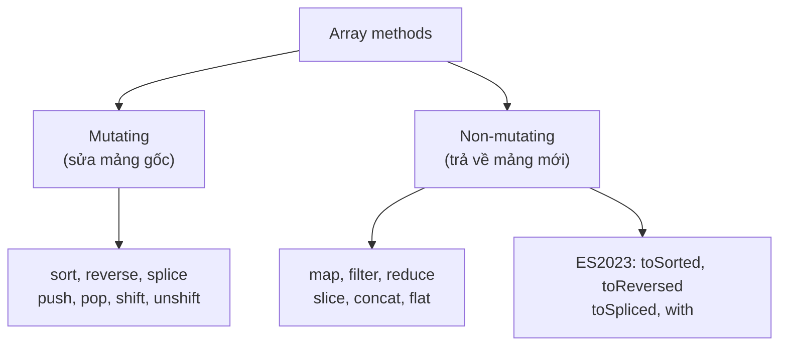
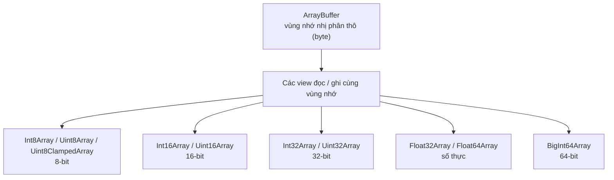

# Arrays và Typed Arrays

**Array** (mảng) là cấu trúc dữ liệu dùng để lưu nhiều giá trị theo thứ tự, và truy cập từng phần tử qua chỉ số (index) bắt đầu từ 0 — vì vậy chúng được gọi là **indexed collections** (tập hợp có chỉ số). Mảng thông thường có thể chứa mọi kiểu dữ liệu và tự co giãn kích thước. Trong khi đó, **Typed Arrays** (mảng kiểu) chuyên dùng để lưu dữ liệu số ở dạng nhị phân với hiệu năng cao, thường gặp khi xử lý hình ảnh, âm thanh hay dữ liệu mạng.

---

## 🎯 Cần nắm gì sau bài này?

:::note[Ghi nhớ nhanh]

- ⭐ **Ưu tiên array methods bậc cao** — `map`, `filter`, `reduce`, `find` biểu đạt ý định ngắn gọn, tránh sai chỉ số và không mutate mảng gốc.
- ⭐ **Phân biệt method mutating và non-mutating** — `sort`, `reverse`, `splice`, `push`... sửa mảng gốc; `map`, `filter`, `slice`, `concat`, `flat` trả về mảng mới.
- **`to*` methods của ES2023** — `toSorted`, `toReversed`, `toSpliced`, `with` trả về mảng mới, hợp với functional style và React state.
- **Array trong JS là object** — có thể sparse hoặc gán property; dùng `Array.isArray()` để kiểm tra, tránh sparse array vì V8 chuyển sang dictionary mode chậm.
- **`TypedArray` cho dữ liệu nhị phân hiệu năng cao** — là view trên `ArrayBuffer` với kiểu số cố định (`Uint8Array`, `Float32Array`...), size cố định nên không có method mutating như `push`/`splice`.

:::

---

## Mục lục

- [Vì sao có array methods (và Typed Array)?](#vì-sao-có-array-methods-và-typed-array)
- [Array cơ bản](#array-cơ-bản)
- [Array methods quan trọng](#array-methods-quan-trọng)
- [Immutable methods (ES2023)](#immutable-methods-es2023)
- [Typed Arrays](#typed-arrays)

---

## Vì sao có array methods (và Typed Array)?

**Vấn đề:**

```js
// Xử lý danh sách bằng vòng for thủ công — dài dòng, dễ sai chỉ số
const nums = [1, -2, 3, -4, 5];

// Lọc số dương rồi nhân đôi
const result = [];
for (let i = 0; i <= nums.length; i++) {  // bug: <= làm tràn index
  if (nums[i] > 0) {
    result.push(nums[i] * 2);
  }
}

// Tính tổng cũng phải tự quản biến tích lũy
let total = 0;
for (let i = 0; i < nums.length; i++) {
  total += nums[i];
}

// Còn dữ liệu nhị phân (ảnh, audio) thì mảng thường lưu rất tốn bộ nhớ
// và không khớp định dạng byte mà Web API yêu cầu.
```

**Giải pháp:**

```js
const nums = [1, -2, 3, -4, 5];

// Array methods bậc cao biểu đạt Ý ĐỊNH ngắn gọn, không lo sai chỉ số
const result = nums.filter(x => x > 0).map(x => x * 2); // [2, 6, 10]
const total = nums.reduce((acc, x) => acc + x, 0);       // 3

// map/filter/reduce/find KHÔNG mutate mảng gốc → immutable-friendly
console.log(nums); // [1, -2, 3, -4, 5] vẫn nguyên

// Typed Array ra đời để xử lý DỮ LIỆU NHỊ PHÂN hiệu năng cao,
// khớp đúng định dạng byte (ảnh, audio, WebGL, fetch ArrayBuffer)
const buffer = await fetch("/img.png").then(r => r.arrayBuffer());
const bytes = new Uint8Array(buffer); // mỗi phần tử đúng 1 byte
```

:::tip[Dùng thực tế]

- **Biến đổi dữ liệu API**: `users.map(u => u.name)` để lấy danh sách tên.
- **Lọc theo điều kiện**: `products.filter(p => p.inStock)` lấy hàng còn bán.
- **Tính tổng/gộp**: `cart.reduce((sum, item) => sum + item.price, 0)` tính tiền giỏ hàng.
- **Xử lý ảnh/âm thanh/binary**: dùng `Uint8Array`, `Float32Array`... cho pixel canvas, WebAudio, hay đọc file nhị phân.

:::

---

## Array cơ bản

```js
const arr = [1, "hi", true, null, { x: 1 }];

arr.length;      // 5
arr[0];          // 1
arr[10];         // undefined (không lỗi)
arr.at(-1);      // { x: 1 } — index âm

arr.push(4);     // thêm cuối → length mới
arr.pop();       // bỏ cuối → giá trị bị bỏ
arr.unshift(0);  // thêm đầu
arr.shift();     // bỏ đầu
```

:::warning[Cần lưu ý]

**Array trong JS là object** — không phải mảng C/Java thực thụ. Một số
hệ quả:

- Index có thể bị **"sparse"** (rỗng giữa chừng):

```js
const a = [];
a[100] = 1;
a.length;  // 101
a[50];     // undefined (chưa bao giờ gán)
```

- Có thể gán property như object:

```js
const a = [1, 2, 3];
a.foo = "bar";
a.foo;     // "bar"
a.length;  // 3 (property không tính vào length)
```

- `typeof` trả `"object"`. Dùng `Array.isArray(a)` để check.

Engine V8 tối ưu cho **packed array** (không sparse, cùng kiểu). Khi bạn
"đục lỗ" trong array, V8 chuyển sang **dictionary mode** chậm hơn nhiều.
Pattern xấu nên tránh:

```js
const a = new Array(10000); // sparse, length lớn nhưng rỗng
```

:::

---

## Array methods quan trọng

**Iteration:**

```js
arr.forEach(x => console.log(x));

arr.map(x => x * 2);              // mảng mới với element transform
arr.filter(x => x > 0);           // mảng mới với element thỏa điều kiện
arr.reduce((acc, x) => acc + x, 0); // gộp về một giá trị

arr.some(x => x > 10);            // có ít nhất 1 thỏa? → boolean
arr.every(x => x > 0);            // tất cả thỏa? → boolean

arr.find(x => x.id === 1);        // element đầu tiên thỏa
arr.findIndex(x => x.id === 1);   // index
arr.findLast(x => x > 5);         // element cuối thỏa (ES2023)
```

**Modify (mutating)** — sửa chính array:

```js
arr.sort();
arr.sort((a, b) => a - b);   // tăng dần
arr.reverse();
arr.splice(1, 2);            // xóa 2 element từ index 1
arr.splice(1, 0, "x");       // chèn "x" tại index 1
```

**Non-mutating** — trả về array mới:

```js
arr.slice(1, 3);              // [arr[1], arr[2]]
arr.concat([4, 5]);
[...arr, 4, 5];               // idiom hiện đại
arr.flat();                   // làm phẳng 1 cấp
arr.flat(Infinity);           // mọi cấp
arr.flatMap(x => [x, x * 2]); // map rồi flat
```

**Index:**

```js
arr.indexOf(2);
arr.lastIndexOf(2);
arr.includes(2);
arr.join(",");
```

Điểm mấu chốt khi chọn method là **có mutate mảng gốc hay không**:



---

## Immutable methods (ES2023)

ES2023 thêm 4 method **trả về array mới** thay vì mutate:

```js
const arr = [3, 1, 2];

arr.toSorted();              // [1, 2, 3] — arr không đổi
arr.toReversed();
arr.toSpliced(1, 1);         // [3, 2] — bỏ index 1
arr.with(0, 99);             // [99, 1, 2] — thay index 0

console.log(arr);            // [3, 1, 2] — vẫn nguyên
```

:::tip[Mẹo]

Các method `to*` là chuẩn mới — phù hợp với functional style và React
state (không bao giờ mutate state):

```js
// React — set state không mutate
setItems(items.toSorted((a, b) => a.id - b.id));
setItems(items.toSpliced(index, 1));
setItems(items.with(index, newItem));
```

Trước ES2023, phải spread + sort:

```js
setItems([...items].sort((a, b) => a.id - b.id));
```

Không chỉ ngắn hơn — `to*` cũng được optimize tốt trong engine hiện đại.

:::

---

## Typed Arrays

`TypedArray` — mảng số kiểu **cố định**, sát với bộ nhớ thật (giống mảng C).

```js
const buf = new ArrayBuffer(16);  // 16 byte raw

const i32 = new Int32Array(buf);  // 4 phần tử 32-bit
const u8  = new Uint8Array(buf);  // 16 phần tử 8-bit (cùng bộ nhớ)

i32[0] = 0x12345678;
console.log(u8[0]); // 0x78 (little-endian)
```

Quan hệ giữa `ArrayBuffer` (vùng nhớ thô) và các view TypedArray:



Các kiểu:

| Type | Bit | Min | Max |
|------|-----|-----|-----|
| `Int8Array` | 8 | -128 | 127 |
| `Uint8Array` | 8 | 0 | 255 |
| `Uint8ClampedArray` | 8 | 0 | 255 (clamp khi gán ngoài) |
| `Int16Array` | 16 | -32768 | 32767 |
| `Uint16Array` | 16 | 0 | 65535 |
| `Int32Array` | 32 | ~-2.1B | ~2.1B |
| `Uint32Array` | 32 | 0 | ~4.3B |
| `Float32Array` | 32 | float | float |
| `Float64Array` | 64 | double | double |
| `BigInt64Array` | 64 | bigint | bigint |

:::info[Phân tích]

**Khi nào dùng TypedArray?**

- Xử lý **binary data** từ network/file: hình ảnh, audio, video, protocol buffers.
- Web API: `Canvas`, `WebGL`, `WebAudio`, `Fetch` body, `File`, `Crypto`.
- Cần **performance cao** với mảng số (game engine, image processing).
- Tương thích với WebAssembly memory.

Ví dụ thực:

```js
// Đọc file binary
const buffer = await file.arrayBuffer();
const bytes = new Uint8Array(buffer);

// Vẽ canvas pixel
const imageData = ctx.getImageData(0, 0, w, h);
const pixels = imageData.data; // Uint8ClampedArray
for (let i = 0; i < pixels.length; i += 4) {
  pixels[i] = 255 - pixels[i]; // invert red
}
ctx.putImageData(imageData, 0, 0);

// Encode/decode string
const enc = new TextEncoder().encode("Hello"); // Uint8Array
new TextDecoder().decode(enc); // "Hello"
```

TypedArray là **không có method mutating** như `splice`/`push` — vì size
cố định. Chỉ có subset của Array API.

:::

:::warning[Cần lưu ý]

`SharedArrayBuffer` cho phép chia sẻ TypedArray giữa **Worker threads**.
Vì lý do bảo mật (Spectre/Meltdown), browser yêu cầu header
**COOP/COEP** mới được dùng:

```
Cross-Origin-Opener-Policy: same-origin
Cross-Origin-Embedder-Policy: require-corp
```

Trong Node.js dùng được không hạn chế. Khi cần shared memory đa luồng,
dùng cùng với `Atomics` để đồng bộ.

:::
