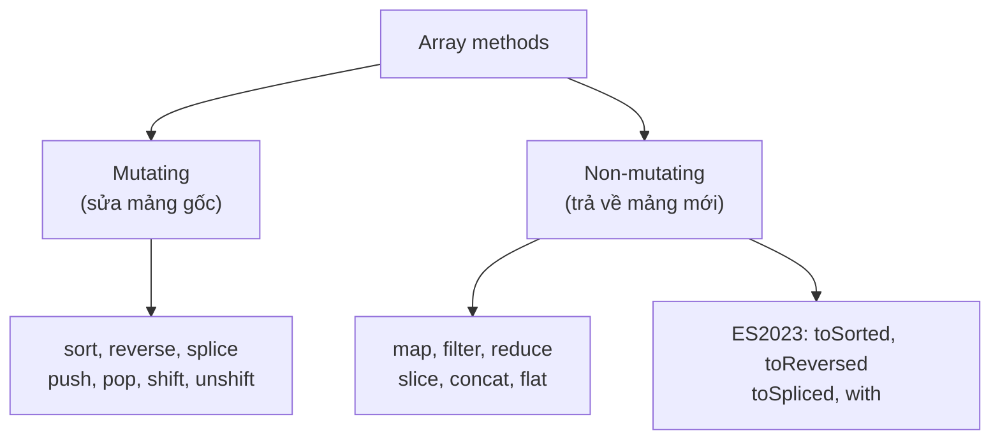
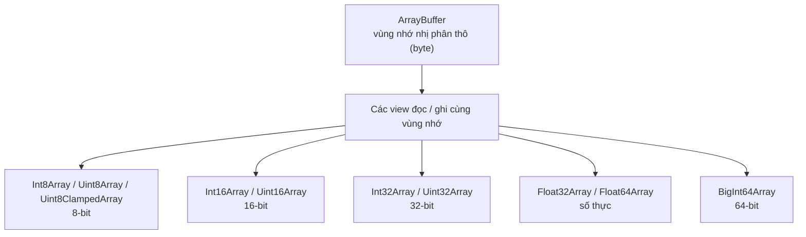

# Arrays và Typed Arrays

**Array** (mảng) là cấu trúc dữ liệu dùng để lưu nhiều giá trị theo thứ tự, và truy cập từng phần tử qua chỉ số (index) bắt đầu từ 0 — vì vậy chúng được gọi là **indexed collections** (tập hợp có chỉ số). Mảng thông thường có thể chứa mọi kiểu dữ liệu và tự co giãn kích thước. Trong khi đó, **Typed Arrays** (mảng kiểu) chuyên dùng để lưu dữ liệu số ở dạng nhị phân với hiệu năng cao, thường gặp khi xử lý hình ảnh, âm thanh hay dữ liệu mạng.

[](pathname:///img/javascript/indexed-collections.webp)

---

:::note[Ghi nhớ nhanh]

- ⭐ **Ưu tiên array methods bậc cao** — `map`, `filter`, `reduce`, `find` biểu đạt ý định ngắn gọn, tránh sai chỉ số và không mutate mảng gốc.
- ⭐ **Phân biệt method mutating và non-mutating** — `sort`, `reverse`, `splice`, `push`... sửa mảng gốc; `map`, `filter`, `slice`, `concat`, `flat` trả về mảng mới.
- **`to*` methods của ES2023** — `toSorted`, `toReversed`, `toSpliced`, `with` trả về mảng mới, hợp với functional style và React state.
- **Array trong JS là object** — có thể sparse hoặc gán property; dùng `Array.isArray()` để kiểm tra, tránh sparse array vì V8 chuyển sang dictionary mode chậm.
- **`TypedArray` cho dữ liệu nhị phân hiệu năng cao** — là view trên `ArrayBuffer` với kiểu số cố định (`Uint8Array`, `Float32Array`...), size cố định nên không có method mutating như `push`/`splice`.

:::

---

## Mục lục

- [Vì sao có array methods (và Typed Array)?](#vì-sao-có-array-methods-và-typed-array)
- [Array cơ bản](#array-cơ-bản)
- [Array methods quan trọng](#array-methods-quan-trọng)
- [Immutable methods (ES2023)](#immutable-methods-es2023)
- [Typed Arrays](#typed-arrays)
- [Câu hỏi phỏng vấn](#câu-hỏi-phỏng-vấn)

---

## Vì sao có array methods (và Typed Array)?

**Vấn đề:**

```js
// Xử lý danh sách bằng vòng for thủ công — dài dòng, dễ sai chỉ số
const nums = [1, -2, 3, -4, 5];

// Lọc số dương rồi nhân đôi
const result = [];
for (let i = 0; i <= nums.length; i++) {  // bug: <= làm tràn index
  if (nums[i] > 0) {
    result.push(nums[i] * 2);
  }
}

// Tính tổng cũng phải tự quản biến tích lũy
let total = 0;
for (let i = 0; i < nums.length; i++) {
  total += nums[i];
}

// Còn dữ liệu nhị phân (ảnh, audio) thì mảng thường lưu rất tốn bộ nhớ
// và không khớp định dạng byte mà Web API yêu cầu.
```

**Giải pháp:**

```js
const nums = [1, -2, 3, -4, 5];

// Array methods bậc cao biểu đạt Ý ĐỊNH ngắn gọn, không lo sai chỉ số
const result = nums.filter(x => x > 0).map(x => x * 2); // [2, 6, 10]
const total = nums.reduce((acc, x) => acc + x, 0);       // 3

// map/filter/reduce/find KHÔNG mutate mảng gốc → immutable-friendly
console.log(nums); // [1, -2, 3, -4, 5] vẫn nguyên

// Typed Array ra đời để xử lý DỮ LIỆU NHỊ PHÂN hiệu năng cao,
// khớp đúng định dạng byte (ảnh, audio, WebGL, fetch ArrayBuffer)
const buffer = await fetch("/img.png").then(r => r.arrayBuffer());
const bytes = new Uint8Array(buffer); // mỗi phần tử đúng 1 byte
```

:::tip[Dùng thực tế]

- **Biến đổi dữ liệu API**: `users.map(u => u.name)` để lấy danh sách tên.
- **Lọc theo điều kiện**: `products.filter(p => p.inStock)` lấy hàng còn bán.
- **Tính tổng/gộp**: `cart.reduce((sum, item) => sum + item.price, 0)` tính tiền giỏ hàng.
- **Xử lý ảnh/âm thanh/binary**: dùng `Uint8Array`, `Float32Array`... cho pixel canvas, WebAudio, hay đọc file nhị phân.

:::

---

## Array cơ bản

```js
const arr = [1, "hi", true, null, { x: 1 }];

arr.length;      // 5
arr[0];          // 1
arr[10];         // undefined (không lỗi)
arr.at(-1);      // { x: 1 } — index âm

arr.push(4);     // thêm cuối → length mới
arr.pop();       // bỏ cuối → giá trị bị bỏ
arr.unshift(0);  // thêm đầu
arr.shift();     // bỏ đầu
```

:::warning[Cần lưu ý]

**Array trong JS là object** — không phải mảng C/Java thực thụ. Một số
hệ quả:

- Index có thể bị **"sparse"** (rỗng giữa chừng):

```js
const a = [];
a[100] = 1;
a.length;  // 101
a[50];     // undefined (chưa bao giờ gán)
```

- Có thể gán property như object:

```js
const a = [1, 2, 3];
a.foo = "bar";
a.foo;     // "bar"
a.length;  // 3 (property không tính vào length)
```

- `typeof` trả `"object"`. Dùng `Array.isArray(a)` để check.

Engine V8 tối ưu cho **packed array** (không sparse, cùng kiểu). Khi bạn
"đục lỗ" trong array, V8 chuyển sang **dictionary mode** chậm hơn nhiều.
Pattern xấu nên tránh:

```js
const a = new Array(10000); // sparse, length lớn nhưng rỗng
```

:::

---

## Array methods quan trọng

**Iteration:**

```js
arr.forEach(x => console.log(x));

arr.map(x => x * 2);              // mảng mới với element transform
arr.filter(x => x > 0);           // mảng mới với element thỏa điều kiện
arr.reduce((acc, x) => acc + x, 0); // gộp về một giá trị

arr.some(x => x > 10);            // có ít nhất 1 thỏa? → boolean
arr.every(x => x > 0);            // tất cả thỏa? → boolean

arr.find(x => x.id === 1);        // element đầu tiên thỏa
arr.findIndex(x => x.id === 1);   // index
arr.findLast(x => x > 5);         // element cuối thỏa (ES2023)
```

**Modify (mutating)** — sửa chính array:

```js
arr.sort();
arr.sort((a, b) => a - b);   // tăng dần
arr.reverse();
arr.splice(1, 2);            // xóa 2 element từ index 1
arr.splice(1, 0, "x");       // chèn "x" tại index 1
```

**Non-mutating** — trả về array mới:

```js
arr.slice(1, 3);              // [arr[1], arr[2]]
arr.concat([4, 5]);
[...arr, 4, 5];               // idiom hiện đại
arr.flat();                   // làm phẳng 1 cấp
arr.flat(Infinity);           // mọi cấp
arr.flatMap(x => [x, x * 2]); // map rồi flat
```

**Index:**

```js
arr.indexOf(2);
arr.lastIndexOf(2);
arr.includes(2);
arr.join(",");
```

Điểm mấu chốt khi chọn method là **có mutate mảng gốc hay không**:



---

## Immutable methods (ES2023)

ES2023 thêm 4 method **trả về array mới** thay vì mutate:

```js
const arr = [3, 1, 2];

arr.toSorted();              // [1, 2, 3] — arr không đổi
arr.toReversed();
arr.toSpliced(1, 1);         // [3, 2] — bỏ index 1
arr.with(0, 99);             // [99, 1, 2] — thay index 0

console.log(arr);            // [3, 1, 2] — vẫn nguyên
```

:::tip[Mẹo]

Các method `to*` là chuẩn mới — phù hợp với functional style và React
state (không bao giờ mutate state):

```js
// React — set state không mutate
setItems(items.toSorted((a, b) => a.id - b.id));
setItems(items.toSpliced(index, 1));
setItems(items.with(index, newItem));
```

Trước ES2023, phải spread + sort:

```js
setItems([...items].sort((a, b) => a.id - b.id));
```

Không chỉ ngắn hơn — `to*` cũng được optimize tốt trong engine hiện đại.

:::

---

## Typed Arrays

`TypedArray` — mảng số kiểu **cố định**, sát với bộ nhớ thật (giống mảng C).

```js
const buf = new ArrayBuffer(16);  // 16 byte raw

const i32 = new Int32Array(buf);  // 4 phần tử 32-bit
const u8  = new Uint8Array(buf);  // 16 phần tử 8-bit (cùng bộ nhớ)

i32[0] = 0x12345678;
console.log(u8[0]); // 0x78 (little-endian)
```

Quan hệ giữa `ArrayBuffer` (vùng nhớ thô) và các view TypedArray:



Các kiểu:

| Type | Bit | Min | Max |
|------|-----|-----|-----|
| `Int8Array` | 8 | -128 | 127 |
| `Uint8Array` | 8 | 0 | 255 |
| `Uint8ClampedArray` | 8 | 0 | 255 (clamp khi gán ngoài) |
| `Int16Array` | 16 | -32768 | 32767 |
| `Uint16Array` | 16 | 0 | 65535 |
| `Int32Array` | 32 | ~-2.1B | ~2.1B |
| `Uint32Array` | 32 | 0 | ~4.3B |
| `Float32Array` | 32 | float | float |
| `Float64Array` | 64 | double | double |
| `BigInt64Array` | 64 | bigint | bigint |

:::info[Phân tích]

**Khi nào dùng TypedArray?**

- Xử lý **binary data** từ network/file: hình ảnh, audio, video, protocol buffers.
- Web API: `Canvas`, `WebGL`, `WebAudio`, `Fetch` body, `File`, `Crypto`.
- Cần **performance cao** với mảng số (game engine, image processing).
- Tương thích với WebAssembly memory.

Ví dụ thực:

```js
// Đọc file binary
const buffer = await file.arrayBuffer();
const bytes = new Uint8Array(buffer);

// Vẽ canvas pixel
const imageData = ctx.getImageData(0, 0, w, h);
const pixels = imageData.data; // Uint8ClampedArray
for (let i = 0; i < pixels.length; i += 4) {
  pixels[i] = 255 - pixels[i]; // invert red
}
ctx.putImageData(imageData, 0, 0);

// Encode/decode string
const enc = new TextEncoder().encode("Hello"); // Uint8Array
new TextDecoder().decode(enc); // "Hello"
```

TypedArray là **không có method mutating** như `splice`/`push` — vì size
cố định. Chỉ có subset của Array API.

:::

:::warning[Cần lưu ý]

`SharedArrayBuffer` cho phép chia sẻ TypedArray giữa **Worker threads**.
Vì lý do bảo mật (Spectre/Meltdown), browser yêu cầu header
**COOP/COEP** mới được dùng:

```
Cross-Origin-Opener-Policy: same-origin
Cross-Origin-Embedder-Policy: require-corp
```

Trong Node.js dùng được không hạn chế. Khi cần shared memory đa luồng,
dùng cùng với `Atomics` để đồng bộ.

:::

---

## Câu hỏi phỏng vấn

Những câu thường gặp về chủ đề này. Tự trả lời trước, rồi bấm **Xem đáp án** để đối chiếu.

**1. Vì sao `typeof []` trả về `"object"`? Có những cách nào để kiểm tra một giá trị là array, và vì sao `Array.isArray()` được ưu tiên?**

<details className="qa">
<summary>Xem đáp án</summary>

Vì **array trong JavaScript thực chất là object** — một object đặc biệt với key dạng số, prototype là `Array.prototype` và property `length` tự cập nhật. `typeof` chỉ phân biệt được 8 kiểu cơ bản, không có nhánh riêng cho array.

Các cách kiểm tra:

```js
Array.isArray([]);                              // true — chuẩn xác nhất
Object.prototype.toString.call([]);             // "[object Array]"
[] instanceof Array;                            // true — nhưng có bẫy
typeof [];                                      // "object" — vô dụng
```

`Array.isArray()` được ưu tiên vì nó kiểm tra **internal slot** của giá trị, đúng trong mọi tình huống:

- `instanceof Array` **sai khi mảng đến từ realm khác** — ví dụ mảng tạo trong một `iframe` hoặc `vm` của Node có `Array.prototype` riêng, nên `arr instanceof Array` trả về `false` dù nó thật sự là mảng.
- `instanceof` cũng bị đánh lừa nếu ai đó sửa `Symbol.hasInstance` hoặc prototype chain.
- `Object.prototype.toString.call()` thì đúng nhưng dài dòng và cũng có thể bị can thiệp qua `Symbol.toStringTag`.

</details>

**2. Phân loại các array method thành nhóm `mutating` và `non-mutating`. Kể ít nhất 4 method mỗi nhóm.**

<details className="qa">
<summary>Xem đáp án</summary>

| Mutating (sửa mảng gốc) | Non-mutating (trả mảng/giá trị mới) |
|---|---|
| `push`, `pop`, `shift`, `unshift` | `map`, `filter`, `slice`, `concat` |
| `splice`, `sort`, `reverse` | `flat`, `flatMap`, `join`, `reduce` |
| `fill`, `copyWithin` | `toSorted`, `toReversed`, `toSpliced`, `with` (ES2023) |

```js
const arr = [3, 1, 2];

arr.sort();        // arr thành [1, 2, 3] — ĐÃ đổi mảng gốc
arr.map(x => x);   // trả mảng mới, arr giữ nguyên
```

**Mẹo nhớ:** 7 method mutating kinh điển là `push`, `pop`, `shift`, `unshift`, `splice`, `sort`, `reverse`. Hai cái nguy hiểm nhất là **`sort` và `reverse`**, vì tên nghe như "trả về kết quả" nhưng thật ra sửa tại chỗ rồi trả về chính mảng đó — rất dễ gây bug trong React khi vô tình mutate state. ES2023 thêm bộ `to*` chính là để có bản non-mutating cho ba method này cộng thêm `with`.

</details>

**3. So sánh `slice()` và `splice()` về tham số, giá trị trả về và tác động lên mảng gốc. Đoán output của `[1,2,3,4].splice(1, 2)`.**

<details className="qa">
<summary>Xem đáp án</summary>

| | `slice(start, end)` | `splice(start, deleteCount, ...items)` |
|---|---|---|
| Tham số | Vị trí bắt đầu và **kết thúc** (không bao gồm `end`) | Vị trí bắt đầu, **số lượng cần xoá**, các phần tử chèn thêm |
| Trả về | Mảng mới gồm các phần tử được cắt | Mảng chứa các phần tử **bị xoá** |
| Mảng gốc | **Không đổi** | **Bị sửa tại chỗ** |

```js
const a = [1, 2, 3, 4];
a.splice(1, 2);    // trả về [2, 3]
console.log(a);    // [1, 4] — mảng gốc đã bị cắt

const b = [1, 2, 3, 4];
b.slice(1, 2);     // trả về [2]
console.log(b);    // [1, 2, 3, 4] — nguyên vẹn

[1, 2, 3].splice(1, 0, "x"); // trả về [] — chèn "x", không xoá gì
```

Điểm bẫy thường gặp: tham số thứ hai mang ý nghĩa **khác hẳn nhau** — với `slice` là index kết thúc, với `splice` là số phần tử bị xoá. Bản non-mutating của `splice` là `toSpliced` (ES2023), trả về mảng mới sau khi cắt.

</details>

**4. `map()`, `filter()`, `forEach()` khác nhau thế nào về giá trị trả về? Khi nào dùng `forEach` là sai lựa chọn?**

<details className="qa">
<summary>Xem đáp án</summary>

```js
const a = [1, 2, 3];

a.map(x => x * 2);     // [2, 4, 6] — mảng MỚI, cùng độ dài, phần tử đã biến đổi
a.filter(x => x > 1);  // [2, 3]    — mảng MỚI, độ dài <= gốc, giữ nguyên phần tử
a.forEach(x => x * 2); // undefined — không trả về gì
```

- `map` — **biến đổi** từng phần tử, luôn giữ đúng số phần tử.
- `filter` — **chọn lọc** theo điều kiện, không đổi phần tử.
- `forEach` — chỉ **lặp để gây side effect** (log, gọi API, cập nhật DOM).

**Khi nào `forEach` là sai lựa chọn:**

- Khi bạn cần một kết quả — dùng `map`/`filter`/`reduce` để code nói rõ ý định và nối chuỗi được, thay vì `forEach` + `push` vào mảng ngoài.
- Khi cần **dừng sớm**: `forEach` không hỗ trợ `break`/`return` để thoát vòng lặp (`return` chỉ thoát một lần gọi callback). Dùng `for...of`, `some`, `find`.
- Khi callback là **async** và bạn cần chờ: `forEach` không `await` từng lần lặp. Dùng `for...of` với `await`, hoặc `Promise.all(arr.map(...))`.

</details>

**5. Giải thích `reduce()`: các tham số của callback, vai trò của `initialValue`, và điều gì xảy ra nếu gọi `reduce` trên mảng rỗng mà không có `initialValue`.**

<details className="qa">
<summary>Xem đáp án</summary>

`reduce` gộp cả mảng về **một giá trị duy nhất**. Callback nhận 4 tham số:

```js
arr.reduce((accumulator, currentValue, currentIndex, array) => {
  return accumulator; // giá trị trả về trở thành accumulator của vòng sau
}, initialValue);
```

**Vai trò của `initialValue`:**

- **Có** `initialValue`: `acc` bắt đầu bằng giá trị này, callback chạy từ index `0`.
- **Không** có: phần tử đầu tiên được lấy làm `acc`, callback chạy từ index `1`.

```js
[1, 2, 3].reduce((s, x) => s + x, 0);  // 6
[1, 2, 3].reduce((s, x) => s + x);     // 6 — nhưng chạy 2 vòng thay vì 3
[].reduce((s, x) => s + x, 0);         // 0 — an toàn
[].reduce((s, x) => s + x);            // TypeError: Reduce of empty array
                                       // with no initial value
```

**Luôn truyền `initialValue`** vì hai lý do: tránh `TypeError` khi mảng rỗng (rất hay gặp với dữ liệu API), và bảo đảm **kiểu của `acc` đúng như mong muốn** — ví dụ gộp mảng object thành một object thì `acc` phải là `{}` ngay từ đầu, không thể là object đầu tiên.

</details>

**6. Cài đặt lại `map` (hoặc `filter`) bằng `reduce`. Điều này cho thấy gì về quan hệ giữa các method?**

<details className="qa">
<summary>Xem đáp án</summary>

```js
// map bằng reduce
const map = (arr, fn) =>
  arr.reduce((acc, x, i) => {
    acc.push(fn(x, i, arr));
    return acc;
  }, []);

// filter bằng reduce
const filter = (arr, fn) =>
  arr.reduce((acc, x, i) => (fn(x, i, arr) ? [...acc, x] : acc), []);

map([1, 2, 3], x => x * 2);    // [2, 4, 6]
filter([1, 2, 3], x => x > 1); // [2, 3]
```

Điều này cho thấy `reduce` là **method tổng quát nhất** trong nhóm — `map`, `filter`, `some`, `every`, `find`, `join`, `flat` đều có thể diễn đạt lại bằng `reduce`, vì bản chất chung của chúng là "duyệt mảng và tích luỹ một kết quả". `reduce` chỉ để lộ trực tiếp biến tích luỹ đó cho ta điều khiển.

Nhưng **có thể** không có nghĩa là **nên**: `map`/`filter` đọc ra ý định ngay lập tức, còn `reduce` bắt người đọc phải giải mã logic bên trong. Chỉ dùng `reduce` khi thật sự cần gộp về một giá trị (tổng, object nhóm, chuỗi) hoặc khi cần làm nhiều việc trong một lượt duyệt.

</details>

**7. Vì sao `[10, 9, 1].sort()` cho kết quả `[1, 10, 9]`? `sort()` mặc định so sánh thế nào và làm sao sắp xếp số đúng?**

<details className="qa">
<summary>Xem đáp án</summary>

Vì `sort()` **không có compare function** thì mặc định **ép mọi phần tử sang string** rồi so sánh theo thứ tự các đơn vị mã UTF-16 (gần như thứ tự từ điển):

```js
[10, 9, 1].sort();  // [1, 10, 9]
// so sánh "10", "9", "1" như chuỗi:
// "1" < "10" < "9" vì ký tự đầu "1" đứng trước "9"
```

Muốn sắp xếp số đúng, phải truyền **comparator** trả về số âm/0/dương:

```js
[10, 9, 1].sort((a, b) => a - b);   // [1, 9, 10] — tăng dần
[10, 9, 1].sort((a, b) => b - a);   // [10, 9, 1] — giảm dần

// Với chuỗi tiếng Việt / có dấu, dùng localeCompare
["Ẩn", "An", "Ân"].sort((a, b) => a.localeCompare(b, "vi"));
```

Quy ước của comparator: trả **âm** nghĩa là `a` đứng trước `b`, **dương** là `b` đứng trước, **0** là giữ nguyên thứ tự tương đối. Lưu ý đừng dùng `a > b` (trả boolean) làm comparator — boolean bị ép về `1`/`0`, không bao giờ ra số âm, nên kết quả sai.

</details>

**8. `sort()` có `stable` không, có mutate mảng gốc không, và trả về gì? Làm sao sắp xếp mà giữ nguyên mảng ban đầu?**

<details className="qa">
<summary>Xem đáp án</summary>

- **Stable:** có. Từ **ES2019**, spec bắt buộc `Array.prototype.sort` phải ổn định — hai phần tử được coi là bằng nhau sẽ giữ nguyên thứ tự tương đối ban đầu. Trước đó mỗi engine làm một kiểu (V8 từng dùng quicksort không ổn định cho mảng lớn).
- **Mutate:** có — `sort` sắp xếp **tại chỗ**.
- **Trả về:** chính **tham chiếu tới mảng gốc** đó, không phải bản sao. Đây là bẫy phổ biến:

```js
const a = [3, 1, 2];
const b = a.sort();
b === a;           // true — cùng một mảng!
console.log(a);    // [1, 2, 3] — a đã bị đổi
```

**Sắp xếp mà giữ nguyên mảng gốc** — ba cách:

```js
const sorted1 = a.toSorted((x, y) => x - y);  // ES2023, gọn nhất
const sorted2 = [...a].sort((x, y) => x - y); // copy rồi sort
const sorted3 = a.slice().sort((x, y) => x - y);
```

Tính stable rất quan trọng khi **sắp xếp nhiều tiêu chí liên tiếp**: sort theo tên trước, rồi sort theo tuổi — những người cùng tuổi vẫn giữ đúng thứ tự tên đã sắp trước đó.

</details>

**9. `find()` khác `filter()` ở điểm nào? `some()` và `every()` trả về gì với mảng rỗng, và vì sao?**

<details className="qa">
<summary>Xem đáp án</summary>

| | `find()` | `filter()` |
|---|---|---|
| Trả về | **Phần tử đầu tiên** thoả điều kiện, hoặc `undefined` | **Mảng mới** chứa mọi phần tử thoả (có thể rỗng) |
| Dừng sớm | Có — gặp kết quả là dừng | Không — luôn duyệt hết mảng |

```js
const users = [{ id: 1 }, { id: 2 }, { id: 1 }];
users.find(u => u.id === 1);    // { id: 1 } — object đầu tiên
users.filter(u => u.id === 1);  // [{id:1}, {id:1}] — mảng
users.find(u => u.id === 9);    // undefined
users.filter(u => u.id === 9);  // [] — mảng rỗng, vẫn truthy!
```

Sai lầm hay gặp: `if (users.filter(...))` luôn đúng vì mảng rỗng là truthy — phải kiểm tra `.length`.

**Với mảng rỗng:**

```js
[].some(x => true);   // false
[].every(x => false); // true (!)
```

`some` hỏi "có **ít nhất một** phần tử thoả không?" — không có phần tử nào thì không thể có cái nào thoả → `false`. `every` hỏi "có phần tử nào **vi phạm** không?" — không có phần tử nào thì không có gì vi phạm → `true`. Đây là quy ước logic gọi là **vacuous truth** (đúng một cách rỗng), thống nhất với toán học.

</details>

**10. So sánh `indexOf()` và `includes()`. Vì sao `[NaN].indexOf(NaN)` ra `-1` nhưng `[NaN].includes(NaN)` lại là `true`?**

<details className="qa">
<summary>Xem đáp án</summary>

| | `indexOf(x)` | `includes(x)` |
|---|---|---|
| Trả về | **Index** của phần tử, hoặc `-1` nếu không có | **Boolean** |
| Thuật toán so sánh | **Strict equality (`===`)** | **SameValueZero** |
| Tìm được `NaN` | Không | Có |
| Nhìn thấy lỗ trong sparse array | Không | Có (coi là `undefined`) |

```js
[NaN].indexOf(NaN);    // -1
[NaN].includes(NaN);   // true
[1, 2, 3].indexOf(2);  // 1
[1, 2, 3].includes(2); // true
[, ,].includes(undefined); // true
[, ,].indexOf(undefined);  // -1
```

**Lý do:** `indexOf` dùng `===`, mà theo chuẩn IEEE 754 thì `NaN === NaN` là `false` — `NaN` không bằng chính nó, nên không bao giờ tìm thấy. `includes` (ES2016) được thiết kế sau và dùng **SameValueZero**, thuật toán giống `===` nhưng coi `NaN` bằng `NaN` (và gộp `+0` với `-0`). Đây cũng chính là thuật toán mà `Map`/`Set` dùng.

Thực hành: cần biết "có tồn tại không" thì dùng `includes` (rõ nghĩa và an toàn với `NaN`); cần biết "ở vị trí nào" mới dùng `indexOf`.

</details>

**11. `sparse array` là gì? Điều gì xảy ra với `a[100] = 1` trên mảng rỗng, và các method như `map`/`forEach` xử lý lỗ hổng thế nào?**

<details className="qa">
<summary>Xem đáp án</summary>

**Sparse array** (mảng thưa) là mảng có **"lỗ"** — những index nằm trong khoảng `0..length-1` nhưng chưa bao giờ được gán giá trị. Lỗ khác `undefined`: index đó thật sự **không tồn tại** như một property.

```js
const a = [];
a[100] = 1;
a.length;          // 101 — length nhảy lên theo index lớn nhất + 1
a[50];             // undefined — nhưng 50 in a → false
Object.keys(a);    // ["100"] — chỉ đúng một property tồn tại
```

Các method xử lý lỗ **không nhất quán**, đây là nguồn bug khó chịu:

```js
[1, , 3].forEach(x => console.log(x)); // in 1, 3 — BỎ QUA lỗ
[1, , 3].map(x => x * 2);              // [2, <1 empty>, 6] — giữ nguyên lỗ
[1, , 3].filter(() => true);           // [1, 3] — LOẠI BỎ lỗ
[1, , 3].join("-");                    // "1--3" — lỗ thành chuỗi rỗng
[1, , 3].includes(undefined);          // true
```

**Nên tránh sparse array** vì hai lý do: hành vi khó đoán như trên, và **hiệu năng** — V8 tối ưu cho *packed array*; khi "đục lỗ", mảng bị chuyển sang **dictionary mode** chậm hơn nhiều. Vì vậy đừng viết `new Array(10000)` rồi gán rải rác; dùng `Array.from({length: n}, ...)` hoặc `new Array(n).fill(0)` để có mảng packed.

</details>

**12. Các method ES2023 `toSorted`, `toReversed`, `toSpliced`, `with` giải quyết vấn đề gì? Vì sao chúng hợp với React state?**

<details className="qa">
<summary>Xem đáp án</summary>

Chúng là **bản non-mutating** của `sort`, `reverse`, `splice` và của phép gán `arr[i] = v` — trả về mảng mới, để nguyên mảng gốc.

```js
const arr = [3, 1, 2];

arr.toSorted();       // [1, 2, 3]
arr.toReversed();     // [2, 1, 3]
arr.toSpliced(1, 1);  // [3, 2] — bỏ phần tử index 1
arr.with(0, 99);      // [99, 1, 2] — thay index 0
console.log(arr);     // [3, 1, 2] — vẫn nguyên vẹn
```

**Vấn đề chúng giải quyết:** trước đây phải tự sao chép rồi mới sửa (`[...items].sort(...)`) — dài dòng và rất dễ quên, mà quên một lần là mutate nhầm dữ liệu dùng chung.

**Vì sao hợp với React:** React so sánh state bằng **tham chiếu** (`Object.is`) để quyết định có render lại hay không. Nếu `sort` mảng state tại chỗ, tham chiếu **không đổi** → React tưởng không có gì thay đổi → **UI không cập nhật**, mà dữ liệu thì đã bị sửa ngầm. Các method `to*` luôn tạo mảng mới với tham chiếu mới, đúng mô hình immutable state:

```js
setItems(items.toSorted((a, b) => a.id - b.id));
setItems(items.with(index, newItem));
```

</details>

**13. Phân biệt `shallow copy` và `deep copy` với mảng. `slice()`, spread `[...arr]`, `structuredClone()` khác nhau ra sao?**

<details className="qa">
<summary>Xem đáp án</summary>

**Shallow copy** chỉ sao chép **một tầng**: mảng mới là mảng riêng, nhưng các phần tử là object vẫn **dùng chung tham chiếu** với bản gốc. **Deep copy** sao chép đệ quy toàn bộ các tầng lồng nhau.

```js
const arr = [{ n: 1 }, { n: 2 }];

const shallow = [...arr];          // hoặc arr.slice(), arr.concat()
shallow[0].n = 99;
arr[0].n;                          // 99 — object bị sửa lây!
shallow.push({});                  // nhưng arr.length không đổi

const deep = structuredClone(arr);
deep[0].n = 1;
arr[0].n;                          // 99 — độc lập hoàn toàn
```

| Cách | Mức độ | Ghi chú |
|---|---|---|
| `slice()`, `[...arr]`, `concat()`, `Array.from()` | Shallow | Nhanh, đủ dùng cho mảng primitive |
| `structuredClone(arr)` | Deep | Native, giữ được `Date`, `Map`, `Set`, `RegExp` và cả **tham chiếu vòng** |
| `JSON.parse(JSON.stringify(arr))` | Deep | Mất `undefined`, `function`, `Symbol`; `Date` biến thành string; lỗi với tham chiếu vòng |

`structuredClone` là lựa chọn mặc định hiện nay, nhưng **không clone được function, DOM node hay class instance** (mất prototype) — gặp những thứ đó sẽ ném `DataCloneError`.

</details>

**14. So sánh `flat()` và `flatMap()`. Làm phẳng mảng lồng nhiều cấp bằng cách nào?**

<details className="qa">
<summary>Xem đáp án</summary>

- `flat(depth)` — làm phẳng mảng lồng, mặc định **1 cấp**, đồng thời **loại bỏ luôn các lỗ** của sparse array.
- `flatMap(fn)` — tương đương `map(fn)` rồi `flat(1)`, nhưng chỉ duyệt một lượt nên hiệu quả hơn. **Chỉ làm phẳng đúng 1 cấp**, không nhận tham số `depth`.

```js
[1, [2, [3, [4]]]].flat();          // [1, 2, [3, [4]]] — chỉ 1 cấp
[1, [2, [3, [4]]]].flat(2);         // [1, 2, 3, [4]]
[1, [2, [3, [4]]]].flat(Infinity);  // [1, 2, 3, 4] — mọi cấp

[1, 2, 3].flatMap(x => [x, x * 2]); // [1, 2, 2, 4, 3, 6]
[1, 2, 3].map(x => [x, x * 2]).flat(); // kết quả giống, chậm hơn
```

**Làm phẳng nhiều cấp:** dùng `flat(Infinity)` khi không biết trước độ sâu — đây là cách gọn và chuẩn nhất.

`flatMap` đặc biệt hữu ích cho pattern **"map kèm lọc"**: trả về `[]` để bỏ phần tử, trả về `[x]` để giữ, trả về nhiều phần tử để nhân bản — làm được cả ba việc trong một lượt:

```js
users.flatMap(u => (u.active ? [u.name] : [])); // vừa filter vừa map
```

</details>

**15. `TypedArray` khác `Array` thường ở những điểm nào? Vì sao `TypedArray` không có `push`/`splice`?**

<details className="qa">
<summary>Xem đáp án</summary>

| | `Array` | `TypedArray` |
|---|---|---|
| Kiểu phần tử | Bất kỳ, trộn lẫn tuỳ ý | **Một kiểu số cố định** (`Uint8`, `Int32`, `Float64`...) |
| Kích thước | Co giãn động | **Cố định** từ lúc khởi tạo |
| Bộ nhớ | Object với các property được engine tối ưu | Vùng byte liên tục trên `ArrayBuffer`, giống mảng C |
| Sparse | Có thể có lỗ | Không — mọi ô luôn có giá trị (khởi tạo `0`) |
| API | Đầy đủ | Chỉ **tập con**: có `map`, `filter`, `slice`, `sort`, `set`, `subarray` |

```js
const u8 = new Uint8Array(3);   // [0, 0, 0] — tự khởi tạo 0
u8[0] = 300;                    // 44 — bị wrap quanh 256, không báo lỗi
u8.push;                        // undefined
u8.length = 10;                 // không có tác dụng
```

**Vì sao không có `push`/`splice`:** `TypedArray` chỉ là một **view** lên một `ArrayBuffer` có kích thước byte cố định đã cấp phát sẵn. Thêm hay chèn phần tử đồng nghĩa phải cấp phát lại toàn bộ vùng nhớ và sao chép — trái ngược với mục đích của TypedArray là truy cập bộ nhớ trực tiếp, không tốn chi phí. Muốn "nối", phải tự tạo buffer mới lớn hơn rồi dùng `set()` để chép dữ liệu sang.

</details>

**16. Giải thích quan hệ giữa `ArrayBuffer` và các view như `Uint8Array`, `Int32Array`. Hai view khác kiểu trên cùng buffer sẽ thấy dữ liệu thế nào?**

<details className="qa">
<summary>Xem đáp án</summary>

`ArrayBuffer` là **vùng nhớ nhị phân thô** — chỉ là một dãy byte, không có kiểu và **không đọc/ghi trực tiếp được**. Muốn thao tác phải tạo một **view** lên nó: `Uint8Array`, `Int32Array`, `Float64Array`... Mỗi view quy định cách **diễn giải** cùng những byte đó.

Nhiều view có thể trỏ vào **cùng một buffer**, và chúng chia sẻ đúng một vùng nhớ — ghi qua view này thì view kia thấy ngay:

```js
const buf = new ArrayBuffer(16);   // 16 byte thô

const i32 = new Int32Array(buf);   // 4 phần tử, mỗi phần tử 4 byte
const u8  = new Uint8Array(buf);   // 16 phần tử, mỗi phần tử 1 byte

i32[0] = 0x12345678;
u8[0];  // 0x78 — byte thấp nhất, do CPU x86/ARM dùng little-endian
u8[1];  // 0x56
u8[3];  // 0x12
```

Một giá trị 32-bit được nhìn qua `Uint8Array` thành **4 byte riêng lẻ**, theo thứ tự little-endian (byte thấp trước). Đây chính là cách ta bóc tách hoặc lắp ghép dữ liệu nhị phân — ví dụ đọc header của file ảnh.

Khi cần kiểm soát endianness một cách tường minh (đọc format mạng theo big-endian), dùng **`DataView`** thay vì TypedArray, vì nó cho phép chỉ định endianness ở từng lần đọc/ghi.

</details>

**17. Khi nào bạn thực sự cần `TypedArray` trong dự án web? Nêu vài Web API bắt buộc dùng nó.**

<details className="qa">
<summary>Xem đáp án</summary>

Cần `TypedArray` khi làm việc với **dữ liệu nhị phân thật sự** hoặc khi cần **hiệu năng cao trên mảng số lớn**. Trong ứng dụng web nghiệp vụ thông thường (CRUD, form, danh sách) thì gần như không cần.

Các tình huống điển hình:

- **Xử lý ảnh trên canvas** — `ctx.getImageData().data` là một `Uint8ClampedArray` chứa từng pixel RGBA.
- **Đọc file/nhị phân từ mạng** — `await file.arrayBuffer()` hoặc `await response.arrayBuffer()` rồi bọc bằng `Uint8Array`.
- **Âm thanh** — WebAudio làm việc với `Float32Array` cho từng mẫu tín hiệu.
- **Đồ hoạ 3D** — WebGL nhận vertex/index buffer dưới dạng `Float32Array`, `Uint16Array`.
- **Mã hoá** — `crypto.getRandomValues()`, `crypto.subtle` nhận và trả `TypedArray`/`ArrayBuffer`.
- **Chuỗi ↔ byte** — `TextEncoder().encode(s)` trả `Uint8Array`, `TextDecoder().decode(bytes)` trả chuỗi.
- **WebAssembly** — bộ nhớ tuyến tính của Wasm được truy cập qua TypedArray.
- **Đa luồng** — `SharedArrayBuffer` chia sẻ bộ nhớ giữa Worker (cần header COOP/COEP), kết hợp `Atomics` để đồng bộ.

</details>
