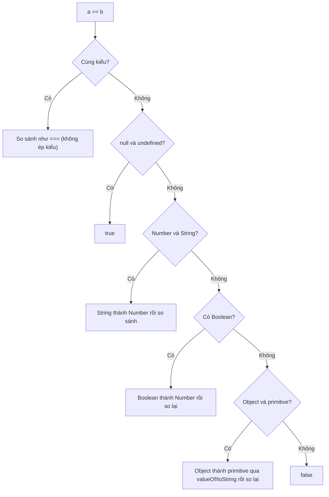

# Equality Comparisons

**Equality comparison** (so sánh bằng) là việc kiểm tra xem hai giá trị có "bằng nhau" hay không, một thao tác cực kỳ phổ biến trong lập trình. JavaScript có nhiều cách so sánh: `==` (loose equality - so sánh lỏng, có tự động chuyển đổi kiểu) và `===` (strict equality - so sánh chặt, không chuyển đổi kiểu). Hiểu rõ sự khác biệt giữa chúng giúp người mới tránh được vô số lỗi khó hiểu khi so sánh số với chuỗi, `null` với `undefined`, v.v.

[](pathname:///img/javascript/equality.webp)

---

:::note[Ghi nhớ nhanh]

- ⭐ **Luôn dùng `===`/`!==`** — so sánh không ép kiểu, khác kiểu là `false` ngay nên kết quả dễ đoán.
- **Tránh `==`** — nó tự ép kiểu sinh ra loạt kết quả khó hiểu (`0 == ""`, `[] == false`); chỉ nên dùng idiom `x == null` để bắt cả `null` lẫn `undefined`.
- ⭐ **`Object.is` cho ca biên** — phân biệt được `NaN` (coi bằng `NaN`) và `+0` với `-0`, hai chỗ mà `===` bị lệch.
- **`SameValueZero`** — thuật toán internal dùng bởi `Array.includes`, `Map`, `Set`; giống `===` nhưng coi `NaN` bằng `NaN`.
- **Deep equality không có built-in** — so sánh nội dung object phải dùng thư viện (`fast-deep-equal`) hoặc `node:util` `isDeepStrictEqual`.
- **Bật ESLint rule `eqeqeq`** ngay từ đầu project để ép dùng `===`.

:::

---

## Mục lục

- [Vì sao có === (và Object.is)?](#vì-sao-có--và-objectis)
- [Tổng quan 4 thuật toán](#tổng-quan-4-thuật-toán)
- [== Loose Equality](#-loose-equality)
- [=== Strict Equality](#-strict-equality)
- [SameValueZero](#samevaluezero)
- [SameValue (Object.is)](#samevalue-objectis)
- [Khi nào dùng cái nào?](#khi-nào-dùng-cái-nào)
- [Câu hỏi phỏng vấn](#câu-hỏi-phỏng-vấn)

---

## Vì sao có === (và Object.is)?

**Vấn đề:** `==` (loose equality) **tự ép kiểu** trước khi so sánh, nên kết quả rất khó đoán và dễ sinh bug. Hai giá trị "không liên quan" lại bằng nhau:

```js
0 == "";            // true — số 0 bằng chuỗi rỗng?!
null == undefined;  // true
"1" == 1;           // true — chuỗi "1" bằng số 1
[] == false;        // true — mảng rỗng bằng false

// Khó suy luận, phải nhớ bảng quy tắc ép kiểu trong đầu
```

**Giải pháp:** `===` (strict equality) ra đời để **so sánh KHÔNG ép kiểu** — khác kiểu là `false` ngay, kết quả dễ đoán nên trở thành chuẩn nên dùng. `Object.is` (ES6) bổ sung cho vài ca biên mà `===` còn lệch:

```js
0 === "";                 // false — khác kiểu, dừng luôn
"1" === 1;                // false — không ép kiểu
null === undefined;       // false — phân biệt rõ ràng

Object.is(NaN, NaN);      // true  — === trả false
Object.is(0, -0);         // false — === trả true
```

:::tip[Dùng thực tế]

- Luôn dùng `===`/`!==` trong mọi điều kiện `if`, `while`, ternary để tránh ép kiểu ngầm.
- Kiểm tra `NaN` bằng `Object.is(x, NaN)` hoặc `Number.isNaN(x)` — đừng dùng `x === NaN` (luôn `false`).
- Hiểu vì sao linter (rule `eqeqeq`) cấm `==`: loại bỏ cả lớp bug ép kiểu khó debug.
- Kiểm tra `null`/`undefined` đúng cách: dùng `x == null` (idiom bắt cả hai) hoặc `x === null` / `x === undefined` khi cần phân biệt.

:::

---

## Tổng quan 4 thuật toán

JavaScript có **4 thuật toán so sánh**:

| Tên | Cú pháp | Coercion | NaN | ±0 |
|-----|---------|----------|-----|-----|
| `isLooselyEqual` | `==` | **Có** | `NaN != NaN` | `+0 == -0` |
| `isStrictlyEqual` | `===` | Không | `NaN !== NaN` | `+0 === -0` |
| `SameValueZero` | (internal) | Không | `NaN bằng NaN` | `+0 = -0` |
| `SameValue` | `Object.is` | Không | `NaN bằng NaN` | `+0 !== -0` |

---

## == Loose Equality

Cho phép **coercion** giữa các kiểu khác nhau:

```js
1 == "1";          // true
0 == false;        // true
"" == 0;           // true
null == undefined; // true
[1] == 1;          // true
[] == false;       // true
```

Quy tắc đơn giản hoá:

1. Cùng kiểu → so sánh trực tiếp.
2. `null == undefined` → `true`.
3. Number vs String → String thành Number.
4. Boolean → thành Number.
5. Object vs primitive → gọi `valueOf()`, `toString()`.
6. NaN khác mọi thứ (kể cả chính nó).

Sơ đồ dưới đây tóm tắt luồng quyết định của `==` — thấy rõ vì sao kết quả khó đoán: nó thử ép kiểu qua nhiều tầng trước khi kết luận:



:::warning[Cần lưu ý]

`==` có **các trường hợp counterintuitive**:

```js
"" == 0;        // true
"" == "0";      // false (!)
0 == "0";       // true
null == 0;      // false (!)
null == false;  // false (!)
[] == 0;        // true
[] == "";       // true
[0] == false;   // true
```

Đây là lý do **đa số codebase cấm dùng `==`** trừ một use case duy nhất.

:::

---

## === Strict Equality

Không coercion, hai vế phải **cùng kiểu**:

```js
1 === 1;            // true
1 === "1";          // false (khác kiểu)
null === undefined; // false
NaN === NaN;        // false
+0 === -0;          // true (số học bằng nhau)
```

Với object — so sánh **reference**:

```js
{} === {};                          // false
const a = { x: 1 };
a === a;                             // true
a === { x: 1 };                      // false
```

---

## SameValueZero

Thuật toán **internal**, không có toán tử trực tiếp. Dùng bởi:

- `Array.prototype.includes`
- `Map`, `Set` (key, value comparison)

```js
[NaN].includes(NaN);     // true — SameValueZero
[NaN].indexOf(NaN);      // -1 — dùng === (NaN !== NaN)

new Set([NaN, NaN]).size; // 1 — NaN coi như cùng
```

Khác `===` ở chỗ: **`NaN bằng NaN`**. Khác `Object.is` ở chỗ: **`+0 = -0`**.

---

## SameValue (Object.is)

Method `Object.is` — phân biệt cả `NaN` và `±0`:

```js
Object.is(NaN, NaN);    // true (khác ===)
Object.is(+0, -0);      // false (khác ===)
Object.is(1, 1);        // true
Object.is({}, {});      // false (vẫn reference)
```

:::info[Phân tích]

**Tại sao cần `Object.is`?**

Vì `===` có hai "khuyết điểm" trong tình huống cần độ chính xác cao:

- `NaN === NaN` trả `false` (theo IEEE-754).
- `+0 === -0` trả `true` (dù chúng là hai giá trị khác nhau về dấu).

`Object.is` là **so sánh "đúng nhất"** — phản ánh đúng identity của giá
trị. Use case:

```js
// React dùng Object.is để so sánh state
function reducer(state, action) {
  const next = computeNext(state);
  if (Object.is(state, next)) return state; // skip re-render
  return next;
}

// Phát hiện -0 (thường là kết quả phép tính sai)
function isNegativeZero(n) {
  return Object.is(n, -0);
}
```

Trong code thường, **dùng `===`** vì nó đủ cho 99% trường hợp và đơn
giản hơn.

:::

---

## Khi nào dùng cái nào?

**Quy tắc thực dụng:**

| Tình huống | Dùng |
|-----------|------|
| 99% trường hợp | `===` |
| Check `null` hoặc `undefined` cùng lúc | `== null` |
| `includes`/`indexOf` không bắt được NaN | `Array.includes` (SameValueZero) |
| Cần phân biệt `+0` với `-0`, hoặc treat NaN bằng NaN | `Object.is` |
| So sánh deep object | Thư viện (`lodash.isEqual`, `fast-deep-equal`) |

:::tip[Mẹo]

**Deep equality** không có built-in. Khi cần so sánh nội dung object:

```js
// 1. JSON (giới hạn — không có function, Date, Map, Set)
JSON.stringify(a) === JSON.stringify(b);

// 2. Thư viện
import isEqual from "fast-deep-equal";
isEqual(a, b);

// 3. Node.js built-in
import { isDeepStrictEqual } from "node:util";
isDeepStrictEqual(a, b);
```

JSON.stringify có pitfall: key order ảnh hưởng kết quả. Dùng thư viện
hoặc Node util cho production.

:::

:::warning[Cần lưu ý]

ESLint rule **`eqeqeq`** (built-in) ép dùng `===`/`!==`:

```js
// eslint.config.js
{
  rules: {
    "eqeqeq": ["error", "smart"]
  }
}
```

`"smart"` cho phép `== null` (idiom check cả null/undefined), nhưng cấm
mọi `==` khác. Bật từ ngày đầu của project — nợ kỹ thuật sau 6 tháng
rất khó migrate.

:::

---

## Câu hỏi phỏng vấn

Những câu thường gặp về chủ đề này. Tự trả lời trước, rồi bấm **Xem đáp án** để đối chiếu.

**1. Phân biệt `==` và `===`. Vì sao hầu hết codebase đều bật rule `eqeqeq` để cấm `==`?**

<details className="qa">
<summary>Xem đáp án</summary>

- `===` (strict equality): **không ép kiểu**. Khác kiểu là `false` ngay, cùng kiểu mới so giá trị.
- `==` (loose equality): **ép kiểu trước khi so** theo một chuỗi quy tắc nhiều tầng (null/undefined → number/string → boolean → object thành primitive).

```js
1 === "1";   // false — khác kiểu, dừng luôn
1 == "1";    // true  — "1" bị ép thành 1
[] == false; // true  — [] → "" → 0, false → 0
```

**Vì sao cấm `==`:** kết quả của nó phụ thuộc vào một bảng quy tắc mà không ai nhớ hết, sinh ra loạt ca phản trực giác (`"" == 0` là `true` nhưng `"" == "0"` là `false`; `null == 0` lại `false`). Lỗi kiểu này im lặng, không throw, nên rất khó debug. Bật ESLint rule `eqeqeq` với mức `"smart"` loại bỏ cả lớp bug đó mà vẫn cho phép idiom `x == null`.

</details>

**2. Liệt kê 4 thuật toán so sánh của JavaScript và điểm khác nhau của chúng với `NaN` và `±0`.**

<details className="qa">
<summary>Xem đáp án</summary>

| Thuật toán | Cú pháp | Ép kiểu | `NaN` | `±0` |
|---|---|---|---|---|
| `isLooselyEqual` | `==` | **Có** | `NaN != NaN` | `+0 == -0` |
| `isStrictlyEqual` | `===` | Không | `NaN !== NaN` | `+0 === -0` |
| `SameValueZero` | (internal) | Không | `NaN` bằng `NaN` | `+0` = `-0` |
| `SameValue` | `Object.is` | Không | `NaN` bằng `NaN` | `+0` ≠ `-0` |

Cách nhớ: `===` là gốc; `SameValueZero` = `===` nhưng *sửa* `NaN`; `SameValue` = `SameValueZero` nhưng *thêm* phân biệt `+0` với `-0`; còn `==` là `===` cộng thêm tầng ép kiểu phía trước.

`SameValueZero` không có toán tử riêng — nó là thuật toán internal mà `Array.prototype.includes`, `Map`, `Set` dùng.

</details>

**3. Truy vết từng bước thuật toán `==` cho `"" == 0`, `null == 0` và `[] == false`. Vì sao kết quả lại như vậy?**

<details className="qa">
<summary>Xem đáp án</summary>

```js
"" == 0;      // true
null == 0;    // false
[] == false;  // true
```

- **`"" == 0`** → khác kiểu, rơi vào nhánh *Number vs String* → String được ép thành Number: `Number("")` là `0` → `0 == 0` → **`true`**.
- **`null == 0`** → spec quy định `null` (và `undefined`) **chỉ bằng chính nhau**, không có bước ép `null` sang số. Không khớp nhánh nào khác → **`false`**. Đây là lý do `null >= 0` lại `true` (toán tử quan hệ *có* ép kiểu) trong khi `null == 0` là `false`.
- **`[] == false`** → có Boolean nên ép Boolean thành Number trước: `[] == 0`. Giờ là Object vs primitive → gọi `ToPrimitive([])`: `valueOf()` trả về chính mảng (không phải primitive) nên dùng `toString()` → `""`. Còn lại `"" == 0` → như trên → **`true`**.

</details>

**4. Vì sao `null == undefined` là `true` nhưng `null === undefined` là `false`? Trường hợp này được spec xử lý ra sao?**

<details className="qa">
<summary>Xem đáp án</summary>

`null` và `undefined` là **hai kiểu khác nhau** (`Null` và `Undefined`). Vì `===` yêu cầu cùng kiểu, nó trả `false` ngay bước đầu.

Với `==`, spec có một **luật đặc biệt được viết cứng**, không phải kết quả của việc ép kiểu: nếu một vế là `null` và vế kia là `undefined` (theo cả hai chiều) thì trả `true` ngay, không đi tiếp. Ngoài ra `null`/`undefined` **không bằng bất kỳ giá trị nào khác** qua `==`.

```js
null == undefined;   // true  — luật riêng trong spec
null === undefined;  // false — khác kiểu
null == 0;           // false
undefined == "";     // false
```

Về mặt ngữ nghĩa, luật này hợp lý: cả hai đều biểu thị "không có giá trị" — `undefined` là *chưa được gán*, `null` là *cố ý để trống*. Chính luật này tạo nên idiom `x == null`.

</details>

**5. Use case hợp lệ duy nhất của `==` là gì? Giải thích idiom `if (value == null)` và nó tương đương với biểu thức nào.**

<details className="qa">
<summary>Xem đáp án</summary>

Use case duy nhất được chấp nhận rộng rãi là **kiểm tra "rỗng" (nullish)** bằng `value == null`.

```js
if (value == null) { /* value là null HOẶC undefined */ }

// Tương đương:
if (value === null || value === undefined) { }
```

Nhờ luật riêng ở câu trên, `value == null` bắt đúng hai giá trị `null` và `undefined`, **không bắt nhầm** `0`, `""`, `false`, `NaN` — khác hẳn `if (!value)`.

```js
const x = 0;
if (!x) { }        // chạy vào — sai ý định!
if (x == null) { } // không chạy vào — đúng ý định
```

ESLint rule `eqeqeq` ở mức `"smart"` cho phép đúng idiom này và cấm mọi `==` khác. Khi cần phân biệt rõ hai giá trị thì vẫn dùng `=== null` / `=== undefined`. Trong code hiện đại, `??` và `?.` cũng dựa trên đúng khái niệm nullish này.

</details>

**6. Vì sao `NaN === NaN` trả về `false`? Nêu ba cách kiểm tra một giá trị có phải `NaN` hay không và so sánh chúng.**

<details className="qa">
<summary>Xem đáp án</summary>

`NaN` (Not-a-Number) tuân theo chuẩn **IEEE-754**, trong đó `NaN` được định nghĩa là **không bằng bất cứ giá trị nào, kể cả chính nó**. Lý do ngữ nghĩa: `NaN` đại diện cho "kết quả không xác định"; hai phép tính hỏng khác nhau không có cơ sở gì để coi là bằng nhau. JS giữ nguyên quy ước đó cho `==` và `===`.

Ba cách kiểm tra:

```js
Number.isNaN(x);        // ES6 — chuẩn nhất, không ép kiểu
Object.is(x, NaN);      // ES6 — dùng SameValue, cũng chính xác
x !== x;                // mẹo cổ điển, chỉ NaN mới thoả
```

| Cách | Ưu / nhược |
|---|---|
| `Number.isNaN` | Rõ ràng, an toàn — nên dùng mặc định |
| `Object.is(x, NaN)` | Chính xác tương đương, nhưng dài dòng hơn |
| `x !== x` | Nhanh, chạy mọi môi trường cũ, nhưng khó đọc |

Tuyệt đối không dùng `x === NaN` — luôn `false`.

</details>

**7. Phân biệt `isNaN()` và `Number.isNaN()`. Đoán output: `isNaN("abc")` so với `Number.isNaN("abc")`.**

<details className="qa">
<summary>Xem đáp án</summary>

```js
isNaN("abc");         // true
Number.isNaN("abc");  // false
```

- **`isNaN(x)` (global, đời cũ)**: **ép `x` sang Number trước** rồi mới hỏi "có phải `NaN` không". `Number("abc")` là `NaN` → trả `true`. Nên tên hàm gây hiểu nhầm: nó thực ra trả lời *"giá trị này có KHÔNG chuyển được thành số không"*.
- **`Number.isNaN(x)` (ES6)**: **không ép kiểu**. Chỉ trả `true` khi `x` đúng là giá trị `NaN`. Chuỗi `"abc"` không phải kiểu number nên trả `false`.

```js
isNaN(undefined);        // true  — Number(undefined) là NaN
Number.isNaN(undefined); // false

isNaN("");               // false — Number("") là 0
isNaN(NaN);              // true
Number.isNaN(NaN);       // true
```

Quy tắc: muốn hỏi *"đây có phải NaN không"* → `Number.isNaN`. Muốn hỏi *"chuỗi này có parse ra số được không"* → dùng `Number.isFinite(Number(x))` cho rõ ý, đừng mượn `isNaN`.

</details>

**8. `Object.is` khác `===` ở đúng hai chỗ nào? Cho ví dụ cụ thể cho từng chỗ.**

<details className="qa">
<summary>Xem đáp án</summary>

Chỉ đúng hai chỗ, mọi trường hợp còn lại hai bên cho kết quả giống hệt nhau:

**Chỗ thứ nhất — `NaN`**: `Object.is` coi `NaN` bằng `NaN`:

```js
NaN === NaN;         // false
Object.is(NaN, NaN); // true
```

**Chỗ thứ hai — `+0` và `-0`**: `Object.is` phân biệt được dấu của số 0:

```js
+0 === -0;           // true
Object.is(+0, -0);   // false
Object.is(-0, -0);   // true
```

Ngoài hai điểm đó, `Object.is` vẫn **không ép kiểu** và vẫn so object theo reference:

```js
Object.is(1, "1");   // false
Object.is({}, {});   // false
```

`Object.is` triển khai thuật toán `SameValue` — "so sánh đúng identity nhất". Trong code thường vẫn nên dùng `===` vì nó đủ cho hầu hết trường hợp và ngắn gọn hơn; chỉ với các ca biên về `NaN`/`-0` mới cần `Object.is`.

</details>

**9. `SameValueZero` là gì và những API nào dùng nó? Vì sao `[NaN].includes(NaN)` là `true` còn `[NaN].indexOf(NaN)` là `-1`?**

<details className="qa">
<summary>Xem đáp án</summary>

`SameValueZero` là một **thuật toán internal** của spec — không có toán tử trực tiếp. Nó giống `===` nhưng **coi `NaN` bằng `NaN`**; còn `+0` và `-0` vẫn coi là bằng nhau (khác `Object.is`).

Các API dùng nó:

- `Array.prototype.includes`
- `Map` và `Set` (so sánh key/value)
- `Array.prototype.indexOf` thì KHÔNG dùng nó — API này so bằng `===`

```js
[NaN].includes(NaN);      // true  — SameValueZero
[NaN].indexOf(NaN);       // -1    — indexOf dùng ===
new Set([NaN, NaN]).size; // 1     — NaN coi như trùng
```

**Vì sao khác nhau:** `indexOf` là API cũ (ES5), spec quy định nó so bằng `===`, mà `NaN === NaN` là `false` nên không bao giờ tìm thấy. `includes` ra sau (ES2016) và được thiết kế lại dùng `SameValueZero` chính là để sửa điểm khó chịu này. Vậy nên muốn tìm `NaN` trong mảng, hãy dùng `includes`.

</details>

**10. Vì sao `+0 === -0` là `true` nhưng `Object.is(+0, -0)` là `false`? `-0` xuất hiện trong tình huống nào và làm sao phát hiện nó?**

<details className="qa">
<summary>Xem đáp án</summary>

Số thực dấu phẩy động theo IEEE-754 có **bit dấu riêng**, nên tồn tại hai giá trị zero: `+0` và `-0`. Về mặt *số học* chúng bằng nhau, nên `===` (và `==`, `SameValueZero`) trả `true`. Còn `Object.is` triển khai `SameValue` — so sánh theo **identity thực sự của giá trị**, nên phân biệt được dấu và trả `false`.

`-0` xuất hiện khi:

```js
-1 * 0;        // -0
0 / -5;        // -0
Math.round(-0.2); // -0
(-0).toString();  // "0" — in ra trông hệt số 0, rất dễ bỏ sót
```

Phát hiện `-0`:

```js
function isNegativeZero(n) {
  return Object.is(n, -0);
}

// Cách thay thế: chia cho nó để lấy dấu vô cực
1 / -0;  // -Infinity
1 / +0;  // Infinity
```

`-0` quan trọng trong tính toán hình học, xử lý toạ độ hoặc khi giá trị 0 mang ý nghĩa hướng — còn code nghiệp vụ thường thì có thể bỏ qua.

</details>

**11. So sánh object trong JavaScript là so sánh gì? Đoán output: `{a: 1} === {a: 1}` và giải thích khái niệm `reference equality`.**

<details className="qa">
<summary>Xem đáp án</summary>

Output là **`false`**.

Với object (bao gồm array, function, Date, Map...), `==`, `===` và `Object.is` đều so sánh **reference** — tức là hỏi *"hai biến có trỏ vào cùng một vùng nhớ hay không"*, chứ không hỏi *"nội dung có giống nhau không"*. `{a: 1}` viết hai lần tạo ra **hai object riêng biệt** nên khác reference.

```js
const a = { x: 1 };
const b = { x: 1 };
const c = a;

a === b;  // false — hai object khác nhau, dù nội dung giống hệt
a === c;  // true  — cùng một reference
[1,2] === [1,2];  // false
```

Đây gọi là **reference equality** (so sánh tham chiếu), đối lập với **structural/deep equality** (so sánh nội dung). Hệ quả thực tế: trong React, tạo object/array mới mỗi lần render sẽ luôn "khác" với lần trước, làm `useEffect`/`memo` chạy lại — đó là lý do có `useMemo`, `useCallback`.

</details>

**12. Vì sao JavaScript không có `deep equality` built-in? Nêu các cách so sánh sâu và pitfall của `JSON.stringify(a) === JSON.stringify(b)`.**

<details className="qa">
<summary>Xem đáp án</summary>

Vì "sâu" là một khái niệm **mơ hồ**: có tính cả property không enumerable không? Có so prototype không? Hai `Map` cùng nội dung khác thứ tự insert có bằng nhau? Object vòng (circular) xử lý sao? Mỗi ứng dụng có câu trả lời khác nhau, nên spec để việc này cho thư viện.

Các cách so sánh sâu:

```js
// 1. JSON — nhanh, nhưng nhiều giới hạn
JSON.stringify(a) === JSON.stringify(b);

// 2. Thư viện
import isEqual from "fast-deep-equal";
isEqual(a, b);

// 3. Node.js built-in
import { isDeepStrictEqual } from "node:util";
isDeepStrictEqual(a, b);
```

**Pitfall của `JSON.stringify`:**

- **Thứ tự key đổi là kết quả đổi**: `{a:1,b:2}` và `{b:2,a:1}` cho chuỗi khác nhau → báo "khác" dù nội dung giống.
- Bỏ qua `undefined` và function; `NaN`/`Infinity` thành `null`; `Date` thành string; `Map`/`Set` thành `{}`.
- Ném lỗi với object vòng và `BigInt`.
- Tốn kém với object lớn (phải serialize toàn bộ).

Production nên dùng thư viện hoặc `isDeepStrictEqual`.

</details>

**13. React dùng thuật toán so sánh nào để quyết định re-render? Điều đó ảnh hưởng thế nào tới cách bạn cập nhật state?**

<details className="qa">
<summary>Xem đáp án</summary>

React dùng **`Object.is`** (`SameValue`) để so state/props cũ với mới — trong `useState` (bỏ qua update nếu giá trị không đổi), trong so sánh props của `React.memo`, và trong mảng dependency của `useEffect`/`useMemo`/`useCallback`.

Vì `Object.is` so object theo **reference**, việc **mutate** state không tạo reference mới nên React coi như "không có gì thay đổi" và bỏ qua re-render:

```js
// SAI — mutate, reference không đổi → không re-render
items.push(newItem);
setItems(items);

// ĐÚNG — tạo mảng mới → reference mới
setItems([...items, newItem]);

// ĐÚNG với object
setUser({ ...user, name: "Thuan" });
```

Đây chính là nền tảng của nguyên tắc **immutability** trong React/Redux: luôn tạo giá trị mới thay vì sửa tại chỗ.

Mặt trái: tạo object/array mới trong thân component sẽ khác reference mỗi lần render, khiến `useEffect` chạy lại hoặc `memo` mất tác dụng — lúc đó cần `useMemo`/`useCallback` để giữ nguyên reference.

</details>

**14. So sánh hai string dài bằng `===` có tốn kém không? Còn so sánh hai object lớn thì sao — vì sao độ phức tạp lại khác nhau?**

<details className="qa">
<summary>Xem đáp án</summary>

- **String**: `===` so sánh **nội dung**, nên về lý thuyết là **O(n)** theo độ dài chuỗi. Trên thực tế thường rất nhanh: engine thoát sớm khi độ dài khác nhau hoặc gặp ký tự đầu tiên lệch, và nhiều engine còn *intern* chuỗi literal nên so sánh hai chuỗi cùng nguồn có thể chỉ là so con trỏ. Chỉ khi so hàng loạt chuỗi rất dài, gần giống nhau, trong vòng lặp nóng thì chi phí mới đáng kể.
- **Object**: `===` so sánh **reference** — chỉ là so hai con trỏ, **O(1)**, không phụ thuộc object to hay nhỏ. Object 1 triệu property so cũng nhanh y như object rỗng.

Chi phí thật sự nằm ở **deep equality**: duyệt toàn bộ cây property nên là O(n) theo *tổng số node*, và còn có thể bị object vòng. Vì vậy trong hot path (như so sánh props ở React), người ta ưu tiên so reference cộng với immutability, thay vì deep compare.

</details>

**15. Khi nào bạn dùng `===`, khi nào `Object.is`, khi nào thư viện deep-equal? Đưa ra quy tắc chọn của riêng bạn.**

<details className="qa">
<summary>Xem đáp án</summary>

| Tình huống | Dùng |
|---|---|
| 99% trường hợp (primitive, reference, điều kiện `if`) | `===` / `!==` |
| Cần bắt cả `null` lẫn `undefined` | `x == null` (idiom duy nhất được phép) |
| Cần coi `NaN` bằng `NaN` hoặc phân biệt `+0` với `-0` | `Object.is` |
| Tìm phần tử trong mảng có thể là `NaN` | `Array.includes` (SameValueZero) |
| So sánh **nội dung** hai object/array | `fast-deep-equal`, `lodash.isEqual`, hoặc `isDeepStrictEqual` |

Quy tắc thực dụng của tôi:

1. Mặc định luôn là `===`; bật ESLint `eqeqeq: ["error", "smart"]` ngay từ ngày đầu project.
2. Kiểm tra `NaN` thì dùng `Number.isNaN`, không dùng `===` cũng không dùng `isNaN` global.
3. Chỉ rút `Object.is` ra khi làm việc với toán học/`-0` hoặc khi mô phỏng logic so sánh của React.
4. Trước khi deep-compare, hãy tự hỏi có thiết kế lại theo immutability để chỉ cần so reference được không — rẻ hơn nhiều.

</details>
