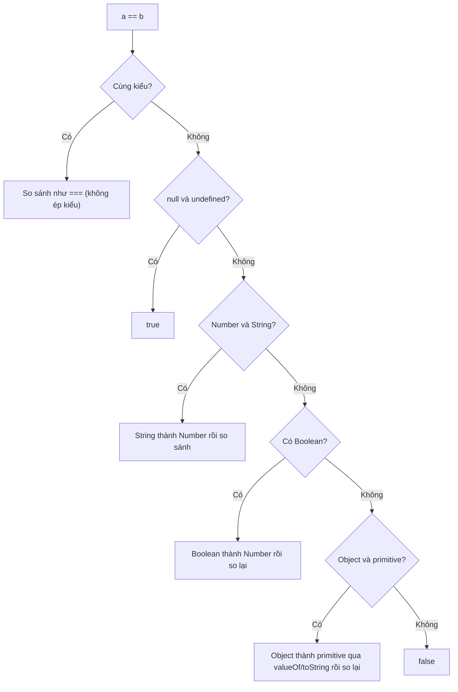

# Equality Comparisons

**Equality comparison** (so sánh bằng) là việc kiểm tra xem hai giá trị có "bằng nhau" hay không, một thao tác cực kỳ phổ biến trong lập trình. JavaScript có nhiều cách so sánh: `==` (loose equality - so sánh lỏng, có tự động chuyển đổi kiểu) và `===` (strict equality - so sánh chặt, không chuyển đổi kiểu). Hiểu rõ sự khác biệt giữa chúng giúp người mới tránh được vô số lỗi khó hiểu khi so sánh số với chuỗi, `null` với `undefined`, v.v.

---

:::note[Ghi nhớ nhanh]

- ⭐ **Luôn dùng `===`/`!==`** — so sánh không ép kiểu, khác kiểu là `false` ngay nên kết quả dễ đoán.
- **Tránh `==`** — nó tự ép kiểu sinh ra loạt kết quả khó hiểu (`0 == ""`, `[] == false`); chỉ nên dùng idiom `x == null` để bắt cả `null` lẫn `undefined`.
- ⭐ **`Object.is` cho ca biên** — phân biệt được `NaN` (coi bằng `NaN`) và `+0` với `-0`, hai chỗ mà `===` bị lệch.
- **`SameValueZero`** — thuật toán internal dùng bởi `Array.includes`, `Map`, `Set`; giống `===` nhưng coi `NaN` bằng `NaN`.
- **Deep equality không có built-in** — so sánh nội dung object phải dùng thư viện (`fast-deep-equal`) hoặc `node:util` `isDeepStrictEqual`.
- **Bật ESLint rule `eqeqeq`** ngay từ đầu project để ép dùng `===`.

:::

---

## Mục lục

- [Vì sao có === (và Object.is)?](#vì-sao-có--và-objectis)
- [Tổng quan 4 thuật toán](#tổng-quan-4-thuật-toán)
- [== Loose Equality](#-loose-equality)
- [=== Strict Equality](#-strict-equality)
- [SameValueZero](#samevaluezero)
- [SameValue (Object.is)](#samevalue-objectis)
- [Khi nào dùng cái nào?](#khi-nào-dùng-cái-nào)
- [Câu hỏi phỏng vấn](#câu-hỏi-phỏng-vấn)

---

## Vì sao có === (và Object.is)?

**Vấn đề:** `==` (loose equality) **tự ép kiểu** trước khi so sánh, nên kết quả rất khó đoán và dễ sinh bug. Hai giá trị "không liên quan" lại bằng nhau:

```js
0 == "";            // true — số 0 bằng chuỗi rỗng?!
null == undefined;  // true
"1" == 1;           // true — chuỗi "1" bằng số 1
[] == false;        // true — mảng rỗng bằng false

// Khó suy luận, phải nhớ bảng quy tắc ép kiểu trong đầu
```

**Giải pháp:** `===` (strict equality) ra đời để **so sánh KHÔNG ép kiểu** — khác kiểu là `false` ngay, kết quả dễ đoán nên trở thành chuẩn nên dùng. `Object.is` (ES6) bổ sung cho vài ca biên mà `===` còn lệch:

```js
0 === "";                 // false — khác kiểu, dừng luôn
"1" === 1;                // false — không ép kiểu
null === undefined;       // false — phân biệt rõ ràng

Object.is(NaN, NaN);      // true  — === trả false
Object.is(0, -0);         // false — === trả true
```

:::tip[Dùng thực tế]

- Luôn dùng `===`/`!==` trong mọi điều kiện `if`, `while`, ternary để tránh ép kiểu ngầm.
- Kiểm tra `NaN` bằng `Object.is(x, NaN)` hoặc `Number.isNaN(x)` — đừng dùng `x === NaN` (luôn `false`).
- Hiểu vì sao linter (rule `eqeqeq`) cấm `==`: loại bỏ cả lớp bug ép kiểu khó debug.
- Kiểm tra `null`/`undefined` đúng cách: dùng `x == null` (idiom bắt cả hai) hoặc `x === null` / `x === undefined` khi cần phân biệt.

:::

---

## Tổng quan 4 thuật toán

JavaScript có **4 thuật toán so sánh**:

| Tên | Cú pháp | Coercion | NaN | ±0 |
|-----|---------|----------|-----|-----|
| `isLooselyEqual` | `==` | **Có** | `NaN != NaN` | `+0 == -0` |
| `isStrictlyEqual` | `===` | Không | `NaN !== NaN` | `+0 === -0` |
| `SameValueZero` | (internal) | Không | `NaN bằng NaN` | `+0 = -0` |
| `SameValue` | `Object.is` | Không | `NaN bằng NaN` | `+0 !== -0` |

---

## == Loose Equality

Cho phép **coercion** giữa các kiểu khác nhau:

```js
1 == "1";          // true
0 == false;        // true
"" == 0;           // true
null == undefined; // true
[1] == 1;          // true
[] == false;       // true
```

Quy tắc đơn giản hoá:

1. Cùng kiểu → so sánh trực tiếp.
2. `null == undefined` → `true`.
3. Number vs String → String thành Number.
4. Boolean → thành Number.
5. Object vs primitive → gọi `valueOf()`, `toString()`.
6. NaN khác mọi thứ (kể cả chính nó).

Sơ đồ dưới đây tóm tắt luồng quyết định của `==` — thấy rõ vì sao kết quả khó đoán: nó thử ép kiểu qua nhiều tầng trước khi kết luận:



:::warning[Cần lưu ý]

`==` có **các trường hợp counterintuitive**:

```js
"" == 0;        // true
"" == "0";      // false (!)
0 == "0";       // true
null == 0;      // false (!)
null == false;  // false (!)
[] == 0;        // true
[] == "";       // true
[0] == false;   // true
```

Đây là lý do **đa số codebase cấm dùng `==`** trừ một use case duy nhất.

:::

---

## === Strict Equality

Không coercion, hai vế phải **cùng kiểu**:

```js
1 === 1;            // true
1 === "1";          // false (khác kiểu)
null === undefined; // false
NaN === NaN;        // false
+0 === -0;          // true (số học bằng nhau)
```

Với object — so sánh **reference**:

```js
{} === {};                          // false
const a = { x: 1 };
a === a;                             // true
a === { x: 1 };                      // false
```

---

## SameValueZero

Thuật toán **internal**, không có toán tử trực tiếp. Dùng bởi:

- `Array.prototype.includes`
- `Map`, `Set` (key, value comparison)

```js
[NaN].includes(NaN);     // true — SameValueZero
[NaN].indexOf(NaN);      // -1 — dùng === (NaN !== NaN)

new Set([NaN, NaN]).size; // 1 — NaN coi như cùng
```

Khác `===` ở chỗ: **`NaN bằng NaN`**. Khác `Object.is` ở chỗ: **`+0 = -0`**.

---

## SameValue (Object.is)

Method `Object.is` — phân biệt cả `NaN` và `±0`:

```js
Object.is(NaN, NaN);    // true (khác ===)
Object.is(+0, -0);      // false (khác ===)
Object.is(1, 1);        // true
Object.is({}, {});      // false (vẫn reference)
```

:::info[Phân tích]

**Tại sao cần `Object.is`?**

Vì `===` có hai "khuyết điểm" trong tình huống cần độ chính xác cao:

- `NaN === NaN` trả `false` (theo IEEE-754).
- `+0 === -0` trả `true` (dù chúng là hai giá trị khác nhau về dấu).

`Object.is` là **so sánh "đúng nhất"** — phản ánh đúng identity của giá
trị. Use case:

```js
// React dùng Object.is để so sánh state
function reducer(state, action) {
  const next = computeNext(state);
  if (Object.is(state, next)) return state; // skip re-render
  return next;
}

// Phát hiện -0 (thường là kết quả phép tính sai)
function isNegativeZero(n) {
  return Object.is(n, -0);
}
```

Trong code thường, **dùng `===`** vì nó đủ cho 99% trường hợp và đơn
giản hơn.

:::

---

## Khi nào dùng cái nào?

**Quy tắc thực dụng:**

| Tình huống | Dùng |
|-----------|------|
| 99% trường hợp | `===` |
| Check `null` hoặc `undefined` cùng lúc | `== null` |
| `includes`/`indexOf` không bắt được NaN | `Array.includes` (SameValueZero) |
| Cần phân biệt `+0` với `-0`, hoặc treat NaN bằng NaN | `Object.is` |
| So sánh deep object | Thư viện (`lodash.isEqual`, `fast-deep-equal`) |

:::tip[Mẹo]

**Deep equality** không có built-in. Khi cần so sánh nội dung object:

```js
// 1. JSON (giới hạn — không có function, Date, Map, Set)
JSON.stringify(a) === JSON.stringify(b);

// 2. Thư viện
import isEqual from "fast-deep-equal";
isEqual(a, b);

// 3. Node.js built-in
import { isDeepStrictEqual } from "node:util";
isDeepStrictEqual(a, b);
```

JSON.stringify có pitfall: key order ảnh hưởng kết quả. Dùng thư viện
hoặc Node util cho production.

:::

:::warning[Cần lưu ý]

ESLint rule **`eqeqeq`** (built-in) ép dùng `===`/`!==`:

```js
// eslint.config.js
{
  rules: {
    "eqeqeq": ["error", "smart"]
  }
}
```

`"smart"` cho phép `== null` (idiom check cả null/undefined), nhưng cấm
mọi `==` khác. Bật từ ngày đầu của project — nợ kỹ thuật sau 6 tháng
rất khó migrate.

:::

---

## Câu hỏi phỏng vấn

Những câu thường gặp về chủ đề này. Tự trả lời trước, rồi đối chiếu lại với nội dung phía trên.

1. Phân biệt `==` và `===`. Vì sao hầu hết codebase đều bật rule `eqeqeq` để cấm `==`?
2. Liệt kê 4 thuật toán so sánh của JavaScript và điểm khác nhau của chúng với `NaN` và `±0`.
3. Truy vết từng bước thuật toán `==` cho `"" == 0`, `null == 0` và `[] == false`. Vì sao kết quả lại như vậy?
4. Vì sao `null == undefined` là `true` nhưng `null === undefined` là `false`? Trường hợp này được spec xử lý ra sao?
5. Use case hợp lệ duy nhất của `==` là gì? Giải thích idiom `if (value == null)` và nó tương đương với biểu thức nào.
6. Vì sao `NaN === NaN` trả về `false`? Nêu ba cách kiểm tra một giá trị có phải `NaN` hay không và so sánh chúng.
7. Phân biệt `isNaN()` và `Number.isNaN()`. Đoán output: `isNaN("abc")` so với `Number.isNaN("abc")`.
8. `Object.is` khác `===` ở đúng hai chỗ nào? Cho ví dụ cụ thể cho từng chỗ.
9. `SameValueZero` là gì và những API nào dùng nó? Vì sao `[NaN].includes(NaN)` là `true` còn `[NaN].indexOf(NaN)` là `-1`?
10. Vì sao `+0 === -0` là `true` nhưng `Object.is(+0, -0)` là `false`? `-0` xuất hiện trong tình huống nào và làm sao phát hiện nó?
11. So sánh object trong JavaScript là so sánh gì? Đoán output: `{a: 1} === {a: 1}` và giải thích khái niệm `reference equality`.
12. Vì sao JavaScript không có `deep equality` built-in? Nêu các cách so sánh sâu và pitfall của `JSON.stringify(a) === JSON.stringify(b)`.
13. React dùng thuật toán so sánh nào để quyết định re-render? Điều đó ảnh hưởng thế nào tới cách bạn cập nhật state?
14. So sánh hai string dài bằng `===` có tốn kém không? Còn so sánh hai object lớn thì sao — vì sao độ phức tạp lại khác nhau?
15. Khi nào bạn dùng `===`, khi nào `Object.is`, khi nào thư viện deep-equal? Đưa ra quy tắc chọn của riêng bạn.
