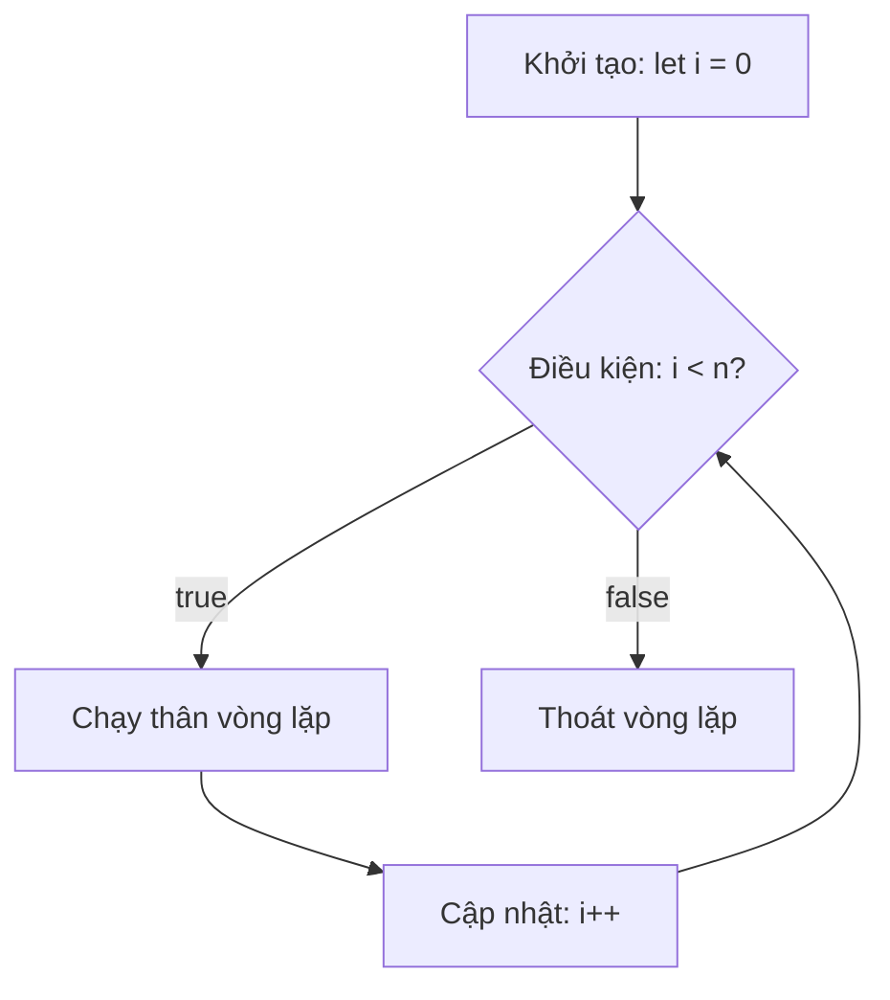
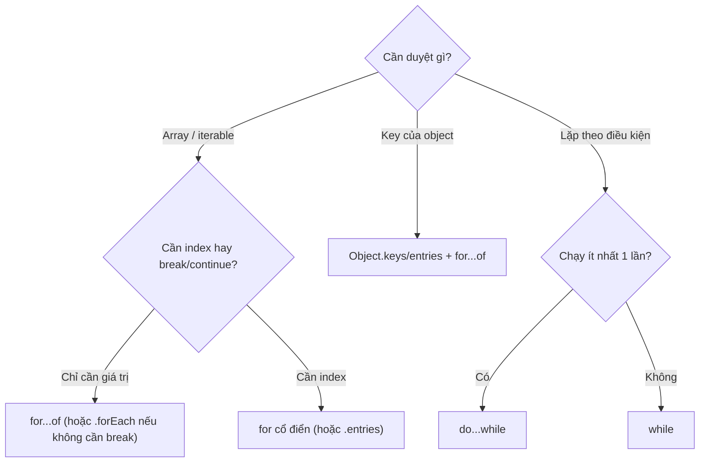

# Loops and Iterations

**Loops** (vòng lặp) là cách để chạy đi chạy lại một đoạn code nhiều lần mà không phải viết lại từng dòng. Ví dụ, thay vì in ra một câu 100 lần thủ công, bạn dùng vòng lặp để máy tự lặp giúp bạn. JavaScript có nhiều kiểu vòng lặp như `for`, `while`, `for...of`, `for...in`, mỗi loại phù hợp với một tình huống khác nhau. Đây là một trong những khái niệm nền tảng nhất khi học lập trình.

---

:::note[Ghi nhớ nhanh]

- ⭐ **`for...of` để duyệt giá trị** của mọi iterable (Array, String, `Map`, `Set`, NodeList) — gọn, khỏi quản lý chỉ số, tránh lỗi off-by-one.
- **`for...in` chỉ dành cho key của object** — không dùng cho array vì index là string, kèm cả prop kế thừa và không đảm bảo thứ tự.
- ⭐ **`forEach` không `break`/`continue` được** và không chờ `await` tuần tự — cần dừng sớm hoặc async tuần tự thì dùng `for...of`.
- **`for` cổ điển** khi cần index number; **`while`** lặp theo điều kiện, **`do...while`** chạy ít nhất 1 lần.
- **`break`/`continue`** thoát hoặc bỏ qua lần lặp; dùng label cho loop lồng nhau.
- **Functional (`map/filter/reduce`)** ưu tiên cho transformation; loop có side-effect thì `for...of` rõ ràng hơn.

:::

---

## Mục lục

- [Vì sao có for...of và các kiểu lặp mới?](#vì-sao-có-forof-và-các-kiểu-lặp-mới)
- [for loop](#for-loop)
- [while và do...while](#while-và-dowhile)
- [for...of](#forof)
- [for...in](#forin)
- [break và continue](#break-và-continue)
- [Khi nào dùng cái nào?](#khi-nào-dùng-cái-nào)
- [Câu hỏi phỏng vấn](#câu-hỏi-phỏng-vấn)

---

## Vì sao có for...of và các kiểu lặp mới?

**Vấn đề:**

```js
// for cổ điển dài dòng, dễ sai chỉ số (off-by-one)
const arr = [10, 20, 30];
for (let i = 0; i <= arr.length; i++) {
  console.log(arr[i]); // 10, 20, 30, undefined — quên đổi <= thành <
}

// for...in dùng cho array là SAI
arr.extra = "x";
for (const i in arr) {
  console.log(i); // "0", "1", "2", "extra" — key là string, kèm cả prop kế thừa, thứ tự không đảm bảo
}
```

**Giải pháp:**

```js
// for...of (ES6): duyệt thẳng GIÁ TRỊ của mọi iterable — gọn, không lo chỉ số
for (const v of arr) {
  console.log(v); // 10, 20, 30
}

// for...in: dành riêng cho duyệt KEY của object
const user = { name: "An", age: 20 };
for (const key in user) {
  console.log(key, user[key]);
}

// forEach / map / filter: phong cách hàm cho transformation
arr.forEach((v) => console.log(v));
```

:::tip[Dùng thực tế]

- **Duyệt mảng dữ liệu** — dùng `for...of` để lấy thẳng giá trị, khỏi quản lý chỉ số.
- **Duyệt thuộc tính object** — dùng `for...in` kèm `hasOwnProperty` để bỏ prop kế thừa:

  ```js
  for (const key in user) {
    if (Object.prototype.hasOwnProperty.call(user, key)) {
      console.log(key, user[key]);
    }
  }
  ```

- **Duyệt `Map` / `Set`** — `for...of` chạy trực tiếp, không cần chuyển sang array.
- **Cần `break` / `continue`** — dùng `for...of` (cho phép dừng giữa chừng), còn `forEach` thì không thoát sớm được.

:::

---

## for loop

Cú pháp cổ điển — 3 phần: init, condition, increment.

```js
for (let i = 0; i < 5; i++) {
  console.log(i);
}
```

Thứ tự thực thi 3 phần lặp lại theo vòng: kiểm tra điều kiện **trước** mỗi lần chạy thân, cập nhật biến chạy **sau** thân, rồi quay lại kiểm tra điều kiện:



Lặp ngược:

```js
for (let i = arr.length - 1; i >= 0; i--) {
  console.log(arr[i]);
}
```

Mỗi phần đều có thể bỏ trống:

```js
for (;;) { /* loop vô hạn — cần break */ }
```

---

## while và do...while

`while` — kiểm tra **trước**, có thể không chạy lần nào:

```js
let i = 0;
while (i < 5) {
  console.log(i);
  i++;
}
```

`do...while` — kiểm tra **sau**, chạy ít nhất 1 lần:

```js
let answer;
do {
  answer = prompt("Tiếp tục?");
} while (answer === "yes");
```

---

## for...of

Duyệt **giá trị** của iterable (Array, String, Map, Set, NodeList...):

```js
const arr = [10, 20, 30];

for (const v of arr) {
  console.log(v); // 10, 20, 30
}

for (const ch of "hello") {
  console.log(ch);
}

for (const [k, v] of new Map([["a", 1]])) {
  console.log(k, v);
}

for (const el of document.querySelectorAll("p")) {
  // NodeList iterable
}
```

Có index — dùng `entries()`:

```js
for (const [i, v] of arr.entries()) {
  console.log(i, v);
}
```

---

## for...in

Duyệt **key** (string) của object — kể cả prototype:

```js
const obj = { a: 1, b: 2 };

for (const key in obj) {
  console.log(key, obj[key]);
}
```

:::warning[Cần lưu ý]

`for...in` có nhiều **pitfall** — tránh dùng cho array:

```js
const arr = ["a", "b", "c"];
arr.foo = "bar";

for (const k in arr) {
  console.log(k); // "0", "1", "2", "foo" — kể cả property thêm!
}
```

Vấn đề:

1. Index là **string** (`"0"`, `"1"`), không phải number.
2. Bao gồm cả **enumerable inherited property** (từ prototype).
3. Không đảm bảo thứ tự trong mọi engine.

**Dùng `for...of`** với array, **`Object.keys/entries/values`** với object:

```js
for (const v of arr) {}              // value, đúng index
for (const [i, v] of arr.entries()) {} // có index number

for (const k of Object.keys(obj)) {}
for (const [k, v] of Object.entries(obj)) {}
```

:::

---

## break và continue

`break` — thoát loop ngay:

```js
for (const item of items) {
  if (item.found) {
    break;
  }
}
```

`continue` — bỏ qua lần lặp hiện tại, tiếp lần sau:

```js
for (const n of nums) {
  if (n < 0) continue;
  console.log(n);
}
```

Label cho loop lồng:

```js
outer: for (let i = 0; i < 3; i++) {
  for (let j = 0; j < 3; j++) {
    if (i + j > 3) break outer; // thoát cả hai loop
  }
}
```

:::info[Phân tích]

**`forEach` không hỗ trợ `break`/`continue`**. Đây là khác biệt quan
trọng so với `for...of`:

```js
arr.forEach(x => {
  if (x < 0) break; // SyntaxError
});

arr.forEach(x => {
  if (x < 0) return; // chỉ skip một iteration (giống continue)
});

// Muốn break, dùng for...of
for (const x of arr) {
  if (x < 0) break;
}

// Hoặc method khác
arr.some(x => {
  if (x < 0) return true; // some dừng khi return true
});
```

`forEach` cũng **không await** trong async function — không xử lý được
tuần tự async:

```js
arr.forEach(async (item) => {
  await process(item); // chạy song song, không tuần tự!
});

// Đúng: dùng for...of
for (const item of arr) {
  await process(item);
}
```

:::

---

## Khi nào dùng cái nào?

Cây quyết định nhanh để chọn đúng loại vòng lặp theo nhu cầu:



| Tình huống | Dùng |
|-----------|------|
| Duyệt array | `for...of` hoặc `.forEach()` |
| Cần index | `for (let i...)` hoặc `arr.entries()` |
| Cần `break`/`continue` | `for` / `for...of` |
| Async tuần tự | `for...of` với `await` |
| Async song song | `Promise.all(arr.map(async ...))` |
| Object key | `Object.keys/entries` + `for...of` |
| Chain transformation | `.map().filter().reduce()` |
| Lặp vô hạn có điều kiện | `while` |
| Chạy ít nhất 1 lần | `do...while` |

:::tip[Mẹo]

**Functional style** (`map/filter/reduce`) ưu tiên cho transformation —
ngắn, dễ đọc, dễ test:

```js
// Imperative
const total = 0;
for (let i = 0; i < items.length; i++) {
  if (items[i].active) {
    total += items[i].price;
  }
}

// Functional
const total = items
  .filter(x => x.active)
  .reduce((sum, x) => sum + x.price, 0);
```

Nhưng với loop **side-effect** (mutation, async, DOM), `for...of` rõ
ràng và đáng tin hơn. Đừng "ép" mọi thứ thành functional.

:::

---

## Câu hỏi phỏng vấn

Những câu thường gặp về chủ đề này. Tự trả lời trước, rồi đối chiếu lại với nội dung phía trên.

1. Kể tên các kiểu vòng lặp trong JavaScript và tình huống phù hợp của từng loại.
2. `while` khác `do...while` ở điểm nào? Cho một trường hợp bắt buộc phải dùng `do...while`.
3. So sánh `for...of` và `for...in`: mỗi loại duyệt cái gì, và vì sao không nên dùng `for...in` cho array?
4. Đoán output: gán thêm `arr.foo = "bar"` rồi chạy `for (const k in arr)`. Vì sao `foo` cũng xuất hiện, và key có kiểu gì?
5. `for...of` hoạt động được trên những giá trị nào? Giải thích `iterable protocol` và `Symbol.iterator`.
6. Vì sao `for...of` chạy trực tiếp trên `Map`/`Set`/`NodeList` nhưng không chạy trên plain object? Cách nào duyệt object đúng?
7. So sánh `forEach` với `for...of` về: `break`/`continue`, `return`, giá trị trả về, và xử lý phần tử rỗng của sparse array.
8. Vì sao `await` trong callback của `forEach` không chạy tuần tự? Viết lại đoạn code để xử lý async đúng thứ tự.
9. Khi nào nên chạy async tuần tự bằng `for...of` với `await`, khi nào nên chạy song song bằng `Promise.all(arr.map(...))`?
10. `for await...of` dùng để làm gì? Nó khác `for...of` trên một mảng promise ra sao?
11. `break` khác `continue` thế nào? `labeled statement` giải quyết vấn đề gì với vòng lặp lồng nhau?
12. Cần dừng sớm nhưng đang dùng style functional — bạn dùng method nào thay `forEach`? Giải thích `some()` và `find()` trong vai trò này.
13. Đoán output kinh điển: vòng `for` với `var i` bên trong `setTimeout` in ra gì? Đổi sang `let` thì sao, và cơ chế nào giải thích điều đó?
14. Sửa mảng (thêm/xoá phần tử) ngay trong lúc đang duyệt nó bằng `for` hoặc `forEach` sẽ gây ra chuyện gì?
15. Khi nào bạn ưu tiên `map/filter/reduce` và khi nào `for...of` rõ ràng hơn? Cân nhắc về khả năng đọc, side-effect và hiệu năng.
