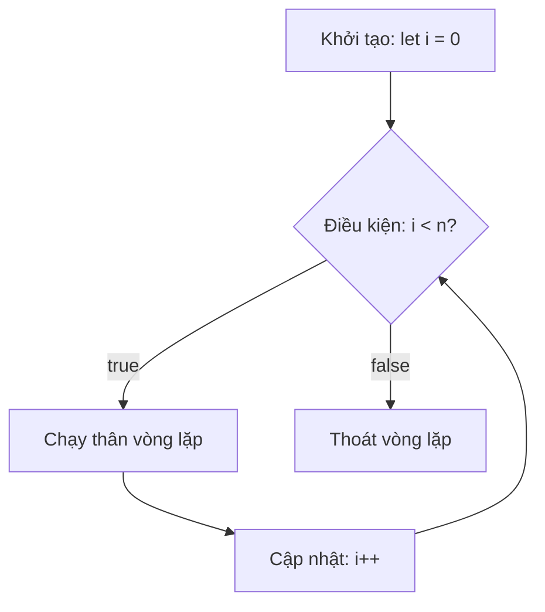
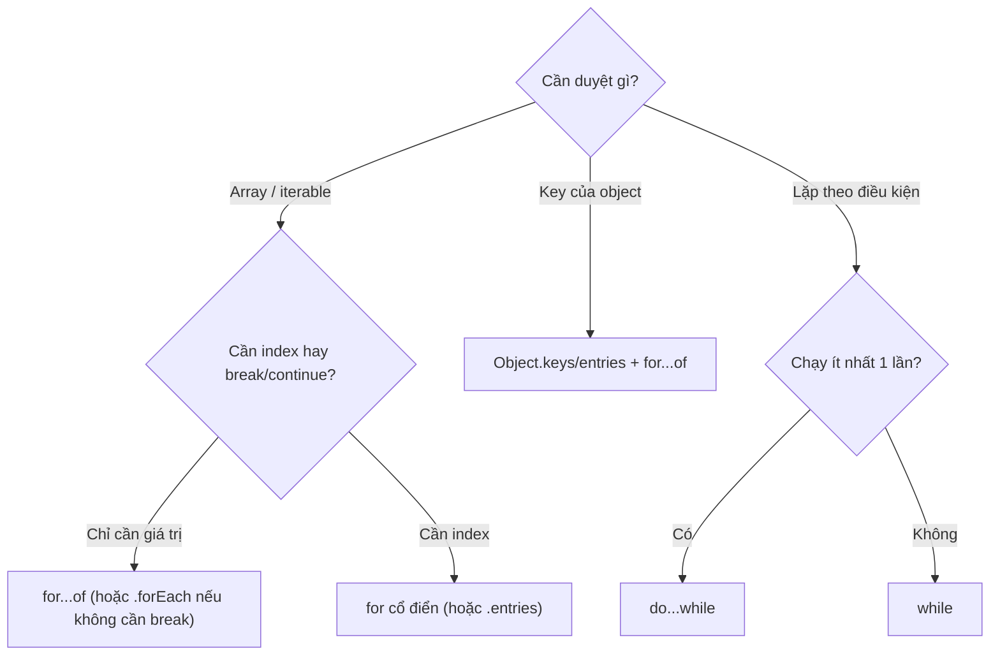

# Loops and Iterations

**Loops** (vòng lặp) là cách để chạy đi chạy lại một đoạn code nhiều lần mà không phải viết lại từng dòng. Ví dụ, thay vì in ra một câu 100 lần thủ công, bạn dùng vòng lặp để máy tự lặp giúp bạn. JavaScript có nhiều kiểu vòng lặp như `for`, `while`, `for...of`, `for...in`, mỗi loại phù hợp với một tình huống khác nhau. Đây là một trong những khái niệm nền tảng nhất khi học lập trình.

[](pathname:///img/javascript/loops.webp)

---

:::note[Ghi nhớ nhanh]

- ⭐ **`for...of` để duyệt giá trị** của mọi iterable (Array, String, `Map`, `Set`, NodeList) — gọn, khỏi quản lý chỉ số, tránh lỗi off-by-one.
- **`for...in` chỉ dành cho key của object** — không dùng cho array vì index là string, kèm cả prop kế thừa và không đảm bảo thứ tự.
- ⭐ **`forEach` không `break`/`continue` được** và không chờ `await` tuần tự — cần dừng sớm hoặc async tuần tự thì dùng `for...of`.
- **`for` cổ điển** khi cần index number; **`while`** lặp theo điều kiện, **`do...while`** chạy ít nhất 1 lần.
- **`break`/`continue`** thoát hoặc bỏ qua lần lặp; dùng label cho loop lồng nhau.
- **Functional (`map/filter/reduce`)** ưu tiên cho transformation; loop có side-effect thì `for...of` rõ ràng hơn.

:::

---

## Mục lục

- [Vì sao có for...of và các kiểu lặp mới?](#vì-sao-có-forof-và-các-kiểu-lặp-mới)
- [for loop](#for-loop)
- [while và do...while](#while-và-dowhile)
- [for...of](#forof)
- [for...in](#forin)
- [break và continue](#break-và-continue)
- [Khi nào dùng cái nào?](#khi-nào-dùng-cái-nào)
- [Câu hỏi phỏng vấn](#câu-hỏi-phỏng-vấn)

---

## Vì sao có for...of và các kiểu lặp mới?

**Vấn đề:**

```js
// for cổ điển dài dòng, dễ sai chỉ số (off-by-one)
const arr = [10, 20, 30];
for (let i = 0; i <= arr.length; i++) {
  console.log(arr[i]); // 10, 20, 30, undefined — quên đổi <= thành <
}

// for...in dùng cho array là SAI
arr.extra = "x";
for (const i in arr) {
  console.log(i); // "0", "1", "2", "extra" — key là string, kèm cả prop kế thừa, thứ tự không đảm bảo
}
```

**Giải pháp:**

```js
// for...of (ES6): duyệt thẳng GIÁ TRỊ của mọi iterable — gọn, không lo chỉ số
for (const v of arr) {
  console.log(v); // 10, 20, 30
}

// for...in: dành riêng cho duyệt KEY của object
const user = { name: "An", age: 20 };
for (const key in user) {
  console.log(key, user[key]);
}

// forEach / map / filter: phong cách hàm cho transformation
arr.forEach((v) => console.log(v));
```

:::tip[Dùng thực tế]

- **Duyệt mảng dữ liệu** — dùng `for...of` để lấy thẳng giá trị, khỏi quản lý chỉ số.
- **Duyệt thuộc tính object** — dùng `for...in` kèm `hasOwnProperty` để bỏ prop kế thừa:

  ```js
  for (const key in user) {
    if (Object.prototype.hasOwnProperty.call(user, key)) {
      console.log(key, user[key]);
    }
  }
  ```

- **Duyệt `Map` / `Set`** — `for...of` chạy trực tiếp, không cần chuyển sang array.
- **Cần `break` / `continue`** — dùng `for...of` (cho phép dừng giữa chừng), còn `forEach` thì không thoát sớm được.

:::

---

## for loop

Cú pháp cổ điển — 3 phần: init, condition, increment.

```js
for (let i = 0; i < 5; i++) {
  console.log(i);
}
```

Thứ tự thực thi 3 phần lặp lại theo vòng: kiểm tra điều kiện **trước** mỗi lần chạy thân, cập nhật biến chạy **sau** thân, rồi quay lại kiểm tra điều kiện:



Lặp ngược:

```js
for (let i = arr.length - 1; i >= 0; i--) {
  console.log(arr[i]);
}
```

Mỗi phần đều có thể bỏ trống:

```js
for (;;) { /* loop vô hạn — cần break */ }
```

---

## while và do...while

`while` — kiểm tra **trước**, có thể không chạy lần nào:

```js
let i = 0;
while (i < 5) {
  console.log(i);
  i++;
}
```

`do...while` — kiểm tra **sau**, chạy ít nhất 1 lần:

```js
let answer;
do {
  answer = prompt("Tiếp tục?");
} while (answer === "yes");
```

---

## for...of

Duyệt **giá trị** của iterable (Array, String, Map, Set, NodeList...):

```js
const arr = [10, 20, 30];

for (const v of arr) {
  console.log(v); // 10, 20, 30
}

for (const ch of "hello") {
  console.log(ch);
}

for (const [k, v] of new Map([["a", 1]])) {
  console.log(k, v);
}

for (const el of document.querySelectorAll("p")) {
  // NodeList iterable
}
```

Có index — dùng `entries()`:

```js
for (const [i, v] of arr.entries()) {
  console.log(i, v);
}
```

---

## for...in

Duyệt **key** (string) của object — kể cả prototype:

```js
const obj = { a: 1, b: 2 };

for (const key in obj) {
  console.log(key, obj[key]);
}
```

:::warning[Cần lưu ý]

`for...in` có nhiều **pitfall** — tránh dùng cho array:

```js
const arr = ["a", "b", "c"];
arr.foo = "bar";

for (const k in arr) {
  console.log(k); // "0", "1", "2", "foo" — kể cả property thêm!
}
```

Vấn đề:

1. Index là **string** (`"0"`, `"1"`), không phải number.
2. Bao gồm cả **enumerable inherited property** (từ prototype).
3. Không đảm bảo thứ tự trong mọi engine.

**Dùng `for...of`** với array, **`Object.keys/entries/values`** với object:

```js
for (const v of arr) {}              // value, đúng index
for (const [i, v] of arr.entries()) {} // có index number

for (const k of Object.keys(obj)) {}
for (const [k, v] of Object.entries(obj)) {}
```

:::

---

## break và continue

`break` — thoát loop ngay:

```js
for (const item of items) {
  if (item.found) {
    break;
  }
}
```

`continue` — bỏ qua lần lặp hiện tại, tiếp lần sau:

```js
for (const n of nums) {
  if (n < 0) continue;
  console.log(n);
}
```

Label cho loop lồng:

```js
outer: for (let i = 0; i < 3; i++) {
  for (let j = 0; j < 3; j++) {
    if (i + j > 3) break outer; // thoát cả hai loop
  }
}
```

:::info[Phân tích]

**`forEach` không hỗ trợ `break`/`continue`**. Đây là khác biệt quan
trọng so với `for...of`:

```js
arr.forEach(x => {
  if (x < 0) break; // SyntaxError
});

arr.forEach(x => {
  if (x < 0) return; // chỉ skip một iteration (giống continue)
});

// Muốn break, dùng for...of
for (const x of arr) {
  if (x < 0) break;
}

// Hoặc method khác
arr.some(x => {
  if (x < 0) return true; // some dừng khi return true
});
```

`forEach` cũng **không await** trong async function — không xử lý được
tuần tự async:

```js
arr.forEach(async (item) => {
  await process(item); // chạy song song, không tuần tự!
});

// Đúng: dùng for...of
for (const item of arr) {
  await process(item);
}
```

:::

---

## Khi nào dùng cái nào?

Cây quyết định nhanh để chọn đúng loại vòng lặp theo nhu cầu:



| Tình huống | Dùng |
|-----------|------|
| Duyệt array | `for...of` hoặc `.forEach()` |
| Cần index | `for (let i...)` hoặc `arr.entries()` |
| Cần `break`/`continue` | `for` / `for...of` |
| Async tuần tự | `for...of` với `await` |
| Async song song | `Promise.all(arr.map(async ...))` |
| Object key | `Object.keys/entries` + `for...of` |
| Chain transformation | `.map().filter().reduce()` |
| Lặp vô hạn có điều kiện | `while` |
| Chạy ít nhất 1 lần | `do...while` |

:::tip[Mẹo]

**Functional style** (`map/filter/reduce`) ưu tiên cho transformation —
ngắn, dễ đọc, dễ test:

```js
// Imperative
const total = 0;
for (let i = 0; i < items.length; i++) {
  if (items[i].active) {
    total += items[i].price;
  }
}

// Functional
const total = items
  .filter(x => x.active)
  .reduce((sum, x) => sum + x.price, 0);
```

Nhưng với loop **side-effect** (mutation, async, DOM), `for...of` rõ
ràng và đáng tin hơn. Đừng "ép" mọi thứ thành functional.

:::

---

## Câu hỏi phỏng vấn

Những câu thường gặp về chủ đề này. Tự trả lời trước, rồi bấm **Xem đáp án** để đối chiếu.

**1. Kể tên các kiểu vòng lặp trong JavaScript và tình huống phù hợp của từng loại.**

<details className="qa">
<summary>Xem đáp án</summary>

| Kiểu | Dùng khi |
|---|---|
| `for` cổ điển | Cần **index number**, cần lặp ngược, cần bước nhảy tuỳ ý |
| `while` | Lặp theo **điều kiện**, không biết trước số lần; có thể chạy 0 lần |
| `do...while` | Như `while` nhưng **chạy ít nhất 1 lần** (menu, prompt, retry) |
| `for...of` | Duyệt **giá trị** của iterable: Array, String, `Map`, `Set`, NodeList. Hỗ trợ `break`/`continue`/`await` |
| `for...in` | Duyệt **key** của object (không dùng cho array) |
| `for await...of` | Duyệt async iterable (stream, paginated API) |
| `forEach` / `map` / `filter` / `reduce` | Phong cách hàm, ưu tiên cho transformation |

Mặc định thực dụng: duyệt mảng lấy giá trị thì `for...of`; biến đổi dữ liệu thì `map`/`filter`/`reduce`; duyệt object thì `Object.keys`/`entries` kết hợp `for...of`.

</details>

**2. `while` khác `do...while` ở điểm nào? Cho một trường hợp bắt buộc phải dùng `do...while`.**

<details className="qa">
<summary>Xem đáp án</summary>

Khác nhau ở **thời điểm kiểm tra điều kiện**:

- `while` kiểm tra **trước** khi chạy thân → nếu điều kiện sai ngay từ đầu, thân **không chạy lần nào**.
- `do...while` kiểm tra **sau** khi chạy thân → thân **luôn chạy ít nhất 1 lần**.

```js
let i = 10;

while (i < 5) { console.log(i); }    // không in gì

do { console.log(i); } while (i < 5); // in 10 một lần
```

**Trường hợp bắt buộc:** khi **phải sinh ra dữ liệu rồi mới kiểm tra được** — tức điều kiện phụ thuộc vào kết quả của chính lần chạy đầu tiên.

```js
let answer;
do {
  answer = prompt("Tiếp tục?");
} while (answer === "yes");
```

Các ví dụ khác cùng dạng: menu CLI (phải hiện menu rồi mới biết người dùng chọn gì), retry gọi API (phải gọi ít nhất một lần rồi mới biết có lỗi để thử lại), sinh số ngẫu nhiên tới khi thoả điều kiện. Dùng `while` cho các ca này sẽ phải lặp code khởi tạo ra ngoài vòng lặp.

</details>

**3. So sánh `for...of` và `for...in`: mỗi loại duyệt cái gì, và vì sao không nên dùng `for...in` cho array?**

<details className="qa">
<summary>Xem đáp án</summary>

| | `for...of` | `for...in` |
|---|---|---|
| Duyệt | **Giá trị** | **Key** (luôn là string) |
| Áp dụng cho | Iterable (Array, String, `Map`, `Set`, NodeList) | Object bất kỳ |
| Prototype | Không đụng tới | **Có** duyệt cả prop enumerable kế thừa |
| Thứ tự | Theo thứ tự của iterator — ổn định | Không đảm bảo trong mọi engine |
| Dùng trên plain object | Không (object không iterable) | Có |

**Vì sao không dùng `for...in` cho array:**

1. Key là **string** (`"0"`, `"1"`) chứ không phải number → `k + 1` cho ra `"01"`.
2. Duyệt cả **property tự thêm** và property enumerable kế thừa từ prototype.
3. **Không đảm bảo thứ tự** theo spec (dù engine hiện đại thường trả index theo thứ tự tăng dần).

```js
const arr = ["a", "b"];
arr.foo = "bar";
for (const k in arr) console.log(k); // "0", "1", "foo"
for (const v of arr) console.log(v); // "a", "b"
```

</details>

**4. Đoán output: gán thêm `arr.foo = "bar"` rồi chạy `for (const k in arr)`. Vì sao `foo` cũng xuất hiện, và key có kiểu gì?**

<details className="qa">
<summary>Xem đáp án</summary>

```js
const arr = ["a", "b", "c"];
arr.foo = "bar";

for (const k in arr) {
  console.log(k, typeof k);
}
// "0" string
// "1" string
// "2" string
// "foo" string
```

**Vì sao `foo` xuất hiện:** trong JavaScript, **array cũng là object**. Các phần tử thực chất được lưu như property có key `"0"`, `"1"`, `"2"`, và `foo` chỉ là một property enumerable nữa gắn lên cùng object đó. `for...in` được thiết kế để duyệt **mọi property enumerable** (kể cả kế thừa), nên nó không phân biệt "phần tử của mảng" với "property thêm vào".

**Kiểu của key:** luôn là **string**, kể cả các index. Đây là nguồn bug kinh điển:

```js
for (const k in arr) {
  console.log(k + 1); // "01", "11", "21", "foo1" — nối chuỗi chứ không cộng số!
}
```

Lưu ý `arr.length` vẫn là `3` — property `foo` không được tính vào độ dài, nên `for...of` và `forEach` đều bỏ qua nó.

</details>

**5. `for...of` hoạt động được trên những giá trị nào? Giải thích `iterable protocol` và `Symbol.iterator`.**

<details className="qa">
<summary>Xem đáp án</summary>

`for...of` chạy trên mọi giá trị **iterable**: `Array`, `String`, `Map`, `Set`, `arguments`, `NodeList`, `TypedArray`, generator... Plain object **không** iterable nên `for (const x of {a:1})` ném `TypeError`.

**Iterable protocol:** một giá trị là iterable nếu nó có method ở key `Symbol.iterator`, và method đó trả về một **iterator** — object có method `next()` trả về `{ value, done }`. `for...of` chỉ đơn giản là gọi `Symbol.iterator`, rồi gọi `next()` liên tục tới khi `done: true`.

```js
const range = {
  from: 1,
  to: 3,
  [Symbol.iterator]() {
    let cur = this.from, last = this.to;
    return {
      next: () => (cur <= last ? { value: cur++, done: false } : { value: undefined, done: true }),
    };
  },
};

for (const n of range) console.log(n); // 1, 2, 3
[...range];                            // [1, 2, 3] — spread cũng dùng protocol này
```

Cùng protocol này còn được dùng bởi spread `...`, destructuring mảng, `Array.from`, `Promise.all`.

</details>

**6. Vì sao `for...of` chạy trực tiếp trên `Map`/`Set`/`NodeList` nhưng không chạy trên plain object? Cách nào duyệt object đúng?**

<details className="qa">
<summary>Xem đáp án</summary>

Vì `Map`, `Set`, `NodeList` đều **có sẵn `Symbol.iterator`** trên prototype, còn `Object.prototype` thì **không**. Không có `Symbol.iterator` nghĩa là không phải iterable → `for...of` ném `TypeError: obj is not iterable`.

Lý do thiết kế: object trong JS là cấu trúc key-value đa mục đích, "duyệt một object" là mơ hồ — duyệt key, value, hay cặp [key, value]? Và có tính property kế thừa không? Spec để người viết code chọn rõ ràng.

Cách duyệt object đúng:

```js
const user = { name: "An", age: 20 };

for (const k of Object.keys(user)) { }          // key
for (const v of Object.values(user)) { }        // value
for (const [k, v] of Object.entries(user)) { }  // cả hai — hay dùng nhất
```

Ba hàm này chỉ lấy **own enumerable property** nên tránh được pitfall prototype của `for...in`. Nếu vẫn dùng `for...in`, hãy lọc bằng `Object.prototype.hasOwnProperty.call(obj, key)`.

Muốn chính object đó `for...of` được, có thể tự thêm `[Symbol.iterator]` cho nó.

</details>

**7. So sánh `forEach` với `for...of` về: `break`/`continue`, `return`, giá trị trả về, và xử lý phần tử rỗng của sparse array.**

<details className="qa">
<summary>Xem đáp án</summary>

| | `forEach` | `for...of` |
|---|---|---|
| `break` / `continue` | **Không dùng được** (`SyntaxError`) | Được |
| `return` | Chỉ thoát **callback** của lần lặp đó — tác dụng như `continue` | `return` thoát luôn **hàm bao ngoài** |
| Giá trị trả về | Luôn `undefined`, không chain được | Là câu lệnh, không có giá trị trả về |
| Sparse array (mảng có lỗ) | **Bỏ qua** các lỗ | **Ghé qua** các lỗ, trả `undefined` |
| `await` tuần tự | Không (callback async chạy song song) | Có |

```js
const sparse = [1, , 3];   // có một lỗ ở index 1

sparse.forEach(v => console.log(v)); // 1, 3 — bỏ qua lỗ
for (const v of sparse) console.log(v); // 1, undefined, 3

[1, 2, 3].forEach(x => { if (x === 2) return; console.log(x); }); // 1, 3
```

Kết luận: cần dừng sớm, cần `await` tuần tự, hoặc làm việc với sparse array → dùng `for...of`. `forEach` hợp với side-effect đơn giản, duyệt hết mảng.

</details>

**8. Vì sao `await` trong callback của `forEach` không chạy tuần tự? Viết lại đoạn code để xử lý async đúng thứ tự.**

<details className="qa">
<summary>Xem đáp án</summary>

Vì `forEach` **không biết gì về Promise**: nó gọi callback cho từng phần tử và **không chờ** giá trị trả về. Callback `async` trả về một Promise, `forEach` ném luôn giá trị đó đi rồi gọi ngay phần tử tiếp theo. Kết quả: tất cả lời gọi được khởi động gần như cùng lúc, và code sau vòng lặp chạy trước khi bất kỳ tác vụ nào xong.

```js
// SAI — chạy song song, và "Xong" in ra trước
arr.forEach(async (item) => {
  await process(item);
});
console.log("Xong");
```

Viết lại bằng `for...of` — nó *có* tôn trọng `await` vì `await` nằm ngay trong thân hàm async:

```js
async function run(arr) {
  for (const item of arr) {
    await process(item);   // chờ xong mới sang phần tử kế
  }
  console.log("Xong");     // in sau cùng, đúng thứ tự
}
```

Nếu muốn song song *nhưng vẫn chờ tất cả*, dùng `await Promise.all(arr.map(process))`. Điểm mấu chốt: `map` trả về mảng Promise nên `Promise.all` chờ được, còn `forEach` thì không.

</details>

**9. Khi nào nên chạy async tuần tự bằng `for...of` với `await`, khi nào nên chạy song song bằng `Promise.all(arr.map(...))`?**

<details className="qa">
<summary>Xem đáp án</summary>

**Tuần tự (`for...of` + `await`)** khi:

- Lần sau **phụ thuộc kết quả** lần trước (phân trang bằng cursor, chuỗi bước).
- Cần **giữ đúng thứ tự** side-effect: ghi file, ghi log, insert DB theo thứ tự.
- Cần **giới hạn tải**: tránh bắn hàng nghìn request cùng lúc làm sập server hoặc dính rate limit.
- Cần **dừng sớm** khi gặp lỗi hoặc tìm thấy kết quả (`break`).

**Song song (`Promise.all(arr.map(...))`)** khi:

- Các tác vụ **độc lập** với nhau (gọi nhiều API khác nhau, tải nhiều ảnh).
- Muốn **tối ưu thời gian**: tổng thời gian bằng tác vụ chậm nhất thay vì tổng các tác vụ.

```js
// Tuần tự: 3 tác vụ × 1s = ~3s
for (const id of ids) await fetchUser(id);

// Song song: ~1s
const users = await Promise.all(ids.map(fetchUser));
```

Lưu ý: `Promise.all` **fail-fast** — một lỗi là reject toàn bộ; muốn thu cả lỗi lẫn kết quả thì dùng `Promise.allSettled`. Khi danh sách quá lớn, dùng giải pháp trung gian: chia lô (batch) hoặc giới hạn số tác vụ đồng thời.

</details>

**10. `for await...of` dùng để làm gì? Nó khác `for...of` trên một mảng promise ra sao?**

<details className="qa">
<summary>Xem đáp án</summary>

`for await...of` (ES2018) dùng để duyệt **async iterable** — nguồn dữ liệu sinh ra từng phần theo thời gian: stream của Node.js, response body, async generator, API phân trang. Nó gọi `Symbol.asyncIterator` và `await` mỗi kết quả `next()`. Chỉ dùng được trong hàm `async` (hoặc top-level module).

```js
async function* pages() {
  yield await fetchPage(1);
  yield await fetchPage(2);
}

for await (const page of pages()) console.log(page);
```

**Khác với `for...of` trên mảng promise:**

```js
const promises = [fetch(a), fetch(b)];

for (const p of promises) console.log(p);        // in ra Promise { <pending> }
for await (const r of promises) console.log(r);  // in ra giá trị đã resolve
```

`for...of` trả thẳng phần tử (là Promise), muốn giá trị phải tự `await p` bên trong. `for await...of` **tự động await** từng phần tử, kể cả khi nguồn là iterable đồng bộ chứa promise. Lưu ý: các promise trong mảng đã khởi chạy song song từ lúc tạo, `for await...of` chỉ *đọc kết quả* tuần tự chứ không làm chúng chạy tuần tự.

</details>

**11. `break` khác `continue` thế nào? `labeled statement` giải quyết vấn đề gì với vòng lặp lồng nhau?**

<details className="qa">
<summary>Xem đáp án</summary>

- **`break`**: **thoát hẳn** vòng lặp, không chạy lần lặp nào nữa.
- **`continue`**: **bỏ qua phần còn lại** của lần lặp hiện tại, nhảy sang lần tiếp theo (với `for` cổ điển thì phần cập nhật `i++` vẫn chạy).

```js
for (const n of nums) {
  if (n < 0) continue;   // bỏ qua số âm, tiếp tục
  if (n > 100) break;    // gặp số quá lớn thì dừng hẳn
  console.log(n);
}
```

**Vấn đề với loop lồng nhau:** `break` chỉ thoát **vòng lặp gần nhất**. Muốn thoát cả vòng ngoài, trước đây phải dùng cờ phụ (`let found = false`) rồi kiểm tra ở mọi tầng — rườm rà, dễ sai.

**Labeled statement** đặt tên cho vòng lặp để `break`/`continue` nhắm thẳng vào nó:

```js
outer: for (let i = 0; i < 3; i++) {
  for (let j = 0; j < 3; j++) {
    if (i + j > 3) break outer;    // thoát CẢ HAI vòng
    if (j === 1) continue outer;   // sang i tiếp theo
  }
}
```

Dùng tiết chế — lồng quá sâu thường là dấu hiệu nên tách thành hàm riêng rồi `return`.

</details>

**12. Cần dừng sớm nhưng đang dùng style functional — bạn dùng method nào thay `forEach`? Giải thích `some()` và `find()` trong vai trò này.**

<details className="qa">
<summary>Xem đáp án</summary>

`forEach` không dừng sớm được, nhưng các method sau **thoát ngay khi có kết quả**:

- **`some(fn)`** — trả `true` ngay khi callback đầu tiên trả về truthy, dừng duyệt phần còn lại. Dùng khi chỉ cần biết *"có tồn tại phần tử nào thoả không"*, hoặc dùng như một `forEach` có `break`.
- **`find(fn)`** — trả về **chính phần tử** đầu tiên thoả và dừng ngay (`findIndex` trả index, `undefined`/`-1` nếu không thấy).
- **`every(fn)`** — dừng ngay khi gặp phần tử **không** thoả; dùng để kiểm tra "tất cả đều thoả".

```js
// Thay cho forEach + break
arr.some(x => {
  if (x < 0) return true;   // đóng vai trò break
  console.log(x);
  return false;
});

const user = users.find(u => u.id === id);    // dừng ở phần tử khớp
const hasError = items.some(i => i.error);    // dừng ở lỗi đầu tiên
```

Lưu ý ngữ nghĩa: `some` sinh ra để trả lời câu hỏi đúng/sai. Dùng nó chỉ để "break" là hơi lệch ý định và khó đọc — nếu logic thiên về side-effect, `for...of` với `break` vẫn là lựa chọn rõ ràng nhất.

</details>

**13. Đoán output kinh điển: vòng `for` với `var i` bên trong `setTimeout` in ra gì? Đổi sang `let` thì sao, và cơ chế nào giải thích điều đó?**

<details className="qa">
<summary>Xem đáp án</summary>

```js
for (var i = 0; i < 3; i++) {
  setTimeout(() => console.log(i), 0);
}
// Output: 3, 3, 3

for (let i = 0; i < 3; i++) {
  setTimeout(() => console.log(i), 0);
}
// Output: 0, 1, 2
```

**Với `var`:** `var` có phạm vi **function scope**, nên cả vòng lặp chỉ có **một biến `i` duy nhất**. Ba callback đều closure lên đúng biến đó. `setTimeout` là bất đồng bộ nên callback chỉ chạy sau khi vòng lặp kết thúc — lúc ấy `i` đã là `3`.

**Với `let`:** `let` có **block scope**, và spec quy định vòng `for` tạo một **binding mới cho mỗi lần lặp**, đồng thời copy giá trị sang binding kế tiếp. Mỗi callback closure lên một biến `i` riêng, giữ đúng giá trị 0, 1, 2.

Cách sửa thời `ES5` (trước khi có `let`) là dùng IIFE để tạo scope riêng:

```js
for (var i = 0; i < 3; i++) {
  (function (j) { setTimeout(() => console.log(j), 0); })(i);
}
// 0, 1, 2
```

</details>

**14. Sửa mảng (thêm/xoá phần tử) ngay trong lúc đang duyệt nó bằng `for` hoặc `forEach` sẽ gây ra chuyện gì?**

<details className="qa">
<summary>Xem đáp án</summary>

Sẽ gây **bỏ sót phần tử** hoặc lặp vô hạn, vì chỉ số và độ dài thay đổi ngay dưới chân vòng lặp.

```js
const arr = [1, 2, 3, 4];
for (let i = 0; i < arr.length; i++) {
  if (arr[i] % 2 === 0) arr.splice(i, 1); // xoá số chẵn
}
console.log(arr); // [1, 3] — may mắn đúng ở đây, nhưng [1,2,2,3] sẽ bỏ sót một số 2
```

Khi xoá phần tử ở vị trí `i`, mọi phần tử phía sau **dịch trái một ô**, nhưng `i++` vẫn chạy → phần tử vừa dịch vào vị trí `i` bị **nhảy qua**. Ngược lại, `push` trong lúc lặp với điều kiện `i < arr.length` sẽ làm vòng lặp **không bao giờ kết thúc**.

Với `forEach`, spec chốt phạm vi duyệt **trước lần gọi đầu tiên**: phần tử thêm vào sau đó **không được ghé qua**, còn phần tử bị xoá trước khi tới lượt thì **bị bỏ qua**.

Cách an toàn:

- Tạo mảng mới: `const kept = arr.filter(x => x % 2 !== 0)`.
- Nếu buộc phải xoá tại chỗ, **lặp ngược** để việc dịch phần tử không ảnh hưởng chỉ số chưa duyệt.

</details>

**15. Khi nào bạn ưu tiên `map/filter/reduce` và khi nào `for...of` rõ ràng hơn? Cân nhắc về khả năng đọc, side-effect và hiệu năng.**

<details className="qa">
<summary>Xem đáp án</summary>

**Ưu tiên `map`/`filter`/`reduce`** khi đang **biến đổi dữ liệu**: đầu vào là mảng, đầu ra là mảng/giá trị mới, không có side-effect. Code khai báo ý định ngay trong tên method, chain được, dễ test, và tự nhiên đi cùng tư duy immutable.

```js
const total = items.filter(x => x.active).reduce((s, x) => s + x.price, 0);
```

**Ưu tiên `for...of`** khi:

- Có **side-effect**: ghi DB, thao tác DOM, log, gọi API.
- Cần **`break`/`continue`** để dừng sớm.
- Cần **`await` tuần tự**.
- Logic mỗi lần lặp dài, nhiều nhánh — nhồi vào callback sẽ khó đọc hơn.

**Về hiệu năng:** trên mảng thông thường, khác biệt là không đáng kể — chọn theo tính dễ đọc. Chỉ khi mảng rất lớn hoặc nằm trong hot path mới cần cân nhắc: chain nhiều method sẽ **duyệt nhiều lượt và tạo mảng trung gian**, còn một vòng `for...of` duy nhất chỉ duyệt một lượt. Đừng tối ưu sớm; hãy đo trước khi đổi.

</details>
