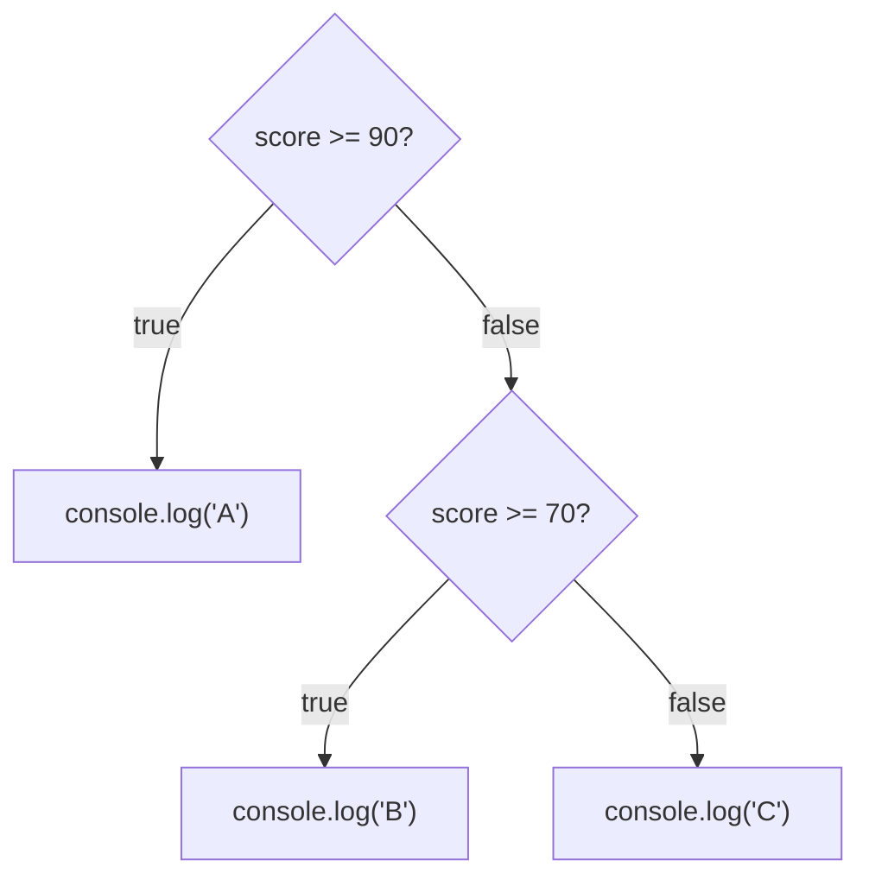
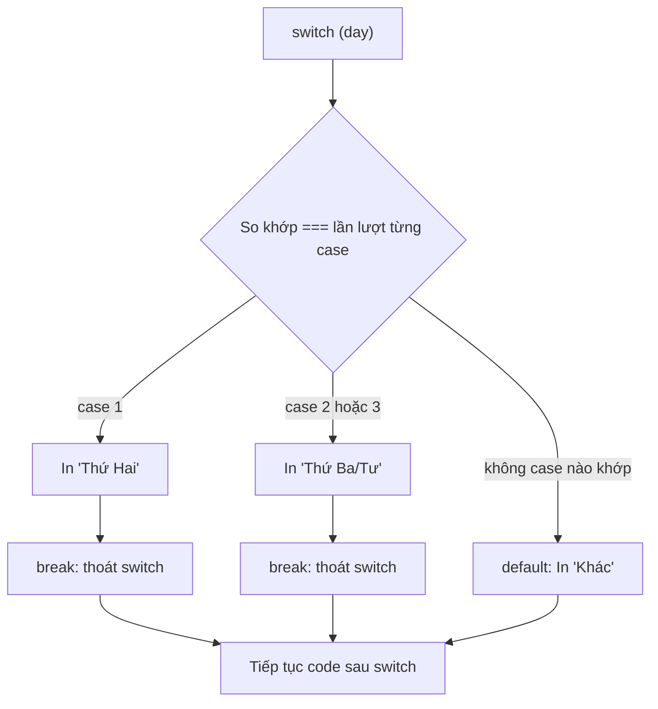

# Conditional Statements

**Conditional statements** (câu lệnh điều kiện) giúp chương trình đưa ra quyết định: chạy đoạn code này hay đoạn code kia tùy theo điều kiện đúng hay sai. Ví dụ "nếu tuổi lớn hơn 18 thì cho phép vào, ngược lại thì từ chối". JavaScript cung cấp nhiều cách để viết điều kiện như `if/else`, toán tử ba ngôi (**ternary**), và `switch`. Đây là cách để code của bạn phản ứng linh hoạt với các tình huống khác nhau.

[](pathname:///img/javascript/conditional.webp)

---

:::note[Ghi nhớ nhanh]

- ⭐ **Chọn đúng công cụ rẽ nhánh** — `if/else if/else` cho logic tuần tự, `switch` cho nhiều nhánh theo MỘT giá trị, ternary `? :` cho gán nhanh trong một dòng.
- **`switch` dùng `===`** (không ép kiểu), dễ dính **fall-through bug** khi quên `break`; case khai báo biến thì wrap trong `{}`.
- ⭐ **Phân biệt `||` và `??`** — `||` fallback theo truthy (nuốt cả `0` và `""`), còn `??` chỉ fallback khi `null`/`undefined`.
- **Short-circuit trả về giá trị** — `||` lấy truthy đầu tiên, `&&` dùng để gọi có điều kiện; `?.` truy cập an toàn thuộc tính lồng sâu.
- **`early return` / guard clause** rõ ràng hơn lồng `if` nhiều tầng.

:::

---

## Mục lục

- [Vì sao có nhiều cách rẽ nhánh?](#vì-sao-có-nhiều-cách-rẽ-nhánh)
- [if / else if / else](#if--else-if--else)
- [Ternary operator](#ternary-operator)
- [switch statement](#switch-statement)
- [Short-circuit với &&, ||, ??](#short-circuit-với---)
- [Câu hỏi phỏng vấn](#câu-hỏi-phỏng-vấn)

---

## Vì sao có nhiều cách rẽ nhánh?

**Vấn đề:**

```js
// Chuỗi if/else if dài cho nhiều trường hợp rời rạc — khó đọc
let label;
if (status === "pending") label = "Đang chờ";
else if (status === "paid") label = "Đã thanh toán";
else if (status === "shipped") label = "Đang giao";
else label = "Không rõ";

// Gán biến theo điều kiện bằng if nhiều dòng — rườm rà
let badge;
if (isActive) {
  badge = "active";
} else {
  badge = "inactive";
}

// Truy cập thuộc tính lồng sâu — dễ lỗi "Cannot read property of undefined"
const city = user.address.city; // nổ nếu user.address là undefined
```

**Giải pháp:**

```js
// switch — nhiều nhánh dựa trên MỘT giá trị
let label;
switch (status) {
  case "pending": label = "Đang chờ"; break;
  case "paid":    label = "Đã thanh toán"; break;
  case "shipped": label = "Đang giao"; break;
  default:        label = "Không rõ";
}

// Ternary ? : — gán nhanh theo điều kiện, gọn trong một dòng
const badge = isActive ? "active" : "inactive";

// Optional chaining ?. — truy cập an toàn, ?? — giá trị mặc định
const city = user?.address?.city ?? "Chưa cập nhật";
```

Mỗi công cụ hợp với một tình huống: `switch` cho nhiều nhánh theo một giá trị,
ternary cho gán nhanh, `?.` và `??` cho dữ liệu có thể thiếu.

:::tip[Dùng thực tế]

- **`switch`**: hiển thị nhãn theo trạng thái đơn hàng hoặc loại sự kiện (`status`, `type`).
- **Ternary**: đặt `className` hoặc nhãn theo điều kiện, ví dụ `isError ? "text-red" : "text-gray"`.
- **`?.`**: đọc dữ liệu từ API có thể thiếu field, như `response?.data?.items`.
- **`??`**: đặt giá trị mặc định khi thiếu, như `pageSize ?? 20` (giữ nguyên `0`).

:::

---

## if / else if / else

```js
const score = 75;

if (score >= 90) {
  console.log("A");
} else if (score >= 70) {
  console.log("B");
} else {
  console.log("C");
}
```

Các điều kiện được kiểm tra **lần lượt từ trên xuống**; nhánh đầu tiên đúng sẽ chạy rồi bỏ qua toàn bộ phần còn lại:



Một dòng — bỏ `{}` (không khuyến khích vì dễ bug):

```js
if (x > 0) console.log("positive");
```

---

## Ternary operator

Biểu thức điều kiện — trả về giá trị:

```js
const status = age >= 18 ? "adult" : "minor";
```

Lồng ternary — đọc khó, hạn chế:

```js
// Tệ
const grade = score >= 90 ? "A" : score >= 70 ? "B" : "C";

// Tốt — dùng if/else hoặc lookup
const grade = (() => {
  if (score >= 90) return "A";
  if (score >= 70) return "B";
  return "C";
})();
```

:::tip[Mẹo]

Trong JSX/template, ternary là **cách duy nhất** để conditional render:

```jsx
{isLoading ? <Spinner /> : <Content />}

{user && <UserCard user={user} />}

{items.length > 0 ? <List /> : <Empty />}
```

ESLint rule `no-nested-ternary` ngăn lồng — buộc bạn extract function
khi logic phức tạp.

:::

---

## switch statement

```js
const day = 1;

switch (day) {
  case 1:
    console.log("Thứ Hai");
    break;
  case 2:
  case 3:
    console.log("Thứ Ba/Tư");
    break;
  default:
    console.log("Khác");
}
```

`switch` so khớp giá trị với từng `case` bằng `===`; gặp `break` thì thoát, còn `default` chạy khi không case nào khớp:



:::warning[Cần lưu ý]

**`switch` dùng `===`** (strict equality), không coerce:

```js
switch ("1") {
  case 1:           // không match — khác kiểu
    break;
  case "1":         // match
    break;
}
```

**Fall-through bug** — quên `break`:

```js
switch (x) {
  case 1:
    console.log("one");
    // quên break → tiếp tục case 2!
  case 2:
    console.log("two");
    break;
}
```

Bật ESLint rule `no-fallthrough` để cảnh báo. Cố ý fall-through phải
comment `// fall through`.

Khi case có nhiều dòng + khai báo biến, **wrap trong `{}`**:

```js
switch (action) {
  case "ADD": {
    const newItem = createItem();
    return [...state, newItem];
  }
  case "REMOVE": {
    const newItem = findItem(); // không xung đột scope
    return state.filter(x => x !== newItem);
  }
}
```

:::

---

## Short-circuit với &&, ||, ??

Các toán tử logic **return giá trị**, không chỉ boolean — dùng làm
shortcut cho conditional:

**`||`** — lấy giá trị **truthy đầu tiên**:

```js
const name = userInput || "Anonymous";
const port = config.port || 3000;
```

**`&&`** — lấy giá trị **falsy đầu tiên** hoặc cuối:

```js
user && user.greet();           // chỉ gọi nếu user truthy
isLogged && renderDashboard();  // pattern trong React
```

**`??`** (ES2020) — fallback **chỉ khi null/undefined**:

```js
const port = config.port ?? 3000;    // 0 vẫn được giữ
const name = userInput ?? "Anonymous"; // "" vẫn được giữ
```

:::info[Phân tích]

**`||` vs `??`** — khác biệt quan trọng:

```js
const a = 0 || 100;      // 100 (0 là falsy)
const b = 0 ?? 100;      // 0 (0 không null/undefined)

const c = "" || "default";  // "default"
const d = "" ?? "default";  // ""

const e = false || true;  // true
const f = false ?? true;  // false
```

→ Dùng `??` khi muốn **default chỉ cho null/undefined** — đúng với 90%
trường hợp config, parameter default. `||` chỉ phù hợp khi mọi giá trị
falsy đều cần fallback.

ESLint rule `prefer-nullish-coalescing` sẽ nhắc bạn migrate từ `||` sang
`??` ở chỗ phù hợp.

:::

:::tip[Mẹo]

**Pattern `early return`** thường rõ ràng hơn lồng `if`:

```js
// Tệ — pyramid of doom
function process(user) {
  if (user) {
    if (user.active) {
      if (user.permissions.includes("write")) {
        return doWork(user);
      }
    }
  }
  return null;
}

// Tốt — guard clauses
function process(user) {
  if (!user) return null;
  if (!user.active) return null;
  if (!user.permissions.includes("write")) return null;
  return doWork(user);
}
```

Nguyên tắc: **xử lý case "không hợp lệ" trước**, trả về sớm; phần chính
ở cuối, không lồng.

:::

---

## Câu hỏi phỏng vấn

Những câu thường gặp về chủ đề này. Tự trả lời trước, rồi bấm **Xem đáp án** để đối chiếu.

**1. Phân biệt `statement` và `expression`. Vì sao `if/else` là statement còn ternary `? :` là expression, và điều đó ảnh hưởng thế nào khi bạn cần rẽ nhánh bên trong JSX?**

<details className="qa">
<summary>Xem đáp án</summary>

- **Expression** (biểu thức): đoạn code **cho ra một giá trị** — `1 + 2`, `age >= 18`, `fn()`. Có thể gán vào biến, truyền làm tham số, nhúng vào chỗ cần giá trị.
- **Statement** (câu lệnh): đoạn code **thực hiện một hành động**, không tự nó cho ra giá trị — `if`, `for`, `switch`, khai báo biến.

`if/else` là statement vì nó chỉ *điều khiển luồng chạy*; `const x = if (a) {...}` là `SyntaxError`. Ternary là expression vì nó **trả về giá trị** của một trong hai nhánh.

```js
const status = age >= 18 ? "adult" : "minor"; // OK
```

**Ảnh hưởng trong JSX:** phần trong `{...}` của JSX **chỉ nhận expression**, nên không viết `if` vào đó được. Vì vậy ternary (và `&&`) là cách rẽ nhánh inline duy nhất:

```jsx
{isLoading ? <Spinner /> : <Content />}
{user && <UserCard user={user} />}
```

Nếu logic phức tạp, hãy tách ra biến hoặc hàm phía trên rồi dùng `if` bình thường, thay vì lồng ternary.

</details>

**2. Liệt kê đầy đủ các giá trị `falsy` trong JavaScript. `[]`, `{}`, `"0"`, `NaN` — cái nào truthy, cái nào falsy?**

<details className="qa">
<summary>Xem đáp án</summary>

Chỉ có **8 giá trị falsy**, học thuộc là xong — mọi giá trị còn lại đều truthy:

```js
false
0
-0
0n        // BigInt zero
""        // chuỗi rỗng (cả '' và ``)
null
undefined
NaN
```

Trả lời câu hỏi:

| Giá trị | Truthy / Falsy | Ghi chú |
|---|---|---|
| `[]` | **Truthy** | Mảng rỗng vẫn là object |
| `{}` | **Truthy** | Object rỗng vẫn là object |
| `"0"` | **Truthy** | Chuỗi không rỗng, dù nội dung là "0" |
| `NaN` | **Falsy** | Nằm trong danh sách 8 giá trị trên |

Bẫy hay gặp: mọi object đều truthy, kể cả `new Boolean(false)`.

```js
if ([]) console.log("chạy");        // có chạy
if ([] == false) console.log("ơ");  // cũng chạy — nhưng do == ép kiểu, khác chuyện truthy
```

Đây cũng là lý do `if (!value)` khác `if (value == null)`: `0` và `""` là falsy nhưng không phải nullish.

</details>

**3. `switch` so khớp `case` bằng `==` hay `===`? Đoán output khi `switch ("1")` có cả `case 1:` lẫn `case "1":`.**

<details className="qa">
<summary>Xem đáp án</summary>

`switch` so khớp bằng **`===`** (strict equality) — **không ép kiểu**.

```js
switch ("1") {
  case 1:
    console.log("số 1");
    break;
  case "1":
    console.log("chuỗi 1");
    break;
  default:
    console.log("không khớp");
}
// Output: "chuỗi 1"
```

`case 1` bị bỏ qua vì `"1" === 1` là `false` (khác kiểu). Chỉ `case "1"` khớp.

Hệ quả thực tế: giá trị lấy từ `input.value`, `params` của URL hay `dataset` đều là **string**, nên `switch (input.value) { case 1: ... }` sẽ không bao giờ khớp. Phải ép kiểu trước (`Number(input.value)`) hoặc viết case dạng chuỗi.

Một hệ quả nữa của `===`: `switch (NaN)` không bao giờ khớp `case NaN`, vì `NaN !== NaN`.

</details>

**4. `fall-through` trong `switch` là gì? Khi nào bạn cố ý dùng nó, và làm sao để ESLint cảnh báo lúc quên `break`?**

<details className="qa">
<summary>Xem đáp án</summary>

**Fall-through** là hành vi: khi một `case` khớp, code chạy tiếp **xuyên qua các case phía dưới** cho tới khi gặp `break`, `return`, `throw` hoặc hết `switch`. Quên `break` là bug kinh điển:

```js
switch (x) {
  case 1:
    console.log("one");
    // quên break → chạy luôn xuống case 2!
  case 2:
    console.log("two");
    break;
}
// x = 1 → in cả "one" lẫn "two"
```

**Cố ý dùng khi nhiều case chia chung một xử lý** — xếp các `case` liền nhau, không có code ở giữa:

```js
switch (day) {
  case 6:
  case 7:
    console.log("Cuối tuần");
    break;
  default:
    console.log("Ngày thường");
}
```

Trường hợp fall-through *có code* ở giữa mà vẫn cố ý thì bắt buộc ghi chú `// fall through` để người sau biết là chủ ý.

**ESLint:** bật rule **`no-fallthrough`** — nó cảnh báo khi một case có code nhưng không kết thúc bằng `break`/`return`, và tự bỏ qua khi thấy comment `// fall through`.

</details>

**5. Vì sao `case` có khai báo `let`/`const` lại nên bọc trong `{}`? Không bọc thì gặp lỗi gì?**

<details className="qa">
<summary>Xem đáp án</summary>

Vì **toàn bộ thân `switch` là MỘT block scope duy nhất**, không phải mỗi `case` một scope. Nên `let`/`const` khai báo trong `case` này vẫn "thuộc về" cả `switch`, dẫn tới hai lỗi:

```js
switch (action) {
  case "ADD":
    const item = createItem();   // khai báo trong scope của switch
    return [...state, item];
  case "REMOVE":
    const item = findItem();     // SyntaxError: Identifier 'item' has already been declared
    return state.filter(x => x !== item);
}
```

Lỗi thứ hai là **`ReferenceError` do temporal dead zone**: nếu nhánh chạy là `"REMOVE"`, biến `item` của nhánh `"ADD"` vẫn được hoisted vào scope nhưng chưa khởi tạo — chạm vào là lỗi.

**Cách sửa — bọc mỗi case trong `{}`** để tạo block scope riêng:

```js
switch (action) {
  case "ADD": {
    const item = createItem();
    return [...state, item];
  }
  case "REMOVE": {
    const item = findItem();     // không còn xung đột
    return state.filter(x => x !== item);
  }
}
```

ESLint có rule `no-case-declarations` bắt đúng lỗi này.

</details>

**6. `&&` và `||` trả về boolean hay trả về chính toán hạng? Đoán output của `0 || "a"`, `"" && "b"`, `null || 0 || "c"`.**

<details className="qa">
<summary>Xem đáp án</summary>

Chúng trả về **chính một trong hai toán hạng**, không phải boolean. Chỉ toán tử `!` mới luôn trả boolean.

- `||` trả về **toán hạng truthy đầu tiên**; nếu không có thì trả toán hạng cuối cùng.
- `&&` trả về **toán hạng falsy đầu tiên**; nếu không có thì trả toán hạng cuối cùng.

```js
0 || "a";            // "a"  — 0 falsy nên lấy vế sau
"" && "b";           // ""   — "" falsy, dừng ngay, trả về ""
null || 0 || "c";    // "c"  — null falsy, 0 falsy, lấy "c"

"x" || "y";          // "x"  — truthy đầu tiên
"x" && "y";          // "y"  — không có falsy nào, trả toán hạng cuối
0 || null;           // null — không có truthy nào, trả toán hạng cuối
```

Đặc tính này chính là nền cho các idiom quen thuộc: `const name = input || "Anonymous"` (giá trị mặc định) và `user && user.greet()` (gọi có điều kiện), cũng như `{user && <UserCard />}` trong React.

</details>

**7. So sánh `||` với `??`. Đoán output: `0 || 100`, `0 ?? 100`, `"" || "x"`, `"" ?? "x"`, `false ?? true`.**

<details className="qa">
<summary>Xem đáp án</summary>

Khác nhau ở **điều kiện kích hoạt fallback**:

- `||` fallback khi vế trái **falsy** (bao gồm `0`, `""`, `false`, `NaN`).
- `??` (nullish coalescing, ES2020) fallback **chỉ khi vế trái là `null` hoặc `undefined`**.

```js
0 || 100;       // 100  — 0 là falsy
0 ?? 100;       // 0    — 0 không nullish, giữ nguyên
"" || "x";      // "x"  — "" là falsy
"" ?? "x";      // ""   — "" không nullish, giữ nguyên
false ?? true;  // false — false không nullish, giữ nguyên
```

Vì sao quan trọng: với config/tham số, `0` và `""` và `false` thường là **giá trị hợp lệ** mà người dùng cố ý đặt. Dùng `||` sẽ âm thầm nuốt mất chúng:

```js
const pageSize = options.pageSize || 20;  // người dùng đặt 0 → bị ép thành 20
const pageSize = options.pageSize ?? 20;  // giữ đúng 0
const showAds  = settings.showAds ?? true; // giữ đúng false
```

Quy tắc: mặc định dùng `??`; chỉ dùng `||` khi thật sự muốn **mọi** giá trị falsy đều rơi vào fallback (ví dụ chuỗi rỗng cũng coi là "chưa nhập"). ESLint có rule `prefer-nullish-coalescing` để nhắc migrate.

</details>

**8. `short-circuit evaluation` nghĩa là gì? Nó ảnh hưởng ra sao khi vế phải có side effect, ví dụ `isValid() || logError()`?**

<details className="qa">
<summary>Xem đáp án</summary>

**Short-circuit evaluation** (đánh giá ngắn mạch) nghĩa là toán tử logic **dừng ngay khi đã đủ để kết luận**, và **không thèm chạy vế phải**:

- `a || b` — nếu `a` truthy thì trả `a` luôn, `b` **không được thực thi**.
- `a && b` — nếu `a` falsy thì trả `a` luôn, `b` **không được thực thi**.

Với vế phải có side effect, điều này quyết định side effect đó **có xảy ra hay không**:

```js
isValid() || logError();  // logError() CHỈ chạy khi isValid() trả falsy
user && user.save();      // save() CHỈ chạy khi user truthy
cache[key] || fetchData(key); // chỉ gọi API khi cache miss
```

Đây vừa là tính năng hữu ích, vừa là bẫy. Hữu ích vì nó cho phép bảo vệ: `obj && obj.prop` không nổ khi `obj` là `null`. Là bẫy vì một lời gọi hàm quan trọng có thể **âm thầm không chạy**:

```js
let count = 0;
false && count++;   // count vẫn 0 — dòng này trông như luôn tăng
```

Lời khuyên: dùng short-circuit cho luồng đơn giản, dễ nhìn. Khi vế phải là logic quan trọng có side effect, viết `if` tường minh để người đọc thấy rõ điều kiện.

</details>

**9. Vì sao `a ?? b || c` ném `SyntaxError`? Giải thích theo độ ưu tiên toán tử và cách viết đúng.**

<details className="qa">
<summary>Xem đáp án</summary>

Vì spec **cố tình cấm trộn `??` với `||` hoặc `&&` mà không có dấu ngoặc**.

```js
const x = a ?? b || c;   // SyntaxError
const y = a || b ?? c;   // SyntaxError
```

Lý do: `??` có **cùng mức ưu tiên** với `||` và `&&` trong bảng ưu tiên, nên nếu cho phép viết chung, người đọc không thể nhìn ra ý định thật là `(a ?? b) || c` hay `a ?? (b || c)` — mà hai cách nhóm cho kết quả **khác nhau**:

```js
const a = 0, b = "x", c = "fallback";

(a ?? b) || c;   // (0 ?? "x") → 0 → falsy → "fallback"
a ?? (b || c);   // 0 không nullish → 0
```

Thay vì chọn ngầm một cách nhóm rồi để lập trình viên đoán sai, TC39 quyết định báo lỗi cú pháp ngay.

**Cách viết đúng: thêm ngoặc để nói rõ ý định.**

```js
const x = (a ?? b) || c;
const y = a ?? (b || c);
```

Lưu ý `??` **được phép** đi cùng `?.` mà không cần ngoặc: `user?.name ?? "Ẩn danh"` hoàn toàn hợp lệ.

</details>

**10. Trong React, `{count && <List />}` khi `count === 0` sẽ render ra gì? Vì sao, và bạn sửa lại thế nào?**

<details className="qa">
<summary>Xem đáp án</summary>

Nó render ra **số `0` hiện trên màn hình** — không phải render "không gì cả" như mong đợi.

**Vì sao:** `&&` trả về **chính toán hạng**, không phải boolean. `count` là `0` (falsy) nên biểu thức short-circuit và trả về `0`. React **bỏ qua** `false`, `null`, `undefined` khi render, nhưng **số `0` thì render ra**. Kết quả là giữa giao diện xuất hiện một chữ "0" lạc lõng.

```jsx
{count && <List />}     // count = 0 → hiện "0"
{items.length && <List />} // mảng rỗng → hiện "0"
```

**Cách sửa** — biến vế trái thành boolean thật, hoặc dùng ternary:

```jsx
{count > 0 && <List />}          // rõ ràng nhất
{Boolean(count) && <List />}     // ép sang boolean
{!!count && <List />}            // ngắn gọn, cùng ý
{count ? <List /> : null}        // ternary — an toàn tuyệt đối
```

Cùng bẫy này xảy ra với chuỗi rỗng ở một số môi trường và với `NaN`. Quy tắc an toàn: trong JSX, **luôn đưa vế trái của `&&` về boolean**, đừng dựa vào truthy của số hay chuỗi.

</details>

**11. `?.` xử lý ra sao khi một mắt xích giữa chuỗi là `null`? So sánh `obj?.a.b.c` với `obj?.a?.b?.c` — trường hợp nào vẫn có thể nổ `TypeError`?**

<details className="qa">
<summary>Xem đáp án</summary>

`?.` (optional chaining) hoạt động như sau: nếu giá trị **ngay trước dấu `?.`** là `null` hoặc `undefined`, **toàn bộ phần còn lại của chuỗi bị bỏ qua** và biểu thức trả về `undefined` ngay, không ném lỗi.

Điểm mấu chốt: `?.` chỉ bảo vệ **đúng mắt xích mà nó đứng sau**.

```js
const obj = { a: undefined };

obj?.a.b.c;    // TypeError: Cannot read properties of undefined (reading 'b')
obj?.a?.b?.c;  // undefined — an toàn
```

- **`obj?.a.b.c`** chỉ bảo vệ trường hợp `obj` là nullish. Nếu `obj` tồn tại nhưng `obj.a` là `undefined`, việc đọc `.b` vẫn **nổ `TypeError`** vì `.b` là truy cập thường.
- **`obj?.a?.b?.c`** bảo vệ **từng mắt xích**, nên an toàn ở mọi vị trí.

```js
const user = null;
user?.address.city;   // undefined — short-circuit ngay từ user, cả chuỗi bị bỏ qua
```

Lời khuyên: chỉ đặt `?.` ở những mắt xích **thật sự có thể thiếu**. Rải `?.` khắp nơi sẽ che giấu bug — dữ liệu sai sẽ âm thầm thành `undefined` thay vì báo lỗi sớm. Kết hợp `??` để đặt mặc định: `user?.address?.city ?? "Chưa cập nhật"`.

</details>

**12. `obj?.method()` khác `obj.method?.()` ở điểm nào? Mỗi cách bảo vệ bạn khỏi lỗi gì?**

<details className="qa">
<summary>Xem đáp án</summary>

Hai cách bảo vệ **hai thứ khác nhau**:

- **`obj?.method()`** — bảo vệ **`obj`** khỏi nullish. Nếu `obj` là `null`/`undefined`, trả `undefined` ngay. Nhưng nếu `obj` tồn tại mà `method` không tồn tại, vẫn nổ `TypeError: obj.method is not a function`.
- **`obj.method?.()`** — đây là **optional call**, bảo vệ **`method`**: chỉ gọi khi `method` không nullish. Nhưng nếu `obj` là `null`, vẫn nổ `TypeError` ngay ở `obj.method`.

```js
const obj = {};
obj?.method();     // TypeError: obj.method is not a function
obj.method?.();    // undefined — an toàn

const nothing = null;
nothing?.method(); // undefined — an toàn
nothing.method?.(); // TypeError: Cannot read properties of null
```

**Muốn an toàn cả hai, ghép lại:**

```js
obj?.method?.();
```

Use case điển hình của optional call là gọi callback tuỳ chọn:

```js
function Button({ onClick }) {
  const handle = () => onClick?.(); // không cần if (onClick)
}
```

Lưu ý `?.()` chỉ kiểm tra nullish, không kiểm tra "có phải hàm không" — nếu `method` là một số thì vẫn ném lỗi.

</details>

**13. `guard clause` / `early return` giải quyết vấn đề gì so với lồng `if` nhiều tầng (pyramid of doom)?**

<details className="qa">
<summary>Xem đáp án</summary>

Lồng `if` nhiều tầng đẩy logic chính vào sâu bên trong, khiến người đọc phải giữ nhiều điều kiện trong đầu cùng lúc và mắt phải quét qua nhiều mức thụt lề.

```js
// Tệ — pyramid of doom
function process(user) {
  if (user) {
    if (user.active) {
      if (user.permissions.includes("write")) {
        return doWork(user);
      }
    }
  }
  return null;
}

// Tốt — guard clauses
function process(user) {
  if (!user) return null;
  if (!user.active) return null;
  if (!user.permissions.includes("write")) return null;
  return doWork(user);
}
```

**Guard clause giải quyết:**

- **Giảm độ sâu thụt lề** — code phẳng, dễ quét mắt.
- **Tách bạch "trường hợp loại trừ" và "luồng chính"**: loại trừ xử lý trước và ra khỏi hàm sớm, phần chính nằm ở cuối, không lồng.
- **Giảm tải nhận thức**: đọc tới dòng nào cũng biết mọi điều kiện phía trên đã thoả.
- **Dễ thêm điều kiện mới** — chỉ thêm một dòng, không phải bọc thêm một tầng.
- Dễ gắn thông báo lỗi cụ thể cho từng trường hợp thay vì gộp chung một `return null`.

Nguyên tắc: **xử lý case không hợp lệ trước, trả về sớm.**

</details>

**14. Khi nào bạn chọn `switch`, khi nào chọn object lookup map, khi nào chọn chuỗi `if / else if`? Đánh đổi của từng cách là gì?**

<details className="qa">
<summary>Xem đáp án</summary>

| Cách | Dùng khi | Đánh đổi |
|---|---|---|
| `if / else if` | Điều kiện là **biểu thức khác nhau** (khoảng giá trị, nhiều biến, so sánh phức tạp) | Linh hoạt nhất, nhưng dài và khó đọc khi nhiều nhánh |
| `switch` | Nhiều nhánh dựa trên **một giá trị** rời rạc; mỗi nhánh có vài dòng logic | Gom nhóm case được, nhưng dễ quên `break` và phải bọc `{}` khi khai báo biến |
| Object lookup | Ánh xạ **giá trị → giá trị/hàm**, danh sách case có thể mở rộng hoặc cấu hình được | Ngắn gọn nhất, nhưng phải xử lý key không tồn tại và cẩn thận với key kế thừa |

```js
// Điều kiện theo khoảng → if/else if
if (score >= 90) grade = "A";
else if (score >= 70) grade = "B";

// Nhiều nhánh theo một giá trị, mỗi nhánh nhiều dòng → switch
switch (action.type) { case "ADD": { /* ... */ } }

// Ánh xạ đơn giản → object lookup
const LABELS = { pending: "Đang chờ", paid: "Đã thanh toán" };
const label = LABELS[status] ?? "Không rõ";
```

Quy tắc của tôi: ánh xạ thuần dữ liệu thì dùng object (dễ test, dễ đưa ra file config); có logic thật sự cho từng nhánh thì `switch`; điều kiện không cùng một biến thì `if/else if`.

</details>

**15. Ternary lồng nhiều tầng bị chê ở điểm nào? Bạn refactor một biểu thức 4 tầng ternary như thế nào?**

<details className="qa">
<summary>Xem đáp án</summary>

Ternary lồng bị chê vì: khó xác định `:` nào ăn với `?` nào, không gắn được comment cho từng nhánh, diff git rối khi sửa một nhánh, và khi xuống dòng thì định dạng mỗi người một kiểu. ESLint có rule `no-nested-ternary` để chặn.

```js
// Tệ — 4 tầng
const label = s === "a" ? "A" : s === "b" ? "B" : s === "c" ? "C" : s === "d" ? "D" : "?";
```

**Cách refactor, theo thứ tự ưu tiên:**

1. **Object lookup** — nếu chỉ là ánh xạ giá trị:

```js
const LABELS = { a: "A", b: "B", c: "C", d: "D" };
const label = LABELS[s] ?? "?";
```

2. **Tách thành hàm với guard clause** — nếu mỗi nhánh có điều kiện phức tạp:

```js
function getGrade(score) {
  if (score >= 90) return "A";
  if (score >= 80) return "B";
  if (score >= 70) return "C";
  return "D";
}
```

3. **`switch`** — nếu mỗi nhánh cần vài dòng xử lý.

Ternary **một tầng** vẫn rất tốt và nên dùng: `const badge = isActive ? "active" : "inactive"`. Ranh giới thực dụng: quá một tầng là tín hiệu nên tách ra.

</details>
