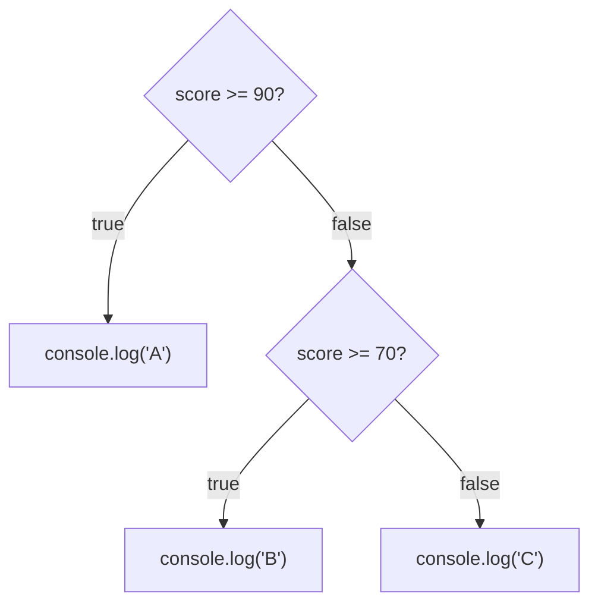
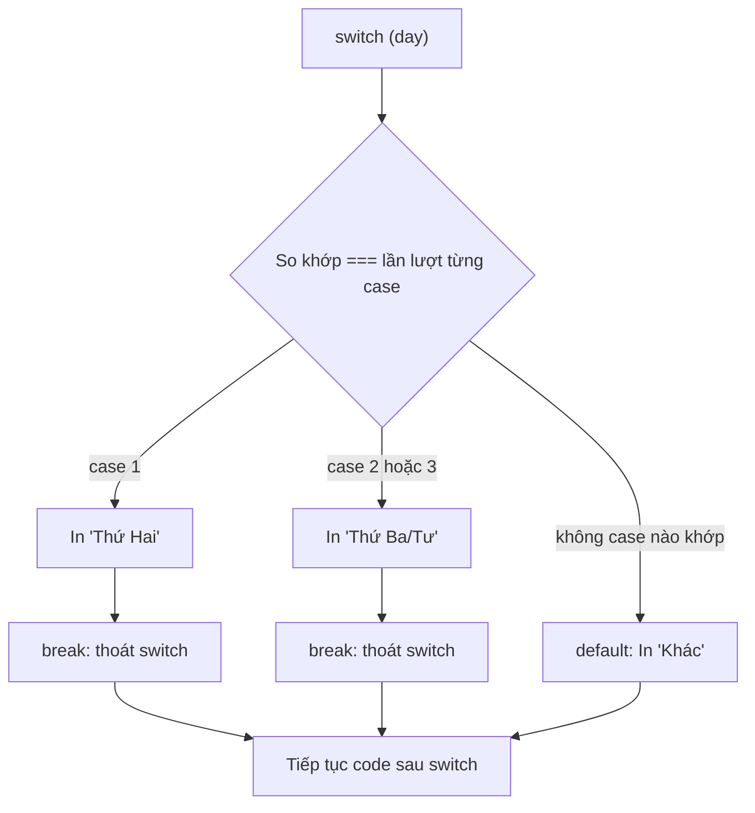

# Conditional Statements

**Conditional statements** (câu lệnh điều kiện) giúp chương trình đưa ra quyết định: chạy đoạn code này hay đoạn code kia tùy theo điều kiện đúng hay sai. Ví dụ "nếu tuổi lớn hơn 18 thì cho phép vào, ngược lại thì từ chối". JavaScript cung cấp nhiều cách để viết điều kiện như `if/else`, toán tử ba ngôi (**ternary**), và `switch`. Đây là cách để code của bạn phản ứng linh hoạt với các tình huống khác nhau.

---

:::note[Ghi nhớ nhanh]

- ⭐ **Chọn đúng công cụ rẽ nhánh** — `if/else if/else` cho logic tuần tự, `switch` cho nhiều nhánh theo MỘT giá trị, ternary `? :` cho gán nhanh trong một dòng.
- **`switch` dùng `===`** (không ép kiểu), dễ dính **fall-through bug** khi quên `break`; case khai báo biến thì wrap trong `{}`.
- ⭐ **Phân biệt `||` và `??`** — `||` fallback theo truthy (nuốt cả `0` và `""`), còn `??` chỉ fallback khi `null`/`undefined`.
- **Short-circuit trả về giá trị** — `||` lấy truthy đầu tiên, `&&` dùng để gọi có điều kiện; `?.` truy cập an toàn thuộc tính lồng sâu.
- **`early return` / guard clause** rõ ràng hơn lồng `if` nhiều tầng.

:::

---

## Mục lục

- [Vì sao có nhiều cách rẽ nhánh?](#vì-sao-có-nhiều-cách-rẽ-nhánh)
- [if / else if / else](#if--else-if--else)
- [Ternary operator](#ternary-operator)
- [switch statement](#switch-statement)
- [Short-circuit với &&, ||, ??](#short-circuit-với---)

---

## Vì sao có nhiều cách rẽ nhánh?

**Vấn đề:**

```js
// Chuỗi if/else if dài cho nhiều trường hợp rời rạc — khó đọc
let label;
if (status === "pending") label = "Đang chờ";
else if (status === "paid") label = "Đã thanh toán";
else if (status === "shipped") label = "Đang giao";
else label = "Không rõ";

// Gán biến theo điều kiện bằng if nhiều dòng — rườm rà
let badge;
if (isActive) {
  badge = "active";
} else {
  badge = "inactive";
}

// Truy cập thuộc tính lồng sâu — dễ lỗi "Cannot read property of undefined"
const city = user.address.city; // nổ nếu user.address là undefined
```

**Giải pháp:**

```js
// switch — nhiều nhánh dựa trên MỘT giá trị
let label;
switch (status) {
  case "pending": label = "Đang chờ"; break;
  case "paid":    label = "Đã thanh toán"; break;
  case "shipped": label = "Đang giao"; break;
  default:        label = "Không rõ";
}

// Ternary ? : — gán nhanh theo điều kiện, gọn trong một dòng
const badge = isActive ? "active" : "inactive";

// Optional chaining ?. — truy cập an toàn, ?? — giá trị mặc định
const city = user?.address?.city ?? "Chưa cập nhật";
```

Mỗi công cụ hợp với một tình huống: `switch` cho nhiều nhánh theo một giá trị,
ternary cho gán nhanh, `?.` và `??` cho dữ liệu có thể thiếu.

:::tip[Dùng thực tế]

- **`switch`**: hiển thị nhãn theo trạng thái đơn hàng hoặc loại sự kiện (`status`, `type`).
- **Ternary**: đặt `className` hoặc nhãn theo điều kiện, ví dụ `isError ? "text-red" : "text-gray"`.
- **`?.`**: đọc dữ liệu từ API có thể thiếu field, như `response?.data?.items`.
- **`??`**: đặt giá trị mặc định khi thiếu, như `pageSize ?? 20` (giữ nguyên `0`).

:::

---

## if / else if / else

```js
const score = 75;

if (score >= 90) {
  console.log("A");
} else if (score >= 70) {
  console.log("B");
} else {
  console.log("C");
}
```

Các điều kiện được kiểm tra **lần lượt từ trên xuống**; nhánh đầu tiên đúng sẽ chạy rồi bỏ qua toàn bộ phần còn lại:



Một dòng — bỏ `{}` (không khuyến khích vì dễ bug):

```js
if (x > 0) console.log("positive");
```

---

## Ternary operator

Biểu thức điều kiện — trả về giá trị:

```js
const status = age >= 18 ? "adult" : "minor";
```

Lồng ternary — đọc khó, hạn chế:

```js
// Tệ
const grade = score >= 90 ? "A" : score >= 70 ? "B" : "C";

// Tốt — dùng if/else hoặc lookup
const grade = (() => {
  if (score >= 90) return "A";
  if (score >= 70) return "B";
  return "C";
})();
```

:::tip[Mẹo]

Trong JSX/template, ternary là **cách duy nhất** để conditional render:

```jsx
{isLoading ? <Spinner /> : <Content />}

{user && <UserCard user={user} />}

{items.length > 0 ? <List /> : <Empty />}
```

ESLint rule `no-nested-ternary` ngăn lồng — buộc bạn extract function
khi logic phức tạp.

:::

---

## switch statement

```js
const day = 1;

switch (day) {
  case 1:
    console.log("Thứ Hai");
    break;
  case 2:
  case 3:
    console.log("Thứ Ba/Tư");
    break;
  default:
    console.log("Khác");
}
```

`switch` so khớp giá trị với từng `case` bằng `===`; gặp `break` thì thoát, còn `default` chạy khi không case nào khớp:



:::warning[Cần lưu ý]

**`switch` dùng `===`** (strict equality), không coerce:

```js
switch ("1") {
  case 1:           // không match — khác kiểu
    break;
  case "1":         // match
    break;
}
```

**Fall-through bug** — quên `break`:

```js
switch (x) {
  case 1:
    console.log("one");
    // quên break → tiếp tục case 2!
  case 2:
    console.log("two");
    break;
}
```

Bật ESLint rule `no-fallthrough` để cảnh báo. Cố ý fall-through phải
comment `// fall through`.

Khi case có nhiều dòng + khai báo biến, **wrap trong `{}`**:

```js
switch (action) {
  case "ADD": {
    const newItem = createItem();
    return [...state, newItem];
  }
  case "REMOVE": {
    const newItem = findItem(); // không xung đột scope
    return state.filter(x => x !== newItem);
  }
}
```

:::

---

## Short-circuit với &&, ||, ??

Các toán tử logic **return giá trị**, không chỉ boolean — dùng làm
shortcut cho conditional:

**`||`** — lấy giá trị **truthy đầu tiên**:

```js
const name = userInput || "Anonymous";
const port = config.port || 3000;
```

**`&&`** — lấy giá trị **falsy đầu tiên** hoặc cuối:

```js
user && user.greet();           // chỉ gọi nếu user truthy
isLogged && renderDashboard();  // pattern trong React
```

**`??`** (ES2020) — fallback **chỉ khi null/undefined**:

```js
const port = config.port ?? 3000;    // 0 vẫn được giữ
const name = userInput ?? "Anonymous"; // "" vẫn được giữ
```

:::info[Phân tích]

**`||` vs `??`** — khác biệt quan trọng:

```js
const a = 0 || 100;      // 100 (0 là falsy)
const b = 0 ?? 100;      // 0 (0 không null/undefined)

const c = "" || "default";  // "default"
const d = "" ?? "default";  // ""

const e = false || true;  // true
const f = false ?? true;  // false
```

→ Dùng `??` khi muốn **default chỉ cho null/undefined** — đúng với 90%
trường hợp config, parameter default. `||` chỉ phù hợp khi mọi giá trị
falsy đều cần fallback.

ESLint rule `prefer-nullish-coalescing` sẽ nhắc bạn migrate từ `||` sang
`??` ở chỗ phù hợp.

:::

:::tip[Mẹo]

**Pattern `early return`** thường rõ ràng hơn lồng `if`:

```js
// Tệ — pyramid of doom
function process(user) {
  if (user) {
    if (user.active) {
      if (user.permissions.includes("write")) {
        return doWork(user);
      }
    }
  }
  return null;
}

// Tốt — guard clauses
function process(user) {
  if (!user) return null;
  if (!user.active) return null;
  if (!user.permissions.includes("write")) return null;
  return doWork(user);
}
```

Nguyên tắc: **xử lý case "không hợp lệ" trước**, trả về sớm; phần chính
ở cuối, không lồng.

:::
