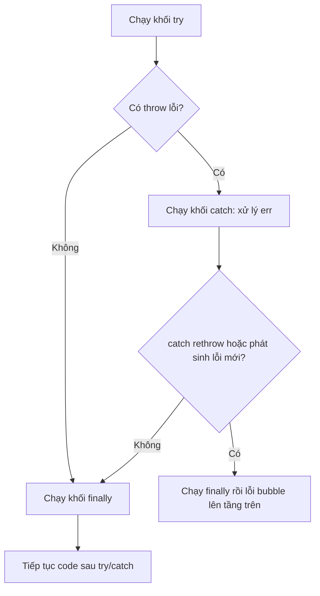

# Exception Handling

**Exception handling** (xử lý ngoại lệ) là cách để chương trình đối phó với lỗi xảy ra lúc chạy mà không bị dừng đột ngột. Một **exception** (ngoại lệ — lỗi bất ngờ xảy ra khi code đang chạy, ví dụ chia cho 0 hay đọc file không tồn tại) sẽ làm chương trình ngừng nếu bạn không xử lý nó. Trong JavaScript, bạn dùng `try/catch/finally` để "bắt" lỗi và phản ứng an toàn, cùng với `throw` để chủ động báo lỗi. Nhờ vậy, ứng dụng của bạn vẫn chạy ổn định ngay cả khi có sự cố.

[](pathname:///img/javascript/exception-handling.webp)

---

:::note[Ghi nhớ nhanh]

- ⭐ **`try/catch/finally` tách luồng lỗi khỏi luồng chính** — `finally` luôn chạy để dọn dẹp tài nguyên dù thành công, lỗi hay có `return`.
- **Luôn `throw new Error(...)`** (không throw chuỗi/số/object) để giữ được `message` và `stack`.
- ⭐ **Chỉ catch khi biết xử lý** — đừng nuốt lỗi im lặng; không biết thì `throw err` (rethrow) để bubble lên nơi xử lý được.
- **Các class Error sẵn có** (`TypeError`, `ReferenceError`, `SyntaxError`...) và **custom Error** kế thừa `Error` giúp phân loại qua `instanceof`; `Error.cause` gắn lỗi gốc.
- **Async**: Promise chain dùng `.catch()`, async/await dùng `try/catch`; **unhandled rejection** có thể crash app (Node ≥ 15).
- **`Promise.allSettled`** khi cần chờ hết nhiều promise mà không fail-fast như `Promise.all`.

:::

---

## Mục lục

- [Vì sao có try/catch (xử lý ngoại lệ)?](#vì-sao-có-trycatch-xử-lý-ngoại-lệ)
- [throw](#throw)
- [try / catch / finally](#try--catch--finally)
- [Error Objects](#error-objects)
- [Custom Error](#custom-error)
- [Async error handling](#async-error-handling)
- [Câu hỏi phỏng vấn](#câu-hỏi-phỏng-vấn)

---

## Vì sao có try/catch (xử lý ngoại lệ)?

**Vấn đề:** Nếu không có ngoại lệ, mỗi hàm phải **trả về mã lỗi** rồi tầng gọi phải tự kiểm tra từng bước. Code logic bị **trộn lẫn** với code kiểm lỗi, rườm rà và rất dễ quên check — một lỗi bỏ sót sẽ lan âm thầm và làm sập app.

```js
// Mỗi hàm trả về mã lỗi, phải check thủ công từng bước
function loadUser(id) {
  const res = readFile(id);
  if (res.error) return { error: res.error };   // quên check là hỏng

  const parsed = parseJson(res.data);
  if (parsed.error) return { error: parsed.error };

  const user = validate(parsed.data);
  if (user.error) return { error: user.error };

  return { data: user.data };
}

// Tầng gọi lại phải check tiếp...
const result = loadUser(1);
if (result.error) {
  // xử lý lỗi — logic chính chìm trong đống if
}
```

**Giải pháp:** Cơ chế ngoại lệ `throw` + `try/catch/finally` ra đời để **tách riêng luồng lỗi khỏi luồng chính**. Lỗi tự "nổi" lên cho tầng nào biết xử lý thì bắt; `finally` luôn dọn dẹp tài nguyên dù có lỗi hay không. Bạn cũng có thể tạo custom Error class để phân loại lỗi nghiệp vụ.

```js
function loadUser(id) {
  const data = readFile(id);        // lỗi tự throw, không cần check
  const parsed = JSON.parse(data);  // lỗi tự throw
  return validate(parsed);          // throw ValidationError nếu sai
}

// Gom xử lý lỗi MỘT chỗ, luồng chính sạch sẽ
let conn;
try {
  conn = openConnection();
  const user = loadUser(1);
  console.log(user);
} catch (err) {
  console.error("Tải user thất bại:", err.message); // mọi lỗi về đây
} finally {
  conn?.close(); // luôn giải phóng tài nguyên
}
```

:::tip[Dùng thực tế]

- **Bọc lời gọi API / parse JSON**: gói `fetch` + `JSON.parse` trong `try/catch` để mạng chập chờn hay dữ liệu hỏng không làm sập app.
- **Validate và throw lỗi nghiệp vụ**: khi input sai, `throw new ValidationError(...)` để tầng trên bắt và trả lỗi rõ ràng cho người dùng.
- **Đóng kết nối / giải phóng trong `finally`**: đóng DB, file, hủy timer... đảm bảo dọn dẹp dù thành công hay thất bại.
- **Gom xử lý lỗi một chỗ**: dùng error handler ở tầng cao (middleware, top-level) thay vì rải `if (error)` khắp nơi.

:::

---

## throw

Dùng `throw` để **phát sinh lỗi**:

```js
function divide(a, b) {
  if (b === 0) {
    throw new Error("Không chia cho 0");
  }
  return a / b;
}
```

Có thể throw bất kỳ giá trị (không khuyến khích):

```js
throw "lỗi";       // tệ — mất stack trace
throw 42;          // tệ
throw { code: 1 }; // tệ
throw new Error("..."); // tốt — có stack
```

---

## try / catch / finally

```js
try {
  const data = JSON.parse(input);
  console.log(data);
} catch (err) {
  console.error("Parse failed:", err.message);
} finally {
  console.log("Luôn chạy");
}
```

`finally` chạy **dù có lỗi hay không**, kể cả khi `return` trong `try`:

```js
function load() {
  try {
    return fetchData();
  } catch (err) {
    console.error(err);
  } finally {
    closeConnection(); // luôn chạy
  }
}
```

Sơ đồ luồng dưới đây cho thấy `finally` **luôn** chạy dù `try` thành công, `catch` xử lý được, hay lỗi tiếp tục bubble lên:



Optional catch binding (ES2019) — bỏ tham số nếu không dùng:

```js
try {
  // ...
} catch {
  // không cần err
}
```

:::warning[Cần lưu ý]

**Đừng catch để swallow lỗi**:

```js
// Tệ — mất thông tin lỗi
try {
  doSomething();
} catch (err) {
  // im lặng
}

// Tệ — log rồi nuốt
try {
  doSomething();
} catch (err) {
  console.log(err);
}

// Tốt — xử lý hoặc rethrow
try {
  doSomething();
} catch (err) {
  if (err instanceof NetworkError) {
    return retry();
  }
  throw err; // rethrow nếu không biết xử lý
}
```

Quy tắc: **chỉ catch khi bạn biết xử lý**. Còn lại để bubble lên cho
nơi biết cách (top-level error handler, framework, monitoring).

:::

---

## Error Objects

JS có sẵn các class Error:

| Class | Khi nào |
|-------|---------|
| `Error` | Lỗi chung |
| `TypeError` | Kiểu sai (gọi non-function, đọc property của null) |
| `ReferenceError` | Biến không tồn tại |
| `SyntaxError` | Cú pháp sai (parse, JSON, eval) |
| `RangeError` | Giá trị ngoài phạm vi (`new Array(-1)`) |
| `URIError` | `decodeURI` lỗi |
| `AggregateError` | Gộp nhiều lỗi (`Promise.any`) |

```js
try {
  null.foo;
} catch (err) {
  err instanceof TypeError;  // true
  err.name;                  // "TypeError"
  err.message;               // "Cannot read properties of null..."
  err.stack;                 // stack trace
}
```

`Error.cause` (ES2022) — gắn lỗi gốc:

```js
try {
  await fetch(url);
} catch (err) {
  throw new Error("Failed to load user", { cause: err });
}
```

---

## Custom Error

Tạo class kế thừa `Error`:

```js
class ValidationError extends Error {
  constructor(message, field) {
    super(message);
    this.name = "ValidationError";
    this.field = field;
  }
}

try {
  throw new ValidationError("Email không hợp lệ", "email");
} catch (err) {
  if (err instanceof ValidationError) {
    console.log(err.field); // "email"
  }
}
```

:::info[Phân tích]

**Pattern Error hierarchy** là chuẩn của library lớn:

```js
class AppError extends Error {
  constructor(message, options = {}) {
    super(message, { cause: options.cause });
    this.name = this.constructor.name;
    this.statusCode = options.statusCode ?? 500;
    Error.captureStackTrace?.(this, this.constructor);
  }
}

class NotFoundError extends AppError {
  constructor(resource) {
    super(`${resource} not found`, { statusCode: 404 });
  }
}

class ValidationError extends AppError {
  constructor(field, message) {
    super(message, { statusCode: 400 });
    this.field = field;
  }
}
```

Lợi ích:

- Phân loại lỗi qua `instanceof`.
- Trung tâm hoá metadata (statusCode, code, retryable...).
- Stack trace sạch — không có frame của `AppError` constructor (nhờ
  `Error.captureStackTrace`).

Trong API server (Express, Fastify, Nest), middleware bắt error sẽ map
class → HTTP response.

:::

---

## Async error handling

Promise chain — `.catch()`:

```js
fetch(url)
  .then(r => r.json())
  .then(data => process(data))
  .catch(err => console.error(err));
```

Async/await — `try/catch`:

```js
async function load() {
  try {
    const r = await fetch(url);
    const data = await r.json();
    return process(data);
  } catch (err) {
    console.error(err);
    throw err;
  }
}
```

:::warning[Cần lưu ý]

**Unhandled promise rejection** — Promise bị reject mà không có `.catch`
hoặc `try/catch`:

```js
async function load() {
  await fetch("/bad-url"); // throw
}

load(); // không await, không catch → unhandled rejection
```

Trong Node.js ≥ 15, unhandled rejection sẽ **crash app** mặc định.
Browser hiện đại cũng warn trong console.

Bắt tổng:

```js
// Browser
window.addEventListener("unhandledrejection", e => {
  console.error("Unhandled:", e.reason);
});

// Node.js
process.on("unhandledRejection", err => {
  console.error("Unhandled:", err);
});
```

Đây là **safety net**, không phải replacement cho `try/catch` đúng vị trí.

:::

:::tip[Mẹo]

**Promise.allSettled** khi muốn chờ nhiều promise mà không "fail-fast":

```js
const results = await Promise.allSettled([
  fetch(url1),
  fetch(url2),
  fetch(url3),
]);

results.forEach((r, i) => {
  if (r.status === "fulfilled") {
    console.log(i, r.value);
  } else {
    console.error(i, r.reason);
  }
});
```

`Promise.all` reject ngay khi có 1 promise fail → mất kết quả các promise
còn lại. `allSettled` chờ tất cả, không reject.

:::

---

## Câu hỏi phỏng vấn

Những câu thường gặp về chủ đề này. Tự trả lời trước, rồi bấm **Xem đáp án** để đối chiếu.

**1. `try`, `catch`, `finally` chạy theo thứ tự nào? Có thể viết `try` mà không có `catch` không?**

<details className="qa">
<summary>Xem đáp án</summary>

Thứ tự: khối `try` chạy trước. Nếu **không** có lỗi thì `catch` bị bỏ qua, rồi `finally` chạy. Nếu **có** lỗi, phần còn lại của `try` bị hủy, `catch` chạy để xử lý, sau đó `finally` chạy. Dù lỗi được xử lý hay tiếp tục bubble lên tầng trên, `finally` **luôn** chạy — đó là chỗ dọn dẹp tài nguyên (đóng connection, file, hủy timer).

Về cú pháp, bắt buộc phải có ít nhất một trong hai khối `catch` hoặc `finally`. Nên `try` không `catch` là hợp lệ, miễn có `finally`:

```js
try {
  return fetchData();   // lỗi vẫn bubble lên tầng trên
} finally {
  closeConnection();    // nhưng vẫn kịp dọn dẹp
}
```

Dạng này rất hữu ích khi bạn **không muốn nuốt lỗi** mà chỉ muốn đảm bảo giải phóng tài nguyên. Viết `try` trơ trọi không `catch` lẫn `finally` sẽ là `SyntaxError`.

</details>

**2. Vì sao nên `throw new Error(...)` thay vì `throw "lỗi"` hay `throw { code: 1 }`? Bạn mất gì khi throw giá trị nguyên thủy?**

<details className="qa">
<summary>Xem đáp án</summary>

JS cho phép `throw` bất kỳ giá trị nào, nhưng chỉ instance của `Error` mới mang đủ thông tin để debug. Khi throw chuỗi hay object thường, bạn mất:

- **`stack`** — stack trace chỉ ra lỗi phát sinh ở file/dòng nào. Đây là thứ mất mát đau nhất, không có nó việc truy vết gần như bất khả thi.
- **`name` và `message`** chuẩn hóa — mọi logger, framework, dịch vụ monitoring (Sentry...) đều đọc hai field này.
- **Khả năng phân loại bằng `instanceof`** — không thể viết `err instanceof ValidationError` với một chuỗi.

```js
throw "lỗi";            // tệ — err.message là undefined, không có stack
throw { code: 1 };      // tệ — logger in ra "[object Object]"
throw new Error("Không chia cho 0");  // tốt
```

Hậu quả thực tế: `catch (err) { console.error(err.message) }` sẽ in `undefined` khi ai đó throw chuỗi. Vì vậy quy tắc là **luôn throw một instance kế thừa `Error`**; cần thêm metadata thì tạo custom Error class chứ đừng throw object trần.

</details>

**3. `finally` có chạy không khi trong `try` đã `return`? Nếu cả `try` lẫn `finally` cùng `return` thì giá trị nào thắng?**

<details className="qa">
<summary>Xem đáp án</summary>

**Có** — `finally` luôn chạy, kể cả khi `try` đã `return`, `break` hay `continue`. Cơ chế: engine **tính xong giá trị trả về** của `try` và giữ lại (pending completion), rồi chạy `finally`, sau đó mới thực sự thoát hàm.

Hệ quả quan trọng: nếu `finally` cũng có `return`, nó **ghi đè** hoàn toàn giá trị (hoặc lỗi) đang chờ của `try`/`catch`:

```js
function f() {
  try {
    return 1;
  } finally {
    return 2;   // thắng
  }
}
f(); // 2
```

Tương tự, `return` trong `finally` còn **nuốt luôn exception** đang bubble lên — lỗi biến mất không dấu vết, rất khó debug.

Vì vậy nguyên tắc thực hành: `finally` chỉ nên dùng để **dọn dẹp** (`conn?.close()`, `clearTimeout`), **không đặt `return`, `throw`, `break` bên trong**. Lưu ý thêm: sửa biến trong `finally` không ảnh hưởng giá trị đã trả về, vì giá trị đó đã được chốt trước khi `finally` chạy.

</details>

**4. Đoán output: hàm có `try { return 1 } finally { return 2 }`. Giải thích cơ chế.**

<details className="qa">
<summary>Xem đáp án</summary>

Output là **`2`**.

```js
function f() {
  try {
    return 1;    // completion record {type: return, value: 1} — bị giữ lại
  } finally {
    return 2;    // completion record mới ghi đè cái cũ
  }
}
console.log(f()); // 2
```

Cơ chế theo spec: mỗi khối sinh ra một **completion record** (gồm loại — normal / return / throw / break — và giá trị). Khi `try` gặp `return 1`, engine ghi nhận completion `return 1` nhưng **chưa thoát hàm ngay**, vì `finally` bắt buộc phải chạy trước. Khi `finally` chạy và tự nó tạo ra một **abrupt completion** mới (`return 2`), completion mới **thay thế** completion đang chờ. Kết quả là `1` bị vứt bỏ.

Điều tương tự xảy ra với exception: `try { throw new Error("x") } finally { return 2 }` sẽ trả về `2` và lỗi **biến mất hoàn toàn**. Đây chính là lý do không nên đặt `return`/`throw` trong `finally`.

</details>

**5. `optional catch binding` (ES2019) là gì và khi nào nên dùng?**

<details className="qa">
<summary>Xem đáp án</summary>

**Optional catch binding** là tính năng ES2019 cho phép **bỏ hẳn tham số** của `catch` khi bạn không dùng tới object lỗi:

```js
// Trước ES2019 — bắt buộc khai báo err dù không dùng
try { JSON.parse(input); } catch (err) { return null; }

// Từ ES2019
try { JSON.parse(input); } catch { return null; }
```

Lợi ích: code gọn hơn và tránh biến không dùng bị linter (`no-unused-vars`) cảnh báo.

Khi nào nên dùng: chỉ khi bạn thực sự **không quan tâm chi tiết lỗi**, ví dụ kiểm tra một chuỗi có phải JSON hợp lệ không, hoặc thử một API có tồn tại trong môi trường hiện tại không (feature detection) — tức mọi lỗi đều dẫn tới cùng một hành động fallback.

Cảnh báo: đừng lạm dụng nó để **nuốt lỗi im lặng**. Nếu lỗi có nhiều nguyên nhân khác nhau và cần phân loại hay log lại, hãy giữ `catch (err)` để còn `err.message`, `err.stack` mà điều tra.

</details>

**6. Phân biệt `TypeError`, `ReferenceError`, `SyntaxError`, `RangeError`. Cho một đoạn code sinh ra từng loại.**

<details className="qa">
<summary>Xem đáp án</summary>

| Class | Nguyên nhân |
|---|---|
| `TypeError` | Giá trị **tồn tại nhưng sai kiểu** cho thao tác đang làm: gọi thứ không phải function, đọc property của `null`/`undefined`, gán lại `const` |
| `ReferenceError` | Truy cập **biến không tồn tại** hoặc biến `let`/`const` trong Temporal Dead Zone |
| `SyntaxError` | **Cú pháp sai** — phát hiện lúc parse, không phải lúc chạy. Cũng gặp khi `JSON.parse` dữ liệu hỏng |
| `RangeError` | Giá trị đúng kiểu nhưng **ngoài phạm vi cho phép**: độ dài mảng âm, đệ quy tràn stack |

```js
null.foo;                  // TypeError: Cannot read properties of null
undefinedVar;              // ReferenceError: undefinedVar is not defined
JSON.parse("{bad}");       // SyntaxError: Unexpected token b in JSON
new Array(-1);             // RangeError: Invalid array length
```

Lưu ý: `SyntaxError` do cú pháp sai trong chính file code **không bắt được bằng `try/catch`** vì lỗi xảy ra ở bước parse, trước khi code chạy. Chỉ `SyntaxError` sinh lúc runtime (từ `JSON.parse`, `eval`, `new Function`) mới bắt được.

</details>

**7. Một Error object có những thuộc tính nào? `err.stack` đã được chuẩn hoá trong spec chưa, và điều đó ảnh hưởng gì tới code cross-platform?**

<details className="qa">
<summary>Xem đáp án</summary>

Thuộc tính chuẩn theo ECMAScript:

- **`name`** — tên loại lỗi (`"Error"`, `"TypeError"`, hoặc giá trị bạn gán cho custom Error).
- **`message`** — mô tả lỗi, chính là tham số truyền vào `new Error(message)`.
- **`cause`** (ES2022) — lỗi gốc, truyền qua `new Error(msg, { cause: err })`.

**`stack` thì KHÔNG nằm trong chuẩn ECMAScript** — nó là de-facto standard được mọi engine hỗ trợ nhưng **định dạng khác nhau**: V8 (Chrome/Node) bắt đầu bằng dòng `"TypeError: message"` rồi tới các frame `at ...`; SpiderMonkey (Firefox) và JavaScriptCore (Safari) dùng format khác hẳn.

Ảnh hưởng tới code cross-platform:

- **Đừng parse `err.stack` bằng regex** để lấy file/dòng — logic sẽ vỡ khi đổi trình duyệt hoặc runtime.
- `Error.captureStackTrace` và `Error.stackTraceLimit` là **API riêng của V8**, gọi trên Safari sẽ lỗi → dùng optional call `Error.captureStackTrace?.(this, this.constructor)`.
- Muốn xử lý stack đáng tin cậy nên dùng thư viện chuyên dụng hoặc dịch vụ monitoring thay vì tự viết.

</details>

**8. Vì sao `try/catch` bọc ngoài không bắt được lỗi throw bên trong `setTimeout(() => { throw new Error() })`? Giải thích theo `call stack` và `event loop`.**

<details className="qa">
<summary>Xem đáp án</summary>

```js
try {
  setTimeout(() => { throw new Error("boom"); }, 0);
} catch (err) {
  console.log("không bao giờ chạy");   // KHÔNG bắt được
}
// → lỗi nổi lên thành uncaught error toàn cục
```

Lý do: `try/catch` là cơ chế **gắn với call stack**, chỉ bắt được lỗi phát sinh trong **cùng một lượt thực thi (tick)** của stack đó.

Diễn biến: lời gọi `setTimeout` chỉ **đăng ký** callback với runtime rồi trả về ngay. Khối `try` kết thúc, stack rỗng, `catch` đã "hết nhiệm kỳ". Sau đó event loop mới lấy callback từ macrotask queue đẩy lên một call stack **hoàn toàn mới** — stack này không còn frame nào của khối `try` nữa, nên không có `catch` nào che nó.

Cách xử lý đúng: đặt `try/catch` **bên trong** chính callback, hoặc bọc `setTimeout` thành Promise rồi `await` nó trong `try/catch`. Ở mức safety net, dùng `window.onerror` / `process.on("uncaughtException")`.

</details>

**9. Gọi một hàm `async` mà không `await` bên trong `try/catch` đồng bộ thì lỗi có bị bắt không? Vì sao?**

<details className="qa">
<summary>Xem đáp án</summary>

**Không bắt được.** Hàm `async` luôn trả về một Promise; khi bên trong nó throw, Promise đó bị **reject** chứ không throw đồng bộ lên call stack.

```js
async function load() {
  throw new Error("boom");
}

try {
  load();              // trả về Promise bị reject — try/catch không thấy gì
} catch (err) {
  console.log("không chạy");
}
// → UnhandledPromiseRejection

try {
  await load();        // await "mở gói" rejection thành throw → bắt được
} catch (err) {
  console.log(err.message); // "boom"
}
```

Cơ chế: `try/catch` chỉ bắt được exception ném ra **trong cùng lượt thực thi đồng bộ**. Gọi `load()` không `await` chỉ tạo Promise rồi trả về ngay — khối `try` kết thúc bình thường. Rejection xảy ra ở microtask sau đó, lúc `catch` không còn hiệu lực.

Chính `await` là toán tử biến rejection thành exception đồng bộ trong ngữ cảnh hàm async. Nếu cố ý không `await` (fire-and-forget), hãy gắn `.catch()` cho Promise đó để tránh unhandled rejection.

</details>

**10. So sánh `.catch()` trong promise chain với `try/catch` + `async/await`. `.then(onFulfilled, onRejected)` khác `.then(...).catch(...)` chỗ nào?**

<details className="qa">
<summary>Xem đáp án</summary>

| | Promise chain + `.catch()` | `async/await` + `try/catch` |
|---|---|---|
| Cú pháp | Nối chuỗi callback | Giống code đồng bộ, dễ đọc |
| Phạm vi bắt lỗi | Bắt lỗi của **mọi mắt xích phía trước** | Bắt mọi `await` trong khối `try` |
| Biến trung gian | Khó chia sẻ giữa các `.then` | Dùng biến bình thường |
| Debug / stack trace | Stack thường khó lần | Stack rõ ràng hơn |

Cả hai đều đúng về mặt ngữ nghĩa; `async/await` được ưu tiên trong code hiện đại, còn `.catch()` vẫn tiện cho chuỗi ngắn.

**Khác biệt giữa hai dạng xử lý reject:**

```js
p.then(onOk, onErr);        // onErr KHÔNG bắt lỗi do chính onOk ném ra
p.then(onOk).catch(onErr);  // onErr bắt cả lỗi của p LẪN lỗi trong onOk
```

Với `.then(onFulfilled, onRejected)`, hai callback là **hai nhánh song song** trên cùng một Promise — nếu `onFulfilled` chạy rồi throw, `onRejected` đã bị bỏ qua nên không bắt được. `.catch()` đứng **sau** nên phủ được cả hai trường hợp. Vì vậy mặc định nên dùng `.then(...).catch(...)`.

</details>

**11. `unhandled promise rejection` là gì? Node.js từ phiên bản 15 xử lý nó ra sao, và bắt tổng ở browser/Node bằng cách nào?**

<details className="qa">
<summary>Xem đáp án</summary>

**Unhandled promise rejection** là tình huống một Promise bị reject nhưng **không có handler nào** (`.catch()` hoặc `try/catch` quanh `await`) xử lý nó:

```js
async function load() {
  await fetch("/bad-url");   // throw
}
load();  // không await, không catch → unhandled rejection
```

**Node.js:** trước v15, unhandled rejection chỉ in warning và chương trình chạy tiếp — rất nguy hiểm vì lỗi bị giấu. Từ **Node.js ≥ 15**, hành vi mặc định đổi thành `throw`, nghĩa là **crash process** như một uncaught exception. Triết lý: fail nhanh và lộ rõ còn hơn chạy tiếp trong trạng thái sai.

**Browser:** in lỗi ra console kèm cảnh báo, không crash trang.

Bắt tổng:

```js
// Browser
window.addEventListener("unhandledrejection", e => console.error(e.reason));

// Node.js
process.on("unhandledRejection", err => console.error(err));
```

Nhớ rằng đây chỉ là **safety net** để log và báo monitoring trước khi thoát, **không thay thế** việc đặt `try/catch`/`.catch()` đúng chỗ.

</details>

**12. Viết một custom Error class kế thừa `Error` cần lưu ý gì: `super(message)`, `this.name`, `Error.captureStackTrace`, và vì sao `instanceof` có thể hỏng khi transpile xuống ES5?**

<details className="qa">
<summary>Xem đáp án</summary>

```js
class AppError extends Error {
  constructor(message, options = {}) {
    super(message, { cause: options.cause }); // bắt buộc, set message + cause
    this.name = this.constructor.name;        // nếu quên, name vẫn là "Error"
    this.statusCode = options.statusCode ?? 500;
    Error.captureStackTrace?.(this, this.constructor);
  }
}
```

Các điểm cần nhớ:

- **`super(message)`** phải gọi trước khi dùng `this`, và là thứ gán `this.message` cho bạn.
- **`this.name`** không tự động theo tên class — phải gán tay, nếu không log ra vẫn hiện `"Error: ..."`. Dùng `this.constructor.name` thì subclass tự có tên đúng.
- **`Error.captureStackTrace(this, this.constructor)`** loại bỏ frame của chính constructor khỏi stack, cho trace sạch. Đây là API riêng của V8 → gọi kèm `?.`.

**Vì sao `instanceof` hỏng khi transpile xuống ES5?** ES5 không có `class` thật, Babel mô phỏng kế thừa bằng constructor function. Nhưng `Error` là **built-in exotic**: gọi `Error.call(this, msg)` trả về một object **mới** thay vì khởi tạo `this`, khiến prototype chain bị đứt và `err instanceof AppError` trả `false`. Cách chữa: thêm `Object.setPrototypeOf(this, new.target.prototype)` trong constructor, hoặc đặt target biên dịch từ ES6 trở lên.

</details>

**13. `Error.cause` (ES2022) dùng để làm gì? So với việc nhồi lỗi gốc vào `message` thì hơn ở đâu?**

<details className="qa">
<summary>Xem đáp án</summary>

`Error.cause` cho phép **gắn lỗi gốc** vào lỗi mới khi bạn bắt lỗi tầng dưới rồi throw lại lỗi mang ngữ nghĩa nghiệp vụ:

```js
try {
  await fetch(url);
} catch (err) {
  throw new Error("Failed to load user", { cause: err });
}
// Tầng trên: err.message → ngữ cảnh; err.cause → lỗi mạng gốc, còn nguyên stack
```

So với cách cũ là nối chuỗi vào `message` (`new Error("Failed: " + err.message)`):

| | Nhồi vào `message` | `Error.cause` |
|---|---|---|
| Stack của lỗi gốc | **Mất hoàn toàn** | Giữ nguyên trong `err.cause.stack` |
| Kiểu lỗi gốc | Mất — không `instanceof` được nữa | Vẫn kiểm tra được `err.cause instanceof TimeoutError` |
| Metadata khác (`statusCode`, `code`) | Mất | Còn nguyên |
| Đọc tự động | Phải parse chuỗi | Truy cập property |

Nhờ vậy bạn xây được một **chuỗi nguyên nhân** (error chain) nhiều tầng: mỗi tầng thêm ngữ cảnh của mình mà không phá hủy thông tin tầng dưới. Các công cụ hiện đại (Node `console.error`, Sentry) đã tự in/hiển thị chuỗi `cause` này.

</details>

**14. So sánh `Promise.all`, `Promise.allSettled`, `Promise.any`, `Promise.race` về hành vi khi có promise fail. `AggregateError` xuất hiện trong trường hợp nào?**

<details className="qa">
<summary>Xem đáp án</summary>

| Method | Fulfill khi | Reject khi | Kết quả |
|---|---|---|---|
| `Promise.all` | **Tất cả** fulfill | **Bất kỳ** cái nào reject (fail-fast) | Mảng giá trị / lý do reject đầu tiên |
| `Promise.allSettled` | Khi **tất cả** đã settle | **Không bao giờ** reject | Mảng `{status, value}` hoặc `{status, reason}` |
| `Promise.any` | Cái **đầu tiên** fulfill | Khi **tất cả** đều reject | Giá trị đầu tiên thành công / `AggregateError` |
| `Promise.race` | Cái settle **đầu tiên**, dù fulfill hay reject | Nếu cái đầu tiên settle là reject | Giá trị hoặc lý do của cái nhanh nhất |

```js
const results = await Promise.allSettled([fetch(u1), fetch(u2)]);
results.forEach(r =>
  r.status === "fulfilled" ? console.log(r.value) : console.error(r.reason)
);
```

Chọn theo nhu cầu: cần **tất cả** thành công thì `all`; muốn biết **từng cái** ra sao mà không fail-fast thì `allSettled`; cần **một nguồn nào cũng được** (fallback mirror) thì `any`; đặt **timeout** cho một tác vụ thì `race`.

**`AggregateError`** xuất hiện khi `Promise.any` thất bại toàn bộ — nó gom mọi lý do reject vào thuộc tính `err.errors` (một mảng).

</details>

**15. Vì sao `catch` rồi chỉ `console.log` bị coi là anti-pattern? Khi nào nên rethrow bằng `throw err`?**

<details className="qa">
<summary>Xem đáp án</summary>

`catch` rồi chỉ log là **nuốt lỗi có trang trí**: bạn đã "tuyên bố" với runtime rằng lỗi này đã được xử lý, nên nó dừng bubble lên.

```js
try { doSomething(); } catch (err) { console.log(err); }
// Code chạy tiếp với dữ liệu sai → lỗi thật nổ ở chỗ khác, xa nguyên nhân
```

Tác hại:

- Hàm **trả về `undefined`** hoặc trạng thái nửa vời, lỗi thật lộ ra ở nơi khác rất khó truy vết.
- Người dùng **không nhận được phản hồi** nào, tưởng thao tác đã thành công.
- Monitoring không ghi nhận, `console.log` trên production thường chẳng ai đọc.

**Khi nào rethrow `throw err`:** khi bạn chỉ xử lý được **một phần** lỗi (log thêm ngữ cảnh, rollback transaction, đóng connection) nhưng **không quyết định được** chuyện gì xảy ra tiếp theo. Cũng rethrow khi bạn chỉ quan tâm một loại lỗi cụ thể:

```js
catch (err) {
  if (err instanceof NetworkError) return retry();
  throw err;   // loại khác: để tầng trên xử lý
}
```

Nguyên tắc: **chỉ catch khi biết xử lý**; không biết thì để lỗi bubble lên top-level handler.

</details>

**16. Có nên bọc `try/catch` quanh mọi lời gọi hàm không? Nêu nguyên tắc quyết định "catch ở tầng nào".**

<details className="qa">
<summary>Xem đáp án</summary>

**Không.** Bọc `try/catch` khắp nơi làm code nhiễu, che mất luồng chính, và tệ nhất là dễ dẫn tới nuốt lỗi — đúng cái vấn đề mà cơ chế exception sinh ra để tránh.

Nguyên tắc chọn tầng:

- **Catch ở tầng biết quyết định.** Chỉ bắt lỗi ở nơi bạn có đủ ngữ cảnh để làm gì đó có ý nghĩa: retry, dùng giá trị mặc định, hiển thị thông báo cho người dùng, trả HTTP status.
- **Tầng thấp (util, repository) nên throw, không catch.** Một hàm `parseConfig` không biết app muốn dừng hay dùng default — hãy để nó throw và cung cấp lỗi giàu thông tin.
- **Catch ở biên hệ thống (boundary).** Những nơi đáng đặt handler: request handler / middleware của server, event handler của UI, `main()` của CLI, Error Boundary của React, hàng đợi job.
- **Catch có chọn lọc.** Bắt đúng loại lỗi mình xử lý được, còn lại `throw err`.
- **Dùng `try/finally` không `catch`** khi chỉ cần dọn dẹp tài nguyên mà không muốn chặn lỗi.

Tóm lại: **throw sớm, catch muộn** — và luôn có một top-level handler làm lưới an toàn cuối cùng để log về monitoring.

</details>

**17. Trong một API server (Express/Nest), bạn thiết kế xử lý lỗi tập trung thế nào để map error class sang HTTP status mà không rải `if (error)` khắp nơi?**

<details className="qa">
<summary>Xem đáp án</summary>

Dùng **Error hierarchy + một error handler duy nhất ở tầng cao nhất**.

Bước 1 — định nghĩa cây lỗi nghiệp vụ, mang sẵn metadata HTTP:

```js
class AppError extends Error {
  constructor(message, options = {}) {
    super(message, { cause: options.cause });
    this.name = this.constructor.name;
    this.statusCode = options.statusCode ?? 500;
    Error.captureStackTrace?.(this, this.constructor);
  }
}
class NotFoundError extends AppError {
  constructor(resource) { super(`${resource} not found`, { statusCode: 404 }); }
}
```

Bước 2 — tầng service chỉ việc `throw new NotFoundError("User")`, controller **không** `if (error)` gì cả.

Bước 3 — một middleware cuối chuỗi (Express) hoặc `ExceptionFilter` (Nest) làm nơi duy nhất map lỗi sang response: lấy `err.statusCode` nếu là `AppError`, còn lỗi lạ thì mặc định `500`.

Các điểm cần thêm:

- **Không rò rỉ thông tin**: chỉ trả `err.message` cho lỗi 4xx đã kiểm soát; lỗi 500 trả thông điệp chung, còn stack và `err.cause` thì log nội bộ.
- **Bắt lỗi async**: Express 4 không tự bắt rejection từ handler `async` — cần `express-async-errors` hoặc wrapper `asyncHandler`; Express 5 và Nest đã xử lý sẵn.
- **Safety net**: đăng ký `process.on("unhandledRejection")` và `uncaughtException` để log rồi shutdown có trật tự.

</details>
