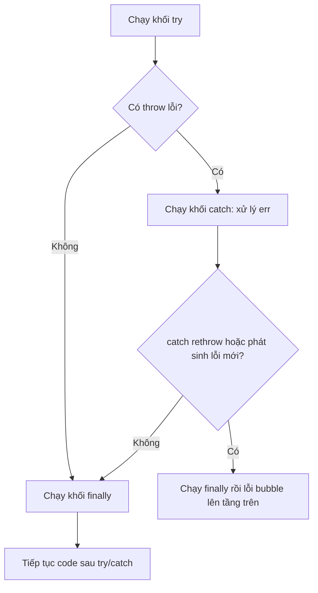

# Exception Handling

**Exception handling** (xử lý ngoại lệ) là cách để chương trình đối phó với lỗi xảy ra lúc chạy mà không bị dừng đột ngột. Một **exception** (ngoại lệ — lỗi bất ngờ xảy ra khi code đang chạy, ví dụ chia cho 0 hay đọc file không tồn tại) sẽ làm chương trình ngừng nếu bạn không xử lý nó. Trong JavaScript, bạn dùng `try/catch/finally` để "bắt" lỗi và phản ứng an toàn, cùng với `throw` để chủ động báo lỗi. Nhờ vậy, ứng dụng của bạn vẫn chạy ổn định ngay cả khi có sự cố.

---

:::note[Ghi nhớ nhanh]

- ⭐ **`try/catch/finally` tách luồng lỗi khỏi luồng chính** — `finally` luôn chạy để dọn dẹp tài nguyên dù thành công, lỗi hay có `return`.
- **Luôn `throw new Error(...)`** (không throw chuỗi/số/object) để giữ được `message` và `stack`.
- ⭐ **Chỉ catch khi biết xử lý** — đừng nuốt lỗi im lặng; không biết thì `throw err` (rethrow) để bubble lên nơi xử lý được.
- **Các class Error sẵn có** (`TypeError`, `ReferenceError`, `SyntaxError`...) và **custom Error** kế thừa `Error` giúp phân loại qua `instanceof`; `Error.cause` gắn lỗi gốc.
- **Async**: Promise chain dùng `.catch()`, async/await dùng `try/catch`; **unhandled rejection** có thể crash app (Node ≥ 15).
- **`Promise.allSettled`** khi cần chờ hết nhiều promise mà không fail-fast như `Promise.all`.

:::

---

## Mục lục

- [Vì sao có try/catch (xử lý ngoại lệ)?](#vì-sao-có-trycatch-xử-lý-ngoại-lệ)
- [throw](#throw)
- [try / catch / finally](#try--catch--finally)
- [Error Objects](#error-objects)
- [Custom Error](#custom-error)
- [Async error handling](#async-error-handling)
- [Câu hỏi phỏng vấn](#câu-hỏi-phỏng-vấn)

---

## Vì sao có try/catch (xử lý ngoại lệ)?

**Vấn đề:** Nếu không có ngoại lệ, mỗi hàm phải **trả về mã lỗi** rồi tầng gọi phải tự kiểm tra từng bước. Code logic bị **trộn lẫn** với code kiểm lỗi, rườm rà và rất dễ quên check — một lỗi bỏ sót sẽ lan âm thầm và làm sập app.

```js
// Mỗi hàm trả về mã lỗi, phải check thủ công từng bước
function loadUser(id) {
  const res = readFile(id);
  if (res.error) return { error: res.error };   // quên check là hỏng

  const parsed = parseJson(res.data);
  if (parsed.error) return { error: parsed.error };

  const user = validate(parsed.data);
  if (user.error) return { error: user.error };

  return { data: user.data };
}

// Tầng gọi lại phải check tiếp...
const result = loadUser(1);
if (result.error) {
  // xử lý lỗi — logic chính chìm trong đống if
}
```

**Giải pháp:** Cơ chế ngoại lệ `throw` + `try/catch/finally` ra đời để **tách riêng luồng lỗi khỏi luồng chính**. Lỗi tự "nổi" lên cho tầng nào biết xử lý thì bắt; `finally` luôn dọn dẹp tài nguyên dù có lỗi hay không. Bạn cũng có thể tạo custom Error class để phân loại lỗi nghiệp vụ.

```js
function loadUser(id) {
  const data = readFile(id);        // lỗi tự throw, không cần check
  const parsed = JSON.parse(data);  // lỗi tự throw
  return validate(parsed);          // throw ValidationError nếu sai
}

// Gom xử lý lỗi MỘT chỗ, luồng chính sạch sẽ
let conn;
try {
  conn = openConnection();
  const user = loadUser(1);
  console.log(user);
} catch (err) {
  console.error("Tải user thất bại:", err.message); // mọi lỗi về đây
} finally {
  conn?.close(); // luôn giải phóng tài nguyên
}
```

:::tip[Dùng thực tế]

- **Bọc lời gọi API / parse JSON**: gói `fetch` + `JSON.parse` trong `try/catch` để mạng chập chờn hay dữ liệu hỏng không làm sập app.
- **Validate và throw lỗi nghiệp vụ**: khi input sai, `throw new ValidationError(...)` để tầng trên bắt và trả lỗi rõ ràng cho người dùng.
- **Đóng kết nối / giải phóng trong `finally`**: đóng DB, file, hủy timer... đảm bảo dọn dẹp dù thành công hay thất bại.
- **Gom xử lý lỗi một chỗ**: dùng error handler ở tầng cao (middleware, top-level) thay vì rải `if (error)` khắp nơi.

:::

---

## throw

Dùng `throw` để **phát sinh lỗi**:

```js
function divide(a, b) {
  if (b === 0) {
    throw new Error("Không chia cho 0");
  }
  return a / b;
}
```

Có thể throw bất kỳ giá trị (không khuyến khích):

```js
throw "lỗi";       // tệ — mất stack trace
throw 42;          // tệ
throw { code: 1 }; // tệ
throw new Error("..."); // tốt — có stack
```

---

## try / catch / finally

```js
try {
  const data = JSON.parse(input);
  console.log(data);
} catch (err) {
  console.error("Parse failed:", err.message);
} finally {
  console.log("Luôn chạy");
}
```

`finally` chạy **dù có lỗi hay không**, kể cả khi `return` trong `try`:

```js
function load() {
  try {
    return fetchData();
  } catch (err) {
    console.error(err);
  } finally {
    closeConnection(); // luôn chạy
  }
}
```

Sơ đồ luồng dưới đây cho thấy `finally` **luôn** chạy dù `try` thành công, `catch` xử lý được, hay lỗi tiếp tục bubble lên:



Optional catch binding (ES2019) — bỏ tham số nếu không dùng:

```js
try {
  // ...
} catch {
  // không cần err
}
```

:::warning[Cần lưu ý]

**Đừng catch để swallow lỗi**:

```js
// Tệ — mất thông tin lỗi
try {
  doSomething();
} catch (err) {
  // im lặng
}

// Tệ — log rồi nuốt
try {
  doSomething();
} catch (err) {
  console.log(err);
}

// Tốt — xử lý hoặc rethrow
try {
  doSomething();
} catch (err) {
  if (err instanceof NetworkError) {
    return retry();
  }
  throw err; // rethrow nếu không biết xử lý
}
```

Quy tắc: **chỉ catch khi bạn biết xử lý**. Còn lại để bubble lên cho
nơi biết cách (top-level error handler, framework, monitoring).

:::

---

## Error Objects

JS có sẵn các class Error:

| Class | Khi nào |
|-------|---------|
| `Error` | Lỗi chung |
| `TypeError` | Kiểu sai (gọi non-function, đọc property của null) |
| `ReferenceError` | Biến không tồn tại |
| `SyntaxError` | Cú pháp sai (parse, JSON, eval) |
| `RangeError` | Giá trị ngoài phạm vi (`new Array(-1)`) |
| `URIError` | `decodeURI` lỗi |
| `AggregateError` | Gộp nhiều lỗi (`Promise.any`) |

```js
try {
  null.foo;
} catch (err) {
  err instanceof TypeError;  // true
  err.name;                  // "TypeError"
  err.message;               // "Cannot read properties of null..."
  err.stack;                 // stack trace
}
```

`Error.cause` (ES2022) — gắn lỗi gốc:

```js
try {
  await fetch(url);
} catch (err) {
  throw new Error("Failed to load user", { cause: err });
}
```

---

## Custom Error

Tạo class kế thừa `Error`:

```js
class ValidationError extends Error {
  constructor(message, field) {
    super(message);
    this.name = "ValidationError";
    this.field = field;
  }
}

try {
  throw new ValidationError("Email không hợp lệ", "email");
} catch (err) {
  if (err instanceof ValidationError) {
    console.log(err.field); // "email"
  }
}
```

:::info[Phân tích]

**Pattern Error hierarchy** là chuẩn của library lớn:

```js
class AppError extends Error {
  constructor(message, options = {}) {
    super(message, { cause: options.cause });
    this.name = this.constructor.name;
    this.statusCode = options.statusCode ?? 500;
    Error.captureStackTrace?.(this, this.constructor);
  }
}

class NotFoundError extends AppError {
  constructor(resource) {
    super(`${resource} not found`, { statusCode: 404 });
  }
}

class ValidationError extends AppError {
  constructor(field, message) {
    super(message, { statusCode: 400 });
    this.field = field;
  }
}
```

Lợi ích:

- Phân loại lỗi qua `instanceof`.
- Trung tâm hoá metadata (statusCode, code, retryable...).
- Stack trace sạch — không có frame của `AppError` constructor (nhờ
  `Error.captureStackTrace`).

Trong API server (Express, Fastify, Nest), middleware bắt error sẽ map
class → HTTP response.

:::

---

## Async error handling

Promise chain — `.catch()`:

```js
fetch(url)
  .then(r => r.json())
  .then(data => process(data))
  .catch(err => console.error(err));
```

Async/await — `try/catch`:

```js
async function load() {
  try {
    const r = await fetch(url);
    const data = await r.json();
    return process(data);
  } catch (err) {
    console.error(err);
    throw err;
  }
}
```

:::warning[Cần lưu ý]

**Unhandled promise rejection** — Promise bị reject mà không có `.catch`
hoặc `try/catch`:

```js
async function load() {
  await fetch("/bad-url"); // throw
}

load(); // không await, không catch → unhandled rejection
```

Trong Node.js ≥ 15, unhandled rejection sẽ **crash app** mặc định.
Browser hiện đại cũng warn trong console.

Bắt tổng:

```js
// Browser
window.addEventListener("unhandledrejection", e => {
  console.error("Unhandled:", e.reason);
});

// Node.js
process.on("unhandledRejection", err => {
  console.error("Unhandled:", err);
});
```

Đây là **safety net**, không phải replacement cho `try/catch` đúng vị trí.

:::

:::tip[Mẹo]

**Promise.allSettled** khi muốn chờ nhiều promise mà không "fail-fast":

```js
const results = await Promise.allSettled([
  fetch(url1),
  fetch(url2),
  fetch(url3),
]);

results.forEach((r, i) => {
  if (r.status === "fulfilled") {
    console.log(i, r.value);
  } else {
    console.error(i, r.reason);
  }
});
```

`Promise.all` reject ngay khi có 1 promise fail → mất kết quả các promise
còn lại. `allSettled` chờ tất cả, không reject.

:::

---

## Câu hỏi phỏng vấn

Những câu thường gặp về chủ đề này. Tự trả lời trước, rồi đối chiếu lại với nội dung phía trên.

1. `try`, `catch`, `finally` chạy theo thứ tự nào? Có thể viết `try` mà không có `catch` không?
2. Vì sao nên `throw new Error(...)` thay vì `throw "lỗi"` hay `throw { code: 1 }`? Bạn mất gì khi throw giá trị nguyên thủy?
3. `finally` có chạy không khi trong `try` đã `return`? Nếu cả `try` lẫn `finally` cùng `return` thì giá trị nào thắng?
4. Đoán output: hàm có `try { return 1 } finally { return 2 }`. Giải thích cơ chế.
5. `optional catch binding` (ES2019) là gì và khi nào nên dùng?
6. Phân biệt `TypeError`, `ReferenceError`, `SyntaxError`, `RangeError`. Cho một đoạn code sinh ra từng loại.
7. Một Error object có những thuộc tính nào? `err.stack` đã được chuẩn hoá trong spec chưa, và điều đó ảnh hưởng gì tới code cross-platform?
8. Vì sao `try/catch` bọc ngoài không bắt được lỗi throw bên trong `setTimeout(() => { throw new Error() })`? Giải thích theo `call stack` và `event loop`.
9. Gọi một hàm `async` mà không `await` bên trong `try/catch` đồng bộ thì lỗi có bị bắt không? Vì sao?
10. So sánh `.catch()` trong promise chain với `try/catch` + `async/await`. `.then(onFulfilled, onRejected)` khác `.then(...).catch(...)` chỗ nào?
11. `unhandled promise rejection` là gì? Node.js từ phiên bản 15 xử lý nó ra sao, và bắt tổng ở browser/Node bằng cách nào?
12. Viết một custom Error class kế thừa `Error` cần lưu ý gì: `super(message)`, `this.name`, `Error.captureStackTrace`, và vì sao `instanceof` có thể hỏng khi transpile xuống ES5?
13. `Error.cause` (ES2022) dùng để làm gì? So với việc nhồi lỗi gốc vào `message` thì hơn ở đâu?
14. So sánh `Promise.all`, `Promise.allSettled`, `Promise.any`, `Promise.race` về hành vi khi có promise fail. `AggregateError` xuất hiện trong trường hợp nào?
15. Vì sao `catch` rồi chỉ `console.log` bị coi là anti-pattern? Khi nào nên rethrow bằng `throw err`?
16. Có nên bọc `try/catch` quanh mọi lời gọi hàm không? Nêu nguyên tắc quyết định "catch ở tầng nào".
17. Trong một API server (Express/Nest), bạn thiết kế xử lý lỗi tập trung thế nào để map error class sang HTTP status mà không rải `if (error)` khắp nơi?
