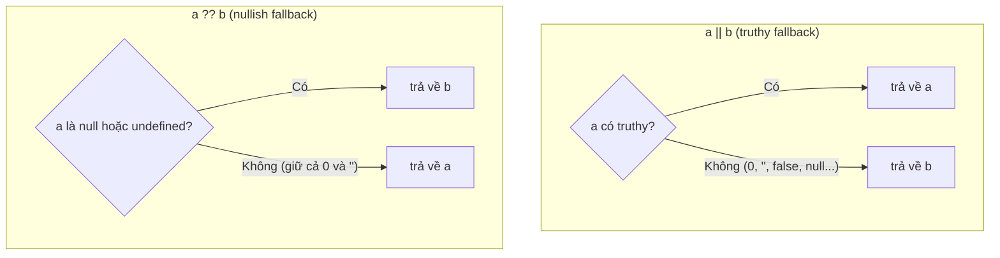

# Operators

**Operators** (toán tử) là các ký hiệu đặc biệt giúp bạn thực hiện thao tác trên dữ liệu, ví dụ cộng hai số (`+`), so sánh hai giá trị (`===`), hay gán giá trị cho biến (`=`). JavaScript có nhiều nhóm toán tử như số học (**arithmetic**), gán (**assignment**), so sánh (**comparison**) và logic (**logical**). Hiểu rõ các toán tử là bước cơ bản để viết được mọi biểu thức và logic trong chương trình.

[](pathname:///img/javascript/operators.webp)

---

:::note[Ghi nhớ nhanh]

- ⭐ **Toán tử hiện đại (ES2015+)** thay code dài dòng: spread `...` để sao chép/gộp, optional chaining `?.` truy cập an toàn, nullish coalescing `??` đặt mặc định.
- ⭐ **`??` giữ đúng `0` và `""`** — khác `||` (nuốt mọi giá trị falsy); logical assignment `??=`, `||=`, `&&=` gán có điều kiện ngắn gọn.
- **Nhóm toán tử cơ bản** — arithmetic (`+ - * / % **`), assignment (`+=`...), comparison (`===` so với `==`), logical (return giá trị chứ không chỉ boolean).
- **Bitwise** thao tác trên 32-bit int (flag/bitmask); cẩn thận overflow với số lớn hơn `2^31 - 1`.
- **Template literal** `` `${}` `` và tagged template — nền tảng của styled-components, GraphQL, SQL tag.
- **Spread/Rest/Destructuring** — chú ý default chỉ apply với `undefined` (không phải `null`); destructure từ `null`/`undefined` gây `TypeError`.

:::

---

## Mục lục

- [Vì sao có các toán tử hiện đại?](#vì-sao-có-các-toán-tử-hiện-đại)
- [Arithmetic](#arithmetic)
- [Assignment](#assignment)
- [Comparison](#comparison)
- [Logical](#logical)
- [Bitwise](#bitwise)
- [String](#string)
- [Conditional & Comma](#conditional--comma)
- [Spread, Rest, Destructuring](#spread-rest-destructuring)
- [Câu hỏi phỏng vấn](#câu-hỏi-phỏng-vấn)

---

## Vì sao có các toán tử hiện đại?

Trước khi có các toán tử ES2015+, nhiều thao tác hằng ngày phải viết rất dài dòng và dễ sai.

**Vấn đề:**

```js
// Sao chép / gộp object phải dùng Object.assign
const p = Object.assign({}, o, { z: 3 });

// Truy cập thuộc tính lồng sâu phải check từng tầng
const city = user && user.address && user.address.city;

// Đặt mặc định bằng || — SAI khi giá trị hợp lệ là 0 hoặc ""
const count = input.count || 10; // count = 0 sẽ bị thay bằng 10!
const name = input.name || "N/A"; // name = "" sẽ bị thay bằng "N/A"!
```

**Giải pháp:**

```js
// Spread ... — sao chép / gộp gọn gàng
const p = { ...o, z: 3 };

// Optional chaining ?. — truy cập an toàn, trả undefined thay vì lỗi
const city = user?.address?.city;

// Nullish coalescing ?? — chỉ thay khi null/undefined, giữ nguyên 0 và ""
const count = input.count ?? 10; // count = 0 vẫn là 0
const name = input.name ?? "N/A"; // name = "" vẫn là ""

// Logical assignment — gán có điều kiện ngắn gọn
config.timeout ??= 5000;
```

:::tip[Dùng thực tế]

- **Cập nhật state bất biến** (React/Redux): `setState({ ...obj, x: newValue })` thay vì sửa trực tiếp object cũ.
- **Đọc dữ liệu API có thể thiếu**: `data?.user?.name` không vỡ khi `data` hoặc `user` chưa có.
- **Đặt mặc định an toàn**: `const count = res.count ?? 0` giữ đúng giá trị `0` từ server.
- **Gộp mảng / object**: `[...listA, ...listB]` hay `{ ...defaults, ...overrides }` thay cho `concat`/`Object.assign`.

:::

---

## Arithmetic

```js
5 + 3;    // 8
5 - 3;    // 2
5 * 3;    // 15
5 / 3;    // 1.666...
5 % 3;    // 2 (remainder)
5 ** 3;   // 125 (power, ES2016)

++x;  // pre-increment (tăng rồi trả)
x++;  // post-increment (trả rồi tăng)
--x;
x--;

-x;       // unary minus
+x;       // unary plus (convert to number)
```

---

## Assignment

```js
let x = 10;
x += 5;   // x = x + 5
x -= 2;
x *= 2;
x /= 4;
x %= 3;
x **= 2;

// Logical assignment (ES2021)
x ||= 100;  // x = x || 100
x ??= 100;  // x = x ?? 100
x &&= 100;  // x = x && 100

// Bitwise assignment
x &= 1;
x |= 1;
x ^= 1;
x <<= 2;
x >>= 2;
x >>>= 2;
```

:::tip[Mẹo]

**Logical assignment** rất hữu ích cho default/cache:

```js
// Lazy initialization
config.timeout ??= 5000;

// Override nếu chưa set
options.headers ??= {};
options.headers["Content-Type"] ??= "application/json";

// Cache pattern
function getUser(id) {
  cache[id] ??= fetchUser(id);
  return cache[id];
}
```

So với cũ:

```js
if (config.timeout === undefined || config.timeout === null) {
  config.timeout = 5000;
}
```

`??=` ngắn hơn nhiều và rõ ý đồ.

:::

---

## Comparison

```js
1 < 2;
1 > 2;
1 <= 1;
1 >= 1;
1 == "1";   // loose (coerce)
1 === "1";  // strict
1 != 2;
1 !== "1";
```

(Đã chi tiết ở phần [Equality Comparisons](../06-equality/1_equality.md).)

---

## Logical

```js
true && false;  // false
true || false;  // true
!true;          // false

x ?? "default"; // null/undefined → "default"
```

Logical operator **return value**, không chỉ boolean:

```js
const name = userInput || "Anonymous";  // truthy fallback
const port = config.port ?? 3000;        // null/undefined fallback
user && user.greet();                     // chỉ gọi nếu truthy
```

Điểm khác nhau cốt lõi giữa `||` và `??` nằm ở **điều kiện rẽ về giá trị fallback**: `||` xét truthy/falsy (nên nuốt cả `0` và `""`), còn `??` chỉ xét `null`/`undefined`:



Optional chaining + nullish coalescing — combo hiện đại:

```js
const city = user?.address?.city ?? "N/A";
```

---

## Bitwise

Thao tác trên **bit** (32-bit integer):

```js
5 & 3;    // 1   (AND)    0101 & 0011 = 0001
5 | 3;    // 7   (OR)     0101 | 0011 = 0111
5 ^ 3;    // 6   (XOR)    0101 ^ 0011 = 0110
~5;       // -6  (NOT)    flip mọi bit
5 << 1;   // 10  (left shift)
5 >> 1;   // 2   (right shift, signed)
5 >>> 1;  // 2   (right shift, unsigned)
```

:::info[Phân tích]

**Tricks** dùng bitwise hay gặp:

```js
// Floor cho số dương (nhanh hơn Math.floor)
~~3.7;       // 3
3.7 | 0;     // 3

// Check chẵn/lẻ
n & 1;       // 1 nếu lẻ, 0 nếu chẵn

// Toggle bit
flag ^= 1;

// Flag combination (bitmask)
const READ = 1, WRITE = 2, ADMIN = 4;
let perm = READ | WRITE;       // 3
perm & READ;                    // truthy
perm |= ADMIN;                  // thêm
perm &= ~WRITE;                 // xoá
```

**Caveat**: bitwise convert sang **32-bit signed int** — không chính
xác với số lớn hơn `2^31 - 1`. Với số lớn dùng `BigInt`:

```js
2 ** 31 | 0;     // -2147483648 (overflow!)
2n ** 31n & 0n;  // 0n
```

Tricks bitwise đẹp nhưng **không nhanh hơn đáng kể** với V8 hiện đại
— dùng vì rõ ý đồ (flag, bitmask), không phải tối ưu.

:::

---

## String

`+` là toán tử concat (cẩn thận coerce):

```js
"Hello, " + name;
"Total: " + 42;       // "Total: 42"
```

Template literal — cách hiện đại:

```js
`Hello, ${name}`
`Total: ${count} items`
`Sum: ${a + b}`
```

Tagged template — function gắn vào template:

```js
function html(strings, ...values) {
  return strings.reduce((acc, str, i) => {
    return acc + str + (values[i] ? escape(values[i]) : "");
  }, "");
}

const safe = html`<div>${userInput}</div>`;
```

:::tip[Mẹo]

Tagged template là cơ chế đằng sau **styled-components**, **GraphQL
query**, **SQL template tag**:

```js
const Button = styled.button`
  color: ${props => props.primary ? "white" : "black"};
`;

const query = gql`
  query GetUser($id: ID!) {
    user(id: $id) { name }
  }
`;

const result = await sql`
  SELECT * FROM users WHERE id = ${userId}
`;
// sql tag tự parameterize → tránh SQL injection
```

:::

---

## Conditional & Comma

**Ternary** — đã xem ở phần Control Flow:

```js
const x = cond ? a : b;
```

**Comma** — đánh giá nhiều expression, trả về cái cuối:

```js
const x = (a++, b++, a + b);
// tăng a, tăng b, x = a + b
```

Hiếm dùng — thường thấy trong `for`:

```js
for (let i = 0, j = 10; i < j; i++, j--) { /* ... */ }
```

---

## Spread, Rest, Destructuring

**Spread** — trải mảng/object:

```js
const a = [1, 2, 3];
const b = [...a, 4, 5];           // [1, 2, 3, 4, 5]

const o = { x: 1, y: 2 };
const p = { ...o, z: 3 };          // { x: 1, y: 2, z: 3 }

Math.max(...a);                     // truyền vào hàm

const cloned = [...a];              // shallow copy
const merged = { ...o1, ...o2 };
```

**Rest** — gom phần còn lại:

```js
function sum(...nums) {
  return nums.reduce((a, b) => a + b, 0);
}

const [first, ...rest] = [1, 2, 3, 4];
// first = 1, rest = [2, 3, 4]

const { a, ...others } = { a: 1, b: 2, c: 3 };
// a = 1, others = { b: 2, c: 3 }
```

**Destructuring** — gán từ array/object:

```js
const [a, b, c] = [1, 2, 3];
const { name, age } = user;

// Rename + default
const { name: userName = "Anonymous", age = 0 } = user;

// Nested
const { address: { city } } = user;

// Swap variables
[a, b] = [b, a];
```

:::warning[Cần lưu ý]

Destructuring với property **không tồn tại** trả về `undefined`. Để có
default thực sự (nhận `undefined` mới apply):

```js
const { x = 10 } = { x: undefined };  // x = 10 (apply default)
const { x = 10 } = { x: null };        // x = null (KHÔNG apply)
```

`null` **không** trigger default — chỉ `undefined`. Đây là pitfall hay
gặp khi parse API trả về `null` cho field "không có giá trị".

Cẩn thận khi destructure từ `null`/`undefined`:

```js
const { x } = null; // TypeError
const { x } = undefined; // TypeError

const { x } = obj ?? {};   // safe
const { x = 0 } = obj ?? {}; // safe + default
```

:::

---

## Câu hỏi phỏng vấn

Những câu thường gặp về chủ đề này. Tự trả lời trước, rồi bấm **Xem đáp án** để đối chiếu.

**1. Phân biệt `++x` và `x++`. Đoán output: `let x = 1; console.log(x++ + ++x);`**

<details className="qa">
<summary>Xem đáp án</summary>

Cả hai đều tăng biến lên 1, khác nhau ở **giá trị trả về của biểu thức**:

- `++x` (pre-increment): **tăng trước, trả về giá trị mới**.
- `x++` (post-increment): **trả về giá trị cũ, rồi mới tăng**.

Output là **`4`**:

```js
let x = 1;
console.log(x++ + ++x);
// x++  → trả về 1, x thành 2
// ++x  → x thành 3, trả về 3
// 1 + 3 = 4
```

Giải thích: JS đánh giá biểu thức từ trái sang phải. Vế trái `x++` lấy giá trị hiện tại `1` làm kết quả rồi âm thầm nâng `x` lên `2`. Vế phải `++x` nâng `x` lên `3` trước rồi trả `3`. Tổng là `4`, và `x` cuối cùng bằng `3`.

Thực tế nên tránh viết kiểu này: khi một biến vừa được đọc vừa bị thay đổi nhiều lần trong cùng một biểu thức, code trở nên khó đọc và dễ sai. Dùng `x += 1` hoặc tách thành nhiều dòng rõ ràng hơn.

</details>

**2. `%` trong JavaScript là phép chia lấy dư hay modulo? Đoán kết quả `-5 % 3` và giải thích.**

<details className="qa">
<summary>Xem đáp án</summary>

`%` trong JS là **remainder** (chia lấy dư), **không phải modulo** đúng nghĩa toán học. Khác biệt nằm ở **dấu của kết quả**: remainder mang dấu của **số bị chia** (dividend), còn modulo mang dấu của **số chia** (divisor).

`-5 % 3` cho ra **`-2`**:

```js
-5 % 3;   // -2  (JS: dấu theo -5)
5 % -3;   //  2  (dấu theo 5)
// Công thức: a - (b * trunc(a / b)) = -5 - (3 * -1) = -2
```

Nhiều ngôn ngữ khác (Python, Ruby) cho `-5 % 3 === 1` vì dùng modulo thật.

Hệ quả thực tế: dùng `%` để "quay vòng" chỉ số mảng sẽ vỡ với số âm. Muốn modulo dương luôn, viết:

```js
const mod = (a, b) => ((a % b) + b) % b;
mod(-5, 3);  // 2
```

Mẹo kiểm tra chẵn/lẻ cũng cần cẩn thận: `n % 2 === 1` sai với số âm lẻ (`-3 % 2` là `-1`), nên dùng `n % 2 !== 0`.

</details>

**3. `**` khác `Math.pow` ở điểm nào? Vì sao `-2 ** 2` ném `SyntaxError`?**

<details className="qa">
<summary>Xem đáp án</summary>

`**` (ES2016) về mặt kết quả số học giống `Math.pow`, nhưng khác ở:

- **Cú pháp**: `a ** b` gọn hơn `Math.pow(a, b)`, và nối chuỗi được: `2 ** 3 ** 2`.
- **Kết hợp phải (right-associative)**: `2 ** 3 ** 2` là `2 ** (3 ** 2)` = `512`, không phải `(2 ** 3) ** 2` = `64`. Đa số toán tử khác kết hợp trái.
- **Hỗ trợ `BigInt`**: `2n ** 10n` chạy được, còn `Math.pow(2n, 10n)` ném `TypeError`.
- Có dạng gán `**=`.

**Vì sao `-2 ** 2` là `SyntaxError`?** Vì cú pháp này **mơ hồ**: người đọc không biết ý là `(-2) ** 2` (= `4`) hay `-(2 ** 2)` (= `-4`). Spec cố tình **cấm** đặt toán tử một ngôi (`-`, `+`, `!`, `typeof`...) ngay trước cơ số mà không có ngoặc, buộc lập trình viên viết rõ ý:

```js
-2 ** 2;      // SyntaxError
(-2) ** 2;    // 4
-(2 ** 2);    // -4
```

Lưu ý `Math.pow(-2, 2)` thì chạy bình thường và trả `4`.

</details>

**4. Toán tử `+` làm gì khi một vế là string? Đoán output: `1 + "2"`, `1 + 2 + "3"`, `"3" + 2 + 1`, `[] + {}`.**

<details className="qa">
<summary>Xem đáp án</summary>

`+` là toán tử duy nhất mang hai vai: **cộng số** và **nối chuỗi**. Quy tắc: engine chuyển hai toán hạng về primitive (`ToPrimitive`); nếu **bất kỳ vế nào là string**, cả hai được ép sang string và thực hiện **nối chuỗi**; ngược lại ép sang number và cộng.

```js
1 + "2";        // "12"   — có string → nối
1 + 2 + "3";    // "33"   — trái sang phải: (1+2)=3 rồi 3+"3" → "33"
"3" + 2 + 1;    // "321"  — "3"+2 = "32", rồi "32"+1 = "321"
[] + {};        // "[object Object]"
```

Điểm mấu chốt ở hai ví dụ giữa: `+` **kết hợp trái**, nên thứ tự quyết định kết quả — chuỗi xuất hiện sớm sẽ "nhuộm" mọi phép sau thành nối chuỗi.

Với `[] + {}`: `ToPrimitive([])` cho chuỗi rỗng `""` (vì `[].join(",")` là `""`), `ToPrimitive({})` cho `"[object Object]"`. Nối lại được `"[object Object]"`.

Bài học: khi chắc chắn muốn cộng số, hãy ép kiểu tường minh bằng `Number(x)` hoặc unary `+x`; khi muốn ghép chuỗi, dùng template literal cho rõ ràng.

</details>

**5. So sánh `==` và `===`. Kết quả của `null == undefined`, `null === undefined`, `NaN == NaN` là gì?**

<details className="qa">
<summary>Xem đáp án</summary>

| | `==` (loose) | `===` (strict) |
|---|---|---|
| Kiểu khác nhau | **Ép kiểu** rồi mới so sánh | Trả `false` ngay |
| Độ dự đoán | Thấp, nhiều luật ngầm | Cao, dễ đọc |
| Khuyến nghị | Tránh | Mặc định dùng |

Kết quả ba biểu thức:

```js
null == undefined;    // true  — spec quy định riêng, chúng "bằng" nhau ở loose
null === undefined;   // false — khác kiểu (Null vs Undefined)
NaN == NaN;           // false — NaN không bằng chính nó, kể cả với ===
```

Về `null == undefined`: đây là một luật **đặc biệt** trong thuật toán abstract equality — `null` và `undefined` chỉ loose-equal với nhau và với chính mình, chứ không bằng `0`, `""` hay `false`.

Về `NaN`: theo chuẩn IEEE 754, `NaN` không bằng bất kỳ giá trị nào kể cả bản thân. Muốn kiểm tra, dùng `Number.isNaN(x)` hoặc `Object.is(x, NaN)`.

Quy ước thực hành: luôn dùng `===`, ngoại lệ duy nhất đáng chấp nhận là `x == null` — cách viết gọn để kiểm tra "`null` hoặc `undefined`".

</details>

**6. `&&`, `||`, `??` trả về boolean hay trả về toán hạng? Đoán output `0 || 100` so với `0 ?? 100`.**

<details className="qa">
<summary>Xem đáp án</summary>

Cả ba đều **trả về một trong hai toán hạng**, không phải boolean (chỉ `!` mới luôn trả boolean). Chúng cũng **short-circuit** — không đánh giá vế phải nếu vế trái đã quyết định được kết quả.

- `a && b` → trả `a` nếu `a` falsy, ngược lại trả `b`.
- `a || b` → trả `a` nếu `a` truthy, ngược lại trả `b`.
- `a ?? b` → trả `b` **chỉ khi** `a` là `null` hoặc `undefined`.

```js
0 || 100;    // 100  — 0 là falsy nên rơi về vế phải
0 ?? 100;    // 0    — 0 không phải null/undefined nên giữ nguyên
"" || "N/A"; // "N/A"
"" ?? "N/A"; // ""
```

Đây chính là lý do `??` ra đời: khi đặt giá trị mặc định, `||` **nuốt oan** những giá trị falsy hợp lệ như `0`, `""`, `false`. Ví dụ `const count = res.count || 10` sẽ biến `0` thành `10` — một bug rất hay gặp khi đọc dữ liệu API.

Quy tắc: đặt default thì dùng `??`; chỉ dùng `||` khi bạn thực sự muốn mọi giá trị falsy đều bị thay thế.

</details>

**7. Logical assignment `||=`, `&&=`, `??=` khác gì `x = x || y`? Vì sao khác biệt này quan trọng khi target có setter hoặc là property của Proxy?**

<details className="qa">
<summary>Xem đáp án</summary>

Khác biệt cốt lõi: logical assignment **short-circuit cả phép gán**. `x ??= y` chỉ thực sự **ghi** vào `x` khi `x` là `null`/`undefined`; nếu không, **không có thao tác gán nào xảy ra**. Còn `x = x ?? y` **luôn luôn gán**, kể cả khi gán lại đúng giá trị cũ.

```js
obj.count ??= 0;              // không ghi nếu count đã có giá trị
obj.count = obj.count ?? 0;   // LUÔN ghi, dù giá trị không đổi
```

Vì sao quan trọng:

- **Setter**: nếu property có `set` (hoặc là property của `class` với accessor), bản `x = x ?? y` sẽ **kích hoạt setter mỗi lần** — kéo theo mọi side effect trong đó (validate, log, cập nhật DOM, dispatch event).
- **Proxy**: trap `set` bị gọi không cần thiết, có thể sinh log rác, gọi API, hoặc kích hoạt reactivity.
- **Framework reactive** (Vue, MobX, signals): mỗi lần ghi property được theo dõi sẽ **đánh dấu dirty và trigger re-render**, dù giá trị y hệt cũ — lãng phí hiệu năng.

Vì vậy với object có accessor hoặc đang được theo dõi, hãy ưu tiên `??=`, `||=`, `&&=`.

</details>

**8. `?.` trả về gì khi mắt xích giữa là `null`? Nó có bắt được lỗi khi property tồn tại nhưng không phải hàm không?**

<details className="qa">
<summary>Xem đáp án</summary>

Khi mắt xích đứng ngay trước `?.` là `null` hoặc `undefined`, biểu thức **short-circuit toàn bộ phần còn lại của chuỗi** và trả về **`undefined`** (không phải `null`, dù giá trị gốc là `null`):

```js
const user = { address: null };
user?.address?.city;        // undefined — dừng ngay, không ném TypeError
user?.address?.city?.();    // undefined — cả lời gọi cũng bị bỏ qua
```

**Không bắt được lỗi "không phải hàm".** `?.` chỉ kiểm tra đúng một điều: giá trị có phải `null`/`undefined` hay không. Nếu property tồn tại nhưng là kiểu khác, lỗi vẫn nổ:

```js
const o = { fn: 42 };
o.fn?.();      // TypeError: o.fn is not a function
o.list?.map(f) // nếu list là string → TypeError vì string không có .map
```

Hai lưu ý nữa:

- `?.` **không** cứu được `ReferenceError`: `notDeclared?.x` vẫn ném lỗi nếu biến chưa hề khai báo.
- Đừng lạm dụng — rải `?.` khắp nơi sẽ **che giấu bug** về cấu trúc dữ liệu. Chỉ dùng ở chỗ giá trị *thực sự* có thể vắng mặt, thường ghép với `??`: `user?.address?.city ?? "N/A"`.

</details>

**9. Vì sao `a ?? b || c` là lỗi cú pháp? Trình bày về `precedence` và `associativity` của toán tử.**

<details className="qa">
<summary>Xem đáp án</summary>

`??` **cố tình bị cấm** đứng chung với `&&` hoặc `||` mà không có ngoặc. Lý do: `??` và `||` có độ ưu tiên gần nhau nhưng **ngữ nghĩa khác hẳn** (nullish và truthy), người đọc rất dễ hiểu sai thứ tự. Spec chọn giải pháp an toàn là bắt lỗi ngay lúc parse, buộc viết ngoặc tường minh:

```js
a ?? b || c;      // SyntaxError
(a ?? b) || c;    // OK
a ?? (b || c);    // OK — ý nghĩa khác hẳn dòng trên
```

**Precedence (độ ưu tiên)** quyết định toán tử nào được gom trước khi các toán tử *khác nhau* đứng cạnh nhau. Ví dụ `*` ưu tiên cao hơn `+` nên `1 + 2 * 3` là `1 + (2 * 3)` = `7`.

**Associativity (tính kết hợp)** quyết định thứ tự gom khi các toán tử **cùng độ ưu tiên**:

- Đa số kết hợp **trái**: `10 - 3 - 2` là `(10 - 3) - 2` = `5`.
- Một số kết hợp **phải**: gán `a = b = c` là `a = (b = c)`, và lũy thừa `2 ** 3 ** 2` là `2 ** (3 ** 2)` = `512`.

Lời khuyên thực hành: khi biểu thức trộn nhiều nhóm toán tử, **thêm ngoặc** cho rõ ý thay vì bắt người đọc thuộc bảng ưu tiên.

</details>

**10. Bitwise operator ép toán hạng về kiểu gì trước khi tính? Vì sao `2 ** 31 | 0` cho ra số âm?**

<details className="qa">
<summary>Xem đáp án</summary>

Số trong JS là **double 64-bit (IEEE 754)**, nhưng bitwise operator không làm việc trực tiếp trên đó. Trước khi tính, engine ép toán hạng qua **`ToInt32`** — cắt phần thập phân, rồi lấy **32 bit thấp** và diễn giải theo **số nguyên có dấu** (bù 2). Riêng `>>>` dùng `ToUint32` (không dấu). Kết quả trả về cũng là số trong dải 32-bit.

Vì vậy dải hợp lệ chỉ từ `-2147483648` đến `2147483647` (`2^31 - 1`).

```js
2 ** 31;       // 2147483648 — vượt max của int32 có dấu
2 ** 31 | 0;   // -2147483648
```

Giải thích: `2^31` ở dạng nhị phân 32-bit là `1000...0000`. Bit cao nhất chính là **bit dấu**, nên khi diễn giải theo số có dấu, giá trị này thành `-2147483648` — hiện tượng **overflow/wrap-around**.

Hệ quả cần nhớ: đừng dùng bitwise cho số lớn hơn `2^31 - 1`, cho ID, timestamp mili giây, hay số tiền lớn. Khi cần thao tác bit trên số lớn, dùng `BigInt` (`2n ** 31n`), vốn không bị giới hạn 32 bit.

</details>

**11. `>>` khác `>>>` ở đâu? Cho ví dụ với số âm để thấy rõ khác biệt.**

<details className="qa">
<summary>Xem đáp án</summary>

Cả hai đều dịch bit sang phải, khác nhau ở **bit được điền vào bên trái**:

- **`>>` (sign-propagating / arithmetic shift)**: điền vào bằng **bit dấu** — số âm vẫn âm. Tương đương chia cho `2^n` rồi làm tròn xuống.
- **`>>>` (zero-fill / logical shift)**: luôn điền **`0`**, coi toán hạng là số **không dấu 32-bit**. Kết quả **luôn không âm**.

```js
8 >> 1;     // 4
8 >>> 1;    // 4            — với số dương, hai cái giống nhau

-8 >> 1;    // -4           — giữ dấu âm
-8 >>> 1;   // 2147483644   — coi -8 là 4294967288 (unsigned) rồi chia 2

-1 >>> 0;   // 4294967295   — mẹo chuyển sang uint32
```

Nguyên nhân: `-8` ở dạng bù 2 32-bit là `1111...1000`. `>>` giữ bit `1` ở đầu nên vẫn ra số âm; `>>>` nhét `0` vào đầu, biến nó thành một số dương rất lớn.

Lưu ý: `>>>` là toán tử **duy nhất** trong nhóm bitwise dùng `ToUint32`. Nó cũng không tồn tại cho `BigInt` (vì `BigInt` không có khái niệm độ rộng cố định).

</details>

**12. `~~x` làm gì và khác `Math.floor(x)` trong trường hợp nào (số âm, số rất lớn)?**

<details className="qa">
<summary>Xem đáp án</summary>

`~~x` là hai lần NOT bit. Vì `~~` buộc `x` đi qua `ToInt32`, hiệu ứng thực tế là **cắt bỏ phần thập phân** — tức giống `Math.trunc`, **không** giống `Math.floor`.

Khác biệt lộ ra ở hai trường hợp:

```js
// 1) Số âm — trunc cắt về phía 0, floor làm tròn xuống
~~(-3.7);            // -3
Math.floor(-3.7);    // -4

// 2) Số lớn hơn 2^31 - 1 — ~~ overflow 32-bit
~~3000000000;        // -1294967296  (sai)
Math.floor(3e9);     // 3000000000   (đúng)

~~NaN;               // 0   (floor cho NaN)
```

Tóm lại `~~x` chỉ an toàn khi `x` là **số dương, nằm trong dải 32-bit** và bạn muốn cắt thập phân.

Về hiệu năng: mẹo này từng được xem là "nhanh hơn `Math.floor`", nhưng với V8 hiện đại chênh lệch gần như không đáng kể. Nên ưu tiên `Math.trunc(x)` hoặc `Math.floor(x)` vì rõ ý đồ và không có bẫy overflow. Dùng bitwise khi thao tác thực sự mang ý nghĩa bit (flag, bitmask), không phải để tối ưu.

</details>

**13. Template literal khác nối chuỗi bằng `+` ở những điểm nào? Một `tagged template` nhận vào tham số gì và trả về gì?**

<details className="qa">
<summary>Xem đáp án</summary>

Template literal dùng dấu backtick, hơn `+` ở:

- **Nội suy biểu thức** trực tiếp: `` `Sum: ${a + b}` `` thay vì `"Sum: " + (a + b)`.
- **Xuống dòng thật** được giữ nguyên, không cần `\n` hay nối nhiều dòng.
- **Dễ đọc** hơn hẳn khi trộn nhiều biến, và nháy đơn/kép bên trong không cần escape.
- Hỗ trợ **tagged template**.

Điểm giống: cả hai đều ép giá trị về string (qua `String()`), nên `null`, `undefined`, object đều bị chuyển đổi như nhau.

**Tagged template** là đặt tên một hàm ngay trước backtick. Hàm đó nhận:

- Tham số **thứ nhất**: mảng các **đoạn chuỗi tĩnh** (còn có `strings.raw` chứa bản chưa xử lý escape).
- Các tham số **còn lại (rest)**: lần lượt là **giá trị của từng `${...}`**.

```js
function html(strings, ...values) {
  return strings.reduce((acc, s, i) =>
    acc + s + (values[i] != null ? escape(values[i]) : ""), "");
}
html`<div>${userInput}</div>`;   // userInput đã được escape
```

Hàm tag **trả về bất cứ thứ gì** — không nhất thiết là chuỗi. Đây là cơ chế đằng sau `styled-components`, `gql`, và các thư viện `sql` tự parameterize để chống SQL injection.

</details>

**14. Spread `...` sao chép nông hay sâu? Điều gì xảy ra khi bạn sửa một object lồng bên trong bản copy tạo bởi `{ ...obj }`?**

<details className="qa">
<summary>Xem đáp án</summary>

Spread chỉ tạo **shallow copy** (sao chép nông): nó copy các giá trị của **property ở tầng một**. Với primitive thì đó là bản sao thật; với object/array lồng bên trong, cái được copy chỉ là **tham chiếu** — bản gốc và bản copy **dùng chung** object con đó.

```js
const orig = { name: "A", address: { city: "HN" } };
const copy = { ...orig };

copy.name = "B";              // chỉ ảnh hưởng copy
copy.address.city = "HCM";    // sửa chung object!
orig.address.city;            // "HCM" — bản gốc bị thay đổi
```

Đây là nguồn bug kinh điển khi cập nhật state bất biến trong React/Redux: tưởng đã tạo object mới nhưng thực ra vẫn mutate dữ liệu cũ, khiến so sánh tham chiếu không phát hiện thay đổi hoặc gây side effect ngoài ý muốn.

Cách xử lý:

- Spread **từng tầng** cần sửa: `{ ...orig, address: { ...orig.address, city: "HCM" } }`.
- Deep clone khi cần: `structuredClone(orig)` (hỗ trợ `Date`, `Map`, `Set`, vòng lặp tham chiếu) — an toàn hơn nhiều so với mẹo `JSON.parse(JSON.stringify(...))` vốn làm mất `Date`, `undefined`, hàm.
- Hoặc dùng thư viện bất biến như Immer.

</details>

**15. Cùng ký hiệu `...` nhưng `spread` và `rest` khác nhau ra sao? Nhận biết bằng vị trí xuất hiện thế nào?**

<details className="qa">
<summary>Xem đáp án</summary>

Hai cái **ngược chiều nhau**: spread **trải ra**, rest **gom lại**.

| | Spread | Rest |
|---|---|---|
| Tác dụng | Bung một iterable/object thành các phần tử rời | Gom nhiều phần tử rời thành một mảng/object |
| Vị trí | Nơi **đọc** giá trị: trong array/object literal, trong đối số lời gọi hàm | Nơi **nhận** giá trị: danh sách tham số hàm, vế trái của destructuring |
| Số lượng | Xuất hiện bao nhiêu lần cũng được, ở vị trí bất kỳ | Chỉ **một** và phải **đứng cuối** |

```js
// Spread — vế phải
const b = [...a, 4];
Math.max(...nums);
const merged = { ...o1, ...o2 };

// Rest — vế trái / tham số
function sum(...nums) { }
const [first, ...others] = [1, 2, 3];
const { a, ...restProps } = props;
```

Mẹo nhận biết nhanh: nhìn xem `...` nằm ở **phía nhận** hay **phía cho**. Nếu nó đứng trong danh sách tham số hàm hoặc bên trái dấu `=` của một phép destructuring thì là **rest**; còn lại là **spread**.

Lưu ý: `function f(...args) {}` là rest, nhưng `f(...args)` khi **gọi** hàm lại là spread — cùng ký hiệu, khác ngữ cảnh.

</details>

**16. Với `{ ...o1, ...o2 }`, khi trùng key thì giá trị nào thắng? Spread có sao chép được getter/setter và prototype không?**

<details className="qa">
<summary>Xem đáp án</summary>

Khi trùng key, **cái viết sau thắng** — spread gán tuần tự từ trái sang phải nên `o2` ghi đè `o1`:

```js
const defaults = { theme: "light", size: 10 };
const user = { theme: "dark" };
const cfg = { ...defaults, ...user };   // { theme: "dark", size: 10 }
```

Đây chính là pattern `{ ...defaults, ...overrides }` rất phổ biến để gộp cấu hình.

**Getter/setter:** spread **không** sao chép được chúng. Nó thực hiện `[[Get]]` trên nguồn — tức **gọi getter và lấy giá trị trả về tại thời điểm đó**, rồi định nghĩa một data property thường trên object mới. Setter thì bị **bỏ luôn**. Muốn giữ nguyên accessor phải dùng:

```js
Object.create(
  Object.getPrototypeOf(o),
  Object.getOwnPropertyDescriptors(o)
);
```

**Prototype:** cũng **không** được sao chép. Kết quả của `{ ...obj }` luôn là một object thuần với prototype là `Object.prototype`. Vì vậy spread một instance của class sẽ **mất hết method** (vì method nằm trên prototype) và mất cả kiểu — `copy instanceof MyClass` trả `false`.

Ngoài ra spread chỉ lấy **own enumerable properties**, bỏ qua property kế thừa và non-enumerable.

</details>

**17. Đoán output: `const { x = 10 } = { x: null }` và `const { x = 10 } = { x: undefined }`. Vì sao hai kết quả khác nhau?**

<details className="qa">
<summary>Xem đáp án</summary>

```js
const { x = 10 } = { x: null };        // x = null   — KHÔNG apply default
const { x = 10 } = { x: undefined };   // x = 10     — apply default
const { x = 10 } = {};                 // x = 10     — thiếu key cũng là undefined
```

Lý do: giá trị mặc định trong destructuring (và cả **default parameter** của hàm) chỉ được kích hoạt khi giá trị **đúng bằng `undefined`**. `null` là một giá trị hợp lệ, có ý nghĩa riêng ("cố tình rỗng"), nên JS tôn trọng nó và không thay thế.

Đây là pitfall rất hay gặp khi làm việc với API: nhiều backend (đặc biệt là SQL) trả `null` cho field "không có giá trị", và lập trình viên tưởng default sẽ đỡ được:

```js
const { avatar = "/default.png" } = { avatar: null };
avatar;   // null → thẻ  vỡ
```

Cách xử lý: dùng `??` sau khi destructure, vì `??` xử lý **cả `null` lẫn `undefined`**:

```js
const avatar = data.avatar ?? "/default.png";   // "/default.png"
```

Nguyên tắc chung: default parameter/destructuring chỉ bắt `undefined`; muốn bắt luôn `null` thì phải dùng `??`.

</details>

**18. Vì sao `const { x } = null` ném `TypeError`? Viết lại cho an toàn.**

<details className="qa">
<summary>Xem đáp án</summary>

Destructuring object thực chất là một phép **truy cập property**, và để làm được điều đó engine phải chuyển giá trị nguồn sang object bằng `ToObject`. `null` và `undefined` là hai giá trị **duy nhất không chuyển được** sang object, nên thao tác ném lỗi ngay:

```js
const { x } = null;        // TypeError: Cannot destructure property 'x' of 'null'
const { x } = undefined;   // TypeError
const { x } = 0;           // OK — 0 được bọc thành Number object, x = undefined
const { length } = "abc";  // OK — length = 3
```

Nghĩa là số, chuỗi, boolean đều destructure được (chỉ ra `undefined` với key không có), riêng `null`/`undefined` thì nổ.

Viết lại an toàn bằng cách chèn một object rỗng làm phao:

```js
const { x } = obj ?? {};            // an toàn, x có thể là undefined
const { x = 0 } = obj ?? {};        // an toàn + có default
function f({ x } = {}) { }          // default parameter cho trường hợp gọi f()
```

Lưu ý dùng `?? {}` chứ đừng dùng `|| {}` nếu nguồn có thể là giá trị falsy hợp lệ. Với dữ liệu lồng sâu, kết hợp optional chaining: `const city = user?.address?.city ?? "N/A"`.

</details>

**19. Toán tử `,` (comma) đánh giá thế nào và thường gặp ở đâu trong code thực tế?**

<details className="qa">
<summary>Xem đáp án</summary>

Toán tử `,` đánh giá các biểu thức **lần lượt từ trái sang phải**, bỏ qua mọi kết quả trung gian và **trả về giá trị của biểu thức cuối cùng**. Nó có **độ ưu tiên thấp nhất** trong JS, nên hầu như luôn cần ngoặc.

```js
const x = (a++, b++, a + b);   // tăng a, tăng b, x nhận a + b
```

Nơi thường gặp:

- **Vòng lặp `for`** — chỗ dùng chính đáng và phổ biến nhất, khi cần quản lý nhiều biến đếm:

```js
for (let i = 0, j = 10; i < j; i++, j--) { /* ... */ }
```

- **Code đã minify**: bundler gộp nhiều câu lệnh thành một biểu thức để tiết kiệm dấu `;` và ngoặc nhọn.
- **Arrow function một dòng** cần chạy side effect rồi trả giá trị: `x => (log(x), x * 2)`.

Cần phân biệt: dấu phẩy trong **danh sách tham số**, **array literal**, **object literal** hay `let a = 1, b = 2` **không phải** toán tử comma — chúng chỉ là dấu phân cách cú pháp.

Thực hành: ngoài `for`, nên tránh vì làm code khó đọc; tách thành nhiều câu lệnh riêng rõ ràng hơn.

</details>

**20. `typeof`, `instanceof`, `in`, `delete`, `void` — mỗi toán tử làm gì? `typeof null` trả về gì và vì sao lại như vậy?**

<details className="qa">
<summary>Xem đáp án</summary>

| Toán tử | Công dụng | Ví dụ |
|---|---|---|
| `typeof` | Trả về **chuỗi** mô tả kiểu của giá trị | `typeof 1` → `"number"` |
| `instanceof` | Kiểm tra `prototype` của constructor có nằm trên **prototype chain** của object không | `[] instanceof Array` → `true` |
| `in` | Property có tồn tại trên object **hoặc prototype chain** không | `"x" in {x: 1}` → `true` |
| `delete` | **Xoá** một property khỏi object, trả về boolean | `delete o.x` |
| `void` | Đánh giá biểu thức rồi luôn trả về `undefined` | `void 0` → `undefined` |

**`typeof null` trả về `"object"`** — đây là một **bug lịch sử** không sửa được. Ở phiên bản JS đầu tiên (1995), giá trị được lưu dưới dạng một tag kiểu vài bit kèm dữ liệu; tag `000` nghĩa là "object", còn `null` được biểu diễn bằng con trỏ NULL (toàn bit 0) — nên đọc ra tag cũng là `000` và bị xếp vào "object". Đề xuất sửa từng bị từ chối vì sẽ phá vỡ vô số website đang chạy.

Cách kiểm tra `null` đúng: `x === null`, hoặc `x == null` để bắt cả `undefined`.

Vài lưu ý khác: `delete` chỉ xoá own property, không xoá được biến khai báo bằng `var`/`let`/`const`; `in` khác `hasOwnProperty` ở chỗ nó tìm cả trên prototype chain.

</details>
