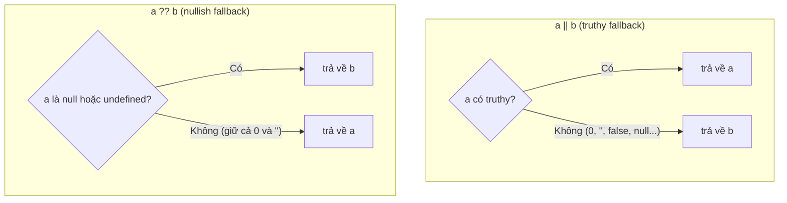

# Operators

**Operators** (toán tử) là các ký hiệu đặc biệt giúp bạn thực hiện thao tác trên dữ liệu, ví dụ cộng hai số (`+`), so sánh hai giá trị (`===`), hay gán giá trị cho biến (`=`). JavaScript có nhiều nhóm toán tử như số học (**arithmetic**), gán (**assignment**), so sánh (**comparison**) và logic (**logical**). Hiểu rõ các toán tử là bước cơ bản để viết được mọi biểu thức và logic trong chương trình.

---

## Mục lục

- [Vì sao có các toán tử hiện đại?](#vì-sao-có-các-toán-tử-hiện-đại)
- [Arithmetic](#arithmetic)
- [Assignment](#assignment)
- [Comparison](#comparison)
- [Logical](#logical)
- [Bitwise](#bitwise)
- [String](#string)
- [Conditional & Comma](#conditional--comma)
- [Spread, Rest, Destructuring](#spread-rest-destructuring)

---

## Vì sao có các toán tử hiện đại?

Trước khi có các toán tử ES2015+, nhiều thao tác hằng ngày phải viết rất dài dòng và dễ sai.

**Vấn đề:**

```js
// Sao chép / gộp object phải dùng Object.assign
const p = Object.assign({}, o, { z: 3 });

// Truy cập thuộc tính lồng sâu phải check từng tầng
const city = user && user.address && user.address.city;

// Đặt mặc định bằng || — SAI khi giá trị hợp lệ là 0 hoặc ""
const count = input.count || 10; // count = 0 sẽ bị thay bằng 10!
const name = input.name || "N/A"; // name = "" sẽ bị thay bằng "N/A"!
```

**Giải pháp:**

```js
// Spread ... — sao chép / gộp gọn gàng
const p = { ...o, z: 3 };

// Optional chaining ?. — truy cập an toàn, trả undefined thay vì lỗi
const city = user?.address?.city;

// Nullish coalescing ?? — chỉ thay khi null/undefined, giữ nguyên 0 và ""
const count = input.count ?? 10; // count = 0 vẫn là 0
const name = input.name ?? "N/A"; // name = "" vẫn là ""

// Logical assignment — gán có điều kiện ngắn gọn
config.timeout ??= 5000;
```

:::tip[Dùng thực tế]

- **Cập nhật state bất biến** (React/Redux): `setState({ ...obj, x: newValue })` thay vì sửa trực tiếp object cũ.
- **Đọc dữ liệu API có thể thiếu**: `data?.user?.name` không vỡ khi `data` hoặc `user` chưa có.
- **Đặt mặc định an toàn**: `const count = res.count ?? 0` giữ đúng giá trị `0` từ server.
- **Gộp mảng / object**: `[...listA, ...listB]` hay `{ ...defaults, ...overrides }` thay cho `concat`/`Object.assign`.

:::

---

## Arithmetic

```js
5 + 3;    // 8
5 - 3;    // 2
5 * 3;    // 15
5 / 3;    // 1.666...
5 % 3;    // 2 (remainder)
5 ** 3;   // 125 (power, ES2016)

++x;  // pre-increment (tăng rồi trả)
x++;  // post-increment (trả rồi tăng)
--x;
x--;

-x;       // unary minus
+x;       // unary plus (convert to number)
```

---

## Assignment

```js
let x = 10;
x += 5;   // x = x + 5
x -= 2;
x *= 2;
x /= 4;
x %= 3;
x **= 2;

// Logical assignment (ES2021)
x ||= 100;  // x = x || 100
x ??= 100;  // x = x ?? 100
x &&= 100;  // x = x && 100

// Bitwise assignment
x &= 1;
x |= 1;
x ^= 1;
x <<= 2;
x >>= 2;
x >>>= 2;
```

:::tip[Mẹo]

**Logical assignment** rất hữu ích cho default/cache:

```js
// Lazy initialization
config.timeout ??= 5000;

// Override nếu chưa set
options.headers ??= {};
options.headers["Content-Type"] ??= "application/json";

// Cache pattern
function getUser(id) {
  cache[id] ??= fetchUser(id);
  return cache[id];
}
```

So với cũ:

```js
if (config.timeout === undefined || config.timeout === null) {
  config.timeout = 5000;
}
```

`??=` ngắn hơn nhiều và rõ ý đồ.

:::

---

## Comparison

```js
1 < 2;
1 > 2;
1 <= 1;
1 >= 1;
1 == "1";   // loose (coerce)
1 === "1";  // strict
1 != 2;
1 !== "1";
```

(Đã chi tiết ở phần [Equality Comparisons](../06-equality/1_equality.md).)

---

## Logical

```js
true && false;  // false
true || false;  // true
!true;          // false

x ?? "default"; // null/undefined → "default"
```

Logical operator **return value**, không chỉ boolean:

```js
const name = userInput || "Anonymous";  // truthy fallback
const port = config.port ?? 3000;        // null/undefined fallback
user && user.greet();                     // chỉ gọi nếu truthy
```

Điểm khác nhau cốt lõi giữa `||` và `??` nằm ở **điều kiện rẽ về giá trị fallback**: `||` xét truthy/falsy (nên nuốt cả `0` và `""`), còn `??` chỉ xét `null`/`undefined`:



Optional chaining + nullish coalescing — combo hiện đại:

```js
const city = user?.address?.city ?? "N/A";
```

---

## Bitwise

Thao tác trên **bit** (32-bit integer):

```js
5 & 3;    // 1   (AND)    0101 & 0011 = 0001
5 | 3;    // 7   (OR)     0101 | 0011 = 0111
5 ^ 3;    // 6   (XOR)    0101 ^ 0011 = 0110
~5;       // -6  (NOT)    flip mọi bit
5 << 1;   // 10  (left shift)
5 >> 1;   // 2   (right shift, signed)
5 >>> 1;  // 2   (right shift, unsigned)
```

:::info[Phân tích]

**Tricks** dùng bitwise hay gặp:

```js
// Floor cho số dương (nhanh hơn Math.floor)
~~3.7;       // 3
3.7 | 0;     // 3

// Check chẵn/lẻ
n & 1;       // 1 nếu lẻ, 0 nếu chẵn

// Toggle bit
flag ^= 1;

// Flag combination (bitmask)
const READ = 1, WRITE = 2, ADMIN = 4;
let perm = READ | WRITE;       // 3
perm & READ;                    // truthy
perm |= ADMIN;                  // thêm
perm &= ~WRITE;                 // xoá
```

**Caveat**: bitwise convert sang **32-bit signed int** — không chính
xác với số lớn hơn `2^31 - 1`. Với số lớn dùng `BigInt`:

```js
2 ** 31 | 0;     // -2147483648 (overflow!)
2n ** 31n & 0n;  // 0n
```

Tricks bitwise đẹp nhưng **không nhanh hơn đáng kể** với V8 hiện đại
— dùng vì rõ ý đồ (flag, bitmask), không phải tối ưu.

:::

---

## String

`+` là toán tử concat (cẩn thận coerce):

```js
"Hello, " + name;
"Total: " + 42;       // "Total: 42"
```

Template literal — cách hiện đại:

```js
`Hello, ${name}`
`Total: ${count} items`
`Sum: ${a + b}`
```

Tagged template — function gắn vào template:

```js
function html(strings, ...values) {
  return strings.reduce((acc, str, i) => {
    return acc + str + (values[i] ? escape(values[i]) : "");
  }, "");
}

const safe = html`<div>${userInput}</div>`;
```

:::tip[Mẹo]

Tagged template là cơ chế đằng sau **styled-components**, **GraphQL
query**, **SQL template tag**:

```js
const Button = styled.button`
  color: ${props => props.primary ? "white" : "black"};
`;

const query = gql`
  query GetUser($id: ID!) {
    user(id: $id) { name }
  }
`;

const result = await sql`
  SELECT * FROM users WHERE id = ${userId}
`;
// sql tag tự parameterize → tránh SQL injection
```

:::

---

## Conditional & Comma

**Ternary** — đã xem ở phần Control Flow:

```js
const x = cond ? a : b;
```

**Comma** — đánh giá nhiều expression, trả về cái cuối:

```js
const x = (a++, b++, a + b);
// tăng a, tăng b, x = a + b
```

Hiếm dùng — thường thấy trong `for`:

```js
for (let i = 0, j = 10; i < j; i++, j--) { /* ... */ }
```

---

## Spread, Rest, Destructuring

**Spread** — trải mảng/object:

```js
const a = [1, 2, 3];
const b = [...a, 4, 5];           // [1, 2, 3, 4, 5]

const o = { x: 1, y: 2 };
const p = { ...o, z: 3 };          // { x: 1, y: 2, z: 3 }

Math.max(...a);                     // truyền vào hàm

const cloned = [...a];              // shallow copy
const merged = { ...o1, ...o2 };
```

**Rest** — gom phần còn lại:

```js
function sum(...nums) {
  return nums.reduce((a, b) => a + b, 0);
}

const [first, ...rest] = [1, 2, 3, 4];
// first = 1, rest = [2, 3, 4]

const { a, ...others } = { a: 1, b: 2, c: 3 };
// a = 1, others = { b: 2, c: 3 }
```

**Destructuring** — gán từ array/object:

```js
const [a, b, c] = [1, 2, 3];
const { name, age } = user;

// Rename + default
const { name: userName = "Anonymous", age = 0 } = user;

// Nested
const { address: { city } } = user;

// Swap variables
[a, b] = [b, a];
```

:::warning[Cần lưu ý]

Destructuring với property **không tồn tại** trả về `undefined`. Để có
default thực sự (nhận `undefined` mới apply):

```js
const { x = 10 } = { x: undefined };  // x = 10 (apply default)
const { x = 10 } = { x: null };        // x = null (KHÔNG apply)
```

`null` **không** trigger default — chỉ `undefined`. Đây là pitfall hay
gặp khi parse API trả về `null` cho field "không có giá trị".

Cẩn thận khi destructure từ `null`/`undefined`:

```js
const { x } = null; // TypeError
const { x } = undefined; // TypeError

const { x } = obj ?? {};   // safe
const { x = 0 } = obj ?? {}; // safe + default
```

:::
