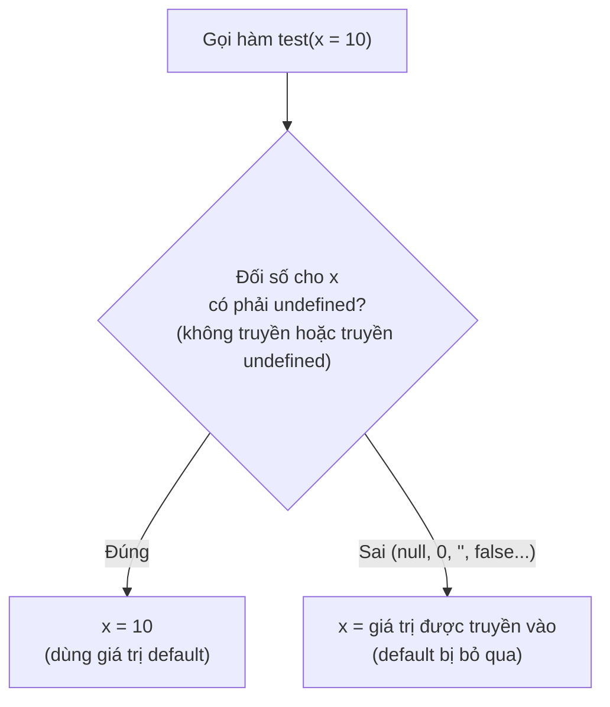
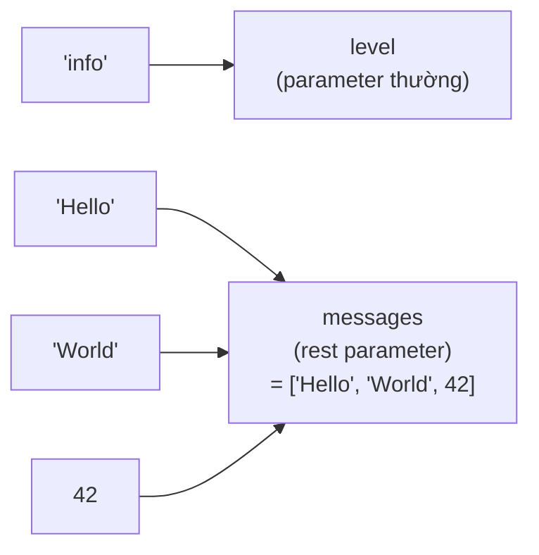

# Function Parameters

**Parameter** (tham số) là các biến mà bạn khai báo trong dấu ngoặc của một hàm để nhận dữ liệu đầu vào khi hàm được gọi. JavaScript cho phép bạn đặt giá trị mặc định (**default parameters**), gom nhiều giá trị thành một mảng (**rest parameters**), hay tách dữ liệu từ object/array ngay tại tham số (**destructuring**). Hiểu rõ tham số giúp bạn viết hàm linh hoạt và dễ tái sử dụng hơn.

---

:::note[Ghi nhớ nhanh]

- ⭐ **Default parameter chỉ apply khi đối số là `undefined`** — mọi falsy khác (`null`, `0`, `""`, `false`) vẫn giữ nguyên; muốn cả `null` cũng thay thì dùng `??`.
- ⭐ **Rest parameter (`...nums`) gom đối số thành mảng THẬT** — dùng được `map`/`filter`/`reduce`, khác hẳn `arguments`; phải đặt cuối.
- **Destructuring parameter** — tách property/phần tử ngay tại tham số (`function createUser({ name, age })`); nhớ `= {}` để tránh `TypeError` khi không truyền gì.
- **Named arguments pattern** — JS không có named arguments như Python, dùng object destructuring cho hàm ≥ 3 param hoặc có boolean.
- **`function.length`** — đếm số param không có default (rest và param có default không tính); Express dùng nó để phân biệt error middleware.

:::

---

## Mục lục

- [Vì sao các kiểu tham số mới ra đời?](#vì-sao-các-kiểu-tham-số-mới-ra-đời)
- [Khai báo hàm](#khai-báo-hàm)
- [Default parameters](#default-parameters)
- [Rest parameters](#rest-parameters)
- [Destructuring parameters](#destructuring-parameters)
- [Named arguments pattern](#named-arguments-pattern)
- [Câu hỏi phỏng vấn](#câu-hỏi-phỏng-vấn)

---

## Vì sao các kiểu tham số mới ra đời?

Trước ES6, việc xử lý tham số khá thủ công và dễ sinh lỗi. Các tính năng như default, rest và destructuring ra đời để giải quyết đúng những điểm khó chịu đó.

**Vấn đề:**

```js
// Đặt mặc định kiểu cũ — dễ dính bug với giá trị falsy
function greet(name, greeting) {
  name = name || "Anonymous";     // truyền "" cũng bị thay thành "Anonymous"!
  greeting = greeting || "Hi";    // tương tự với 0, false
  return `${greeting} ${name}`;
}

// Gom nhiều đối số kiểu cũ — phải dùng arguments
function sum() {
  // arguments KHÔNG phải mảng thật, không có reduce/map/filter
  var total = 0;
  for (var i = 0; i < arguments.length; i++) {
    total += arguments[i];
  }
  return total;
}

// Nhận options kiểu cũ — phải gỡ từng property
function createUser(options) {
  var name = options.name;
  var age = options.age;
  // ...
}
```

**Giải pháp:**

```js
// Default parameters — chỉ apply khi giá trị là undefined, an toàn với 0/""/false
function greet(name = "Anonymous", greeting = "Hi") {
  return `${greeting} ${name}`;
}

// Rest parameters — gom đối số thành MẢNG THẬT, dùng được reduce/map/filter
function sum(...nums) {
  return nums.reduce((a, b) => a + b, 0);
}

// Destructuring — lấy thẳng property ngay tại tham số
function createUser({ name, age }) {
  // dùng name, age trực tiếp
}
```

:::tip[Dùng thực tế]

- Hàm cấu hình có nhiều tùy chọn mặc định: `function setup({ timeout = 3000, retries = 3 } = {})`.
- Hàm tính toán với số lượng đối số không cố định: `sum(...nums)`, `Math.max(...values)`.
- Nhận config object cho component/API: `function Button({ text, color, onClick })`.
- Truyền "named arguments" để code dễ đọc, tránh nhầm thứ tự đối số.

:::

---

## Khai báo hàm

JavaScript có nhiều cách khai báo hàm:

```js
// Function declaration — hoisted
function greet(name) {
  return `Hi ${name}`;
}

// Function expression
const greet = function (name) {
  return `Hi ${name}`;
};

// Arrow function
const greet = (name) => `Hi ${name}`;

// Method shorthand (trong object/class)
const obj = {
  greet(name) {
    return `Hi ${name}`;
  },
};
```

---

## Default parameters

ES6 — gán giá trị mặc định khi không truyền:

```js
function greet(name = "Anonymous", greeting = "Hi") {
  return `${greeting} ${name}`;
}

greet();              // "Hi Anonymous"
greet("An");          // "Hi An"
greet("An", "Hello"); // "Hello An"
```

Default được **đánh giá mỗi lần gọi** — có thể là expression:

```js
function log(msg, time = new Date()) {
  console.log(time, msg);
}
```

Default có thể tham chiếu **parameter trước**:

```js
function range(start, end = start + 10) {
  // ...
}
```

:::warning[Cần lưu ý]

Default **chỉ apply khi giá trị là `undefined`**, không phải mọi falsy:

```js
function test(x = 10) {
  console.log(x);
}

test();          // 10
test(undefined); // 10
test(null);      // null (!)
test(0);         // 0
test("");        // ""
test(false);     // false
```

Nếu muốn apply default cho cả `null`, dùng `??`:

```js
function test(x) {
  const value = x ?? 10;
  // ...
}
```

:::

Sơ đồ dưới tóm tắt quy tắc quyết định: default parameter chỉ "nhảy vào"
khi đối số là `undefined`, còn mọi giá trị falsy khác (`null`, `0`, `""`,
`false`) vẫn được giữ nguyên.



---

## Rest parameters

Gộp các argument còn lại vào một **mảng**:

```js
function sum(...nums) {
  return nums.reduce((a, b) => a + b, 0);
}

sum(1, 2, 3, 4); // 10
```

Có thể kết hợp với parameter thường (phải đặt **cuối**):

```js
function log(level, ...messages) {
  console.log(`[${level}]`, ...messages);
}

log("info", "Hello", "World", 42);
```

Với lời gọi trên, đối số đầu tiên được gán cho parameter thường `level`,
còn tất cả đối số còn lại được **gom vào một mảng** `messages`:



Rest **khác** `arguments` object:

| | `...rest` | `arguments` |
|--|-----------|-------------|
| Là Array? | **Có** (Array thật) | Không (Array-like) |
| Hỗ trợ arrow? | Có | **Không** |
| Có method Array? | Có (`map`, `filter`...) | Không |
| Khuyến nghị | **Có** | Tránh |

---

## Destructuring parameters

Tách property trực tiếp trong parameter:

```js
// Thay vì
function createUser(options) {
  const name = options.name;
  const age = options.age;
}

// Viết
function createUser({ name, age }) {
  // ...
}

createUser({ name: "An", age: 25 });
```

Với default:

```js
function createUser({ name = "Anonymous", age = 0 } = {}) {
  // ...
}

createUser();              // không lỗi
createUser({ name: "An" }); // age = 0
```

`= {}` ở cuối quan trọng — tránh `TypeError` khi không truyền gì.

Array destructuring:

```js
function head([first, ...rest]) {
  return first;
}

head([1, 2, 3]); // 1
```

---

## Named arguments pattern

JavaScript **không có named arguments** như Python (`fn(name="x")`).
Pattern thay thế — **destructure object**:

```js
// Không tốt — thứ tự dễ nhớ sai
function createButton(text, color, size, disabled, onClick) {}

createButton("Save", "blue", "lg", false, handleClick);

// Tốt — named arguments qua object
function createButton({ text, color, size, disabled, onClick }) {}

createButton({
  text: "Save",
  color: "blue",
  size: "lg",
  disabled: false,
  onClick: handleClick,
});
```

:::tip[Mẹo]

**Quy tắc thực dụng**:

- Hàm ≤ 2 param → dùng positional `fn(a, b)`.
- Hàm ≥ 3 param hoặc nhiều optional → dùng object destructuring.
- Boolean parameter → **luôn** dùng object (`fn({ enabled: true })` rõ
  hơn `fn(true)`).

```js
// Tệ — boolean lạc lõng
slice(arr, 0, 5, true);

// Tốt
slice(arr, 0, 5, { inPlace: true });
```

Bool argument ở vị trí giữa là "code smell" — khi đọc call site,
không ai biết `true` nghĩa gì.

:::

:::info[Phân tích]

**Function length** — số param không có default:

```js
function a(x, y) {}              a.length;  // 2
function b(x, y = 10) {}         b.length;  // 1 (y có default)
function c(x, ...rest) {}        c.length;  // 1 (rest không tính)
function d({ x, y } = {}) {}     d.length;  // 0 (default = {})
```

Quan trọng cho framework tự động — vd Express middleware:

```js
function middleware(err, req, res, next) {} // length = 4 → error handler
function middleware(req, res, next) {}      // length = 3 → normal
```

Express dùng `length` để phân biệt error middleware. Đây là lý do thứ
tự parameter trong Express cố định — không thể đảo.

:::

---

## Câu hỏi phỏng vấn

Những câu thường gặp về chủ đề này. Tự trả lời trước, rồi đối chiếu lại với nội dung phía trên.

1. Điều gì xảy ra khi bạn gọi hàm với ít hơn hoặc nhiều hơn số parameter đã khai báo? JavaScript có báo lỗi không?
2. Default parameter chỉ apply trong trường hợp nào? Đoán output với `function test(x = 10)` khi gọi `test()`, `test(undefined)`, `test(null)`, `test(0)`, `test("")`.
3. Default parameter được đánh giá một lần lúc định nghĩa hàm hay mỗi lần gọi? Chứng minh bằng `function push(item, arr = [])`.
4. Default của một parameter có tham chiếu được parameter khác không? `function f(a = b, b = 2)` chạy được không, vì sao?
5. So sánh `rest parameter` với `arguments` object: kiểu dữ liệu, method khả dụng, hoạt động trong arrow function.
6. Rest parameter phải đặt ở vị trí nào? Một hàm có được khai báo nhiều rest parameter không?
7. Phân biệt `...` ở chỗ khai báo hàm (`rest`) và ở chỗ gọi hàm (`spread`). Đoán kết quả khi gọi `f(...arr)` với `function f(a, b)`.
8. `arguments` là array hay array-like? Có mấy cách chuyển nó thành mảng thật?
9. `arguments` có "liên kết" với parameter không (sửa `arguments[0]` thì parameter đổi theo)? Điều đó thay đổi thế nào trong `strict mode` hoặc khi hàm có default/rest?
10. `function.length` đếm cái gì? Đoán output cho `function a(x, y) {}`, `function b(x, y = 1) {}`, `function c(x, ...r) {}`, `function d({ x } = {}) {}`.
11. Express phân biệt error middleware với middleware thường bằng cách nào, và điều đó liên quan gì tới `function.length`?
12. Destructuring parameter là gì? Vì sao `function f({ a, b } = {})` cần `= {}` ở cuối — bỏ đi thì gọi `f()` gặp lỗi gì?
13. Với `function f({ a = 1 } = {})`, gọi `f({ a: null })` thì `a` bằng bao nhiêu? Giải thích.
14. JavaScript có `named arguments` như Python không? Pattern thay thế là gì, và bạn dựa vào tiêu chí nào để chuyển từ positional sang object parameter?
15. Vì sao boolean parameter kiểu `slice(arr, 0, 5, true)` bị coi là code smell? Cách viết tốt hơn?
16. JavaScript truyền tham số theo `pass by value` hay `pass by reference`? Sửa property của object tham số bên trong hàm có ảnh hưởng ra ngoài không, còn gán lại cả object thì sao?
17. Danh sách parameter có tạo scope riêng tách khỏi thân hàm không? Điều gì xảy ra khi default parameter tham chiếu một biến `let` khai báo trong thân hàm?
