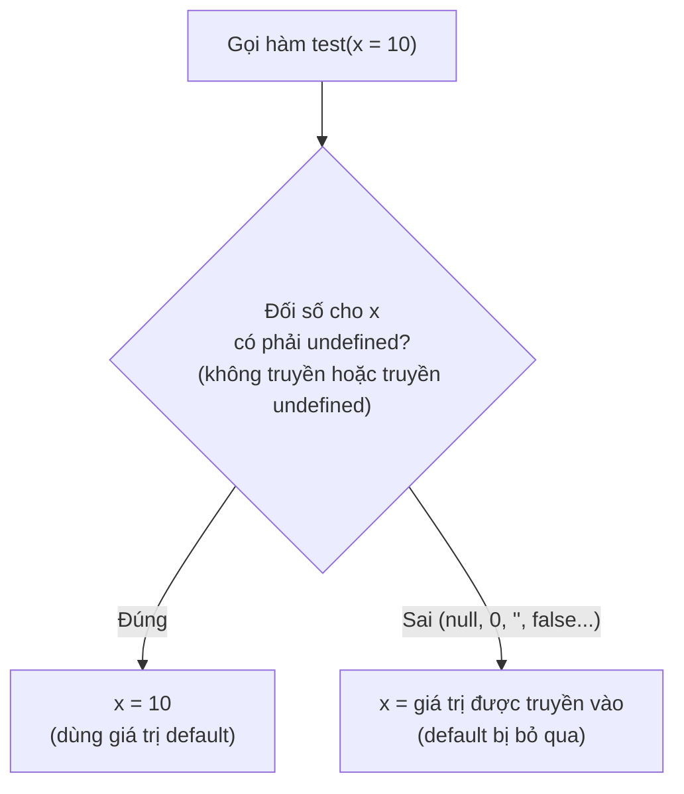
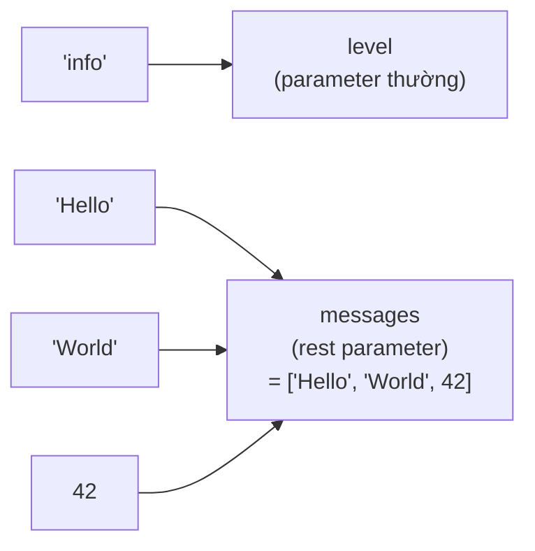

# Function Parameters

**Parameter** (tham số) là các biến mà bạn khai báo trong dấu ngoặc của một hàm để nhận dữ liệu đầu vào khi hàm được gọi. JavaScript cho phép bạn đặt giá trị mặc định (**default parameters**), gom nhiều giá trị thành một mảng (**rest parameters**), hay tách dữ liệu từ object/array ngay tại tham số (**destructuring**). Hiểu rõ tham số giúp bạn viết hàm linh hoạt và dễ tái sử dụng hơn.

[](pathname:///img/javascript/parameters.webp)

---

:::note[Ghi nhớ nhanh]

- ⭐ **Default parameter chỉ apply khi đối số là `undefined`** — mọi falsy khác (`null`, `0`, `""`, `false`) vẫn giữ nguyên; muốn cả `null` cũng thay thì dùng `??`.
- ⭐ **Rest parameter (`...nums`) gom đối số thành mảng THẬT** — dùng được `map`/`filter`/`reduce`, khác hẳn `arguments`; phải đặt cuối.
- **Destructuring parameter** — tách property/phần tử ngay tại tham số (`function createUser({ name, age })`); nhớ `= {}` để tránh `TypeError` khi không truyền gì.
- **Named arguments pattern** — JS không có named arguments như Python, dùng object destructuring cho hàm ≥ 3 param hoặc có boolean.
- **`function.length`** — đếm số param không có default (rest và param có default không tính); Express dùng nó để phân biệt error middleware.

:::

---

## Mục lục

- [Vì sao các kiểu tham số mới ra đời?](#vì-sao-các-kiểu-tham-số-mới-ra-đời)
- [Khai báo hàm](#khai-báo-hàm)
- [Default parameters](#default-parameters)
- [Rest parameters](#rest-parameters)
- [Destructuring parameters](#destructuring-parameters)
- [Named arguments pattern](#named-arguments-pattern)
- [Câu hỏi phỏng vấn](#câu-hỏi-phỏng-vấn)

---

## Vì sao các kiểu tham số mới ra đời?

Trước ES6, việc xử lý tham số khá thủ công và dễ sinh lỗi. Các tính năng như default, rest và destructuring ra đời để giải quyết đúng những điểm khó chịu đó.

**Vấn đề:**

```js
// Đặt mặc định kiểu cũ — dễ dính bug với giá trị falsy
function greet(name, greeting) {
  name = name || "Anonymous";     // truyền "" cũng bị thay thành "Anonymous"!
  greeting = greeting || "Hi";    // tương tự với 0, false
  return `${greeting} ${name}`;
}

// Gom nhiều đối số kiểu cũ — phải dùng arguments
function sum() {
  // arguments KHÔNG phải mảng thật, không có reduce/map/filter
  var total = 0;
  for (var i = 0; i < arguments.length; i++) {
    total += arguments[i];
  }
  return total;
}

// Nhận options kiểu cũ — phải gỡ từng property
function createUser(options) {
  var name = options.name;
  var age = options.age;
  // ...
}
```

**Giải pháp:**

```js
// Default parameters — chỉ apply khi giá trị là undefined, an toàn với 0/""/false
function greet(name = "Anonymous", greeting = "Hi") {
  return `${greeting} ${name}`;
}

// Rest parameters — gom đối số thành MẢNG THẬT, dùng được reduce/map/filter
function sum(...nums) {
  return nums.reduce((a, b) => a + b, 0);
}

// Destructuring — lấy thẳng property ngay tại tham số
function createUser({ name, age }) {
  // dùng name, age trực tiếp
}
```

:::tip[Dùng thực tế]

- Hàm cấu hình có nhiều tùy chọn mặc định: `function setup({ timeout = 3000, retries = 3 } = {})`.
- Hàm tính toán với số lượng đối số không cố định: `sum(...nums)`, `Math.max(...values)`.
- Nhận config object cho component/API: `function Button({ text, color, onClick })`.
- Truyền "named arguments" để code dễ đọc, tránh nhầm thứ tự đối số.

:::

---

## Khai báo hàm

JavaScript có nhiều cách khai báo hàm:

```js
// Function declaration — hoisted
function greet(name) {
  return `Hi ${name}`;
}

// Function expression
const greet = function (name) {
  return `Hi ${name}`;
};

// Arrow function
const greet = (name) => `Hi ${name}`;

// Method shorthand (trong object/class)
const obj = {
  greet(name) {
    return `Hi ${name}`;
  },
};
```

---

## Default parameters

ES6 — gán giá trị mặc định khi không truyền:

```js
function greet(name = "Anonymous", greeting = "Hi") {
  return `${greeting} ${name}`;
}

greet();              // "Hi Anonymous"
greet("An");          // "Hi An"
greet("An", "Hello"); // "Hello An"
```

Default được **đánh giá mỗi lần gọi** — có thể là expression:

```js
function log(msg, time = new Date()) {
  console.log(time, msg);
}
```

Default có thể tham chiếu **parameter trước**:

```js
function range(start, end = start + 10) {
  // ...
}
```

:::warning[Cần lưu ý]

Default **chỉ apply khi giá trị là `undefined`**, không phải mọi falsy:

```js
function test(x = 10) {
  console.log(x);
}

test();          // 10
test(undefined); // 10
test(null);      // null (!)
test(0);         // 0
test("");        // ""
test(false);     // false
```

Nếu muốn apply default cho cả `null`, dùng `??`:

```js
function test(x) {
  const value = x ?? 10;
  // ...
}
```

:::

Sơ đồ dưới tóm tắt quy tắc quyết định: default parameter chỉ "nhảy vào"
khi đối số là `undefined`, còn mọi giá trị falsy khác (`null`, `0`, `""`,
`false`) vẫn được giữ nguyên.



---

## Rest parameters

Gộp các argument còn lại vào một **mảng**:

```js
function sum(...nums) {
  return nums.reduce((a, b) => a + b, 0);
}

sum(1, 2, 3, 4); // 10
```

Có thể kết hợp với parameter thường (phải đặt **cuối**):

```js
function log(level, ...messages) {
  console.log(`[${level}]`, ...messages);
}

log("info", "Hello", "World", 42);
```

Với lời gọi trên, đối số đầu tiên được gán cho parameter thường `level`,
còn tất cả đối số còn lại được **gom vào một mảng** `messages`:



Rest **khác** `arguments` object:

| | `...rest` | `arguments` |
|--|-----------|-------------|
| Là Array? | **Có** (Array thật) | Không (Array-like) |
| Hỗ trợ arrow? | Có | **Không** |
| Có method Array? | Có (`map`, `filter`...) | Không |
| Khuyến nghị | **Có** | Tránh |

---

## Destructuring parameters

Tách property trực tiếp trong parameter:

```js
// Thay vì
function createUser(options) {
  const name = options.name;
  const age = options.age;
}

// Viết
function createUser({ name, age }) {
  // ...
}

createUser({ name: "An", age: 25 });
```

Với default:

```js
function createUser({ name = "Anonymous", age = 0 } = {}) {
  // ...
}

createUser();              // không lỗi
createUser({ name: "An" }); // age = 0
```

`= {}` ở cuối quan trọng — tránh `TypeError` khi không truyền gì.

Array destructuring:

```js
function head([first, ...rest]) {
  return first;
}

head([1, 2, 3]); // 1
```

---

## Named arguments pattern

JavaScript **không có named arguments** như Python (`fn(name="x")`).
Pattern thay thế — **destructure object**:

```js
// Không tốt — thứ tự dễ nhớ sai
function createButton(text, color, size, disabled, onClick) {}

createButton("Save", "blue", "lg", false, handleClick);

// Tốt — named arguments qua object
function createButton({ text, color, size, disabled, onClick }) {}

createButton({
  text: "Save",
  color: "blue",
  size: "lg",
  disabled: false,
  onClick: handleClick,
});
```

:::tip[Mẹo]

**Quy tắc thực dụng**:

- Hàm ≤ 2 param → dùng positional `fn(a, b)`.
- Hàm ≥ 3 param hoặc nhiều optional → dùng object destructuring.
- Boolean parameter → **luôn** dùng object (`fn({ enabled: true })` rõ
  hơn `fn(true)`).

```js
// Tệ — boolean lạc lõng
slice(arr, 0, 5, true);

// Tốt
slice(arr, 0, 5, { inPlace: true });
```

Bool argument ở vị trí giữa là "code smell" — khi đọc call site,
không ai biết `true` nghĩa gì.

:::

:::info[Phân tích]

**Function length** — số param không có default:

```js
function a(x, y) {}              a.length;  // 2
function b(x, y = 10) {}         b.length;  // 1 (y có default)
function c(x, ...rest) {}        c.length;  // 1 (rest không tính)
function d({ x, y } = {}) {}     d.length;  // 0 (default = {})
```

Quan trọng cho framework tự động — vd Express middleware:

```js
function middleware(err, req, res, next) {} // length = 4 → error handler
function middleware(req, res, next) {}      // length = 3 → normal
```

Express dùng `length` để phân biệt error middleware. Đây là lý do thứ
tự parameter trong Express cố định — không thể đảo.

:::

---

## Câu hỏi phỏng vấn

Những câu thường gặp về chủ đề này. Tự trả lời trước, rồi bấm **Xem đáp án** để đối chiếu.

**1. Điều gì xảy ra khi bạn gọi hàm với ít hơn hoặc nhiều hơn số parameter đã khai báo? JavaScript có báo lỗi không?**

<details className="qa">
<summary>Xem đáp án</summary>

JS **không báo lỗi** trong cả hai trường hợp — đây là điểm khác hẳn các ngôn ngữ static typing như Java hay C#.

- **Truyền thiếu**: các parameter không nhận được đối số sẽ mang giá trị `undefined` (hoặc giá trị default nếu có khai báo).
- **Truyền thừa**: đối số dư bị **bỏ qua** hoàn toàn, nhưng vẫn truy cập được qua `arguments` (với hàm thường) hoặc qua rest parameter.

```js
function greet(name, greeting) {
  console.log(name, greeting);
}

greet("An");                    // "An" undefined
greet("An", "Hi", "thừa", 42);  // "An" "Hi" — hai đối số cuối bị bỏ qua
```

Hệ quả thực tế: lỗi thiếu đối số chỉ lộ ra khi code chạy tới chỗ dùng biến `undefined`, thường ở dạng `TypeError: Cannot read properties of undefined` — xa nguyên nhân gốc. Vì vậy nên:

- Đặt **default parameter** cho các tham số tùy chọn.
- **Validate** tường minh các tham số bắt buộc, hoặc dùng TypeScript để bắt lỗi từ lúc compile.

Tính "khoan dung" này cũng chính là thứ cho phép `[1,2,3].map(x => x * 2)` hoạt động, dù `map` truyền tới 3 đối số cho callback.

</details>

**2. Default parameter chỉ apply trong trường hợp nào? Đoán output với `function test(x = 10)` khi gọi `test()`, `test(undefined)`, `test(null)`, `test(0)`, `test("")`.**

<details className="qa">
<summary>Xem đáp án</summary>

Default parameter **chỉ apply khi đối số đúng bằng `undefined`** — tức không truyền gì, hoặc truyền tường minh `undefined`. Mọi giá trị falsy khác vẫn được giữ nguyên.

```js
function test(x = 10) { console.log(x); }

test();          // 10   — không truyền → undefined → apply default
test(undefined); // 10   — truyền undefined → apply default
test(null);      // null — null KHÔNG trigger default
test(0);         // 0
test("");        // ""   (chuỗi rỗng)
test(false);     // false
```

Đây là điểm ưu việt so với kiểu cũ `x = x || 10`, vốn nuốt oan cả `0`, `""` và `false`.

Nhưng cũng là pitfall hay gặp khi làm việc với API: nhiều backend trả `null` cho field "không có giá trị", và default sẽ không đỡ được. Muốn xử lý cả `null`, dùng `??` bên trong hàm:

```js
function test(x) {
  const value = x ?? 10;   // cả null lẫn undefined đều thành 10
}
```

Ghi nhớ ngắn gọn: **default parameter và destructuring default chỉ bắt `undefined`; `??` bắt cả `null` lẫn `undefined`**.

</details>

**3. Default parameter được đánh giá một lần lúc định nghĩa hàm hay mỗi lần gọi? Chứng minh bằng `function push(item, arr = [])`.**

<details className="qa">
<summary>Xem đáp án</summary>

Default parameter được đánh giá **mỗi lần gọi hàm**, và chỉ khi đối số tương ứng là `undefined`. Nó là một **biểu thức**, không phải giá trị chốt sẵn lúc định nghĩa.

```js
function push(item, arr = []) {
  arr.push(item);
  return arr;
}

push(1);   // [1]
push(2);   // [2]  — mảng MỚI mỗi lần, không phải [1, 2]
```

Mỗi lần gọi mà không truyền `arr`, biểu thức `[]` chạy lại và tạo ra một mảng hoàn toàn mới. Đây là điểm JS làm **đúng hơn Python**: trong Python, `def push(item, arr=[])` đánh giá default **một lần duy nhất** lúc định nghĩa, nên mảng bị dùng chung giữa các lời gọi — một cái bẫy kinh điển.

Hệ quả khác của việc đánh giá lúc gọi: default có thể là bất kỳ biểu thức nào, kể cả lời gọi hàm, và nó chạy **lười** (chỉ khi cần):

```js
function log(msg, time = new Date()) { }   // mỗi lần gọi là một mốc thời gian mới
function f(id = generateId()) { }          // generateId() chỉ chạy khi không truyền id
```

</details>

**4. Default của một parameter có tham chiếu được parameter khác không? `function f(a = b, b = 2)` chạy được không, vì sao?**

<details className="qa">
<summary>Xem đáp án</summary>

**Có**, nhưng chỉ tham chiếu được các parameter **đứng trước** nó. Lý do: các parameter được khởi tạo **lần lượt từ trái sang phải**, parameter chưa tới lượt vẫn đang trong **Temporal Dead Zone (TDZ)**.

```js
function range(start, end = start + 10) { }   // OK — end nhìn thấy start
range(5);   // end = 15

function f(a = b, b = 2) { }
f();        // ReferenceError: Cannot access 'b' before initialization
f(1);       // OK! — a được truyền nên default không chạy, b khởi tạo bình thường
```

Điểm thú vị: `f(1)` **chạy được**, vì khi có đối số cho `a` thì biểu thức default `b` không hề được đánh giá. Nghĩa là lỗi ở đây là **lỗi runtime có điều kiện**, không phải lỗi cú pháp — càng nguy hiểm vì có thể lọt qua test.

Default cũng nhìn thấy được biến ở scope ngoài, và có thể gọi hàm khác:

```js
function f(a, b = a * 2, c = a + b) { }   // hợp lệ, phụ thuộc theo thứ tự
```

Quy tắc thực hành: xếp các parameter có default phụ thuộc **sau** parameter mà chúng phụ thuộc vào, và tránh chuỗi phụ thuộc quá dài vì rất khó đọc.

</details>

**5. So sánh `rest parameter` với `arguments` object: kiểu dữ liệu, method khả dụng, hoạt động trong arrow function.**

<details className="qa">
<summary>Xem đáp án</summary>

| | `...rest` | `arguments` |
|---|---|---|
| Kiểu dữ liệu | **Array thật** | Array-like (có `length` và index, không phải Array) |
| Method của Array | Đầy đủ (`map`, `filter`, `reduce`, `sort`...) | Không có — phải convert trước |
| Arrow function | **Dùng được** | **Không có** — arrow kế thừa `arguments` của hàm bao ngoài |
| Nội dung | Chỉ các đối số **còn lại** sau parameter thường | **Tất cả** đối số truyền vào |
| Đặt tên | Tự đặt, ý nghĩa rõ ràng | Tên cố định, khó đọc |
| Tối ưu hóa | Engine tối ưu tốt | Từng là "optimization killer" |

```js
function sum(...nums) {
  return nums.reduce((a, b) => a + b, 0);   // dùng thẳng reduce
}

function oldSum() {
  return Array.prototype.slice.call(arguments).reduce((a, b) => a + b, 0);
}

const arrow = (...args) => args.length;   // OK
const bad = () => arguments.length;       // lỗi hoặc lấy nhầm của hàm ngoài
```

Kết luận: `arguments` là di sản thời ES5, chỉ nên biết để đọc code cũ. Code mới **luôn dùng rest parameter** — rõ nghĩa hơn, có đủ method, và hoạt động nhất quán với arrow function.

</details>

**6. Rest parameter phải đặt ở vị trí nào? Một hàm có được khai báo nhiều rest parameter không?**

<details className="qa">
<summary>Xem đáp án</summary>

Rest parameter **bắt buộc phải là parameter cuối cùng**, và mỗi hàm chỉ được có **đúng một** rest parameter. Vi phạm là `SyntaxError` — phát hiện ngay lúc parse, trước khi code chạy.

```js
function log(level, ...messages) { }      // OK
function bad(...a, b) { }                 // SyntaxError: Rest parameter must be last
function bad2(...a, ...b) { }             // SyntaxError
function bad3(...rest,) { }               // SyntaxError — không cho dấu phẩy sau rest
```

Lý do rất trực quan: rest nghĩa là "gom **tất cả phần còn lại**". Nếu cho phép có parameter đứng sau, engine sẽ không có cách nào xác định rest nên dừng ở đâu — cú pháp trở nên mơ hồ. Cũng vì vậy hai rest cùng lúc là vô nghĩa.

Lưu ý thêm:

- Rest parameter **không được có giá trị default**: `function f(...args = [])` là `SyntaxError`. Không cần thiết, vì khi không truyền gì nó đã tự là mảng rỗng `[]`.
- Rest **không tính** vào `function.length`: `function c(x, ...r) {}` có `c.length === 1`.
- Quy tắc tương tự cũng áp dụng cho rest trong destructuring: `const [a, ...rest] = arr` — `rest` phải đứng cuối.

</details>

**7. Phân biệt `...` ở chỗ khai báo hàm (`rest`) và ở chỗ gọi hàm (`spread`). Đoán kết quả khi gọi `f(...arr)` với `function f(a, b)`.**

<details className="qa">
<summary>Xem đáp án</summary>

Cùng ký hiệu `...` nhưng **ngược chiều nhau**, phân biệt bằng **ngữ cảnh xuất hiện**:

- **Rest** — ở **danh sách parameter** khi khai báo hàm: **gom** nhiều đối số rời thành một mảng.
- **Spread** — ở **danh sách đối số** khi gọi hàm (hoặc trong array/object literal): **trải** một mảng ra thành các đối số rời.

```js
function f(a, b) { console.log(a, b); }

const arr = [1, 2, 3];
f(...arr);        // 1 2  — trải thành f(1, 2, 3), đối số thứ ba bị bỏ qua

const short = [1];
f(...short);      // 1 undefined — thiếu thì b là undefined

function g(...args) { }   // rest: g(1,2,3) → args = [1, 2, 3]
```

Với `f(...arr)` và `arr = [1, 2, 3]`: spread biến lời gọi thành `f(1, 2, 3)`, nên `a = 1`, `b = 2`, còn `3` **bị bỏ qua** vì hàm chỉ khai báo hai parameter (nó vẫn nằm trong `arguments`).

Mẹo nhớ: nhìn `...` nằm ở **nơi nhận** (khai báo parameter, vế trái destructuring) thì là **rest**; nằm ở **nơi cho** (đối số lời gọi, literal) thì là **spread**.

</details>

**8. `arguments` là array hay array-like? Có mấy cách chuyển nó thành mảng thật?**

<details className="qa">
<summary>Xem đáp án</summary>

`arguments` là **array-like**, không phải Array. Nó có `length` và truy cập được bằng index, nhưng prototype của nó là `Object.prototype` chứ không phải `Array.prototype` — nên không có `map`, `filter`, `reduce`, `slice`...

```js
function f() {
  Array.isArray(arguments);      // false
  arguments.map;                 // undefined
  typeof arguments;              // "object"
}
```

Các cách chuyển thành mảng thật:

```js
function f() {
  const a1 = [...arguments];                        // spread (ES6) — gọn nhất
  const a2 = Array.from(arguments);                 // ES6, hỗ trợ mapFn
  const a3 = Array.prototype.slice.call(arguments); // kiểu cũ ES5
  const a4 = [].slice.call(arguments);              // biến thể ngắn của a3
}
```

Hai cách ES6 dùng được vì `arguments` là **iterable** (có `Symbol.iterator`); `Array.from` thì chỉ cần array-like nên còn tổng quát hơn.

Tuy nhiên, trong code hiện đại **tốt nhất là không dùng `arguments`**: chỉ cần khai báo `function f(...args)` là có ngay mảng thật, không tốn bước convert, lại đặt tên được và chạy trong arrow function.

</details>

**9. `arguments` có "liên kết" với parameter không (sửa `arguments[0]` thì parameter đổi theo)? Điều đó thay đổi thế nào trong `strict mode` hoặc khi hàm có default/rest?**

<details className="qa">
<summary>Xem đáp án</summary>

Trong **sloppy mode** và khi hàm có **danh sách parameter đơn giản** (không default, rest hay destructuring), `arguments` là **mapped** — liên kết hai chiều với parameter:

```js
function f(x) {
  arguments[0] = 99;
  console.log(x);      // 99 — parameter đổi theo!
  x = 5;
  console.log(arguments[0]);  // 5 — và ngược lại
}
f(1);
```

Liên kết này **biến mất (unmapped)** trong các trường hợp:

- Hàm ở **strict mode** (`"use strict"`, thân class, ES module).
- Hàm có **default parameter**, **rest parameter**, hoặc **destructuring parameter** — kể cả khi không ở strict mode.

```js
function g(x = 0) {
  "use strict";
  arguments[0] = 99;
  console.log(x);     // 1 — KHÔNG đổi, arguments chỉ là bản chụp
}
g(1);
```

Đây là nguồn bug rất khó lần vì hành vi thay đổi âm thầm chỉ vì bạn thêm một default parameter. Spec loại bỏ mapping cũng vì nó gây khó cho engine khi tối ưu.

Lời khuyên: **đừng bao giờ ghi vào `arguments`**, và tốt nhất là dùng rest parameter để tránh toàn bộ vấn đề này.

</details>

**10. `function.length` đếm cái gì? Đoán output cho `function a(x, y) {}`, `function b(x, y = 1) {}`, `function c(x, ...r) {}`, `function d({ x } = {}) {}`.**

<details className="qa">
<summary>Xem đáp án</summary>

`function.length` đếm số parameter **trước parameter đầu tiên có default hoặc rest** — nói cách khác là số đối số "bắt buộc" theo cách hiểu của engine. Rest parameter và mọi parameter từ cái có default trở đi đều **không được tính**.

```js
function a(x, y) {}            a.length;  // 2
function b(x, y = 1) {}        b.length;  // 1 — y có default
function c(x, ...r) {}         c.length;  // 1 — rest không tính
function d({ x } = {}) {}      d.length;  // 0 — parameter duy nhất có default
```

Vài trường hợp đáng chú ý:

```js
function e({ x, y }) {}        e.length;  // 1 — destructuring không default vẫn tính là 1
function h(x = 1, y) {}        h.length;  // 0 — dừng đếm ngay tại x
```

Ví dụ `h` cho thấy `length` **dừng đếm** tại parameter có default đầu tiên, dù sau nó còn parameter thường.

`length` là thuộc tính **non-writable nhưng configurable**, nên có thể chỉnh bằng `Object.defineProperty` — các thư viện currying thỉnh thoảng làm vậy để giữ đúng arity. Ứng dụng thực tế phổ biến nhất là để framework tự dò "chữ ký" hàm, ví dụ Express phân biệt error middleware.

</details>

**11. Express phân biệt error middleware với middleware thường bằng cách nào, và điều đó liên quan gì tới `function.length`?**

<details className="qa">
<summary>Xem đáp án</summary>

Express dựa vào **`fn.length`** — số parameter khai báo của hàm middleware:

```js
function normal(req, res, next) {}           // length = 3 → middleware thường
function errorHandler(err, req, res, next) {} // length = 4 → error handler
```

Khi có lỗi (một middleware gọi `next(err)` hoặc throw đồng bộ), Express **bỏ qua** mọi middleware có `length` khác 4 và nhảy thẳng tới handler bốn tham số gần nhất trong chuỗi.

Hệ quả rất quan trọng trong thực tế:

- **Thứ tự parameter là cố định** — không thể đảo, không thể bỏ bớt. Viết `function errorHandler(err, req, res)` (3 tham số) sẽ khiến Express hiểu nhầm đó là middleware thường và **không bao giờ gọi** nó khi có lỗi.
- **Không được bỏ `next`** dù không dùng tới. Nhiều linter cảnh báo biến không dùng, nhưng ở đây phải giữ lại — thường thêm comment hoặc cấu hình linter bỏ qua.
- Error handler phải được `app.use` **sau cùng**, sau mọi route.

Lưu ý bổ sung: Express 4 **không tự bắt** rejection từ handler `async` (vì throw xảy ra ở microtask sau), cần `express-async-errors` hoặc wrapper; Express 5 đã xử lý sẵn.

</details>

**12. Destructuring parameter là gì? Vì sao `function f({ a, b } = {})` cần `= {}` ở cuối — bỏ đi thì gọi `f()` gặp lỗi gì?**

<details className="qa">
<summary>Xem đáp án</summary>

**Destructuring parameter** là việc tách thẳng property (hoặc phần tử mảng) ngay tại danh sách tham số, thay vì nhận cả object rồi gỡ từng cái trong thân hàm:

```js
function createUser({ name, age }) {   // dùng name, age trực tiếp
  // ...
}
createUser({ name: "An", age: 25 });
```

Phần `= {}` là **default cho chính object tham số**. Khi gọi `f()` mà không truyền gì, tham số là `undefined`; destructuring thực chất là phép truy cập property, mà đọc property của `undefined` thì ném lỗi:

```js
function f({ a, b }) { }
f();   // TypeError: Cannot destructure property 'a' of 'undefined'

function g({ a, b } = {}) { }
g();   // OK — a, b đều là undefined
```

Vì vậy quy tắc: **hễ mọi property đều optional thì luôn thêm `= {}`**, để hàm gọi được mà không cần đối số. Ngược lại, nếu object là bắt buộc, việc **không** đặt `= {}` lại là cố ý — nó buộc người gọi phải truyền vào và "fail fast" ngay.

Kết hợp cả hai tầng default là pattern chuẩn cho hàm cấu hình:

```js
function setup({ timeout = 3000, retries = 3 } = {}) { }
setup();                    // timeout 3000, retries 3
setup({ timeout: 5000 });   // retries vẫn 3
```

</details>

**13. Với `function f({ a = 1 } = {})`, gọi `f({ a: null })` thì `a` bằng bao nhiêu? Giải thích.**

<details className="qa">
<summary>Xem đáp án</summary>

`a` bằng **`null`**, không phải `1`.

```js
function f({ a = 1 } = {}) { console.log(a); }

f();                // 1    — không truyền → dùng {} → a thiếu → undefined → default
f({});              // 1    — a thiếu → undefined → default
f({ a: undefined }); // 1    — undefined → default
f({ a: null });      // null — KHÔNG apply default
f({ a: 0 });         // 0
```

Lý do: giá trị mặc định trong destructuring (cũng như default parameter) chỉ kích hoạt khi giá trị **đúng bằng `undefined`**. `null` là một giá trị hợp lệ, mang ý nghĩa "cố tình rỗng", nên JS tôn trọng và giữ nguyên.

Đây là bẫy rất hay gặp khi nhận dữ liệu từ API — backend (nhất là SQL) thường trả `null` cho field trống:

```js
function Avatar({ src = "/default.png" } = {}) { }
Avatar({ src: null });   // src = null → ảnh vỡ
```

Cách xử lý an toàn là thêm một lớp `??` bên trong hàm, vì `??` bắt cả `null` lẫn `undefined`:

```js
function f({ a } = {}) {
  const value = a ?? 1;   // null cũng thành 1
}
```

</details>

**14. JavaScript có `named arguments` như Python không? Pattern thay thế là gì, và bạn dựa vào tiêu chí nào để chuyển từ positional sang object parameter?**

<details className="qa">
<summary>Xem đáp án</summary>

JS **không có** named arguments kiểu `fn(name="x")` như Python. Pattern thay thế tiêu chuẩn là **truyền một object rồi destructure tại tham số**:

```js
// Không tốt — thứ tự dễ nhớ sai, call site khó đọc
function createButton(text, color, size, disabled, onClick) {}
createButton("Save", "blue", "lg", false, handleClick);

// Tốt — "named arguments" qua object
function createButton({ text, color, size, disabled, onClick } = {}) {}
createButton({ text: "Save", color: "blue", size: "lg", disabled: false });
```

Lợi ích: không phụ thuộc thứ tự, bỏ qua tùy ý các tham số optional (không cần nhồi `undefined` vào giữa), đọc call site là hiểu ngay ý nghĩa từng giá trị, và thêm tham số mới mà không phá vỡ code cũ.

Tiêu chí chuyển đổi:

- Hàm có **≤ 2 parameter** → giữ positional, ngắn gọn (`add(a, b)`).
- Hàm có **≥ 3 parameter**, hoặc nhiều tham số **optional** → dùng object.
- Có **boolean parameter** → **luôn** dùng object, vì `fn(true)` ở call site không nói lên điều gì.
- Nhiều tham số **cùng kiểu** liền nhau (dễ hoán vị nhầm) → dùng object.

Đánh đổi: object parameter tạo thêm một object mỗi lần gọi và viết dài hơn chút — không đáng kể so với lợi ích về tính rõ ràng.

</details>

**15. Vì sao boolean parameter kiểu `slice(arr, 0, 5, true)` bị coi là code smell? Cách viết tốt hơn?**

<details className="qa">
<summary>Xem đáp án</summary>

Vấn đề nằm ở **call site**: đọc `slice(arr, 0, 5, true)` không ai biết `true` nghĩa là gì — phải mở định nghĩa hàm ra tra. Người ta gọi đây là **boolean trap**.

Các tác hại kèm theo:

- Nếu có **hai boolean** liền nhau (`fn(true, false)`) thì gần như chắc chắn sẽ có lúc truyền nhầm thứ tự, mà vẫn chạy không báo lỗi.
- Một cờ boolean thường báo hiệu hàm đang làm **hai việc khác nhau** — vi phạm nguyên tắc mỗi hàm một nhiệm vụ.
- Thêm tùy chọn thứ ba (không còn đúng/sai) sẽ phải phá vỡ chữ ký hàm.

Cách viết tốt hơn — đặt tên cho cờ bằng object:

```js
// Tệ
slice(arr, 0, 5, true);

// Tốt
slice(arr, 0, 5, { inPlace: true });
```

Hai lựa chọn thay thế khác:

- **Tách thành hai hàm** có tên rõ ràng: `slice()` và `sliceInPlace()` — thường là giải pháp sạch nhất khi cờ làm đổi hẳn hành vi.
- Dùng **enum/hằng chuỗi** khi tương lai có thể có nhiều hơn hai trạng thái: `sort(arr, { order: "desc" })` thay vì `sort(arr, true)`.

</details>

**16. JavaScript truyền tham số theo `pass by value` hay `pass by reference`? Sửa property của object tham số bên trong hàm có ảnh hưởng ra ngoài không, còn gán lại cả object thì sao?**

<details className="qa">
<summary>Xem đáp án</summary>

JavaScript **luôn luôn là pass by value**. Điểm gây nhầm lẫn: với object, cái "value" được sao chép chính là **tham chiếu** tới object đó. Cách gọi chính xác hơn là **pass by sharing** — hàm nhận một bản sao của tham chiếu, cùng trỏ tới một object duy nhất.

Hệ quả:

```js
function mutate(obj) {
  obj.name = "B";       // SỬA object chung → ảnh hưởng ra ngoài
}
function reassign(obj) {
  obj = { name: "C" };  // gán lại BIẾN cục bộ → KHÔNG ảnh hưởng ra ngoài
}

const user = { name: "A" };
mutate(user);    user.name;  // "B"
reassign(user);  user.name;  // "B" — vẫn thế
```

Giải thích: `obj.name = "B"` đi **qua** tham chiếu để chạm vào object gốc. Còn `obj = {...}` chỉ trỏ **biến cục bộ** `obj` sang một object mới, biến `user` bên ngoài vẫn trỏ về chỗ cũ.

Với primitive (number, string, boolean...) thì không có gì để nhầm — hàm nhận bản sao giá trị, mọi thay đổi đều cục bộ.

Thực hành: hàm nên **tránh mutate** tham số object vì đó là side effect ẩn. Tạo bản mới bằng `{ ...obj, name: "B" }` rồi trả về — an toàn hơn và hợp với các framework dùng so sánh tham chiếu như React.

</details>

**17. Danh sách parameter có tạo scope riêng tách khỏi thân hàm không? Điều gì xảy ra khi default parameter tham chiếu một biến `let` khai báo trong thân hàm?**

<details className="qa">
<summary>Xem đáp án</summary>

**Có** — khi hàm có danh sách parameter **không đơn giản** (có default, rest hoặc destructuring), engine tạo một **scope riêng cho parameter**, bao ngoài scope của thân hàm. Biểu thức default chỉ nhìn thấy các parameter trước nó và các biến ở **scope ngoài hàm**, **không nhìn thấy** biến khai báo trong thân hàm.

Nếu default tham chiếu một biến chỉ tồn tại trong thân hàm, sẽ có `ReferenceError`:

```js
function g(a = y) {
  let y = 1;
  return a;
}
g();   // ReferenceError: y is not defined
```

Nếu tên đó cũng tồn tại ở scope ngoài, default lấy **biến ngoài**, còn thân hàm lại dùng biến trong — hai giá trị khác nhau cho cùng một tên:

```js
let x = "outer";
function f(a = x) {
  let x = "inner";
  return [a, x];
}
f();   // ["outer", "inner"]
```

Một hệ quả nữa: khi parameter list không đơn giản, **không được đặt `"use strict"`** trong thân hàm (`SyntaxError`), và `arguments` trở thành unmapped.

Lời khuyên: đừng đặt tên biến trong thân hàm trùng với parameter, và giữ biểu thức default đơn giản — chỉ dựa vào parameter trước đó hoặc hằng số.

</details>
