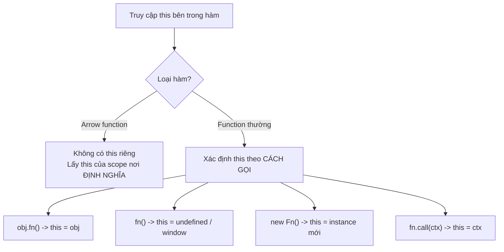

# Arrow Functions và IIFE

**Arrow function** (hàm mũi tên) là cách viết hàm ngắn gọn dùng cú pháp `=>`, được giới thiệu từ ES6 và rất phổ biến trong code hiện đại. Khác với hàm thường, arrow function không có `this` riêng nên có những trường hợp không nên dùng. **IIFE** (Immediately Invoked Function Expression — hàm tự gọi ngay khi vừa định nghĩa) là kỹ thuật chạy một hàm tức thì, thường dùng để tạo phạm vi riêng tránh làm "ô nhiễm" biến toàn cục.

[](pathname:///img/javascript/function-types.webp)

---

:::note[Ghi nhớ nhanh]

- ⭐ **Arrow function có lexical `this`** — không có `this` riêng mà lấy từ scope nơi định nghĩa, nên giữ đúng `this` trong callback (`setTimeout`, `.then()`, array methods) mà không cần `self`/`bind`.
- ⭐ **KHÔNG dùng arrow cho method, constructor, prototype method hay event handler cần `this` là element** — vì chính vì thiếu `this` riêng; cũng không có `arguments` và không dùng được `new`.
- **Cú pháp gọn**: 1 tham số bỏ `()`, return object phải bọc `()` như `name => ({ name })`.
- **IIFE** (hàm tự gọi ngay) trước đây tạo private scope/module pattern — nay gần như không cần vì đã có `let`/`const` block scope, ES Module và top-level await.
- **IIFE còn hữu dụng** để khởi tạo hằng số phức tạp trong một biểu thức duy nhất.

:::

---

## Mục lục

- [Vì sao arrow function ra đời?](#vì-sao-arrow-function-ra-đời)
- [Arrow Functions](#arrow-functions)
- [Khác biệt với function thường](#khác-biệt-với-function-thường)
- [Khi nào không nên dùng arrow](#khi-nào-không-nên-dùng-arrow)
- [IIFE](#iife)
- [Câu hỏi phỏng vấn](#câu-hỏi-phỏng-vấn)

---

## Vì sao arrow function ra đời?

**Vấn đề:** Trước ES6, callback rất hay cần giữ `this` của scope ngoài.
Vì `function(){}` tạo `this` riêng (thay đổi theo cách gọi), ta phải lưu
`this` vào một biến trung gian (`var self = this;`) rồi dùng lại bên trong,
hoặc `.bind(this)`. Cách này rườm rà và rất dễ quên. Cú pháp `function(){}`
cũng dài dòng cho những callback ngắn như `map`/`filter`.

```js
// Cách CŨ — phải "cứu" this bằng biến trung gian
function Timer() {
  this.count = 0;
  var self = this; // lưu lại this
  setInterval(function () {
    self.count++; // dùng self vì this ở đây không còn là Timer
  }, 1000);
}

// Hoặc dùng .bind(this) — vẫn rườm rà
function Timer2() {
  this.count = 0;
  setInterval(
    function () {
      this.count++;
    }.bind(this),
    1000
  );
}

// Callback ngắn cũng phải viết dài
[1, 2, 3].map(function (x) {
  return x * 2;
});
```

**Giải pháp:** ES6 thêm **arrow function** — **không có `this` riêng**
(lexical this, tự lấy từ scope ngoài) và cú pháp ngắn gọn hơn hẳn.

```js
// this tự lấy từ scope ngoài — không cần self / bind
function Timer() {
  this.count = 0;
  setInterval(() => {
    this.count++; // this = Timer instance
  }, 1000);
}

// Callback ngắn — gọn hơn nhiều
[1, 2, 3].map((x) => x * 2);
```

Lưu ý: chính vì **không có `this` riêng**, arrow function **không nên**
dùng làm method của object hay làm constructor (xem
[Khi nào không nên dùng arrow](#khi-nào-không-nên-dùng-arrow)).

:::tip[Dùng thực tế]

- **Callback trong array methods** (`map`/`filter`/`reduce`): viết gọn
  `arr.filter((x) => x > 0)`.
- **`setTimeout`/`setInterval` trong class**: giữ `this` của instance mà
  không cần `bind`.
- **Event listener trong component**: dùng `this` (hoặc state) của
  component thay vì của DOM element.
- **Promise `.then()`**: `fetchUser().then((user) => this.render(user))`
  giữ đúng `this`.

:::

---

## Arrow Functions

ES6 — cú pháp hàm gọn:

```js
// Cơ bản
const add = (a, b) => a + b;

// Multi-line cần {}
const sum = (a, b) => {
  const result = a + b;
  return result;
};

// 1 tham số — bỏ ()
const double = x => x * 2;

// Không tham số
const random = () => Math.random();

// Return object — bọc ()
const makeUser = name => ({ name, id: 1 });
```

---

## Khác biệt với function thường

Arrow function **không phải** chỉ là "function ngắn gọn" — chúng có
behavior khác:

| | Arrow | Function thường |
|--|-------|-----------------|
| `this` | **Lexical** (kế thừa từ scope) | Tùy cách gọi |
| `arguments` | **Không có** | Có |
| `new` (constructor) | **Không được** | Được |
| `prototype` | Không có | Có |
| Hoisting | Không (như const) | Có (function declaration) |
| `super` | Lexical | Tùy method |

### Lexical `this`

Đây là khác biệt **quan trọng nhất**:

```js
// Function thường — this thay đổi theo cách gọi
const user = {
  name: "An",
  greet: function () {
    console.log(this.name);
  },
};

user.greet(); // "An"
const fn = user.greet;
fn(); // undefined hoặc lỗi — this không còn là user

// Arrow — this lấy từ scope khai báo
class Counter {
  count = 0;

  // Method thường — this bị mất khi pass qua callback
  increment() {
    setTimeout(function () {
      this.count++; // this = undefined
    }, 100);
  }

  // Arrow — giữ this của class
  incrementArrow() {
    setTimeout(() => {
      this.count++; // this = instance
    }, 100);
  }
}
```

Sơ đồ dưới so sánh cách hai loại hàm xác định `this`: arrow function bỏ
qua `this` của chính nó và lấy theo nơi **định nghĩa** (lexical), còn
function thường quyết định `this` theo **cách gọi** tại thời điểm chạy.



---

## Khi nào không nên dùng arrow

**1. Method trong object/class** khi cần `this` là object:

```js
const user = {
  name: "An",
  greet: () => console.log(this.name), // KHÔNG — this là window/undefined
};

user.greet(); // không hoạt động

const user2 = {
  name: "An",
  greet() { console.log(this.name); }, // OK
};

user2.greet(); // "An"
```

**2. Constructor**:

```js
const Person = (name) => { this.name = name; };
new Person("An"); // TypeError: Person is not a constructor
```

**3. Event handler khi cần `this` là element**:

```js
button.addEventListener("click", function () {
  console.log(this); // button element
});

button.addEventListener("click", () => {
  console.log(this); // window/parent scope
});
```

**4. Prototype method**:

```js
function Animal(name) { this.name = name; }
Animal.prototype.greet = () => console.log(this.name); // sai
Animal.prototype.greet = function () { console.log(this.name); }; // đúng
```

:::info[Phân tích]

**Class field với arrow** là pattern phổ biến trong React class component
(legacy) để auto-bind:

```js
class Counter extends React.Component {
  // Method thường — phải bind trong constructor
  handleClick() {
    this.setState({ count: this.state.count + 1 });
  }

  // Arrow field — tự động bind
  handleClickAuto = () => {
    this.setState({ count: this.state.count + 1 });
  };
}
```

Pitfall: **arrow field tạo function mới mỗi instance** — nếu class có
nhiều instance, tốn memory hơn method trên prototype.

Trong React hiện đại (hooks), không còn vấn đề này — function được tạo
mới mỗi render nhưng React đã tối ưu.

:::

---

## IIFE

**Immediately Invoked Function Expression** — function được gọi ngay
khi khai báo:

```js
(function () {
  console.log("Chạy ngay");
})();

// Arrow IIFE
(() => {
  console.log("Chạy ngay");
})();

// Async IIFE — chạy await ở top-level (Node trước 14)
(async () => {
  const data = await fetch("/api");
})();
```

Mục đích lịch sử của IIFE:

- **Tạo private scope** trong ES5 (chưa có `let`/`const`).
- **Module pattern** trước khi có ES Module.

```js
// Cũ — IIFE tạo namespace
var App = (function () {
  var private = "secret";

  return {
    getPrivate() { return private; },
  };
})();

App.getPrivate(); // "secret"
App.private;      // undefined
```

:::warning[Cần lưu ý]

Trong code hiện đại (ES2020+), IIFE **gần như không cần** vì:

- `let`/`const` có block scope.
- ES Module có scope riêng cho mỗi file.
- Top-level await trong ES Module thay được async IIFE.

```js
// Thay vì
(async () => {
  const data = await fetch("/api");
  console.log(data);
})();

// Trong ES Module (file .mjs hoặc "type": "module")
const data = await fetch("/api");
console.log(data);
```

IIFE còn dùng trong:

- File **không phải module** (legacy script).
- Khi cần block đơn lẻ trong middle of code.
- Bundle output của bundler (UMD format).

:::

:::tip[Mẹo]

**Pattern IIFE hữu dụng còn lại 2026** — initialize hằng số phức tạp:

```js
const ROUTES = (() => {
  const base = "/api/v1";
  return {
    users: `${base}/users`,
    products: `${base}/products`,
    orders: `${base}/orders`,
  };
})();
```

Tương đương `as const` factory — gọn hơn khai báo nhiều biến trung gian.

:::

---

## Câu hỏi phỏng vấn

Những câu thường gặp về chủ đề này. Tự trả lời trước, rồi bấm **Xem đáp án** để đối chiếu.

**1. Liệt kê các cách khai báo hàm trong JavaScript (`function declaration`, `function expression`, `arrow function`, method shorthand). Chúng khác nhau thế nào về hoisting?**

<details className="qa">
<summary>Xem đáp án</summary>

Bốn cách chính:

| Cách viết | Ví dụ | Hoisting |
|---|---|---|
| Function declaration | `function f() {}` | Được hoist **cả thân hàm** — gọi trước khi khai báo vẫn chạy |
| Function expression | `const f = function () {}` | Chỉ hoist biến; `const`/`let` nằm trong TDZ → gọi trước là `ReferenceError` |
| Arrow function | `const f = () => {}` | Giống function expression — không hoist thân hàm |
| Method shorthand | `{ f() {} }` / method trong `class` | Là property của object/prototype, chỉ tồn tại sau khi object (hoặc class) được tạo |

```js
sayHi();            // "hi" — declaration được hoist đầy đủ
function sayHi() { console.log("hi"); }

sayBye();           // ReferenceError — TDZ
const sayBye = () => console.log("bye");
```

Ngoài ra method shorthand và arrow không có tên ràng buộc bên trong để tự đệ quy như named function expression, và method shorthand cho phép dùng `super`.

</details>

**2. Arrow function khác function thường ở những điểm nào? Kể ít nhất bốn điểm: `this`, `arguments`, `new`, `prototype`.**

<details className="qa">
<summary>Xem đáp án</summary>

| | Arrow | Function thường |
|---|---|---|
| `this` | **Lexical** — lấy từ scope nơi định nghĩa | Tùy cách gọi |
| `arguments` | Không có object `arguments` riêng | Có |
| `new` | Không dùng được (`TypeError`) | Dùng được |
| `prototype` | Không có property `prototype` | Có |
| Hoisting | Không (gán vào `const`/`let`) | Function declaration được hoist |
| `super` / `new.target` | Lexical, lấy từ ngoài | Riêng cho từng hàm |

Vì bốn điểm đầu, arrow thích hợp làm **callback ngắn** (`map`, `filter`, `.then`, `setTimeout`) nơi ta muốn giữ `this` của scope ngoài, nhưng **không** thích hợp làm method của object, prototype method, constructor hay event handler cần `this` là element.

</details>

**3. "Arrow function không có `this` riêng" nghĩa là gì? `this` bên trong arrow được quyết định lúc định nghĩa hay lúc gọi?**

<details className="qa">
<summary>Xem đáp án</summary>

Nghĩa là engine **không tạo binding `this` mới** khi gọi arrow function. Khi code bên trong arrow đọc `this`, nó được giải quyết như một biến thường: đi ngược scope chain ra hàm bao ngoài gần nhất có `this` riêng, và lấy giá trị ở đó. Vì scope chain được xác định **lúc định nghĩa**, nên `this` của arrow là **lexical** — chốt ở nơi viết code, không phụ thuộc cách gọi.

```js
class Timer {
  count = 0;
  start() {
    setInterval(() => {
      this.count++; // this = instance Timer, lấy từ start()
    }, 1000);
  }
}
```

Hệ quả: `call`, `apply`, `bind` hay gọi qua object đều **không đổi được** `this` của arrow. Đây vừa là ưu điểm (khỏi cần `var self = this` hay `.bind(this)`), vừa là nhược điểm khi ta thực sự cần `this` động.

</details>

**4. `this` trong function thường được xác định theo những quy tắc nào (gọi độc lập, gọi qua object, `new`, `call`/`apply`/`bind`)? Thứ tự ưu tiên ra sao?**

<details className="qa">
<summary>Xem đáp án</summary>

Thứ tự ưu tiên từ cao xuống thấp:

1. **`new Fn()`** — `this` là object mới vừa tạo. Ràng buộc mạnh nhất, kể cả hàm đã `bind` thì `new` vẫn thắng.
2. **Explicit binding** — `fn.call(ctx)`, `fn.apply(ctx)`, `fn.bind(ctx)`: `this` là `ctx`.
3. **Implicit binding** — `obj.fn()`: `this` là `obj` (object ngay trước dấu chấm).
4. **Default binding** — `fn()` gọi độc lập: `this` là `undefined` ở strict mode/ES Module, là `globalThis` (`window`) ở sloppy mode.

```js
const user = { name: "An", greet() { console.log(this.name); } };
user.greet();          // "An"  — implicit
const f = user.greet;
f();                   // undefined / lỗi — default binding, mất ngữ cảnh
f.call(user);          // "An"  — explicit
```

Điểm hay bị hỏi: mất ngữ cảnh khi truyền method làm callback (`setTimeout(user.greet, 0)`) — cách chữa là `.bind(user)` hoặc bọc trong arrow.

</details>

**5. `call`, `apply`, `bind` khác nhau chỗ nào? Gọi `.bind(obj)` lên một arrow function có đổi được `this` không, vì sao?**

<details className="qa">
<summary>Xem đáp án</summary>

| Method | Gọi hàm ngay? | Truyền tham số |
|---|---|---|
| `fn.call(ctx, a, b)` | Có | Liệt kê rời từng tham số |
| `fn.apply(ctx, [a, b])` | Có | Truyền bằng mảng |
| `fn.bind(ctx, a)` | Không — trả về **hàm mới** đã gắn `this` | Cho phép áp dụng trước một phần (partial application) |

```js
function greet(greeting) { return `${greeting}, ${this.name}`; }
const user = { name: "An" };

greet.call(user, "Chào");      // "Chào, An"
greet.apply(user, ["Chào"]);   // "Chào, An"
const bound = greet.bind(user);
bound("Chào");                 // "Chào, An"
```

**Với arrow function thì không.** `bind` chỉ gắn `this` cho hàm có binding `this` riêng; arrow không có nên giá trị `ctx` bị bỏ qua, `this` vẫn lấy theo lexical scope. Gọi không lỗi, chỉ là vô tác dụng — `bind` vẫn dùng được để cố định tham số. Điều này cũng đúng với `call`/`apply`.

</details>

**6. Đoán output: object literal có `greet: () => console.log(this.name)` khi gọi `user.greet()`. Giải thích, rồi sửa lại cho đúng.**

<details className="qa">
<summary>Xem đáp án</summary>

```js
const user = {
  name: "An",
  greet: () => console.log(this.name),
};
user.greet();
```

Kết quả **không phải** `"An"`. Object literal **không tạo scope** cho `this`, nên arrow lấy `this` của scope bao ngoài nơi nó được định nghĩa — tức top-level. Trong script thường ở trình duyệt, `this` là `window` và `window.name` là chuỗi rỗng nên in ra dòng trống; trong ES Module (hoặc strict/Node module) `this` là `undefined` → ném `TypeError: Cannot read properties of undefined`.

Sửa bằng method shorthand (hoặc function expression) để hàm có `this` riêng, xác định theo cách gọi:

```js
const user2 = {
  name: "An",
  greet() { console.log(this.name); },
};
user2.greet(); // "An"
```

Bài học: đừng dùng arrow làm method khi cần `this` trỏ về chính object.

</details>

**7. Vì sao `new (() => {})` ném `TypeError`? Arrow function thiếu những gì để làm constructor?**

<details className="qa">
<summary>Xem đáp án</summary>

Toán tử `new` cần hàm có internal method `[[Construct]]`. Arrow function chỉ có `[[Call]]`, nên engine báo ngay `TypeError: ... is not a constructor`.

Cụ thể arrow thiếu ba thứ cần cho vai trò constructor:

- **Không có `[[Construct]]`** — không thể bị gọi bằng `new`.
- **Không có property `prototype`** — `new` cần `Fn.prototype` để làm `[[Prototype]]` cho instance mới; arrow không có object này.
- **Không có binding `this` riêng** — `new` phải tạo object mới rồi gắn vào `this` bên trong hàm, nhưng arrow lấy `this` lexical nên không có chỗ để gắn.

```js
const Person = (name) => { this.name = name; };
new Person("An"); // TypeError: Person is not a constructor
```

Muốn tạo object thì dùng `class`, function declaration/expression, hoặc factory function trả về object literal.

</details>

**8. Trong class, so sánh `handleClick() {}` (prototype method) với `handleClick = () => {}` (class field arrow): khác nhau về `this`, về bộ nhớ khi tạo nhiều instance, và về khả năng override/spy khi viết test.**

<details className="qa">
<summary>Xem đáp án</summary>

| | Prototype method | Class field arrow |
|---|---|---|
| Nơi lưu | `Class.prototype` — dùng chung | Property riêng của từng instance |
| `this` | Theo cách gọi; mất ngữ cảnh khi truyền làm callback | Lexical, luôn là instance — auto-bind |
| Bộ nhớ | Một bản duy nhất cho mọi instance | Tạo một closure mới cho **mỗi** instance |
| Kế thừa / `super` | Lớp con override được, gọi được `super.method()` | Field của lớp con **ghi đè** field lớp cha; không dùng `super` như method |
| Test / spy | Spy trên `Class.prototype.method` áp dụng cho mọi instance, kể cả instance tạo sau | Phải spy trên **từng instance** sau khi khởi tạo |

```js
class A {
  onClick() { console.log(this); }      // mất this nếu truyền trực tiếp
  onClickAuto = () => console.log(this); // luôn đúng this
}
```

Đánh đổi: field arrow tiện và an toàn `this`, nhưng tốn bộ nhớ hơn và khó mock/override hơn. Với component tạo nhiều instance, ưu tiên prototype method kèm `.bind` trong constructor.

</details>

**9. Trước ES6, người ta giữ `this` trong callback bằng những cách nào (`var self = this`, `.bind(this)`, tham số `thisArg` của `forEach`)?**

<details className="qa">
<summary>Xem đáp án</summary>

Ba cách phổ biến:

```js
function Timer() {
  this.count = 0;

  // 1. Biến trung gian — self / that / _this
  var self = this;
  setInterval(function () { self.count++; }, 1000);

  // 2. .bind(this) — tạo hàm mới đã gắn this
  setInterval(function () { this.count++; }.bind(this), 1000);

  // 3. thisArg — tham số thứ hai của forEach/map/filter/some...
  [1, 2].forEach(function (n) { this.count += n; }, this);
}
```

Nhược điểm chung: rườm rà, dễ quên (quên `.bind` là sinh bug `this is undefined`), và `thisArg` chỉ có ở một số method mảng chứ không phải mọi API nhận callback. Đây chính là động lực ES6 đưa ra arrow function với lexical `this` — cả ba cách trên gọn lại thành `setInterval(() => { this.count++; }, 1000)`.

</details>

**10. Với `addEventListener`, `this` bên trong handler là gì khi dùng function thường và khi dùng arrow function? Khi nào sự khác biệt này gây bug?**

<details className="qa">
<summary>Xem đáp án</summary>

- **Function thường**: DOM gọi handler với `this` là **element đang gắn listener** (`currentTarget`).
- **Arrow function**: không có `this` riêng nên lấy lexical — là `this` của scope bao ngoài (`window`/`undefined` ở top-level, hoặc instance nếu viết trong class field).

```js
button.addEventListener("click", function () {
  console.log(this); // <button>
});

button.addEventListener("click", () => {
  console.log(this); // window / undefined / instance — KHÔNG phải button
});
```

Bug hay gặp theo hai chiều: viết arrow rồi dùng `this.classList.toggle(...)` tưởng `this` là element → lỗi; hoặc trong class dùng function thường làm handler rồi gọi `this.setState(...)` → `this` lại là element chứ không phải instance. Cách an toàn: luôn dùng `event.currentTarget` để lấy element, và dùng arrow (hoặc `bind`) khi cần `this` là instance của class.

</details>

**11. Arrow function có `arguments` không? Nếu viết `arguments` bên trong một arrow thì nó tham chiếu tới đâu, và thay thế bằng gì?**

<details className="qa">
<summary>Xem đáp án</summary>

Arrow **không có** object `arguments` riêng. Cũng giống `this`, `arguments` được tra theo scope chain: nó trỏ tới `arguments` của **function thường bao ngoài gần nhất**; nếu không có hàm nào bao ngoài thì `ReferenceError: arguments is not defined`.

```js
function outer() {
  const inner = () => arguments[0];
  return inner();
}
outer("a", "b"); // "a" — arguments của outer, không phải của inner

const f = () => arguments; // ReferenceError khi gọi ở top-level module
```

Thay thế bằng **rest parameters** — vừa rõ ràng vừa là mảng thật:

```js
const sum = (...nums) => nums.reduce((a, b) => a + b, 0);
sum(1, 2, 3); // 6
```

Rest params tốt hơn `arguments` cả với function thường: `arguments` chỉ là array-like, phải `Array.from` mới dùng được method mảng.

</details>

**12. Cú pháp arrow: khi nào bỏ được `()` quanh tham số, khi nào bỏ được `{}` và `return`? Vì sao `x => { name: x }` không trả về object như bạn tưởng?**

<details className="qa">
<summary>Xem đáp án</summary>

- Bỏ được `()` khi có **đúng một tham số** và tham số đó không có giá trị mặc định, không destructuring, không rest. Không tham số hoặc từ hai trở lên thì bắt buộc giữ `()`.
- Bỏ được `{}` và `return` khi thân hàm là **một biểu thức duy nhất** (concise body) — giá trị biểu thức chính là giá trị trả về.

```js
const double = x => x * 2;          // OK
const random = () => Math.random(); // không tham số -> cần ()
const add = (a, b) => a + b;        // hai tham số -> cần ()
```

Với `x => { name: x }`, dấu `{` ngay sau `=>` được parser hiểu là **mở block statement**, không phải object literal. Bên trong, `name:` trở thành một **label** và `x` là biểu thức vô nghĩa; hàm không có `return` nên trả về `undefined`. Muốn trả object thì bọc trong ngoặc đơn để ép thành biểu thức:

```js
const make = x => ({ name: x });
make("An"); // { name: "An" }
```

</details>

**13. Arrow function có được hoisted không? Đoán output khi gọi hàm ở dòng phía trên khai báo `const fn = () => {}`.**

<details className="qa">
<summary>Xem đáp án</summary>

Arrow luôn là một **expression** gán vào biến, nên nó theo luật hoisting của biến chứ không phải của function declaration. Với `const`/`let`, biến được hoist lên đầu block nhưng nằm trong **TDZ (Temporal Dead Zone)** cho tới dòng khai báo.

```js
fn();                       // ReferenceError: Cannot access 'fn' before initialization
const fn = () => "hello";
```

Nếu dùng `var` thì không phải TDZ mà là `TypeError`, vì `fn` đã tồn tại với giá trị `undefined`:

```js
fn();                 // TypeError: fn is not a function
var fn = () => "hi";
```

So sánh: function declaration được hoist cả thân hàm nên gọi trước vẫn chạy bình thường. Vì vậy với arrow (và function expression) phải **khai báo trước khi dùng**.

</details>

**14. `IIFE` là gì và vì sao phải bọc function trong `()` thì mới gọi ngay được? Nêu vài cách viết IIFE khác nhau.**

<details className="qa">
<summary>Xem đáp án</summary>

**IIFE (Immediately Invoked Function Expression)** là hàm được định nghĩa và gọi ngay lập tức tại chỗ.

Lý do cần ngoặc: khi một câu lệnh **bắt đầu** bằng từ khóa `function`, parser hiểu đó là **function declaration** — mà declaration thì bắt buộc có tên và không thể theo sau bằng `()` để gọi, nên báo `SyntaxError`. Bọc trong `()` (hoặc bất kỳ ngữ cảnh biểu thức nào) buộc parser hiểu đó là **function expression**, khi ấy mới gọi ngay được.

```js
(function () { console.log("A"); })();   // kiểu phổ biến nhất
(function () { console.log("B"); }());   // gọi bên trong ngoặc
(() => { console.log("C"); })();         // arrow IIFE
(async () => { await fetch("/api"); })(); // async IIFE
!function () { console.log("D"); }();     // ép thành biểu thức bằng toán tử
void function () { console.log("E"); }();
```

Arrow IIFE vẫn cần ngoặc để gắn đúng lời gọi vào biểu thức hàm.

</details>

**15. IIFE ra đời để giải quyết vấn đề gì, và vì sao code hiện đại gần như không cần nó nữa?**

<details className="qa">
<summary>Xem đáp án</summary>

Thời ES5 chỉ có `var` (function scope) và chưa có module, nên mọi biến khai báo ở top-level đều rơi vào global, dễ trùng tên giữa các file `<script>`. IIFE giải quyết bằng cách tạo **một scope hàm dùng một lần**:

- **Private scope** — biến bên trong không lọt ra global.
- **Module pattern** — trả về object chỉ phơi ra API công khai, giấu phần còn lại.

```js
var App = (function () {
  var secret = "x";                 // private
  return { get() { return secret; } };
})();
App.get();    // "x"
App.secret;   // undefined
```

Ngày nay không cần nữa vì: `let`/`const` đã có **block scope**; **ES Module** cho mỗi file một scope riêng, chỉ những gì `export` mới ra ngoài; **top-level await** thay được async IIFE. IIFE chỉ còn hữu dụng trong script legacy không phải module, trong output của bundler (UMD), và để khởi tạo một hằng số phức tạp gọn trong một biểu thức.

</details>

**16. Vòng lặp `for (var i = 0; i < 3; i++)` kết hợp `setTimeout` in ra kết quả sai — IIFE khắc phục thế nào, và `let` thay thế được ra sao? Giải thích theo closure.**

<details className="qa">
<summary>Xem đáp án</summary>

```js
for (var i = 0; i < 3; i++) {
  setTimeout(() => console.log(i), 0);
}
// 3, 3, 3
```

`var` có function scope nên cả ba callback cùng **closure lên một biến `i` duy nhất**. Callback chỉ chạy sau khi vòng lặp kết thúc, lúc đó `i` đã là `3`.

Cách cũ dùng IIFE để tạo một scope mới mỗi vòng, **chụp lại giá trị** `i` vào tham số riêng:

```js
for (var i = 0; i < 3; i++) {
  (function (j) {
    setTimeout(() => console.log(j), 0);
  })(i);
}
// 0, 1, 2
```

Cách hiện đại chỉ cần đổi `var` thành `let`: mỗi lần lặp tạo **một binding `i` mới** trong block scope, nên mỗi closure giữ một bản riêng.

```js
for (let i = 0; i < 3; i++) setTimeout(() => console.log(i), 0); // 0, 1, 2
```

</details>

**17. `async IIFE` dùng khi nào? `top-level await` thay được nó trong hoàn cảnh nào và không thay được khi nào?**

<details className="qa">
<summary>Xem đáp án</summary>

`async IIFE` sinh ra để dùng `await` ở nơi không cho phép — trước đây `await` chỉ hợp lệ bên trong hàm `async`, nên muốn chạy code bất đồng bộ ở top-level phải bọc lại:

```js
(async () => {
  const res = await fetch("/api");
  console.log(await res.json());
})();
```

**Top-level await thay được** khi code nằm trong **ES Module** (file `.mjs` hoặc `package.json` có `"type": "module"`, hoặc `<script type="module">`): viết thẳng `const data = await fetch("/api")` ở cấp cao nhất.

**Không thay được khi:**

- Code là **CommonJS** (`require`) hoặc script cổ điển không phải module.
- Cần chạy tác vụ async **không chặn** phần còn lại — top-level await làm module chờ và trì hoãn cả các module import nó, còn async IIFE chạy nền.
- Cần một scope riêng cho `try/catch` hoặc biến tạm, hay muốn chạy nhiều tác vụ song song rồi bỏ qua kết quả.

</details>

**18. Arrow function có dùng làm generator (`function*`) được không? Còn `yield` bên trong arrow thì sao?**

<details className="qa">
<summary>Xem đáp án</summary>

**Không.** Cú pháp arrow không hỗ trợ generator — không có dạng `*() => {}` hay `() *=> {}`; viết như vậy là `SyntaxError`. Muốn có generator phải dùng `function*`, hoặc method shorthand `*gen() {}` trong object/class.

```js
// SyntaxError
// const gen = *() => { yield 1; };

function* gen() { yield 1; yield 2; }   // đúng
const obj = { *gen() { yield 1; } };    // đúng — method shorthand
```

Về `yield`: nó chỉ hợp lệ **trực tiếp trong thân một generator**. Arrow không phải generator, nên `yield` bên trong arrow là lỗi cú pháp — kể cả khi arrow đó nằm bên trong một generator:

```js
function* outer() {
  const f = () => yield 1; // SyntaxError
}
```

Điểm chung với `await`: một arrow thường cũng không dùng được `await`, phải viết `async () => { await ... }`. Lý do sâu xa là arrow được thiết kế làm hàm "nhẹ", không có `this`, `arguments`, `new.target` — và cũng không mang trạng thái tạm dừng/tiếp tục của generator.

</details>
