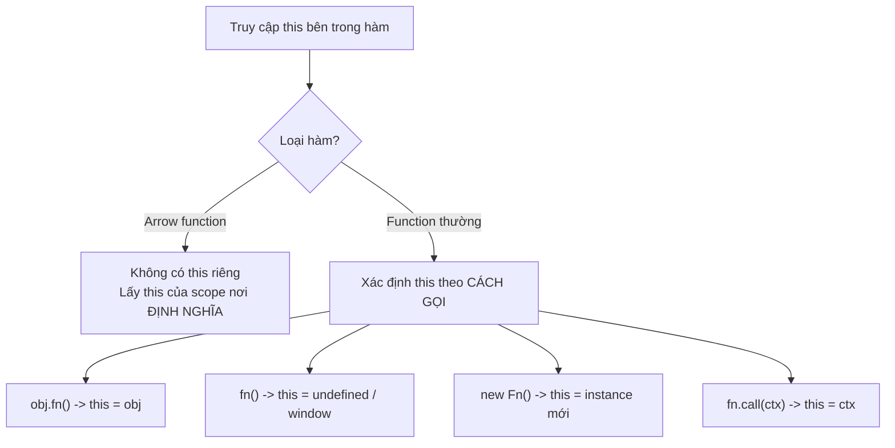

# Arrow Functions và IIFE

**Arrow function** (hàm mũi tên) là cách viết hàm ngắn gọn dùng cú pháp `=>`, được giới thiệu từ ES6 và rất phổ biến trong code hiện đại. Khác với hàm thường, arrow function không có `this` riêng nên có những trường hợp không nên dùng. **IIFE** (Immediately Invoked Function Expression — hàm tự gọi ngay khi vừa định nghĩa) là kỹ thuật chạy một hàm tức thì, thường dùng để tạo phạm vi riêng tránh làm "ô nhiễm" biến toàn cục.

---

## 🎯 Cần nắm gì sau bài này?

:::note[Ghi nhớ nhanh]

- ⭐ **Arrow function có lexical `this`** — không có `this` riêng mà lấy từ scope nơi định nghĩa, nên giữ đúng `this` trong callback (`setTimeout`, `.then()`, array methods) mà không cần `self`/`bind`.
- ⭐ **KHÔNG dùng arrow cho method, constructor, prototype method hay event handler cần `this` là element** — vì chính vì thiếu `this` riêng; cũng không có `arguments` và không dùng được `new`.
- **Cú pháp gọn**: 1 tham số bỏ `()`, return object phải bọc `()` như `name => ({ name })`.
- **IIFE** (hàm tự gọi ngay) trước đây tạo private scope/module pattern — nay gần như không cần vì đã có `let`/`const` block scope, ES Module và top-level await.
- **IIFE còn hữu dụng** để khởi tạo hằng số phức tạp trong một biểu thức duy nhất.

:::

---

## Mục lục

- [Vì sao arrow function ra đời?](#vì-sao-arrow-function-ra-đời)
- [Arrow Functions](#arrow-functions)
- [Khác biệt với function thường](#khác-biệt-với-function-thường)
- [Khi nào không nên dùng arrow](#khi-nào-không-nên-dùng-arrow)
- [IIFE](#iife)

---

## Vì sao arrow function ra đời?

**Vấn đề:** Trước ES6, callback rất hay cần giữ `this` của scope ngoài.
Vì `function(){}` tạo `this` riêng (thay đổi theo cách gọi), ta phải lưu
`this` vào một biến trung gian (`var self = this;`) rồi dùng lại bên trong,
hoặc `.bind(this)`. Cách này rườm rà và rất dễ quên. Cú pháp `function(){}`
cũng dài dòng cho những callback ngắn như `map`/`filter`.

```js
// Cách CŨ — phải "cứu" this bằng biến trung gian
function Timer() {
  this.count = 0;
  var self = this; // lưu lại this
  setInterval(function () {
    self.count++; // dùng self vì this ở đây không còn là Timer
  }, 1000);
}

// Hoặc dùng .bind(this) — vẫn rườm rà
function Timer2() {
  this.count = 0;
  setInterval(
    function () {
      this.count++;
    }.bind(this),
    1000
  );
}

// Callback ngắn cũng phải viết dài
[1, 2, 3].map(function (x) {
  return x * 2;
});
```

**Giải pháp:** ES6 thêm **arrow function** — **không có `this` riêng**
(lexical this, tự lấy từ scope ngoài) và cú pháp ngắn gọn hơn hẳn.

```js
// this tự lấy từ scope ngoài — không cần self / bind
function Timer() {
  this.count = 0;
  setInterval(() => {
    this.count++; // this = Timer instance
  }, 1000);
}

// Callback ngắn — gọn hơn nhiều
[1, 2, 3].map((x) => x * 2);
```

Lưu ý: chính vì **không có `this` riêng**, arrow function **không nên**
dùng làm method của object hay làm constructor (xem
[Khi nào không nên dùng arrow](#khi-nào-không-nên-dùng-arrow)).

:::tip[Dùng thực tế]

- **Callback trong array methods** (`map`/`filter`/`reduce`): viết gọn
  `arr.filter((x) => x > 0)`.
- **`setTimeout`/`setInterval` trong class**: giữ `this` của instance mà
  không cần `bind`.
- **Event listener trong component**: dùng `this` (hoặc state) của
  component thay vì của DOM element.
- **Promise `.then()`**: `fetchUser().then((user) => this.render(user))`
  giữ đúng `this`.

:::

---

## Arrow Functions

ES6 — cú pháp hàm gọn:

```js
// Cơ bản
const add = (a, b) => a + b;

// Multi-line cần {}
const sum = (a, b) => {
  const result = a + b;
  return result;
};

// 1 tham số — bỏ ()
const double = x => x * 2;

// Không tham số
const random = () => Math.random();

// Return object — bọc ()
const makeUser = name => ({ name, id: 1 });
```

---

## Khác biệt với function thường

Arrow function **không phải** chỉ là "function ngắn gọn" — chúng có
behavior khác:

| | Arrow | Function thường |
|--|-------|-----------------|
| `this` | **Lexical** (kế thừa từ scope) | Tùy cách gọi |
| `arguments` | **Không có** | Có |
| `new` (constructor) | **Không được** | Được |
| `prototype` | Không có | Có |
| Hoisting | Không (như const) | Có (function declaration) |
| `super` | Lexical | Tùy method |

### Lexical `this`

Đây là khác biệt **quan trọng nhất**:

```js
// Function thường — this thay đổi theo cách gọi
const user = {
  name: "An",
  greet: function () {
    console.log(this.name);
  },
};

user.greet(); // "An"
const fn = user.greet;
fn(); // undefined hoặc lỗi — this không còn là user

// Arrow — this lấy từ scope khai báo
class Counter {
  count = 0;

  // Method thường — this bị mất khi pass qua callback
  increment() {
    setTimeout(function () {
      this.count++; // this = undefined
    }, 100);
  }

  // Arrow — giữ this của class
  incrementArrow() {
    setTimeout(() => {
      this.count++; // this = instance
    }, 100);
  }
}
```

Sơ đồ dưới so sánh cách hai loại hàm xác định `this`: arrow function bỏ
qua `this` của chính nó và lấy theo nơi **định nghĩa** (lexical), còn
function thường quyết định `this` theo **cách gọi** tại thời điểm chạy.



---

## Khi nào không nên dùng arrow

**1. Method trong object/class** khi cần `this` là object:

```js
const user = {
  name: "An",
  greet: () => console.log(this.name), // KHÔNG — this là window/undefined
};

user.greet(); // không hoạt động

const user2 = {
  name: "An",
  greet() { console.log(this.name); }, // OK
};

user2.greet(); // "An"
```

**2. Constructor**:

```js
const Person = (name) => { this.name = name; };
new Person("An"); // TypeError: Person is not a constructor
```

**3. Event handler khi cần `this` là element**:

```js
button.addEventListener("click", function () {
  console.log(this); // button element
});

button.addEventListener("click", () => {
  console.log(this); // window/parent scope
});
```

**4. Prototype method**:

```js
function Animal(name) { this.name = name; }
Animal.prototype.greet = () => console.log(this.name); // sai
Animal.prototype.greet = function () { console.log(this.name); }; // đúng
```

:::info[Phân tích]

**Class field với arrow** là pattern phổ biến trong React class component
(legacy) để auto-bind:

```js
class Counter extends React.Component {
  // Method thường — phải bind trong constructor
  handleClick() {
    this.setState({ count: this.state.count + 1 });
  }

  // Arrow field — tự động bind
  handleClickAuto = () => {
    this.setState({ count: this.state.count + 1 });
  };
}
```

Pitfall: **arrow field tạo function mới mỗi instance** — nếu class có
nhiều instance, tốn memory hơn method trên prototype.

Trong React hiện đại (hooks), không còn vấn đề này — function được tạo
mới mỗi render nhưng React đã tối ưu.

:::

---

## IIFE

**Immediately Invoked Function Expression** — function được gọi ngay
khi khai báo:

```js
(function () {
  console.log("Chạy ngay");
})();

// Arrow IIFE
(() => {
  console.log("Chạy ngay");
})();

// Async IIFE — chạy await ở top-level (Node trước 14)
(async () => {
  const data = await fetch("/api");
})();
```

Mục đích lịch sử của IIFE:

- **Tạo private scope** trong ES5 (chưa có `let`/`const`).
- **Module pattern** trước khi có ES Module.

```js
// Cũ — IIFE tạo namespace
var App = (function () {
  var private = "secret";

  return {
    getPrivate() { return private; },
  };
})();

App.getPrivate(); // "secret"
App.private;      // undefined
```

:::warning[Cần lưu ý]

Trong code hiện đại (ES2020+), IIFE **gần như không cần** vì:

- `let`/`const` có block scope.
- ES Module có scope riêng cho mỗi file.
- Top-level await trong ES Module thay được async IIFE.

```js
// Thay vì
(async () => {
  const data = await fetch("/api");
  console.log(data);
})();

// Trong ES Module (file .mjs hoặc "type": "module")
const data = await fetch("/api");
console.log(data);
```

IIFE còn dùng trong:

- File **không phải module** (legacy script).
- Khi cần block đơn lẻ trong middle of code.
- Bundle output của bundler (UMD format).

:::

:::tip[Mẹo]

**Pattern IIFE hữu dụng còn lại 2026** — initialize hằng số phức tạp:

```js
const ROUTES = (() => {
  const base = "/api/v1";
  return {
    users: `${base}/users`,
    products: `${base}/products`,
    orders: `${base}/orders`,
  };
})();
```

Tương đương `as const` factory — gọn hơn khai báo nhiều biến trung gian.

:::
