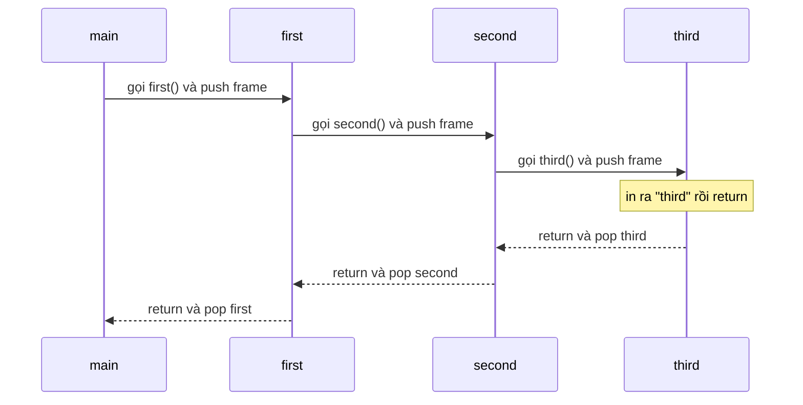
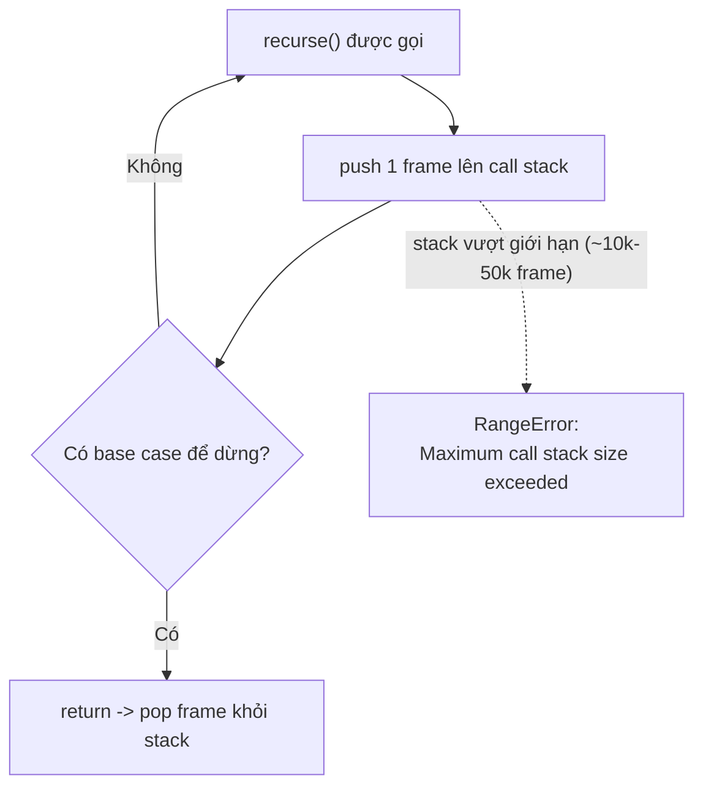

# Function Internals: arguments, Stack

Bài này khám phá cách hàm hoạt động bên trong. **arguments object** (đối tượng arguments) là một danh sách tự động chứa tất cả tham số được truyền vào hàm, kể cả khi bạn không khai báo chúng. **Call Stack** (ngăn xếp lời gọi) là cơ chế JavaScript dùng để theo dõi thứ tự các hàm đang chạy; khi gọi quá nhiều hàm lồng nhau (thường do đệ quy không có điểm dừng) sẽ gây lỗi **Stack Overflow** (tràn ngăn xếp).

---

## 🎯 Cần nắm gì sau bài này?

:::note[Ghi nhớ nhanh — ⭐ là phần quan trọng nhất]

- ⭐ **`arguments` là array-like, KHÔNG phải Array** — không có `map`/`filter`/`reduce`; phải `[...arguments]` hoặc `Array.from()`, và nó không tồn tại trong arrow function. Nên thay bằng **rest parameter**.
- ⭐ **Call Stack đẩy 1 frame mỗi lời gọi và pop khi return (LIFO)** — đọc stack trace từ trên xuống để lần ra hàm nào gọi hàm nào.
- **Stack Overflow** (`RangeError: Maximum call stack size exceeded`) — do đệ quy thiếu base case hoặc dữ liệu lồng quá sâu; JS không có tail-call optimization ở đa số engine nên viết iterative khi cần.
- **JS single-threaded (1 call stack)** — code đồng bộ nặng làm "freeze" UI; dùng async/`setTimeout`/Web Worker để tránh block.
- **Luôn dùng `Number.isNaN`/`Number.isFinite`** thay cho `isNaN`/`isFinite` vì bản `Number.*` không coerce, chính xác hơn.

:::

---

## Mục lục

- [Vì sao cần hiểu cơ chế bên trong?](#vì-sao-cần-hiểu-cơ-chế-bên-trong)
- [arguments object](#arguments-object)
- [Call Stack](#call-stack)
- [Stack Overflow](#stack-overflow)
- [Built-in Functions thường dùng](#built-in-functions-thường-dùng)

---

## Vì sao cần hiểu cơ chế bên trong?

**Vấn đề:** Không nắm `arguments` và call stack thì gặp bug rất khó hiểu — code "trông đúng" nhưng nổ lỗi lạ:

```js
// "Vì sao reduce không chạy?"
function sum() {
  return arguments.reduce((a, b) => a + b, 0); // TypeError: arguments.reduce is not a function
}

// "Vì sao gọi 1 phát mà nổ RangeError?"
function flatten(node) {
  return flatten(node.child); // quên base case → đệ quy vô tận
}
flatten(tree); // RangeError: Maximum call stack size exceeded
```

Không hiểu cơ chế, bạn chỉ thấy thông báo lỗi mà không biết gốc rễ ở đâu.

**Giải pháp:** Hiểu bên trong giúp giải thích và tránh lỗi:

```js
// Biết arguments là array-like (không phải Array) → convert trước khi dùng
function sum() {
  return [...arguments].reduce((a, b) => a + b, 0);
}

// Biết mỗi lời gọi đẩy 1 frame lên stack → thêm base case để stack có điểm pop
function flatten(node) {
  if (!node) return [];                       // base case dừng đệ quy
  return [node.value, ...flatten(node.child)];
}
```

:::tip[Dùng thực tế]

- Đọc **stack trace** khi crash: nhìn thứ tự frame để biết hàm nào gọi hàm nào, lần ngược về nguồn lỗi.
- Debug `Maximum call stack size exceeded`: phần lớn do đệ quy thiếu base case hoặc dữ liệu lồng quá sâu.
- Hiểu vì sao `arguments` không có `map`/`filter`, từ đó chuyển sang **rest parameter** cho code rõ ràng.
- Biết JS single-threaded (1 call stack) để tránh code đồng bộ nặng làm "freeze" UI, chuyển sang async/Worker.

:::

---

## arguments object

`arguments` là **array-like** chứa mọi argument truyền vào function:

```js
function show() {
  console.log(arguments.length); // số argument
  console.log(arguments[0]);     // argument đầu
}

show("a", "b", "c"); // 3, "a"
```

`arguments` **không phải array** — không có `map`, `filter`, `forEach`:

```js
function sum() {
  return arguments.reduce((a, b) => a + b, 0); // TypeError
}

// Convert sang array
function sum() {
  return Array.from(arguments).reduce((a, b) => a + b, 0);
}

// Hoặc spread
function sum() {
  return [...arguments].reduce((a, b) => a + b, 0);
}
```

:::warning[Cần lưu ý]

`arguments` **không tồn tại trong arrow function**:

```js
const fn = () => {
  console.log(arguments); // ReferenceError trong strict mode
                          // hoặc lấy của outer scope
};
```

**Khuyên: thay `arguments` bằng rest parameter**:

```js
// Cũ
function sum() {
  return [...arguments].reduce((a, b) => a + b, 0);
}

// Mới
function sum(...nums) {
  return nums.reduce((a, b) => a + b, 0);
}
```

Rest:
- Là Array thật.
- Hoạt động trong arrow.
- Rõ ý đồ (tên có nghĩa).

:::

---

## Call Stack

**Call Stack** = ngăn xếp các function đang chạy. Khi gọi function, một
**stack frame** được push; khi return, frame bị pop.

```js
function third() {
  console.log("third");
}

function second() {
  third();
}

function first() {
  second();
}

first();
```

Stack tại thời điểm `console.log` chạy:

```
| third  |  ← top
| second |
| first  |
| <main> |  ← bottom
```

Nhìn theo trục thời gian, mỗi lời gọi **push** một frame lên đỉnh stack,
và mỗi `return` **pop** frame đó ra — frame nào push sau cùng thì pop
trước (LIFO):



Khi crash, **stack trace** liệt kê chuỗi gọi này — đọc từ trên xuống là
biết hàm nào gọi hàm nào:

```
Error: oops
    at third (file.js:2)
    at second (file.js:6)
    at first (file.js:10)
    at file.js:13
```

:::info[Phân tích]

**JS là single-threaded** — chỉ có **1 call stack** chính. Khi nó busy,
mọi thứ khác (event, callback, render) phải đợi.

Đó là lý do code blocking gây "freeze" trình duyệt:

```js
function blockUI() {
  const end = Date.now() + 3000;
  while (Date.now() < end) {}
  // 3 giây trình duyệt không phản hồi
}
```

Để tránh block: dùng **async**, **setTimeout**, **Web Worker**:

```js
// Defer phần việc nặng
setTimeout(heavyTask, 0); // chạy sau khi browser nghỉ một nhịp

// Worker thread thật
const worker = new Worker("worker.js");
worker.postMessage(data);
```

Trong Node.js, tương tự: code đồng bộ block toàn bộ event loop. Dùng
`worker_threads` cho CPU-bound, `async I/O` cho I/O-bound.

:::

---

## Stack Overflow

Mỗi engine có **giới hạn độ sâu** của call stack (~10k-50k frame). Vượt
quá → `RangeError: Maximum call stack size exceeded`.

```js
function recurse() {
  return recurse(); // không có điều kiện dừng
}

recurse(); // RangeError
```

Cơ chế: mỗi lời gọi push thêm một frame nhưng không bao giờ pop (vì thiếu
base case), stack cứ cao dần đến khi vượt giới hạn engine và ném lỗi:



Thường gặp khi:

- Đệ quy thiếu base case.
- Đệ quy quá sâu trên dữ liệu lớn (cây deep nested).
- Vòng tròn function gọi nhau.

:::tip[Mẹo]

**Iterative thay cho recursive** với cấu trúc lớn:

```js
// Đệ quy — stack overflow với cây sâu
function depth(node) {
  if (!node) return 0;
  return 1 + Math.max(depth(node.left), depth(node.right));
}

// Lặp — dùng stack thủ công
function depth(root) {
  const stack = [[root, 0]];
  let max = 0;
  while (stack.length) {
    const [node, d] = stack.pop();
    if (!node) continue;
    max = Math.max(max, d);
    stack.push([node.left, d + 1]);
    stack.push([node.right, d + 1]);
  }
  return max;
}
```

JS **không có tail-call optimization** trong các engine phổ biến (Safari
có, V8/Firefox không). Đừng dựa vào TCO — viết iterative khi cần.

:::

---

## Built-in Functions thường dùng

```js
// Type conversion
Number(x)
String(x)
Boolean(x)
parseInt(x, 10)
parseFloat(x)

// Number checks
isNaN(x)
isFinite(x)
Number.isInteger(x)
Number.isSafeInteger(x)

// Encoding
encodeURIComponent("hello world") // "hello%20world"
decodeURIComponent("hello%20world")
btoa("hello")  // base64 encode (browser)
atob("aGVsbG8=") // base64 decode (browser)

// Timer
setTimeout(fn, ms)
setInterval(fn, ms)
clearTimeout(id)
clearInterval(id)
queueMicrotask(fn)
requestAnimationFrame(fn) // browser

// Iteration
Array.from(iterable)
Array.isArray(x)
Object.keys(o), Object.values(o), Object.entries(o)
Object.fromEntries(pairs)
Object.assign(target, ...sources)

// Structured clone (Node 17+, browsers)
structuredClone(obj)
```

:::warning[Cần lưu ý]

**`isNaN`** vs **`Number.isNaN`**:

```js
isNaN("hello");          // true — vì String → NaN
isNaN(undefined);        // true

Number.isNaN("hello");   // false — chỉ true với giá trị NaN thật
Number.isNaN(NaN);       // true
Number.isNaN(undefined); // false
```

Tương tự `isFinite` vs `Number.isFinite`. **Luôn dùng phiên bản
`Number.*`** — chính xác hơn và không coerce.

:::
