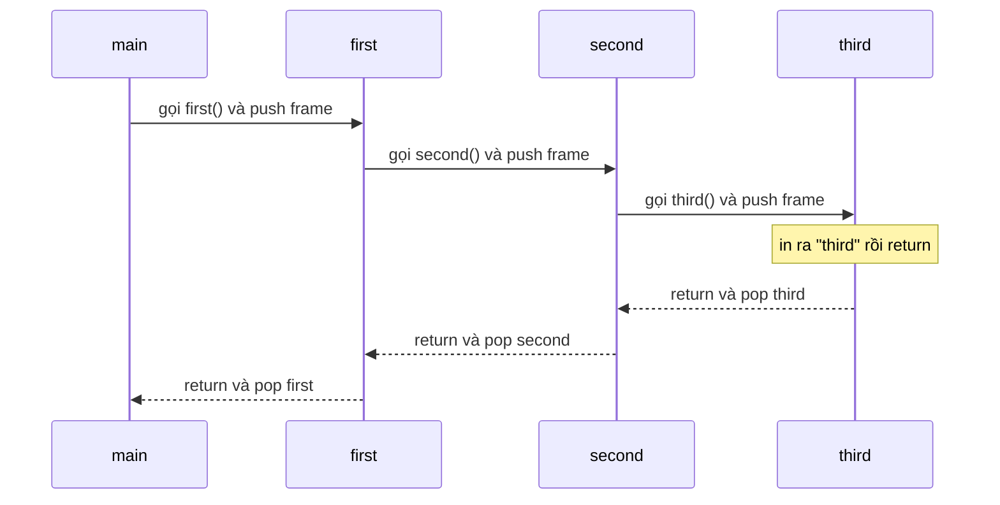
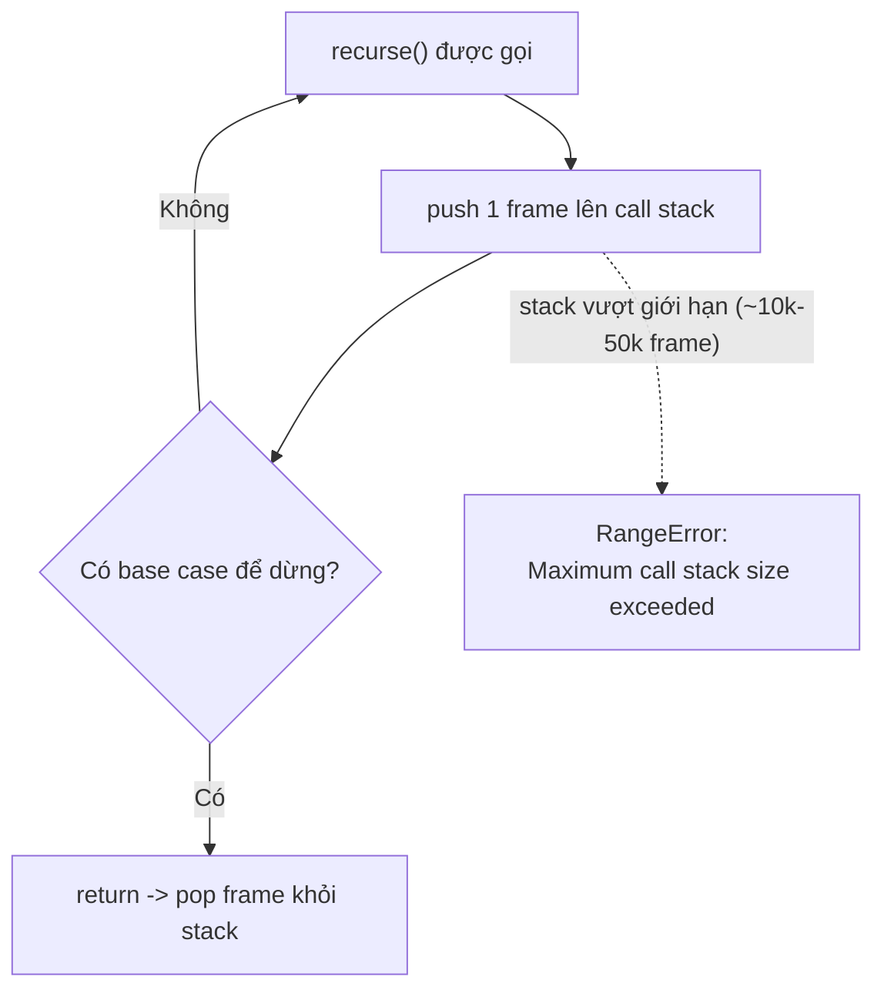

# Function Internals: arguments, Stack

Bài này khám phá cách hàm hoạt động bên trong. **arguments object** (đối tượng arguments) là một danh sách tự động chứa tất cả tham số được truyền vào hàm, kể cả khi bạn không khai báo chúng. **Call Stack** (ngăn xếp lời gọi) là cơ chế JavaScript dùng để theo dõi thứ tự các hàm đang chạy; khi gọi quá nhiều hàm lồng nhau (thường do đệ quy không có điểm dừng) sẽ gây lỗi **Stack Overflow** (tràn ngăn xếp).

[](pathname:///img/javascript/internals.webp)

---

:::note[Ghi nhớ nhanh]

- ⭐ **`arguments` là array-like, KHÔNG phải Array** — không có `map`/`filter`/`reduce`; phải `[...arguments]` hoặc `Array.from()`, và nó không tồn tại trong arrow function. Nên thay bằng **rest parameter**.
- ⭐ **Call Stack đẩy 1 frame mỗi lời gọi và pop khi return (LIFO)** — đọc stack trace từ trên xuống để lần ra hàm nào gọi hàm nào.
- **Stack Overflow** (`RangeError: Maximum call stack size exceeded`) — do đệ quy thiếu base case hoặc dữ liệu lồng quá sâu; JS không có tail-call optimization ở đa số engine nên viết iterative khi cần.
- **JS single-threaded (1 call stack)** — code đồng bộ nặng làm "freeze" UI; dùng async/`setTimeout`/Web Worker để tránh block.
- **Luôn dùng `Number.isNaN`/`Number.isFinite`** thay cho `isNaN`/`isFinite` vì bản `Number.*` không coerce, chính xác hơn.

:::

---

## Mục lục

- [Vì sao cần hiểu cơ chế bên trong?](#vì-sao-cần-hiểu-cơ-chế-bên-trong)
- [arguments object](#arguments-object)
- [Call Stack](#call-stack)
- [Stack Overflow](#stack-overflow)
- [Built-in Functions thường dùng](#built-in-functions-thường-dùng)
- [Câu hỏi phỏng vấn](#câu-hỏi-phỏng-vấn)

---

## Vì sao cần hiểu cơ chế bên trong?

**Vấn đề:** Không nắm `arguments` và call stack thì gặp bug rất khó hiểu — code "trông đúng" nhưng nổ lỗi lạ:

```js
// "Vì sao reduce không chạy?"
function sum() {
  return arguments.reduce((a, b) => a + b, 0); // TypeError: arguments.reduce is not a function
}

// "Vì sao gọi 1 phát mà nổ RangeError?"
function flatten(node) {
  return flatten(node.child); // quên base case → đệ quy vô tận
}
flatten(tree); // RangeError: Maximum call stack size exceeded
```

Không hiểu cơ chế, bạn chỉ thấy thông báo lỗi mà không biết gốc rễ ở đâu.

**Giải pháp:** Hiểu bên trong giúp giải thích và tránh lỗi:

```js
// Biết arguments là array-like (không phải Array) → convert trước khi dùng
function sum() {
  return [...arguments].reduce((a, b) => a + b, 0);
}

// Biết mỗi lời gọi đẩy 1 frame lên stack → thêm base case để stack có điểm pop
function flatten(node) {
  if (!node) return [];                       // base case dừng đệ quy
  return [node.value, ...flatten(node.child)];
}
```

:::tip[Dùng thực tế]

- Đọc **stack trace** khi crash: nhìn thứ tự frame để biết hàm nào gọi hàm nào, lần ngược về nguồn lỗi.
- Debug `Maximum call stack size exceeded`: phần lớn do đệ quy thiếu base case hoặc dữ liệu lồng quá sâu.
- Hiểu vì sao `arguments` không có `map`/`filter`, từ đó chuyển sang **rest parameter** cho code rõ ràng.
- Biết JS single-threaded (1 call stack) để tránh code đồng bộ nặng làm "freeze" UI, chuyển sang async/Worker.

:::

---

## arguments object

`arguments` là **array-like** chứa mọi argument truyền vào function:

```js
function show() {
  console.log(arguments.length); // số argument
  console.log(arguments[0]);     // argument đầu
}

show("a", "b", "c"); // 3, "a"
```

`arguments` **không phải array** — không có `map`, `filter`, `forEach`:

```js
function sum() {
  return arguments.reduce((a, b) => a + b, 0); // TypeError
}

// Convert sang array
function sum() {
  return Array.from(arguments).reduce((a, b) => a + b, 0);
}

// Hoặc spread
function sum() {
  return [...arguments].reduce((a, b) => a + b, 0);
}
```

:::warning[Cần lưu ý]

`arguments` **không tồn tại trong arrow function**:

```js
const fn = () => {
  console.log(arguments); // ReferenceError trong strict mode
                          // hoặc lấy của outer scope
};
```

**Khuyên: thay `arguments` bằng rest parameter**:

```js
// Cũ
function sum() {
  return [...arguments].reduce((a, b) => a + b, 0);
}

// Mới
function sum(...nums) {
  return nums.reduce((a, b) => a + b, 0);
}
```

Rest:
- Là Array thật.
- Hoạt động trong arrow.
- Rõ ý đồ (tên có nghĩa).

:::

---

## Call Stack

**Call Stack** = ngăn xếp các function đang chạy. Khi gọi function, một
**stack frame** được push; khi return, frame bị pop.

```js
function third() {
  console.log("third");
}

function second() {
  third();
}

function first() {
  second();
}

first();
```

Stack tại thời điểm `console.log` chạy:

```
| third  |  ← top
| second |
| first  |
| <main> |  ← bottom
```

Nhìn theo trục thời gian, mỗi lời gọi **push** một frame lên đỉnh stack,
và mỗi `return` **pop** frame đó ra — frame nào push sau cùng thì pop
trước (LIFO):



Khi crash, **stack trace** liệt kê chuỗi gọi này — đọc từ trên xuống là
biết hàm nào gọi hàm nào:

```
Error: oops
    at third (file.js:2)
    at second (file.js:6)
    at first (file.js:10)
    at file.js:13
```

:::info[Phân tích]

**JS là single-threaded** — chỉ có **1 call stack** chính. Khi nó busy,
mọi thứ khác (event, callback, render) phải đợi.

Đó là lý do code blocking gây "freeze" trình duyệt:

```js
function blockUI() {
  const end = Date.now() + 3000;
  while (Date.now() < end) {}
  // 3 giây trình duyệt không phản hồi
}
```

Để tránh block: dùng **async**, **setTimeout**, **Web Worker**:

```js
// Defer phần việc nặng
setTimeout(heavyTask, 0); // chạy sau khi browser nghỉ một nhịp

// Worker thread thật
const worker = new Worker("worker.js");
worker.postMessage(data);
```

Trong Node.js, tương tự: code đồng bộ block toàn bộ event loop. Dùng
`worker_threads` cho CPU-bound, `async I/O` cho I/O-bound.

:::

---

## Stack Overflow

Mỗi engine có **giới hạn độ sâu** của call stack (~10k-50k frame). Vượt
quá → `RangeError: Maximum call stack size exceeded`.

```js
function recurse() {
  return recurse(); // không có điều kiện dừng
}

recurse(); // RangeError
```

Cơ chế: mỗi lời gọi push thêm một frame nhưng không bao giờ pop (vì thiếu
base case), stack cứ cao dần đến khi vượt giới hạn engine và ném lỗi:



Thường gặp khi:

- Đệ quy thiếu base case.
- Đệ quy quá sâu trên dữ liệu lớn (cây deep nested).
- Vòng tròn function gọi nhau.

:::tip[Mẹo]

**Iterative thay cho recursive** với cấu trúc lớn:

```js
// Đệ quy — stack overflow với cây sâu
function depth(node) {
  if (!node) return 0;
  return 1 + Math.max(depth(node.left), depth(node.right));
}

// Lặp — dùng stack thủ công
function depth(root) {
  const stack = [[root, 0]];
  let max = 0;
  while (stack.length) {
    const [node, d] = stack.pop();
    if (!node) continue;
    max = Math.max(max, d);
    stack.push([node.left, d + 1]);
    stack.push([node.right, d + 1]);
  }
  return max;
}
```

JS **không có tail-call optimization** trong các engine phổ biến (Safari
có, V8/Firefox không). Đừng dựa vào TCO — viết iterative khi cần.

:::

---

## Built-in Functions thường dùng

```js
// Type conversion
Number(x)
String(x)
Boolean(x)
parseInt(x, 10)
parseFloat(x)

// Number checks
isNaN(x)
isFinite(x)
Number.isInteger(x)
Number.isSafeInteger(x)

// Encoding
encodeURIComponent("hello world") // "hello%20world"
decodeURIComponent("hello%20world")
btoa("hello")  // base64 encode (browser)
atob("aGVsbG8=") // base64 decode (browser)

// Timer
setTimeout(fn, ms)
setInterval(fn, ms)
clearTimeout(id)
clearInterval(id)
queueMicrotask(fn)
requestAnimationFrame(fn) // browser

// Iteration
Array.from(iterable)
Array.isArray(x)
Object.keys(o), Object.values(o), Object.entries(o)
Object.fromEntries(pairs)
Object.assign(target, ...sources)

// Structured clone (Node 17+, browsers)
structuredClone(obj)
```

:::warning[Cần lưu ý]

**`isNaN`** vs **`Number.isNaN`**:

```js
isNaN("hello");          // true — vì String → NaN
isNaN(undefined);        // true

Number.isNaN("hello");   // false — chỉ true với giá trị NaN thật
Number.isNaN(NaN);       // true
Number.isNaN(undefined); // false
```

Tương tự `isFinite` vs `Number.isFinite`. **Luôn dùng phiên bản
`Number.*`** — chính xác hơn và không coerce.

:::

---

## Câu hỏi phỏng vấn

Những câu thường gặp về chủ đề này. Tự trả lời trước, rồi bấm **Xem đáp án** để đối chiếu.

**1. `arguments` object là gì? Vì sao nó được gọi là `array-like` mà không phải một Array thật?**

<details className="qa">
<summary>Xem đáp án</summary>

`arguments` là object được engine tự tạo bên trong mỗi function thường (không phải arrow), chứa **mọi argument thực sự được truyền vào**, kể cả những argument không có tham số tương ứng trong khai báo.

```js
function show(a) {
  console.log(arguments.length); // 3 — dù chỉ khai báo 1 tham số
  console.log(arguments[2]);     // "c"
}
show("a", "b", "c");
```

Gọi là **array-like** vì nó chỉ có hai đặc điểm giống mảng: các key số (`0`, `1`, `2`...) và property `length`. Nhưng `Object.getPrototypeOf(arguments)` là `Object.prototype` chứ không phải `Array.prototype`, nên nó **không thừa hưởng** bất kỳ method mảng nào (`map`, `filter`, `reduce`, `slice`...), và `Array.isArray(arguments)` trả về `false`. Nó cũng là iterable (spread được) nhưng đó là do có `Symbol.iterator`, không phải vì là mảng.

</details>

**2. Vì sao `arguments.map(...)` hay `arguments.reduce(...)` ném `TypeError`? Có những cách nào chuyển `arguments` thành Array thật?**

<details className="qa">
<summary>Xem đáp án</summary>

Vì `arguments` không kế thừa `Array.prototype`, nên `arguments.map` là `undefined` — gọi `undefined(...)` cho `TypeError: arguments.map is not a function`.

Các cách chuyển sang Array thật:

```js
function sum() {
  const a = [...arguments];                       // spread — gọn nhất
  const b = Array.from(arguments);                // rõ ý đồ, nhận thêm mapFn
  const c = Array.prototype.slice.call(arguments); // cách cũ thời ES5
  return a.reduce((x, y) => x + y, 0);
}
sum(1, 2, 3); // 6
```

`Array.from` còn tiện ở chỗ nhận tham số thứ hai để map luôn: `Array.from(arguments, Number)`.

Tuy vậy giải pháp tốt nhất là **không chuyển đổi gì cả** — dùng rest parameter ngay từ đầu:

```js
function sum(...nums) {
  return nums.reduce((a, b) => a + b, 0); // nums đã là Array thật
}
```

</details>

**3. So sánh `arguments` với `rest parameter` (`...args`). Vì sao code hiện đại khuyên bỏ hẳn `arguments`?**

<details className="qa">
<summary>Xem đáp án</summary>

| | `arguments` | Rest parameter `...args` |
|---|---|---|
| Kiểu | Array-like, không có method mảng | **Array thật** |
| Phạm vi | Chỉ có trong function thường | Dùng được cả trong arrow |
| Nội dung | **Tất cả** argument truyền vào | Chỉ những argument **còn lại** sau các tham số đã khai báo |
| Tên gọi | Cố định, không diễn đạt ý nghĩa | Tự đặt tên có nghĩa (`...nums`, `...handlers`) |
| Tối ưu | Có thể cản trở engine tối ưu, sloppy mode còn liên kết ngược với tham số | Rõ ràng, thân thiện với engine |

```js
function log(prefix, ...rest) {
  console.log(prefix, rest);   // rest là Array, không chứa prefix
}
```

Lý do khuyên bỏ `arguments`: nó không hoạt động trong arrow (kiểu hàm chiếm đa số code hiện đại), phải convert mới dùng được method mảng, và làm signature của hàm trở nên "vô hình" với người đọc lẫn với TypeScript. Rest parameter giải quyết trọn vẹn cả ba điểm.

</details>

**4. Truy cập `arguments` bên trong một arrow function thì điều gì xảy ra? Giải thích lý do.**

<details className="qa">
<summary>Xem đáp án</summary>

Arrow function **không tạo binding `arguments` riêng**. Vì thế `arguments` được tra như một biến thường theo scope chain:

- Nếu arrow nằm **bên trong một function thường**, nó lấy `arguments` của hàm bao ngoài đó.
- Nếu không có hàm thường nào bao ngoài (arrow ở top-level module/strict mode), sẽ ném `ReferenceError: arguments is not defined`.

```js
function outer() {
  const inner = () => arguments[0];
  return inner("x");     // "a" — arguments của outer, không phải của inner
}
outer("a", "b");

const f = () => arguments; // ReferenceError khi gọi ở top-level
```

Đây là hành vi song song với `this`: arrow không có `this`, `arguments`, `super`, `new.target` của riêng nó mà mượn từ scope nơi định nghĩa. Giải pháp là dùng rest parameter — hoạt động bình thường trong arrow và cho ra Array thật: `const f = (...args) => args`.

</details>

**5. `Call Stack` là gì? Mô tả chính xác điều gì xảy ra với `stack frame` khi một hàm được gọi và khi nó `return`.**

<details className="qa">
<summary>Xem đáp án</summary>

**Call Stack** là cấu trúc dữ liệu kiểu ngăn xếp mà engine dùng để theo dõi các hàm đang thực thi. Mỗi lời gọi hàm tạo ra một **stack frame** (execution context) lưu: tham số, biến cục bộ, giá trị `this`, và **địa chỉ quay về** — vị trí trong hàm gọi để tiếp tục sau khi hàm con xong.

Khi **gọi hàm**: engine tạo frame mới và **push** lên đỉnh stack; quyền điều khiển chuyển sang hàm đó. Khi hàm **return** (hoặc chạy hết thân hàm, hoặc ném lỗi): frame ở đỉnh bị **pop** ra, bộ nhớ cục bộ của nó được giải phóng, giá trị trả về chuyển cho frame bên dưới và chương trình chạy tiếp từ địa chỉ quay về.

```js
function third() { console.log("third"); }
function second() { third(); }
function first() { second(); }
first();
// Stack lúc console.log chạy: third | second | first | <main>
```

Ở đáy stack luôn là global execution context (`<main>`); stack rỗng nghĩa là code đồng bộ đã chạy xong.

</details>

**6. Vì sao Call Stack hoạt động theo nguyên tắc LIFO? Cho một stack trace, bạn đọc theo thứ tự nào để biết hàm nào gọi hàm nào?**

<details className="qa">
<summary>Xem đáp án</summary>

LIFO (Last In — First Out) là hệ quả tự nhiên của cách hàm lồng nhau: hàm được gọi sau cùng phải hoàn thành trước thì hàm gọi nó mới tiếp tục được. Nếu pop theo thứ tự khác, engine sẽ không biết quay về đâu — địa chỉ trả về và biến cục bộ của các frame đang chờ sẽ mất ý nghĩa.

**Đọc stack trace:** dòng **trên cùng** là nơi lỗi thực sự xảy ra (frame đang ở đỉnh stack), rồi càng đi xuống càng là hàm gọi ở tầng ngoài, cho tới entry point.

```
Error: oops
    at third (file.js:2)     ← nơi ném lỗi
    at second (file.js:6)    ← second gọi third
    at first (file.js:10)    ← first gọi second
    at file.js:13            ← top-level gọi first
```

Vậy chiều "ai gọi ai" đọc từ **dưới lên**, còn chiều "lỗi phát sinh ở đâu" đọc từ **trên xuống**. Khi debug, thường nhìn dòng đầu tiên thuộc code của mình (bỏ qua các frame trong thư viện).

</details>

**7. Cho `first()` gọi `second()`, `second()` gọi `third()` — hãy vẽ trạng thái call stack tại thời điểm `third` đang chạy, rồi mô tả thứ tự pop.**

<details className="qa">
<summary>Xem đáp án</summary>

Tại thời điểm `third` đang chạy, stack có 4 frame:

```
| third  |  ← top (đang thực thi)
| second |
| first  |
| <main> |  ← bottom (global context)
```

Diễn biến push: `<main>` gọi `first` → push `first`; `first` gọi `second` → push `second`; `second` gọi `third` → push `third`.

Thứ tự pop ngược lại, đúng nguyên tắc LIFO:

1. `third` chạy xong / `return` → pop `third`, điều khiển về `second`.
2. `second` không còn gì để làm → pop `second`, về `first`.
3. `first` return → pop `first`, về `<main>`.
4. Hết code đồng bộ → stack chỉ còn `<main>` (rồi rỗng khi chương trình kết thúc).

Nếu `third` ném lỗi mà không ai `catch`, các frame vẫn bị pop lần lượt trong lúc lỗi "nổi" lên trên — và stack trace chính là ảnh chụp stack ngay lúc lỗi được tạo ra.

</details>

**8. Lỗi `RangeError: Maximum call stack size exceeded` xuất hiện khi nào? Nêu ít nhất hai nguyên nhân phổ biến trong code thật.**

<details className="qa">
<summary>Xem đáp án</summary>

Xuất hiện khi số frame trên call stack vượt giới hạn của engine (cỡ hàng chục nghìn frame, tùy engine và kích thước từng frame). Mỗi lời gọi push thêm frame mà không có lời gọi nào pop ra, stack cao dần rồi tràn.

Nguyên nhân phổ biến:

- **Đệ quy thiếu base case** — kinh điển nhất: `function recurse() { return recurse(); }`.
- **Đệ quy quá sâu trên dữ liệu lớn** — duyệt cây/linked list lồng vài chục nghìn tầng, dù logic hoàn toàn đúng.
- **Hai hàm gọi vòng tròn** — `a()` gọi `b()`, `b()` gọi lại `a()`.
- **Vô tình tự gọi qua getter/setter hoặc proxy** — ví dụ `get value() { return this.value; }`.
- **Truyền mảng cực lớn vào hàm dùng spread** — `Math.max(...hugeArray)` đẩy hàng trăm nghìn argument lên stack.

Cách xử lý: thêm base case, giới hạn độ sâu, hoặc chuyển sang vòng lặp với stack thủ công.

</details>

**9. "JavaScript là `single-threaded`, chỉ có một call stack" nghĩa là gì? Vì sao một vòng `while` chạy 3 giây làm treo toàn bộ UI trình duyệt?**

<details className="qa">
<summary>Xem đáp án</summary>

Nghĩa là tại một thời điểm chỉ có **một luồng thực thi JS với một call stack duy nhất** — không có hai đoạn code JS chạy song song trên cùng luồng. Mọi thứ khác (callback của `setTimeout`, event handler, Promise, và cả việc render của trình duyệt) đều phải chờ stack rỗng mới tới lượt.

```js
function blockUI() {
  const end = Date.now() + 3000;
  while (Date.now() < end) {}   // giữ frame trên stack suốt 3 giây
}
```

Trong 3 giây đó frame của `blockUI` không pop, event loop không lấy được task nào từ queue, trình duyệt không repaint, click và scroll không phản hồi — đó chính là "freeze".

Cách tránh: chia nhỏ công việc rồi `setTimeout(..., 0)` để nhường nhịp cho browser; dùng async cho I/O; đẩy tính toán nặng sang **Web Worker** (Node.js là `worker_threads`) — worker có luồng và call stack riêng nên không chặn luồng chính.

</details>

**10. Khi phải duyệt một cây lồng rất sâu, làm sao tránh tràn stack? So sánh cách viết đệ quy với cách viết `iterative` dùng stack thủ công.**

<details className="qa">
<summary>Xem đáp án</summary>

Ý tưởng: thay vì để engine giữ trạng thái trên call stack, ta **tự quản lý một mảng làm stack** trên heap — heap lớn hơn stack rất nhiều nên độ sâu gần như chỉ giới hạn bởi bộ nhớ.

```js
// Đệ quy — mỗi tầng một frame, cây sâu là tràn
function depth(node) {
  if (!node) return 0;
  return 1 + Math.max(depth(node.left), depth(node.right));
}

// Iterative — stack thủ công, không tràn
function depthIter(root) {
  const stack = [[root, 0]];
  let max = 0;
  while (stack.length) {
    const [node, d] = stack.pop();
    if (!node) continue;
    max = Math.max(max, d);
    stack.push([node.left, d + 1], [node.right, d + 1]);
  }
  return max;
}
```

| | Đệ quy | Iterative |
|---|---|---|
| Độ sâu tối đa | Giới hạn call stack | Giới hạn bộ nhớ heap |
| Dễ đọc | Rất gọn, sát định nghĩa bài toán | Dài hơn, phải tự quản lý trạng thái |

Kinh nghiệm: dữ liệu nhỏ và có kiểm soát thì dùng đệ quy cho dễ đọc; dữ liệu do người dùng/hệ thống sinh ra với độ sâu không đoán trước thì viết iterative.

</details>

**11. `Tail-call optimization` là gì? Các engine phổ biến (V8, SpiderMonkey, JavaScriptCore) hỗ trợ tới đâu, và điều đó ảnh hưởng thế nào tới cách bạn viết đệ quy?**

<details className="qa">
<summary>Xem đáp án</summary>

**Tail call** là lời gọi hàm nằm ở **vị trí cuối cùng** của một hàm — kết quả của nó được trả về ngay, không cần làm gì thêm. Khi đó frame hiện tại không còn việc gì để làm, nên về lý thuyết engine có thể **tái sử dụng frame đó** thay vì push frame mới: đệ quy chạy với bộ nhớ stack hằng số. Đó là **tail-call optimization (TCO)**, được đưa vào chuẩn ES6 dưới tên "proper tail calls".

```js
// Tail call: kết quả của fact được return trực tiếp
function fact(n, acc = 1) {
  if (n <= 1) return acc;
  return fact(n - 1, n * acc);
}

// KHÔNG phải tail call: còn phép nhân sau khi hàm con trả về
function factBad(n) {
  return n <= 1 ? 1 : n * factBad(n - 1);
}
```

Thực tế: chỉ **JavaScriptCore (Safari)** triển khai; **V8** và **SpiderMonkey** không (V8 từng thử rồi bỏ). Vì vậy **đừng bao giờ dựa vào TCO** — code chạy tốt trên Safari vẫn tràn stack trên Chrome/Node. Khi độ sâu đệ quy không đoán trước, hãy viết vòng lặp hoặc dùng stack thủ công / trampoline.

</details>

**12. Đoán output: `isNaN("hello")` và `Number.isNaN("hello")` trả về gì? Giải thích vì sao khác nhau và nên dùng cái nào.**

<details className="qa">
<summary>Xem đáp án</summary>

```js
isNaN("hello");          // true
Number.isNaN("hello");   // false
```

`isNaN` (hàm global cũ) **ép kiểu** đối số sang number trước rồi mới kiểm tra: `Number("hello")` là `NaN` nên trả `true`. Nó thực chất trả lời câu hỏi "giá trị này không chuyển được thành số phải không?", chứ không phải "giá trị này có phải `NaN` không".

`Number.isNaN` (ES6) **không ép kiểu**: chỉ trả `true` khi đối số đúng là giá trị `NaN`.

```js
isNaN(undefined);         // true   — Number(undefined) là NaN
Number.isNaN(undefined);  // false
isNaN("");                // false  — Number("") là 0
Number.isNaN(NaN);        // true
```

**Nên dùng `Number.isNaN`** vì ngữ nghĩa rõ ràng, không có bất ngờ do coercion. Tương tự, dùng `Number.isFinite` thay `isFinite`. Nếu mục đích thật sự là "chuỗi này có parse được thành số không" thì viết tường minh: `Number.isNaN(Number(x))`.

</details>

**13. `setTimeout(fn, 0)` có chạy hàm ngay lập tức không? Nó liên quan gì tới call stack và event loop?**

<details className="qa">
<summary>Xem đáp án</summary>

**Không.** `setTimeout` chỉ **đăng ký** callback với timer của runtime rồi trả về ngay. Sau khi hết thời gian chờ, callback được đưa vào **macrotask queue**. Event loop chỉ lấy task từ queue khi **call stack đã rỗng** — tức toàn bộ code đồng bộ đang chạy phải xong trước.

```js
console.log("1");
setTimeout(() => console.log("2"), 0);
Promise.resolve().then(() => console.log("3"));
console.log("4");
// Output: 1 → 4 → 3 → 2
```

`3` in trước `2` vì microtask queue (Promise) luôn được xử lý cạn trước macrotask. Ngoài ra `0` không có nghĩa là 0ms: trình duyệt ép mức tối thiểu khoảng 4ms khi timer lồng nhiều tầng, và nếu stack đang bận 3 giây thì callback cũng phải chờ đủ 3 giây.

Ứng dụng: `setTimeout(heavyTask, 0)` để nhường một nhịp cho trình duyệt repaint, hoặc chia nhỏ công việc nặng thành nhiều task tránh treo UI.

</details>

**14. So sánh `parseInt("08")`, `Number("08")` và `+"08"`. Vì sao luôn nên truyền `radix` cho `parseInt`?**

<details className="qa">
<summary>Xem đáp án</summary>

Cả ba đều cho `8` trong JS hiện đại. Khác biệt nằm ở cách xử lý chuỗi "không sạch":

```js
parseInt("08");     // 8
Number("08");       // 8
+"08";              // 8

parseInt("12px");   // 12   — đọc tới ký tự không hợp lệ thì dừng
Number("12px");     // NaN  — phải là số hợp lệ toàn phần
parseInt("");       // NaN
Number("");         // 0    — chuỗi rỗng thành 0
parseInt("0x1A");   // 26   — tự nhận diện tiền tố hex
```

`Number(x)` và `+x` hoạt động giống nhau (đều dùng ToNumber), chỉ khác về độ dễ đọc.

**Vì sao cần `radix`:** `parseInt(str, radix)` không có radix sẽ **tự đoán** hệ cơ số theo tiền tố — `"0x..."` thành hệ 16. Các engine rất cũ còn coi tiền tố `"0"` là hệ 8, khiến `parseInt("08")` từng ra `0`. Truyền `parseInt(x, 10)` loại bỏ mọi mơ hồ. Bẫy kinh điển liên quan:

```js
["1", "2", "3"].map(parseInt); // [1, NaN, NaN] — index bị nhận làm radix
["1", "2", "3"].map((s) => parseInt(s, 10)); // [1, 2, 3]
```

</details>
