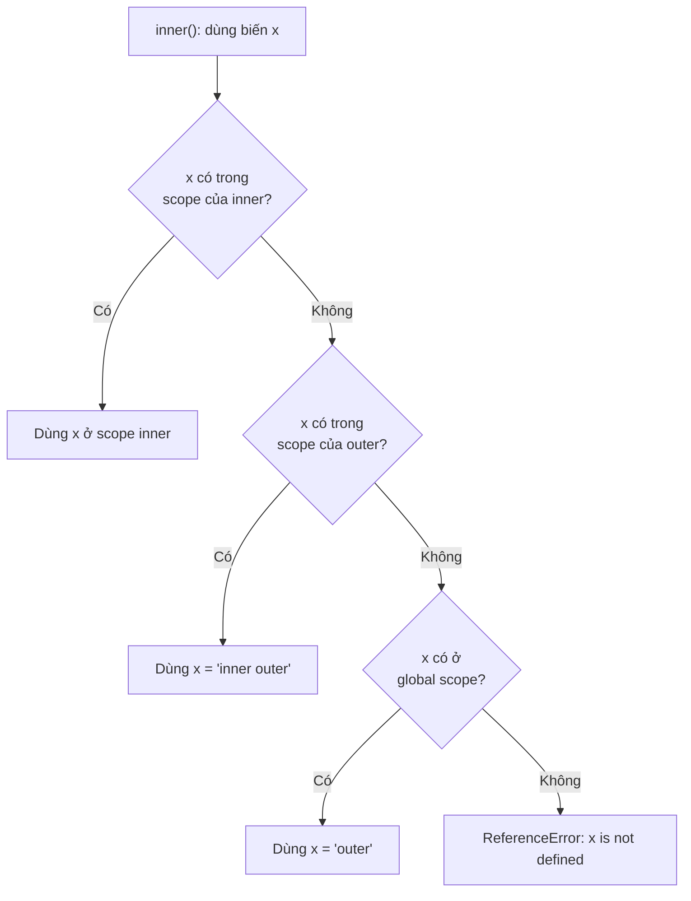
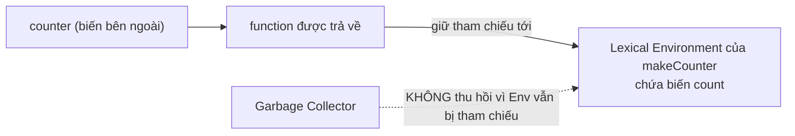

# Recursion, Lexical Scope, Closures

Bài này giới thiệu ba khái niệm quan trọng về hàm. **Recursion** (đệ quy) là khi một hàm tự gọi lại chính nó để giải quyết bài toán theo từng bước nhỏ hơn. **Lexical scope** (phạm vi từ vựng) là quy tắc xác định một hàm có thể "nhìn thấy" và dùng được những biến nào dựa trên vị trí nó được viết trong code. **Closure** (bao đóng) là khả năng một hàm vẫn ghi nhớ và truy cập được các biến ở phạm vi bên ngoài ngay cả sau khi hàm cha đã chạy xong.

---

:::note[Ghi nhớ nhanh]

- ⭐ **Closure** — hàm trả về vẫn nhớ và truy cập được biến của hàm cha sau khi hàm cha đã chạy xong, nhờ đó tạo state "riêng tư" mà bên ngoài không chạm tới được.
- ⭐ **Lexical scope** — biến được xác định theo NƠI VIẾT code (scope chain từ trong ra ngoài đến global), không phải nơi gọi.
- **Recursion** cần đủ **base case** (điều kiện dừng) và **recursive case** (gọi lại với input nhỏ hơn).
- **Use cases closure**: private state, memoization (cache), currying, event handler giữ context, và React hooks (`useState`/`useEffect`).
- **Pitfalls**: memory leak (closure giữ biến to → gán `null` để giải phóng), stale closure trong React (`useEffect` deps rỗng capture state cũ → dùng updater `setCount(c => c + 1)`), và khác biệt `var` vs `let` trong vòng lặp.

:::

---

## Mục lục

- [Vì sao closure ra đời?](#vì-sao-closure-ra-đời)
- [Recursion (Đệ quy)](#recursion-đệ-quy)
- [Lexical Scope](#lexical-scope)
- [Closures](#closures)
- [Use cases của Closure](#use-cases-của-closure)
- [Closure pitfalls](#closure-pitfalls)
- [Câu hỏi phỏng vấn](#câu-hỏi-phỏng-vấn)

---

## Vì sao closure ra đời?

JS không có từ khóa `private` cho biến trong hàm như nhiều ngôn ngữ khác.
Trước khi tận dụng closure, để giữ trạng thái qua nhiều lần gọi người ta
phải đặt biến ở phạm vi global — dễ bị code khác sửa nhầm và làm bẩn
global.

**Vấn đề:**

```js
// Đếm số lần gọi — phải dùng biến global
let count = 0;

function increment() {
  count++;
  return count;
}

increment(); // 1
increment(); // 2

// Bất kỳ ai cũng sửa được, vô tình ghi đè
count = 999;
increment(); // 1000 — sai, state bị phá
```

**Giải pháp:**

```js
// Closure giữ state riêng tư, ngoài không chạm tới được
function makeCounter() {
  let count = 0; // sống nhờ closure, không nằm ở global
  return function () {
    count++;
    return count;
  };
}

const next = makeCounter();
next(); // 1
next(); // 2
// Không cách nào truy cập hay ghi đè count từ bên ngoài
```

Closure cho phép hàm trả về **vẫn nhớ** được biến của hàm cha sau khi hàm
cha đã chạy xong, nhờ đó tạo ra biến "riêng tư" và đóng gói trạng thái.

:::tip[Dùng thực tế]

- **State riêng tư**: counter, bộ tạo ID, biến cấu hình mà code ngoài
  không được sửa trực tiếp.
- **Factory hàm**: tạo hàm chuyên biệt từ hàm tổng quát (currying,
  `greet("Hi")` ở mục dưới), hoặc hàm log có sẵn prefix.
- **Event handler giữ context**: callback nhớ `label`/`id` của lúc đăng
  ký mà không cần biến global.
- **React hooks**: `useState`, `useEffect` dựa hoàn toàn vào closure để
  giữ state giữa các lần render.

:::

---

## Recursion (Đệ quy)

Function **gọi lại chính nó** với input nhỏ dần đến base case.

```js
function factorial(n) {
  if (n <= 1) return 1;       // base case
  return n * factorial(n - 1); // recursive case
}

factorial(5); // 120
```

Cấu trúc đệ quy:

1. **Base case** — điều kiện dừng (bắt buộc).
2. **Recursive case** — gọi chính nó với input nhỏ hơn.

Ví dụ duyệt cây:

```js
function sumTree(node) {
  if (!node) return 0;
  return node.value + sumTree(node.left) + sumTree(node.right);
}
```

---

## Lexical Scope

**Lexical** = "theo cú pháp" — scope của biến được xác định **tại nơi
viết code**, không phải tại nơi gọi.

```js
const x = "outer";

function outer() {
  const x = "inner outer";

  function inner() {
    console.log(x); // tìm trong scope viết code
  }

  return inner;
}

const fn = outer();
fn(); // "inner outer" — không phải "outer"
```

Khi `inner` được viết bên trong `outer`, nó **vĩnh viễn** truy cập được
biến của `outer`, dù `outer` đã return.

Khi dùng một biến, engine dò theo **scope chain** — từ trong ra ngoài, hàm
trong cùng trước, rồi ngược lên các scope cha, cuối cùng đến global; hễ
gặp biến ở đâu thì dừng:



---

## Closures

**Closure** = function **giữ tham chiếu** đến biến của scope ngoài, kể
cả khi scope đó đã kết thúc.

```js
function makeCounter() {
  let count = 0;

  return function () {
    count++;
    return count;
  };
}

const counter = makeCounter();
counter(); // 1
counter(); // 2
counter(); // 3
```

Khi `makeCounter` chạy xong, biến `count` **đáng lẽ bị GC**. Nhưng vì
function trả về vẫn tham chiếu `count`, nó được **giữ sống** trong
closure.

Sơ đồ dưới cho thấy vì sao: function được trả về giữ tham chiếu tới
Lexical Environment của `makeCounter`, nên Garbage Collector không thu hồi
môi trường đó — `count` sống theo closure thay vì bị dọn dẹp:



Mỗi lần gọi `makeCounter` tạo một closure mới:

```js
const a = makeCounter();
const b = makeCounter();
a(); // 1
a(); // 2
b(); // 1 — độc lập với a
```

:::info[Phân tích]

**Closure là khái niệm trung tâm của JS**. Mọi function tạo trong JS
thực ra đều là closure — chỉ là có hoặc không truy cập biến outer.

Mechanism kỹ thuật:

1. Mỗi function khi gọi tạo một **Lexical Environment** chứa biến local.
2. Function tham chiếu đến environment của scope cha (lexical link).
3. Khi function chứa được giữ ở đâu đó (callback, return value, event
   listener), environment cha không bị GC.

**Câu hỏi phỏng vấn kinh điển:**

```js
function createFunctions() {
  const fns = [];
  for (var i = 0; i < 3; i++) {
    fns.push(function () { return i; });
  }
  return fns;
}

const [a, b, c] = createFunctions();
a(); // 3
b(); // 3
c(); // 3 — vì var i được share, đã là 3 khi return
```

Đổi `var` thành `let`:

```js
for (let i = 0; i < 3; i++) {
  fns.push(function () { return i; });
}
// Kết quả: 0, 1, 2 — mỗi iteration tạo binding i mới
```

Hiểu được cơ chế "binding mới mỗi iteration của `for (let)`" là nắm
chắc closure + scope.

:::

---

## Use cases của Closure

**1. Private state** — biến không truy cập từ ngoài:

```js
function createAccount(initial) {
  let balance = initial;

  return {
    deposit(n) { balance += n; },
    withdraw(n) { balance -= n; },
    getBalance() { return balance; },
  };
}

const acc = createAccount(100);
acc.deposit(50);
acc.getBalance(); // 150
acc.balance;      // undefined — không truy cập được trực tiếp
```

**2. Memoization** — cache kết quả:

```js
function memoize(fn) {
  const cache = new Map();
  return function (...args) {
    const key = JSON.stringify(args);
    if (cache.has(key)) return cache.get(key);
    const result = fn(...args);
    cache.set(key, result);
    return result;
  };
}

const slowFib = (n) => n < 2 ? n : slowFib(n - 1) + slowFib(n - 2);
const fastFib = memoize(slowFib);
```

**3. Currying** — chia argument thành nhiều bước:

```js
const add = (a) => (b) => (c) => a + b + c;
add(1)(2)(3); // 6

const greet = (greeting) => (name) => `${greeting}, ${name}!`;
const hi = greet("Hi");
hi("An");    // "Hi, An!"
hi("Bình");  // "Hi, Bình!"
```

**4. Event handler giữ context**:

```js
function setupButton(id, label) {
  document.getElementById(id).addEventListener("click", () => {
    console.log(`Clicked ${label}`); // label được closure giữ
  });
}
```

**5. React hooks** — `useState`, `useEffect` đều dựa trên closure để
giữ state giữa các render.

---

## Closure pitfalls

:::warning[Cần lưu ý]

**Memory leak** — closure giữ biến to:

```js
function setup() {
  const hugeData = new Array(1000000).fill(0);

  document.getElementById("btn").addEventListener("click", () => {
    console.log("clicked"); // không dùng hugeData
    // nhưng closure vẫn giữ tham chiếu → hugeData không được GC
  });
}
```

Engine có thể **không tối ưu** — khó biết closure dùng biến nào. Cách
phòng:

```js
function setup() {
  let hugeData = new Array(1000000).fill(0);
  processInitial(hugeData);
  hugeData = null; // giải phóng tham chiếu

  document.getElementById("btn").addEventListener("click", () => {
    console.log("clicked");
  });
}
```

**Stale closure** trong React — capture state cũ:

```js
function Counter() {
  const [count, setCount] = useState(0);

  useEffect(() => {
    const timer = setInterval(() => {
      setCount(count + 1); // count = 0 mãi mãi
    }, 1000);
    return () => clearInterval(timer);
  }, []); // deps rỗng → closure capture count = 0
}

// Fix: dùng updater function
setCount(c => c + 1);
```

Đây là pitfall **rất phổ biến** trong React hooks — nguồn của nhiều bug
khó debug.

:::

:::tip[Mẹo]

**Đọc closure như đọc tree** — từ function trong cùng, ngược lên outer
scope, đến global. Mỗi biến truy cập, hỏi: "Biến này được khai báo ở
đâu? Có nằm trong scope chain của function này không?"

Pattern hay dùng trong phỏng vấn:

```js
// Implement throttle dùng closure
function throttle(fn, delay) {
  let lastCall = 0;
  return function (...args) {
    const now = Date.now();
    if (now - lastCall >= delay) {
      lastCall = now;
      return fn(...args);
    }
  };
}

// Implement once
function once(fn) {
  let called = false;
  let result;
  return function (...args) {
    if (!called) {
      called = true;
      result = fn(...args);
    }
    return result;
  };
}
```

Closure giữ `lastCall`/`called` qua các lần gọi — không cần biến global.

:::

---

## Câu hỏi phỏng vấn

Những câu thường gặp về chủ đề này. Tự trả lời trước, rồi đối chiếu lại với nội dung phía trên.

1. Một hàm đệ quy bắt buộc phải có những thành phần nào? Điều gì xảy ra nếu thiếu `base case`?
2. `Lexical scope` nghĩa là gì? Phạm vi của một biến được quyết định tại nơi VIẾT hàm hay nơi GỌI hàm?
3. Mô tả `scope chain`: khi engine gặp một biến, nó tìm theo thứ tự nào và dừng lại ở đâu? Nếu không tìm thấy thì sao?
4. `Closure` là gì? Giải thích cơ chế vì sao biến của hàm cha không bị `Garbage Collector` thu hồi sau khi hàm cha đã `return`.
5. Với hàm factory `makeCounter()`, gọi hai lần tạo ra `a` và `b` — hai counter này có dùng chung biến `count` không? Vì sao?
6. Câu kinh điển: vòng `for (var i = 0; i < 3; i++)` push vào mảng các hàm trả về `i`. Gọi từng hàm ra kết quả gì? Đổi `var` thành `let` thì sao — giải thích cơ chế.
7. Ngoài việc đổi sang `let`, còn cách nào khác để sửa bài toán vòng lặp trên? (gợi ý: `IIFE`, tham số thứ ba của `setTimeout`, `forEach`)
8. `IIFE` là gì và trước khi có ES Module người ta dùng nó để giải quyết vấn đề gì?
9. Làm sao tạo biến "riêng tư" bằng closure (`module pattern`)? So với `#privateField` của `class` thì khác nhau ở điểm nào?
10. `Currying` là gì? Viết hàm cho phép gọi `add(1)(2)(3)`. Currying dựa vào closure ở chỗ nào?
11. Phân biệt `currying` và `partial application`. Cho ví dụ mỗi loại.
12. Tự implement `memoize` bằng closure. Dùng `JSON.stringify(args)` làm cache key có hạn chế gì?
13. Implement `once`, `debounce` và `throttle` bằng closure. `debounce` và `throttle` khác nhau ở hành vi nào, mỗi cái hợp với tình huống nào?
14. Closure gây `memory leak` như thế nào? Cho ví dụ một event listener giữ sống mảng lớn và cách phòng tránh.
15. `Stale closure` trong React hooks là gì? Vì sao `setInterval` trong `useEffect` với deps rỗng luôn thấy `count = 0`, và vì sao `setCount(c => c + 1)` sửa được?
16. Khi nào nên chọn đệ quy, khi nào nên chọn vòng lặp? Đệ quy trên dữ liệu lớn có rủi ro gì về mặt call stack?
