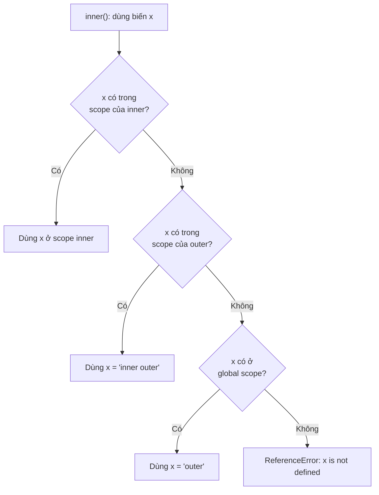
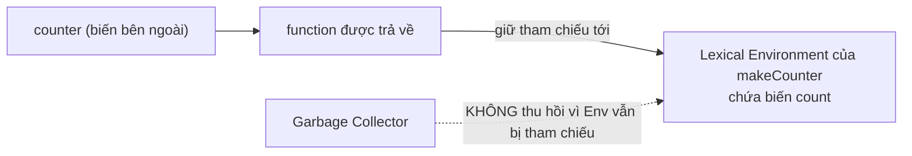

# Recursion, Lexical Scope, Closures

Bài này giới thiệu ba khái niệm quan trọng về hàm. **Recursion** (đệ quy) là khi một hàm tự gọi lại chính nó để giải quyết bài toán theo từng bước nhỏ hơn. **Lexical scope** (phạm vi từ vựng) là quy tắc xác định một hàm có thể "nhìn thấy" và dùng được những biến nào dựa trên vị trí nó được viết trong code. **Closure** (bao đóng) là khả năng một hàm vẫn ghi nhớ và truy cập được các biến ở phạm vi bên ngoài ngay cả sau khi hàm cha đã chạy xong.

[](pathname:///img/javascript/advanced.webp)

---

:::note[Ghi nhớ nhanh]

- ⭐ **Closure** — hàm trả về vẫn nhớ và truy cập được biến của hàm cha sau khi hàm cha đã chạy xong, nhờ đó tạo state "riêng tư" mà bên ngoài không chạm tới được.
- ⭐ **Lexical scope** — biến được xác định theo NƠI VIẾT code (scope chain từ trong ra ngoài đến global), không phải nơi gọi.
- **Recursion** cần đủ **base case** (điều kiện dừng) và **recursive case** (gọi lại với input nhỏ hơn).
- **Use cases closure**: private state, memoization (cache), currying, event handler giữ context, và React hooks (`useState`/`useEffect`).
- **Pitfalls**: memory leak (closure giữ biến to → gán `null` để giải phóng), stale closure trong React (`useEffect` deps rỗng capture state cũ → dùng updater `setCount(c => c + 1)`), và khác biệt `var` vs `let` trong vòng lặp.

:::

---

## Mục lục

- [Vì sao closure ra đời?](#vì-sao-closure-ra-đời)
- [Recursion (Đệ quy)](#recursion-đệ-quy)
- [Lexical Scope](#lexical-scope)
- [Closures](#closures)
- [Use cases của Closure](#use-cases-của-closure)
- [Closure pitfalls](#closure-pitfalls)
- [Câu hỏi phỏng vấn](#câu-hỏi-phỏng-vấn)

---

## Vì sao closure ra đời?

JS không có từ khóa `private` cho biến trong hàm như nhiều ngôn ngữ khác.
Trước khi tận dụng closure, để giữ trạng thái qua nhiều lần gọi người ta
phải đặt biến ở phạm vi global — dễ bị code khác sửa nhầm và làm bẩn
global.

**Vấn đề:**

```js
// Đếm số lần gọi — phải dùng biến global
let count = 0;

function increment() {
  count++;
  return count;
}

increment(); // 1
increment(); // 2

// Bất kỳ ai cũng sửa được, vô tình ghi đè
count = 999;
increment(); // 1000 — sai, state bị phá
```

**Giải pháp:**

```js
// Closure giữ state riêng tư, ngoài không chạm tới được
function makeCounter() {
  let count = 0; // sống nhờ closure, không nằm ở global
  return function () {
    count++;
    return count;
  };
}

const next = makeCounter();
next(); // 1
next(); // 2
// Không cách nào truy cập hay ghi đè count từ bên ngoài
```

Closure cho phép hàm trả về **vẫn nhớ** được biến của hàm cha sau khi hàm
cha đã chạy xong, nhờ đó tạo ra biến "riêng tư" và đóng gói trạng thái.

:::tip[Dùng thực tế]

- **State riêng tư**: counter, bộ tạo ID, biến cấu hình mà code ngoài
  không được sửa trực tiếp.
- **Factory hàm**: tạo hàm chuyên biệt từ hàm tổng quát (currying,
  `greet("Hi")` ở mục dưới), hoặc hàm log có sẵn prefix.
- **Event handler giữ context**: callback nhớ `label`/`id` của lúc đăng
  ký mà không cần biến global.
- **React hooks**: `useState`, `useEffect` dựa hoàn toàn vào closure để
  giữ state giữa các lần render.

:::

---

## Recursion (Đệ quy)

Function **gọi lại chính nó** với input nhỏ dần đến base case.

```js
function factorial(n) {
  if (n <= 1) return 1;       // base case
  return n * factorial(n - 1); // recursive case
}

factorial(5); // 120
```

Cấu trúc đệ quy:

1. **Base case** — điều kiện dừng (bắt buộc).
2. **Recursive case** — gọi chính nó với input nhỏ hơn.

Ví dụ duyệt cây:

```js
function sumTree(node) {
  if (!node) return 0;
  return node.value + sumTree(node.left) + sumTree(node.right);
}
```

---

## Lexical Scope

**Lexical** = "theo cú pháp" — scope của biến được xác định **tại nơi
viết code**, không phải tại nơi gọi.

```js
const x = "outer";

function outer() {
  const x = "inner outer";

  function inner() {
    console.log(x); // tìm trong scope viết code
  }

  return inner;
}

const fn = outer();
fn(); // "inner outer" — không phải "outer"
```

Khi `inner` được viết bên trong `outer`, nó **vĩnh viễn** truy cập được
biến của `outer`, dù `outer` đã return.

Khi dùng một biến, engine dò theo **scope chain** — từ trong ra ngoài, hàm
trong cùng trước, rồi ngược lên các scope cha, cuối cùng đến global; hễ
gặp biến ở đâu thì dừng:



---

## Closures

**Closure** = function **giữ tham chiếu** đến biến của scope ngoài, kể
cả khi scope đó đã kết thúc.

```js
function makeCounter() {
  let count = 0;

  return function () {
    count++;
    return count;
  };
}

const counter = makeCounter();
counter(); // 1
counter(); // 2
counter(); // 3
```

Khi `makeCounter` chạy xong, biến `count` **đáng lẽ bị GC**. Nhưng vì
function trả về vẫn tham chiếu `count`, nó được **giữ sống** trong
closure.

Sơ đồ dưới cho thấy vì sao: function được trả về giữ tham chiếu tới
Lexical Environment của `makeCounter`, nên Garbage Collector không thu hồi
môi trường đó — `count` sống theo closure thay vì bị dọn dẹp:



Mỗi lần gọi `makeCounter` tạo một closure mới:

```js
const a = makeCounter();
const b = makeCounter();
a(); // 1
a(); // 2
b(); // 1 — độc lập với a
```

:::info[Phân tích]

**Closure là khái niệm trung tâm của JS**. Mọi function tạo trong JS
thực ra đều là closure — chỉ là có hoặc không truy cập biến outer.

Mechanism kỹ thuật:

1. Mỗi function khi gọi tạo một **Lexical Environment** chứa biến local.
2. Function tham chiếu đến environment của scope cha (lexical link).
3. Khi function chứa được giữ ở đâu đó (callback, return value, event
   listener), environment cha không bị GC.

**Câu hỏi phỏng vấn kinh điển:**

```js
function createFunctions() {
  const fns = [];
  for (var i = 0; i < 3; i++) {
    fns.push(function () { return i; });
  }
  return fns;
}

const [a, b, c] = createFunctions();
a(); // 3
b(); // 3
c(); // 3 — vì var i được share, đã là 3 khi return
```

Đổi `var` thành `let`:

```js
for (let i = 0; i < 3; i++) {
  fns.push(function () { return i; });
}
// Kết quả: 0, 1, 2 — mỗi iteration tạo binding i mới
```

Hiểu được cơ chế "binding mới mỗi iteration của `for (let)`" là nắm
chắc closure + scope.

:::

---

## Use cases của Closure

**1. Private state** — biến không truy cập từ ngoài:

```js
function createAccount(initial) {
  let balance = initial;

  return {
    deposit(n) { balance += n; },
    withdraw(n) { balance -= n; },
    getBalance() { return balance; },
  };
}

const acc = createAccount(100);
acc.deposit(50);
acc.getBalance(); // 150
acc.balance;      // undefined — không truy cập được trực tiếp
```

**2. Memoization** — cache kết quả:

```js
function memoize(fn) {
  const cache = new Map();
  return function (...args) {
    const key = JSON.stringify(args);
    if (cache.has(key)) return cache.get(key);
    const result = fn(...args);
    cache.set(key, result);
    return result;
  };
}

const slowFib = (n) => n < 2 ? n : slowFib(n - 1) + slowFib(n - 2);
const fastFib = memoize(slowFib);
```

**3. Currying** — chia argument thành nhiều bước:

```js
const add = (a) => (b) => (c) => a + b + c;
add(1)(2)(3); // 6

const greet = (greeting) => (name) => `${greeting}, ${name}!`;
const hi = greet("Hi");
hi("An");    // "Hi, An!"
hi("Bình");  // "Hi, Bình!"
```

**4. Event handler giữ context**:

```js
function setupButton(id, label) {
  document.getElementById(id).addEventListener("click", () => {
    console.log(`Clicked ${label}`); // label được closure giữ
  });
}
```

**5. React hooks** — `useState`, `useEffect` đều dựa trên closure để
giữ state giữa các render.

---

## Closure pitfalls

:::warning[Cần lưu ý]

**Memory leak** — closure giữ biến to:

```js
function setup() {
  const hugeData = new Array(1000000).fill(0);

  document.getElementById("btn").addEventListener("click", () => {
    console.log("clicked"); // không dùng hugeData
    // nhưng closure vẫn giữ tham chiếu → hugeData không được GC
  });
}
```

Engine có thể **không tối ưu** — khó biết closure dùng biến nào. Cách
phòng:

```js
function setup() {
  let hugeData = new Array(1000000).fill(0);
  processInitial(hugeData);
  hugeData = null; // giải phóng tham chiếu

  document.getElementById("btn").addEventListener("click", () => {
    console.log("clicked");
  });
}
```

**Stale closure** trong React — capture state cũ:

```js
function Counter() {
  const [count, setCount] = useState(0);

  useEffect(() => {
    const timer = setInterval(() => {
      setCount(count + 1); // count = 0 mãi mãi
    }, 1000);
    return () => clearInterval(timer);
  }, []); // deps rỗng → closure capture count = 0
}

// Fix: dùng updater function
setCount(c => c + 1);
```

Đây là pitfall **rất phổ biến** trong React hooks — nguồn của nhiều bug
khó debug.

:::

:::tip[Mẹo]

**Đọc closure như đọc tree** — từ function trong cùng, ngược lên outer
scope, đến global. Mỗi biến truy cập, hỏi: "Biến này được khai báo ở
đâu? Có nằm trong scope chain của function này không?"

Pattern hay dùng trong phỏng vấn:

```js
// Implement throttle dùng closure
function throttle(fn, delay) {
  let lastCall = 0;
  return function (...args) {
    const now = Date.now();
    if (now - lastCall >= delay) {
      lastCall = now;
      return fn(...args);
    }
  };
}

// Implement once
function once(fn) {
  let called = false;
  let result;
  return function (...args) {
    if (!called) {
      called = true;
      result = fn(...args);
    }
    return result;
  };
}
```

Closure giữ `lastCall`/`called` qua các lần gọi — không cần biến global.

:::

---

## Câu hỏi phỏng vấn

Những câu thường gặp về chủ đề này. Tự trả lời trước, rồi bấm **Xem đáp án** để đối chiếu.

**1. Một hàm đệ quy bắt buộc phải có những thành phần nào? Điều gì xảy ra nếu thiếu `base case`?**

<details className="qa">
<summary>Xem đáp án</summary>

Hai thành phần bắt buộc:

- **Base case** — điều kiện dừng, trả kết quả trực tiếp mà không gọi lại chính nó.
- **Recursive case** — gọi lại chính nó với input **nhỏ hơn**, đảm bảo tiến dần về base case.

```js
function factorial(n) {
  if (n <= 1) return 1;        // base case
  return n * factorial(n - 1); // recursive case, n giảm dần
}
factorial(5); // 120
```

Nếu thiếu base case (hoặc recursive case không thu nhỏ input), hàm tự gọi vô tận. Mỗi lời gọi push thêm một stack frame mà không frame nào được pop, stack cao dần tới giới hạn engine và ném `RangeError: Maximum call stack size exceeded`.

Lưu ý thêm: có base case vẫn có thể tràn stack nếu dữ liệu quá sâu — ví dụ duyệt cây vài chục nghìn tầng. Khi đó phải chuyển sang vòng lặp với stack thủ công.

</details>

**2. `Lexical scope` nghĩa là gì? Phạm vi của một biến được quyết định tại nơi VIẾT hàm hay nơi GỌI hàm?**

<details className="qa">
<summary>Xem đáp án</summary>

**Lexical scope** (static scope) nghĩa là phạm vi của biến được xác định **tại nơi viết code** — dựa vào cấu trúc lồng nhau của các block/hàm trong file nguồn, chốt ngay lúc parse, không phụ thuộc runtime.

```js
const x = "outer";

function outer() {
  const x = "inner outer";
  function inner() { console.log(x); }
  return inner;
}

const fn = outer();
fn(); // "inner outer" — theo nơi VIẾT, không phải nơi GỌI
```

Dù `fn()` được gọi ở global (nơi có `x = "outer"`), `inner` vẫn nhìn thấy `x` của `outer` vì nó **được viết** bên trong `outer`.

Đối lập là **dynamic scope** — biến được tra theo chuỗi lời gọi lúc runtime; JS không dùng mô hình này. (`this` là ngoại lệ duy nhất đáng nhớ: với function thường, `this` được quyết định theo **cách gọi**, không theo lexical.)

</details>

**3. Mô tả `scope chain`: khi engine gặp một biến, nó tìm theo thứ tự nào và dừng lại ở đâu? Nếu không tìm thấy thì sao?**

<details className="qa">
<summary>Xem đáp án</summary>

**Scope chain** là chuỗi các Lexical Environment liên kết từ scope hiện tại ngược lên scope cha, cho tới global. Khi gặp một biến, engine tìm **từ trong ra ngoài**:

1. Scope cục bộ của hàm/block đang chạy.
2. Scope của hàm/block bao ngoài gần nhất.
3. Tiếp tục ngược lên các scope cha.
4. Cuối cùng là global scope.

Engine **dừng ngay ở scope đầu tiên tìm thấy** tên biến — đó là lý do biến ở trong "che" (shadow) biến cùng tên ở ngoài.

Nếu tra hết chuỗi mà không thấy:

- Đọc biến → `ReferenceError: x is not defined`.
- Gán biến ở **strict mode / ES Module** → cũng `ReferenceError`.
- Gán biến ở **sloppy mode** → vô tình tạo biến global (một trong những lý do nên luôn dùng strict mode).

Quan trọng: chuỗi này đi theo **nơi hàm được định nghĩa**, không phải nơi được gọi.

</details>

**4. `Closure` là gì? Giải thích cơ chế vì sao biến của hàm cha không bị `Garbage Collector` thu hồi sau khi hàm cha đã `return`.**

<details className="qa">
<summary>Xem đáp án</summary>

**Closure** là một hàm cùng với **môi trường từ vựng (Lexical Environment)** nơi nó được tạo ra — nhờ đó hàm vẫn truy cập được biến của scope ngoài kể cả khi scope đó đã kết thúc.

```js
function makeCounter() {
  let count = 0;
  return function () { count++; return count; };
}
const counter = makeCounter();
counter(); // 1
counter(); // 2
```

Cơ chế: khi gọi `makeCounter`, engine tạo một Lexical Environment chứa `count`. Hàm trả về lưu một **liên kết nội bộ tới environment đó** (`[[Environment]]`). Khi `makeCounter` return, biến `counter` ở ngoài giữ hàm này, hàm này lại giữ environment — nên environment vẫn **reachable**.

Garbage Collector của JS hoạt động theo nguyên tắc **reachability**: chỉ thu hồi những gì không còn đường nào tới được từ gốc. Vì còn chuỗi tham chiếu `counter → function → environment → count`, `count` không bị dọn. Chỉ khi `counter = null` thì cả chuỗi mới trở thành rác.

</details>

**5. Với hàm factory `makeCounter()`, gọi hai lần tạo ra `a` và `b` — hai counter này có dùng chung biến `count` không? Vì sao?**

<details className="qa">
<summary>Xem đáp án</summary>

**Không.** Mỗi lời gọi `makeCounter()` tạo ra một **Lexical Environment mới** với biến `count` riêng, và hàm trả về lần đó gắn với chính environment ấy.

```js
const a = makeCounter();
const b = makeCounter();
a(); // 1
a(); // 2
b(); // 1 — hoàn toàn độc lập với a
```

Nói cách khác, closure không phải là "một biến tĩnh dùng chung" mà là **một thể hiện state riêng cho mỗi lần gọi factory** — tương tự cách mỗi instance của class có field riêng.

Trường hợp **có** dùng chung là khi biến nằm ở scope cao hơn factory:

```js
let shared = 0;                       // ngoài makeCounter
function makeCounter() {
  return () => ++shared;              // mọi counter dùng chung shared
}
```

Hiểu điều này giúp giải thích vì sao nhiều component/hook React tạo từ cùng một factory vẫn giữ state độc lập.

</details>

**6. Câu kinh điển: vòng `for (var i = 0; i < 3; i++)` push vào mảng các hàm trả về `i`. Gọi từng hàm ra kết quả gì? Đổi `var` thành `let` thì sao — giải thích cơ chế.**

<details className="qa">
<summary>Xem đáp án</summary>

```js
const fns = [];
for (var i = 0; i < 3; i++) {
  fns.push(function () { return i; });
}
fns[0](); // 3
fns[1](); // 3
fns[2](); // 3
```

`var` có **function scope**, nên cả vòng lặp chỉ có **một biến `i` duy nhất**. Cả ba closure cùng tham chiếu biến đó; lúc gọi, vòng lặp đã kết thúc và `i` bằng `3`. Chúng không "chụp giá trị" mà **giữ tham chiếu tới biến**.

Đổi sang `let`:

```js
for (let i = 0; i < 3; i++) {
  fns.push(function () { return i; });
}
// 0, 1, 2
```

`let` trong `for` được spec quy định đặc biệt: mỗi lần lặp tạo **một binding `i` mới** trong block scope của vòng lặp, và giá trị cuối vòng trước được copy sang binding mới. Nhờ vậy mỗi closure gắn với một biến riêng, giữ đúng giá trị tại thời điểm đó.

</details>

**7. Ngoài việc đổi sang `let`, còn cách nào khác để sửa bài toán vòng lặp trên? (gợi ý: `IIFE`, tham số thứ ba của `setTimeout`, `forEach`)**

<details className="qa">
<summary>Xem đáp án</summary>

Ý tưởng chung: tạo một **scope mới cho mỗi vòng lặp** để "đóng băng" giá trị hiện tại.

Dùng IIFE — truyền `i` làm tham số, tham số là biến cục bộ của mỗi lời gọi:

```js
for (var i = 0; i < 3; i++) {
  (function (j) {
    setTimeout(() => console.log(j), 0);
  })(i);
}
// 0, 1, 2
```

Dùng tham số phụ của `setTimeout` — các argument từ vị trí thứ ba được truyền vào callback:

```js
for (var i = 0; i < 3; i++) {
  setTimeout((j) => console.log(j), 0, i);
}
```

Dùng `forEach` (hoặc `map`) — mỗi lần lặp là một lời gọi hàm nên có scope riêng:

```js
[0, 1, 2].forEach((i) => setTimeout(() => console.log(i), 0));
```

Cách khác nữa: `fns.push(((j) => () => j)(i))`, hoặc `fn.bind(null, i)`. Trong code mới, `let` vẫn là lựa chọn gọn và rõ nhất.

</details>

**8. `IIFE` là gì và trước khi có ES Module người ta dùng nó để giải quyết vấn đề gì?**

<details className="qa">
<summary>Xem đáp án</summary>

**IIFE (Immediately Invoked Function Expression)** là hàm được định nghĩa và gọi ngay tại chỗ. Phải bọc trong `()` vì câu lệnh bắt đầu bằng `function` sẽ bị parser hiểu là function declaration và không gọi ngay được.

```js
(function () { console.log("chạy ngay"); })();
(() => { console.log("arrow IIFE"); })();
```

Thời ES5 chỉ có `var` (function scope) và không có module, mọi biến top-level của mỗi file `<script>` đều rơi vào global — rất dễ trùng tên giữa các thư viện. IIFE giải quyết bằng cách tạo một scope dùng một lần:

- **Tránh ô nhiễm global** — biến bên trong không lọt ra ngoài.
- **Module pattern** — trả về object chỉ phơi ra API công khai, giấu phần còn lại.

```js
var App = (function () {
  var secret = "x";                    // private
  return { get() { return secret; } }; // public API
})();
App.secret; // undefined
```

Ngày nay `let`/`const` block scope và ES Module đã thay thế gần hết vai trò này.

</details>

**9. Làm sao tạo biến "riêng tư" bằng closure (`module pattern`)? So với `#privateField` của `class` thì khác nhau ở điểm nào?**

<details className="qa">
<summary>Xem đáp án</summary>

Module pattern: khai báo biến trong factory rồi trả về object chứa các method — chỉ những method này "nhìn thấy" biến qua closure.

```js
function createAccount(initial) {
  let balance = initial;                    // private
  return {
    deposit(n) { balance += n; },
    getBalance() { return balance; },
  };
}
const acc = createAccount(100);
acc.deposit(50);
acc.getBalance(); // 150
acc.balance;      // undefined
```

| | Closure / module pattern | `#privateField` |
|---|---|---|
| Cơ chế | Biến nằm trong scope, không phải property | Property thật, được engine bảo vệ ở tầng ngôn ngữ |
| Bộ nhớ | Mỗi instance tạo một bộ method mới | Method nằm trên prototype, dùng chung |
| Kế thừa | Không có prototype chain để override | Dùng được với `extends`, `super` |
| Truy cập ngoài | Không có cách nào | Truy cập ngoài class là **SyntaxError** |
| Tương thích | Chạy mọi nơi | Cần ES2022 hoặc transpile |

Cả hai đều cho tính riêng tư thật (khác với quy ước `_name`). Chọn `class` + `#field` cho model có nhiều instance; chọn closure cho factory nhỏ, hàm cấu hình, hoặc khi cần `this` an toàn.

</details>

**10. `Currying` là gì? Viết hàm cho phép gọi `add(1)(2)(3)`. Currying dựa vào closure ở chỗ nào?**

<details className="qa">
<summary>Xem đáp án</summary>

**Currying** là kỹ thuật biến một hàm nhận nhiều tham số thành **chuỗi các hàm, mỗi hàm nhận đúng một tham số**, và chỉ tính kết quả khi đã đủ tham số.

```js
const add = (a) => (b) => (c) => a + b + c;
add(1)(2)(3); // 6

// Tương đương viết dài
function addLong(a) {
  return function (b) {
    return function (c) { return a + b + c; };
  };
}
```

**Vai trò của closure:** khi `add(1)` trả về hàm nhận `b`, hàm đó phải "nhớ" `a = 1`. Giá trị này sống trong Lexical Environment của lời gọi `add(1)` và được hàm trả về giữ tham chiếu — chính là closure. Tương tự, hàm cuối nhớ cả `a` lẫn `b` qua hai tầng scope chain.

Lợi ích thực tế: tạo hàm chuyên biệt từ hàm tổng quát, rất hợp với việc kết hợp hàm (composition) và pipeline dữ liệu:

```js
const greet = (greeting) => (name) => `${greeting}, ${name}!`;
const hi = greet("Hi");
hi("An"); // "Hi, An!"
```

</details>

**11. Phân biệt `currying` và `partial application`. Cho ví dụ mỗi loại.**

<details className="qa">
<summary>Xem đáp án</summary>

Cả hai đều "cố định trước" một phần tham số, nhưng khác về hình dạng kết quả:

| | Currying | Partial application |
|---|---|---|
| Kết quả | Chuỗi hàm, **mỗi hàm nhận 1 tham số** | **Một** hàm mới nhận phần tham số còn lại |
| Số lời gọi | Bằng số tham số | Thường chỉ thêm một lời gọi |
| Cách gọi | `f(1)(2)(3)` | `g = partial(f, 1); g(2, 3)` |

```js
// Currying
const add3 = (a) => (b) => (c) => a + b + c;
add3(1)(2)(3); // 6

// Partial application — bind cố định tham số đầu
function add(a, b, c) { return a + b + c; }
const add1 = add.bind(null, 1);
add1(2, 3);    // 6

// Partial application viết tay
const partial = (fn, ...fixed) => (...rest) => fn(...fixed, ...rest);
const add12 = partial(add, 1, 2);
add12(3);      // 6
```

Nói ngắn: currying **đổi cấu trúc** hàm thành nhiều tầng một tham số; partial application chỉ **giảm số tham số** của hàm hiện có. Cả hai đều dựa vào closure để giữ các tham số đã cố định.

</details>

**12. Tự implement `memoize` bằng closure. Dùng `JSON.stringify(args)` làm cache key có hạn chế gì?**

<details className="qa">
<summary>Xem đáp án</summary>

```js
function memoize(fn) {
  const cache = new Map();            // sống nhờ closure
  return function (...args) {
    const key = JSON.stringify(args);
    if (cache.has(key)) return cache.get(key);
    const result = fn.apply(this, args);
    cache.set(key, result);
    return result;
  };
}
```

Hạn chế của `JSON.stringify(args)` làm key:

- **Thứ tự property ảnh hưởng key**: `{a:1,b:2}` và `{b:2,a:1}` cho hai chuỗi khác nhau dù logic như nhau.
- **Mất thông tin kiểu**: `undefined`, hàm và `Symbol` bị bỏ qua hoặc thành `null`; `NaN`/`Infinity` thành `null`; `Date` thành chuỗi; `Map`/`Set` thành `{}` — nên `f(new Set([1]))` và `f(new Set([2]))` trùng key.
- **Cấu trúc vòng (circular)** khiến `JSON.stringify` ném `TypeError`.
- **Chi phí**: serialize object lớn có thể tốn hơn chính phép tính cần cache.
- **Cache không có giới hạn**: giữ mọi kết quả mãi mãi → rò rỉ bộ nhớ.

Cải thiện: dùng `WeakMap` khi tham số là object (cho phép GC), giới hạn kích thước cache kiểu LRU, hoặc cho phép truyền hàm tạo key tùy biến (`memoize(fn, keyFn)`).

</details>

**13. Implement `once`, `debounce` và `throttle` bằng closure. `debounce` và `throttle` khác nhau ở hành vi nào, mỗi cái hợp với tình huống nào?**

<details className="qa">
<summary>Xem đáp án</summary>

```js
function once(fn) {
  let called = false, result;
  return function (...args) {
    if (!called) { called = true; result = fn.apply(this, args); }
    return result;
  };
}

function debounce(fn, delay) {
  let timer;
  return function (...args) {
    clearTimeout(timer);                                  // mỗi lần gọi reset đồng hồ
    timer = setTimeout(() => fn.apply(this, args), delay);
  };
}

function throttle(fn, delay) {
  let last = 0;
  return function (...args) {
    const now = Date.now();
    if (now - last >= delay) { last = now; return fn.apply(this, args); }
  };
}
```

Closure giữ `called`, `timer`, `last` qua các lần gọi mà không cần biến global.

| | Debounce | Throttle |
|---|---|---|
| Hành vi | Chỉ chạy **sau khi ngừng gọi** đủ `delay` | Chạy **tối đa một lần mỗi** `delay` |
| Sự kiện dồn dập | Gom lại thành 1 lần chạy | Chạy đều đặn theo nhịp |
| Hợp với | Ô tìm kiếm gõ phím, validate form, resize xong mới tính lại | Scroll, mousemove, kéo thả, bắn API theo nhịp cố định |

</details>

**14. Closure gây `memory leak` như thế nào? Cho ví dụ một event listener giữ sống mảng lớn và cách phòng tránh.**

<details className="qa">
<summary>Xem đáp án</summary>

Closure giữ tham chiếu tới cả Lexical Environment của hàm cha, không chỉ biến nó dùng. Nếu closure đó sống lâu (event listener, timer, callback đăng ký ở đâu đó), toàn bộ biến trong environment không bị GC — kể cả biến to mà closure chẳng dùng tới.

```js
function setup() {
  const hugeData = new Array(1_000_000).fill(0);
  document.getElementById("btn").addEventListener("click", () => {
    console.log("clicked");   // không dùng hugeData
  });                          // nhưng environment vẫn giữ hugeData
}
```

Cách phòng tránh:

- Gán `null` cho biến lớn sau khi dùng xong: `hugeData = null` (khai báo bằng `let`).
- Chỉ giữ đúng phần dữ liệu cần: trích `const total = hugeData.length` rồi để mảng ra ngoài tầm với của closure.
- **Gỡ listener** khi không cần: `removeEventListener`, `clearInterval`, hoặc `AbortController` với `{ signal }`.
- Trong React, luôn trả về hàm cleanup trong `useEffect`.
- Dùng `WeakMap`/`WeakRef` khi cần liên kết dữ liệu với object mà không chặn GC.

Công cụ kiểm chứng: tab Memory của DevTools — chụp heap snapshot trước/sau để tìm object không được giải phóng.

</details>

**15. `Stale closure` trong React hooks là gì? Vì sao `setInterval` trong `useEffect` với deps rỗng luôn thấy `count = 0`, và vì sao `setCount(c => c + 1)` sửa được?**

<details className="qa">
<summary>Xem đáp án</summary>

**Stale closure** là closure "chụp" giá trị của một lần render cũ và không bao giờ thấy giá trị mới. Mỗi lần render, React chạy lại thân component, tạo ra các biến và hàm **mới**; hàm nào được giữ lại từ render cũ sẽ mãi nhìn thấy dữ liệu của render đó.

```js
useEffect(() => {
  const timer = setInterval(() => {
    setCount(count + 1);   // count luôn là 0
  }, 1000);
  return () => clearInterval(timer);
}, []);                     // deps rỗng → effect chỉ chạy 1 lần
```

Deps rỗng nghĩa là effect (và callback bên trong) chỉ được tạo ở render đầu, khi `count = 0`. Interval chạy mãi vẫn tính `0 + 1`, nên state dừng ở `1`.

`setCount(c => c + 1)` sửa được vì dùng **updater function**: React truyền vào giá trị state **mới nhất** tại thời điểm cập nhật, không phụ thuộc biến `count` bị chụp trong closure.

Cách khác: thêm `count` vào deps (interval sẽ được tạo lại mỗi lần đổi), hoặc lưu giá trị mới nhất trong `useRef`.

</details>

**16. Khi nào nên chọn đệ quy, khi nào nên chọn vòng lặp? Đệ quy trên dữ liệu lớn có rủi ro gì về mặt call stack?**

<details className="qa">
<summary>Xem đáp án</summary>

**Chọn đệ quy** khi bài toán tự nó có cấu trúc đệ quy và độ sâu có kiểm soát: duyệt cây/DOM, xử lý JSON lồng nhau, backtracking, chia để trị (quicksort, merge sort). Code ngắn, sát định nghĩa bài toán, dễ đọc.

**Chọn vòng lặp** khi dữ liệu tuyến tính hoặc độ sâu không đoán trước: duyệt mảng, xử lý stream, tính toán nóng cần hiệu năng. Vòng lặp không tốn stack frame và thường nhanh hơn.

**Rủi ro với dữ liệu lớn:** mỗi lời gọi đệ quy push một stack frame; vượt giới hạn engine (cỡ hàng chục nghìn frame) là `RangeError: Maximum call stack size exceeded`. Nguy hiểm ở chỗ code có thể chạy đúng với dữ liệu test nhỏ rồi sập trên production. Đừng trông chờ tail-call optimization — chỉ JavaScriptCore (Safari) triển khai, V8 và SpiderMonkey thì không.

Giải pháp khi cần độ sâu lớn: viết iterative với **stack thủ công** trên heap, dùng trampoline, hoặc chia nhỏ công việc qua nhiều task bất đồng bộ.

</details>
