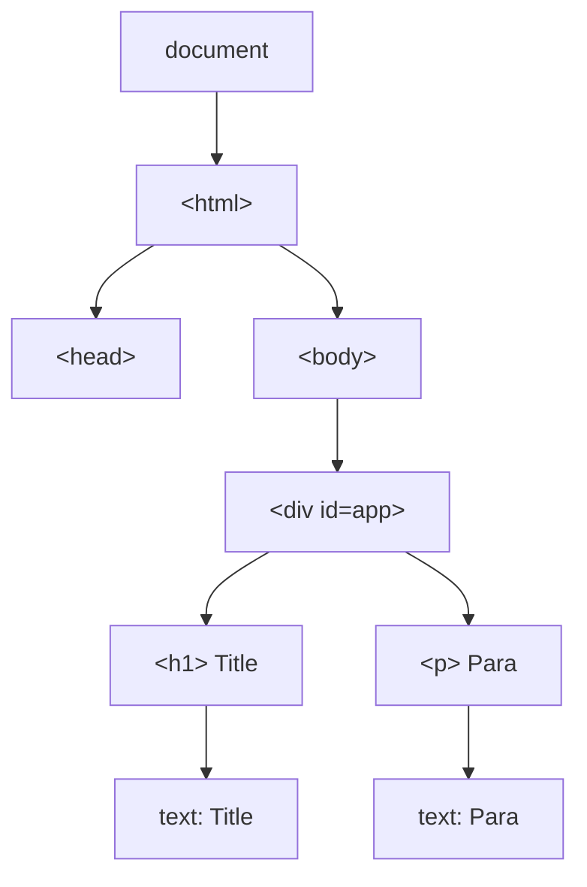
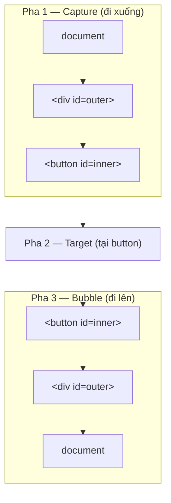

# DOM Manipulation và Events

**DOM** (Document Object Model — cây cấu trúc biểu diễn toàn bộ các phần tử của một trang web) là cầu nối giúp JavaScript đọc và thay đổi nội dung, kiểu dáng của trang. **DOM Manipulation** (thao tác DOM) là việc dùng JavaScript để chọn, thêm, sửa hoặc xóa các phần tử HTML. **Events** (sự kiện) là các hành động của người dùng như nhấp chuột hay gõ phím, và bạn dùng **event listener** (bộ lắng nghe sự kiện) để chạy code phản hồi lại những hành động đó.

---

:::note[Ghi nhớ nhanh]

- ⭐ **DOM là cây object** — trình duyệt biến HTML tĩnh thành cây `node` mà JavaScript đọc/sửa được, nhờ đó có trang động và SPA không cần reload.
- **Selectors** — `querySelector`/`querySelectorAll` (hỗ trợ CSS selector) là lựa chọn ưu tiên; `getElementsBy*` trả về collection **live** tự cập nhật nhưng chậm hơn.
- ⭐ **`textContent` an toàn, `innerHTML` gây XSS** — với input người dùng luôn dùng `textContent` hoặc sanitize (`DOMPurify`) trước khi gán `innerHTML`.
- **Event listener** — `addEventListener` với các options `once`/`capture`/`passive`/`signal`; dùng `AbortController` để hủy nhiều listener cùng lúc.
- **3 pha của event** — capture → target → bubble; `stopPropagation()` chặn lan toả, `preventDefault()` chặn hành vi mặc định.
- **Event delegation** — gắn 1 listener ở parent xử lý cho nhiều children, ít memory hơn và tự chạy với element thêm động (chính là cơ chế React dùng dưới hood).

:::

---

## Mục lục

- [Vì sao có DOM API?](#vì-sao-có-dom-api)
- [DOM là gì?](#dom-là-gì)
- [Selectors](#selectors)
- [DOM Manipulation](#dom-manipulation)
- [Event Listeners](#event-listeners)
- [Event Bubbling và Capturing](#event-bubbling-và-capturing)
- [Event Delegation](#event-delegation)
- [Câu hỏi phỏng vấn](#câu-hỏi-phỏng-vấn)

---

## Vì sao có DOM API?

**Vấn đề:** HTML viết ra là **tĩnh** — render xong là cố định. Nhưng ta
muốn nội dung trang **thay đổi** theo tương tác: bấm nút, gõ vào ô input,
dữ liệu mới fetch về... mà **không tải lại cả trang**. Bản thân HTML không
cho JavaScript "với tới" để sửa.

```html
<!-- HTML chỉ là văn bản tĩnh, không tự đổi được -->
<button>Tăng</button>
<span>Số lượng: 0</span>
<!-- Bấm nút thì làm sao đổi "0" thành "1"? -->
```

**Giải pháp:** Trình duyệt biểu diễn trang HTML thành **DOM** (Document
Object Model) — một **cây object** mà JavaScript đọc và sửa được. Nhờ đó
có trang web động và SPA.

```js
const span = document.querySelector("span"); // chọn phần tử
let count = 0;

document.querySelector("button").addEventListener("click", () => {
  count += 1;
  span.textContent = `Số lượng: ${count}`; // sửa nội dung, không reload
});
```

Qua DOM, JS có thể: **chọn** phần tử (`querySelector`), **đổi** nội
dung/thuộc tính, **thêm/xoá** node, và **lắng nghe** sự kiện
(`addEventListener`).

:::tip[Dùng thực tế]

- **Cập nhật UI khi bấm nút**: đổi text, ẩn/hiện, bật/tắt class.
- **Hiển thị dữ liệu fetch về**: render danh sách sau khi gọi API.
- **Validate & hiện lỗi form**: kiểm tra input rồi chèn thông báo lỗi.
- **Tạo/xoá phần tử động**: thêm hoặc bỏ item trong todo list.

:::

---

## DOM là gì?

**DOM (Document Object Model)** là cấu trúc cây mà trình duyệt tạo ra
từ HTML — mỗi thẻ là một **node**.

```html
<div id="app">
  <h1>Title</h1>
  <p>Para</p>
</div>
```

Trình duyệt biến HTML trên thành **cây node**: `document` là gốc, mỗi thẻ
là một element node, còn chữ bên trong là text node — JavaScript đi lại và
sửa từng node trên cây này:



JavaScript truy cập DOM qua `document`:

```js
document.title;
document.body;
document.documentElement; // <html>
```

---

## Selectors

API tìm element trong DOM:

```js
// Tìm 1 element
document.getElementById("app");
document.querySelector("#app");
document.querySelector(".btn.primary");
document.querySelector("ul > li:first-child");

// Tìm nhiều element
document.querySelectorAll(".btn");          // NodeList
document.getElementsByClassName("btn");     // HTMLCollection (live)
document.getElementsByTagName("li");        // HTMLCollection (live)
```

| API | Trả về | Live? | Hỗ trợ CSS selector |
|-----|--------|-------|---------------------|
| `getElementById` | Element \| null | - | Không |
| `getElementsByClassName` | HTMLCollection | **Có** | Không |
| `getElementsByTagName` | HTMLCollection | **Có** | Không |
| `querySelector` | Element \| null | - | **Có** |
| `querySelectorAll` | NodeList | Không | **Có** |

:::info[Phân tích]

**Live vs Static collection**:

- **Live** (`getElementsBy*`): tự cập nhật khi DOM thay đổi.
- **Static** (`querySelectorAll`): chụp ảnh tại thời điểm gọi.

```js
const items = document.getElementsByClassName("item");
console.log(items.length); // 3

document.body.appendChild(newItem); // thêm 1 item

console.log(items.length); // 4 — tự cập nhật

const items2 = document.querySelectorAll(".item");
// items2.length vẫn = 3 dù DOM thay đổi
```

Live collection thuận tiện nhưng **chậm hơn** vì phải invalidate cache.
Trong code mới, hầu như chỉ dùng `querySelector`/`querySelectorAll` để
tránh nhầm.

:::

---

## DOM Manipulation

**Tạo và chèn element:**

```js
const div = document.createElement("div");
div.textContent = "Hello";
div.className = "box";

document.body.appendChild(div);
document.body.prepend(div);            // chèn đầu
document.body.insertBefore(div, ref);  // chèn trước ref

div.remove();                          // xoá khỏi DOM
```

**Sửa nội dung:**

```js
el.textContent = "plain text";        // an toàn
el.innerHTML = "<b>html</b>";          // nguy hiểm (XSS)
el.innerText = "rendered text";        // tính cả CSS

el.setAttribute("data-id", "1");
el.getAttribute("data-id");
el.dataset.id;                          // tương đương data-* attribute
el.classList.add("active");
el.classList.remove("disabled");
el.classList.toggle("hidden");
el.classList.contains("active");

el.style.color = "red";                 // inline style
```

:::warning[Cần lưu ý]

**`innerHTML` rất nguy hiểm với input người dùng** — gây **XSS**:

```js
const userInput = "";
el.innerHTML = userInput; // XSS — alert chạy!
```

Cách an toàn:

```js
el.textContent = userInput;  // luôn an toàn

// Hoặc sanitize trước
import DOMPurify from "dompurify";
el.innerHTML = DOMPurify.sanitize(userInput);
```

React/Vue dùng `textContent` mặc định — `dangerouslySetInnerHTML` /
`v-html` mới dùng `innerHTML` (kèm warning rõ trong tên).

:::

---

## Event Listeners

```js
button.addEventListener("click", (e) => {
  console.log("Clicked");
  console.log(e.target);
});

// Remove listener — cần cùng reference function
function handler(e) {}
button.addEventListener("click", handler);
button.removeEventListener("click", handler);
```

Options:

```js
button.addEventListener("click", handler, {
  once: true,      // chỉ chạy 1 lần
  capture: true,   // ở pha capture (mặc định bubble)
  passive: true,   // không gọi preventDefault → tối ưu scroll
  signal: controller.signal, // cancel qua AbortController
});

// Cancel listener qua AbortController (hiện đại)
const controller = new AbortController();
button.addEventListener("click", handler, { signal: controller.signal });
controller.abort(); // remove listener
```

:::tip[Mẹo]

**`AbortController` để cancel nhiều listener** cùng lúc — pattern hiện
đại:

```js
function setupComponent() {
  const ctrl = new AbortController();
  const opts = { signal: ctrl.signal };

  button.addEventListener("click", handleClick, opts);
  input.addEventListener("change", handleChange, opts);
  window.addEventListener("resize", handleResize, opts);

  // Khi component unmount
  return () => ctrl.abort(); // hủy cả 3 listener
}
```

Tương tự `useEffect` cleanup trong React — gọn hơn maintain 3 cleanup
function.

:::

---

## Event Bubbling và Capturing

Khi event xảy ra, nó **đi qua 3 pha**:

1. **Capture** — từ `document` xuống target.
2. **Target** — tại element phát sinh event.
3. **Bubble** — từ target trở lại `document`.



```html
<div id="outer">
  <button id="inner">Click</button>
</div>
```

```js
outer.addEventListener("click", () => console.log("outer"));
inner.addEventListener("click", () => console.log("inner"));

// Click vào inner:
// "inner" → "outer" (bubble)

// Bắt ở capture phase
outer.addEventListener("click", () => console.log("outer capture"), true);
// "outer capture" → "inner" → "outer"
```

`e.stopPropagation()` — chặn lan toả:

```js
inner.addEventListener("click", (e) => {
  e.stopPropagation();
  console.log("inner");
});
// Outer không nhận event
```

`e.preventDefault()` — chặn behavior mặc định:

```js
form.addEventListener("submit", (e) => {
  e.preventDefault();
  // không submit reload page
});

link.addEventListener("click", (e) => {
  e.preventDefault();
  // không navigate
});
```

---

## Event Delegation

**Pattern**: gắn một listener ở parent, xử lý event của nhiều children.

```html
<ul id="list">
  <li>A</li>
  <li>B</li>
  <li>C</li>
</ul>
```

```js
// Tệ — gắn n listener
document.querySelectorAll("#list li").forEach(li => {
  li.addEventListener("click", handler);
});

// Tốt — 1 listener
document.getElementById("list").addEventListener("click", (e) => {
  if (e.target.tagName === "LI") {
    console.log(e.target.textContent);
  }
});
```

Lợi ích:

- Ít memory hơn (1 listener vs n).
- Hoạt động với **element thêm động** (không cần re-attach).
- Code gọn hơn.

:::info[Phân tích]

Event delegation là **cơ chế chính** mà React dùng dưới hood. Trong
React 17+, mọi event được gắn ở **root** (`#root`), không phải từng
element:

```jsx
<button onClick={handleClick}>Click</button>
```

React thực ra không gắn `onclick` lên button — nó dùng synthetic event
system với 1 listener ở root, sau đó dispatch về component đúng vị trí
trong tree.

Lợi ích React tận dụng:
- Tối ưu memory (1 listener cho cả app).
- Cross-browser event normalization.
- React batches state updates trong cùng event.

Hiểu cơ chế này giúp debug khi gặp lỗi event trong React (vd
`stopPropagation` không hoạt động như mong đợi vì event đã bubble qua
React root).

:::

---

## Câu hỏi phỏng vấn

Những câu thường gặp về chủ đề này. Tự trả lời trước, rồi đối chiếu lại với nội dung phía trên.

1. `DOM` là gì? Phân biệt HTML (văn bản tĩnh) với DOM (cây object) — trình duyệt tạo ra DOM ở bước nào?
2. So sánh `getElementById`, `getElementsByClassName`, `querySelector` và `querySelectorAll` — mỗi cái trả về kiểu gì và khác nhau ra sao?
3. `HTMLCollection` là `live collection` còn `NodeList` từ `querySelectorAll` là `static` — khác biệt này gây bug thế nào khi bạn vừa duyệt vừa xoá phần tử?
4. `NodeList` có phải Array không? Làm sao dùng `map`/`filter` trên kết quả của `querySelectorAll`?
5. So sánh `textContent`, `innerText` và `innerHTML`: cái nào tính tới CSS, cái nào tốn `reflow`, cái nào nguy hiểm?
6. Vì sao gán `innerHTML` bằng dữ liệu người dùng gây `XSS`? Nêu ví dụ payload và các cách phòng tránh.
7. Phân biệt `attribute` và `property` của một element — đoán kết quả `input.value` và `input.getAttribute("value")` sau khi người dùng gõ vào ô input.
8. `addEventListener` khác gì gán trực tiếp `el.onclick = fn`? Vì sao `removeEventListener` với một arrow function viết inline lại không gỡ được listener?
9. Giải thích các option `once`, `capture`, `passive`, `signal` của `addEventListener`. `passive: true` giúp gì cho hiệu năng scroll?
10. Mô tả ba pha lan truyền của một event: `capture` → `target` → `bubble`. Listener đăng ký mặc định chạy ở pha nào?
11. Phân biệt `preventDefault()`, `stopPropagation()` và `stopImmediatePropagation()`.
12. Đoán output: `outer` có listener ở cả pha capture và bubble, `inner` có một listener; click vào `inner` thì thứ tự log là gì?
13. Phân biệt `event.target` và `event.currentTarget`. Trong `event delegation` bạn dùng cái nào và vì sao?
14. `Event delegation` là gì? Nêu các lợi ích về bộ nhớ và với những element được thêm động sau khi trang đã load.
15. Khi `li` chứa một `span` bên trong, click vào `span` thì `e.target` là gì? Làm sao xử lý đúng bằng `closest()`?
16. Những event nào KHÔNG bubble (`focus`, `blur`, `mouseenter`, ...)? Khi cần delegation cho chúng thì thay thế bằng gì?
17. React 17+ gắn event listener ở đâu trong DOM? Điều đó gây bất ngờ gì khi bạn trộn `stopPropagation` giữa event native và `synthetic event`?
18. `Reflow` và `repaint` là gì? Vì sao chèn 1000 element bằng vòng lặp `appendChild` lại chậm, và `DocumentFragment` giúp gì?
